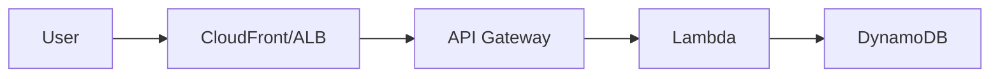

# VAMS Documentation Development Workflow & Rules

This document provides comprehensive guidelines for creating, updating, and maintaining VAMS documentation. Follow these rules to ensure consistency, accuracy, and quality across all documentation pages.

## 🏗️ **Architecture Overview**

### **Documentation Framework**

| Component             | Technology                                 | Purpose                              |
| --------------------- | ------------------------------------------ | ------------------------------------ |
| Static site generator | Docusaurus 3.x (React-based SSG)           | Markdown to static HTML              |
| Language              | TypeScript                                 | Config files and custom components   |
| Markdown format       | CommonMark (`.md`) with `format: 'detect'` | Standard Markdown (not MDX) for docs |
| Diagrams              | @docusaurus/theme-mermaid                  | Mermaid diagrams in code blocks      |
| Theme                 | GitHub Docs inspired                       | Custom CSS in `src/css/custom.css`   |
| Deployment            | GitLab Pages + GitHub Pages                | CI/CD automated deployment           |

### **File Structure Standards**

```
documentation/
├── CLAUDE.md                        # Documentation steering document
├── VAMS_API.yaml                    # OpenAPI specification for all endpoints
├── diagrams/                        # Architecture diagrams (source PNGs, draw.io)
├── permissionsTemplates/            # Permission constraint JSON templates
└── docusaurus-site/
    ├── docusaurus.config.ts         # Docusaurus configuration
    ├── sidebars.ts                  # Sidebar navigation structure
    ├── package.json                 # npm dependencies
    ├── src/
    │   └── css/
    │       └── custom.css           # Custom theme CSS
    ├── static/
    │   └── img/                     # Static images referenced in docs
    └── docs/                        # Source Markdown files (78+ pages)
        ├── index.md                 # Landing page
        ├── overview/                # Solution overview, benefits, use cases, features, costs
        ├── concepts/                # Core concepts: databases, assets, files, pipelines, metadata, permissions
        ├── architecture/            # Architecture overview, details, AWS resources, security, networking, data model
        ├── deployment/              # Prerequisites, deploy, config reference, external S3, update, uninstall
        ├── user-guide/              # Getting started, web UI, upload tutorial, asset mgmt, search, metadata, permissions
        ├── cli/                     # CLI getting started, installation, command reference, automation
        ├── pipelines/               # Pipeline overview + 10 individual pipeline docs + custom pipeline guide
        ├── developer/               # Dev setup, backend, frontend, CDK, viewer plugins, audit logging
        ├── api/                     # API overview, auth, assets, files, metadata, search, pipelines, workflows, tags
        ├── troubleshooting/         # Common issues, known limitations, FAQ
        └── additional/              # Quotas, partner integrations, viewer plugins ref, notices, revisions
```

### **Navigation Structure (sidebars.ts)**

The sidebar uses a hierarchical tree with collapsible categories:

```
Home (index.md)
├── Overview (5 pages)
├── Core Concepts (8 pages)
├── Architecture (6 pages)
├── Deployment (7 pages)
├── User Guide (11 pages)
└── Developer Guide
    ├── Setup, Backend, Frontend, CDK, Viewer Plugins, Audit Logging
    ├── CLI Reference (4+ pages with commands/ subcategory)
    ├── Pipelines (11 pages)
    ├── API Reference (11 pages)
    └── Troubleshooting (3 pages)
Additional (5 pages)
```

---

## 📋 **Development Workflow Checklist**

### **Phase 1: Pre-Implementation**

-   [ ] **Identify scope**: Determine which documentation pages need creating or updating
-   [ ] **Cross-reference source code**: Check relevant source files for accuracy (see Key Files table below)
-   [ ] **Check existing content**: Avoid duplicating content already on another page
-   [ ] **Plan sidebar placement**: Determine where new pages belong in `sidebars.ts`
-   [ ] **Gather screenshots/diagrams**: Prepare any visual assets needed

### **Phase 2: Implementation**

#### **Step 1: Write or Update Content**

-   [ ] **Follow writing style**: AWS documentation standards (see Writing Style Rules)
-   [ ] **Use Docusaurus admonitions**: `:::note`, `:::tip`, `:::warning`, `:::danger`, `:::info`
-   [ ] **Include code blocks**: With language tags (`bash`, `python`, `typescript`, `json`)
-   [ ] **Add cross-references**: Use relative links `[Page Title](../section/page.md)`
-   [ ] **Escape curly braces**: Use `\{variable\}` outside code blocks
-   [ ] **Add frontmatter**: Include `title`, `sidebar_label`, `description` where needed

#### **Step 2: Update Navigation**

-   [ ] **Update sidebars.ts**: Add new pages to the correct category
-   [ ] **Verify page ordering**: Ensure logical flow within sections
-   [ ] **Check parent categories**: Ensure collapsible categories are correct

#### **Step 3: Add Visual Assets**

-   [ ] **Add images to static/img/**: Use descriptive file names
-   [ ] **Reference images correctly**: Use `/img/filename.png` paths
-   [ ] **Add diagrams**: Use Mermaid code blocks for flow/architecture diagrams

### **Phase 3: Quality Assurance**

#### **Step 4: Build and Verify**

-   [ ] **Run local build**: `cd documentation/docusaurus-site && npm run build`
-   [ ] **Check for broken links**: Build output reports broken references
-   [ ] **Preview locally**: `npm run start` and verify rendering
-   [ ] **Verify admonitions**: Ensure `:::` syntax renders correctly
-   [ ] **Check code blocks**: Verify syntax highlighting and accuracy

#### **Step 5: Cross-Reference Accuracy**

-   [ ] **Verify against source code**: Configuration options match `config.ts`
-   [ ] **Verify API endpoints**: Match `apiBuilder-nestedStack.ts` and `VAMS_API.yaml`
-   [ ] **Verify CLI commands**: Match `tools/VamsCLI/vamscli/commands/`
-   [ ] **Verify feature flags**: Match `infra/common/vamsAppFeatures.ts`
-   [ ] **No hardcoded versions**: Reference source of truth files instead

---

## 🚨 **Mandatory Rules**

### **Rule 1: Use Docusaurus Admonition Syntax**

Always use Docusaurus-style admonitions. NEVER use MkDocs syntax.

```markdown
<!-- CORRECT -- Docusaurus syntax -->

:::note
General information here.
:::

:::warning[Important Configuration]
Be careful when changing this setting.
:::

:::tip
This can improve performance.
:::

:::danger
This will delete all data permanently.
:::

<!-- INCORRECT -- MkDocs syntax (will NOT render) -->

!!! note
General information here.

!!! warning "Important"
Be careful.
```

### **Rule 2: Escape Curly Braces Outside Code Blocks**

MDX interprets curly braces as JSX expressions. Outside code blocks, always escape them.

```markdown
<!-- CORRECT -->

Set the value to `\{variableName\}` in the config file.

The format is `prefix-\{region\}-\{account\}`.

<!-- INCORRECT -- will cause MDX parse error -->

Set the value to {variableName} in the config file.
```

Inside code blocks (``` fenced blocks), curly braces do NOT need escaping.

### **Rule 3: Always Update sidebars.ts When Adding New Pages**

Every new documentation page MUST be added to `documentation/docusaurus-site/sidebars.ts`. A page not in the sidebar is effectively invisible.

```typescript
// In sidebars.ts -- add to the correct category
{
    type: "category",
    label: "Pipelines",
    items: [
        "pipelines/overview",
        "pipelines/new-pipeline-page",  // <-- Add new page here
        // ... existing items
    ],
},
```

### **Rule 4: Do Not Duplicate Content -- Link to Authoritative Page**

Each concept should have ONE authoritative page. Other pages should link to it rather than restating the information.

```markdown
<!-- CORRECT -- link to the authoritative page -->

For details on configuring permissions, see [Permissions Model](../concepts/permissions-model.md).

<!-- INCORRECT -- duplicating content from another page -->

## Permissions

The VAMS permission system uses two tiers: API-level and Object-level...
(paragraphs of content already on permissions-model.md)
```

### **Rule 5: Do Not Hardcode Version Numbers**

Never hardcode VAMS version numbers, Python versions, or CDK versions in documentation. Reference the source of truth.

```markdown
<!-- CORRECT -->

The current VAMS version is defined in `infra/config/config.ts`.
VAMS backend Lambdas use Python 3.12 (defined in `LAMBDA_PYTHON_RUNTIME`).

<!-- INCORRECT -->

VAMS version 2.5.0 requires Python 3.12.
```

### **Rule 6: Follow AWS Documentation Writing Standards**

1. **Tone**: Professional, formal, solution-focused
2. **AWS service names**: Always fully qualified ("Amazon DynamoDB" not "DynamoDB", "Amazon S3" not "S3")
3. **Paragraphs**: 2-4 sentences, concise
4. **Headings**: `##` for main sections, `###` for subsections
5. **Code blocks**: Always include language tags
6. **Tables**: Use for comparisons, feature lists, field references
7. **Never reference other AWS solutions** by name

### **Rule 7: Include Language Tags in All Code Blocks**

Every code block must have a language specifier for proper syntax highlighting.

````markdown
<!-- CORRECT -->

```bash
cd infra && npx cdk deploy --all
```

```python
def lambda_handler(event, context):
    return {"statusCode": 200}
```

```json
{
    "enabled": true
}
```

<!-- INCORRECT -- no language tag -->

```
cd infra && npx cdk deploy --all
```
````

### **Rule 8: Use Mermaid for Diagrams Where Possible**

Prefer Mermaid code blocks for architectural and flow diagrams (maintainable in source control):

````markdown

````

Use static images from `static/img/` only for complex diagrams that Mermaid cannot express.

### **Rule 9: Use Relative Links for Cross-References**

Always use relative Markdown file paths for links between documentation pages.

```markdown
<!-- CORRECT -->

[Configuration Reference](../deployment/configuration-reference.md)
[Permissions Model](../concepts/permissions-model.md)

<!-- INCORRECT -- absolute URL -->

[Configuration Reference](https://docs.example.com/deployment/configuration-reference)

<!-- INCORRECT -- no file extension -->

[Configuration Reference](../deployment/configuration-reference)
```

### **Rule 10: Reference Images from /img/ Path**

Images in `static/img/` are served at `/img/` in the built site.

```markdown
<!-- CORRECT -->


<!-- INCORRECT -- wrong path -->


```

### **Rule 11: Do Not Use HTML Directly in Markdown**

Use standard Markdown or Docusaurus components instead of raw HTML.

```markdown
<!-- CORRECT -->

**Bold text** and _italic text_

| Column 1 | Column 2 |
| -------- | -------- |
| Data     | Data     |

<!-- INCORRECT -->

<b>Bold text</b> and <i>italic text</i>

<table><tr><td>Data</td></tr></table>
```

### **Rule 12: Update Steering Files When Documentation Standards Change**

When documentation standards, patterns, or structure change, update all three locations:

1. `documentation/CLAUDE.md` -- documentation steering document
2. `.kiro/steering/DOCUMENTATION_WORKFLOW.md` -- this file
3. `.clinerules/workflows/DOCUMENTATION_WORKFLOW.md` -- identical copy

---

## 📋 **When to Update Documentation**

| Change Type             | Documentation to Update                                                                        |
| ----------------------- | ---------------------------------------------------------------------------------------------- |
| New API endpoint        | `api/` relevant page, `VAMS_API.yaml`, `cli/command-reference.md` (if CLI updated)             |
| New config option       | `deployment/configuration-reference.md`                                                        |
| New pipeline            | `pipelines/` new page + `pipelines/overview.md` table + `overview/features.md` + `sidebars.ts` |
| New viewer plugin       | `developer/viewer-plugins.md`, `additional/viewer-plugins.md`, `overview/features.md`          |
| New DynamoDB table      | `architecture/aws-resources.md`, `architecture/data-model.md`                                  |
| Permission model change | `concepts/permissions-model.md`, `user-guide/permissions.md`                                   |
| New CLI command         | `cli/command-reference.md`, `cli/automation.md` (if new patterns)                              |
| UI navigation change    | `user-guide/web-interface.md`, `user-guide/getting-started.md`                                 |
| Breaking change         | `additional/revisions.md`, `deployment/update-the-solution.md`                                 |
| New feature             | `overview/features.md`, relevant user guide page                                               |
| New sidebar page        | `sidebars.ts` -- add the page to the appropriate category                                      |

---

## 🔍 **Key Files to Cross-Reference**

When writing or verifying documentation, cross-reference these source files to ensure accuracy:

| Documentation Topic  | Source Files                                                                  |
| -------------------- | ----------------------------------------------------------------------------- |
| Config options       | `infra/config/config.ts` (ConfigPublic interface)                             |
| API endpoints        | `infra/lib/nestedStacks/apiLambda/apiBuilder-nestedStack.ts`, `VAMS_API.yaml` |
| DynamoDB tables      | `infra/lib/nestedStacks/storage/storageBuilder-nestedStack.ts`                |
| Feature flags        | `infra/common/vamsAppFeatures.ts`                                             |
| Backend handlers     | `backend/backend/handlers/`                                                   |
| Pydantic models      | `backend/backend/models/`                                                     |
| CLI commands         | `tools/VamsCLI/vamscli/commands/`                                             |
| Viewer plugins       | `web/src/visualizerPlugin/config/viewerConfig.json`                           |
| Lambda builders      | `infra/lib/lambdaBuilder/`                                                    |
| Pipeline configs     | `infra/lib/nestedStacks/pipelines/`                                           |
| Frontend routes      | `web/src/routes.tsx`                                                          |
| Synonyms             | `web/src/synonyms.tsx`                                                        |
| Permission templates | `documentation/permissionsTemplates/`                                         |

---

## 📐 **Gold Standard Reference Files**

| Purpose                 | File                                         |
| ----------------------- | -------------------------------------------- |
| Docusaurus config       | `docusaurus-site/docusaurus.config.ts`       |
| Sidebar structure       | `docusaurus-site/sidebars.ts`                |
| Well-structured concept | `docs/concepts/permissions-model.md`         |
| Config reference format | `docs/deployment/configuration-reference.md` |
| Pipeline documentation  | `docs/pipelines/overview.md`                 |
| API reference format    | `docs/api/assets.md`                         |
| User guide format       | `docs/user-guide/getting-started.md`         |
| Developer setup         | `docs/developer/setup.md`                    |
| OpenAPI spec            | `VAMS_API.yaml`                              |

---

## 📝 **Writing Templates**

### **New Documentation Page Template**

````markdown
---
title: Page Title
sidebar_label: Short Label
description: Brief description for SEO and link previews.
---

# Page Title

Brief introduction paragraph (2-3 sentences) explaining what this page covers and who it is for.

## Prerequisites

:::note
List any prerequisites or prior knowledge needed.
:::

## Section Heading

Content paragraphs here. Keep to 2-4 sentences per paragraph.

### Subsection

More detailed content.

```bash
# Example command
command --flag value
```
````

## Configuration

| Option                | Default | Description         |
| --------------------- | ------- | ------------------- |
| `app.feature.enabled` | `false` | Enables the feature |

## Related Pages

-   [Related Page 1](../section/page1.md)
-   [Related Page 2](../section/page2.md)

````

### **New Pipeline Documentation Template**

```markdown
---
title: Pipeline Name Pipeline
sidebar_label: Pipeline Name
description: Description of what this pipeline does.
---

# Pipeline Name Pipeline

Brief overview of the pipeline purpose and capabilities.

## Overview

What the pipeline does, what inputs it takes, what outputs it produces.

## Architecture

```mermaid
flowchart LR
    A[Input] --> B[Lambda]
    B --> C[AWS Batch Container]
    C --> D[Output]
````

## Configuration

Enable this pipeline in `infra/config/config.json`:

```json
{
    "app": {
        "pipelines": {
            "pipelineName": {
                "enabled": true
            }
        }
    }
}
```

| Option                 | Default | Description                 |
| ---------------------- | ------- | --------------------------- |
| `enabled`              | `false` | Enable the pipeline         |
| `autoRegisterWithVAMS` | `true`  | Auto-register on deployment |

## Input Requirements

Describe input file types, formats, and constraints.

## Output

Describe what the pipeline produces.

## Troubleshooting

Common issues and solutions.

````

### **New API Reference Page Template**

```markdown
---
title: Resource Name API
sidebar_label: Resource Name
description: API reference for Resource Name operations.
---

# Resource Name API

## List Resources

````

GET /database/{databaseId}/resources

````

### Parameters

| Parameter | Type | Required | Description |
| --------- | ---- | -------- | ----------- |
| `databaseId` | path | Yes | Database identifier |

### Response

```json
{
    "Items": [],
    "nextToken": "..."
}
````

## Get Resource

```
GET /database/{databaseId}/resources/{resourceId}
```

### Parameters

| Parameter    | Type | Required | Description         |
| ------------ | ---- | -------- | ------------------- |
| `databaseId` | path | Yes      | Database identifier |
| `resourceId` | path | Yes      | Resource identifier |

````

---

## 🚀 **Build Commands**

```bash
# Install dependencies
cd documentation/docusaurus-site
npm install

# Local preview with live reload
npm run start
# Opens http://localhost:3000

# Build static site (also validates links)
npm run build
# Output in documentation/docusaurus-site/build/

# Serve built site locally
npm run serve
````

### **CI/CD Deployment**

Documentation is deployed automatically via CI/CD when changes are pushed to `main` or `release/*` branches:

-   **GitLab**: `.gitlab-ci.yml` -- builds with `node:20-slim`, outputs to `public/` for GitLab Pages
-   **GitHub**: `.github/workflows/docs.yml` -- builds and deploys via GitHub Pages

Both pipelines only trigger when files under `documentation/docusaurus-site/` change.

---

## 🔍 **Quality Review Checklist**

### **Content Accuracy**

-   [ ] All configuration options match `infra/config/config.ts`
-   [ ] All API endpoints match `VAMS_API.yaml` and route definitions
-   [ ] All CLI commands match current `tools/VamsCLI/vamscli/commands/`
-   [ ] Feature flags match `infra/common/vamsAppFeatures.ts`
-   [ ] No hardcoded version numbers
-   [ ] AWS service names fully qualified

### **Formatting Compliance**

-   [ ] Docusaurus admonition syntax used (not MkDocs)
-   [ ] Curly braces escaped outside code blocks
-   [ ] All code blocks have language tags
-   [ ] Images reference `/img/` path
-   [ ] Cross-references use relative Markdown links
-   [ ] No raw HTML in Markdown
-   [ ] Tables properly formatted

### **Navigation**

-   [ ] New pages added to `sidebars.ts`
-   [ ] Pages appear in correct category
-   [ ] Logical ordering within sections
-   [ ] No orphaned pages (pages not in sidebar)

### **Build Verification**

-   [ ] `npm run build` succeeds without errors
-   [ ] No broken link warnings
-   [ ] Admonitions render correctly
-   [ ] Code blocks have proper syntax highlighting
-   [ ] Mermaid diagrams render

---

## 🚫 **Anti-Patterns Summary**

1. **Using MkDocs admonition syntax** (`!!! note`) -- use Docusaurus (`:::note`)
2. **Unescaped curly braces** outside code blocks -- causes MDX parse errors
3. **Missing sidebar entries** -- new pages are invisible without `sidebars.ts` update
4. **Duplicating content** across pages -- link to the authoritative page instead
5. **Hardcoding version numbers** -- reference source of truth files
6. **Missing language tags** on code blocks -- always specify the language
7. **Using raw HTML** in Markdown -- use Markdown or Docusaurus components
8. **Referencing other AWS solutions** by name -- VAMS documentation is standalone
9. **Using absolute URLs** for cross-references -- use relative Markdown paths
10. **Leaving placeholder pages** -- every sidebar entry must have real content
11. **Forgetting to update `sidebars.ts`** when adding new pages
12. **Using barrel imports** in any custom React components in documentation
