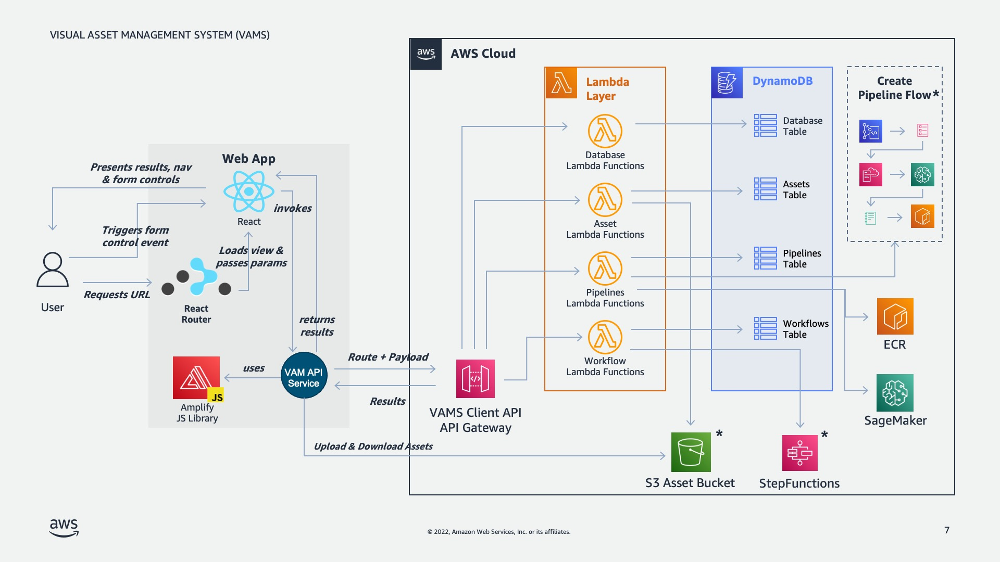

<h1> VAMS Developer Guide </h1>

## Install

### Requirements

-   Python 3.10
-   Poetry (for managing python dependencies in the VAMS backend)
-   Docker
-   Node >=18.x
-   Yarn >=1.22.19
-   Node Version Manager (nvm)
-   AWS CDK cli
-   Programatic access to AWS account at minimum access levels outlined above.

### Deploy VAMS for the First Time

#### Build & Deploy Steps (Linux/Mac)

VAMS Codebase is changing frequently and we recommend you checkout the stable released version from github.

You can identify stable releases by their tag. Fetch the tags git fetch --all --tags and then git checkout tags/v1.0.1 or git checkout -b v1.0.1 tags/v1.0.1.

1. `cd ./web && nvm use` - make sure you're node version matches the project. Make sure Docker daemon is running.

2. `yarn install` - make sure you install the packages required by the web app

3. `npm run build` - build the web app.

4. `cd ../infra && npm install` - installs dependencies defined in package.json.

5. If you haven't already bootstrapped your aws account with CDK. `cdk bootstrap aws://101010101010/us-east-1` - replace with your account and region.

6. Set the CDK stack name and the region for deployment with environment variables `export AWS_REGION=us-east-1 && export STACK_NAME=dev` - replace with the region you would like to deploy to and the name you want to associate with the cloudformation stack that the CDK will deploy.

7. `npm run deploy.dev adminEmailAddress=myuser@example.com` - replace with your email address to deploy. An account is created in an AWS Cognito User Pool using this email address. Expect an email from no-reply@verificationemail.com with a temporary password.

#### Deployment Success

1. Navigate to URL provided in `{stackName].WebAppCloudFrontDistributionDomainName{uuid}` from `cdk deploy` output.

2. Check email for temporary account password to log in with the email address you provided.

### Multiple Deployments With Different or Same Region in Single Account

You can change the region and deploy a new instance of VAMS my setting the environment variables to new values (`export AWS_REGION=us-east-1 && export STACK_NAME=dev`) and then running `npm run deploy.dev adminEmailAddress=myuser@example.com` again.

### Deploy VAMS Updates

To deploy customzations or updates to VAMS, you can update the stack by running `cdk deploy --all`. A changeset is created and deployed to your stack.

Please note, depending on what changes are in flight, VAMS may not be available to users in part or in whole during the deployment. Please read the change log carefully and test changes before exposing your users to new versions.

### SAML Authentication

SAML authentication enables you to provision access to your VAMS instance using your organization's federated identity provider such as Auth0, Active Directory, or Google Workspace.

You need your SAML metadata url, and then you can fill out the required information in `infra/lib/saml-config.ts`.

The required information is as follows:

-   `samlEnabled` must be set to `true`.
-   `name` identifies the name of your identity provider.
-   `cognitoDomainPrefix` is a DNS compatible, globally unique string used as a subdomain of cognito's signon url.
-   `metadataContent` is a url of your SAML metadata. This can also point to a local file if `metadataType` is changed to `cognito.UserPoolIdentityProviderSamlMetadataType.FILE`.

Then you can deploy the infra stack by running `cdk deploy --all` if you have already deployed or using the same build and deploy steps as above.

The following stack outputs are required by your identity provider to establish trust with your instance of VAMS:

-   SAML IdP Response URL
-   SP urn / Audience URI / SP entity ID
-   CloudFrontDistributionUrl for the list of callback urls. Include this url with and without a single trailing slack (e.g., https://example.com and https://example.com/)

SAML may be disabled in your stack by setting `samlEnabled` to false and deploying the stack.

### Role Based Authorization Policy

VAMS comes with an initial set of roles with a permissive policy that provides broad access to users once they authenticate. The policy is implemented in python in a [pre token generation Lambda trigger](https://docs.aws.amazon.com/cognito/latest/developerguide/user-pool-lambda-pre-token-generation.html). This implementation is in the file `backend/backend/handlers/auth/pretokengen.py`.

You may customize the policy by changing `pretokengen.py` to suit your needs. Follow along to see how.

Below are two examples of an `event` received by `pretokengen.py`. The first example shows user authentication event via the Cognito Identity Provider and the user belongs to the `super-admin` and `group1` groups.

```
{
 "version": "1",
 "triggerSource": "TokenGeneration_RefreshTokens",
 "region": "us-east-1",
 "userPoolId": "YOUR USER POOL ID",
 "userName": "YOUR USER",
 "callerContext": {
  "awsSdkVersion": "aws-sdk-unknown-unknown",
  "clientId": "YOUR CLIENT ID"
 },
 "request": {
  "userAttributes": {
   "sub": "YOUR SUB",
   "cognito:user_status": "CONFIRMED",
   "email_verified": "true",
   "email": "YOUR EMAIL"
  },
  "groupConfiguration": {
   "groupsToOverride": [
    "super-admin",
    "group1"
   ],
   "iamRolesToOverride": [],
   "preferredRole": null
  }
 },
 "response": {
  "claimsOverrideDetails": null
 }
}
```

The next event shows a user authenticated via a Azure Active Directory via SAML.

```
{
 "version": "1",
 "triggerSource": "TokenGeneration_HostedAuth",
 "region": "us-east-1",
 "userPoolId": "USERPOOLID",
 "userName": "AZUREUSERID",
 "callerContext": {
  "awsSdkVersion": "aws-sdk-unknown-unknown",
  "clientId": "CLIENTID"
 },
 "request": {
  "userAttributes": {
   "sub": "3512c2ad-f902-44b2-903e-3ff8c9c27d5a",
   "identities": "[{\"userId\":\"...\",\"providerName\":\"azuread1\",\"providerType\":\"SAML\",\"issuer\":\"https://sts.windows.net/UUID/\",\"primary\":true,\"dateCreated\":1111111111111}]",
   "cognito:user_status": "EXTERNAL_PROVIDER",
   "name": "USERNAME",
   "custom:groups": "[GROUPID1, GROUPID2]"
  },
  "groupConfiguration": {
   "groupsToOverride": [
    "USERPOOLID_azuread1"
   ],
   "iamRolesToOverride": [],
   "preferredRole": null
  }
 },
 "response": {
  "claimsOverrideDetails": null
 }
}
```

In this example you can see that the user belongs to the group `USERPOLID_azuread1` in the Cognito User Pool. You can also see that there is a `custom:groups` mapping that includes claims provided by the federated identity provider.

Any data contained in these messages or additional claims that you can map from your federated identity provider can be used as input to a policy to map the four different VAMS roles to your users.

In `pretokengen.py` you will find a function, `determine_vams_roles` that contains a permissive policy by default.

As an example, let's create a policy that maps vams roles to different groups according to their roles and responsibilities. A creative department needs access to assets. The engineering department needs access to create pipelines and workflows. Both the creative and engineering department users belong to groups in the identity provider that designates their role in the organization. Finally, a group of administrators has access to all functions.

The following `determine_vams_roles` function sets this policy:

```
def determine_vams_roles(event):
    """determine the VAMS roles for a user based on their Cognito group list"""

    # Default set of roles
    roles = []
    try:
        cognito_groups = event['request']['groupConfiguration']['groupsToOverride']
        if "super-admin" in cognito_groups:
            roles.append("super-admin")

        if "creative_dept" in cognito_groups:
            roles.append("assets")

        if "engineering_dept" in cognito_groups:
            roles.append("pipelines", "workflows")

        return roles

    except Exception as ex:
        logger.warn("groups were not assigned to user", traceback.format_exc(ex))
        return roles
```

This new `determine_vams_roles` can replace the existing function in `pretokengen.py`. Once the file is saved, you can update the stack by running `cdk deploy` to deploy the new version of the function.

# Implementing pipelines outside of Lambda or Sagemeker

To process an asset through VAMS using an external system or when a job can take longer than the Lambda timeout of 15 minutes, it is recommended that you use the _Wait for a Callback with the Task Token_ feature so that the Pipeline Lambda can initiate your job and then exit instead of waiting for the work to complete before it also finishes. This reduces your Lambda costs and helps you avoid failed jobs that fail simply because they take longer than the timeout to complete.

To use _Wait for a call back with the Task Token_, enable the option to use Task Tokens on the create pipeline screen. When using this option, you must explicitly make a callback to the Step Functions API with the Task Token in the event passed to your Lambda function. The Task Token is provided in the event with the key `TaskToken`. You can see this using the Step Functions execution viewer under the Input tab for an execution with the call back enabled. Pass the `TaskToken` to the system that can notify the Step Functions API that the work is complete with the `SendTaskSuccess` message.

`SendTaskSuccess` is sent with the [aws cli](https://docs.aws.amazon.com/cli/latest/reference/stepfunctions/send-task-success.html#send-task-success) like this:

```
aws stepfunctions send-task-success --task-token 'YOUR_TASK_TOKEN' --task-output '{"status": "success"}'
```

Or, in python [using boto3, like this](https://boto3.amazonaws.com/v1/documentation/api/latest/reference/services/stepfunctions/client/send_task_success.html):

```
response = client.send_task_success(
    taskToken='string',
    output='string'
)
```

For other platforms, see the SDK documentation.

For task failures, see the adjacent api calls for `SendTaskFailure`.

Two additional settings enable your job to end with a timeout error by defining a task timeout. This can reduce your time to detect a problem with your task. By default, the timeout is over a year when working with task tokens. To set a timeout, specify a Task Timeout on the create pipeline screen.

If you would like your job check in to show that it is still running and fail the step if it does not check in within some amount of time less than the task timeout, define the Task Heartbeat Timeout on the create pipeline screen also. If more time than the specified seconds elapses between heartbeats from the task, this state fails with a States.Timeout error name.

# Uninstalling

1. Run `cdk destroy` from infra folder
2. Some resources may not be deleted by CDK (e.g S3 buckets and DynamoDB table) and you will have to delete them via aws cli or using aws console

Note:

After running CDK destroy there might still some resources be running in AWS that will have to be cleaned up manually as CDK does not delete some resources.

# Deployment Overview

The CDK deployment deploys the VAMS stack into your account. The components that are created by this app are:

1. Web app hosted on [cloudfront](https://aws.amazon.com/cloudfront/) distribution
1. [API Gateway](https://aws.amazon.com/api-gateway/) to route front end calls to api handlers.
1. [Lambda](https://aws.amazon.com/lambda/) Lambda handlers are created per API path.
1. [DynamoDB](https://aws.amazon.com/dynamodb/) tables to store Workflows, Assets, Pipelines
1. [S3 Buckets](https://aws.amazon.com/s3/) for assets, cdk deployments and log storage
1. [Jupyter Notebook](https://docs.aws.amazon.com/dlami/latest/devguide/setup-jupyter.html) is created one per pipeline
1. [Sagemaker](https://docs.aws.amazon.com/sagemaker/latest/dg/processing-job.html) Processing jobs are created per pipeline execution
1. [Cognito User Pool](https://docs.aws.amazon.com/cognito/) for authentication
1. [Open Search Collection](https://aws.amazon.com/opensearch-service/features/serverless/) for searching the assets using metadata
   

# API Schema:

Please see [Swagger Spec](https://github.com/awslabs/visual-asset-management-system/blob/main/VAMS_API.yaml) for details

# Database Schema

| Table                         | Partition Key | Sort Key   | Attributes                                                                                                                        |
| ----------------------------- | ------------- | ---------- | --------------------------------------------------------------------------------------------------------------------------------- |
| AssetStorageTable             | databaseId    | assetId    | assetLocation, assetName, assetType, currentVersion, description, generated_artifacts, isDistributable, previewLocation, versions |
| JobStorageTable               | jobId         | databaseId |                                                                                                                                   |
| PipelineStorageTable          | databaseId    | pipelineId | assetType, dateCreated, description, enabled, outputType, pipelineType                                                            |
| DatabaseStorageTable          | databaseId    | n/a        | assetCount, dateCreated, description                                                                                              |
| WorkflowStorageTable          | databaseId    | workflowId | dateCreated, description, specifiedPipelines, workflow_arn                                                                        |
| WorkflowExecutionStorageTable | pk            | sk         | asset_id, database_id, execution_arn, execution_id, workflow_arn, workflow_id, assets                                             |
| MetadataStorageTable          | databaseId    | assetId    | Varies with user provided attributes                                                                                              |

## AssetStorageTable

| Field               | Data Type | Description                                                                                                    |
| ------------------- | --------- | -------------------------------------------------------------------------------------------------------------- |
| assetLocation       | Map       | S3 Bucket and Key for this asset                                                                               |
| assetName           | String    | The user provided asset name                                                                                   |
| assetType           | String    | The file extension of the asset                                                                                |
| currentVersion      | Map       | The current version of the S3 object                                                                           |
| description         | String    | The user provided description                                                                                  |
| generated_artifacts | Map       | S3 bucket and key references to artifacts generated automatically through pipelines when an asset is uploaded. |
| isDistributable     | Boolean   | Whether the asset is distributable                                                                             |

## PipelineStorageTable

| Field        | Data Type | Description                                   |
| ------------ | --------- | --------------------------------------------- |
| assetType    | String    | File extension of the asset                   |
| dateCreated  | String    | Creation date of this record                  |
| description  | String    | User provided description                     |
| enabled      | Boolean   | Whether this pipeline is enabled              |
| outputType   | String    | File extension of the output asset            |
| pipelineType | String    | Defines the pipeline type — Lambda, SageMaker |

## DatabaseStorageTable

| Field       | Data Type | Description                       |
| ----------- | --------- | --------------------------------- |
| assetCount  | String    | Number of assets in this database |
| dateCreated | String    | Creation date of this record      |
| description | String    | User provided description         |

## WorkflowStorageTable

| Field              | Data Type              | Description                                                         |
| ------------------ | ---------------------- | ------------------------------------------------------------------- |
| dateCreated        | String                 | Creation date of this record                                        |
| description        | String                 | User provided description                                           |
| specifiedPipelines | Map, List, Map, String | List of pipelines given by their name, outputType, and pipelineType |
| workflow_arn       | String                 | The ARN identifying the step function state machine                 |

## WorkflowExecutionStorageTable

| Field         | Data Type | Description                                                                     |
| ------------- | --------- | ------------------------------------------------------------------------------- |
| asset_id      | String    | Asset identifier for this workflow execution                                    |
| database_id   | String    | Database to which the asset belongs                                             |
| execution_arn | String    | The state machine execution arn                                                 |
| execution_id  | String    | Execution identifier                                                            |
| workflow_arn  | String    | State machine ARN                                                               |
| workflow_id   | String    | Workflow identifier                                                             |
| assets        | List, Map | List of Maps of asset objects (see AssetStorageTable for attribute definitions) |

k

## MetadataStorageTable

| Field       | Data Type | Description                                  |
| ----------- | --------- | -------------------------------------------- |
| asset_id    | String    | Asset identifier for this workflow execution |
| database_id | String    | Database to which the asset belongs          |

Attributes are driven by user input. No predetermined fields aside from the partition and sort key.
From rel 1.4 onwards, when you add metadata on a file / folder, the s3 key prefix of the file/folder is used as the asset key in the metadata table

# Updating Backend

The dependencies for the backend lambda functions are handled using poetry. If you changed the lambda functions make sure to do a `cdk deploy` to reflect the change.

The lambda handlers are categorized based on the project domain. E.g you will find all assets related functions in `/backend/backend/assets` folder.

# Adding your own pipelines

When you create pipelines in VAMS, you have two options

1. Create a lambda pipeline
2. Create a sagemaker pipeline

## Lambda pipeline

AWS Lambda is the compute platform for VAMS Lambda Pipelines.

When you create a VAMS Lambda pipeline you can either allow VAMS to create a new AWS Lambda function or provide a name of an existing AWS Lambda function to be used as a pipeline.

### Creating your lambda function through VAMS pipeline

When you create a VAMS Lambda pipeline and dont provide name of an existing AWS Lambda function, VAMS will create an AWS Lambda function in your AWS account where VAMS is deployed. This lambda function will have the same name as the pipelineId you provided while creating the pipeline. This lambda function contains an example pipeline code. This example code can be modified with your own pipeline business logic.

### Using existing lambda function as a pipeline

Sometimes you may want to write your pipelines separately from VAMS stack. Some reasons for this are

1. Separating pipeline code from VAMS deployment code
2. Different personas with no access to VAMS are working on pipeline code
3. Pipelines are managed in a separate CDK/CloudFormation stack altogether.

If you want to use an existing AWS Lambda function as a pipeline in VAMS you can provide the function name of your AWS Lambda function in the create pipeline UI. See the section below for the event payload passed by VAMS workflows when your pipelines are executed.

## Lambda pipeline interface.

When a VAMS workflow invokes a VAMS Lambda pipeline, it invokes the corresponding AWS Lambda function with an event payload like below:

```
"body": {
    "inputPath": "<S3 URI of the asset to be used as input>",
    "outputPath": "<Predetermined output path for assets generated by pipeline's execution>",
}
```

A simple lambda handler is provided below for reference. You may chose to override your own function in place of `write_input_output` function in below code.

```
def lambda_handler(event, context):
    """
    Example of a NoOp pipeline
    Uploads input file to output
    """
    print(event)
    if isinstance(event['body'], str):
        data = json.loads(event['body'])
    else:
        data = event['body']

    write_input_output(data['inputPath'], data['outputPath'])
    return {
        'statusCode': 200,
        'body': 'Success'
    }
```

## SageMaker (Container) pipeline

SageMaker pipelines in VAMS provide a way to containerize your VAMS pipeline code. This containerization is achieved in two steps

When you create a sagemaker pipeline

1. VAMS creates a SageMaker notebook instance in your AWS account. This notebook contains sample code to containerize your pipeline script. You can modify the script section of this notebook with your own pipeline script.

2. When you execute the steps in the notebook, an ECR respository is created with your pipeline script. When workflows execute this pipeline, a sagemaker processing job is created to run the pipeline script.

### Writing your own containers

In some cases you may want to just refer to your existing containers as VAMS pipelines. The reasons could be

1. Separating pipeline code from VAMS deployment code
2. Different personas with no access to VAMS are working on pipeline code
3. Pipelines are managed in a separate CDK/CloudFormation stack altogether.

In such cases you can create your own containers and use the container image uri to register it as a pipeline in VAMS UI.

Follow the section  to learn about creating your own container pipelines

### Container Pipelines

Below is an example script that comes with the sagemaker notebook

```
import numpy
import math
import csv
import pathlib
import os
from stl import mesh

INPUT_DIR =  '/opt/ml/processing/input'
OUTPUT_DIR = '/opt/ml/processing/output'

def main():
    input_dir = pathlib.Path(INPUT_DIR)
    file_name = os.listdir(input_dir)[-1]
    print(os.listdir(input_dir))
    print(f'Reading file {input_dir / file_name}', flush=True)

    your_mesh = mesh.Mesh.from_file(input_dir / file_name)
    output_dir = pathlib.Path(OUTPUT_DIR)
    output_file = file_name.replace('.stl',f'_converted_from_stl.csv')
    with open(output_dir / output_file,'w') as f1:
        writer=csv.writer(f1, delimiter=',',lineterminator='\n',)
        writer.writerow(['x','y','z'])
        for i in your_mesh.points:
            for j in range(0, len(i), 3):
                row = [i[j],i[j+1],i[j+2]]
                writer.writerow(row)

if __name__ == "__main__":
    main()
```

The key things to follow are

1. Processing jobs download the S3 asset to `/opt/ml/processing/input` directory in your container
2. Your scripts are exepected to output any generated assets to `/opt/ml/processing/output` directory so processing jobs can upload them to S3.

### Why SageMaker Processing Jobs?

The most common use case for SageMaker processing jobs is to run batch inference on an ML model. A processing job downloads input from Amazon Simple Storage Service (Amazon S3), then uploads outputs to Amazon S3 during or after the processing job.

Since VAMS assets are stored in S3, the processing jobs model suits 3d assets manipulation workloads as well. The processing jobs handle the data transfer in/out of S3 and your pipeline scripts can solely focus on handling the asset transformation logic.

### Visualizer Pipeline - Visualizer Pipeline Execution Through VAMS Pipeline

Visualizer pipelines to generate preview files for certain types of files like points clouds, are implemented outside of the regular VAMS pipeline at this time. Until these get fully integrated as part of the regular VAMS pipeline design, these pipelines are triggered primarily through a S3 Event Notification on uploading new asset files to VAMS.

If you wish to trigger these pipelines additionally/manually through VAMS pipeline, you can setup a new VAMS pipeline using the table below. You will need to lookup the lambda function name in the AWS console based on the base deployment name listed.

| Visualizer Pipeline | Input/Output File Types Supported | Base Lambda Function Name   |
| :------------------ | :-------------------------------- | :-------------------------- |
| Point Clouds        | LAS, LAZ, E57                     | executeVisualizerPCPipeline |

# Testing API

Please see the corresponding [Postman Collection](https://github.com/awslabs/visual-asset-management-system/blob/main/VAMS_API_Tests.postman_collection.json) provided.

Once the solution is deployed, you will have to put in the below details as Global Variables in the Postman Collection


# Updating and Testing Frontend

Within the web folder You can do `npm run start` to start a local frontend application.
