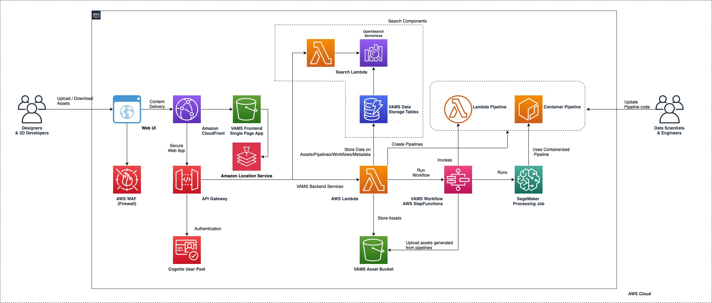

<h1> VAMS Developer Guide </h1>

## Install

### Requirements

-   Python 3.12
-   Poetry (for managing python dependencies in the VAMS backend)
-   Docker
-   Node >=20.18.1
-   Yarn >=1.22.19
-   Node Version Manager (nvm)
-   Conda-forge [only for optional local development]
-   AWS cli
-   AWS CDK cli
-   Programatic access to AWS account at minimum access levels outlined above.

### Deploy VAMS for the First Time

#### Local Development

For local development, there are 2 options in regards to the backend: pointing to a local mocked backend or a remote backend that has already been deployed.

##### Local Backend

Some local development is possible when using a local backend, but not all APIs are available locally.

Pre-reqs for local development:

-   Conda installed and on PATH
-   In `web/src/config.ts`, update the following values:
    -   Set `DEV_API_ENDPOINT='http://localhost:8002/'`

Terminal 1 (Running mocked API server):
Before running the mockup API server, make sure to update amplifyConfig and secureConfig values accordingly in `backend/backend/localDev_api_server.py`
Note: You may get errors due to other environment variables not set, you can ignore these as they do not hold up the mock API server

```bash
source ~/.bash_profile # for conda
cd ./backend
conda env create --name vams --file=vams-local.conda.yaml -y
conda activate vams
USE_LOCAL_MOCKS=true python3 backend/localDev_api_server.py # port 8002 # powershell: $env:USE_LOCAL_MOCKS = "true"
```

Terminal 2 (Running mocked auth server):

```bash
source ~/.bash_profile # for conda
cd ./backend
conda env create --name vams --file=vams-local.conda.yaml -y
conda activate vams
python3 localDev_oauth2_server.py # port 9031
```

Terminal 3 (Running web server):

```bash
cd ./web && yarn install && npm run build && python3 -m http.server 8001 -d build
```

The `yarn install` only need to be run once if dependencies haven't been modified, local frontend can be started with only:

`npm run build && python3 -m http.server 8001 -d build`

or `npm run start` to have **live reload** on code changes.

_Note_: `npm run start` will need the port set via an environment variable `PORT=8001`.

Now load [http://localhost:8001](http://localhost:8001) in a browser. (Don't need to provide any credentials on login)

##### Remote Backend

Pointing local frontend to a remote backend assumes the backend has already been deployed and functioning.

-   In `web/src/config.ts`, update the following values:
    -   Update `DEV_API_ENDPOINT` to point to the remote API endpoint

Terminal 1 (Running web server):

```bash
cd ./web && yarn install && npm run build && cd ./build
```

The `yarn install` only need to be run once if dependencies haven't been modified, local frontend can be started with only:

`npm run build && python3 -m http.server 8001 -d build`

or `npm run start` to have **live reload** on code changes.

_Note_: `npm run start` will need the port set via an environment variable `PORT=8001`.

Now load [http://localhost:8001](http://localhost:8001) in a browser.

#### Build & Deploy Steps (Linux/Mac)

VAMS Codebase is changing frequently and we recommend you checkout the stable released version from github.

You can identify stable releases by their tag. Fetch the tags `git fetch --all --tags` and then `git checkout tags/TAG` or `git checkout -b TAG tags/TAG` where TAG is the actual desired tag. A list of tags is found by running `git tag --list` or on the [releases page](https://github.com/awslabs/visual-asset-management-system/releases).

1. `cd ./web && nvm use` - make sure you're node version matches the project. Make sure Docker daemon is running.

2. `yarn install` - make sure you install the packages required by the web app

3. `npm run build` - build the web app.

4. `cd ../infra && npm install` - installs dependencies defined in package.json.

5. If you haven't already bootstrapped your aws account with CDK. `cdk bootstrap aws://101010101010/us-east-1` - replace with your account and region. If you are boostrapping a GovCloud account, run `export AWS_REGION=[gov-cloud-region]` as the AWS SDK needs to be informed to use GovCloud endpoints.

6. Modify the `config.json` in `/infra/config` to set the VAMS deployment parameters and features you would like to deploy. Recommended minimum fields to update are `region`, `adminEmailAddress`, and `baseStackName` when using the default provided template. More information about the configuration options can be found in the Configuration Options section below.

7. (Optional) Override the the CDK stack name and region for deployment with environment variables `export AWS_REGION=us-east-1 && export STACK_NAME=dev` - replace with the region you would like to deploy to and the name you want to associate with the cloudformation stack that the CDK will deploy.

8. (FIPS Use Only) If deploying with FIPS, enable FIPS environment variables for AWS CLI `export AWS_USE_FIPS_ENDPOINT=true` and enable `app.useFips` in the `config.json` configuration file in `/infra/config`

9. (External VPC Import Only) If importing an external VPC with subnets in the `config.json` configuration, run `cdk deploy --all --require-approval never --context loadContextIgnoreVPCStacks=true` to import the VPC ID/Subnets context and deploy all non-VPC dependant stacks first. Failing to run this with the context setting or configuration setting of `loadContextIgnoreVPCStacks` will cause the final deployment of all stacks step to fail.

10. `npm run deploy.dev` - An account is created in an AWS Cognito User Pool using the email address specified in the infrastructure config file. Expect an email from <`no-reply@verificationemail.com`> with a temporary password.

    10a. Ensure that docker is running before deploying as a container will need to be built

#### Deployment Success

1. Navigate to URL provided in `{stackName].WebAppCloudFrontDistributionDomainNameOutput` (Cloudfront) or `{stackName].WebsiteEndpointURLOutput` (ALB) from `cdk deploy` output.

2. Check email for temporary account password to log in with the email address you provided.

### Multiple Deployments With Different or Same Region in Single Account

You can change the region and deploy a new instance of VAMS my setting the environment variables to new values (`export AWS_REGION=us-east-1 && export STACK_NAME=dev`) and then running `npm run deploy.dev` again.

### Deploy VAMS Updates

To deploy customzations or updates to VAMS, you can update the stack by running `cdk deploy --all`. A changeset is created and deployed to your stack.

Please note, depending on what changes are in flight, VAMS may not be available to users in part or in whole during the deployment. Please read the change log carefully and test changes before exposing your users to new versions.

Deployment data migration documentation and scripts between major VAMS version deployments are located in `/infra/deploymentDataMigration`

### Deployment Troubleshooting

#### CDK Error: failed commit on ref "manifest-sha256:...": unexpected status from PUT request to https://....dkr.ecr.REGION.amazonaws.com/v2/foo/manifests/bar: 400 Bad Request

#### CDK Error: Lambda function XXX reached terminal FAILED state due to InvalidImage(ImageLayerFailure: UnsupportedImageLayerDetected - Layer Digest sha256:XXX) and failed to stabilize

If you receive these errors, it may be related to a defect in the latest CDK version working with Docker documented here: https://github.com/aws/aws-cdk/issues/31549

As a possible workaround if you are using the docker buildx platform, set the following terminal or operating system environment variable to stop the error:
`BUILDX_NO_DEFAULT_ATTESTATIONS=1`

Additionally, you may need to clear docker cache and set docker to handle cross-platform emulation when deploying from ARM64 deployment machines (i.e., Mac M3):

-   Clear your Docker cache: `docker system prune -a`
-   Set cross-platform emulation: `docker run --rm --privileged multiarch/qemu-user-static --reset -p yes`

### SAML Authentication - Cognito

SAML authentication enables you to provision access to your VAMS instance using your organization's federated identity provider such as Auth0, Active Directory, or Google Workspace.

If the configuration file `/infra/config/config.json` set `AuthProvider.UseCognito.UseSaml` to `true` to enable, `false` for disabled

You need your SAML metadata url, and then you can fill out the required information in `infra/config/saml-config.ts`.

The required information is as follows:

-   `name` identifies the name of your identity provider.
-   `cognitoDomainPrefix` is a DNS compatible, globally unique string used as a subdomain of cognito's signon url.
-   `metadataContent` is a url of your SAML metadata. This can also point to a local file if `metadataType` is changed to `cognito.UserPoolIdentityProviderSamlMetadataType.FILE`.

Then you can deploy the infra stack by running `cdk deploy --all` if you have already deployed or using the same build and deploy steps as above.

The following stack outputs are required by your identity provider to establish trust with your instance of VAMS:

-   SAML IdP Response URL
-   SP urn / Audience URI / SP entity ID
-   CloudFrontDistributionUrl for the list of callback urls. Include this url with and without a single trailing slack (e.g., <https://example.com> and <https://example.com/>)

### JWT Token Authentication - Cognito

VAMS API requires a valid authorization token that will be validated on each call against the configured authentication system (eg. Cognito).

All API calls require that the below claims be included as part of that JWT token. This is done via the `pretokengen` lambda that is triggered on token generation in Cognito. If implementing a different authentication OATH system, developers must ensure these claim token are included in their JWT token.

The critical component right now is that the authenticated VAMS username be included in the `tokens` array. Roles and externalAttributes are optional right now as they are looked up at runtime.

```
{
    'claims': {
        "tokens": [<username>],
        "roles": [<roles>],
        "externalAttributes": []
    }
}
```

NOTE: GovCloud deployments when the GovCloud configuration setting is true only support v1 of the Cognito lambdas. This means that ONLY Access tokens produced by Cognito can be used with VAMS API Calls for authentication/authorization. Otherwise both ID and Access tokens can be used for Non-govcloud deployments.

### LoginProfile Custom Organizational Updates

VAMS supports adding custom logic to how VAMS user profile information is updated and with what information.

This logic should be overriden by each oranization as needed within `/backend/backend/customConfigCommon/customAuthLoginProfile.py`

The default logic is to fill in and override login profile information like email from the JWT token returned by the IDP.

LoginProfile is updated via a authenticated API call by the user from the webUI (on login) via a POST call to `/api/auth/loginProfile/{userId}`.

Email field of the loginProfile is used by systems that need to send emails to the user. It will revert to the userId of email is blank or not in an email format as a backup.

### Auth Claims / MFACheck Custom Organizational Updates

VAMS supports adding custom logic to how to check auth claims, including if Multi-Factor Authentication (MFA) is enabled for a logged in user when using an external OAUTH IDP configuration

This logic should be overriden by each oranization as needed within `/backend/backend/customConfigCommon/customAuthClaimsCheck.py`

The default logic is for external OAUTH IDP is to just set the MFA enabled flag hard-coded to false. As each IDP is different, this must be a custom call.

NOTE: Be mindful of the logic used as this can have great performance impacts for VAMS. Try to use caches in this method or reduce the amount of external API calls as this method is called very frequently during VAMS API authorization checks.

### Local Docker Builds - Custom Build Settings

If you are needing to add custom settings to your local docker builds, such as adding custom SSL CA certificates to get through HTTPS proxies, modify the following docker build files:

1. `/infra/config/dockerDockerfile-customDependencyBuildConfig` - Docker file for all local packaging environments such as Lambda Layers and/or Custom Resources. Add extra lines to end of file.
2. `/backendPipelines/...` - Docker files for use-case pipeline containers. Add extra lines above any package install or downloads.

When specifying docker image pulls, all docker files should be defined/fixed to the `linux/amd64` platform. This alleievates issues with deploying across Windows, Max, and Linux host OS platforms.

### CDK Deploy with Custom SSL Cert Proxy

If you need to deploy VAMS CDK using custom SSL certificates due to internal organization HTTPS proxy requirements, follow the below instructions.

1. Download to your host machine the .pem certificate that is valid for your HTTPS proxy to a specific path
2. Set the following environments variables to the file path in step 1: `$AWS_CA_BUNDLE` and `$NODE_EXTRA_CA_CERTS`
3. Modify the Dockerbuild files specified and instructed in  and add the following lines (for Python PIP installs) below. Update `/local/OShost/path/Combined.pem` to the local host path relative to the Dockerfile location.

```
COPY /local/OShost/path/Combined.pem /var/task/Combined.crt
RUN pip config set global.cert /var/task/Combined.crt
```

4. You may need to add additional environment variables to allow using the ceritificate to be used for for `apk install` or `apt-get` system actions.

### Web Development

The web front-end runs on NodeJS React with a supporting library of amplify-js SDK. The React web page is setup as a single page app using React routes with a hash (#) router.

Infrastructure Note (Hash Router): The hash router was chosen in order so support both cloudfront and application load balancer (ALB) deployment options. As of today, ALBs do not support URL re-writing (without a EC2 reverse proxy), something needed to support normal (non-hash) web routing in React. It was chosen to go this route to ensure that the static web page serving is a AWS serverless process at the expense of SEO degredation, something generally not critical in internal enterprise deployments.

(Important!) Development Note (Hash Router): When using `<Link>`, ensure that the route paths have a `#` in front of them as Link uses the cloudscape library which doesn't tie into the React router. When using `<navigate>`, part of the native React library and thus looking at the route manager, exclude the `#` from the beginning of the route path. Not following this will cause links to return either additional appended hash routes in the path or not use hashes at all.

The front end when loading the page receives a configuration from the AWS backend to include amplify storage bucket, API Gateway/Cloudfront endpoints, authentication endpoints, and features enabled. Some of these are retrieved on load pre-authentication while others are received post-authentication. Features enabled is a comma-deliminated list of infrastructure features that were enabled/disabled on CDK deployment through the `config.json` file and toggle different front-end features to view.

### Implementing pipelines outside of Lambda

To process an asset through VAMS using an external system or when a job can take longer than the Lambda timeout of 15 minutes, it is recommended that you use the _Wait for a Callback with the Task Token_ feature so that the Pipeline Lambda can initiate your job and then exit instead of waiting for the work to complete before it also finishes. This reduces your Lambda costs and helps you avoid failed jobs that fail simply because they take longer than the timeout to complete.

To use _Wait for a call back with the Task Token_, enable the option to use Task Tokens on the create pipeline screen. When using this option, you must explicitly make a callback to the Step Functions API with the Task Token in the event passed to your Lambda function. The Task Token is provided in the event with the key `TaskToken`. You can see this using the Step Functions execution viewer under the Input tab for an execution with the call back enabled. Pass the `TaskToken` to the system that can notify the Step Functions API that the work is complete with the `SendTaskSuccess` message.

`SendTaskSuccess` is sent with the [aws cli](https://docs.aws.amazon.com/cli/latest/reference/stepfunctions/send-task-success.html#send-task-success) like this:

```
aws stepfunctions send-task-success --task-token 'YOUR_TASK_TOKEN' --task-output '{"status": "success"}'
```

Or, in python [using boto3, like this](https://boto3.amazonaws.com/v1/documentation/api/latest/reference/services/stepfunctions/client/send_task_success.html):

```
response = client.send_task_success(
    taskToken='string',
    output='string'
)
```

For other platforms, see the SDK documentation.

For task failures, see the adjacent api calls for `SendTaskFailure`.

Two additional settings enable your job to end with a timeout error by defining a task timeout. This can reduce your time to detect a problem with your task. By default, the timeout is over a year when working with task tokens. To set a timeout, specify a Task Timeout on the create pipeline screen.

If you would like your job check in to show that it is still running and fail the step if it does not check in within some amount of time less than the task timeout, define the Task Heartbeat Timeout on the create pipeline screen also. If more time than the specified seconds elapses between heartbeats from the task, this state fails with a States.Timeout error name.

### Special Configurations

### Static WebApp - ALB w/ Manual VPC Interface Endpoint Creation

During deployment of the ALB configuration for the static web contents, some organizations require that all VPC endpoints be created outside of a CDK stack.

Turn the `app.useAlb.addAlbS3SpecialVpcEndpoint` infrastructure configuration to `false` in this scenario. The following VPC Interface Endpoint will need to be created as well as the other required steps to link it to the ALB target groups and S3 (after the stack has been deployed):

1. Deploy the stack first with the configuration setting to `false`
2. Create a VPC Interface Endpoint on the VPC on the same subnets used on the ALB deployment and using/linked to the newly created VPCe security group already setup as part of the stack for the VPC endpoint.
3. Add a new IAM resource policy on the VPC endpoint to allow all `["s3:Get*", "s3:List*"]` actions for the S3 webAppBucket (bucket name will be the domain name used for the ALB) and its objects
4. Update the IAM resource policy on the webAppBucket S3 bucket (bucket name will be the domain name used for the ALB) to add a condition to only allow connections from the created VPC Interface Endpoint
5. Lookup all the Private IP Addresses for each ALB subnet that are assigned to the VPC Interface endpoint
6. Add to the stack-created ALB target group all the VPCe IP addresses looked up in the previous step.
7. Update the resource policy of the S3 ALB domainname bucket (which contains the webapp files) to update the condition of `aws:SourceVpce` to point to the new VPCe endpoint ID

### Uninstalling

1. Run `cdk destroy` from infra folder
2. Some resources may not be deleted by CDK (e.g S3 buckets and DynamoDB table) and you will have to delete them via aws cli or using aws console

Note:

After running CDK destroy there might still some resources be running in AWS that will have to be cleaned up manually as CDK does not delete some resources.

### Deployment Overview

The CDK deployment deploys the VAMS stack into your account. The components that are created by this app are:

1. Web app hosted on [cloudfront](https://aws.amazon.com/cloudfront/) distribution
1. [API Gateway](https://aws.amazon.com/api-gateway/) to route front end calls to api handlers.
1. [Lambda](https://aws.amazon.com/lambda/) Lambda handlers are created per API path.
1. [DynamoDB](https://aws.amazon.com/dynamodb/) tables to store Workflows, Assets, Pipelines
1. [S3 Buckets](https://aws.amazon.com/s3/) for assets, cdk deployments and log storage
1. [Cognito User Pool](https://docs.aws.amazon.com/cognito/) for authentication
1. [Open Search Collection](https://aws.amazon.com/opensearch-service/features/serverless/) for searching the assets using metadata
   

# API Schema

Please see [Swagger Spec](https://github.com/awslabs/visual-asset-management-system/blob/main/VAMS_API.yaml) for details

# S3 Buckets

| Bucket                   | Description                                                                                                                                                                                |
| ------------------------ | ------------------------------------------------------------------------------------------------------------------------------------------------------------------------------------------ |
| accessLogsBucket         | For storing access logs from other S3 buckets                                                                                                                                              |
| assetBucket              | Primary bucket for asset storage                                                                                                                                                           |
| assetAuxiliaryBucket     | For auto-generated auxiliary working objects associated with asset storage (includes auto-generated previews, visualizer files, temporary storage for pipelines)                            |
| artefactsBucket          | For storing artefacts                                                                                                                                                                      |
| assetStagingBucket       | (Optional) For bucket migration staging                                                                                                                                                    |
| webAppAccessLogsBucket   | For storing web app access logs                                                                                                                                                            |
| webAppBucket             | For hosting the web application (static content)                                                                                                                                            |


# DynamoDB Database Tables and Schema

## Tables

| Table                         | Partition Key         | Sort Key              | Attributes                                                                                                                        |
| ----------------------------- | --------------------- | --------------------- | --------------------------------------------------------------------------------------------------------------------------------- |
| AppFeatureEnabledStorageTable | featureName           | n/a                   |                                                                                                                                   |
| AssetStorageTable             | databaseId            | assetId               | assetLocation, assetName, assetType, currentVersion, description, generated_artifacts, isDistributable, previewLocation, versions, tags, status |
| AssetLinksStorageTable        | assetIdFrom           | assetIdTo             |                                                                                                                                   |
| AssetFileVersionsStorageTable | assetId:assetVersionId| fileKey               |                                                                                                                                   |
| AssetVersionsStorageTable     | assetId               | assetVersionId        | dateCreated, comment, description, specifiedPipelines, createdBy                                                                  |
| AssetUploadsStorageTable      | uploadId              | assetId               | databaseId                                                                                                                        |
| AuthEntitiesStorageTable      | entityType            | sk                    |                                                                                                                                   |
| CommentStorageTable           | assetId               | assetVersionId:commentId |                                                                                                                                |
| DatabaseStorageTable          | databaseId            | n/a                   | assetCount, dateCreated, description                                                                                              |
| MetadataStorageTable          | databaseId            | assetId               | Varies with user provided attributes                                                                                              |
| MetadataSchemaStorageTable    | databaseId            | field                 |                                                                                                                                   |
| PipelineStorageTable          | databaseId            | pipelineId            | assetType, dateCreated, description, enabled, outputType, pipelineType, pipelineExecutionType, inputParameters                    |
| RolesStorageTable             | roleName              | n/a                   |                                                                                                                                   |
| SubscriptionsStorageTable     | eventName             | entityName_entityId   |                                                                                                                                   |
| TagStorageTable               | tagName               | n/a                   |                                                                                                                                   |
| TagTypeStorageTable           | tagTypeName           | n/a                   |                                                                                                                                   |
| UserRolesStorageTable         | userId                | roleName              |                                                                                                                                   |
| UserStorageTable              | userId                | n/a                   | email                                                                                                                             |
| WorkflowStorageTable          | databaseId            | workflowId            | dateCreated, description, specifiedPipelines, workflow_arn                                                                        |
| WorkflowExecutionStorageTable | assetId               | executionId           | workflowId, databaseId, workflow_arn, execution_arn, startDate, stopDate, executionStatus                                         |

## AssetStorageTable

| Field               | Data Type | Description                                                                                                    |
| ------------------- | --------- | -------------------------------------------------------------------------------------------------------------- |
| assetLocation       | Map       | S3 Bucket and Key for this asset                                                                               |
| assetName           | String    | The user provided asset name                                                                                   |
| assetType           | String    | The file extension of the asset                                                                                |
| currentVersion      | Map       | The current version of the S3 object                                                                           |
| description         | String    | The user provided description                                                                                  |
| generated_artifacts | Map       | S3 bucket and key references to artifacts generated automatically through pipelines when an asset is uploaded. |
| isDistributable     | Boolean   | Whether the asset is distributable                                                                             |

## PipelineStorageTable

| Field                 | Data Type | Description                                                                     |
| --------------------- | --------- | ------------------------------------------------------------------------------- |
| assetType             | String    | File extension of the asset                                                     |
| dateCreated           | String    | Creation date of this record                                                    |
| description           | String    | User provided description                                                       |
| enabled               | Boolean   | Whether this pipeline is enabled                                                |
| outputType            | String    | File extension of the output asset                                              |
| pipelineType          | String    | Defines the pipeline type — StandardFile/PreviewFile                            |
| pipelineExecutionType | String    | Defines the pipeline execution type — Lambda                                    |
| inputParameters       | String    | Defines the optional JSON parameters that get sent to the pipeline at execution |

## DatabaseStorageTable

| Field       | Data Type | Description                       |
| ----------- | --------- | --------------------------------- |
| assetCount  | String    | Number of assets in this database |
| dateCreated | String    | Creation date of this record      |
| description | String    | User provided description         |

## WorkflowStorageTable

| Field              | Data Type              | Description                                                                            |
| ------------------ | ---------------------- | -------------------------------------------------------------------------------------- |
| dateCreated        | String                 | Creation date of this record                                                           |
| description        | String                 | User provided description                                                              |
| specifiedPipelines | Map, List, Map, String | List of pipelines given by their name, outputType, pipelineType, pipelineExecutionType |
| workflow_arn       | String                 | The ARN identifying the step function state machine                                    |

## WorkflowExecutionStorageTable

| Field           | Data Type | Description                                                                     |
| --------------- | --------- | ------------------------------------------------------------------------------- |
| asset_id        | String    | Asset identifier for this workflow execution                                    |
| database_id     | String    | Database to which the asset belongs                                             |
| execution_arn   | String    | The state machine execution arn                                                 |
| execution_id    | String    | Execution identifier                                                            |
| workflow_arn    | String    | State machine ARN                                                               |
| workflow_id     | String    | Workflow identifier                                                             |
| stopDate        | String    | Stop Datetime of the execution (if blank, still running)                        |
| startDate       | String    | Start Datetime of the execution (if blank, still running)                       |
| executionStatus | String    | Execution final status (if blank, still running)                                |
| assets          | List, Map | List of Maps of asset objects (see AssetStorageTable for attribute definitions) |

### Global Secondary Indexes

| Index Name      | Partition Key | Sort Key     | Description                                                |
| --------------- | ------------- | ------------ | ---------------------------------------------------------- |
| WorkflowIdGSI   | assetId       | workflowId   | For querying executions by asset and workflow              |
| ExecutionIdGSI  | workflowId    | executionId  | For querying executions by workflow                        |

## AssetLinksStorageTable

| Field       | Data Type | Description                                  |
| ----------- | --------- | -------------------------------------------- |
| assetIdFrom | String    | Source asset ID in the relationship          |
| assetIdTo   | String    | Target asset ID in the relationship          |

### Global Secondary Indexes

| Index Name    | Partition Key | Sort Key | Description                                |
| ------------- | ------------- | ------- | ------------------------------------------ |
| AssetIdFromGSI| assetIdFrom   | n/a     | For querying all outgoing links from asset |
| AssetIdToGSI  | assetIdTo     | n/a     | For querying all incoming links to asset   |

## AssetUploadsStorageTable

| Field      | Data Type | Description                                  |
| ---------- | --------- | -------------------------------------------- |
| uploadId   | String    | Unique identifier for the upload             |
| assetId    | String    | Asset identifier                             |
| databaseId | String    | Database to which the asset belongs          |

### Global Secondary Indexes

| Index Name    | Partition Key | Sort Key | Description                                |
| ------------- | ------------- | ------- | ------------------------------------------ |
| AssetIdGSI    | assetId       | uploadId | For querying uploads by asset              |
| DatabaseIdGSI | databaseId    | uploadId | For querying uploads by database           |

## SubscriptionsStorageTable

| Field            | Data Type | Description                                  |
| ---------------- | --------- | -------------------------------------------- |
| eventName        | String    | Name of the event to subscribe to            |
| entityName_entityId | String | Combined entity name and ID                  |

### Global Secondary Indexes

| Index Name                      | Partition Key | Sort Key            | Description                                |
| ------------------------------- | ------------- | ------------------- | ------------------------------------------ |
| eventName-entityName_entityId-index | eventName | entityName_entityId | For querying subscriptions by event and entity |

## MetadataStorageTable

| Field       | Data Type | Description                                  |
| ----------- | --------- | -------------------------------------------- |
| asset_id    | String    | Asset identifier for this workflow execution |
| database_id | String    | Database to which the asset belongs          |

## UserStorageTable

| Field  | Data Type | Description                               |
| ------ | --------- | ----------------------------------------- |
| userId | String    | (PK) Main user ID associated with profile |
| email  | String    | Email belonging to the user               |


# Updating Backend

The dependencies for the backend lambda functions are handled using poetry. If you changed the lambda functions make sure to do a `cdk deploy` to reflect the change.

The core VAMS lambda handlers are categorized based on the project domain. E.g you will find all assets related functions in the `/backend/backend/assets` folder.

The pipeline containers and lambda handlers are categorized based pipeline use-case implementations. You will find all pipeline components related to these in the `/backend/backendPipelines` folder.

# Adding your own pipelines

When you create pipelines in VAMS, you currently have one execution option and two pipeline type options

1. Create a lambda execution type pipeline. Pick either standard or preview pipeline type (currently there are no differences as of v2.1, preview will have a future implementation functionality)

## Lambda pipeline

AWS Lambda is the compute platform for VAMS Lambda Pipelines.

When you create a VAMS Lambda pipeline you can either allow VAMS to create a new AWS Lambda function or provide a name of an existing AWS Lambda function to be used as a pipeline.

### Creating your lambda function through VAMS pipeline

When you create a VAMS Lambda pipeline and dont provide name of an existing AWS Lambda function, VAMS will create an AWS Lambda function in your AWS account where VAMS is deployed. This lambda function will have the same name as the pipelineId you provided while creating the pipeline and append `vams-`. This lambda function contains an example pipeline code. This example code can be modified with your own pipeline business logic.

### Using existing lambda function as a pipeline

Sometimes you may want to write your pipelines separately from VAMS stack. Some reasons for this are

1. Separating pipeline code from VAMS deployment code
2. Different personas with no access to VAMS are working on pipeline code
3. Pipelines are managed in a separate CDK/CloudFormation stack altogether.

If you want to use an existing AWS Lambda function as a pipeline in VAMS you can provide the function name of your AWS Lambda function in the create pipeline UI. See the section below for the event payload passed by VAMS workflows when your pipelines are executed.

The VAMS workflow functionality by default will have access to any lambda function within the deployed AWS account with the word `vams` in it. If your existing function does not have this, you will have to grant manual invoke permissions to the workflow stepfunctions role.

## Lambda pipeline interface

When a VAMS workflow invokes a VAMS Lambda pipeline, it invokes the corresponding AWS Lambda function with an event payload like below:

```
"body": {
    "inputS3AssetFilePath": "<S3 URI of the primary asset file to be used as input>",
    "outputS3AssetFilesPath": "<Predetermined output path for asset files generated by pipeline's execution */**>",
    "outputS3AssetPreviewPath": "<Predetermined output path for asset preview files generated by pipeline's execution **>",
    "outputS3AssetMetadataPath": "<Predetermined output path for asset metadata generated by pipeline's execution */**/***>",
    "inputOutputS3AssetAuxiliaryFilesPath": "<Predetermined path for asset auxiliary files generated by pipeline's execution ****>",
    "inputParameters": "<Optional input JSON parameters specified at the time of pipeline creation. Generally these map to allowed pipeline configuration parameters of the call-to pipeline>",
    "inputMetadata": "<Input metadata JSON constructed from the VAMS asset the pipeline was executed from to provide pipelines additional context. See below for the JSON schema>",
    "executingUsername": <The username of the user who executed the pipeline for use with permissioning>,
    "executingRequestContext": <The originating lambda request context from executing the pipeline for use with permissioning>
}
```

-   \* The path specified is a unique location based on the execution job run. No two executions will have the same output path for these paths.
-   \*\* If no files are located at the output locatin at the end of an execution, the respective asset data will not be modified
-   \*\*\* Metadata files are in the form of JSON objects. All key/value fields in the top-level JSOn object will be added to the asset's metadata. Fields that already exist will be overwriten.
-   \*\*\*\* The asset axuliary location is used for pipeline or asset non-versioned files or pipeline temporary files. The file path provided is not unique to the job execution and is a global path based on the asset selected and pipeline name.

Below is the input metadata schema JSON object constructed and passed into each pipeline execution:

```
    "VAMS": {
        "assetData": {
            "assetName":"<Name of the asset the workflow is executed from>",
            "description": "<Description of the asset the workflow is executed from>",
            "tags": ["<Array of tags of the asset the workflow is executed from>"]
        },
        "assetMetadata": {
            <... Dynamically constructed fields of all the metadata fields (key/value) from the VAMS asset and metadata of the primary VAMS asset file ...>
        }
    }
```

A simple lambda handler is provided below for reference. You may chose to override your own function in place of `write_input_output` function in below code.

```
def lambda_handler(event, context):
    """
    Example of a NoOp pipeline
    Uploads input file to output
    """
    print(event)
    if isinstance(event['body'], str):
        data = json.loads(event['body'])
    else:
        data = event['body']

    write_input_output(data['inputS3AssetFilePath'], data['outputS3AssetFilesPath'])
    return {
        'statusCode': 200,
        'body': 'Success'
    }
```

## Use-case Specific Pipelines - Execution Through VAMS Pipelines

This section describes use-case specific pipelines that can be activated in the infrastructure deployment configuration file `/infra/config/config.json`. These pipelines can be setup through VAMS pipelines and workflows and/or some may be called directly through other triggering mechanisms. See the [Configuration Guide](./ConfigurationGuide.md) for the use-case pipeline configuration options.

Pipeline architectures can either be synchronous or asynchonous. If asynchronous, the option of "Wait for Callback with the Task Token" must be used when adding the pipeline to VAMS.

See the [NOTICE file](./NOTICE.md) for specific third-party license information regarding each of these pipelines.

### Standard Type - 3D Basic Converter Pipeline (Synchronous)

The 3dBasic Converter Pipeline is used to convert between various 3D mesh file types.

If you wish to trigger this pipelines additionally/manually through VAMS pipeline, you can setup a new VAMS pipeline using the table below. You will need to lookup the lambda function name in the AWS console based on the base deployment name listed.

The pipeline uses the third-party open-source Trimesh library to conduct the conversion.

The pipeline uses the selected file type on the asset as the input type and the registered pipeline `outputType` as the final conversion type. For now a separate pipeline registration is required for each from-to file type conversion that a organization would like to support.

NOTE: Pipeline must be registered in VAMS WITHOUT the option of "Wait for Callback with the Task Token"

| Input File Types Supported                                       | Base Lambda Function Name    |
| :--------------------------------------------------------------- | :--------------------------- |
| STL, OBJ, PLY, GLTF, GLB, 3MF, XAML, 3DXML, DAE, XYZ (3D Meshes) | vamsExecute3dBasicConversion |

### Preview Type - PotreeViewer Point Cloud Visualizer Pipeline (Asynchronous)

The PotreeViewer Point Cloud Visualizer Pipeline is used to generate preview files for certain types of points clouds asset files. Currently preview pipelines like these are aprimarily implemented outside of VAMS pipelines/workflows but also have the ability to be called through traditional pipelines. Until preview type pipelines are fully integrated as part of the regular VAMS pipeline design and execution, this pipeline is triggered primarily through a S3 Event Notification on uploading new asset files to VAMS.

If you wish to trigger this pipelines additionally/manually through VAMS pipeline, you can setup a new VAMS pipeline using the table below. You will need to lookup the lambda function name in the AWS console based on the base deployment name listed.

The PotreeViewer pipeline outputs it's files (Potree OCTREE Formated Files) to the assetAuxiliary bucket. These are then retrieved through the PotreeViewer implementations on the VAMS UX side through the auxiliary assets stream API endpoint. This uses the third-party open-source PDAL and PotreeConverter libraries to convert and generate the final output

There are no defined input parameter configurations for this pipeline. This pipeline ignores inputMetadata as it's not needed for the operation of this pipeline.

NOTE: If pipeline registered separately in VAMS Pipelines, it must be registered in VAMS with the option of "Wait for Callback with the Task Token"


| Input File Types Supported        | Base Lambda Function Name - VAMS trigger | Base Lambda Function Name - SNS trigger |
| :-------------------------------- | :--------------------------------------- | --------------------------------------- |
| LAS, LAZ, E57, PLY (Point Clouds) | vamsExecutePreviewPcPotreeViewerPipeline | snsExecutePrviewPcPotreeViewerPipeline  |

### Standard Type - GenerativeAI 3D Metadata Labeling Pipeline (Asynchronous)

> Notice: This use-case pipeline uses a open-source library that is GPL licensed. Please refer to the  and review with your organizations legal team before enabling use.

The GenerativeAI 3D Metadata labeling Pipeline is used to generate 2D renders and metadata JSON labeling information for 3D mesh asset files. This is useful to auto-label asset data as it is ingested.

If you wish to trigger this pipelines additionally/manually through VAMS pipeline, you can setup a new VAMS pipeline using the table below. You will need to lookup the lambda function name in the AWS console based on the base deployment name listed.

The pipeline uses the third-party open-source Blender library to generate 2D renders of the 3D object. This is then ingested into both Amazon Rekognition and Amazon Bedrock to generate and summarize labels on these 2D images. The output is a JSON metadata keywords file in the asset S3 bucket. Input types are currently restricted by the input model formats that Blender can accept.

This pipeline can use the inputMetadata passed into the pipeline as additional seed data for more accurately labeling the 2D image objects. This can be toggled on or off with an inputParameter.

The following inputParameters are supported:

```
{
    "includeAllAssetFileHierarchyFiles": "True", #Default: False. Pull in all the asset files from the folder that includes the original input asset and lower (i.e. can pull in other relative texture files or shaders for rendering)
    "seedMetadataGenerationWithInputMetadata": "True" #Default: False. Seed the metadata label generation with the input metadata (e.g. VAMS asset data, asset metadata) to refine results and reduce outlier keywords
}
```

NOTE: Pipeline must be registered in VAMS with the option of "Wait for Callback with the Task Token"


| Input File Types Supported                              | Base Lambda Function Name                  |
| :------------------------------------------------------ | :----------------------------------------- |
| OBJ, GLB/GLTF, FBX, ABC, DAE, PLY, STL, USD (3D Meshes) | vamsExecuteGenAiMetadata3dLabelingPipeline |

### Standard Type - RapidPipeline Asset Optimization & Conversion Pipeline (Asynchronous)

RapidPipeline 3D Processor is used to convert between various 3D mesh file types, as well as optimize mesh files using techniques like mesh decimation & remeshing, texture baking, UV aggregation, LOD generation, configurable scene graph flattening, and more.

If you wish to trigger this pipelines additionally/manually through VAMS pipeline, you can setup a new VAMS pipeline using the table below. You will need to lookup the lambda function name in the AWS console based on the base deployment name listed.

The pipeline uses a third-party tool from Darmstadt Graphics Group (DGG), RapidPipeline 3D Processor, and requires an active subscription to their [AWS Marketplace Listing](https://aws.amazon.com/marketplace/pp/prodview-zdg4blxeviyyi?sr=0-1&ref_=beagle&applicationId=AWSMPContessa).

The pipeline uses the selected file type on the asset as the input type and the registered pipeline `outputType` as the final conversion type. For now, a separate pipeline registration is required for each from-to file type conversion that a organization would like to support.

NOTE: Pipeline must be registered in VAMS with the option of "Wait for Callback with the Task Token".

| Input File Types Supported                          | Base Lambda Function Name |
| :-------------------------------------------------- | :------------------------ |
| GLTF, GLB, USD, OBJ, FBX, VRM, STL, PLY (3D Meshes) | vamsExecuteRapidPipeline  |

### Standard Type - ModelOps Asset Optimization & Conversion Pipeline (Asynchronous)

ModelOps 3D Task Handler is used to convert between various 3D mesh file types, optimize mesh files, and more.

If you wish to trigger this pipelines additionally/manually through VAMS pipeline, you can setup a new VAMS pipeline using the table below. You will need to lookup the lambda function name in the AWS console based on the base deployment name listed.

The pipeline uses a third-party tool from VNTANA, VNTANA Intelligent 3D Optimization Engine Container, and requires an active subscription to their [AWS Marketplace Listing](https://aws.amazon.com/marketplace/pp/prodview-ooio3bidshgy4?applicationId=AWSMPContessa&ref_=beagle&sr=0-1).

The pipeline uses templated (JSON) files with distinct modules for each action the pipeline should perform. To set the pipeline template, copy/paste the template code in the registered pipeline `inputParameters`. The template must be used to determine the pipeline actions and final conversion type(s).

NOTE: Pipeline must be registered in VAMS with the option of "Wait for Callback with the Task Token".

| Input File Types Supported                          | Base Lambda Function Name |
| :-------------------------------------------------- | :------------------------ |
| GLTF, GLB, USDZ, OBJ, FBX, STL, various CAD formats | vamsExecuteModelOps       |

See VNTANA [documentation](https://www.vntana.com/resource/platform-inputs/) for all supported input and output formats.

# Testing API

Please see the corresponding [Postman Collection](https://github.com/awslabs/visual-asset-management-system/blob/main/VAMS_API_Tests.postman_collection.json) provided.

Once the solution is deployed, you will have to put in the below details as Global Variables in the Postman Collection


# Updating and Testing Frontend

Within the web folder You can do `npm run start` to start a local frontend application.
