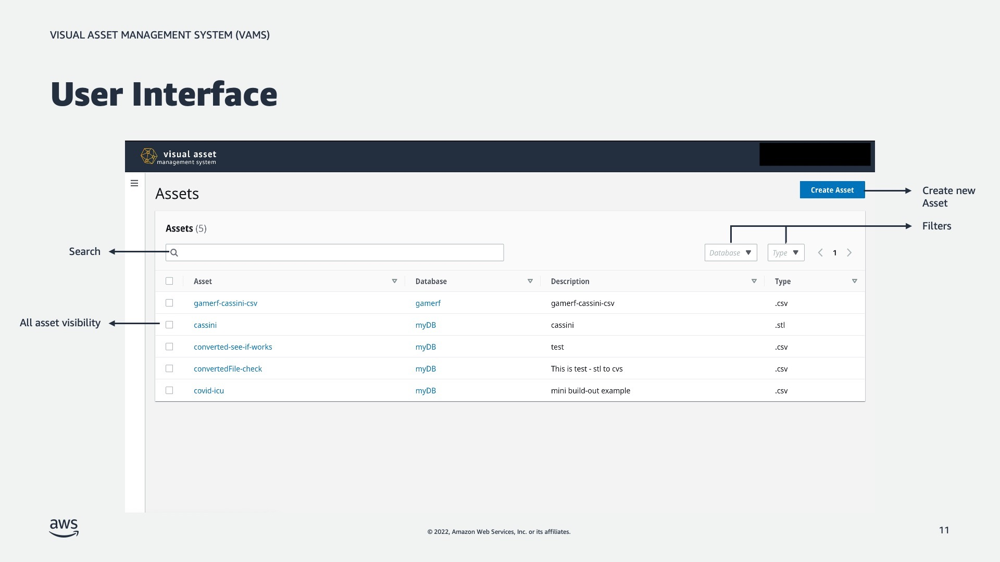
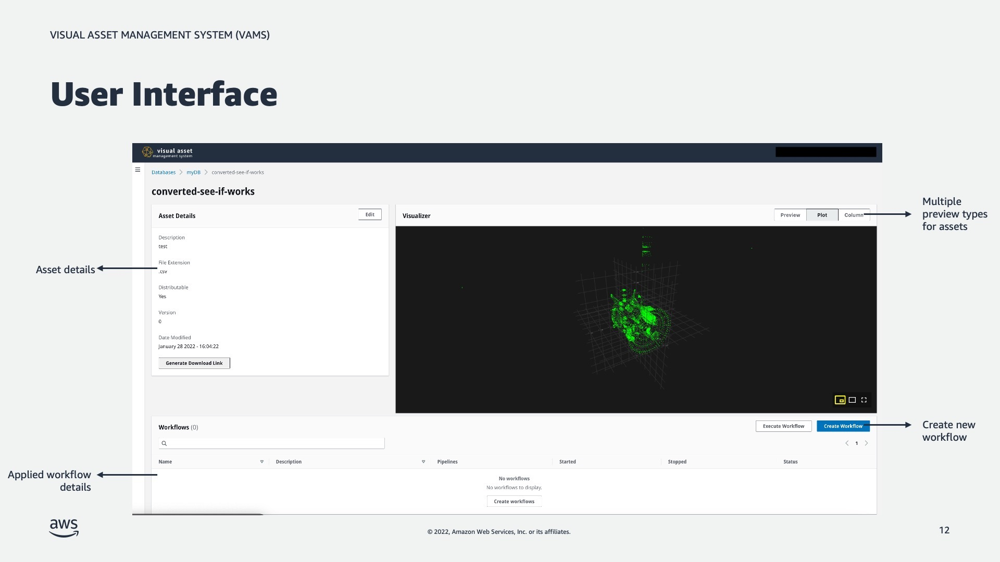
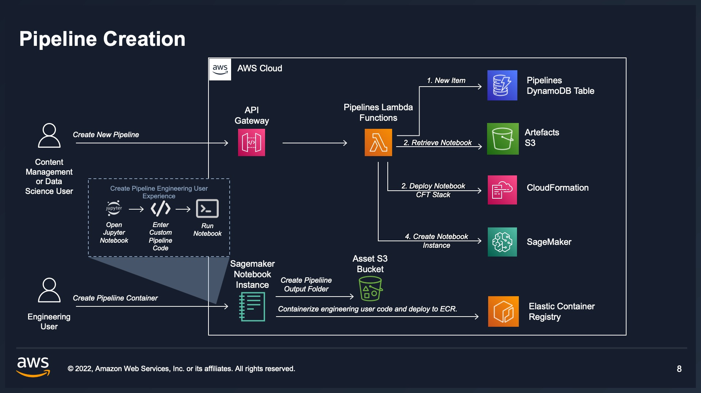
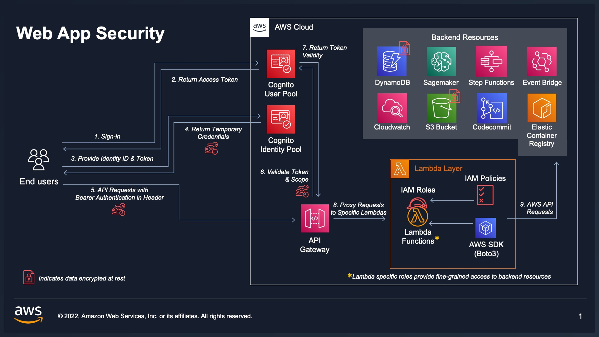

# Visual Asset Management System(VAMS) 

 
## Introduction

*Visual Asset Management System (VAMS)* is a purpose-built, AWS native solution for the management and distribution of specialized visual assets used in spatial computing. VAMS offers a simplified solution for organizations to ingest, store, and manage visual assets in the cloud, which empowers any user with a web browser to upload, manage, visualize, transform, and retrieve visual assets. Existing workflows that leverage both custom code and pre-built or third-party applications can also be migrated to VAMS and ran in the AWS cloud, as opposed to being limited by the on-premise capacity available. VAMS is customizable and expandable with option of being further tailored to specific use-cases by development teams.

*Customer Value:* VAMS addresses a challenge faced by customers embarking on Augmented and Virtual Reality (AR/VR) initiatives and in its early stages was developed in conjunction with HCLS and Automotive customers. Leveraging S3 as a low-cost, high availability storage layer, VAMS provides a purpose-built API for 3D asset management and consumption. This API provides a layer of abstraction, allowing custom integrations to be built. Custom integrations allow workloads and applications, which commonly are only available via a local system and proprietary software, to be shifted to the cloud and unlocking access to the entire breadth and depth of the AWS ecosystem. Organizations that previously had to visualize, transform, interface with, and deliver these assets on local systems, can now do so from a web-based cloud dashboard. Custom applications and automation can also be built leveraging the VAMS API.

*Use Cases:*
Sample use cases that have leveraged early iterations of VAMS include:

* Distribution and management of 3D Assets using highly  available S3 storage
* Modifications of 3D assets using VAMS Pipelines
* Creating workflows for 3D asset modification using VAMS  Workflows

## Install 

> VAMS supports deployment to the AWS us-east-1 region at this time. Support for other regions is coming soon.

### Requirements

* Python 3.8
* Poetry (for managing python dependencies in the backend)
* Docker 
* Node >=16.x
* Yarn >=1.22.19 
* Node Version Manager (nvm)
* AWS CDK cli
* Programatic access to AWS account at minimum access levels outlined above.

### Screenshots

### Deploy VAMS for the First Time

#### Build & Deploy Steps

1) `cd ./web nvm use` - make sure you're node version matches the project. Make sure Docker daemon is running.

2) `yarn install` - make sure you install the packages required by the web app

2) `npm run build` - build the web app. 

3) `cd ../infra npm install` - installs dependencies defined in package.json.

4) If you haven't already bootstrapped your aws account with CDK. `cdk bootstrap aws://101010101010/us-east-1` - replace with your account and region.

5) Set the CDK stack name and the region for deployment with environment variables `export AWS_REGION=us-east-1 && export STACK_NAME=dev` - replace with the region you would like to deploy to and the name you want to associate with the cloudformation stack that the CDK will deploy.

6) `npm run deploy.dev adminEmailAddress=myuser@example.com` - replace with your email address to deploy. An account is created in an AWS Cognito User Pool using this email address. Expect an email from no-reply@verificationemail.com with a temporary password. 

#### Deployment Success

1) Navigate to URL provided in `{stackName].WebAppCloudFrontDistributionDomainName{uuid}` from `cdk deploy` output.

2) Check email for temporary account password to log in with the email address you provided.

### Multiple Deployments With Different or Same Region in Single Account

You can change the region and deploy a new instance of VAMS my setting the environment variables to new values (`export AWS_REGION=us-east-1 && export STACK_NAME=dev`) and then running `npm run deploy.dev adminEmailAddress=myuser@example.com` again.

### Deploy VAMS Updates

To deploy customziations or updates to VAMS, you can update the stack by running `cdk deploy --all`. A changeset is created and deployed to your stack. 

Please note, depending on what changes are in flight, VAMS may not be available to users in part or in whole during the deployment. Please read the change log carefully and test changes before exposing your users to new versions.  

## Architecture Overview

### Architecture components

### Backend

VAMS Backend is composed of AWS Lambda functions that are accessed through an AWS API Gateway.

#### Architecture diagrams for Individual components

#### Asset Management

#### Pipelines Creation
Pipelines are a feature in VAMS that allow you to edit 

#### Workflows Execution

### Frontend

VAMS Frontend is a ReactJS application.

### Security

VAMS API and frontend are authorized through AWS Cognito user accounts only.

### Code Layout

| component       |  folder  | 
|-----------------|----------| 
| web application |  web     | 
| cdk deployment  |  infra   | 
| api and backend |  backend | 

## Demo and Workshop

Checkout the [VAMS workshop](https://catalog.us-east-1.prod.workshops.aws/workshops/ab24ff8d-090a-4287-88dd-a04d03a440c1/en-US) for detailed walkthrough

## Developers

To know more about how VAMS works and for instructions on configuring pipeline & workflow, refer to the Developer Guide [developer guide](./DeveloperGuide.md).

## Security

VAMS is provided under a shared responsibility model. Any customization for customer use must go through an AppSec review to confirm the modifications don't introduce new vulnerabilities. Any team implementing takes on the responsibility of ensuring their implementation has gone through a proper security review.

1) Run `yarn audit` in the `web` directory prior to deploying front-end to ensure all packages are up-to-date. Run `yarn audit fix` to mitigate critical security vulnerabilities.
2) When deploying to a customer account, create an IAM Role for deployment that limits access to the least privilege necessary based on the customers internal security policies.

## Uninstalling

1. Run `cdk destroy --all` from infra folder.
2. Some resources may not be deleted by CDK (e.g S3 buckets and DynamoDB tables, pipeline stacks). You may delete them using the AWS CLI or the AWS Console.

## Contributing

See the [CONTRIBUTING](./CONTRIBUTING.md) file for how to contribute.

## Costs

The costs of this solution can be understood as fixed storage costs and variable costs of the pipelines that you configure. Storage cost is proportional to the amount of data you upload to VAMS including new data you create using VAMS pipelines. 

You are responsible for the cost of the AWS services used while running this solution. Ensure that you have [billing alarms](https://docs.aws.amazon.com/AmazonCloudWatch/latest/monitoring/monitor_estimated_charges_with_cloudwatch.html) set within the constraints of your budget. 

An approximate cost breakdown is below (excluding free tiers):

| Service                           | Quantity                                                 | Cost   |
|:----------------------------------|:---------------------------------------------------------|:-------|
| Amazon API Gateway                | 150000 requests                                          | $0.16  |
| Amazon DynamoDB                   | 750000 writes, 146250 reads, 0.30 GB storage             | $1.18  |
| AWS Lambda                        | 12000 invocations, 2-minute avg. duration, 256 MB memory | $6     |
| AWS Step Functions                | 92400 state transitions                                  | $2.21  |
| Amazon S3                         | 10 GB storage, 4000 PUT requests, 4000 GET requests      | $0.26  |
| Amazon Rekognition                | 9000 Image analysis, 3 Custom Label inference units      | $22.32 |
| Amazon SageMaker                  | 2 inference endpoints                                    | $5.13  |
| Amazon Elastic Container Registry | ECR (In region)40GB                                      | $4     |

## License

See the [LICENSE](./LICENSE) file for our project's licensing.

Copyright Amazon.com, Inc. or its affiliates. All Rights Reserved.

Unless required by applicable law or agreed to in writing, software distributed under the License is distributed on an "AS IS" BASIS, WITHOUT WARRANTIES OR CONDITIONS OF ANY KIND, either express or implied.