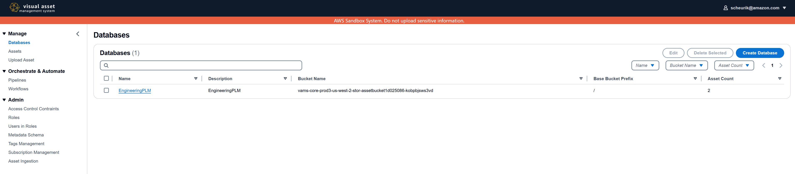
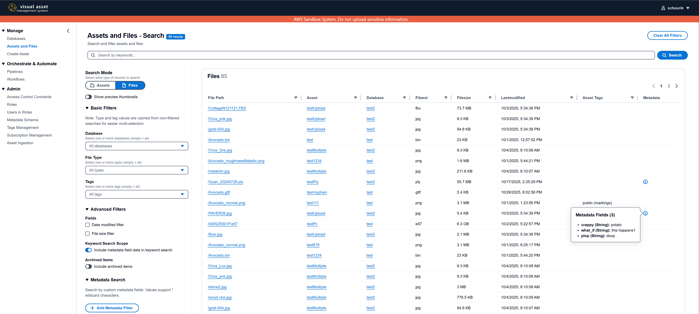
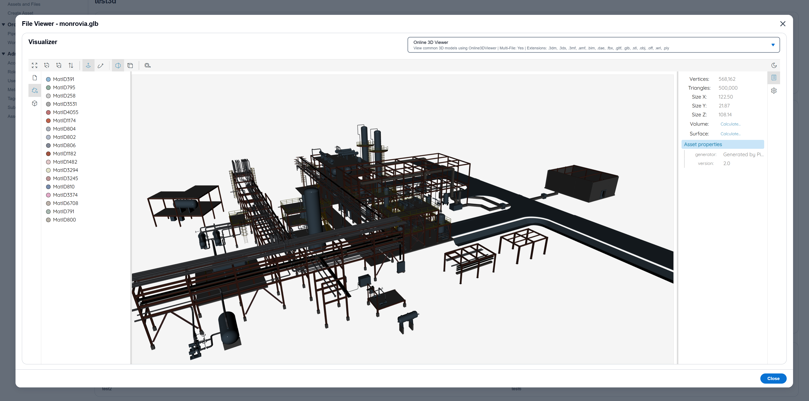
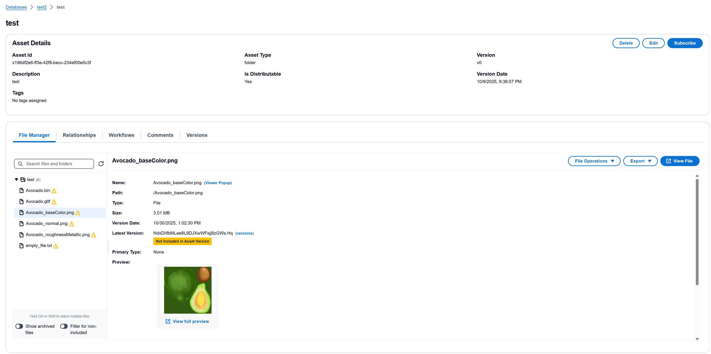
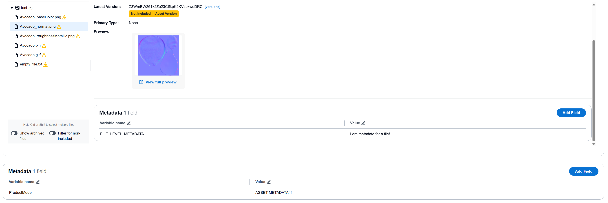
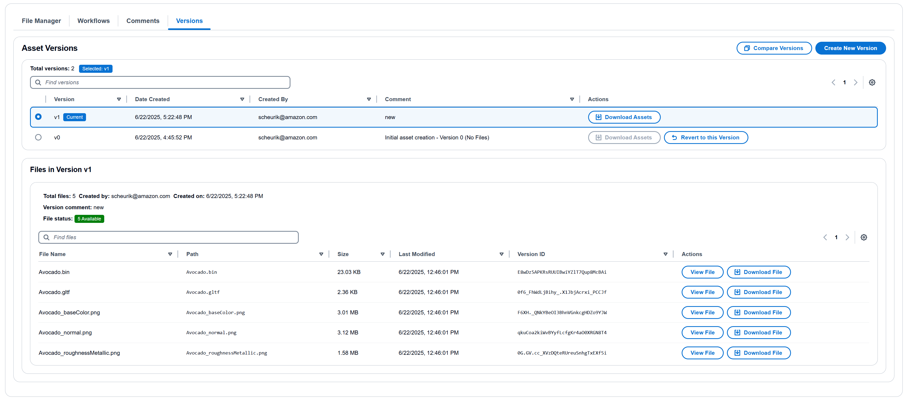
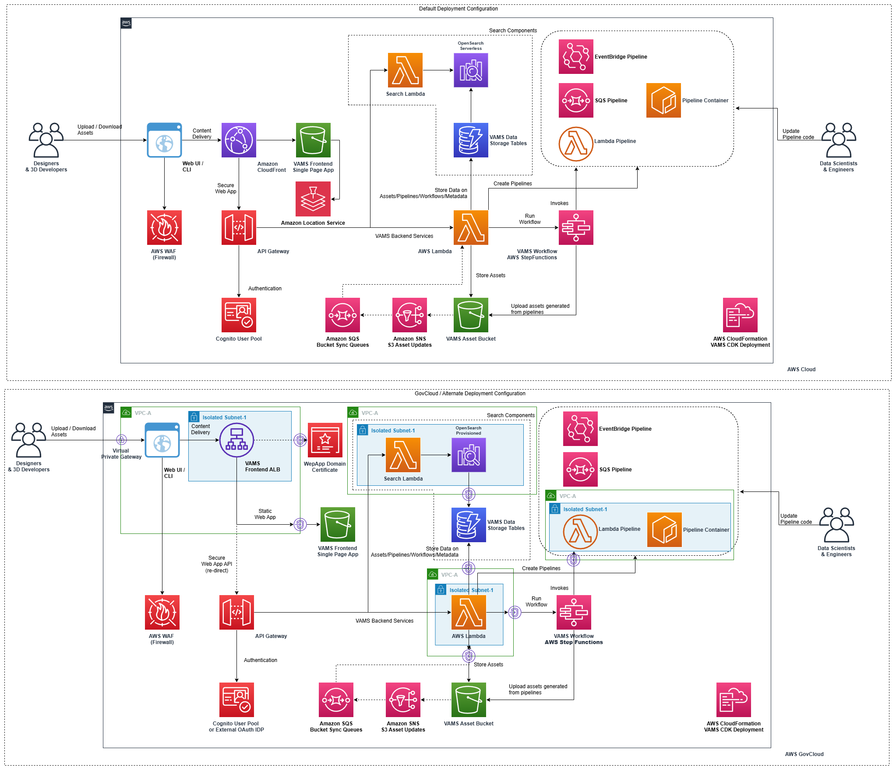

# Visual Asset Management System (VAMS)


## _Notice_

_Visual Asset Management System (VAMS) is a solution that is near-production-grade at its default. Consult with your organizational security prior to production use._

_VAMS is categorized as an AWS Spatial Data Plane solution._

## Introduction

**Visual Asset Management System (VAMS)** is a purpose-built, AWS-native solution for managing, visualizing, and processing specialized visual assets — including 3D models, point clouds, CAD files, geospatial data, and simulation environments — used in Physical AI and Spatial Computing.

Organizations working with 3D data face a common set of challenges: spatial assets are large and diverse in format, siloed across local systems and specialized tools, difficult to version or track lineage, and inaccessible to non-engineering teams that need them. VAMS solves the challenge of **spatial data sovereignty and access democratization** by providing a single pane of glass for an organization's spatial data source of truth.

Through a web interface, command-line tool, and REST API, VAMS enables any authorized user — not just engineers — to store, search, visualize, transform, and distribute visual assets without requiring specialized desktop software, restrictive licenses, or direct access to storage systems. The solution deploys entirely within your AWS account as a serverless CDK stack, ensuring full data sovereignty while supporting both commercial AWS and AWS GovCloud regions.

VAMS can store, manage, and version **any file type**. Out of the box, it includes built-in viewer and pipeline support for 3D meshes (glTF, OBJ, STL, FBX), CAD models (STEP, BREP), point clouds (E57, LAS, LAZ), USD scenes, gaussian splats, documents, images, video, and audio. Because the platform is extensible through custom viewer plugins and processing pipelines, this represents the current set of native integrations — not a limitation. Associated data such as textures, bills of materials, quality analysis data, and temporal (4D) change tracking can be managed as files or captured through the metadata system.

As an **open-source project** (Apache 2.0), VAMS is designed for extensibility. Organizations can integrate new viewer plugins, upstream data sources, downstream consumers, and custom workflow pipelines — adapting the platform to their specific requirements without vendor lock-in. Several ISVs have built commercial products on top of VAMS, and enterprise customers across defense, energy, manufacturing, and construction have adopted and contributed to the solution.

_Use cases include:_

- **Defense and Public Sector** — Digital twins, environment scanning, training and simulation with GovCloud deployment support
- **Energy and Utilities** — Facility scanning, part replacement tracking, corrosion detection, and maintenance data management at terabyte scale
- **Construction and AEC** — Live LiDAR scans compared against design plans, BIM management, and build-to-spec verification
- **Manufacturing** — Digital twins of facilities, equipment fitting analysis, CAD centralization with metadata extraction
- **Robotics and Physical AI** — Simulation environments, training data management, and reinforcement learning with NVIDIA Isaac Lab
- **Digital Twins** — Versioned facility scans, BIM models, and point clouds with automated viewer generation and knowledge graph integration
- **AR/VR/XR and Media** — Optimized 3D content distribution with format conversion, gaussian splatting, and LOD generation
- **AI and Machine Learning** — Managing and curating training datasets with metadata tagging and automated labeling pipelines
- **Geospatial** — LiDAR, photogrammetry, and imagery with location-based search and map visualization

## Overview

### Key capabilities

- **Centralized storage** — Manage 3D models, point clouds, CAD files, and media in Amazon S3 with versioning and access control
- **Interactive visualization** — View assets in the browser with 17 built-in viewer plugins (Three.js, Potree, Cesium, USD, Gaussian Splat, and more)
- **Automated processing** — Transform assets using configurable pipelines backed by AWS Lambda, Amazon SQS, or Amazon EventBridge
- **Intelligent search** — Full-text and metadata search powered by Amazon OpenSearch with map-based geographic views
- **Fine-grained permissions** — Attribute-based and role-based access control (ABAC/RBAC) at both API and data entity levels
- **Multi-region deployment** — Deploy to AWS commercial regions or AWS GovCloud (US)

## Screenshots

| Database Management | Asset Search | 3D Model Viewer |
|:---:|:---:|:---:|
|  |  |  |

| Asset Details | Metadata | Asset Versioning |
|:---:|:---:|:---:|
|  |  |  |

## Architecture



VAMS deploys as a serverless architecture using AWS CDK with 10+ nested CloudFormation stacks. Core services include Amazon API Gateway, AWS Lambda, Amazon DynamoDB, Amazon S3, Amazon OpenSearch, and Amazon Cognito.

## Quick start

### Prerequisites

- Python 3.12+, Docker, Node.js 20+, npm, AWS CLI, AWS CDK CLI

### Deploy

```bash
# 1. Build the web application
cd web && nvm use && npm install && npm run build

# 2. Install CDK dependencies
cd ../infra && npm install

# 3. Bootstrap CDK (first time only)
cdk bootstrap aws://ACCOUNT_ID/REGION

# 4. Configure deployment (edit config.json)
#    See documentation/docs/deployment/configuration-reference.md

# 5. Deploy
cdk deploy --all --require-approval never
```

After deployment, find your URL in the CDK output and check your email for temporary credentials.

> For detailed instructions, see the [Deployment Guide](./documentation/docusaurus-site/docs/deployment/deploy-the-solution.md).

## Documentation

Comprehensive documentation is available in the [`documentation/docusaurus-site/`](./documentation/docusaurus-site/) directory, built with [Docusaurus](https://docusaurus.io/).

To view locally:

```bash
cd documentation/docusaurus-site
npm install
npm run start
```

Then open `http://localhost:3000/visual-asset-management-system/` in your browser.

### Documentation sections

| Section | Description |
|---------|-------------|
| [Solution Overview](./documentation/docusaurus-site/docs/overview/solution-overview.md) | What VAMS is and its capabilities |
| [Core Concepts](./documentation/docusaurus-site/docs/concepts/overview.md) | Databases, Assets, Files, Pipelines, Metadata, Permissions |
| [Architecture](./documentation/docusaurus-site/docs/architecture/overview.md) | Architecture diagrams, AWS resources, security, networking |
| [Deployment Guide](./documentation/docusaurus-site/docs/deployment/prerequisites.md) | Prerequisites, configuration, deploy, update, uninstall |
| [User Guide](./documentation/docusaurus-site/docs/user-guide/getting-started.md) | Web interface, asset management, search, metadata |
| [CLI Reference](./documentation/docusaurus-site/docs/cli/getting-started.md) | Installation, command reference, automation |
| [Pipelines](./documentation/docusaurus-site/docs/pipelines/overview.md) | Built-in pipelines and custom pipeline development |
| [Developer Guide](./documentation/docusaurus-site/docs/developer/setup.md) | Backend, frontend, CDK, and viewer plugin development |
| [API Reference](./documentation/docusaurus-site/docs/api/overview.md) | Complete REST API documentation |
| [Troubleshooting](./documentation/docusaurus-site/docs/troubleshooting/common-issues.md) | Common issues, known limitations, FAQ |

## Access methods

| | Web Interface | CLI (`vamscli`) | REST API |
|---|---|---|---|
| **Best for** | Interactive use, visualization | Automation, scripting | Custom integrations |
| **Asset management** | Visual interface | Programmatic control | Full programmatic control |
| **3D viewing** | 17 interactive viewers | N/A | N/A |
| **Automation** | Manual | Full automation | Complete control |
| **CI/CD** | Not suitable | Designed for integration | Full flexibility |

## Partner integrations

**Open source:** Online 3D Viewer, CesiumJS, Potree, BabylonJS, PlayCanvas, Needle Engine, Three.js, Trimesh, CadQuery, Blender, 3D Reconstruction Toolkit, Garnet Framework, NVIDIA Isaac Lab

**Licensed:** [RapidPipeline](https://rapidpipeline.com/), [VNTANA](https://www.vntana.com/), [Veerum](https://veerum.com/)

## Configuration

See the [Configuration Reference](./documentation/docusaurus-site/docs/deployment/configuration-reference.md) for all deployment options, or start with one of the provided templates:

- `infra/config/config.template.commercial.json` — AWS commercial regions
- `infra/config/config.template.govcloud.json` — AWS GovCloud (US)

## Uninstall

```bash
cd infra
cdk destroy --all
```

Some resources (S3 buckets, DynamoDB tables) are retained by default. See the [Uninstall Guide](./documentation/docusaurus-site/docs/deployment/uninstall.md) for complete cleanup instructions.

## Security

VAMS follows the [AWS Shared Responsibility Model](https://aws.amazon.com/compliance/shared-responsibility-model/). See the [Security documentation](./documentation/docusaurus-site/docs/architecture/security.md) for details on authentication, authorization, encryption, and compliance.

## Costs

Costs depend on deployment configuration, data volume, and usage patterns. A minimal deployment starts at approximately $10-15/month. See the [Cost Estimation guide](./documentation/docusaurus-site/docs/overview/costs.md) for detailed breakdowns.

## Contributing

See [CONTRIBUTING.md](./CONTRIBUTING.md) for how to contribute.

## Content Security Legal Disclaimer

The sample code; software libraries; command line tools; proofs of concept; templates; or other related technology (including any of the foregoing that are provided by our personnel) is provided to you as AWS Content, as defined in the [Online Customer Agreement](https://aws.amazon.com/agreement/), or the relevant written agreement between you and AWS (whichever applies). You should not use this AWS Content in your production accounts, or on production or other critical data. You are responsible for testing, securing, and optimizing the AWS Content, such as sample code, as appropriate for production grade use based on your specific quality control practices and standards. Deploying AWS Content may incur AWS charges for creating or using AWS chargeable resources, such as running Amazon EC2 instances or using Amazon S3 storage.

## Operational Metrics Collection

To measure the performance of this solution, and to help improve and develop AWS Content, AWS may collect and use anonymous operational metrics related to your use of this AWS Content. We will not access Your Content, as is defined in the [Online Customer Agreement](https://aws.amazon.com/agreement/). Data collection is subject to the [AWS Privacy Policy](https://aws.amazon.com/privacy/). You may opt-out of the operational metrics being collected and used by removing the tag(s) starting with "uksb-" or “SO” from the description(s) in any CloudFormation templates or CDK TemplateOptions.

## License

This project is licensed under the Apache-2.0 License. See [LICENSE](./LICENSE) and [NOTICE.md](./NOTICE.md) for details.

Copyright Amazon.com, Inc. or its affiliates. All Rights Reserved.

Unless required by applicable law or agreed to in writing, software distributed under the License is distributed on an "AS IS" BASIS, WITHOUT WARRANTIES OR CONDITIONS OF ANY KIND, either express or implied.
