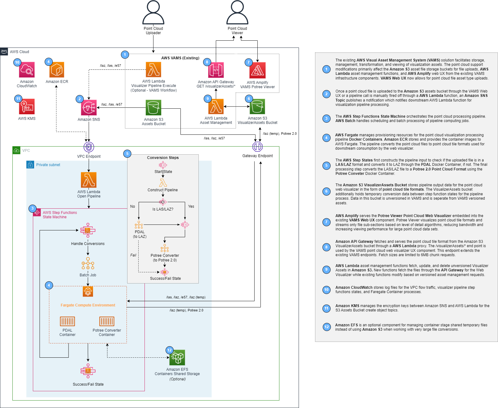

# Point Cloud Pipeline (PCP) Developer Guide

The Point Cloud Pipeline (PCP) provides functionality for converting a input pipeline into an octree LOD structure for streaming and real-time rendering of massive point clouds in a website visualizer. This primary component of this pipeline is in the [./visual-asset-management-system-v1.2.0-a8994dd/backendVisualizerProcessor/pc_pipeline](../../visual-asset-management-system-v1.2.0-a8994dd/backendVisualizerProcessor/pc_pipeline) which is two Docker container application using the Point Data Abstraction (PDAL) and Potree Converter Libraries.

## Contents

-   [Architecture](#architecture)
-   [Docker Notes](#docker-notes)
    -   [Prerequisites](#prerequisites)
    -   [Building the Container Image](#building-the-container-image)
    -   [Running the Container Image](#running-the-container-image)
-   [PDAL Pipeline](#pdal-pipeline)
-   [Potree Converter](#potree-converter-pipeline)
-   [References](#references)

## Architecture



### Overview

0. Open Pipeline Lambda function is called from a SNS event on adding an object to the VAMS Assets S3 bucket. Open Pipeline starts the Pipeline State Machine and passes through S3 bucket and object information.
1. Construct Pipeline Lambda function constructs the multi-stage JSON input definitions for the jobs based on the filetypes uploaded to the S3 bucket (e57 = PDAL + PotreeConveter, laz/laz = PotreeConverter)
2. AWS Batch Job executes for batch processing point cloud data
3. AWS Fargate Task provisions Docker container compute resources and runs the specific PCP app container
4. If the first stage/type is PDAL, the PDAL PCP container runs to translate the file to a LAZ format. The e57 file is retrieved form origniating S3 bucket. Outputs are to the VAMS AssetVisualizer S3 bucket as a temporary pipeline file.
5. If the first or last stage/type is POTREE, the POTREE PCP container runs to translate the original LAS/LAZ or previous stage LAZ file to a octree Potree 2.0 format. The LAS/LAZ inputs file are retrieved form origniating S3 bucket (Assets or AssetVisualizer (temp)). The octree format outputs are written to the VAMS AssetVisualizer S3 bucket. Note: Temporary files from PDAL are not deleted at this time.
6. After the PDAL or PDAL + POTREE stages are done, the StateMachine ends in a success or fail state depending on errors. Errors in the container are written to Cloudwatch logs.

Note: All container logic and AWS SDK use is controlled with Python scripts that are added to the containers at the time of build

## Docker Notes

### Prerequisites

Before getting started with the container, verify the following are installed.

-   Python >3.10: https://www.python.org/downloads/
-   Docker (CLI and/or Desktop): https://www.docker.com/

### Building the Container Image

When the `infra` package (AppStack) is deployed the PCP container images are built and uploaded for use with AWS Batch and Fargate. But, the following instructions can be for validating the PCP container images build successfully before deploying the stack.

The PCP docker build files are located at "./visual-asset-management-system-v1.2.0-a8994dd/backendVisualizerProcessor/pc_pipeline". The PDAL docker file is "Dockerfile_PDAL" while PotreeConverter is "Dockerfile_Potree".

PCP follows the multi-stage build strategy. First, the `build` image downloads, installs, and builds necessary project dependencies. Then, the `deploy` image adds built dependencies and the project files from `build`. This approach significantly reduces the total footprint of the container image.

Building the container image can range from a few minutes to 15 minutes depending on the machine you are building on. The PDAL container image is based on "condaforge/miniforge3" as the base docker image and POTREE is built on "python:3.11-alpine" as the base. This is based on the requirements and dependencies that each application needs.

The PDAL container size is 2.22GB while the Potree Container size is 228MB. Note: Further future enhancements could be made to bring these sizes down by choosing different base docker images and/or more splitting out with multi-stage docker container processing.

To build the container follow the below commands.

```
cd ./visual-asset-management-system-v1.2.0-a8994dd/backendVisualizerProcessor/pc_pipeline
docker build -t pcp-pdal -f Dockerfile_PDAL . --no-cache
docker build -t pcp-potree -f Dockerfile_Potree . --no-cache
```

The initial build can take a significant amount of time. To speed this up for future builds remove the `--no-cache` flag.

### Running the Container Image

> NOTE: The container is intended to be run in AWS and has dependencies on Amazon S3 and AWS Step Functions. To run the container locally, the application will need to be modified to allow for supplied AWS credentials. For this, refer to the AWS docs for assuming an IAM role with temporary credentials: https://docs.aws.amazon.com/IAM/latest/UserGuide/id_credentials_temp.html

To manually run the container, the input payload schema must be in the following form and quotes are required to be escaped.

```
PipelineExecutionBase {
    jobName: string;
    pipeline: {
                type: string; //note: (options: "PDAL", "POTREE")
                definition: {
                    jobName: string;
                    stages: [{
                        type: string; //note: (options: "PDAL", "POTREE")
                        input: {
                            bucketName: string;
                            objectKey: string;
                            fileExtension: string;
                        };
                        output: {
                            bucketName: string;
                            objectDir: string;
                        }
                    }];
                };

            };
    status: string; //note: (initial options: "STARTING")

}
```

As an example:

```
docker run pcp-pdal "{\"jobName\": \"testJob\",\n  \"pipeline\": {\"type\": \"PDAL\",\"definition\": {\"jobName\": \"testJob\",\"stages\": [{\"type\": \"PDAL\",\"input\": {\"bucketName\": \"assets\",\"objectKey\": \"\/test\/test.e57\",\"fileExtension\": \".e57\"},\"output\": {\"bucketName\":\"visualizerAssets\",\"objectDir\": \"\/test\/\"}}]}}, \"status\": \"STARTING\"}"


docker run -it -v C:/input:/data/input:rw pcp-potree:latest
```

## PDAL Pipeline

The PDAL library is used in this application to streamline transforming the point data to a LAZ format that Potree Conveter can accept.

### Base Pipeline

Ingests and unzips the non-LAZ/LAS files (i.e. E57) and outputs a LAZ file.

## Potree Converter Pipeline

The PotreeConverter library is used in this application to convert LAZ/LAS files to a octree point cloud format for streaming to web browser frameworks

### Base Pipeline

Ingests and unzips LAZ/LAS files and outputs a Potree 2.0 octree files (multiple file ouput).
Note: Potree 2.0 octree output files are generally larger (1.1x - 8x) than the original input point cloud files

## References

-   PDAL - Point Data Abstraction Library, is a C++ library for translating and manipulating point cloud data. https://pdal.io/
-   Potree Converter - Converter of point cloud data to Potree 2.0 format: https://github.com/potree/PotreeConverter
-   Potree 2.0 - Point Cloud files in the Octree LOD format for streaming and real-time rendering of massive point clouds. Whitepaper: https://www.cg.tuwien.ac.at/research/publications/2020/SCHUETZ-2020-MPC/
