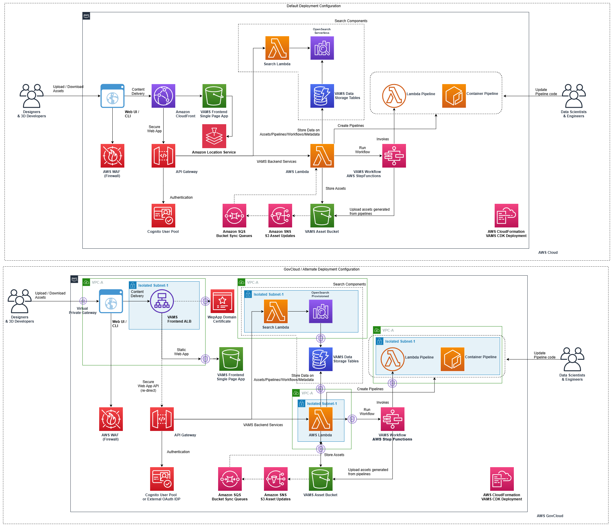
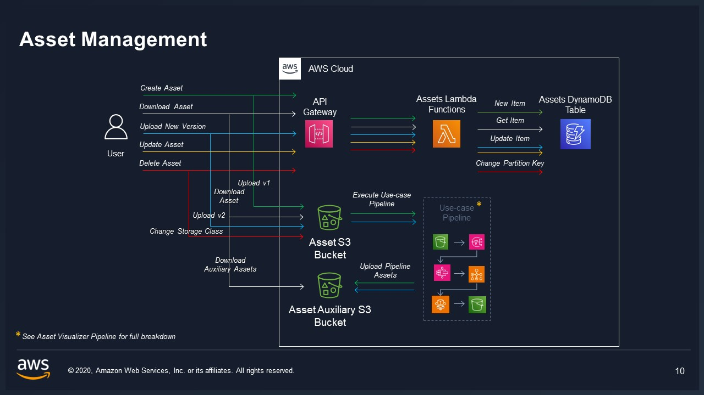
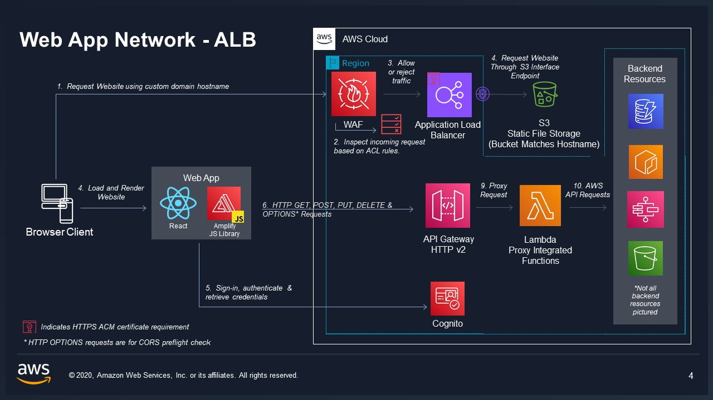
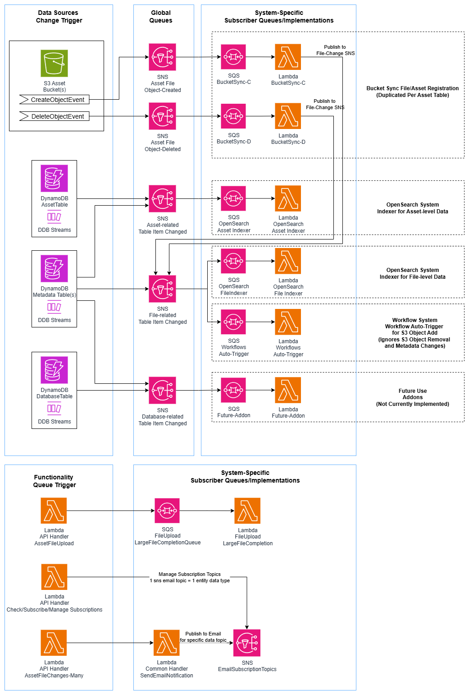
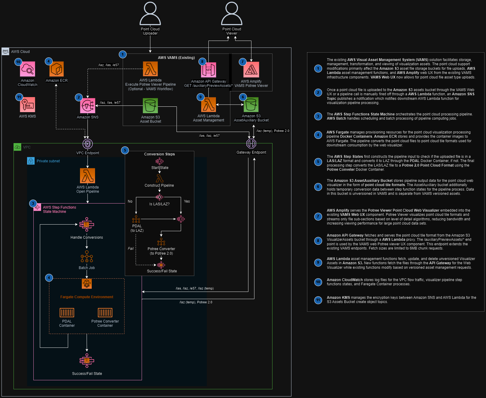
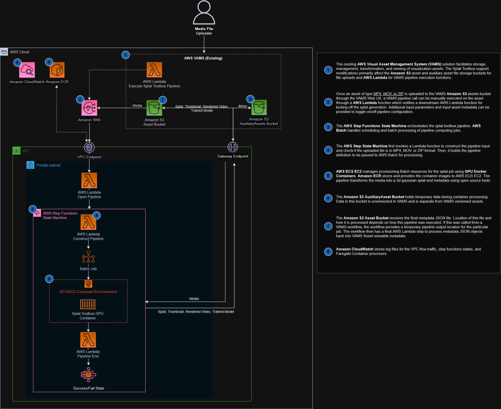
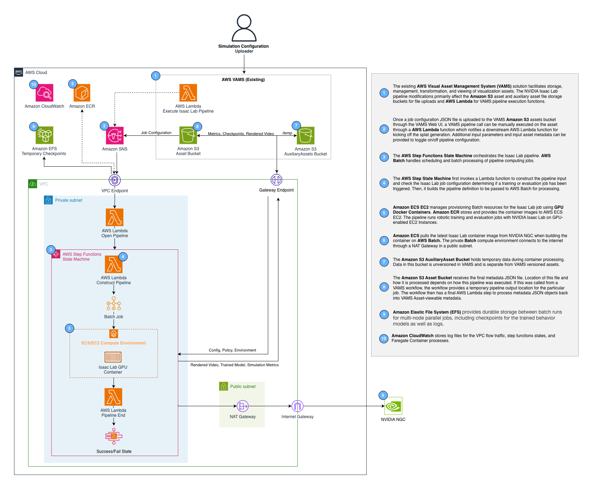

<h1> VAMS Developer Guide </h1>

## Architecture components

### Architecture Overview



### Backend

VAMS Backend is composed of AWS Lambda functions that are accessed through an AWS API Gateway.

#### Architecture diagrams for Individual components

#### Asset Management



#### Pipelines Creation

Pipelines are a feature in VAMS that allow you to edit


#### Workflows Execution


### Frontend WebApp

VAMS Frontend is a single page ReactJS application. It can be deployed via CloudFront or ALB




### Queue Systems



### Security

VAMS API and frontend are authorized through AWS Cognito user accounts by default. Additional options include external IDP use.


Federated authentication with SAML is available with additional configuration. See [SAML Authentication in the developer guide](./DeveloperGuide.md#saml-authentication) for instructions.

### Code Layout

| component                 | folder           |
| ------------------------- | ---------------- |
| web application           | web              |
| cdk deployment            | infra            |
| api and backend           | backend          |
| use-case pipeline backend | backendPipelines |
| command line interface    | tools/VamsCLI    |

## Install

### Requirements

-   Python 3.12
-   Docker
-   Node >=20.18.1
-   Yarn >=1.22.19
-   Node Version Manager (nvm)
-   Conda-forge [only for optional local development]
-   AWS cli
-   AWS CDK cli
-   Programatic access to AWS account at minimum access levels outlined above.
-   Poetry (optional: for managing python dependencies in the VAMS backend)

### Deploy VAMS for the First Time

#### Local Development

For local development, there are 2 options in regards to the backend: pointing to a local mocked backend or a remote backend that has already been deployed.

##### Local Backend

Some local development is possible when using a local backend, but not all APIs are available locally.

Pre-reqs for local development:

-   Conda installed and on PATH
-   In `web/src/config.ts`, update the following values:
    -   Set `DEV_API_ENDPOINT='http://localhost:8002/'`

Terminal 1 (Running mocked API server):
Before running the mockup API server, make sure to update amplifyConfig and secureConfig values accordingly in `backend/backend/localDev_api_server.py`
Note: You may get errors due to other environment variables not set, you can ignore these as they do not hold up the mock API server

```bash
source ~/.bash_profile # for conda
cd ./backend
conda env create --name vams --file=vams-local.conda.yaml -y
conda activate vams
USE_LOCAL_MOCKS=true python3 backend/localDev_api_server.py # port 8002 # powershell: $env:USE_LOCAL_MOCKS = "true"
```

Terminal 2 (Running mocked auth server):

```bash
source ~/.bash_profile # for conda
cd ./backend
conda env create --name vams --file=vams-local.conda.yaml -y
conda activate vams
python3 localDev_oauth2_server.py # port 9031
```

Terminal 3 (Running web server):

```bash
cd ./web && yarn install && npm run build && python3 -m http.server 8001 -d build
```

The `yarn install` only need to be run once if dependencies haven't been modified, local frontend can be started with only:

`npm run build && python3 -m http.server 8001 -d build`

or `npm run start` to have **live reload** on code changes.

_Note_: `npm run start` will need the port set via an environment variable `PORT=8001`.

Now load [http://localhost:8001](http://localhost:8001) in a browser. (Don't need to provide any credentials on login)

##### Remote Backend

Pointing local frontend to a remote backend assumes the backend has already been deployed and functioning.

-   In `web/src/config.ts`, update the following values:
    -   Update `DEV_API_ENDPOINT` to point to the remote API endpoint

Terminal 1 (Running web server):

```bash
cd ./web && yarn install && npm run build && cd ./build
```

The `yarn install` only need to be run once if dependencies haven't been modified, local frontend can be started with only:

`npm run build && python3 -m http.server 8001 -d build`

or `npm run start` to have **live reload** on code changes.

_Note_: `npm run start` will need the port set via an environment variable `PORT=8001`.

Now load [http://localhost:8001](http://localhost:8001) in a browser.

#### Build & Deploy Steps (Linux/Mac)

VAMS Codebase is changing frequently and we recommend you checkout the stable released version from github.

You can identify stable releases by their tag. Fetch the tags `git fetch --all --tags` and then `git checkout tags/TAG` or `git checkout -b TAG tags/TAG` where TAG is the actual desired tag. A list of tags is found by running `git tag --list` or on the [releases page](https://github.com/awslabs/visual-asset-management-system/releases).

1. `cd ./web && nvm use` - make sure you're node version matches the project. Make sure Docker daemon is running.

2. `yarn install` - make sure you install the packages required by the web app

3. `npm run build` - build the web app.

4. `cd ../infra && npm install` - installs dependencies defined in package.json.

5. If you haven't already bootstrapped your aws account with CDK. `cdk bootstrap aws://101010101010/us-east-1` - replace with your account and region. If you are boostrapping a GovCloud account, run `export AWS_REGION=[gov-cloud-region]` as the AWS SDK needs to be informed to use GovCloud endpoints.

6. Modify the `config.json` in `/infra/config` to set the VAMS deployment parameters and features you would like to deploy. Recommended minimum fields to update are `region`, `adminEmailAddress`, and `baseStackName` when using the default provided template. More information about the configuration options can be found in the Configuration Options section below.

7. (Optional) Override the the CDK stack name and region for deployment with environment variables `export AWS_REGION=us-east-1 && export STACK_NAME=dev` - replace with the region you would like to deploy to and the name you want to associate with the cloudformation stack that the CDK will deploy.

8. (FIPS Use Only) If deploying with FIPS, enable FIPS environment variables for AWS CLI `export AWS_USE_FIPS_ENDPOINT=true` and enable `app.useFips` in the `config.json` configuration file in `/infra/config`

9. (External VPC Import Only) If importing an external VPC with subnets in the `config.json` configuration, run `cdk deploy --all --require-approval never --context loadContextIgnoreVPCStacks=true` to import the VPC ID/Subnets context and deploy all non-VPC dependant stacks first. Failing to run this with the context setting or configuration setting of `loadContextIgnoreVPCStacks` will cause the final deployment of all stacks step to fail.

10. `npm run deploy.dev` - An account is created in an AWS Cognito User Pool using the email address specified in the infrastructure config file. Expect an email from <`no-reply@verificationemail.com`> with a temporary password.

    10a. Ensure that docker is running before deploying as a container will need to be built

#### Deployment Success

1. Navigate to URL provided in `{stackName].WebAppCloudFrontDistributionDomainNameOutput` (Cloudfront) or `{stackName].WebsiteEndpointURLOutput` (ALB) from `cdk deploy` output.

2. Check email for temporary account password to log in with the email address you provided.

### Multiple Deployments With Different or Same Region in Single Account

You can change the region and deploy a new instance of VAMS my setting the environment variables to new values (`export AWS_REGION=us-east-1 && export STACK_NAME=dev`) and then running `npm run deploy.dev` again.

### Deploy VAMS Updates

To deploy customzations or updates to VAMS, you can update the stack by running `cdk deploy --all`. A changeset is created and deployed to your stack.

Please note, depending on what changes are in flight, VAMS may not be available to users in part or in whole during the deployment. Please read the change log carefully and test changes before exposing your users to new versions.

Deployment data migration documentation and scripts between major VAMS version deployments are located in `/infra/deploymentDataMigration`

### Deployment Troubleshooting

#### CDK Error: failed commit on ref "manifest-sha256:...": unexpected status from PUT request to https://....dkr.ecr.REGION.amazonaws.com/v2/foo/manifests/bar: 400 Bad Request

#### CDK Error: Lambda function XXX reached terminal FAILED state due to InvalidImage(ImageLayerFailure: UnsupportedImageLayerDetected - Layer Digest sha256:XXX) and failed to stabilize

If you receive these errors, it may be related to a defect in the latest CDK version working with Docker documented here: https://github.com/aws/aws-cdk/issues/31549

As a possible workaround if you are using the docker buildx platform, set the following terminal or operating system environment variable to stop the error:
`BUILDX_NO_DEFAULT_ATTESTATIONS=1`

Additionally, you may need to clear docker cache and set docker to handle cross-platform emulation when deploying from ARM64 deployment machines (i.e., Mac M3):

-   Clear your Docker cache: `docker system prune -a`
-   Set cross-platform emulation: `docker run --rm --privileged multiarch/qemu-user-static --reset -p yes`

### SAML Authentication - Cognito

SAML authentication enables you to provision access to your VAMS instance using your organization's federated identity provider such as Auth0, Active Directory, or Google Workspace.

If the configuration file `/infra/config/config.json` set `AuthProvider.UseCognito.UseSaml` to `true` to enable, `false` for disabled

You need your SAML metadata url, and then you can fill out the required information in `infra/config/saml-config.ts`.

The required information is as follows:

-   `name` identifies the name of your identity provider.
-   `cognitoDomainPrefix` is a DNS compatible, globally unique string used as a subdomain of cognito's signon url.
-   `metadataContent` is a url of your SAML metadata. This can also point to a local file if `metadataType` is changed to `cognito.UserPoolIdentityProviderSamlMetadataType.FILE`.

Then you can deploy the infra stack by running `cdk deploy --all` if you have already deployed or using the same build and deploy steps as above.

The following stack outputs are required by your identity provider to establish trust with your instance of VAMS:

-   SAML IdP Response URL
-   SP urn / Audience URI / SP entity ID
-   CloudFrontDistributionUrl for the list of callback urls. Include this url with and without a single trailing slack (e.g., <https://example.com> and <https://example.com/>)

### JWT Token Authentication - Cognito

VAMS API requires a valid authorization token that will be validated on each call against the configured authentication system (eg. Cognito).

All API calls require that the below claims be included as part of that JWT token. This is done via the `pretokengen` lambda that is triggered on token generation in Cognito. If implementing a different authentication OATH system, developers must ensure these claim token are included in their JWT token.

The critical component right now is that the authenticated VAMS username be included in the `tokens` array. Roles and externalAttributes are optional right now as they are looked up at runtime.

```
{
    'claims': {
        "tokens": [<username>],
        "roles": [<roles>],
        "externalAttributes": []
    }
}
```

NOTE: GovCloud deployments when the GovCloud configuration setting is true only support v1 of the Cognito lambdas. This means that ONLY Access tokens produced by Cognito can be used with VAMS API Calls for authentication/authorization. Otherwise both ID and Access tokens can be used for Non-govcloud deployments.

### LoginProfile Custom Organizational Updates

VAMS supports adding custom logic to how VAMS user profile information is updated and with what information.

This logic should be overriden by each oranization as needed within `/backend/backend/customConfigCommon/customAuthLoginProfile.py`

The default logic is to fill in and override login profile information like email from the JWT token returned by the IDP.

LoginProfile is updated via a authenticated API call by the user from the webUI (on login) via a POST call to `/api/auth/loginProfile/{userId}`.

Email field of the loginProfile is used by systems that need to send emails to the user. It will revert to the userId of email is blank or not in an email format as a backup.

### Auth Claims / MFACheck Custom Organizational Updates

VAMS supports adding custom logic to how to check auth claims, including if Multi-Factor Authentication (MFA) is enabled for a logged in user when using an external OAUTH IDP configuration

This logic should be overriden by each oranization as needed within `/backend/backend/customConfigCommon/customAuthClaimsCheck.py`

The default logic is for external OAUTH IDP is to just set the MFA enabled flag hard-coded to false. As each IDP is different, this must be a custom call.

NOTE: Be mindful of the logic used as this can have great performance impacts for VAMS. Try to use caches in this method or reduce the amount of external API calls as this method is called very frequently during VAMS API authorization checks.

### Custom API Gateway Authorizer

VAMS uses a custom Lambda authorizer system for all API Gateway endpoints that provides unified authentication for both Cognito and External OAuth IDP configurations, along with optional IP range restrictions and comprehensive JWT claims context.

#### Authorizer Features

The custom authorizer provides the following capabilities:

1. **Unified Authentication**: Supports both Cognito and External OAuth IDP JWT token verification
2. **Hybrid JWT Libraries**: Uses python-jose for Cognito (AWS best practices) and PyJWT for External IDP
3. **IP Range Restrictions**: Optional IP-based access control using configurable IP range pairs
4. **Path-Based Authorization**: Specific authorizers for ignored paths with `$context.routeKey` identity source
5. **Payload Format Version 2.0**: Simple boolean `{"isAuthorized": true/false}` responses
6. **Comprehensive JWT Claims Context**: All JWT claims passed to downstream Lambda functions
7. **Token Caching**: Implements public key caching for improved performance
8. **Dedicated Lambda Layer**: Isolated dependencies for security and performance

#### Configuration

The custom authorizer is configured through the `authProvider.authorizerOptions` section in the configuration:

```json
{
    "authProvider": {
        "authorizerOptions": {
            "allowedIpRanges": [
                ["192.168.1.1", "192.168.1.255"],
                ["10.0.0.1", "10.0.0.255"]
            ]
        }
    }
}
```

**Configuration Options:**

-   `allowedIpRanges`: Array of IP range pairs `[["min_ip", "max_ip"], ...]`
    -   Optional: Leave empty array `[]` to allow all IPs
    -   Each range is defined as a pair of minimum and maximum IP addresses
    -   Supports multiple ranges for complex network configurations
    -   IP validation performed before JWT verification for performance optimization

#### Implementation Architecture

The custom authorizer implementation consists of:

-   **HTTP Authorizer**: `/backend/backend/handlers/auth/apiGatewayAuthorizerHttp.py`
-   **WebSocket Authorizer**: `/backend/backend/handlers/auth/apiGatewayAuthorizerWebsocket.py`
-   **CDK Lambda Builders**: `/infra/lib/lambdaBuilder/authFunctions.ts`
-   **Dedicated Lambda Layer**: `/backend/lambdaLayers/authorizer/` with specialized dependencies
-   **Configuration Constants**: `/infra/config/config.ts` with `CUSTOM_AUTHORIZER_IGNORED_PATHS`

#### Lambda Layer Dependencies

The authorizer Lambda layer includes:

```
# Cognito JWT verification
python-jose[cryptography]==3.3.0
# External IDP JWT verification
PyJWT[crypto]==2.10.1
cryptography==45.0.6
requests==2.32.5
aws-lambda-powertools==3.19.0
```

#### JWT Claims Context Integration

The authorizer passes **all JWT claims** to downstream Lambda functions through the API Gateway context. Claims are accessible via:

```python
    #Handle both claims from APIGateway standard authorizer format, lambda authorizers, or lambda cross-calls
    if 'jwt' in lambdaRequestEvent['requestContext']['authorizer'] and 'claims' in lambdaRequestEvent['requestContext']['authorizer']['jwt']:
        claims = lambdaRequestEvent['requestContext']['authorizer']['jwt']['claims']
    elif 'lambda' in lambdaRequestEvent['requestContext']['authorizer']:
        claims = lambdaRequestEvent['requestContext']['authorizer']['lambda']
    elif 'lambdaCrossCall' in lambdaRequestEvent: #currently this case wouldn't apply for now due to check above
        claims = lambdaRequestEvent['lambdaCrossCall']
    else:
        claims = {}
```

**Supported Claims Processing:**

-   **Cognito Claims**: `sub`, `cognito:username`, `email`, `token_use`, `aud`, `iss`, `exp`
-   **External IDP Claims**: `sub`, `preferred_username`, `email`, `upn`, `username`
-   **VAMS Custom Claims**: `vams:tokens`, `vams:roles`, `vams:externalAttributes`
-   **Standard JWT Claims**: All standard JWT fields are preserved and passed through

#### Authorizer Types and Configuration

**Default API Routes:**

-   **Identity Source**: `$request.header.Authorization`
-   **Cache TTL**: 15 seconds
-   **Response Type**: `SIMPLE` (payload format version 2.0)

**Ignored Paths** (`/api/amplify-config`, `/api/version`):

-   **Identity Source**: `$context.routeKey`
-   **Cache TTL**: 3600 seconds (1 hour)
-   **Response Type**: `SIMPLE` (payload format version 2.0)
-   **Behavior**: Bypasses JWT verification, allows immediate access

#### Customization

Organizations can customize the authorizer behavior by modifying:

1. **IP Validation Logic**: Modify `is_ip_authorized()` function for custom IP validation
2. **Path Handling**: Update ignored paths in `/infra/config/config.ts` constant `CUSTOM_AUTHORIZER_IGNORED_PATHS`
3. **JWT Verification**:
    - Cognito: Modify `verify_cognito_jwt()` using python-jose library
    - External IDP: Modify `verify_external_jwt()` using PyJWT library
4. **Claims Processing**: Extend context generation to include additional custom claims
5. **Error Handling**: Customize error responses and logging behavior

#### Security Considerations

-   **Performance Optimized**: IP validation performed before JWT verification
-   **Public Key Caching**: 1-hour TTL to reduce external API calls and improve performance
-   **Comprehensive Error Logging**: Detailed logging without exposing sensitive information
-   **Token Support**: Supports both ID and Access tokens for Cognito authentication
-   **Full JWT Validation**: Validates signature, expiration, audience, and issuer claims
-   **Dedicated Layer**: Security isolation with minimal dependencies
-   **Hybrid Verification**: Uses AWS-recommended libraries for each identity provider type

#### Troubleshooting

**Common Issues:**

-   **Missing Claims**: Ensure JWT tokens include required claims for VAMS operation
-   **IP Restrictions**: Check `allowedIpRanges` configuration if requests are being denied
-   **Cache Issues**: Authorizer responses are cached; consider cache TTL settings
-   **Token Format**: Ensure tokens follow proper Bearer token format in Authorization header
-   **WebSocket Tokens**: For WebSocket connections, tokens can be passed via query parameters or headers

**Debugging:**

-   Check CloudWatch logs for detailed authorizer execution information
-   Verify environment variables are properly set in Lambda functions
-   Confirm JWKS endpoints are accessible from Lambda execution environment
-   Validate JWT token structure and claims using online JWT decoders

### Local Docker Builds - Custom Build Settings

If you are needing to add custom settings to your local docker builds, such as adding custom SSL CA certificates to get through HTTPS proxies, modify the following docker build files:

1. `/infra/config/dockerDockerfile-customDependencyBuildConfig` - Docker file for all local packaging environments such as Lambda Layers and/or Custom Resources. Add extra lines to end of file.
2. `/backendPipelines/...` - Docker files for use-case pipeline containers. Add extra lines above any package install or downloads.

When specifying docker image pulls, all docker files should be defined/fixed to the `linux/amd64` platform. This alleievates issues with deploying across Windows, Max, and Linux host OS platforms.

### CDK Deploy with Custom SSL Cert Proxy

If you need to deploy VAMS CDK using custom SSL certificates due to internal organization HTTPS proxy requirements, follow the below instructions.

1. Download to your host machine the .pem certificate that is valid for your HTTPS proxy to a specific path
2. Set the following environments variables to the file path in step 1: `$AWS_CA_BUNDLE` and `$NODE_EXTRA_CA_CERTS`
3. Modify the Dockerbuild files specified and instructed in  and add the following lines (for Python PIP installs) below. Update `/local/OShost/path/Combined.pem` to the local host path relative to the Dockerfile location.

```
COPY /local/OShost/path/Combined.pem /var/task/Combined.crt
RUN pip config set global.cert /var/task/Combined.crt
```

4. You may need to add additional environment variables to allow using the ceritificate to be used for for `apk install` or `apt-get` system actions.

### CSP Configuration

VAMS supports configurable Content Security Policy (CSP) settings to allow organizations to add their specific external API endpoints and resources without modifying core code. This is particularly useful when integrating with external SaaS APIs or third-party services.

#### Configuration File Location

The CSP configuration is stored in `/infra/config/csp/cspAdditionalConfig.json`. This file allows you to specify additional CSP sources for different categories.

#### Configuration Structure

The configuration file supports the following CSP categories:

```json
{
    "connectSrc": ["https://api.example.com", "https://external-service.com"],
    "scriptSrc": ["https://cdn.example.com"],
    "imgSrc": ["https://images.example.com"],
    "mediaSrc": ["https://media.example.com"],
    "fontSrc": ["https://fonts.example.com"],
    "styleSrc": ["https://styles.example.com"]
}
```

#### CSP Categories Explained

-   **`connectSrc`**: Controls which URLs the application can connect to via XMLHttpRequest, WebSocket, EventSource, etc. Use this for external APIs and services.
-   **`scriptSrc`**: Controls which scripts can be executed. Use this for external JavaScript libraries or CDNs.
-   **`imgSrc`**: Controls which image sources can be loaded. Use this for external image services or CDNs.
-   **`mediaSrc`**: Controls which media sources (audio/video) can be loaded.
-   **`fontSrc`**: Controls which font sources can be loaded. Use this for external font services like Google Fonts.
-   **`styleSrc`**: Controls which stylesheets can be loaded. Use this for external CSS libraries or CDNs.

#### Common Use Cases

**External API Integration**

```json
{
    "connectSrc": [
        "https://api.mapbox.com",
        "https://api.openweathermap.org",
        "https://api.stripe.com"
    ]
}
```

**CDN Resources**

```json
{
    "scriptSrc": ["https://cdn.jsdelivr.net", "https://unpkg.com"],
    "styleSrc": ["https://cdn.jsdelivr.net", "https://fonts.googleapis.com"],
    "fontSrc": ["https://fonts.gstatic.com"]
}
```

**Image and Media Services**

```json
{
    "imgSrc": ["https://images.unsplash.com", "https://cdn.example.com"],
    "mediaSrc": ["https://media.example.com"]
}
```

#### Error Handling and Validation

The CSP configuration system includes robust error handling:

-   **Missing File**: If the configuration file doesn't exist, VAMS will use default CSP settings without failing.
-   **Invalid JSON**: Malformed JSON will be logged as a warning, and default CSP settings will be used.
-   **Empty Categories**: Empty arrays are ignored, and only default CSP sources are used for those categories.
-   **Invalid Entries**: Non-string entries or empty strings are filtered out with appropriate warnings.

#### Security Considerations

-   Only add trusted domains to your CSP configuration
-   Avoid using wildcards (`*`) as they can compromise security
-   Regularly review and audit your CSP configuration
-   Test your configuration in a development environment before deploying to production
-   Monitor browser console for CSP violations to identify missing or incorrect entries

#### Troubleshooting

**CSP Violations in Browser Console**
If you see CSP violation errors in the browser console, you may need to add the blocked domain to the appropriate CSP category.

**Build Failures**
The CSP configuration system is designed to never cause build failures. If you experience build issues, check the CDK deployment logs for CSP-related warnings.

**Configuration Not Taking Effect**

-   Ensure the JSON syntax is valid
-   Verify the file is located at `/infra/config/csp/cspAdditionalConfig.json`
-   Check CDK deployment logs for CSP configuration loading messages
-   Redeploy the CDK stack after making configuration changes

### Web Development

The web front-end runs on NodeJS React with a supporting library of amplify-js SDK. The React web page is setup as a single page app using React routes with a hash (#) router.

Infrastructure Note (Hash Router): The hash router was chosen in order so support both cloudfront and application load balancer (ALB) deployment options. As of today, ALBs do not support URL re-writing (without a EC2 reverse proxy), something needed to support normal (non-hash) web routing in React. It was chosen to go this route to ensure that the static web page serving is a AWS serverless process at the expense of SEO degredation, something generally not critical in internal enterprise deployments.

(Important!) Development Note (Hash Router): When using `<Link>`, ensure that the route paths have a `#` in front of them as Link uses the cloudscape library which doesn't tie into the React router. When using `<navigate>`, part of the native React library and thus looking at the route manager, exclude the `#` from the beginning of the route path. Not following this will cause links to return either additional appended hash routes in the path or not use hashes at all.

The front end when loading the page receives a configuration from the AWS backend to include amplify storage bucket, API Gateway/Cloudfront endpoints, authentication endpoints, and features enabled. Some of these are retrieved on load pre-authentication while others are received post-authentication. Features enabled is a comma-deliminated list of infrastructure features that were enabled/disabled on CDK deployment through the `config.json` file and toggle different front-end features to view.

#### 3D Asset Types Supported for In-Browser Viewing

VAMS currently integrates with several different asset viewers and supports the following formats for viewing 3D assets interactively.

| Name                              | Extension | Type   | Viewer             | Excluded Library | Notes                                                                                        |
| :-------------------------------- | :-------- | :----- | :----------------- | :--------------- | -------------------------------------------------------------------------------------------- |
| Wavefront                         | obj       | text   | Online 3D Viewer   |                  |                                                                                              |
| 3D Studio                         | 3ds       | binary | Online 3D Viewer   |                  |                                                                                              |
| Stereolithography                 | stl       | text   | Online 3D Viewer   |                  |                                                                                              |
| Stereolithography                 | stl       | binary | Online 3D Viewer   |                  |                                                                                              |
| glTF                              | gltf      | text   | Online 3D Viewer   |                  |                                                                                              |
| glTF                              | glb       | binary | Online 3D Viewer   |                  |                                                                                              |
| Object File Format                | off       | text   | Online 3D Viewer   |                  |                                                                                              |
| Object File Format                | off       | binary | Online 3D Viewer   |                  |                                                                                              |
| Dotbim                            | bim       | text   | Online 3D Viewer   |                  |                                                                                              |
| Rhinoceros 3D                     | 3dm       | binary | Online 3D Viewer   |                  |                                                                                              |
| Filmbox                           | fbx       | text   | Online 3D Viewer   |                  |                                                                                              |
| Filmbox                           | fbx       | binary | Online 3D Viewer   |                  |                                                                                              |
| Collada                           | dae       | text   | Online 3D Viewer   |                  |                                                                                              |
| Virtual Reality Modeling Language | wrl       | text   | Online 3D Viewer   |                  |                                                                                              |
| 3D Manufacturing Format           | 3mf       | text   | Online 3D Viewer   |                  |                                                                                              |
| Additive Manufacturing            | amf       | text   | Online 3D Viewer   |                  |                                                                                              |
| (Excluded\*) Dotbim               | ifc       | text   | Online 3D Viewer\* | web-ifc          |                                                                                              |
| (Excluded\*) FreeCad              | fcstd     | text   | Online 3D Viewer\* | occt-import-js   |                                                                                              |
| (Excluded\*) Boundary Rep         | brep      | text   | Online 3D Viewer\* | occt-import-js   |                                                                                              |
| (Excluded\*) ISO 10303 CAD        | step      | text   | Online 3D Viewer\* | occt-import-js   |                                                                                              |
| (Excluded\*) Graphics Exchange    | iges      | text   | Online 3D Viewer\* | occt-import-js   |                                                                                              |
| Point Cloud - LiDAR Data Exchange | laz       | binary | Potree Viewer      |                  |                                                                                              |
| Point Cloud - LiDAR Data Exchange | las       | binary | Potree Viewer      |                  |                                                                                              |
| Point Cloud - LiDAR Data Exchange | e57       | binary | Potree Viewer      |                  |                                                                                              |
| Polygon File Format               | ply       | binary | Potree Viewer      |                  | Type stores meshes and point clouds - VAMS currently showing only point cloud viewer for PLY |
| Polygon File Format               | ply       | text   | Potree Viewer      |                  |                                                                                              |

Viewers available include:

-   [Online 3D Viewer](https://github.com/kovacsv/Online3DViewer)
-   [Potree Viewer](https://github.com/potree/potree)

Please take note:

-   While we are limited to these formats to view assets, any file format may be uploaded to VAMS.
-   There are some limitations with formats that leverage multiple files such as glTF that uses json with references to other files.
-   Some viewers like Potree Viewer requires additional pipelines to be deployed to fully generate and view point cloud files.

Exclusion\* notes:

-   Online 3D Viewer requires the more restrivi licensed opencascade sub-library to view these file types. They are excluded due to VAMS license restrictions on carrying LGPL libraries.
-   -   If an organizations wishes to implement this sub-library and view these excluded file types with Online 3D viewer, add the excluded file types to the `onlineViewer3DFileFormats` constants array in `./web/src/common/constants/fileFormats.js`. Then add the listed excluded npm library in the web folder through `yarn add`.

### Implementing pipelines outside of Lambda

To process an asset through VAMS using an external system or when a job can take longer than the Lambda timeout of 15 minutes, it is recommended that you use the _Wait for a Callback with the Task Token_ feature so that the Pipeline Lambda can initiate your job and then exit instead of waiting for the work to complete before it also finishes. This reduces your Lambda costs and helps you avoid failed jobs that fail simply because they take longer than the timeout to complete.

To use _Wait for a call back with the Task Token_, enable the option to use Task Tokens on the create pipeline screen. When using this option, you must explicitly make a callback to the Step Functions API with the Task Token in the event passed to your Lambda function. The Task Token is provided in the event with the key `TaskToken`. You can see this using the Step Functions execution viewer under the Input tab for an execution with the call back enabled. Pass the `TaskToken` to the system that can notify the Step Functions API that the work is complete with the `SendTaskSuccess` message.

`SendTaskSuccess` is sent with the [aws cli](https://docs.aws.amazon.com/cli/latest/reference/stepfunctions/send-task-success.html#send-task-success) like this:

```
aws stepfunctions send-task-success --task-token 'YOUR_TASK_TOKEN' --task-output '{"status": "success"}'
```

Or, in python [using boto3, like this](https://boto3.amazonaws.com/v1/documentation/api/latest/reference/services/stepfunctions/client/send_task_success.html):

```
response = client.send_task_success(
    taskToken='string',
    output='string'
)
```

For other platforms, see the SDK documentation.

For task failures, see the adjacent api calls for `SendTaskFailure`.

Two additional settings enable your job to end with a timeout error by defining a task timeout. This can reduce your time to detect a problem with your task. By default, the timeout is over a year when working with task tokens. To set a timeout, specify a Task Timeout on the create pipeline screen.

If you would like your job check in to show that it is still running and fail the step if it does not check in within some amount of time less than the task timeout, define the Task Heartbeat Timeout on the create pipeline screen also. If more time than the specified seconds elapses between heartbeats from the task, this state fails with a States.Timeout error name.

### Registering Pipelines in CDK

VAMS provides an automated pipeline registration system that allows you to register your custom pipelines and workflows directly during CDK deployment. This eliminates the need for manual pipeline registration through the UI and ensures your pipelines are available immediately after deployment.

#### Overview

The pipeline registration system uses CloudFormation custom resources to automatically:

-   Register new pipelines in the global VAMS database
-   Create associated workflows for pipeline execution
-   Configure pipeline parameters and execution settings
-   Handle pipeline updates and cleanup during stack operations

#### Prerequisites

Before registering a pipeline, ensure:

1. Your pipeline Lambda function name contains "vams" (required for `executeWorkflow` permissions)
2. Your pipeline Lambda function is properly configured with required environment variables
3. The `autoRegisterWithVAMS` configuration flag is enabled for your pipeline

#### Configuration Setup

First, enable automatic registration in your pipeline configuration in `config.json`:

```json
{
    "app": {
        "pipelines": {
            "useYourPipeline": {
                "enabled": true,
                "autoRegisterWithVAMS": true
            }
        }
    }
}
```

#### CDK Implementation

##### In Your VAMS Pipeline Construct

Add the custom resource registration logic to your pipeline construct:

```typescript
import * as cdk from "aws-cdk-lib";
import * as lambda from "aws-cdk-lib/aws-lambda";
import * as cr from "aws-cdk-lib/custom-resources";

export interface YourPipelineConstructProps extends cdk.StackProps {
    config: Config.Config;
    storageResources: storageResources;
    vpc: ec2.IVpc;
    pipelineSubnets: ec2.ISubnet[];
    pipelineSecurityGroups: ec2.ISecurityGroup[];
    lambdaCommonBaseLayer: LayerVersion;
    importGlobalPipelineWorkflowFunctionName: string;
}

export class YourPipelineConstruct extends Construct {
    constructor(scope: Construct, id: string, props: YourPipelineConstructProps) {
        super(scope, id);

        // Create your pipeline Lambda function
        const yourPipelineFunction = new lambda.Function(this, "YourPipelineFunction", {
            // Function configuration
            functionName: "your-vams-pipeline-function", // Must contain "vams"
            // ... other configuration
        });

        // Create custom resource to automatically register pipeline and workflow
        if (props.config?.app?.pipelines?.useYourPipeline?.autoRegisterWithVAMS === true) {
            const region = cdk.Stack.of(this).region;
            const account = cdk.Stack.of(this).account;

            const importFunction = lambda.Function.fromFunctionArn(
                this,
                "ImportFunction",
                `arn:aws:lambda:${region}:${account}:function:${props.importGlobalPipelineWorkflowFunctionName}`
            );

            const importProvider = new cr.Provider(this, "ImportProvider", {
                onEventHandler: importFunction,
            });

            const currentTimestamp = new Date().toISOString();

            // Register your pipeline and workflow
            new cdk.CustomResource(this, "YourPipelineWorkflow", {
                serviceToken: importProvider.serviceToken,
                properties: {
                    timestamp: currentTimestamp, // Forces re-execution on every deployment
                    pipelineId: "your-custom-pipeline-id",
                    pipelineDescription: "Description of your custom pipeline",
                    pipelineType: "standardFile", // or "previewFile"
                    pipelineExecutionType: "Lambda",
                    assetType: ".input-extension", // e.g., ".obj", ".gltf"
                    outputType: ".output-extension", // e.g., ".glb", ".usdz"
                    waitForCallback: "Enabled", // "Enabled" for async, "Disabled" for sync
                    lambdaName: yourPipelineFunction.functionName,
                    taskTimeout: "3600", // Optional: timeout in seconds (max 86400)
                    taskHeartbeatTimeout: "300", // Optional: heartbeat timeout (max 3600)
                    inputParameters: JSON.stringify({
                        // Optional: pipeline-specific parameters
                        customParam1: "value1",
                        customParam2: "value2",
                    }),
                    workflowId: "your-custom-workflow-id",
                    workflowDescription: "Description of your custom workflow",
                },
            });
        }
    }
}
```

#### Separate CDK Project Integration

If you're developing your pipeline in a separate CDK project, you can still use the VAMS registration system by importing the Lambda function name:

##### 1. External CDK Project Setup

```typescript
import * as cdk from "aws-cdk-lib";
import * as lambda from "aws-cdk-lib/aws-lambda";
import * as cr from "aws-cdk-lib/custom-resources";

export class ExternalPipelineStack extends cdk.Stack {
    constructor(scope: Construct, id: string, props: cdk.StackProps) {
        super(scope, id, props);

        // Your pipeline Lambda function
        const myPipelineFunction = new lambda.Function(this, "MyPipelineFunction", {
            functionName: "my-external-vams-pipeline", // Must contain "vams"
            runtime: lambda.Runtime.PYTHON_3_12,
            handler: "index.handler",
            code: lambda.Code.fromAsset("./lambda"),
            timeout: cdk.Duration.minutes(15),
        });

        // Import the VAMS registration function (replace with actual ARN)
        const vamsImportFunction = lambda.Function.fromFunctionArn(
            this,
            "VamsImportFunction",
            "arn:aws:lambda:us-east-1:123456789012:function:your-vams-stack-importGlobalPipelineWorkflow"
        );

        const importProvider = new cr.Provider(this, "VamsImportProvider", {
            onEventHandler: vamsImportFunction,
        });

        const currentTimestamp = new Date().toISOString();

        // Register with VAMS
        new cdk.CustomResource(this, "RegisterWithVams", {
            serviceToken: importProvider.serviceToken,
            properties: {
                timestamp: currentTimestamp,
                pipelineId: "external-pipeline-id",
                pipelineDescription: "External pipeline for custom processing",
                pipelineType: "standardFile",
                pipelineExecutionType: "Lambda",
                assetType: ".custom",
                outputType: ".processed",
                waitForCallback: "Enabled",
                lambdaName: myPipelineFunction.functionName,
                taskTimeout: "7200",
                taskHeartbeatTimeout: "600",
                inputParameters: JSON.stringify({
                    processingMode: "advanced",
                    quality: "high",
                }),
                workflowId: "external-workflow-id",
                workflowDescription: "External workflow for custom processing",
            },
        });
    }
}
```

##### 2. Finding the VAMS Import Function ARN

To find the import function ARN from your VAMS deployment:

```bash
# List Lambda functions to find the import function
aws lambda list-functions --query 'Functions[?contains(FunctionName, `importGlobalPipelineWorkflow`)].FunctionArn'

# Or use CDK outputs if available
aws cloudformation describe-stacks --stack-name your-vams-stack-name --query 'Stacks[0].Outputs[?contains(OutputKey, `ImportFunction`)].OutputValue'
```

#### Custom Resource Properties

The custom resource accepts the following properties:

##### Required Properties

| Property                | Type   | Description                                        | Example                              |
| ----------------------- | ------ | -------------------------------------------------- | ------------------------------------ |
| `timestamp`             | string | Current timestamp to force re-execution            | `new Date().toISOString()`           |
| `pipelineId`            | string | Unique pipeline identifier (3-63 chars)            | `"my-custom-pipeline"`               |
| `pipelineDescription`   | string | Human-readable pipeline description                | `"Custom 3D model processor"`        |
| `pipelineType`          | string | Pipeline type: `"standardFile"` or `"previewFile"` | `"standardFile"`                     |
| `pipelineExecutionType` | string | Execution type: `"Lambda"`                         | `"Lambda"`                           |
| `assetType`             | string | Input file extension                               | `".obj"`                             |
| `outputType`            | string | Output file extension                              | `".glb"`                             |
| `waitForCallback`       | string | Async mode: `"Enabled"` or `"Disabled"`            | `"Enabled"`                          |
| `lambdaName`            | string | Lambda function name (must contain "vams")         | `"my-vams-pipeline-function"`        |
| `workflowId`            | string | Unique workflow identifier                         | `"my-custom-workflow"`               |
| `workflowDescription`   | string | Human-readable workflow description                | `"Automated 3D processing workflow"` |

##### Optional Properties

| Property               | Type   | Description                        | Range      | Default      |
| ---------------------- | ------ | ---------------------------------- | ---------- | ------------ |
| `taskTimeout`          | string | Task timeout in seconds            | 1-86400    | No timeout   |
| `taskHeartbeatTimeout` | string | Heartbeat timeout in seconds       | 1-3600     | No heartbeat |
| `inputParameters`      | string | JSON string of pipeline parameters | Valid JSON | `"{}"`       |

#### Lambda Function Naming Requirements

**Critical**: Your pipeline Lambda function name MUST contain "vams" to ensure proper permissions for the `executeWorkflow` system to invoke your pipeline. Examples of valid names:

-   ✅ `my-vams-pipeline-function`
-   ✅ `vams-custom-processor`
-   ✅ `image-vams-converter`
-   ❌ `my-pipeline-function` (missing "vams")
-   ❌ `custom-processor` (missing "vams")

#### Pipeline Types

-   **`standardFile`**: Processes input files and produces output files
-   **`previewFile`**: Generates preview/thumbnail files for visualization

#### Execution Modes

-   **`waitForCallback: "Enabled"`**: Asynchronous execution using Step Functions task tokens
    -   Use for long-running processes (>15 minutes)
    -   Requires calling `SendTaskSuccess` or `SendTaskFailure`
    -   More cost-effective for long processes
-   **`waitForCallback: "Disabled"`**: Synchronous execution
    -   Use for quick processes (<15 minutes)
    -   Lambda function must complete within timeout
    -   Simpler implementation

#### Error Handling

The registration system includes comprehensive error handling:

-   **Validation Errors**: Invalid parameters are caught during deployment
-   **Registration Failures**: Failed registrations are logged and reported
-   **Cleanup**: Pipelines are automatically cleaned up when stacks are destroyed
-   **Idempotency**: Re-deployments update existing pipelines safely

#### Troubleshooting

##### Common Issues

1. **Permission Denied**: Ensure your Lambda function name contains "vams"
2. **Validation Errors**: Check that all required properties are provided and valid
3. **Import Function Not Found**: Verify the import function ARN is correct
4. **Registration Timeout**: Check CloudWatch logs for the import function

##### Debugging Steps

1. Check CloudFormation events for custom resource status
2. Review CloudWatch logs for the import function
3. Verify pipeline configuration in VAMS UI after deployment
4. Test pipeline execution through VAMS workflows

##### Log Locations

-   **Import Function Logs**: `/aws/lambda/your-stack-importGlobalPipelineWorkflow`
-   **Pipeline Function Logs**: `/aws/lambda/your-pipeline-function-name`
-   **CloudFormation Events**: CloudFormation console → Stack → Events

#### Best Practices

1. **Use Descriptive IDs**: Make pipeline and workflow IDs descriptive and unique
2. **Version Your Pipelines**: Include version information in descriptions
3. **Test Locally**: Test your pipeline logic before deploying
4. **Monitor Execution**: Set up CloudWatch alarms for pipeline failures
5. **Document Parameters**: Clearly document `inputParameters` structure
6. **Use Appropriate Timeouts**: Set realistic timeout values based on processing time
7. **Handle Errors Gracefully**: Implement proper error handling in your pipeline code

### Special Configurations

#### Static WebApp - ALB w/ Manual VPC Interface Endpoint Creation

During deployment of the ALB configuration for the static web contents, some organizations require that all VPC endpoints be created outside of a CDK stack.

Turn the `app.useAlb.addAlbS3SpecialVpcEndpoint` infrastructure configuration to `false` in this scenario. The following VPC Interface Endpoint will need to be created as well as the other required steps to link it to the ALB target groups and S3 (after the stack has been deployed):

1. Deploy the stack first with the configuration setting to `false`
2. Create a VPC Interface Endpoint on the VPC on the same subnets used on the ALB deployment and using/linked to the newly created VPCe security group already setup as part of the stack for the VPC endpoint.
3. Add a new IAM resource policy on the VPC endpoint to allow all `["s3:Get*", "s3:List*"]` actions for the S3 webAppBucket (bucket name will be the domain name used for the ALB) and its objects
4. Update the IAM resource policy on the webAppBucket S3 bucket (bucket name will be the domain name used for the ALB) to add a condition to only allow connections from the created VPC Interface Endpoint
5. Lookup all the Private IP Addresses for each ALB subnet that are assigned to the VPC Interface endpoint
6. Add to the stack-created ALB target group all the VPCe IP addresses looked up in the previous step.
7. Update the resource policy of the S3 ALB domainname bucket (which contains the webapp files) to update the condition of `aws:SourceVpce` to point to the new VPCe endpoint ID

#### Single/Multi-S3 Assets Bucket Support and Setup

During deployment of CDK you can define different asset buckets to create and/or use. The `app.assetBuckets.createNewBucket` and `app.assetBuckets.defaultNewBucketSyncDatabaseId` CDK configuration define if the CDK should create and manage a new bucket and which databaseId it should sync direct S3 changes to. The default prefix it uses for this bucket is `/` for assets.

Or, you can additionally define external buckets that already exist to use for assets and syncing. This is defined in the `app.assetBuckets.externalAssetBuckets[]` CDK configuration that requires fields for `app.assetBuckets.externalAssetBuckets[].bucketArn`, `app.assetBuckets.externalAssetBuckets[].baseAssetsPrefix`, `app.assetBuckets.externalAssetBuckets[].defaultSyncDatabaseId` per external bucket. See the [Configuration Guide](./ConfigurationGuide.md) for information on these fields

At least a new creation or 1 external bucket must be defined.

NOTE!!!: Follow the instructions in this External S3 Setup Guide before deploying the VAMS CDK infrastructure if using external buckets!!!
See the [External S3 Setup Guide](./External-S3-Setup-Guide.md) for all external buckets, especially those going cross-account.

During CDK the S3 Assets Buckets dynamoDB table will be populated with the available buckets defined. This table is the basis for VAMS databases to define which bucket / prefix to use. the defaultSyncDatabaseId is used to narrow down on a database (or create one) if multiple for a bucket/prefix are defined or not existing.

Assets separately store which bucket and bucket prefix they are assigned to once an asset is initially created. This is determined based on what the defaultDatabaseBucketId is at the time of asset creation.

Any buckets within the base asset prefix will also sync changes back to dynamoDB tables and opensearch indexes if changes are made directly. New asset prefix folders will create a new asset in VAMS. File changes under that asset will be picked up by the file manager API calls and auto-index in OpenSearch as needed. Asset folder S3 deletions will not delete assets out of VAMS entirely (it will show as an empty asset) in VAMS, these must be manually archived or deleted through the VAMS API / UI currently.

Existing buckets that are brought in with existing files/asset folders in the base prefix defined will need to change a file in each asset prefix folder or add a `init` file to create/catalog the asset in VAMS. `init` files will be deleted after the asset is processed if you don't/can't change an existing file in a asset folder in S3.

### Uninstalling

1. Run `cdk destroy` from infra folder
2. Some resources may not be deleted by CDK (e.g S3 buckets and DynamoDB table) and you will have to delete them via aws cli or using aws console

Note:

After running CDK destroy there might still some resources be running in AWS that will have to be cleaned up manually as CDK does not delete some resources.

### Deployment Overview

The CDK deployment deploys the VAMS stack into your account. The components that are created by this app are:

1. Web app hosted on [cloudfront](https://aws.amazon.com/cloudfront/) distribution
2. [API Gateway](https://aws.amazon.com/api-gateway/) to route front end calls to api handlers.
3. [Lambda](https://aws.amazon.com/lambda/) Lambda handlers are created per API path.
4. [DynamoDB](https://aws.amazon.com/dynamodb/) tables to store Workflows, Assets, Pipelines
5. [S3 Buckets](https://aws.amazon.com/s3/) for assets, cdk deployments and log storage
6. [Cognito User Pool](https://docs.aws.amazon.com/cognito/) for authentication
7. [Open Search Collection](https://aws.amazon.com/opensearch-service/features/serverless/) for searching the assets using metadata
   

# API Schema

Please see [Swagger Spec](https://github.com/awslabs/visual-asset-management-system/blob/main/VAMS_API.yaml) for details

# S3 Buckets

| Bucket                 | Description                                                                                                                                                      |
| ---------------------- | ---------------------------------------------------------------------------------------------------------------------------------------------------------------- |
| accessLogsBucket       | For storing access logs from other S3 buckets                                                                                                                    |
| assetBucket            | Primary bucket for asset storage (optional creation if loading from external)                                                                                    |
| assetAuxiliaryBucket   | For auto-generated auxiliary working objects associated with asset storage (includes auto-generated previews, visualizer files, temporary storage for pipelines) |
| artefactsBucket        | For storing artefacts                                                                                                                                            |
| webAppAccessLogsBucket | For storing web app access logs                                                                                                                                  |
| webAppBucket           | For hosting the web application (static content)                                                                                                                 |

# DynamoDB Database Tables and Schema

## Tables

| Table                                 | Partition Key                     | Sort Key                    | Attributes                                                                                                                                                                                                         |
| ------------------------------------- | --------------------------------- | --------------------------- | ------------------------------------------------------------------------------------------------------------------------------------------------------------------------------------------------------------------ |
| AppFeatureEnabledStorageTable         | featureName                       | n/a                         |                                                                                                                                                                                                                    |
| AssetStorageTable                     | databaseId                        | assetId                     | assetLocation, assetName, assetType, currentVersion, description, generated_artifacts, isDistributable, previewLocation, versions, tags, status                                                                    |
| AssetLinksStorageTable                | assetIdFrom                       | assetIdTo                   |                                                                                                                                                                                                                    |
| AssetFileVersionsStorageTable         | assetId:assetVersionId            | fileKey                     |                                                                                                                                                                                                                    |
| AssetFileMetadataVersionsStorageTable | databaseId:assetId:assetVersionId | type:filePath:metadataKey   | databaseId:assetId, metadataKey, metadataValue, metadataValueType, createdAt                                                                                                                                       |
| AssetVersionsStorageTable             | assetId                           | assetVersionId              | dateCreated, comment, description, specifiedPipelines, createdBy                                                                                                                                                   |
| AssetUploadsStorageTable              | uploadId                          | assetId                     | databaseId                                                                                                                                                                                                         |
| AuthEntitiesStorageTable              | entityType                        | sk                          |                                                                                                                                                                                                                    |
| CommentStorageTable                   | assetId                           | assetVersionId:commentId    |                                                                                                                                                                                                                    |
| ConstraintsStorageTable               | constraintId                      | n/a                         | name, description, objectType, criteriaAnd (JSON), criteriaOr (JSON), groupPermissions (JSON), userPermissions (JSON), groupIds (StringSet), userIds (StringSet), dateCreated, dateModified, createdBy, modifiedBy |
| DatabaseStorageTable                  | databaseId                        | n/a                         | assetCount, dateCreated, description, defaultBucketId, restrictMetadataOutsideSchemas, restrictFileUploadsToExtensions                                                                                             |
| MetadataStorageTable                  | databaseId                        | assetId                     | Varies with user provided attributes                                                                                                                                                                               |
| MetadataSchemaStorageTable            | databaseId                        | field                       |                                                                                                                                                                                                                    |
| PipelineStorageTable                  | databaseId                        | pipelineId                  | assetType, dateCreated, description, enabled, outputType, pipelineType, pipelineExecutionType, inputParameters                                                                                                     |
| RolesStorageTable                     | roleName                          | n/a                         |                                                                                                                                                                                                                    |
| SubscriptionsStorageTable             | eventName                         | entityName_entityId         |                                                                                                                                                                                                                    |
| TagStorageTable                       | tagName                           | n/a                         |                                                                                                                                                                                                                    |
| TagTypeStorageTable                   | tagTypeName                       | n/a                         |                                                                                                                                                                                                                    |
| UserRolesStorageTable                 | userId                            | roleName                    |                                                                                                                                                                                                                    |
| UserStorageTable                      | userId                            | n/a                         | email                                                                                                                                                                                                              |
| S3AssetBucketsStorageTable            | bucketId                          | bucketName:baseAssetsPrefix | bucketName, baseAssetsPrefix                                                                                                                                                                                       |
| WorkflowStorageTable                  | databaseId                        | workflowId                  | dateCreated, description, specifiedPipelines, workflow_arn                                                                                                                                                         |
| WorkflowExecutionStorageTable         | assetId                           | executionId                 | workflowId, databaseId, workflow_arn, execution_arn, startDate, stopDate, executionStatus                                                                                                                          |

## AssetStorageTable

| Field               | Data Type | Description                                                                                                    |
| ------------------- | --------- | -------------------------------------------------------------------------------------------------------------- |
| assetLocation       | Map       | S3 Bucket and Key for this asset                                                                               |
| assetName           | String    | The user provided asset name                                                                                   |
| assetType           | String    | The file extension of the asset                                                                                |
| currentVersion      | Map       | The current version of the S3 object                                                                           |
| description         | String    | The user provided description                                                                                  |
| generated_artifacts | Map       | S3 bucket and key references to artifacts generated automatically through pipelines when an asset is uploaded. |
| isDistributable     | Boolean   | Whether the asset is distributable                                                                             |
| bucketId            | String    | The bucket ID where this asset is stored that matches S3AssetBucketsStorageTable                               |

### Global Secondary Indexes

| Index Name  | Partition Key | Sort Key   | Description                                         |
| ----------- | ------------- | ---------- | --------------------------------------------------- |
| BucketIdGSI | bucketId      | assetId    | For querying assets to a S3 bucket location         |
| assetIdGSI  | assetId       | databaseId | For querying assets to a S3 asset id without a scan |

---

## AssetFileMetadataVersionsStorageTable (Current)

**Purpose**: Stores historical snapshots of asset and file metadata/attributes for each asset version. This enables version control for metadata, allowing users to view what metadata existed at the time of a version and optionally revert metadata when reverting to a previous version. Introduced in v2.2 to support comprehensive asset versioning.

| Field                             | Data Type | Description                                                           |
| --------------------------------- | --------- | --------------------------------------------------------------------- |
| databaseId:assetId:assetVersionId | String    | (PK) Composite key: database, asset, and version identifier           |
| type:filePath:metadataKey         | String    | (SK) Composite key: metadata type, file path, and metadata key        |
| databaseId:assetId                | String    | Composite key for asset-level queries (without version)               |
| metadataKey                       | String    | The metadata/attribute field name (stored separately for easy access) |
| metadataValue                     | String    | The metadata/attribute value at the time of version creation          |
| metadataValueType                 | String    | Data type of the value (string, number, date, json, etc.)             |
| createdAt                         | String    | ISO timestamp when this version snapshot was created                  |

**Key Patterns**:

-   Asset-level metadata: `type:filePath:metadataKey` = `metadata:/:{key}` or `attribute:/:{key}`
-   File-level metadata: `type:filePath:metadataKey` = `metadata:/path/to/file:{key}` or `attribute:/path/to/file:{key}`

**Type Values**:

-   `metadata`: Snapshot from AssetFileMetadataStorageTableV2 (supports rich data types)
-   `attribute`: Snapshot from FileAttributeStorageTableV2 (string-only values)

### Global Secondary Indexes

| Index Name             | Partition Key      | Sort Key                  | Description                                                         |
| ---------------------- | ------------------ | ------------------------- | ------------------------------------------------------------------- |
| DatabaseIdAssetIdIndex | databaseId:assetId | type:filePath:metadataKey | For querying all versioned metadata across all versions of an asset |

## PipelineStorageTable

| Field                 | Data Type | Description                                                                     |
| --------------------- | --------- | ------------------------------------------------------------------------------- |
| assetType             | String    | File extension of the asset                                                     |
| dateCreated           | String    | Creation date of this record                                                    |
| description           | String    | User provided description                                                       |
| enabled               | Boolean   | Whether this pipeline is enabled                                                |
| outputType            | String    | File extension of the output asset                                              |
| pipelineType          | String    | Defines the pipeline type — StandardFile/PreviewFile                            |
| pipelineExecutionType | String    | Defines the pipeline execution type — Lambda                                    |
| inputParameters       | String    | Defines the optional JSON parameters that get sent to the pipeline at execution |

## DatabaseStorageTable

| Field | Data Type | Description

| Field              | Data Type              | Description                                                                            |
| ------------------ | ---------------------- | -------------------------------------------------------------------------------------- |
| dateCreated        | String                 | Creation date of this record                                                           |
| description        | String                 | User provided description                                                              |
| specifiedPipelines | Map, List, Map, String | List of pipelines given by their name, outputType, pipelineType, pipelineExecutionType |
| workflow_arn       | String                 | The ARN identifying the step function state machine                                    |

## WorkflowExecutionStorageTable

| Field           | Data Type | Description                                                                     |
| --------------- | --------- | ------------------------------------------------------------------------------- |
| asset_id        | String    | Asset identifier for this workflow execution                                    |
| database_id     | String    | Database to which the asset belongs                                             |
| execution_arn   | String    | The state machine execution arn                                                 |
| execution_id    | String    | Execution identifier                                                            |
| workflow_arn    | String    | State machine ARN                                                               |
| workflow_id     | String    | Workflow identifier                                                             |
| stopDate        | String    | Stop Datetime of the execution (if blank, still running)                        |
| startDate       | String    | Start Datetime of the execution (if blank, still running)                       |
| executionStatus | String    | Execution final status (if blank, still running)                                |
| assets          | List, Map | List of Maps of asset objects (see AssetStorageTable for attribute definitions) |

### Global Secondary Indexes

| Index Name     | Partition Key | Sort Key    | Description                                   |
| -------------- | ------------- | ----------- | --------------------------------------------- |
| WorkflowIdGSI  | assetId       | workflowId  | For querying executions by asset and workflow |
| ExecutionIdGSI | workflowId    | executionId | For querying executions by workflow           |

## AssetLinksStorageTable

| Field       | Data Type | Description                         |
| ----------- | --------- | ----------------------------------- |
| assetIdFrom | String    | Source asset ID in the relationship |
| assetIdTo   | String    | Target asset ID in the relationship |

### Global Secondary Indexes

| Index Name     | Partition Key | Sort Key | Description                                |
| -------------- | ------------- | -------- | ------------------------------------------ |
| AssetIdFromGSI | assetIdFrom   | n/a      | For querying all outgoing links from asset |
| AssetIdToGSI   | assetIdTo     | n/a      | For querying all incoming links to asset   |

## AssetUploadsStorageTable

| Field      | Data Type | Description                         |
| ---------- | --------- | ----------------------------------- |
| uploadId   | String    | Unique identifier for the upload    |
| assetId    | String    | Asset identifier                    |
| databaseId | String    | Database to which the asset belongs |

### Global Secondary Indexes

| Index Name    | Partition Key | Sort Key | Description                      |
| ------------- | ------------- | -------- | -------------------------------- |
| AssetIdGSI    | assetId       | uploadId | For querying uploads by asset    |
| DatabaseIdGSI | databaseId    | uploadId | For querying uploads by database |

## ConstraintsStorageTable

The ConstraintsStorageTable stores authorization constraints for the VAMS Casbin-based permission system. This table was introduced in v2.4 to provide optimized query performance using Global Secondary Indexes (GSIs) instead of table scans.

| Field            | Data Type | Description                                                                 |
| ---------------- | --------- | --------------------------------------------------------------------------- |
| constraintId     | String    | (PK) Unique identifier for the constraint (UUID or descriptive name)        |
| name             | String    | Human-readable name for the constraint                                      |
| description      | String    | Detailed description of what the constraint allows/denies                   |
| objectType       | String    | Type of object this constraint applies to (api, web, database, asset, etc.) |
| criteriaAnd      | String    | JSON string of AND criteria for constraint matching                         |
| criteriaOr       | String    | JSON string of OR criteria for constraint matching                          |
| groupPermissions | String    | JSON string of role/group-based permissions                                 |
| userPermissions  | String    | JSON string of user-specific permissions                                    |
| groupIds         | StringSet | Set of groupIds for GSI queries (extracted from groupPermissions)           |
| userIds          | StringSet | Set of userIds for GSI queries (extracted from userPermissions)             |
| dateCreated      | String    | ISO timestamp when constraint was created                                   |
| dateModified     | String    | ISO timestamp when constraint was last modified                             |
| createdBy        | String    | Username who created the constraint                                         |
| modifiedBy       | String    | Username who last modified the constraint                                   |

### Global Secondary Indexes

| Index Name            | Partition Key | Sort Key     | Description                                                     |
| --------------------- | ------------- | ------------ | --------------------------------------------------------------- |
| GroupPermissionsIndex | groupId       | objectType   | For querying constraints by role/group (20-100x faster queries) |
| UserPermissionsIndex  | userId        | objectType   | For querying constraints by user (20-100x faster queries)       |
| ObjectTypeIndex       | objectType    | constraintId | For querying constraints by object type (admin/management)      |

### Performance Improvements (v2.4)

The ConstraintsStorageTable provides significant performance improvements over the previous AuthEntitiesTable approach:

-   **Query Performance**: 20-100x faster using GSI queries instead of table scans
-   **Query Complexity**: O(log n) instead of O(n)
-   **DynamoDB RCU**: 20-100x reduction in read capacity units
-   **Authorization Latency**: 20-40x faster authorization checks
-   **Cache Reliability**: Fixed cache expiration (30 seconds vs 15-30 minutes)

### Data Format

**Criteria Format** (stored as JSON strings):

```json
[
    {
        "field": "route__path",
        "id": "all_api_paths",
        "operator": "contains",
        "value": ".*"
    }
]
```

**Permissions Format** (stored as JSON strings):

```json
[
    {
        "groupId": "admin",
        "id": "admin-allow-get-all-apis",
        "permission": "GET",
        "permissionType": "allow"
    }
]
```

### Migration from v2.3 to v2.4

Constraints are automatically created in the new table during CDK deployment for default roles (admin, basicReadOnly, basic, pipeline). For custom constraints, use the migration script in `infra/deploymentDataMigration/v2.3_to_v2.4/upgrade/`.

See the [v2.3 to v2.4 Migration Guide](../infra/deploymentDataMigration/v2.3_to_v2.4/upgrade/v2.3_to_v2.4_migration_README.md) for details.

## SubscriptionsStorageTable

| Field               | Data Type | Description                       |
| ------------------- | --------- | --------------------------------- |
| eventName           | String    | Name of the event to subscribe to |
| entityName_entityId | String    | Combined entity name and ID       |

## MetadataStorageTable (DEPRECATED - For Migration Only)

**Status**: DEPRECATED in v2.3+ - Replaced by DatabaseMetadataStorageTableV2, AssetFileMetadataStorageTableV2, and FileAttributeStorageTableV2

**Migration Note**: This table is kept for backward compatibility during migration from v2.2 to v2.3+. New deployments should use the V2 tables below.

| Field      | Data Type | Description                                 |
| ---------- | --------- | ------------------------------------------- |
| databaseId | String    | (PK) Database identifier                    |
| assetId    | String    | (SK) Asset identifier                       |
| \*         | Varies    | User-provided metadata attributes (dynamic) |

**Stream**: NEW_IMAGE enabled for indexing

---

## DatabaseMetadataStorageTableV2 (Current)

**Purpose**: Stores metadata associated with databases. Introduced in v2.3 to support the new metadata architecture with rich data types and schema validation.

| Field             | Data Type | Description                                                    |
| ----------------- | --------- | -------------------------------------------------------------- |
| metadataKey       | String    | (PK) The metadata field name/key                               |
| databaseId        | String    | (SK) Database identifier                                       |
| metadataValue     | String    | The metadata value (stored as string, type defined separately) |
| metadataValueType | String    | Data type of the value (string, number, date, json, etc.)      |

**Stream**: NEW_IMAGE enabled for indexing

### Global Secondary Indexes

| Index Name      | Partition Key | Sort Key    | Description                                       |
| --------------- | ------------- | ----------- | ------------------------------------------------- |
| DatabaseIdIndex | databaseId    | metadataKey | For querying all metadata for a specific database |

**Use Cases**:

-   Retrieve all metadata for a database
-   List metadata keys for a database
-   Support pagination of database metadata

---

## AssetFileMetadataStorageTableV2 (Current)

**Purpose**: Stores metadata associated with assets and individual files within assets. Supports both asset-level metadata (filePath = "/") and file-level metadata. Introduced in v2.3 to support rich data types and hierarchical metadata.

| Field                       | Data Type | Description                                                    |
| --------------------------- | --------- | -------------------------------------------------------------- |
| metadataKey                 | String    | (PK) The metadata field name/key                               |
| databaseId:assetId:filePath | String    | (SK) Composite key: database, asset, and file path             |
| databaseId:assetId          | String    | Composite key for asset-level queries (without file path)      |
| metadataValue               | String    | The metadata value (stored as string, type defined separately) |
| metadataValueType           | String    | Data type of the value (string, number, date, json, etc.)      |

**Stream**: NEW_IMAGE enabled for indexing

**Key Patterns**:

-   Asset-level metadata: `databaseId:assetId:/` (filePath = "/")
-   File-level metadata: `databaseId:assetId:/path/to/file.ext`

### Global Secondary Indexes

| Index Name                     | Partition Key               | Sort Key    | Description                                           |
| ------------------------------ | --------------------------- | ----------- | ----------------------------------------------------- |
| DatabaseIdAssetIdFilePathIndex | databaseId:assetId:filePath | metadataKey | For querying all metadata for a specific file         |
| DatabaseIdAssetIdIndex         | databaseId:assetId          | metadataKey | For querying all metadata across an asset (all files) |

**Use Cases**:

-   Retrieve all metadata for a specific file
-   Retrieve all metadata for an asset (including all files)
-   Support pagination of file metadata
-   Enable efficient metadata queries without scanning

---

## FileAttributeStorageTableV2 (Current)

**Purpose**: Stores simple string-based attributes for files within assets. Attributes are optimized for fast filtering and search operations. Unlike metadata, attributes only support string values. Introduced in v2.3 alongside the metadata tables.

| Field                       | Data Type | Description                                               |
| --------------------------- | --------- | --------------------------------------------------------- |
| attributeKey                | String    | (PK) The attribute field name/key                         |
| databaseId:assetId:filePath | String    | (SK) Composite key: database, asset, and file path        |
| databaseId:assetId          | String    | Composite key for asset-level queries (without file path) |
| attributeValue              | String    | The attribute value (always string type)                  |
| attributeValueType          | String    | Data type (always "string" for attributes)                |

**Stream**: NEW_IMAGE enabled for indexing

**Key Patterns**:

-   Asset-level attributes: `databaseId:assetId:/` (filePath = "/")
-   File-level attributes: `databaseId:assetId:/path/to/file.ext`

### Global Secondary Indexes

| Index Name                     | Partition Key               | Sort Key     | Description                                             |
| ------------------------------ | --------------------------- | ------------ | ------------------------------------------------------- |
| DatabaseIdAssetIdFilePathIndex | databaseId:assetId:filePath | attributeKey | For querying all attributes for a specific file         |
| DatabaseIdAssetIdIndex         | databaseId:assetId          | attributeKey | For querying all attributes across an asset (all files) |

**Use Cases**:

-   Fast filtering by categorical values (color, material, status, etc.)
-   Search optimization with simple string matching
-   Tag-like metadata for files
-   Efficient attribute queries without complex type handling

**Metadata vs Attributes**:

-   **Metadata**: Rich data types (number, date, json, xyz, geopoint, etc.) for complex data
-   **Attributes**: String-only values for fast filtering and search

---

## AssetLinksMetadataStorageTable (Current)

**Purpose**: Stores metadata associated with asset links (relationships between assets). Introduced in v2.3 to support metadata on asset relationships.

| Field             | Data Type | Description                                                    |
| ----------------- | --------- | -------------------------------------------------------------- |
| assetLinkId       | String    | (PK) Unique identifier for the asset link                      |
| metadataKey       | String    | (SK) The metadata field name/key                               |
| metadataValue     | String    | The metadata value (stored as string, type defined separately) |
| metadataValueType | String    | Data type of the value (string, number, date, json, etc.)      |

**Stream**: NEW_IMAGE enabled for indexing

**Use Cases**:

-   Store relationship-specific metadata (e.g., relationship type, strength, confidence)
-   Track when and why assets were linked
-   Support rich metadata on asset relationships

---

## MetadataSchemaStorageTable (DEPRECATED - For Migration Only)

**Status**: DEPRECATED in v2.3+ - Replaced by MetadataSchemaStorageTableV2

**Migration Note**: This table is kept for backward compatibility during migration from v2.2 to v2.3+. New deployments should use MetadataSchemaStorageTableV2.

| Field      | Data Type | Description              |
| ---------- | --------- | ------------------------ |
| databaseId | String    | (PK) Database identifier |
| field      | String    | (SK) Metadata field name |
| \*         | Varies    | Schema definition fields |

---

## MetadataSchemaStorageTableV2 (Current)

**Purpose**: Stores metadata schema definitions that control validation, data types, and constraints for metadata across different entity types (databases, assets, files, asset links). Introduced in v2.3 to support comprehensive metadata validation and schema management.

| Field                         | Data Type | Description                                                                                  |
| ----------------------------- | --------- | -------------------------------------------------------------------------------------------- |
| metadataSchemaId              | String    | (PK) Unique identifier for the schema (UUID)                                                 |
| databaseId:metadataEntityType | String    | (SK) Composite key: database and entity type                                                 |
| databaseId                    | String    | Database identifier (or "GLOBAL" for global schemas)                                         |
| metadataSchemaEntityType      | String    | Entity type: databaseMetadata, assetMetadata, fileMetadata, fileAttribute, assetLinkMetadata |
| schemaName                    | String    | Human-readable name for the schema                                                           |
| fields                        | String    | JSON string containing field definitions (see Fields Schema below)                           |
| enabled                       | Boolean   | Whether the schema is active                                                                 |
| fileKeyTypeRestriction        | String    | Optional file extension filter (e.g., ".glb", ".obj") for file-level schemas                 |
| dateCreated                   | String    | ISO timestamp when schema was created                                                        |
| dateModified                  | String    | ISO timestamp when schema was last modified                                                  |
| createdBy                     | String    | Username who created the schema                                                              |
| modifiedBy                    | String    | Username who last modified the schema                                                        |

### Global Secondary Indexes

| Index Name                        | Partition Key                 | Sort Key         | Description                                              |
| --------------------------------- | ----------------------------- | ---------------- | -------------------------------------------------------- |
| DatabaseIdMetadataEntityTypeIndex | databaseId:metadataEntityType | metadataSchemaId | For querying schemas by database and entity type         |
| MetadataEntityTypeIndex           | metadataEntityType            | metadataSchemaId | For querying schemas by entity type across all databases |
| DatabaseIdIndex                   | databaseId                    | metadataSchemaId | For querying all schemas for a specific database         |

**Use Cases**:

-   Validate metadata against defined schemas
-   Enforce required fields and data types
-   Support controlled vocabularies and dependencies
-   Enable file-type-specific metadata schemas
-   Provide schema inheritance (database → GLOBAL)

### Fields Schema (JSON Structure)

The `fields` attribute contains a JSON string with the following structure:

```json
{
  "fieldName": {
    "fieldType": "string|number|date|json|xyz|geopoint|etc",
    "required": true|false,
    "defaultValue": "optional default value",
    "dependsOn": ["field1", "field2"],
    "multiFieldConflict": ["conflictingField1"],
    "controlledList": ["option1", "option2", "option3"]
  }
}
```

**Field Definition Properties**:

-   **fieldType**: Data type for validation (matches metadataValueType)
-   **required**: Whether field must be present
-   **defaultValue**: Default value if not provided
-   **dependsOn**: Fields that must exist if this field is present
-   **multiFieldConflict**: Fields that cannot coexist with this field
-   **controlledList**: Allowed values for inline_controlled_list type

**Entity Types**:

-   `databaseMetadata`: Schemas for database-level metadata
-   `assetMetadata`: Schemas for asset-level metadata (filePath = "/")
-   `fileMetadata`: Schemas for file-level metadata
-   `fileAttribute`: Schemas for file-level attributes (string-only)
-   `assetLinkMetadata`: Schemas for asset link metadata

**Schema Inheritance**:

-   Database-specific schemas apply to that database only
-   GLOBAL schemas (databaseId = "GLOBAL") apply across all databases
-   Validation aggregates both database and GLOBAL schemas

## UserStorageTable

| Field  | Data Type | Description                               |
| ------ | --------- | ----------------------------------------- |
| userId | String    | (PK) Main user ID associated with profile |
| email  | String    | Email belonging to the user               |

## S3AssetBucketsStorageTable

| Field                       | Data Type | Description                                                |
| --------------------------- | --------- | ---------------------------------------------------------- |
| bucketId                    | String    | Unique identifier (UUID/GUID) for the bucket configuration |
| bucketName:baseAssetsPrefix | String    | Composite key combining bucket name and prefix             |
| bucketName                  | String    | Name of the S3 bucket used for asset storage               |
| baseAssetsPrefix            | String    | Base prefix path within the bucket for assets              |
| isVersioningEnabled         | Bool      | If the bucket has versioning enabled or not                |

### Global Secondary Indexes

| Index Name    | Partition Key | Sort Key         | Description                             |
| ------------- | ------------- | ---------------- | --------------------------------------- |
| bucketNameGSI | bucketName    | baseAssetsPrefix | For querying buckets by name and prefix |

The S3AssetBucketsStorageTable stores information about S3 buckets used for asset storage in the VAMS system. This table supports a multi-bucket architecture where assets can be stored across different S3 buckets with different base prefixes. The table is populated during deployment by a custom resource that adds entries for each bucket configured in the system.

# Updating Backend

The dependencies for the backend lambda functions are handled using poetry. If you changed the lambda functions make sure to do a `cdk deploy` to reflect the change.

The core VAMS lambda handlers are categorized based on the project domain. E.g you will find all assets related functions in the `/backend/backend/assets` folder.

The pipeline containers and lambda handlers are categorized based pipeline use-case implementations. You will find all pipeline components related to these in the `/backend/backendPipelines` folder.

# Adding your own pipelines

When you create pipelines in VAMS, you currently have one execution option and two pipeline type options

1. Create a lambda execution type pipeline. Pick either standard or preview pipeline type (currently there are no differences as of v2.1, preview will have a future implementation functionality)

## Lambda pipeline

AWS Lambda is the compute platform for VAMS Lambda Pipelines.

When you create a VAMS Lambda pipeline you can either allow VAMS to create a new AWS Lambda function or provide a name of an existing AWS Lambda function to be used as a pipeline.

### Creating your lambda function through VAMS pipeline

When you create a VAMS Lambda pipeline and dont provide name of an existing AWS Lambda function, VAMS will create an AWS Lambda function in your AWS account where VAMS is deployed. This lambda function will have the same name as the pipelineId you provided while creating the pipeline and append `vams-`. This lambda function contains an example pipeline code. This example code can be modified with your own pipeline business logic.

### Using existing lambda function as a pipeline

Sometimes you may want to write your pipelines separately from VAMS stack. Some reasons for this are

1. Separating pipeline code from VAMS deployment code
2. Different personas with no access to VAMS are working on pipeline code
3. Pipelines are managed in a separate CDK/CloudFormation stack altogether.

If you want to use an existing AWS Lambda function as a pipeline in VAMS you can provide the function name of your AWS Lambda function in the create pipeline UI. See the section below for the event payload passed by VAMS workflows when your pipelines are executed.

The VAMS workflow functionality by default will have access to any lambda function within the deployed AWS account with the word `vams` in it. If your existing function does not have this, you will have to grant manual invoke permissions to the workflow stepfunctions role.

## Lambda pipeline interface

When a VAMS workflow invokes a VAMS Lambda pipeline, it invokes the corresponding AWS Lambda function with an event payload like below:

```
"body": {
    "inputS3AssetFilePath": "<S3 URI of the primary asset file to be used as input>",
    "outputS3AssetFilesPath": "<Predetermined output path for asset files generated by pipeline's execution */**>",
    "outputS3AssetPreviewPath": "<Predetermined output path for asset preview files generated by pipeline's execution **>",
    "outputS3AssetMetadataPath": "<Predetermined output path for asset metadata generated by pipeline's execution */**/***>",
    "inputOutputS3AssetAuxiliaryFilesPath": "<Predetermined path for asset auxiliary files generated by pipeline's execution ****>",
    "inputParameters": "<Optional input JSON parameters specified at the time of pipeline creation. Generally these map to allowed pipeline configuration parameters of the call-to pipeline>",
    "inputMetadata": "<Input metadata JSON constructed from the VAMS asset the pipeline was executed from to provide pipelines additional context. See below for the JSON schema>",
    "executingUsername": <The username of the user who executed the pipeline for use with permissioning>,
    "executingRequestContext": <The originating lambda request context from executing the pipeline for use with permissioning>
}
```

-   \* The path specified is a unique location based on the execution job run. No two executions will have the same output path for these paths.
-   \*\* If no files are located at the output locatin at the end of an execution, the respective asset data will not be modified
-   \*\*\* Metadata files are in the form of JSON objects. All key/value fields in the top-level JSOn object will be added to the asset's metadata. Fields that already exist will be overwriten.
-   \*\*\*\* The asset axuliary location is used for pipeline or asset non-versioned files or pipeline temporary files. The file path provided is not unique to the job execution and is a global path based on the asset selected and pipeline name.

Below is the input metadata schema JSON object constructed and passed into each pipeline execution:

```
    "VAMS": {
        "assetData": {
            "assetName":"<Name of the asset the workflow is executed from>",
            "description": "<Description of the asset the workflow is executed from>",
            "tags": ["<Array of tags of the asset the workflow is executed from>"]
        },
        "assetMetadata": {
            <... Dynamically constructed fields of all the metadata fields (key/value) from the VAMS asset and metadata of the primary VAMS asset file ...>
        }
    }
```

### Pipeline Execution Input Parameters - Detailed Reference

This section provides comprehensive documentation of all input parameters passed to pipeline Lambda functions during workflow execution.

#### Complete Lambda Event Payload Structure

When a workflow executes a pipeline, the Lambda function receives an event with the following complete structure:

```json
{
    "body": {
        "inputS3AssetFilePath": "s3://bucket-name/asset-path/file.ext",
        "outputS3AssetFilesPath": "s3://bucket-name/pipelines/pipeline-name/job-id/output/execution-id/files/",
        "outputS3AssetPreviewPath": "s3://bucket-name/pipelines/pipeline-name/job-id/output/execution-id/previews/",
        "outputS3AssetMetadataPath": "s3://bucket-name/pipelines/pipeline-name/job-id/output/execution-id/metadata/",
        "inputOutputS3AssetAuxiliaryFilesPath": "s3://auxiliary-bucket/pipelines/pipeline-name/",
        "bucketAssetAuxiliary": "auxiliary-bucket-name",
        "bucketAsset": "asset-bucket-name",
        "inputAssetFileKey": "asset-path/file.ext",
        "inputAssetLocationKey": "asset-path/",
        "outputType": ".output-extension",
        "inputMetadata": "{...JSON string...}",
        "inputParameters": "{...JSON string...}",
        "executingUserName": "username",
        "executingRequestContext": {...request context object...},
        "TaskToken": "AQCEAAAAKgAAAA..." // Only present if waitForCallback is enabled
    }
}
```

#### Input Metadata Schema (inputMetadata)

The `inputMetadata` field contains a JSON string that, when parsed, provides comprehensive context about the asset and file being processed. **As of VAMS v2.3+**, metadata is separated into asset-level and file-level metadata:

```json
{
    "VAMS": {
        "assetData": {
            "assetName": "My 3D Model",
            "description": "A detailed architectural model",
            "tags": ["architecture", "building", "3d-model"]
        },
        "assetMetadata": {
            "creator": "John Doe",
            "dateCreated": "2024-01-15",
            "projectName": "Downtown Plaza",
            "customField1": "value1",
            "customField2": "value2"
        },
        "fileMetadata": {
            "fileSize": "2048576",
            "fileFormat": "glTF 2.0",
            "triangleCount": "15000",
            "textureResolution": "2048x2048",
            "processingDate": "2024-01-20T10:30:00Z"
        }
    }
}
```

**Metadata Field Descriptions:**

-   **`assetData`**: Core asset information from the VAMS asset record
    -   `assetName`: User-provided name of the asset
    -   `description`: User-provided description of the asset
    -   `tags`: Array of tags associated with the asset
-   **`assetMetadata`**: Base asset-level metadata (always present)
    -   Contains all metadata fields associated with the asset itself
    -   Includes custom metadata fields added by users or previous pipelines
    -   Does NOT include `databaseId` or `assetId` system fields
-   **`fileMetadata`**: File-specific metadata (only present when a specific file is selected for execution)
    -   Contains metadata specific to the file being processed
    -   Only populated when workflow is executed on a specific file (not the entire asset)
    -   Includes file-level custom metadata from previous pipeline executions
    -   Empty object `{}` when workflow is executed on the asset as a whole

**Important Notes:**

-   The `inputMetadata` is provided as a JSON string and must be parsed before use
-   System fields (`databaseId`, `assetId`) are automatically removed from both metadata objects
-   File metadata is only present when executing a workflow on a specific file within an asset
-   Pipelines can use this metadata to make processing decisions or include it in output

#### Input Parameters (inputParameters)

The `inputParameters` field contains optional pipeline-specific configuration provided during pipeline creation. This is a JSON string that must be parsed:

```json
{
    "quality": "high",
    "compressionLevel": 5,
    "generateLODs": true,
    "targetPolyCount": 10000,
    "customOption": "value"
}
```

**Usage Guidelines:**

-   Parameters are defined when creating the pipeline in VAMS
-   Must be valid JSON format
-   Used to configure pipeline behavior without modifying code
-   Empty string `""` if no parameters were specified
-   Pipelines should validate and provide defaults for missing parameters

#### S3 Path Parameters

**Input Paths:**

-   **`inputS3AssetFilePath`**: Full S3 URI to the input file
    -   Format: `s3://bucket-name/path/to/file.ext`
    -   For first pipeline: Original asset file
    -   For subsequent pipelines: Output from previous pipeline
-   **`inputAssetFileKey`**: S3 key (path without bucket) of the input file
-   **`inputAssetLocationKey`**: S3 key of the asset's base directory

**Output Paths (Shared Across All Pipelines in Workflow):**

-   **`outputS3AssetFilesPath`**: Where to write processed output files
    -   Unique per workflow execution
    -   Shared by all pipelines in the workflow
    -   Files written here become the new asset version
-   **`outputS3AssetPreviewPath`**: Where to write preview/thumbnail files
    -   Used for generating visual previews
    -   Automatically associated with the asset
-   **`outputS3AssetMetadataPath`**: Where to write metadata JSON files
    -   Files must follow naming pattern: `*_metadata.json`
    -   See "Outputting Metadata from Pipelines" section for details

**Auxiliary Path (Pipeline-Specific):**

-   **`inputOutputS3AssetAuxiliaryFilesPath`**: Working directory for temporary files
    -   Not unique per execution (persistent across executions)
    -   Used for caching, intermediate files, or pipeline-specific data
    -   Format: `s3://auxiliary-bucket/pipelines/pipeline-name/`

#### Execution Context Parameters

-   **`executingUserName`**: Username of the user who triggered the workflow
    -   Used for audit logging and permission checks
    -   Can be used to customize processing based on user
-   **`executingRequestContext`**: Complete API Gateway request context
    -   Contains authentication and authorization information
    -   Used for making authenticated calls back to VAMS APIs
    -   Includes JWT claims and user roles

#### Callback Parameters (Asynchronous Pipelines)

When a pipeline is configured with "Wait for Callback" enabled:

-   **`TaskToken`**: Step Functions task token for async completion
    -   Must be included in `SendTaskSuccess` or `SendTaskFailure` calls
    -   Allows pipeline to run longer than Lambda's 15-minute timeout
    -   See "Implementing pipelines outside of Lambda" section for usage

#### Pipeline Chaining Behavior

When multiple pipelines are configured in a workflow:

1. **First Pipeline**: Receives the original asset file as input
2. **Subsequent Pipelines**: Receive output from previous pipeline as input
3. **All Pipelines**: Write to the same shared output paths
4. **Final Output**: Last pipeline's output becomes the new asset version

**Example Workflow with 3 Pipelines:**

```
Pipeline 1: Convert OBJ to GLB
  Input:  s3://bucket/asset/model.obj
  Output: s3://bucket/pipelines/convert/job-123/output/exec-456/files/model.glb

Pipeline 2: Optimize GLB
  Input:  s3://bucket/pipelines/convert/job-123/output/exec-456/files/model.glb
  Output: s3://bucket/pipelines/convert/job-123/output/exec-456/files/model-optimized.glb

Pipeline 3: Generate LODs
  Input:  s3://bucket/pipelines/convert/job-123/output/exec-456/files/model-optimized.glb
  Output: s3://bucket/pipelines/convert/job-123/output/exec-456/files/model-lod0.glb
          s3://bucket/pipelines/convert/job-123/output/exec-456/files/model-lod1.glb
          s3://bucket/pipelines/convert/job-123/output/exec-456/files/model-lod2.glb
```

### Workflow Creation Parameters

This section documents the parameters used when creating or updating workflows through the VAMS API.

#### Required Workflow Fields

When creating a workflow via the `/workflows` API endpoint, the following fields are required:

```json
{
    "databaseId": "database-uuid",
    "workflowId": "my-workflow-id",
    "description": "Workflow description",
    "specifiedPipelines": {
        "functions": [
            {
                "name": "pipeline-id",
                "databaseId": "database-uuid",
                "outputType": ".glb",
                "pipelineType": "standardFile",
                "pipelineExecutionType": "Lambda",
                "waitForCallback": "Enabled",
                "taskTimeout": "3600",
                "taskHeartbeatTimeout": "300",
                "inputParameters": "{\"quality\": \"high\"}",
                "userProvidedResource": "{\"resourceId\": \"lambda-function-name\"}"
            }
        ]
    }
}
```

#### Workflow Field Descriptions

**Top-Level Fields:**

-   **`databaseId`**: Database ID where the workflow will be stored
    -   Can be "GLOBAL" for global workflows accessible across all databases
    -   Must match the database ID of all included pipelines
-   **`workflowId`**: Unique identifier for the workflow
    -   Must be unique within the database
    -   Used to reference the workflow in API calls
    -   Alphanumeric with hyphens allowed
-   **`description`**: Human-readable description of the workflow
    -   Maximum 256 characters
    -   Displayed in the VAMS UI

**Pipeline Configuration (specifiedPipelines.functions array):**

Each pipeline in the workflow must specify:

-   **`name`**: Pipeline ID to execute
    -   Must reference an existing pipeline in VAMS
    -   User must have GET permissions on the pipeline
-   **`databaseId`**: Database ID of the pipeline
    -   Must match workflow's databaseId (or be "GLOBAL")
-   **`outputType`**: Expected output file extension
    -   Example: `.glb`, `.usdz`, `.png`
    -   Used for validation and file type detection
-   **`pipelineType`**: Type of pipeline
    -   `"standardFile"`: Processes and outputs standard asset files
    -   `"previewFile"`: Generates preview/thumbnail files
-   **`pipelineExecutionType`**: How the pipeline is executed
    -   Currently only `"Lambda"` is supported
-   **`waitForCallback`**: Async execution mode
    -   `"Enabled"`: Pipeline uses Step Functions task tokens (for long-running processes)
    -   `"Disabled"`: Pipeline must complete within Lambda timeout (15 minutes)
-   **`taskTimeout`**: Maximum execution time in seconds (optional)
    -   Only applicable when `waitForCallback` is "Enabled"
    -   Range: 1 to 86400 seconds (24 hours)
    -   Default: No timeout (up to 1 year)
-   **`taskHeartbeatTimeout`**: Heartbeat interval in seconds (optional)
    -   Only applicable when `waitForCallback` is "Enabled"
    -   Range: 1 to 3600 seconds (1 hour)
    -   Pipeline must send heartbeat within this interval or task fails
    -   Default: No heartbeat required
-   **`inputParameters`**: Pipeline-specific configuration (optional)
    -   Must be valid JSON string
    -   Passed to pipeline Lambda function in `inputParameters` field
    -   Example: `"{\"quality\": \"high\", \"compression\": 5}"`
-   **`userProvidedResource`**: Lambda function configuration
    -   Must be JSON string with `resourceId` field
    -   `resourceId`: Name of the Lambda function to invoke
    -   Lambda function name must contain "vams" for permissions

#### Workflow Creation vs Update Behavior

VAMS automatically handles workflow creation and updates:

**Creating a New Workflow:**

-   Creates a new Step Functions state machine
-   Generates unique state machine name with "vams-" prefix
-   Stores workflow configuration in DynamoDB
-   Records creation timestamp and user

**Updating an Existing Workflow:**

-   Updates the existing Step Functions state machine definition
-   Preserves execution history
-   Updates DynamoDB record with new configuration
-   Records modification timestamp and user

**Orphaned Workflow Recovery:**

-   If DynamoDB record exists but state machine was deleted
-   Automatically creates a new state machine
-   Preserves workflow ID and configuration

#### Pipeline Execution Order

Pipelines in the `functions` array execute sequentially:

1. First pipeline receives original asset file as input
2. Each subsequent pipeline receives previous pipeline's output as input
3. All pipelines write to shared output directories
4. Final pipeline's output becomes the new asset version

**Example Multi-Pipeline Workflow:**

```json
{
    "databaseId": "my-database",
    "workflowId": "3d-optimization-workflow",
    "description": "Convert and optimize 3D models",
    "specifiedPipelines": {
        "functions": [
            {
                "name": "obj-to-glb-converter",
                "databaseId": "my-database",
                "outputType": ".glb",
                "pipelineType": "standardFile",
                "pipelineExecutionType": "Lambda",
                "waitForCallback": "Disabled",
                "userProvidedResource": "{\"resourceId\": \"vams-convert-obj-glb\"}"
            },
            {
                "name": "glb-optimizer",
                "databaseId": "my-database",
                "outputType": ".glb",
                "pipelineType": "standardFile",
                "pipelineExecutionType": "Lambda",
                "waitForCallback": "Enabled",
                "taskTimeout": "7200",
                "inputParameters": "{\"targetPolyCount\": 10000, \"generateLODs\": true}",
                "userProvidedResource": "{\"resourceId\": \"vams-optimize-glb\"}"
            },
            {
                "name": "preview-generator",
                "databaseId": "my-database",
                "outputType": ".png",
                "pipelineType": "previewFile",
                "pipelineExecutionType": "Lambda",
                "waitForCallback": "Disabled",
                "userProvidedResource": "{\"resourceId\": \"vams-generate-preview\"}"
            }
        ]
    }
}
```

#### Global Output Paths in Workflows

All pipelines in a workflow share the same output directories:

-   **Output Files Path**: `s3://bucket/pipelines/{first-pipeline-name}/{first-job-id}/output/{execution-id}/files/`
-   **Preview Path**: `s3://bucket/pipelines/{first-pipeline-name}/{first-job-id}/output/{execution-id}/previews/`
-   **Metadata Path**: `s3://bucket/pipelines/{first-pipeline-name}/{first-job-id}/output/{execution-id}/metadata/`

**Key Points:**

-   Paths are based on the FIRST pipeline in the workflow
-   All pipelines write to the same directories
-   Execution ID ensures uniqueness across workflow runs
-   Final output from all pipelines is processed together as a single asset version

#### Workflow Permissions

Users must have appropriate permissions to create/update workflows:

-   **Workflow Permissions**: PUT permission on the workflow object
-   **Pipeline Permissions**: GET permission on all included pipelines
-   **Database Permissions**: Access to the specified database
-   **Global Workflows**: Can only include global pipelines

#### Best Practices for Workflow Creation

1. **Pipeline Ordering**: Order pipelines logically based on data flow
2. **Output Types**: Ensure each pipeline's output type matches the next pipeline's expected input
3. **Timeout Configuration**: Set appropriate timeouts for long-running pipelines
4. **Input Parameters**: Use input parameters for configuration instead of hardcoding values
5. **Error Handling**: Pipelines should handle errors gracefully and provide meaningful error messages
6. **Testing**: Test individual pipelines before combining them into workflows
7. **Documentation**: Document expected input/output formats and parameter options

A simple lambda handler is provided below for reference. You may chose to override your own function in place of `write_input_output` function in below code.

```
def lambda_handler(event, context):
    """
    Example of a NoOp pipeline
    Uploads input file to output
    """
    logger.info(event)
    response = {
        'statusCode': 200,
        'body': '',
        'headers': {
            'Content-Type': 'application/json',
            'Cache-Control': 'no-cache, no-store'
        }
    }

    # Parse request body
    if not event.get('body'):
        message = 'Request body is required'
        response['body'] = json.dumps({"message": message})
        response['statusCode'] = 400
        logger.error(response)
        return response

        # Parse request body with enhanced error handling
        body = event.get('body')

        # Parse JSON body safely
        if isinstance(body, str):
            try:
                body = json.loads(body)
            except json.JSONDecodeError as e:
                logger.exception(f"Invalid JSON in request body: {e}")
                return validation_error(body={'message': "Invalid JSON in request body"})
        elif isinstance(body, dict):
            body = body
        else:
            message = 'Request body cannot be parsed'
            response['body'] = json.dumps({"message": message})
            response['statusCode'] = 400
            logger.error(response)
            return response

    write_input_output(data['inputS3AssetFilePath'], data['outputS3AssetFilesPath'])
    return {
        'statusCode': 200,
        'body': 'Success'
    }
```

## Outputting Metadata and Attributes from Pipelines

**As of VAMS v2.3+**, pipelines can generate and output both metadata and attributes that will be automatically added to VAMS assets and files. This is useful for pipelines that analyze assets and extract information such as labels, dimensions, quality metrics, or other computed properties.

### Metadata Output Location

Metadata and attribute files should be written to the `outputS3AssetMetadataPath` provided in the pipeline event payload. This path is unique for each pipeline execution and is automatically processed after the pipeline completes.

### File Naming Conventions

VAMS v2.3+ uses a new file naming convention that distinguishes between metadata and attributes:

#### Supported File Types:

1. **Asset Metadata**: `asset.metadata.json` - Adds metadata to the asset itself
2. **File Metadata**: `{filename}.metadata.json` - Adds metadata to a specific file
3. **File Attributes**: `{filename}.attribute.json` - Adds attributes to a specific file

**Key Differences:**

-   **Metadata**: Rich data types (string, number, date, JSON, XYZ, GEOPOINT, etc.)
-   **Attributes**: Simple string-only key-value pairs for fast filtering and search

### Request Model Structure

All metadata/attribute files must follow the VAMS request model structure:

```json
{
    "type": "metadata", // Required: "metadata" or "attribute"
    "updateType": "update", // Optional: "update" (default) or "replace_all"
    "metadata": [
        // Required: Array of metadata items
        {
            "metadataKey": "key1",
            "metadataValue": "value1",
            "metadataValueType": "string"
        }
    ]
}
```

#### Field Descriptions:

-   **`type`** (required): Must be `"metadata"` or `"attribute"`

    -   Auto-corrected if mismatch with filename
    -   Logged as warning if correction needed

-   **`updateType`** (optional): Controls update behavior

    -   `"update"` (default): Upserts provided keys, leaves others unchanged
    -   `"replace_all"`: Deletes ALL existing metadata/attributes, replaces with provided keys
    -   Defaults to `"update"` if missing or invalid

-   **`metadata`** (required): Array of metadata items
    -   Each item must have `metadataKey`, `metadataValue`, and `metadataValueType`
    -   Validated by Pydantic models
    -   See "Supported Metadata Value Types" below

### Supported Metadata Value Types

For **metadata** files, the following value types are supported:

| Type                     | Description               | Example Value                                              |
| ------------------------ | ------------------------- | ---------------------------------------------------------- |
| `string`                 | Simple text               | `"Hello World"`                                            |
| `multiline_string`       | Multi-line text           | `"Line 1\nLine 2"`                                         |
| `inline_controlled_list` | Controlled vocabulary     | `"option1"`                                                |
| `number`                 | Numeric value             | `"123.45"`                                                 |
| `boolean`                | True/false                | `"true"` or `"false"`                                      |
| `date`                   | ISO date format           | `"2024-01-15T10:30:00Z"`                                   |
| `json`                   | JSON object/array         | `"{\"key\": \"value\"}"`                                   |
| `xyz`                    | 3D coordinates            | `"{\"x\": 1.0, \"y\": 2.0, \"z\": 3.0}"`                   |
| `wxyz`                   | Quaternion                | `"{\"w\": 1.0, \"x\": 0.0, \"y\": 0.0, \"z\": 0.0}"`       |
| `matrix4x4`              | 4x4 transformation matrix | `"[[1,0,0,0],[0,1,0,0],[0,0,1,0],[0,0,0,1]]"`              |
| `geopoint`               | GeoJSON Point             | `"{\"type\": \"Point\", \"coordinates\": [-122.4, 37.8]}"` |
| `geojson`                | GeoJSON geometry          | `"{\"type\": \"Polygon\", \"coordinates\": [...]}"`        |
| `lla`                    | Lat/Long/Alt              | `"{\"lat\": 37.8, \"long\": -122.4, \"alt\": 100}"`        |

For **attribute** files, only `"string"` type is supported.

### Example Files

#### 1. Asset Metadata (asset.metadata.json)

```json
{
    "type": "metadata",
    "updateType": "update",
    "metadata": [
        {
            "metadataKey": "processingDate",
            "metadataValue": "2024-01-15T10:30:00Z",
            "metadataValueType": "date"
        },
        {
            "metadataKey": "pipelineVersion",
            "metadataValue": "2.1.0",
            "metadataValueType": "string"
        },
        {
            "metadataKey": "qualityScore",
            "metadataValue": "95",
            "metadataValueType": "number"
        },
        {
            "metadataKey": "dimensions",
            "metadataValue": "{\"width\": 1024, \"height\": 768, \"depth\": 512}",
            "metadataValueType": "json"
        }
    ]
}
```

#### 2. File Metadata (model.glb.metadata.json)

```json
{
    "type": "metadata",
    "updateType": "replace_all",
    "metadata": [
        {
            "metadataKey": "vertices",
            "metadataValue": "150000",
            "metadataValueType": "number"
        },
        {
            "metadataKey": "triangles",
            "metadataValue": "300000",
            "metadataValueType": "number"
        },
        {
            "metadataKey": "textureResolution",
            "metadataValue": "2048x2048",
            "metadataValueType": "string"
        },
        {
            "metadataKey": "boundingBox",
            "metadataValue": "{\"min\": {\"x\": -10, \"y\": -5, \"z\": 0}, \"max\": {\"x\": 10, \"y\": 5, \"z\": 20}}",
            "metadataValueType": "json"
        }
    ]
}
```

#### 3. File Attributes (model.glb.attribute.json)

```json
{
    "type": "attribute",
    "updateType": "update",
    "metadata": [
        {
            "metadataKey": "color",
            "metadataValue": "red",
            "metadataValueType": "string"
        },
        {
            "metadataKey": "material",
            "metadataValue": "metal",
            "metadataValueType": "string"
        },
        {
            "metadataKey": "category",
            "metadataValue": "building",
            "metadataValueType": "string"
        }
    ]
}
```

### Update Type Behavior

#### `"update"` Mode (Default)

-   **Behavior**: Upserts provided metadata keys
-   **Existing Keys**: Leaves unchanged if not in the update
-   **Use Case**: Incremental updates, adding new fields
-   **Example**: Add processing timestamp without affecting other metadata

```json
{
    "type": "metadata",
    "updateType": "update",
    "metadata": [
        {
            "metadataKey": "lastProcessed",
            "metadataValue": "2024-01-15T10:30:00Z",
            "metadataValueType": "date"
        }
    ]
}
```

**Result**: Only `lastProcessed` is added/updated, all other existing metadata remains unchanged.

#### `"replace_all"` Mode

-   **Behavior**: Deletes ALL existing metadata/attributes, replaces with provided keys
-   **Existing Keys**: All removed before adding new ones
-   **Use Case**: Complete metadata refresh, ensuring no stale data
-   **Permissions**: Requires PUT, POST, and DELETE permissions (SYSTEM_USER has these)
-   **Rollback**: Automatically rolls back if operation fails

```json
{
    "type": "metadata",
    "updateType": "replace_all",
    "metadata": [
        {
            "metadataKey": "vertices",
            "metadataValue": "150000",
            "metadataValueType": "number"
        },
        {
            "metadataKey": "triangles",
            "metadataValue": "300000",
            "metadataValueType": "number"
        }
    ]
}
```

**Result**: ALL existing metadata is deleted, only `vertices` and `triangles` remain.

### File Path Examples

For an asset with the following structure:

```
asset-id/
├── model.glb
├── textures/
│   ├── diffuse.png
│   └── normal.png
└── materials/
    └── metal.mtl
```

Pipeline metadata output structure:

```
outputS3AssetMetadataPath/
├── asset.metadata.json                    # Asset-level metadata
├── model.glb.metadata.json                # File metadata for model.glb
├── model.glb.attribute.json               # File attributes for model.glb
├── textures/diffuse.png.metadata.json     # File metadata for diffuse.png
├── textures/diffuse.png.attribute.json    # File attributes for diffuse.png
└── materials/metal.mtl.attribute.json     # File attributes for metal.mtl
```

### Validation and Error Handling

VAMS automatically validates and corrects common issues:

1. **Type Field Mismatch**: Auto-corrects if `type` doesn't match filename

    ```
    WARNING: Type mismatch in model.glb.metadata.json: expected 'metadata', got 'attribute'. Auto-correcting.
    ```

2. **Invalid updateType**: Defaults to "update" if invalid value provided

    ```
    WARNING: Invalid updateType 'replace' in file.json. Defaulting to 'update'.
    ```

3. **Missing metadata Array**: Logs error and skips file

    ```
    ERROR: Invalid metadata structure in file.json: missing or invalid 'metadata' array
    ```

4. **Invalid JSON**: Logs error and skips file
    ```
    ERROR: Invalid JSON in file.json: Expecting property name enclosed in double quotes
    ```

### SYSTEM_USER Context

Pipeline metadata operations use `SYSTEM_USER` context, which:

-   Bypasses Casbin authorization checks
-   Bypasses metadata schema validation
-   Allows pipelines to write any metadata structure
-   Still validates request model structure and value types

This is intentional - pipelines are trusted to manage metadata.

### Example Pipeline Implementation

Here's a complete example of a pipeline that generates asset metadata, file metadata, and file attributes:

```python
import json
import boto3
from datetime import datetime

s3_client = boto3.client('s3')

def lambda_handler(event, context):
    # Parse event
    body = json.loads(event['body']) if isinstance(event['body'], str) else event['body']

    input_file = body['inputS3AssetFilePath']
    metadata_path = body['outputS3AssetMetadataPath']

    # Extract bucket and key from S3 URI
    bucket = metadata_path.split('/')[2]
    base_key = '/'.join(metadata_path.split('/')[3:])

    # 1. Generate asset-level metadata
    asset_metadata = {
        "type": "metadata",
        "updateType": "update",
        "metadata": [
            {
                "metadataKey": "processingDate",
                "metadataValue": datetime.now().isoformat(),
                "metadataValueType": "date"
            },
            {
                "metadataKey": "pipelineVersion",
                "metadataValue": "2.1.0",
                "metadataValueType": "string"
            },
            {
                "metadataKey": "totalProcessingTime",
                "metadataValue": "45.2",
                "metadataValueType": "number"
            }
        ]
    }

    # Write asset metadata
    s3_client.put_object(
        Bucket=bucket,
        Key=f"{base_key}asset.metadata.json",
        Body=json.dumps(asset_metadata),
        ContentType='application/json'
    )

    # 2. Generate file-level metadata (replace all existing)
    file_metadata = {
        "type": "metadata",
        "updateType": "replace_all",
        "metadata": [
            {
                "metadataKey": "vertices",
                "metadataValue": "150000",
                "metadataValueType": "number"
            },
            {
                "metadataKey": "triangles",
                "metadataValue": "300000",
                "metadataValueType": "number"
            },
            {
                "metadataKey": "boundingBox",
                "metadataValue": "{\"min\": {\"x\": -10, \"y\": -5, \"z\": 0}, \"max\": {\"x\": 10, \"y\": 5, \"z\": 20}}",
                "metadataValueType": "json"
            }
        ]
    }

    # Write file metadata
    s3_client.put_object(
        Bucket=bucket,
        Key=f"{base_key}models/building.glb.metadata.json",
        Body=json.dumps(file_metadata),
        ContentType='application/json'
    )

    # 3. Generate file-level attributes (for search/filtering)
    file_attributes = {
        "type": "attribute",
        "updateType": "update",
        "metadata": [
            {
                "metadataKey": "color",
                "metadataValue": "red",
                "metadataValueType": "string"
            },
            {
                "metadataKey": "material",
                "metadataValue": "metal",
                "metadataValueType": "string"
            },
            {
                "metadataKey": "category",
                "metadataValue": "building",
                "metadataValueType": "string"
            }
        ]
    }

    # Write file attributes
    s3_client.put_object(
        Bucket=bucket,
        Key=f"{base_key}models/building.glb.attribute.json",
        Body=json.dumps(file_attributes),
        ContentType='application/json'
    )

    return {
        'statusCode': 200,
        'body': json.dumps({'message': 'Metadata and attributes generated successfully'})
    }
```

### Metadata vs Attributes - When to Use Each

#### Use Metadata When:

-   You need rich data types (numbers, dates, JSON objects, coordinates)
-   Data is complex or structured
-   Data is used for display or detailed analysis
-   Examples: dimensions, processing timestamps, bounding boxes, transformation matrices

#### Use Attributes When:

-   You need simple string key-value pairs
-   Data is used for filtering or search
-   Data is categorical or tag-like
-   Examples: color, material, category, status, tags

### Best Practices

1. **Choose Appropriate Update Type**:

    - Use `"update"` for incremental changes (safer, preserves existing data)
    - Use `"replace_all"` for complete refreshes (ensures no stale data)

2. **Use Correct Value Types**:

    - Match `metadataValueType` to your data
    - Use `"number"` for numeric values (enables range queries)
    - Use `"date"` for timestamps (enables date range queries)
    - Use `"json"` for complex nested structures

3. **Validate Before Writing**:

    - Ensure JSON is valid before writing to S3
    - Validate that `metadataValue` matches `metadataValueType`
    - Test with small datasets first

4. **Handle Errors Gracefully**:

    - Metadata generation failures shouldn't cause pipeline failures
    - Log errors but continue processing
    - Return success even if some metadata files fail

5. **Document Your Schema**:

    - Document what metadata/attribute keys your pipeline generates
    - Document expected value types
    - Provide examples in pipeline documentation

6. **Use Descriptive Keys**:

    - Choose clear, meaningful key names
    - Use consistent naming conventions (camelCase or snake_case)
    - Avoid special characters in keys

7. **Separate Concerns**:
    - Use metadata for rich data types
    - Use attributes for simple searchable values
    - Don't duplicate data between metadata and attributes

### Advanced Example: Multi-File Processing

```python
def process_multiple_files(metadata_path, bucket, base_key):
    """Process multiple files and generate metadata/attributes for each"""

    files_to_process = [
        {
            "path": "models/building.glb",
            "metadata": {
                "vertices": "150000",
                "triangles": "300000"
            },
            "attributes": {
                "category": "building",
                "lod": "high"
            }
        },
        {
            "path": "textures/diffuse.png",
            "metadata": {
                "resolution": "2048x2048",
                "format": "PNG"
            },
            "attributes": {
                "type": "texture",
                "channel": "diffuse"
            }
        }
    ]

    for file_info in files_to_process:
        # Generate metadata
        metadata_content = {
            "type": "metadata",
            "updateType": "update",
            "metadata": [
                {
                    "metadataKey": key,
                    "metadataValue": value,
                    "metadataValueType": "string"  # Adjust based on actual type
                }
                for key, value in file_info["metadata"].items()
            ]
        }

        s3_client.put_object(
            Bucket=bucket,
            Key=f"{base_key}{file_info['path']}.metadata.json",
            Body=json.dumps(metadata_content),
            ContentType='application/json'
        )

        # Generate attributes
        attributes_content = {
            "type": "attribute",
            "updateType": "update",
            "metadata": [
                {
                    "metadataKey": key,
                    "metadataValue": value,
                    "metadataValueType": "string"
                }
                for key, value in file_info["attributes"].items()
            ]
        }

        s3_client.put_object(
            Bucket=bucket,
            Key=f"{base_key}{file_info['path']}.attribute.json",
            Body=json.dumps(attributes_content),
            ContentType='application/json'
        )
```

### Troubleshooting

**Metadata Not Appearing:**

-   Verify files follow naming convention: `.metadata.json` or `.attribute.json`
-   Check that JSON follows request model structure
-   Ensure files are written to correct `outputS3AssetMetadataPath`
-   Review CloudWatch logs for validation errors

**Type Validation Errors:**

-   Ensure `metadataValueType` matches the actual value format
-   For numbers, ensure value is numeric string: `"123"` not `123`
-   For dates, use ISO format: `"2024-01-15T10:30:00Z"`
-   For JSON, ensure value is JSON string: `"{\"key\": \"value\"}"`

**updateType Not Working:**

-   Verify `updateType` is `"update"` or `"replace_all"` (lowercase)
-   Check CloudWatch logs for auto-correction warnings
-   Ensure field is at top level of JSON, not nested

**Attributes Rejected:**

-   Attributes only support `"string"` metadataValueType
-   Convert numbers/dates to strings for attributes
-   Use metadata for rich data types

**File Path Issues:**

-   Ensure file paths in metadata filenames match actual file structure
-   Use relative paths from asset root (no leading slash)
-   Example: `folder/file.glb.metadata.json` not `/folder/file.glb.metadata.json`

### Migration from Old Format

If you have pipelines using the old `*_metadata.json` format (without request model structure), you need to update them:

**Old Format (Deprecated):**

```json
{
    "field1": "value1",
    "field2": "value2"
}
```

**New Format (Required):**

```json
{
    "type": "metadata",
    "metadata": [
        {
            "metadataKey": "field1",
            "metadataValue": "value1",
            "metadataValueType": "string"
        },
        {
            "metadataKey": "field2",
            "metadataValue": "value2",
            "metadataValueType": "string"
        }
    ]
}
```

The old format is **not backward compatible** with VAMS v2.3+. All pipelines must be updated to use the new request model structure.

## Use-case Specific Pipelines - Execution Through VAMS Pipelines

This section describes use-case specific pipelines that can be activated in the infrastructure deployment configuration file `/infra/config/config.json`. These pipelines can be setup through VAMS pipelines and workflows and/or some may be called directly through other triggering mechanisms. See the [Configuration Guide](./ConfigurationGuide.md) for the use-case pipeline configuration options.

Pipeline architectures can either be synchronous or asynchonous. If asynchronous, the option of "Wait for Callback with the Task Token" must be used when adding the pipeline to VAMS.

See the [NOTICE file](../NOTICE.md) for specific third-party license information regarding each of these pipelines.

### Standard Type - 3D Basic Converter Pipeline (Synchronous)

The 3dBasic Converter Pipeline is used to convert between various 3D mesh file types.

If you wish to trigger this pipelines additionally/manually through VAMS pipeline, you can setup a new VAMS pipeline using the table below. You will need to lookup the lambda function name in the AWS console based on the base deployment name listed.

The pipeline uses the third-party open-source Trimesh library to conduct the conversion.

The pipeline uses the selected file type on the asset as the input type and the registered pipeline `outputType` as the final conversion type. For now a separate pipeline registration is required for each from-to file type conversion that a organization would like to support.

NOTE: Pipeline must be registered in VAMS WITHOUT the option of "Wait for Callback with the Task Token"

| Input File Types Supported                                       | Base Lambda Function Name    |
| :--------------------------------------------------------------- | :--------------------------- |
| STL, OBJ, PLY, GLTF, GLB, 3MF, XAML, 3DXML, DAE, XYZ (3D Meshes) | vamsExecute3dBasicConversion |

### Standard Type - Mesh/CAD Metadata Extraction Pipeline (Synchronous)

The Mesh/CAD Metadata Extraction Pipeline is used to extract basic metadata attributes from CAD and mesh files and output them as file-level metadata.

If you wish to trigger this pipeline additionally/manually through VAMS pipeline, you can setup a new VAMS pipeline using the table below. You will need to lookup the lambda function name in the AWS console based on the base deployment name listed.

The pipeline uses the third-party open-source Trimesh and CADQuery libraries to extract metadata from various 3D file formats. The extracted metadata includes information such as dimensions, vertex/face counts, bounding box information, and other file-specific attributes.

The pipeline automatically detects the file type and applies the appropriate metadata extraction method (CAD vs mesh). The extracted metadata is output as a JSON file to the `outputS3AssetMetadataPath` with the naming pattern `{filename}_metadata.json`, which VAMS automatically processes and adds to the asset's file-level metadata.

There are no defined input parameter configurations for this pipeline. This pipeline ignores inputMetadata as it's not needed for the operation of this pipeline.

NOTE: Pipeline must be registered in VAMS WITHOUT the option of "Wait for Callback with the Task Token"

| Input File Types Supported                                                               | Base Lambda Function Name                    |
| :--------------------------------------------------------------------------------------- | :------------------------------------------- |
| STL, OBJ, PLY, GLTF, GLB, 3MF, XAML, 3DXML, DAE, XYZ, STP, DXF (3D Meshes and CAD Files) | vamsExecuteMeshCadMetadataExtractionPipeline |

### Preview Type - PotreeViewer Point Cloud Visualizer Pipeline (Asynchronous)

The PotreeViewer Point Cloud Visualizer Pipeline is used to generate preview files for certain types of points clouds asset files. Currently preview pipelines like these are aprimarily implemented outside of VAMS pipelines/workflows but also have the ability to be called through traditional pipelines. Until preview type pipelines are fully integrated as part of the regular VAMS pipeline design and execution, this pipeline is triggered primarily through a S3 Event Notification on uploading new asset files to VAMS.

If you wish to trigger this pipelines additionally/manually through VAMS pipeline, you can setup a new VAMS pipeline using the table below. You will need to lookup the lambda function name in the AWS console based on the base deployment name listed.

The PotreeViewer pipeline outputs it's files (Potree OCTREE Formated Files) to the assetAuxiliary bucket. These are then retrieved through the PotreeViewer implementations on the VAMS UX side through the auxiliary assets stream API endpoint. This uses the third-party open-source PDAL and PotreeConverter libraries to convert and generate the final output

There are no defined input parameter configurations for this pipeline. This pipeline ignores inputMetadata as it's not needed for the operation of this pipeline.

NOTE: If pipeline registered separately in VAMS Pipelines, it must be registered in VAMS with the option of "Wait for Callback with the Task Token"



| Input File Types Supported        | Base Lambda Function Name - VAMS trigger | Base Lambda Function Name - SNS trigger |
| :-------------------------------- | :--------------------------------------- | --------------------------------------- |
| LAS, LAZ, E57, PLY (Point Clouds) | vamsExecutePreviewPcPotreeViewerPipeline | snsExecutePrviewPcPotreeViewerPipeline  |

### Standard Type - GenerativeAI 3D Metadata Labeling Pipeline (Asynchronous)

> Notice: This use-case pipeline uses a open-source library that is GPL licensed. Please refer to the  and review with your organizations legal team before enabling use.

The GenerativeAI 3D Metadata labeling Pipeline is used to generate 2D renders and metadata JSON labeling information for 3D mesh asset files. This is useful to auto-label asset data as it is ingested.

If you wish to trigger this pipelines additionally/manually through VAMS pipeline, you can setup a new VAMS pipeline using the table below. You will need to lookup the lambda function name in the AWS console based on the base deployment name listed.

The pipeline uses the third-party open-source Blender library to generate 2D renders of the 3D object. This is then ingested into both Amazon Rekognition and Amazon Bedrock to generate and summarize labels on these 2D images. The output is a JSON metadata keywords file in the asset S3 bucket. Input types are currently restricted by the input model formats that Blender can accept.

This pipeline can use the inputMetadata passed into the pipeline as additional seed data for more accurately labeling the 2D image objects. This can be toggled on or off with an inputParameter.

The following inputParameters are supported:

```
{
    "includeAllAssetFileHierarchyFiles": "True", #Default: False. Pull in all the asset files from the folder that includes the original input asset and lower (i.e. can pull in other relative texture files or shaders for rendering)
    "seedMetadataGenerationWithInputMetadata": "True" #Default: False. Seed the metadata label generation with the input metadata (e.g. VAMS asset data, asset metadata) to refine results and reduce outlier keywords
}
```

NOTE: Pipeline must be registered in VAMS with the option of "Wait for Callback with the Task Token"


| Input File Types Supported                              | Base Lambda Function Name                  |
| :------------------------------------------------------ | :----------------------------------------- |
| OBJ, GLB/GLTF, FBX, ABC, DAE, PLY, STL, USD (3D Meshes) | vamsExecuteGenAiMetadata3dLabelingPipeline |

### Standard Type - RapidPipeline Asset Optimization & Conversion Pipeline (Asynchronous)

RapidPipeline 3D Processor is used to convert between various 3D mesh file types, as well as optimize mesh files using techniques like mesh decimation & remeshing, texture baking, UV aggregation, LOD generation, configurable scene graph flattening, and more.

If you wish to trigger this pipelines additionally/manually through VAMS pipeline, you can setup a new VAMS pipeline using the table below. You will need to lookup the lambda function name in the AWS console based on the base deployment name listed.

The pipeline uses a third-party tool from Darmstadt Graphics Group (DGG), RapidPipeline 3D Processor, and requires an active subscription to their [AWS Marketplace Listing](https://aws.amazon.com/marketplace/pp/prodview-zdg4blxeviyyi?sr=0-1&ref_=beagle&applicationId=AWSMPContessa).

The pipeline uses the selected file type on the asset as the input type and the registered pipeline `outputType` as the final conversion type. For now, a separate pipeline registration is required for each from-to file type conversion that a organization would like to support.

NOTE: Pipeline must be registered in VAMS with the option of "Wait for Callback with the Task Token".

| Input File Types Supported                          | Base Lambda Function Name |
| :-------------------------------------------------- | :------------------------ |
| GLTF, GLB, USD, OBJ, FBX, VRM, STL, PLY (3D Meshes) | vamsExecuteRapidPipeline  |

### Standard Type - RapidPipeline EKS Asset Optimization & Conversion Pipeline (Asynchronous)

RapidPipeline EKS provides a Kubernetes-based implementation of the RapidPipeline 3D Processor for high-volume asset processing with auto-scaling capabilities. This pipeline uses Amazon EKS to orchestrate containerized RapidPipeline jobs, offering a Kubernetes approach compared to the ECS-based implementation for organizations seeking more fine-grained control.

The pipeline creates a dedicated EKS cluster with auto-scaling node groups (1-10 nodes) and uses Step Functions to manage job lifecycle, providing comprehensive error handling, monitoring, and observability through EKS control plane logging and CloudWatch Container Insights. Jobs typically complete in 5-30 minutes with automatic retries and cleanup.

The implementation includes three Lambda functions (vamsExecute, openPipeline, consolidated handler) that manage the workflow, and automatically registers a pre-made pipeline for the following input formats: GLTF, GLB, USD, OBJ, FBX, VRM, STL, PLY (3D Meshes). The pipeline properly handles callbacks to parent VAMS workflows for seamless integration.

The pipeline uses a third-party tool from Darmstadt Graphics Group (DGG), RapidPipeline 3D Processor, and requires an active subscription to their [AWS Marketplace Listing](https://aws.amazon.com/marketplace/pp/prodview-zdg4blxeviyyi?sr=0-1&ref_=beagle&applicationId=AWSMPContessa).

Configuration is managed through `config.app.pipelines.useRapidPipeline.useEks` in `config.json`. For detailed architecture, deployment information, and troubleshooting, see the [EKS Pipeline Documentation](../backendPipelines/multi/rapidPipelineEKS/EKS-pipeline-Executive-Overview.md).

NOTE: Pipeline must be registered in VAMS with the option of "Wait for Callback with the Task Token".

| Input File Types Supported                                                 | Base Lambda Function Name   |
| :------------------------------------------------------------------------- | :-------------------------- |
| GLB, GLTF, FBX, OBJ, STL, PLY, USD, USDZ, DAE, ABC (3D Meshes and formats) | vamsExecuteRapidPipelineEKS |

### Standard Type - ModelOps Asset Optimization & Conversion Pipeline (Asynchronous)

ModelOps 3D Task Handler is used to convert between various 3D mesh file types, optimize mesh files, and more.

If you wish to trigger this pipelines additionally/manually through VAMS pipeline, you can setup a new VAMS pipeline using the table below. You will need to lookup the lambda function name in the AWS console based on the base deployment name listed.

The pipeline uses a third-party tool from VNTANA, VNTANA Intelligent 3D Optimization Engine Container, and requires an active subscription to their [AWS Marketplace Listing](https://aws.amazon.com/marketplace/pp/prodview-ooio3bidshgy4?applicationId=AWSMPContessa&ref_=beagle&sr=0-1).

The pipeline uses templated (JSON) files with distinct modules for each action the pipeline should perform. To set the pipeline template, copy/paste the template code in the registered pipeline `inputParameters`. The template must be used to determine the pipeline actions and final conversion type(s).

NOTE: Pipeline must be registered in VAMS with the option of "Wait for Callback with the Task Token".

| Input File Types Supported                          | Base Lambda Function Name |
| :-------------------------------------------------- | :------------------------ |
| GLTF, GLB, USDZ, OBJ, FBX, STL, various CAD formats | vamsExecuteModelOps       |

See VNTANA [documentation](https://www.vntana.com/resource/platform-inputs/) for all supported input and output formats.

### Standard Type - Open Source 3D Reconstruction Toolbox for Gaussian Splats Pipeline (Asynchronous)

The Open Source 3D Reconstruction Toolbox for Gaussian Splats is a pipeline that allows generation of 3D objects (splats) from images or videos.

If you wish to trigger this pipelines additionally/manually through VAMS pipeline, you can setup a new VAMS pipeline using the table below. You will need to lookup the lambda function name in the AWS console based on the base deployment name listed.

The pipeline uses an open source tool from [AWS Open Source 3D Reconstruction Toolbox for Gaussian Splats](https://github.com/aws-solutions-library-samples/guidance-for-open-source-3d-reconstruction-toolbox-for-gaussian-splats-on-aws). VAMS only uses the container code from the repo and will spin up the below architecture. For more information, see the [README.md](../backendPipelines/3dRecon/splatToolbox/README.md) within the backend pipeline code.

The pipeline uses input metadata and pipeline input parameters to configure the toolbox. To set these parameters, be sure to set either the `inputMetadata` fields in the input media inside VAMS or ensure the pipeline has the appropriate `inputParameters`. Both can be set, but the `inputMetadata` takes precedence over any `inputParameters` within the pipeline. To see the full list of configuration parameters to set for pipeline, see the [official repo documentation](<](https://github.com/aws-solutions-library-samples/guidance-for-open-source-3d-reconstruction-toolbox-for-gaussian-splats-on-aws)>).

NOTE: Pipeline must be registered in VAMS with the option of "Wait for Callback with the Task Token".
NOTE: This pipeline is very large and requires signifnant build time during the initial deployment! Factor in several GB of download and upload and an extra hour for deployment.



| Input File Types Supported | Base Lambda Function Name |
| :------------------------- | :------------------------ |
| ZIP, MP4, MOV              | vamsExecuteSplatToolbox   |

See [AWS documentation](https://aws-solutions-library-samples.github.io/compute/open-source-3d-reconstruction-toolbox-for-gaussian-splats-on-aws.html#deploy-the-guidance) for all configurations.

### Simulation Type - Isaac Lab Reinforcement Learning Training Pipeline (Asynchronous)

The Isaac Lab Training Pipeline enables reinforcement learning (RL) training and evaluation for robotics and simulation tasks using NVIDIA Isaac Lab on AWS Batch with GPU instances.

If you wish to trigger this pipeline additionally/manually through VAMS pipeline, you can setup a new VAMS pipeline using the table below. You will need to lookup the lambda function name in the AWS console based on the base deployment name listed.

The pipeline uses NVIDIA Isaac Lab (built on Isaac Sim) for GPU-accelerated parallel simulation environments. This requires acceptance of the [NVIDIA Software License Agreement](https://docs.nvidia.com/ngc/gpu-cloud/ngc-catalog-user-guide/index.html#ngc-software-license) via the `acceptNvidiaEula` configuration option.

The pipeline accepts JSON configuration files that specify training or evaluation parameters. Two workflows are automatically registered when `autoRegisterWithVAMS` is enabled: `isaaclab-training` for training new policies and `isaaclab-evaluation` for evaluating trained policies with optional video recording.

NOTE: Pipeline must be registered in VAMS with the option of "Wait for Callback with the Task Token".



| Input File Types Supported | Base Lambda Function Name   |
| :------------------------- | :-------------------------- |
| JSON (configuration file)  | vamsExecuteIsaacLabPipeline |

See the [Isaac Lab Pipeline User Guide](../backendPipelines/simulation/isaacLabTraining/USER_GUIDE.md) for detailed configuration options, custom environment setup, and usage examples.

## OpenSearch Reindexing

VAMS v2.3 introduces a Lambda-based reindexing system that allows you to rebuild OpenSearch indexes either automatically during CDK deployment or manually via Lambda invocation.

### When to Use Reindexing

Reindexing is useful in the following scenarios:

-   **Migration from v2.2 to v2.3**: Required to populate the new dual-index system
-   **Index Corruption**: When OpenSearch indexes become corrupted or inconsistent
-   **Schema Changes**: After modifying OpenSearch index mappings
-   **Data Recovery**: After restoring from backups or disaster recovery
-   **Performance Optimization**: To rebuild indexes with updated settings

### Reindexing Methods

#### Method 1: Automatic Reindexing via CDK Deploy

**IMPORTANT**: This requires a two-step deployment process.

**Step 1: Initial v2.3 Deployment**

```bash
cd infra
cdk deploy --all
```

This creates the reindexer Lambda function and all v2.3 infrastructure.

**Step 2: Enable Reindexing and Deploy Again**

Option A - Configuration File:

```json
{
    "app": {
        "openSearch": {
            "reindexOnCdkDeploy": true
        }
    }
}
```

Then deploy:

```bash
cdk deploy --all
```

Option B - CDK Context Parameter:

```bash
cdk deploy --all --context reindexOnCdkDeploy=true
```

**What Happens:**

-   CloudFormation custom resource invokes the reindexer Lambda
-   All assets and files are reindexed automatically
-   Deployment waits for completion
-   CloudFormation reports success/failure

**Important**: After reindexing completes, set `reindexOnCdkDeploy` back to `false` to prevent reindexing on every deployment.

#### Method 2: Manual Reindexing via Lambda Invocation

For production environments or when you need more control, use the reindex utility script.

**Step 1: Get Lambda Function Name**

```bash
aws cloudformation describe-stacks \
  --stack-name your-vams-stack \
  --query 'Stacks[0].Outputs[?OutputKey==`ReindexerFunctionNameOutput`].OutputValue' \
  --output text
```

**Step 2: Run Reindexing**

Basic reindexing:

```bash
cd infra/deploymentDataMigration/tools
python reindex_utility.py --function-name your-reindexer-function --operation both
```

With options:

```bash
# Dry run (test without changes)
python reindex_utility.py --function-name your-function --operation both --dry-run

# Clear indexes before reindexing
python reindex_utility.py --function-name your-function --operation both --clear-indexes

# Test with limited items
python reindex_utility.py --function-name your-function --operation both --limit 100 --dry-run

# Asynchronous invocation (for large datasets)
python reindex_utility.py --function-name your-function --operation both --async

# Use specific AWS profile and region
python reindex_utility.py --function-name your-function --operation both --profile my-profile --region us-west-2
```

### Reindexing Options

-   `--operation`: Choose what to reindex

    -   `assets`: Reindex only assets
    -   `files`: Reindex only files
    -   `both`: Reindex both assets and files (default)

-   `--clear-indexes`: Clear all documents from OpenSearch indexes before reindexing

    -   Useful for complete index rebuilds
    -   Removes all existing documents first
    -   Then reindexes from DynamoDB

-   `--dry-run`: Test without making changes

    -   Validates configuration
    -   Shows what would be processed
    -   No actual updates made

-   `--limit N`: Process only N items (for testing)

    -   Useful for validating the process
    -   Test with small subset first

-   `--async`: Use asynchronous invocation
    -   For very large datasets (>100,000 items)
    -   Returns immediately
    -   Monitor via CloudWatch Logs

### Environment Variables

The reindexer Lambda function uses the following environment variables (automatically configured by CDK):

-   `ASSET_STORAGE_TABLE_NAME`: Source DynamoDB table for assets
-   `S3_ASSET_BUCKETS_STORAGE_TABLE_NAME`: Source DynamoDB table for S3 bucket configs
-   `METADATA_STORAGE_TABLE_NAME`: Target DynamoDB table (triggers reindexing via Streams)
-   `OPENSEARCH_ASSET_INDEX_SSM_PARAM`: SSM parameter for asset index name
-   `OPENSEARCH_FILE_INDEX_SSM_PARAM`: SSM parameter for file index name
-   `OPENSEARCH_ENDPOINT_SSM_PARAM`: SSM parameter for OpenSearch endpoint
-   `OPENSEARCH_TYPE`: Type of OpenSearch deployment (serverless or provisioned)
-   `AWS_REGION`: AWS region for OpenSearch authentication

### How Reindexing Works

1. **Lambda Scans DynamoDB**: Reads all assets from AssetStorageTable and files from S3 buckets
2. **Updates AssetsMetadata Table**: Inserts/updates records with `_asset_table_updated` timestamp
3. **DynamoDB Streams Trigger**: Automatically invokes asset/file indexer Lambda functions
4. **OpenSearch Indexing**: Indexer Lambdas update OpenSearch indexes
5. **Results Returned**: Lambda returns detailed success/failure statistics

### Monitoring Reindexing

**CloudWatch Logs:**

```bash
# Reindexer Lambda logs
aws logs tail /aws/lambda/your-reindexer-function --follow

# Asset/File indexer logs
aws logs tail /aws/lambda/your-indexer-function --follow

# Filter for errors
aws logs filter-log-events \
  --log-group-name /aws/lambda/your-reindexer-function \
  --filter-pattern "ERROR"
```

**Synchronous Invocation Output:**
The utility script displays real-time progress:

```
2024-01-15 10:00:00 - INFO - VAMS OPENSEARCH REINDEXER - LAMBDA INVOCATION
2024-01-15 10:00:00 - INFO - Function: vams-prod-reindexer
2024-01-15 10:00:00 - INFO - Operation: both
2024-01-15 10:05:00 - INFO - LAMBDA INVOCATION SUCCESSFUL
2024-01-15 10:05:00 - INFO - Execution Time: 300.45 seconds
2024-01-15 10:05:00 - INFO - Asset Reindexing Results:
2024-01-15 10:05:00 - INFO -   Total: 5000
2024-01-15 10:05:00 - INFO -   Success: 5000
2024-01-15 10:05:00 - INFO -   Failed: 0
```

### Permissions Required

**For Local Execution:**

```json
{
    "Version": "2012-01-17",
    "Statement": [
        {
            "Effect": "Allow",
            "Action": ["lambda:InvokeFunction"],
            "Resource": "arn:aws:lambda:*:*:function:*-reindexer-*"
        }
    ]
}
```

**Lambda Function Permissions (automatically configured by CDK):**

-   DynamoDB: Read from AssetStorageTable and S3AssetBucketsTable
-   DynamoDB: Read/Write to AssetsMetadataTable
-   S3: Read from all asset buckets
-   SSM: Read parameters for OpenSearch configuration
-   OpenSearch: Access to indexes (for clearing)
-   KMS: Encrypt/decrypt operations

### Troubleshooting

**Lambda Function Not Found:**

-   Verify function name from CDK outputs
-   Ensure v2.3 stack is deployed

**Permission Errors:**

-   Ensure you have `lambda:InvokeFunction` permission
-   Check Lambda execution role has required permissions

**Timeout Issues:**

-   Use `--async` flag for large datasets
-   Monitor CloudWatch Logs for progress

**Index Clearing Fails:**

-   Verify OpenSearch endpoint is accessible
-   Check Lambda has OpenSearch permissions
-   Review CloudWatch Logs for specific errors

### Best Practices

1. **Always test first**: Use `--dry-run` and `--limit` flags
2. **Monitor progress**: Watch CloudWatch Logs during execution
3. **Use async for large datasets**: Datasets >100,000 items
4. **Clear indexes when needed**: Use `--clear-indexes` for complete rebuilds
5. **Disable after use**: Set `reindexOnCdkDeploy` to `false` after migration

# Testing API

Please see the corresponding [Postman Collection](https://github.com/awslabs/visual-asset-management-system/blob/main/VAMS_API_Tests.postman_collection.json) provided.

Once the solution is deployed, you will have to put in the below details as Global Variables in the Postman Collection


# VamsCLI Development

VamsCLI is a comprehensive command-line interface for VAMS located in the `tools/VamsCLI` directory. For developers interested in contributing to or extending the CLI tool, comprehensive development documentation is available within the CLI tool itself.

## Developer Resources

For detailed VamsCLI development information, see the documentation in the CLI tool directory:

**Development Resources:**

-   **[Development Guide](../tools/VamsCLI/docs/DEVELOPMENT.md)** - Complete development setup, architecture, and contribution guidelines
-   **[Installation Guide](../tools/VamsCLI/docs/INSTALLATION.md)** - Installation methods and requirements
-   **[Authentication Guide](../tools/VamsCLI/docs/AUTHENTICATION.md)** - Authentication system details

The CLI tool includes comprehensive developer documentation covering architecture, testing strategies, development patterns, and extension guidelines for organizations wanting to customize or extend the CLI functionality.

# Updating and Testing Frontend

Within the web folder You can do `npm run start` to start a local frontend application.

## Adding New File Visualizers

VAMS uses a modular plugin system for file viewers that allows easy addition of new visualizers without modifying core code. The system supports various file types including 3D models, point clouds, images, videos, audio, HTML documents, and data visualizations.

For complete documentation on adding new file visualizers, see the **[Visualizer Plugin System Documentation](../web/src/visualizerPlugin/README.md)**.

### Quick Start - Adding a New Viewer

Adding a new file viewer requires only 3 simple steps:

1. **Create Component**: Create your React component in `web/src/visualizerPlugin/viewers/MyViewerPlugin/MyViewerComponent.tsx`
2. **Update Manifest**: Add your component to the constants in `web/src/visualizerPlugin/viewers/manifest.ts`
3. **Add Configuration**: Add your viewer configuration to `web/src/visualizerPlugin/config/viewerConfig.json`

No core code modifications are required - the system automatically discovers and loads your viewer based on the configuration.

### Supported File Types

The current plugin system includes viewers for:

-   **3D Models**: `.obj`, `.gltf`, `.glb`, `.stl`, `.fbx`, `.dae`, etc. (Online3dViewerPlugin)
-   **Point Clouds**: `.e57`, `.las`, `.laz`, `.ply` (PotreeViewerPlugin)
-   **Images**: `.png`, `.jpg`, `.jpeg`, `.svg`, `.gif` (ImageViewerPlugin)
-   **Videos**: `.mp4`, `.webm`, `.mov`, `.avi`, etc. (VideoViewerPlugin)
-   **Audio**: `.mp3`, `.wav`, `.ogg`, `.aac`, etc. (AudioViewerPlugin)
-   **HTML**: `.html` (HTMLViewerPlugin)
-   **Data**: `.rds`, `.fcs`, `.csv` (ThreeDimensionalPlotterPlugin, ColumnarViewerPlugin)

For detailed information on the architecture, configuration options, and step-by-step instructions, see the **[Visualizer Plugin System Documentation](../web/src/visualizerPlugin/README.md)**.

# Preview Files

## Overview

Preview files are a key feature in VAMS that provide visual representations of assets and individual files. The system supports two types of preview files:

1. **Asset-level previews**: Associated with an entire asset, typically shown in search results and asset listings.
2. **File-level previews**: Associated with specific files within an asset, using the `.previewFile.{extension}` naming pattern.

Preview files enhance the user experience by providing visual context for assets and files without requiring users to download or open the full content.

## Preview File Types and Limitations

VAMS supports the following preview file formats:

-   PNG (`.png`)
-   JPEG (`.jpg`, `.jpeg`)
-   SVG (`.svg`)
-   GIF (`.gif`)

Preview files are subject to the following limitations:

-   Maximum file size: 5MB
-   Only image formats listed above are supported

## Upload and Management

### Asset-Level Preview Upload

Asset-level previews are stored in the S3 bucket under the `previews/{assetId}/` prefix. These previews are associated with the entire asset and are referenced in the asset's metadata via the `previewLocation` field.

To upload an asset-level preview:

1. Use the `/uploads` API endpoint with `uploadType: "assetPreview"`
2. Complete the upload using the `/uploads/{uploadId}/complete` endpoint
3. The system will automatically update the asset's `previewLocation` field

### File-Level Preview Upload

File-level previews are associated with specific files within an asset using the `.previewFile.{extension}` naming pattern. For example, a file named `model.obj` could have a preview file named `model.obj.previewFile.png`.

To upload a file-level preview:

1. Use the `/uploads` API endpoint with `uploadType: "assetFile"`
2. Include the file with the `.previewFile.{extension}` naming pattern
3. Complete the upload using the `/uploads/{uploadId}/complete` endpoint
4. The system will automatically associate the preview with its base file

### Automatic Preview Management

VAMS provides automatic management of preview files:

-   When a base file is moved, its associated preview files are moved automatically
-   When a base file is copied, its associated preview files are copied automatically
-   When a base file is archived or deleted, its associated preview files are archived or deleted automatically
-   When a new preview file is uploaded for a base file, any existing preview files for that base file are deleted

## Frontend Integration

### Search Results

Preview files are displayed in search results using the `PreviewThumbnailCell` component. This component:

1. Fetches the asset details to get the preview location
2. Downloads and displays the preview image
3. Provides a way to view the full-size preview

### File Manager

In the file manager, preview files are displayed using the `FilePreviewThumbnail` component when a file is selected. The component:

1. Displays thumbnails for individual files
2. Shows preview files associated with the selected file
3. Provides a way to view the full-size preview

### Data Structures

Preview files are represented in the frontend data structures:

-   `FileKey` interface includes a `previewFile` field that contains the relative path to the preview file
-   `FileTree` interface also includes a `previewFile` field for use in the file manager

## Technical Implementation

### S3 Storage Structure

-   Asset-level previews: `{baseAssetsPrefix}/previews/{assetId}/{filename}`
-   File-level previews: `{baseAssetsPrefix}/{assetId}/{path}/{filename}.previewFile.{extension}`

### Preview File Detection

The system identifies preview files using the following methods:

-   For file-level previews: Checks if the file path contains `.previewFile.`
-   For asset-level previews: Checks if the file is stored in the previews directory

### API Endpoints

The following API endpoints are used for preview file operations:

-   **Upload Initialization**: `/uploads` with appropriate `uploadType`
-   **Upload Completion**: `/uploads/{uploadId}/complete`
-   **Preview Deletion**: `/deleteAssetPreview` for asset-level previews, or file operations for file-level previews

### Backend Implementation

The backend implementation for preview files is primarily in two files:

-   `uploadFile.py`: Handles upload and validation of preview files
-   `assetFiles.py`: Manages file operations that affect preview files (move, copy, delete, etc.)

Key functions include:

-   `is_preview_file()`: Detects if a file is a preview file
-   `validate_preview_file_extension()`: Validates that preview files have allowed extensions
-   `find_preview_files_for_base()`: Finds all preview files associated with a base file
-   `get_top_preview_file()`: Gets the primary preview file for a base file

## Best Practices

1. **Use appropriate preview formats**:

    - Use PNG for high-quality images with transparency
    - Use JPEG for photographs or complex images where file size is a concern
    - Use SVG for vector graphics, icons, or diagrams
    - Use GIF for simple animations

2. **Optimize preview file size**:

    - Keep preview files under the 5MB limit
    - Compress images appropriately before upload
    - Use appropriate dimensions for thumbnails (recommended: 300-500px width)

3. **Naming conventions for file-level previews**:

    - Always use the exact base filename followed by `.previewFile.{extension}`
    - Example: For `document.pdf`, use `document.pdf.previewFile.png`

4. **Preview file management**:
    - Let the system handle preview file lifecycle management
    - Don't manually delete or move preview files outside of the VAMS API

# SNS-Based Indexing Architecture

VAMS implements a decoupled, event-driven indexing architecture using Amazon SNS and SQS. This architecture eliminates Lambda-to-Lambda invocations (an anti-pattern) and provides a scalable, extensible system for indexing data changes across multiple consumers.

## Architecture Overview

The indexing system uses a publish-subscribe pattern where data changes flow through SNS topics to SQS queues, enabling multiple independent consumers to process the same events.

### Event Flow Diagram

```
DynamoDB Tables (with streams)
    ↓
SNS Queuing Lambdas (in Storage Builder)
    ↓
SNS Topics (3 topics for different data types)
    ↓

   ----- (Specific subscribers below)

SQS Queues (in Search Builder or other consumers)
    ↓
Indexer Lambdas (fileIndexer, assetIndexer, etc.)
    ↓
OpenSearch Indexes

S3 Buckets
    ↓
SNS Topics (per-bucket)
    ↓
SQS Queues (in Storage Builder)
    ↓
sqsBucketSync Lambda
    ↓
File Indexer SNS Topic
    ↓

   ----- (Specific subscribers below)

File Indexer SQS Queue
    ↓
fileIndexer Lambda
    ↓
OpenSearch File Index
```

## Available SNS Topics for Indexing

VAMS provides three global SNS topics in the Storage Builder that publish data change events. These topics are available for any consumer to subscribe to, enabling extensible indexing and data processing.

### 1. File Indexer SNS Topic

**Purpose**: Publishes file-level metadata changes from S3 Object changes and the MetadataStorageTable

**Source**: DynamoDB stream from `MetadataStorageTable`

**Event Content**: DynamoDB stream records containing:

-   `eventName`: INSERT, MODIFY, or REMOVE
-   `dynamodb.NewImage`: New metadata record (for INSERT/MODIFY)
-   `dynamodb.OldImage`: Old metadata record (for REMOVE)
-   `dynamodb.Keys`: Primary keys (databaseId, assetId with file path)

**Use Cases**:

-   OpenSearch file indexing
-   File metadata analytics
-   File change notifications
-   Custom file processing workflows

**Access**: Available via `storageResources.sns.fileIndexerSnsTopic`

### 2. Asset Indexer SNS Topic

**Purpose**: Publishes asset-level changes from multiple DynamoDB tables

**Sources**: DynamoDB streams from:

-   `AssetStorageTable` - Asset record changes
-   `MetadataStorageTable` - Asset-level metadata changes
-   `AssetLinksStorageTableV2` - Asset relationship changes

**Event Content**: DynamoDB stream records containing:

-   `eventName`: INSERT, MODIFY, or REMOVE
-   `dynamodb.NewImage`: New asset/metadata/link record
-   `dynamodb.OldImage`: Old record (for REMOVE events)
-   `dynamodb.Keys`: Primary keys

**Use Cases**:

-   OpenSearch asset indexing
-   Asset analytics and reporting
-   Asset change notifications
-   Relationship graph updates
-   Custom asset processing

**Access**: Available via `storageResources.sns.assetIndexerSnsTopic`

### 3. Database Indexer SNS Topic

**Purpose**: Publishes database-level changes for future indexing expansion

**Source**: DynamoDB stream from `DatabaseStorageTable`

**Event Content**: DynamoDB stream records containing:

-   `eventName`: INSERT, MODIFY, or REMOVE
-   `dynamodb.NewImage`: New database record
-   `dynamodb.OldImage`: Old database record (for REMOVE)
-   `dynamodb.Keys`: Primary key (databaseId)

**Use Cases**:

-   Future database indexing implementations
-   Database analytics
-   Database change notifications
-   Multi-tenant data processing

**Access**: Available via `storageResources.sns.databaseIndexerSnsTopic`

**Note**: This topic is currently reserved for future expansion. No default consumers are configured.

## OpenSearch Integration

The Search Builder nested stack demonstrates how to consume these SNS topics for OpenSearch indexing:

### Search Builder Implementation

The Search Builder creates SQS queues that subscribe to the SNS topics and wire them to indexer Lambda functions:

### OpenSearch Configuration

**When OpenSearch is Disabled**:

-   SNS topics are still created and operational
-   SNS queuing Lambdas still publish to topics
-   Search Builder nested stack is not deployed
-   No SQS queues or search indexer Lambdas are created
-   S3 bucket sync continues to function normally
-   Other consumers can still subscribe to SNS topics

This allows you to:

-   Use VAMS without search functionality
-   Implement custom indexing solutions
-   Subscribe to data changes for other purposes (analytics, notifications, etc.)
-   Add OpenSearch later without data migration

## SNS Queuing Lambda Functions

VAMS includes three SNS queuing Lambda functions that bridge DynamoDB streams and S3 Object events to SNS topics:

### 1. File Indexer SNS Queuing Lambda

**Function**: `fileIndexerSnsQueuing`

**Trigger**: DynamoDB stream from `MetadataStorageTable`

**Action**: Publishes metadata changes to `fileIndexerSnsTopic`

**Configuration**:

-   Batch size: 100 records
-   Timeout: 5 minutes
-   Environment: `SNS_TOPIC_ARN` = File Indexer SNS Topic ARN

### 2. Asset Indexer SNS Queuing Lambda

**Function**: `assetIndexerSnsQueuing`

**Triggers**: DynamoDB streams from:

-   `AssetStorageTable`
-   `MetadataStorageTable` (asset-level metadata)
-   `AssetLinksStorageTableV2`

**Action**: Publishes asset changes to `assetIndexerSnsTopic`

**Configuration**:

-   Batch size: 100 records per stream
-   Timeout: 5 minutes
-   Environment: `SNS_TOPIC_ARN` = Asset Indexer SNS Topic ARN

### 3. Database Indexer SNS Queuing Lambda

**Function**: `databaseIndexerSnsQueuing`

**Trigger**: DynamoDB stream from `DatabaseStorageTable`

**Action**: Publishes database changes to `databaseIndexerSnsTopic`

**Configuration**:

-   Batch size: 100 records
-   Timeout: 5 minutes
-   Environment: `SNS_TOPIC_ARN` = Database Indexer SNS Topic ARN

## S3 Bucket Sync Integration

The S3 bucket sync system also integrates with the SNS indexing architecture:

### S3 Event Flow

1. **S3 Object Created/Deleted** → S3 Event Notification
2. **S3 Event Notification** → Per-bucket SNS Topic
3. **Per-bucket SNS Topic** → SQS Queue (per bucket)
4. **SQS Queue** → `sqsBucketSync` Lambda
5. **sqsBucketSync Lambda** → Processes file, updates DynamoDB, publishes to File Indexer SNS Topic
6. **File Indexer SNS Topic** → File Indexer SQS Queue
7. **File Indexer SQS Queue** → `fileIndexer` Lambda
8. **fileIndexer Lambda** → Updates OpenSearch File Index

### sqsBucketSync Lambda

The `sqsBucketSync` Lambda function:

-   Processes S3 file creation and deletion events
-   Creates/updates assets and databases as needed
-   Updates S3 object metadata with databaseId and assetId
-   Publishes events to the File Indexer SNS Topic for downstream indexing

**Key Features**:

-   Automatic asset creation for new S3 folders
-   Database creation/lookup for bucket/prefix combinations
-   Asset type detection based on file contents
-   Handles versioned and non-versioned buckets
-   Caching for performance optimization

## Creating Custom Indexers

To create a custom indexer that consumes VAMS data changes:

### Step 1: Create Your Nested Stack

```typescript
import { NestedStack } from "aws-cdk-lib";
import { Construct } from "constructs";
import * as lambda from "aws-cdk-lib/aws-lambda";
import * as sqs from "aws-cdk-lib/aws-sqs";
import * as eventsources from "aws-cdk-lib/aws-lambda-event-sources";
import { SqsSubscription } from "aws-cdk-lib/aws-sns-subscriptions";
import { storageResources } from "../storage/storageBuilder-nestedStack";
import * as Config from "../../../config/config";

export class CustomIndexerNestedStack extends NestedStack {
    constructor(
        parent: Construct,
        name: string,
        config: Config.Config,
        storageResources: storageResources,
        lambdaCommonBaseLayer: lambda.LayerVersion
    ) {
        super(parent, name);

        // Create your indexer Lambda
        const customIndexerFunction = new lambda.Function(this, "CustomIndexer", {
            code: lambda.Code.fromAsset("../backend/backend"),
            handler: "handlers.customIndexer.lambda_handler",
            runtime: lambda.Runtime.PYTHON_3_12,
            layers: [lambdaCommonBaseLayer],
            timeout: cdk.Duration.minutes(15),
            environment: {
                CUSTOM_INDEX_ENDPOINT: "https://your-index-endpoint.com",
                // Add your environment variables
            },
        });

        // Create SQS queue
        const customIndexerQueue = new sqs.Queue(this, "CustomIndexerQueue", {
            queueName: `${config.name}-custom-indexer`,
            visibilityTimeout: cdk.Duration.seconds(960),
            encryption: storageResources.encryption.kmsKey
                ? sqs.QueueEncryption.KMS
                : sqs.QueueEncryption.SQS_MANAGED,
            encryptionMasterKey: storageResources.encryption.kmsKey,
            enforceSSL: true,
        });

        // Subscribe to asset indexer SNS topic
        storageResources.sns.assetIndexerSnsTopic.addSubscription(
            new SqsSubscription(customIndexerQueue)
        );

        // Wire Lambda to SQS queue
        customIndexerFunction.addEventSource(
            new eventsources.SqsEventSource(customIndexerQueue, {
                batchSize: 10,
                maxBatchingWindow: cdk.Duration.seconds(3),
            })
        );

        // Grant necessary permissions
        storageResources.dynamo.assetStorageTable.grantReadData(customIndexerFunction);
        // Add other permissions as needed
    }
}
```

### Step 2: Create Your Lambda Handler

```python
"""
Custom indexer Lambda handler
Processes asset changes from SNS/SQS
"""
import json
import boto3
from typing import Dict, Any
from customLogging.logger import safeLogger

logger = safeLogger(service_name="CustomIndexer")

def lambda_handler(event: Dict[str, Any], context: Any) -> Dict[str, Any]:
    """
    Process asset changes from SQS messages containing SNS notifications
    containing DynamoDB stream records
    """
    try:
        logger.info(f"Processing {len(event.get('Records', []))} SQS records")

        for sqs_record in event.get('Records', []):
            # Parse SQS message body (contains SNS message)
            sqs_body = json.loads(sqs_record['body'])

            # Parse SNS message (contains DynamoDB stream record)
            sns_message = json.loads(sqs_body['Message'])

            # Extract DynamoDB stream data
            event_name = sns_message.get('eventName')  # INSERT, MODIFY, REMOVE
            dynamodb_data = sns_message.get('dynamodb', {})

            # Get new image (for INSERT/MODIFY)
            new_image = dynamodb_data.get('NewImage', {})

            # Get old image (for REMOVE)
            old_image = dynamodb_data.get('OldImage', {})

            # Extract data from DynamoDB format
            database_id = new_image.get('databaseId', {}).get('S') or \
                         old_image.get('databaseId', {}).get('S')
            asset_id = new_image.get('assetId', {}).get('S') or \
                      old_image.get('assetId', {}).get('S')

            # Process the change
            if event_name == 'INSERT' or event_name == 'MODIFY':
                index_asset(database_id, asset_id, new_image)
            elif event_name == 'REMOVE':
                remove_from_index(database_id, asset_id)

        return {
            'statusCode': 200,
            'body': json.dumps({'message': 'Successfully processed records'})
        }

    except Exception as e:
        logger.exception(f"Error processing records: {e}")
        raise

def index_asset(database_id: str, asset_id: str, data: Dict[str, Any]):
    """Index asset in your custom system"""
    logger.info(f"Indexing asset {database_id}/{asset_id}")
    # Implement your indexing logic here
    pass

def remove_from_index(database_id: str, asset_id: str):
    """Remove asset from your custom index"""
    logger.info(f"Removing asset {database_id}/{asset_id} from index")
    # Implement your removal logic here
    pass
```

### Step 3: Integrate with Core Stack

```typescript
// In core-stack.ts
const customIndexerNestedStack = new CustomIndexerNestedStack(
    this,
    "CustomIndexer",
    props.config,
    storageResourcesNestedStack.storageResources,
    lambdaLayers.lambdaCommonBaseLayer
);
customIndexerNestedStack.addDependency(storageResourcesNestedStack);
```

## Event Source Mapping Best Practices

### GovCloud Compatibility

All event source mappings in VAMS must support AWS GovCloud, which doesn't support tags on EventSourceMapping resources. Use this pattern:

```typescript
if (config.app.govCloud.enabled) {
    const esm = new lambda.EventSourceMapping(scope, "MyEventSourceMapping", {
        target: myLambdaFunction,
        eventSourceArn: myQueue.queueArn,
        batchSize: 10,
        maxBatchingWindow: cdk.Duration.seconds(3),
    });
    const cfnEsm = esm.node.defaultChild as lambda.CfnEventSourceMapping;
    cfnEsm.addPropertyDeletionOverride("Tags");
} else {
    myLambdaFunction.addEventSource(
        new eventsources.SqsEventSource(myQueue, {
            batchSize: 10,
            maxBatchingWindow: cdk.Duration.seconds(3),
        })
    );
}
```

## Performance Considerations

### Batch Sizes

The system uses different batch sizes for different components:

-   **DynamoDB Streams → SNS Queuing**: 100 records (optimized for throughput)
-   **SQS → Indexer Lambdas**: 10 records (optimized for processing time)
-   **Max Batching Window**: 10 seconds (balances latency and efficiency)

### Timeout Configuration

-   **SNS Queuing Lambdas**: 5 minutes (lightweight processing)
-   **Indexer Lambdas**: 15 minutes (complex OpenSearch operations)
-   **SQS Visibility Timeout**: 960 seconds (16 minutes, allows for Lambda retries)

### Adding New Consumers

To add a new consumer:

1. Create SQS queue in your nested stack
2. Subscribe queue to appropriate SNS topic
3. Create Lambda function to process messages
4. Wire Lambda to SQS queue with event source mapping
5. Grant necessary permissions

No changes needed to:

-   Storage Builder
-   SNS queuing Lambdas
-   Existing consumers
-   DynamoDB tables

This architecture ensures VAMS can grow and adapt to new requirements without major refactoring.
