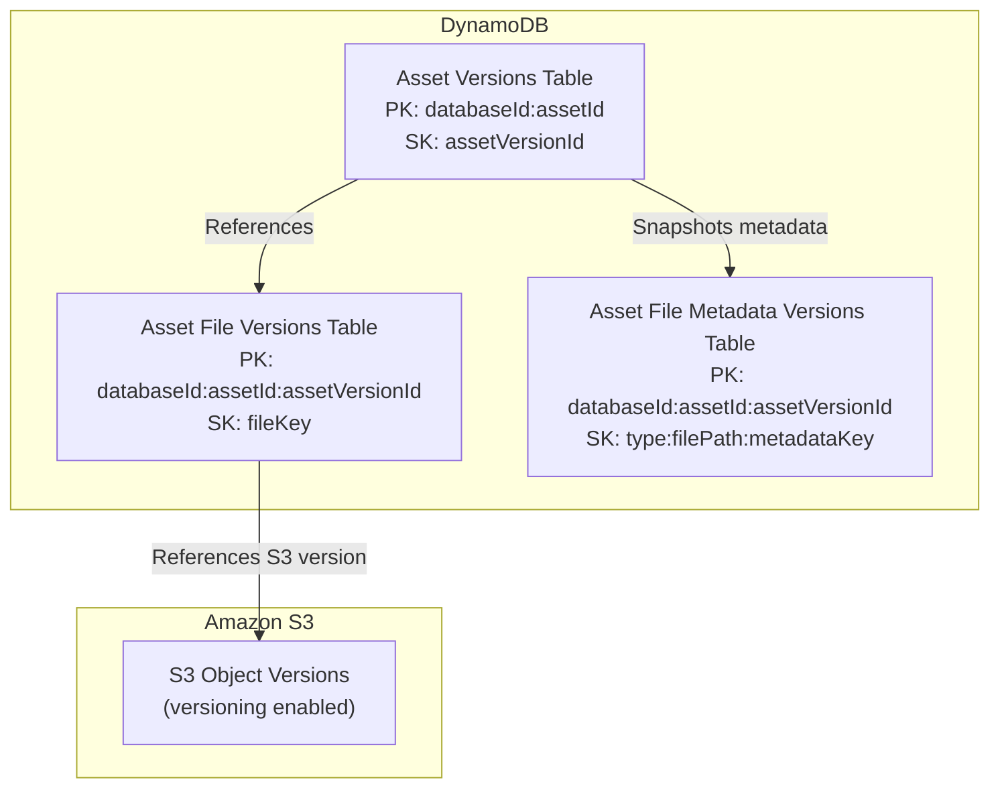

# Data Model

This page documents the data model used by VAMS across Amazon DynamoDB, Amazon S3, and Amazon OpenSearch. It covers table schemas with partition keys, sort keys, and global secondary indexes; S3 bucket organization and key structure; OpenSearch index mappings; and data lifecycle patterns such as archiving and versioning.

## Amazon DynamoDB Table Schemas

All Amazon DynamoDB tables use on-demand billing (PAY_PER_REQUEST), point-in-time recovery, and optional AWS KMS customer-managed key encryption. Tables with DynamoDB Streams enabled are indicated below.

### Asset Storage Table

Stores the primary record for each asset within a database.

| Attribute | Type | Key |
|---|---|---|
| `databaseId` | String | Partition Key |
| `assetId` | String | Sort Key |

**DynamoDB Streams:** NEW_IMAGE

**Global Secondary Indexes:**

| GSI Name | Partition Key | Sort Key | Projection |
|---|---|---|---|
| `BucketIdGSI` | `bucketId` | `assetId` | Keys Only |
| `assetIdGSI` | `assetId` | `databaseId` | Keys Only |

**Common Attributes:** `assetName`, `assetType`, `description`, `isDistributable`, `tags`, `assetLocation`, `previewLocation`, `bucketId`, `createdAt`, `updatedAt`

### Database Storage Table

Stores database (collection) records.

| Attribute | Type | Key |
|---|---|---|
| `databaseId` | String | Partition Key |

**DynamoDB Streams:** NEW_IMAGE

### Asset Versions Storage Table (V2)

Stores version records for each asset, scoped by database.

| Attribute | Type | Key |
|---|---|---|
| `databaseId:assetId` | String | Partition Key |
| `assetVersionId` | String | Sort Key |

**Common Attributes:** `versionAlias`, `comment`, `isArchived`, `createdAt`, `createdBy`

### Asset File Versions Storage Table (V2)

Stores file records per asset version.

| Attribute | Type | Key |
|---|---|---|
| `databaseId:assetId:assetVersionId` | String | Partition Key |
| `fileKey` | String | Sort Key |

**Global Secondary Indexes:**

| GSI Name | Partition Key | Sort Key | Projection |
|---|---|---|---|
| `databaseIdAssetIdIndex` | `databaseId:assetId` | -- | ALL |

### Asset File Metadata Versions Storage Table

Stores metadata snapshots per asset version for point-in-time metadata recovery.

| Attribute | Type | Key |
|---|---|---|
| `databaseId:assetId:assetVersionId` | String | Partition Key |
| `type:filePath:metadataKey` | String | Sort Key |

**Global Secondary Indexes:**

| GSI Name | Partition Key | Sort Key | Projection |
|---|---|---|---|
| `databaseIdAssetIdIndex` | `databaseId:assetId` | -- | ALL |

### Asset Uploads Storage Table

Tracks in-progress file uploads.

| Attribute | Type | Key |
|---|---|---|
| `uploadId` | String | Partition Key |
| `assetId` | String | Sort Key |

**Global Secondary Indexes:**

| GSI Name | Partition Key | Sort Key | Projection |
|---|---|---|---|
| `AssetIdGSI` | `assetId` | `uploadId` | Keys Only |
| `DatabaseIdGSI` | `databaseId` | `uploadId` | Keys Only |
| `UserIdGSI` | `UserId` | `createdAt` | Keys Only |

### Database Metadata Storage Table (V2)

Stores metadata key-value pairs at the database level.

| Attribute | Type | Key |
|---|---|---|
| `metadataKey` | String | Partition Key |
| `databaseId` | String | Sort Key |

**DynamoDB Streams:** NEW_IMAGE

**Global Secondary Indexes:**

| GSI Name | Partition Key | Sort Key | Projection |
|---|---|---|---|
| `DatabaseIdIndex` | `databaseId` | `metadataKey` | ALL |

### Asset File Metadata Storage Table (V2)

Stores metadata key-value pairs at the file level within an asset.

| Attribute | Type | Key |
|---|---|---|
| `metadataKey` | String | Partition Key |
| `databaseId:assetId:filePath` | String | Sort Key |

**DynamoDB Streams:** NEW_IMAGE

**Global Secondary Indexes:**

| GSI Name | Partition Key | Sort Key | Projection |
|---|---|---|---|
| `DatabaseIdAssetIdFilePathIndex` | `databaseId:assetId:filePath` | `metadataKey` | ALL |
| `DatabaseIdAssetIdIndex` | `databaseId:assetId` | `metadataKey` | ALL |

### File Attribute Storage Table (V2)

Stores system-generated file attributes (distinct from user-defined metadata).

| Attribute | Type | Key |
|---|---|---|
| `attributeKey` | String | Partition Key |
| `databaseId:assetId:filePath` | String | Sort Key |

**DynamoDB Streams:** NEW_IMAGE

**Global Secondary Indexes:**

| GSI Name | Partition Key | Sort Key | Projection |
|---|---|---|---|
| `DatabaseIdAssetIdFilePathIndex` | `databaseId:assetId:filePath` | `attributeKey` | ALL |
| `DatabaseIdAssetIdIndex` | `databaseId:assetId` | `attributeKey` | ALL |

### Metadata Schema Storage Table (V2)

Defines metadata schemas that govern which metadata keys are expected for a given entity type.

| Attribute | Type | Key |
|---|---|---|
| `metadataSchemaId` | String | Partition Key |
| `databaseId:metadataEntityType` | String | Sort Key |

**Global Secondary Indexes:**

| GSI Name | Partition Key | Sort Key | Projection |
|---|---|---|---|
| `DatabaseIdMetadataEntityTypeIndex` | `databaseId:metadataEntityType` | `metadataSchemaId` | ALL |
| `MetadataEntityTypeIndex` | `metadataEntityType` | `metadataSchemaId` | ALL |
| `DatabaseIdIndex` | `databaseId` | `metadataSchemaId` | ALL |

### Asset Links Storage Table (V2)

Stores directional relationships between assets (parent, child, related).

| Attribute | Type | Key |
|---|---|---|
| `assetLinkId` | String | Partition Key |

**DynamoDB Streams:** NEW_IMAGE

**Global Secondary Indexes:**

| GSI Name | Partition Key | Sort Key | Projection |
|---|---|---|---|
| `fromAssetGSI` | `fromAssetDatabaseId:fromAssetId` | `toAssetDatabaseId:toAssetId` | Keys Only |
| `toAssetGSI` | `toAssetDatabaseId:toAssetId` | `fromAssetDatabaseId:fromAssetId` | Keys Only |

### Asset Links Metadata Storage Table

Stores metadata attached to asset relationships.

| Attribute | Type | Key |
|---|---|---|
| `assetLinkId` | String | Partition Key |
| `metadataKey` | String | Sort Key |

**DynamoDB Streams:** NEW_IMAGE

### Pipeline Storage Table

Stores pipeline definitions scoped to a database.

| Attribute | Type | Key |
|---|---|---|
| `databaseId` | String | Partition Key |
| `pipelineId` | String | Sort Key |

### Workflow Storage Table

Stores workflow definitions scoped to a database.

| Attribute | Type | Key |
|---|---|---|
| `databaseId` | String | Partition Key |
| `workflowId` | String | Sort Key |

### Workflow Executions Storage Table

Stores individual workflow execution records.

| Attribute | Type | Key |
|---|---|---|
| `databaseId:assetId` | String | Partition Key |
| `executionId` | String | Sort Key |

**Local Secondary Indexes:**

| LSI Name | Sort Key |
|---|---|
| `WorkflowLSI` | `workflowDatabaseId:workflowId` |

**Global Secondary Indexes:**

| GSI Name | Partition Key | Sort Key | Projection |
|---|---|---|---|
| `WorkflowGSI` | `workflowDatabaseId:workflowId` | `executionId` | Keys Only |
| `ExecutionIdGSI` | `workflowId` | `executionId` | Keys Only |

### Authorization Tables

#### Constraints Storage Table

| Attribute | Type | Key |
|---|---|---|
| `constraintId` | String | Partition Key |

**Global Secondary Indexes:**

| GSI Name | Partition Key | Sort Key | Projection |
|---|---|---|---|
| `GroupPermissionsIndex` | `groupId` | `objectType` | ALL |
| `UserPermissionsIndex` | `userId` | `objectType` | ALL |
| `ObjectTypeIndex` | `objectType` | `constraintId` | ALL |

#### Auth Entities Storage Table

| Attribute | Type | Key |
|---|---|---|
| `entityType` | String | Partition Key |
| `sk` | String | Sort Key |

#### Other Authorization Tables

| Table | Partition Key | Sort Key |
|---|---|---|
| RolesStorageTable | `roleName` | -- |
| UserRolesStorageTable | `userId` | `roleName` |
| UserStorageTable | `userId` | -- |
| ApiKeyStorageTable | `apiKeyId` | -- (GSIs: `apiKeyHashIndex`, `userIdIndex`) |

### Classification Tables

| Table | Partition Key | Sort Key |
|---|---|---|
| TagStorageTable | `tagName` | -- |
| TagTypeStorageTable | `tagTypeName` | -- |
| SubscriptionsStorageTable | `eventName` | `entityName_entityId` |
| CommentStorageTable | `assetId` | `assetVersionId:commentId` |

### Configuration Tables

| Table | Partition Key | Sort Key |
|---|---|---|
| AppFeatureEnabledStorageTable | `featureName` | -- |
| S3AssetBucketsStorageTable | `bucketId` | `bucketName:baseAssetsPrefix` (GSI: `bucketNameGSI`) |

## Amazon S3 Bucket Organization

### Asset Buckets

Asset buckets store all user-uploaded files and pipeline-generated outputs. Each bucket supports versioning and uses the following key structure:

```
{baseAssetsPrefix}{assetId}/{relative_path}/{filename}
```

Where:

- `baseAssetsPrefix` is the configured prefix for the bucket (default `/`, meaning root)
- `assetId` is the unique asset identifier
- `relative_path` is zero or more subdirectory levels within the asset
- `filename` is the actual file name

#### File Output Conventions

Pipeline outputs follow specific naming conventions within the asset key structure:

| Output Type | Key Pattern | Example |
|---|---|---|
| Preview file | `{assetId}/{relative_path}/{filename}.previewFile.{ext}` | `xd130a6d.../test/pump.e57.previewFile.gif` |
| Asset preview | `{assetId}/preview.{ext}` | `xd130a6d.../preview.jpg` |
| Metadata output | `{assetId}/{relative_path}/metadata.json` | `xd130a6d.../test/metadata.json` |

:::warning[Preserving Relative Paths]
When pipelines write output files adjacent to input files, the relative subdirectory path within the asset must be preserved. The process-output step expects outputs at the same relative location as the input file.
:::


### Auxiliary Bucket

The auxiliary bucket stores non-versioned working files and special viewer data:

```
{assetId}/{viewer_type}/{generated_files}
```

Common uses:

- Potree octree data for point cloud visualization
- Temporary pipeline processing files
- Pipeline intermediate outputs

### Web App Bucket

Stores the built React frontend static assets. Served as an origin for Amazon CloudFront or Application Load Balancer.

### Artefacts Bucket

Stores template notebooks and deployment artefacts. Populated at deploy time from `infra/lib/artefacts/`.

### Access Logs Bucket

Stores server access logs from all other buckets, with 90-day lifecycle expiration. Separate prefixes are used per source:

- `asset-bucket-logs/`
- `assetAuxiliary-bucket-logs/`
- `artefacts-bucket-logs/`
- `cloudtrail-logs/` (when AWS CloudTrail is enabled)

## Amazon OpenSearch Index Schemas

VAMS uses a dual-index architecture with separate **asset index** and **file index** in Amazon OpenSearch.

### Dynamic Field Naming Convention

All indexed fields follow a type-prefix naming convention:

| Prefix | OpenSearch Type | Example |
|---|---|---|
| `str_` | `text` with `keyword` sub-field | `str_assetname`, `str_databaseid` |
| `num_` | `long` | `num_filesize` |
| `bool_` | `boolean` | `bool_archived` |
| `date_` | `date` | `date_lastmodified` |
| `list_` | `text` with `keyword` sub-field | `list_tags` |
| `gp_` | `geo_point` | `gp_location` (from metadata) |
| `gs_` | `text` (JSON string) | `gs_properties` (from metadata) |

### Asset Index Schema

The asset index stores one document per asset.

**Document ID:** `{databaseId}:{assetId}`

| Field | Type | Description |
|---|---|---|
| `str_databaseid` | text + keyword | Database identifier |
| `str_assetid` | text + keyword | Asset identifier |
| `str_assetname` | text + keyword | Asset display name |
| `str_assettype` | text + keyword | Asset type classification |
| `str_description` | text + keyword | Asset description |
| `str_bucketid` | text + keyword | Associated bucket identifier |
| `str_bucketname` | text + keyword | Bucket name |
| `str_bucketprefix` | text + keyword | Bucket prefix |
| `str_asset_version_id` | text + keyword | Current version identifier |
| `str_asset_version_comment` | text + keyword | Version comment |
| `str_assetlocationkey` | text + keyword | S3 key from asset's assetLocation |
| `str_previewfilekey` | text + keyword | S3 key of asset preview image |
| `bool_isdistributable` | boolean | Whether asset is distributable |
| `list_tags` | text + keyword | Asset tags |
| `date_asset_version_createdate` | date | Version creation timestamp |
| `bool_has_asset_children` | boolean | Has child assets |
| `bool_has_asset_parents` | boolean | Has parent assets |
| `bool_has_assets_related` | boolean | Has related assets |
| `bool_archived` | boolean | Archive status (`#deleted` marker) |
| `MD_` | flat_object | Dynamic metadata fields |
| `_rectype` | keyword | Always `"asset"` |

### File Index Schema

The file index stores one document per file within an asset.

**Document ID:** `{databaseId}:{assetId}:{fileKey}`

| Field | Type | Description |
|---|---|---|
| `str_key` | text + keyword | Full S3 file path (relative to bucket) |
| `str_databaseid` | text + keyword | Database identifier |
| `str_assetid` | text + keyword | Asset identifier |
| `str_assetname` | text + keyword | Parent asset name |
| `str_bucketid` | text + keyword | Bucket identifier |
| `str_bucketname` | text + keyword | Bucket name |
| `str_bucketprefix` | text + keyword | Bucket prefix |
| `str_fileext` | text + keyword | File extension |
| `str_etag` | text + keyword | Amazon S3 ETag |
| `str_s3_version_id` | text + keyword | Amazon S3 version identifier |
| `str_previewfilekey` | text + keyword | S3 key of associated preview file |
| `date_lastmodified` | date | Last modification timestamp |
| `num_filesize` | long | File size in bytes |
| `bool_archived` | boolean | Archive status (delete marker present) |
| `list_tags` | text + keyword | Tags inherited from parent asset |
| `MD_` | flat_object | Dynamic metadata fields |
| `AB_` | flat_object | Dynamic attribute fields |
| `_rectype` | keyword | Always `"file"` |

### Dynamic Templates

Both indexes use OpenSearch dynamic templates to handle fields that follow the type-prefix convention but are not explicitly mapped:

```json
{
    "dynamic_templates": [
        { "core_strings":  { "match": "str_*",  "mapping": { "type": "text", "fields": { "keyword": { "type": "keyword" }}}}},
        { "core_numeric":  { "match": "num_*",  "mapping": { "type": "long" }}},
        { "core_boolean":  { "match": "bool_*", "mapping": { "type": "boolean" }}},
        { "core_dates":    { "match": "date_*", "mapping": { "type": "date" }}},
        { "core_lists":    { "match": "list_*", "mapping": { "type": "text", "fields": { "keyword": { "type": "keyword" }}}}}
    ]
}
```

:::info[Flat Object Fields for Metadata and Attributes]
The `MD_` and `AB_` fields use the OpenSearch `flat_object` type. This stores all dynamic metadata and attribute key-value pairs within a single field, preventing field explosion that would occur if each metadata key created a new top-level index field.
:::


### Excluded Fields

Fields prefixed with `VAMS_` or `_` (except `_rectype`) are excluded from indexing. These are internal system fields not intended for search.

## Archived Data Pattern

VAMS uses a `#deleted` suffix on the `databaseId` partition key to mark archived assets:

```
Active asset:    PK = "my-database",         SK = "asset-123"
Archived asset:  PK = "my-database#deleted",  SK = "asset-123"
```

This pattern allows efficient queries for either active or archived assets using the partition key, without requiring a secondary index or scan filter.

In the OpenSearch indexes, archived assets and files are indicated by the `bool_archived` field set to `true`.

## Versioning Data Model

VAMS implements a versioning system that combines Amazon S3 object versioning with Amazon DynamoDB version records:



### Version Lifecycle

1. **Create Version:** A new record is inserted into the Asset Versions table with a unique `assetVersionId`. File records are captured in the Asset File Versions table, each referencing the Amazon S3 object version ID at that point in time.
2. **Update Version:** The version's `versionAlias` and `comment` fields can be updated.
3. **Archive Version:** The version record's `isArchived` flag is set to `true`. The asset's `databaseId` in the main Asset Storage table gains the `#deleted` suffix.
4. **Unarchive Version:** The `isArchived` flag is reverted and the `#deleted` suffix is removed from the `databaseId`.

### Metadata Version Snapshots

The Asset File Metadata Versions table captures a snapshot of all metadata and attribute values at the time a version is created. The composite sort key `type:filePath:metadataKey` allows querying metadata for a specific file within a specific version, or all metadata across all files in a version.

## Next Steps

- [Architecture Overview](overview.md) -- High-level system design
- [AWS Resources](aws-resources.md) -- Complete resource inventory
- [Security Architecture](security.md) -- Encryption, authorization, and compliance
