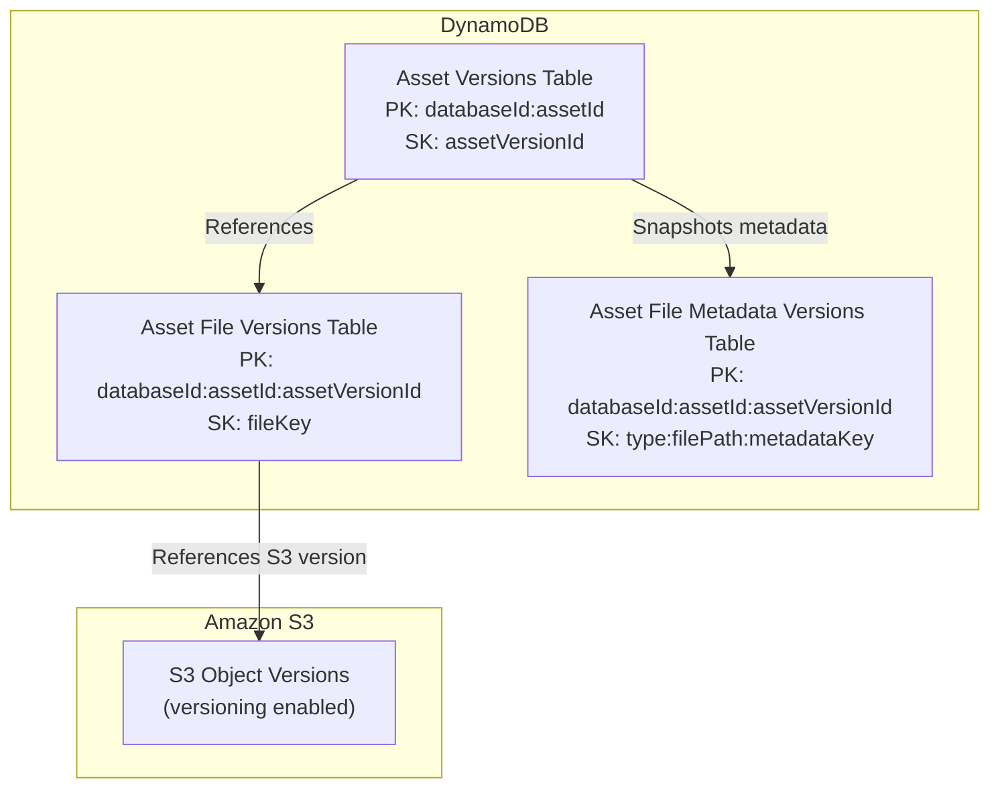

# Data Model

This page documents the data model used by VAMS across Amazon DynamoDB, Amazon S3, and Amazon OpenSearch. It covers table schemas with partition keys, sort keys, and global secondary indexes; S3 bucket organization and key structure; OpenSearch index mappings; and data lifecycle patterns such as archiving and versioning.

## Amazon DynamoDB Table Schemas

All Amazon DynamoDB tables use on-demand billing (PAY_PER_REQUEST), point-in-time recovery, and optional AWS KMS customer-managed key encryption. Tables with DynamoDB Streams enabled are indicated below.

### Asset Storage Table

Stores the primary record for each asset within a database.

| Attribute    | Type   | Key           |
| ------------ | ------ | ------------- |
| `databaseId` | String | Partition Key |
| `assetId`    | String | Sort Key      |

**DynamoDB Streams:** NEW_IMAGE

**Global Secondary Indexes:**

| GSI Name      | Partition Key | Sort Key     | Projection |
| ------------- | ------------- | ------------ | ---------- |
| `BucketIdGSI` | `bucketId`    | `assetId`    | Keys Only  |
| `assetIdGSI`  | `assetId`     | `databaseId` | Keys Only  |

**Common Attributes:** `assetName`, `assetType`, `description`, `isDistributable`, `tags`, `assetLocation`, `previewLocation`, `bucketId`, `createdAt`, `updatedAt`

### Database Storage Table

Stores database (collection) records.

| Attribute    | Type   | Key           |
| ------------ | ------ | ------------- |
| `databaseId` | String | Partition Key |

**DynamoDB Streams:** NEW_IMAGE

### Asset Versions Storage Table (V2)

Stores version records for each asset, scoped by database.

| Attribute            | Type   | Key           |
| -------------------- | ------ | ------------- |
| `databaseId:assetId` | String | Partition Key |
| `assetVersionId`     | String | Sort Key      |

**Common Attributes:** `versionAlias`, `comment`, `isArchived`, `createdAt`, `createdBy`

### Asset File Versions Storage Table (V2)

Stores file records per asset version.

| Attribute                           | Type   | Key           |
| ----------------------------------- | ------ | ------------- |
| `databaseId:assetId:assetVersionId` | String | Partition Key |
| `fileKey`                           | String | Sort Key      |

**Global Secondary Indexes:**

| GSI Name                 | Partition Key        | Sort Key | Projection |
| ------------------------ | -------------------- | -------- | ---------- |
| `databaseIdAssetIdIndex` | `databaseId:assetId` | --       | ALL        |

### Asset File Metadata Versions Storage Table

Stores metadata snapshots per asset version for point-in-time metadata recovery.

| Attribute                           | Type   | Key           |
| ----------------------------------- | ------ | ------------- |
| `databaseId:assetId:assetVersionId` | String | Partition Key |
| `type:filePath:metadataKey`         | String | Sort Key      |

**Global Secondary Indexes:**

| GSI Name                 | Partition Key        | Sort Key | Projection |
| ------------------------ | -------------------- | -------- | ---------- |
| `databaseIdAssetIdIndex` | `databaseId:assetId` | --       | ALL        |

### Asset File Version History Storage Table

Records per-version file change provenance (who created a version and how). Populated as new file versions are created; legacy versions created before this table existed have no record.

| Attribute                     | Type   | Key           |
| ----------------------------- | ------ | ------------- |
| `databaseId:assetId:filePath` | String | Partition Key |
| `versionId`                   | String | Sort Key      |

**Global Secondary Indexes:**

| GSI Name                   | Partition Key               | Sort Key                      | Projection |
| -------------------------- | --------------------------- | ----------------------------- | ---------- |
| `DatabaseIdAssetIdIndex`   | `databaseId:assetId`        | `versionId`                   | ALL        |
| `WorkflowExecutionIdIndex` | `changeWorkflowExecutionId` | `databaseId:assetId:filePath` | ALL        |

The `WorkflowExecutionIdIndex` is sparse: only versions produced by a workflow execution carry `changeWorkflowExecutionId`, so direct uploads and other change sources are absent from the index. It resolves which asset file versions a given workflow execution produced.

### Asset History Storage Table

Records asset lifecycle operations (create, edit, archive, unarchive, permanent delete), one record per operation, queried newest first. Records are permanent: they survive asset permanent deletion, and an asset recreated with the same asset ID continues the same history partition.

| Attribute            | Type   | Key           |
| -------------------- | ------ | ------------- |
| `databaseId:assetId` | String | Partition Key |
| `historyRecordId`    | String | Sort Key      |

The sort key is `{recordDate}#{suffix}` (ISO-8601 UTC timestamp plus a uniqueness suffix), so records sort chronologically. Each record carries `recordDate`, `changeSource` (`create`, `createDirect`, `edit`, `archive`, `unarchive`, `unarchiveDirect`, `permanentDelete` — the `*Direct` variants mark changes originated from S3 bucket-sync ingestion), `changeUserId`, and `assetSnapshot`, an open-schema map of the asset fields as they stood after the operation (`assetName`, `description`, `isDistributable`, `tags`, `bucketId`, `assetLocationKey`, and `archivedReason`/`unarchivedReason` when applicable). Records backfilled by the deployment data migration carry `migratedRecord: true`.

### Sync Tracking Outbound Storage Table

Records outbound synchronizations of VAMS objects to external systems (for example, Physna and the Garnet Framework), one append-only record per sync attempt, queried newest first. Written best-effort by the addon sync handlers; the object data itself is not stored.

| Attribute      | Type   | Key           |
| -------------- | ------ | ------------- |
| `objectId`     | String | Partition Key |
| `syncRecordId` | String | Sort Key      |

The partition key is the hierarchical object identifier by `objectType`: `databaseId` (database), `databaseId:assetId` (asset), or `databaseId:assetId:/filePath` (assetFile). The sort key is `{recordDate}#{suffix}` (ISO-8601 UTC timestamp plus a uniqueness suffix), so records sort chronologically. Each record carries `objectType` (`database`, `asset`, `assetFile`), `systemType` and `systemUniqueId` (open-text identifiers of the target system — each sync handler defines its own system type constant, e.g. `physna`, `garnetFramework`), `action` (`create`, `modify`, `delete`), `syncStatus` (`pending`, `success`, `failed`, `skipped`), `errorMessage` (failed records), `s3VersionId` (assetFile records when known), `syncSystemEntityId` (the target system's own ID for the object when the sync response provides one), and `recordDate`.

**Global Secondary Indexes:**

| GSI Name              | Partition Key                          | Sort Key       | Projection |
| --------------------- | -------------------------------------- | -------------- | ---------- |
| `DatabaseIdIndex`     | `databaseId`                           | `syncRecordId` | ALL        |
| `DatabaseSystemIndex` | `databaseId:systemType:systemUniqueId` | `syncRecordId` | ALL        |
| `SystemIndex`         | `systemType:systemUniqueId`            | `syncRecordId` | ALL        |

### Asset Uploads Storage Table

Tracks in-progress file uploads.

| Attribute  | Type   | Key           |
| ---------- | ------ | ------------- |
| `uploadId` | String | Partition Key |
| `assetId`  | String | Sort Key      |

**Global Secondary Indexes:**

| GSI Name        | Partition Key | Sort Key    | Projection |
| --------------- | ------------- | ----------- | ---------- |
| `AssetIdGSI`    | `assetId`     | `uploadId`  | Keys Only  |
| `DatabaseIdGSI` | `databaseId`  | `uploadId`  | Keys Only  |
| `UserIdGSI`     | `UserId`      | `createdAt` | Keys Only  |

### Database Metadata Storage Table (V2)

Stores metadata key-value pairs at the database level.

| Attribute     | Type   | Key           |
| ------------- | ------ | ------------- |
| `metadataKey` | String | Partition Key |
| `databaseId`  | String | Sort Key      |

**DynamoDB Streams:** NEW_IMAGE

**Global Secondary Indexes:**

| GSI Name          | Partition Key | Sort Key      | Projection |
| ----------------- | ------------- | ------------- | ---------- |
| `DatabaseIdIndex` | `databaseId`  | `metadataKey` | ALL        |

### Asset File Metadata Storage Table (V2)

Stores metadata key-value pairs at the file level within an asset.

| Attribute                     | Type   | Key           |
| ----------------------------- | ------ | ------------- |
| `metadataKey`                 | String | Partition Key |
| `databaseId:assetId:filePath` | String | Sort Key      |

**DynamoDB Streams:** NEW_IMAGE

**Global Secondary Indexes:**

| GSI Name                         | Partition Key                 | Sort Key      | Projection |
| -------------------------------- | ----------------------------- | ------------- | ---------- |
| `DatabaseIdAssetIdFilePathIndex` | `databaseId:assetId:filePath` | `metadataKey` | ALL        |
| `DatabaseIdAssetIdIndex`         | `databaseId:assetId`          | `metadataKey` | ALL        |

### File Attribute Storage Table (V2)

Stores system-generated file attributes (distinct from user-defined metadata).

| Attribute                     | Type   | Key           |
| ----------------------------- | ------ | ------------- |
| `attributeKey`                | String | Partition Key |
| `databaseId:assetId:filePath` | String | Sort Key      |

**DynamoDB Streams:** NEW_IMAGE

**Global Secondary Indexes:**

| GSI Name                         | Partition Key                 | Sort Key       | Projection |
| -------------------------------- | ----------------------------- | -------------- | ---------- |
| `DatabaseIdAssetIdFilePathIndex` | `databaseId:assetId:filePath` | `attributeKey` | ALL        |
| `DatabaseIdAssetIdIndex`         | `databaseId:assetId`          | `attributeKey` | ALL        |

### Metadata Schema Storage Table (V2)

Defines metadata schemas that govern which metadata keys are expected for a given entity type.

| Attribute                       | Type   | Key           |
| ------------------------------- | ------ | ------------- |
| `metadataSchemaId`              | String | Partition Key |
| `databaseId:metadataEntityType` | String | Sort Key      |

**Global Secondary Indexes:**

| GSI Name                            | Partition Key                   | Sort Key           | Projection |
| ----------------------------------- | ------------------------------- | ------------------ | ---------- |
| `DatabaseIdMetadataEntityTypeIndex` | `databaseId:metadataEntityType` | `metadataSchemaId` | ALL        |
| `MetadataEntityTypeIndex`           | `metadataEntityType`            | `metadataSchemaId` | ALL        |
| `DatabaseIdIndex`                   | `databaseId`                    | `metadataSchemaId` | ALL        |

### Asset Links Storage Table (V2)

Stores directional relationships between assets (parent, child, related).

| Attribute     | Type   | Key           |
| ------------- | ------ | ------------- |
| `assetLinkId` | String | Partition Key |

**DynamoDB Streams:** NEW_IMAGE

**Global Secondary Indexes:**

| GSI Name       | Partition Key                     | Sort Key                          | Projection |
| -------------- | --------------------------------- | --------------------------------- | ---------- |
| `fromAssetGSI` | `fromAssetDatabaseId:fromAssetId` | `toAssetDatabaseId:toAssetId`     | Keys Only  |
| `toAssetGSI`   | `toAssetDatabaseId:toAssetId`     | `fromAssetDatabaseId:fromAssetId` | Keys Only  |

### Asset Links Metadata Storage Table

Stores metadata attached to asset relationships.

| Attribute     | Type   | Key           |
| ------------- | ------ | ------------- |
| `assetLinkId` | String | Partition Key |
| `metadataKey` | String | Sort Key      |

**DynamoDB Streams:** NEW_IMAGE

### Pipeline Storage Table (legacy)

Stores pipeline definitions scoped to a database. Retained as the migration source for the V2 pipeline table.

| Attribute    | Type   | Key           |
| ------------ | ------ | ------------- |
| `databaseId` | String | Partition Key |
| `pipelineId` | String | Sort Key      |

### Workflow Storage Table (legacy)

Stores workflow definitions scoped to a database. Retained as the migration source for the V2 workflow table.

| Attribute    | Type   | Key           |
| ------------ | ------ | ------------- |
| `databaseId` | String | Partition Key |
| `workflowId` | String | Sort Key      |

### Workflow Executions Storage Table (legacy)

Stores individual workflow execution records. Retained as the migration source for the V2 execution tables.

| Attribute            | Type   | Key           |
| -------------------- | ------ | ------------- |
| `databaseId:assetId` | String | Partition Key |
| `executionId`        | String | Sort Key      |

**Local Secondary Indexes:**

| LSI Name      | Sort Key                        |
| ------------- | ------------------------------- |
| `WorkflowLSI` | `workflowDatabaseId:workflowId` |

**Global Secondary Indexes:**

| GSI Name         | Partition Key                   | Sort Key      | Projection |
| ---------------- | ------------------------------- | ------------- | ---------- |
| `WorkflowGSI`    | `workflowDatabaseId:workflowId` | `executionId` | Keys Only  |
| `ExecutionIdGSI` | `workflowId`                    | `executionId` | Keys Only  |

### Pipeline Storage Table (V2)

Stores pipeline definitions scoped to a database. The `(databaseId, pipelineId)` composite key keeps a pipeline unique even when its id is overridden to a known value.

| Attribute    | Type   | Key           |
| ------------ | ------ | ------------- |
| `databaseId` | String | Partition Key |
| `pipelineId` | String | Sort Key      |

**Global Secondary Indexes:**

| GSI Name                 | Partition Key         | Sort Key       | Projection | Purpose                                          |
| ------------------------ | --------------------- | -------------- | ---------- | ------------------------------------------------ |
| `PipelinesByDatabaseGSI` | `databaseId`          | `dateModified` | ALL        | List a database's pipelines newest-first         |
| `PipelinesByCategoryGSI` | `databaseId:category` | `pipelineId`   | ALL        | List a database's pipelines within a category    |
| `PipelinesByDateGSI`     | `allListPartition`    | `dateModified` | ALL        | Global (cross-database) pipeline list as a query |

The `allListPartition` attribute holds the constant value `pipeline` on every row, so the global "all pipelines" list resolves as a single newest-first query instead of a table scan.

### Workflow Storage Table (V2)

Stores workflow definitions scoped to a database.

| Attribute    | Type   | Key           |
| ------------ | ------ | ------------- |
| `databaseId` | String | Partition Key |
| `workflowId` | String | Sort Key      |

**Global Secondary Indexes:**

| GSI Name                 | Partition Key         | Sort Key       | Projection | Purpose                                          |
| ------------------------ | --------------------- | -------------- | ---------- | ------------------------------------------------ |
| `WorkflowsByDatabaseGSI` | `databaseId`          | `dateModified` | ALL        | List a database's workflows newest-first         |
| `WorkflowsByCategoryGSI` | `databaseId:category` | `workflowId`   | ALL        | List a database's workflows within a category    |
| `WorkflowsByDateGSI`     | `allListPartition`    | `dateModified` | ALL        | Global (cross-database) workflow list as a query |

The `allListPartition` attribute holds the constant value `workflow` on every row.

### Workflow Triggers Storage Table

Stores the triggers that auto-launch a workflow. A workflow may carry several triggers of one type, each
with its own input-file filters and default templates.

| Attribute                       | Type   | Key           | Notes                                                                                                                                      |
| ------------------------------- | ------ | ------------- | ------------------------------------------------------------------------------------------------------------------------------------------ |
| `workflowDatabaseId:workflowId` | String | Partition Key | Composite key matching the workflow table                                                                                                  |
| `triggerType`                   | String | Sort Key      | The trigger's key: the bare type (`fileUpload`) for a workflow's first trigger of that type, or `<type>#<triggerId>` for an additional one |
| `triggerBaseType`               | String |               | The bare type, always unsuffixed. The by-type index partitions on this                                                                     |
| `triggerId`                     | String |               | Distinguishes several triggers of one type; empty for the first trigger of a type                                                          |
| `triggerConfig`                 | Map    |               | For `fileUpload`: `inputFileFilters` plus `defaultTemplateIds` keyed by `<pipelineDatabaseId>:<pipelineId>`                                |
| `enabled`                       | Bool   |               | A disabled trigger never fires                                                                                                             |

**Global Secondary Indexes:**

| GSI Name                | Partition Key     | Sort Key                        | Projection | Purpose                                                        |
| ----------------------- | ----------------- | ------------------------------- | ---------- | -------------------------------------------------------------- |
| `TriggersByBaseTypeGSI` | `triggerBaseType` | `workflowDatabaseId:workflowId` | ALL        | Find every workflow with a trigger of a type, without scanning |

The index partitions on `triggerBaseType` rather than on the sort key because the upload dispatcher looks
a type up by exact match: a suffixed value would place each additional trigger in its own partition, and
that trigger would sit in the table without ever firing.

### Workflow Executions Storage Table (V2)

Stores the main workflow execution record. Executions are workflow-keyed; asset and database linkage lives in the workflow/pipeline input tables.

| Attribute                       | Type   | Key           |
| ------------------------------- | ------ | ------------- |
| `workflowExecutionId`           | String | Partition Key |
| `workflowDatabaseId:workflowId` | String | Sort Key      |

**Global Secondary Indexes:**

| GSI Name                          | Partition Key                   | Sort Key             | Projection | Purpose                                                 |
| --------------------------------- | ------------------------------- | -------------------- | ---------- | ------------------------------------------------------- |
| `WorkflowExecutionsByWorkflowGSI` | `workflowDatabaseId:workflowId` | `executionStartDate` | ALL        | List a workflow's executions newest-first               |
| `WorkflowExecutionsByGroupGSI`    | `executionGroupId`              | `executionStartDate` | ALL        | Enumerate a group's executions (sparse; abort-by-group) |
| `WorkflowExecutionsByDateGSI`     | `allListPartition`              | `executionStartDate` | ALL        | Global executions list as a newest-first query          |

The `allListPartition` attribute holds the constant value `execution` on every row, so the global executions list resolves as a single newest-first query bounded by an `executionStartDate` key condition (default 90-day recency window) rather than an unordered scan that could drop recent executions off the first page. `WorkflowExecutionsByGroupGSI` is sparse — only grouped executions carry `executionGroupId`.

An execution migrated from a release before the workflow overhaul may carry `startDateEstimated`. Those rows never started and recorded no start instant, so their `executionStartDate` is derived from the creation date of the workflow they referenced (a bound the execution cannot predate) to keep them in the date-ordered indexes. `startDateEstimated = true` marks the date as derived rather than recorded; a row without the attribute carries the start date its run reported.

The per-pipeline and per-input execution detail records live in supporting tables (`PipelineExecutionsStorageTable`, `PipelineExecutionInput*`/`Output*StorageTable`, `PipelineExecutionLogsStorageTable`, `WorkflowExecutionInputsStorageTable`, `WorkflowExecutionConfigurationStorageTable`), all keyed by `pipelineExecutionId` or `workflowExecutionId`. See [AWS Resources Inventory](aws-resources.md#workflow-execution-tables-v2-data-model) for the full table and index list.

#### What an execution stores

An execution is a snapshot as much as a status record: templates, tag schemas and pipeline configuration
can all change or be archived after a run finishes, so each run records what it was actually built from
rather than pointing at definitions that may since have moved.

**Main row** (`WorkflowExecutionsStorageTableV2`) — identity and status only: `executionStatus`,
`executionStartDate` / `executionStopDate`, `triggerType`, `triggeredByUserId`, `executionGroupId`,
`executionError`, the full `executionLog`, the Step Functions ARNs, and `lastSfnSyncCheckDate` (which
bounds how often a status read polls Step Functions). Deliberately carries no output-target or
configuration fields — those live on the configuration rows below, so a status list never pays to read
them.

**Workflow configuration row** (`WorkflowExecutionConfigurationStorageTable`, `recordType` =
`configuration`) — the run's workflow-level inputs:

| Attribute                                                                     | What it records                                                                                                                                                                                                        |
| ----------------------------------------------------------------------------- | ---------------------------------------------------------------------------------------------------------------------------------------------------------------------------------------------------------------------- |
| `specifiedPipelinesSnapshot`                                                  | The ordered pipeline references the workflow held at launch, so a later edit to the workflow does not rewrite history                                                                                                  |
| `inputMetadata` / `inputMetadataTruncated`                                    | The grouped input-metadata envelope handed to the pipelines (truncated inline when oversized)                                                                                                                          |
| `outputLocationType`, `outputAssetId`, `outputDatabaseId`                     | Where the run wrote: `asset` with a destination, or `none` for a results-only run                                                                                                                                      |
| `outputFileBaseExecutionPathExtension`                                        | The **resolved** output path prefix (template tags already substituted), so a re-run reproduces the same layout rather than re-resolving per-run tags                                                                  |
| `inputMetadataDatabaseId` / `inputMetadataFileS3Key` | Provenance of the metadata source. `inputMetadataDatabaseId` is the single database the caller **named**, populated only for a run with no input files                                                                 |
| `metadataSourceDatabases` / `metadataSourceAssets`                            | Every database the run actually captured metadata from, and the assets named purely as metadata sources — the read paths gate access on the databases listed here, and a re-run reconstructs the same source selection |
| `outputDatabaseId:outputAssetId`                                              | Composite index key backing the by-output-asset GSI below. Written only when the run targets an asset                                                                                                                  |

This row also carries the index that answers "which executions wrote to this asset?":

| GSI Name                             | Partition Key                    | Sort Key             | Projection | Purpose                                                   |
| ------------------------------------ | -------------------------------- | -------------------- | ---------- | --------------------------------------------------------- |
| `WorkflowExecConfigByOutputAssetGSI` | `outputDatabaseId:outputAssetId` | `executionStartDate` | ALL        | List executions whose **output** target was a given asset |

An asset's execution history is the union of two queries: the executions that consumed the asset as an
input (via `WorkflowExecutionInputsStorageTable`) and the executions that wrote to it as an output (via
this GSI). Without the second, a run that produced a file in an asset without reading anything from it —
the normal case for a conversion writing into a different asset — would not appear in that asset's history.

The GSI is **sparse**: the `outputDatabaseId:outputAssetId` attribute is written only when
`outputLocationType` is `asset` and both ids are present, so results-only runs stay out of the index
entirely rather than crowding it. Because a DynamoDB item missing the partition attribute is absent from
the index altogether, every path that writes a configuration row — including data migration — has to set
the attribute, or those executions silently vanish from the by-output-asset listing.

**Per-pipeline configuration row** (`PipelineExecutionInputConfigurationStorageTable`, `recordType` =
`configuration`) — one per pipeline step, recording the settings and configuration that step ran under:

| Attribute                                                 | What it records                                                                                                                                                                                            |
| --------------------------------------------------------- | ---------------------------------------------------------------------------------------------------------------------------------------------------------------------------------------------------------- |
| `inputConfiguration` / `inputConfigurationTruncated`      | The final rendered configuration body actually sent to the pipeline. The complete body is the per-execution S3 file at `inputConfigurationFileS3Key`; the inline copy is truncated to fit the item         |
| `configFormat`                                            | Format of that body (`json`, `yaml`, `openjd`, `xml`, `raw`), so a viewer highlights it correctly                                                                                                          |
| `templateId`, `templateSchemaVersion`, `tagSchemaVersion` | The template and schema versions resolved at run time — the run stays readable after the template changes or is archived                                                                                   |
| `templateTags`                                            | The resolved dynamic tag values passed (for example a prompt entered on the execute screen)                                                                                                                |
| `customTemplateOverrideUsed` / `customTemplateOverride`   | Whether a caller supplied a one-off configuration body, and the RAW pre-render body when they did — a template-less override run has no `templateId` to re-resolve, so a re-run needs this to reproduce it |
| `effectiveSystemConfig`                                   | **The systemConfig this step actually ran under**: the pipeline's own `systemConfig` merged with the chosen template's `overrides`. Only knowable at execute time, because the template is chosen per run  |
| `templateOverrides`                                       | Just the keys that template overrode, so a reader can see _why_ the effective config differs from the pipeline's own (for example a template raising `inputFileArity` from `none` to `one`)                |

`effectiveSystemConfig` is what makes a finished execution self-describing: without it the stored run
names its template but not the `inputFileArity` / `assetScope` / `metadataInputs` / `inputFileFilters`
that were enforced. Both fields are absent on runs recorded before they were captured, so readers treat
a missing value as "not recorded" rather than as empty settings.

**Input and output rows** — the two input tables record the same selected files at different scopes, and
only one of them pins a version:

-   `WorkflowExecutionInputsStorageTable` is the run-wide, asset-scoped source of truth. Each row carries
    the locator (`databaseId`, `assetId`, `inputAssetFileKey`) plus `s3Bucket` and `assetRootS3Key` — the
    bucket and bucket-relative asset-root prefix of _that file's own_ asset, stored per file because a
    single run can read files from several assets in different buckets — and the concrete S3 `versionId`
    the run read (empty for a folder or whole-asset selection, which has no single version). Capturing the
    version is what makes the history show the exact bytes used rather than the time-relative "latest".
-   `PipelineExecutionInputFilesStorageTable` narrows the same selection to one pipeline step. Its rows
    carry only the `databaseId` / `assetId` / `inputAssetFileKey` locator and the owning
    `workflowExecutionId`; there is no `versionId` attribute, because the version for a given file is
    already pinned once per run on the workflow-inputs row.

`PipelineExecutionOutputFilesStorageTable` records each produced file with its `fileType` (`file` or
`preview`), `relativeFilePath`, `s3Bucket`, `s3Key`, `s3VersionId`, size and content type; `Output*Metadata`
and `Output*Results` records carry metadata written back to the asset and results text from a results-only
run. `PipelineExecutionLogsStorageTable` holds the per-step result and error logs.

### Authorization Tables

#### Constraints Storage Table

| Attribute      | Type   | Key           |
| -------------- | ------ | ------------- |
| `constraintId` | String | Partition Key |

**Global Secondary Indexes:**

| GSI Name                | Partition Key | Sort Key       | Projection |
| ----------------------- | ------------- | -------------- | ---------- |
| `GroupPermissionsIndex` | `groupId`     | `objectType`   | ALL        |
| `UserPermissionsIndex`  | `userId`      | `objectType`   | ALL        |
| `ObjectTypeIndex`       | `objectType`  | `constraintId` | ALL        |

#### Auth Entities Storage Table

| Attribute    | Type   | Key           |
| ------------ | ------ | ------------- |
| `entityType` | String | Partition Key |
| `sk`         | String | Sort Key      |

#### Other Authorization Tables

| Table                 | Partition Key | Sort Key                                    |
| --------------------- | ------------- | ------------------------------------------- |
| RolesStorageTable     | `roleName`    | --                                          |
| UserRolesStorageTable | `userId`      | `roleName`                                  |
| UserStorageTable      | `userId`      | --                                          |
| ApiKeyStorageTable    | `apiKeyId`    | -- (GSIs: `apiKeyHashIndex`, `userIdIndex`) |

### Classification Tables

| Table                     | Partition Key | Sort Key                   |
| ------------------------- | ------------- | -------------------------- |
| TagStorageTableV2         | `databaseId`  | `tagName`                  |
| TagTypeStorageTableV2     | `databaseId`  | `tagTypeName`              |
| SubscriptionsStorageTable | `eventName`   | `entityName_entityId`      |
| CommentStorageTable       | `assetId`     | `assetVersionId:commentId` |

Tags and tag types are database-namespaced. The partition key is the `databaseId` — the literal `GLOBAL` for global entries — and the sort key is the name, so `(databaseId, name)` is the uniqueness boundary and the same name can exist in different databases. Each table carries a name GSI (`tagNameIndex` on `TagStorageTableV2`, `tagTypeNameIndex` on `TagTypeStorageTableV2`) for cross-database name lookups. The former single-key `TagStorageTable`/`TagTypeStorageTable` are retained as legacy migration sources.

### Configuration Tables

| Table                         | Partition Key | Sort Key                                             |
| ----------------------------- | ------------- | ---------------------------------------------------- |
| AppFeatureEnabledStorageTable | `featureName` | --                                                   |
| S3AssetBucketsStorageTable    | `bucketId`    | `bucketName:baseAssetsPrefix` (GSI: `bucketNameGSI`) |

## Amazon S3 Bucket Organization

### Asset Buckets

Asset buckets store all user-uploaded files and pipeline-generated outputs. Each bucket supports versioning and uses the following key structure:

```
{baseAssetsPrefix}{assetId}/{relative_path}/{filename}
```

Where:

-   `baseAssetsPrefix` is the configured prefix for the bucket (default `/`, meaning root)
-   `assetId` is the unique asset identifier
-   `relative_path` is zero or more subdirectory levels within the asset
-   `filename` is the actual file name

#### File Output Conventions

Pipeline outputs follow specific naming conventions within the asset key structure:

| Output Type     | Key Pattern                                              | Example                                     |
| --------------- | -------------------------------------------------------- | ------------------------------------------- |
| Preview file    | `{assetId}/{relative_path}/{filename}.previewFile.{ext}` | `xd130a6d.../test/pump.e57.previewFile.gif` |
| Asset preview   | `{assetId}/preview.{ext}`                                | `xd130a6d.../preview.jpg`                   |
| Metadata output | `{assetId}/{relative_path}/metadata.json`                | `xd130a6d.../test/metadata.json`            |

:::warning[Preserving Relative Paths]
When pipelines write output files adjacent to input files, the relative subdirectory path within the asset must be preserved. The process-output step expects outputs at the same relative location as the input file.
:::

### Auxiliary Bucket

The auxiliary bucket stores non-versioned working files and viewer data. It uses two layouts, one keyed
by the input file that the data was derived from and one keyed by the execution that produced it:

```
{databaseId}/{assetFileKey}/preview/{viewer_subfolder}/{generated_files}
pipelines/{pipelineName}/{executionId}/{working_files}
```

Where:

-   `databaseId` scopes every derived object to the database that owns the asset, so a read is confined to
    one database's key space
-   `assetFileKey` is the **full asset-bucket key** of the input file (asset root location key plus the
    relative file path), not just the `assetId` — a bucket configured with a custom `baseAssetsPrefix`
    keeps that prefix in the auxiliary key
-   `preview` is the reserved subfolder for viewer data; a pipeline that writes viewer data appends its own
    subfolder (for example `PotreeViewer`) so several viewers can coexist for one file
-   `pipelineName` / `executionId` scope temporary working files to a single run, so concurrent runs of the
    same pipeline cannot collide

Common uses:

-   Potree octree data for point cloud visualization
-   Temporary pipeline processing files
-   Pipeline intermediate outputs

:::note
Because the preview layout is keyed per input file, every file of an asset gets its own viewer-data
location, and the auxiliary objects for an asset are found by listing the `\{databaseId\}/\{assetRootKey\}/`
prefix rather than a bare `\{assetId\}/` prefix.
:::

### Web App Bucket

Stores the built React frontend static assets. Served as an origin for Amazon CloudFront or Application Load Balancer.

### Artefacts Bucket

Stores template notebooks and deployment artefacts. Populated at deploy time from `infra/lib/artefacts/`.

### Access Logs Bucket

Stores server access logs from all other buckets, with 90-day lifecycle expiration. Separate prefixes are used per source:

-   `asset-bucket-logs/`
-   `assetAuxiliary-bucket-logs/`
-   `artefacts-bucket-logs/`
-   `cloudtrail-logs/` (when AWS CloudTrail is enabled)

## Amazon OpenSearch Index Schemas

VAMS uses a dual-index architecture with separate **asset index** and **file index** in Amazon OpenSearch.

### Dynamic Field Naming Convention

All indexed fields follow a type-prefix naming convention:

| Prefix  | OpenSearch Type                 | Example                           |
| ------- | ------------------------------- | --------------------------------- |
| `str_`  | `text` with `keyword` sub-field | `str_assetname`, `str_databaseid` |
| `num_`  | `long`                          | `num_filesize`                    |
| `bool_` | `boolean`                       | `bool_archived`                   |
| `date_` | `date`                          | `date_lastmodified`               |
| `list_` | `text` with `keyword` sub-field | `list_tags`                       |
| `gp_`   | `geo_point`                     | `gp_location` (from metadata)     |
| `gs_`   | `text` (JSON string)            | `gs_properties` (from metadata)   |

### Asset Index Schema

The asset index stores one document per asset.

**Document ID:** `{databaseId}:{assetId}`

| Field                           | Type           | Description                        |
| ------------------------------- | -------------- | ---------------------------------- |
| `str_databaseid`                | text + keyword | Database identifier                |
| `str_assetid`                   | text + keyword | Asset identifier                   |
| `str_assetname`                 | text + keyword | Asset display name                 |
| `str_assettype`                 | text + keyword | Asset type classification          |
| `str_description`               | text + keyword | Asset description                  |
| `str_bucketid`                  | text + keyword | Associated bucket identifier       |
| `str_bucketname`                | text + keyword | Bucket name                        |
| `str_bucketprefix`              | text + keyword | Bucket prefix                      |
| `str_asset_version_id`          | text + keyword | Current version identifier         |
| `str_asset_version_comment`     | text + keyword | Version comment                    |
| `str_assetlocationkey`          | text + keyword | S3 key from asset's assetLocation  |
| `str_previewfilekey`            | text + keyword | S3 key of asset preview image      |
| `bool_isdistributable`          | boolean        | Whether asset is distributable     |
| `list_tags`                     | text + keyword | Asset tags                         |
| `date_asset_version_createdate` | date           | Version creation timestamp         |
| `bool_has_asset_children`       | boolean        | Has child assets                   |
| `bool_has_asset_parents`        | boolean        | Has parent assets                  |
| `bool_has_assets_related`       | boolean        | Has related assets                 |
| `bool_archived`                 | boolean        | Archive status (`#deleted` marker) |
| `MD_`                           | flat_object    | Dynamic metadata fields            |
| `_rectype`                      | keyword        | Always `"asset"`                   |

### File Index Schema

The file index stores one document per file within an asset.

**Document ID:** `{databaseId}:{assetId}:{fileKey}`

| Field                | Type           | Description                            |
| -------------------- | -------------- | -------------------------------------- |
| `str_key`            | text + keyword | Full S3 file path (relative to bucket) |
| `str_databaseid`     | text + keyword | Database identifier                    |
| `str_assetid`        | text + keyword | Asset identifier                       |
| `str_assetname`      | text + keyword | Parent asset name                      |
| `str_bucketid`       | text + keyword | Bucket identifier                      |
| `str_bucketname`     | text + keyword | Bucket name                            |
| `str_bucketprefix`   | text + keyword | Bucket prefix                          |
| `str_fileext`        | text + keyword | File extension                         |
| `str_etag`           | text + keyword | Amazon S3 ETag                         |
| `str_s3_version_id`  | text + keyword | Amazon S3 version identifier           |
| `str_previewfilekey` | text + keyword | S3 key of associated preview file      |
| `date_lastmodified`  | date           | Last modification timestamp            |
| `num_filesize`       | long           | File size in bytes                     |
| `bool_archived`      | boolean        | Archive status (delete marker present) |
| `list_tags`          | text + keyword | Tags inherited from parent asset       |
| `MD_`                | flat_object    | Dynamic metadata fields                |
| `AB_`                | flat_object    | Dynamic attribute fields               |
| `_rectype`           | keyword        | Always `"file"`                        |

### Dynamic Templates

Both indexes use OpenSearch dynamic templates to handle fields that follow the type-prefix convention but are not explicitly mapped:

```json
{
    "dynamic_templates": [
        {
            "core_strings": {
                "match": "str_*",
                "mapping": { "type": "text", "fields": { "keyword": { "type": "keyword" } } }
            }
        },
        { "core_numeric": { "match": "num_*", "mapping": { "type": "long" } } },
        { "core_boolean": { "match": "bool_*", "mapping": { "type": "boolean" } } },
        { "core_dates": { "match": "date_*", "mapping": { "type": "date" } } },
        {
            "core_lists": {
                "match": "list_*",
                "mapping": { "type": "text", "fields": { "keyword": { "type": "keyword" } } }
            }
        }
    ]
}
```

:::info[Flat Object Fields for Metadata and Attributes]
The `MD_` and `AB_` fields use the OpenSearch `flat_object` type. This stores all dynamic metadata and attribute key-value pairs within a single field, preventing field explosion that would occur if each metadata key created a new top-level index field.
:::

### Excluded Fields

Fields prefixed with `VAMS_` or `_` (except `_rectype`) are excluded from indexing. These are internal system fields not intended for search.

## Archived Data Pattern

VAMS uses a `#deleted` suffix on the `databaseId` partition key to mark archived assets:

```
Active asset:    PK = "my-database",         SK = "asset-123"
Archived asset:  PK = "my-database#deleted",  SK = "asset-123"
```

This pattern allows efficient queries for either active or archived assets using the partition key, without requiring a secondary index or scan filter.

In the OpenSearch indexes, archived assets and files are indicated by the `bool_archived` field set to `true`.

## Versioning Data Model

VAMS implements a versioning system that combines Amazon S3 object versioning with Amazon DynamoDB version records:


```mermaid
graph TD
    subgraph DynamoDB
        AVT["Asset Versions Table<br/>PK: databaseId:assetId<br/>SK: assetVersionId"]
        AFVT["Asset File Versions Table<br/>PK: databaseId:assetId:assetVersionId<br/>SK: fileKey"]
        AFMVT["Asset File Metadata Versions Table<br/>PK: databaseId:assetId:assetVersionId<br/>SK: type:filePath:metadataKey"]
    end

    subgraph Amazon S3
        S3V["S3 Object Versions<br/>(versioning enabled)"]
    end

    AVT -->|References| AFVT
    AFVT -->|References S3 version| S3V
    AVT -->|Snapshots metadata| AFMVT
```

### Version Lifecycle

1. **Create Version:** A new record is inserted into the Asset Versions table with a unique `assetVersionId`. File records are captured in the Asset File Versions table, each referencing the Amazon S3 object version ID at that point in time.
2. **Update Version:** The version's `versionAlias` and `comment` fields can be updated.
3. **Archive Version:** The version record's `isArchived` flag is set to `true`. The asset's `databaseId` in the main Asset Storage table gains the `#deleted` suffix.
4. **Unarchive Version:** The `isArchived` flag is reverted and the `#deleted` suffix is removed from the `databaseId`.

### Metadata Version Snapshots

The Asset File Metadata Versions table captures a snapshot of all metadata and attribute values at the time a version is created. The composite sort key `type:filePath:metadataKey` allows querying metadata for a specific file within a specific version, or all metadata across all files in a version.

## Next Steps

-   [Architecture Overview](overview.md) -- High-level system design
-   [AWS Resources](aws-resources.md) -- Complete resource inventory
-   [Security Architecture](security.md) -- Encryption, authorization, and compliance
