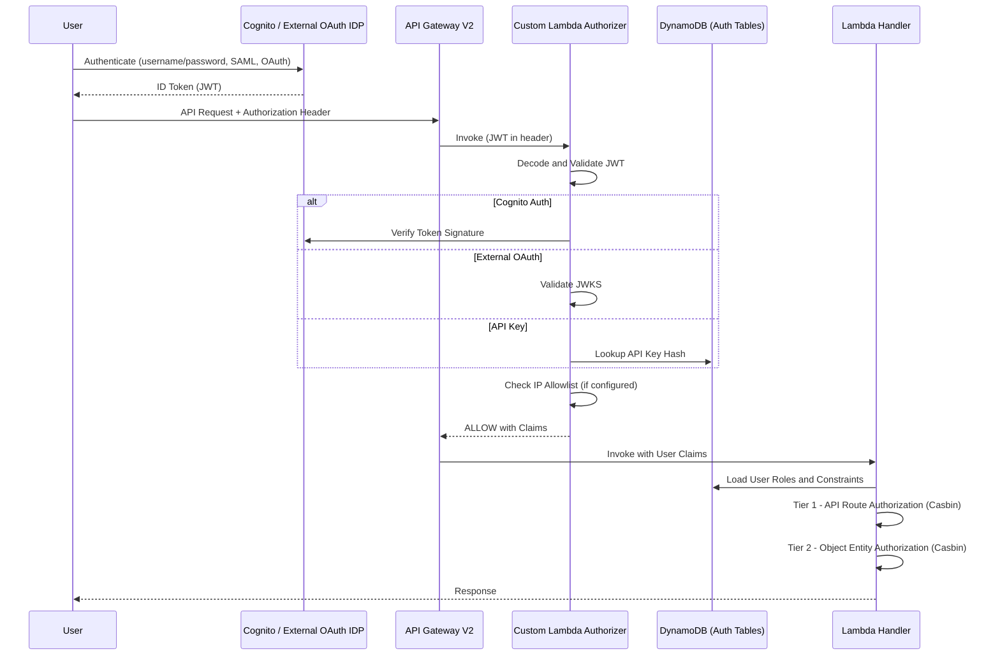
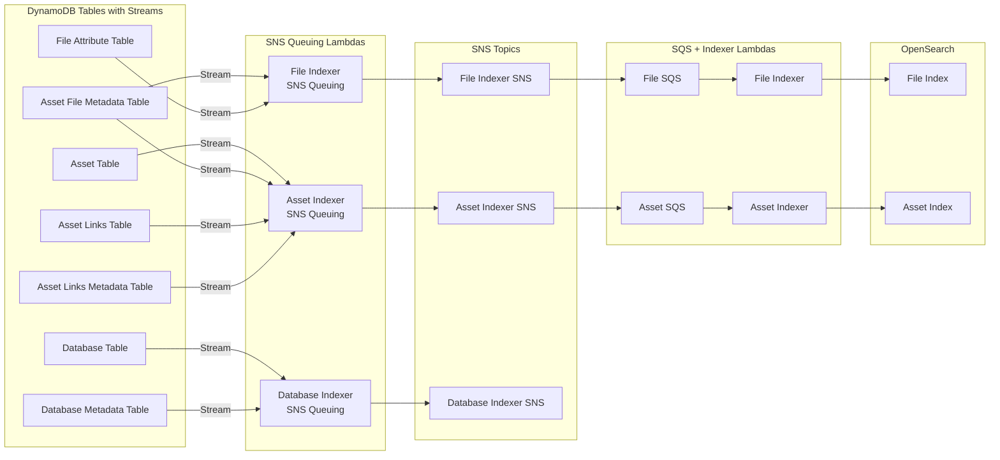
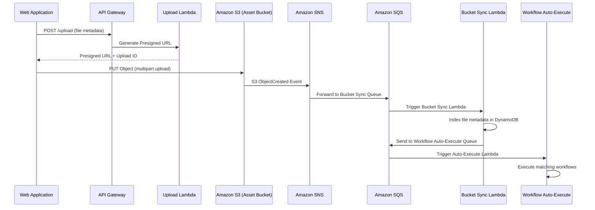
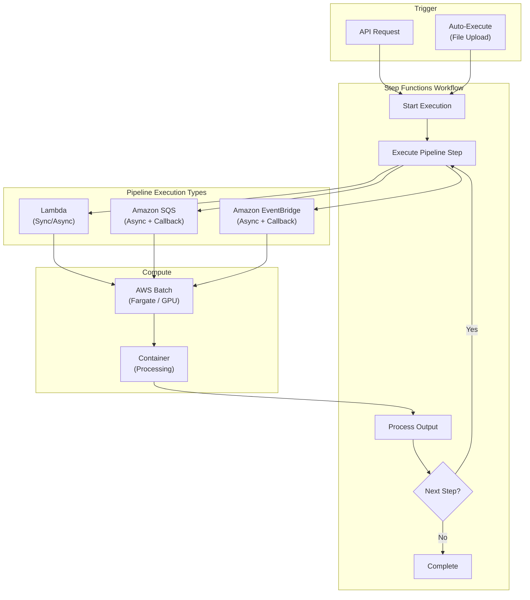
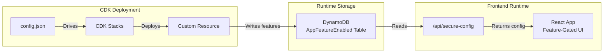
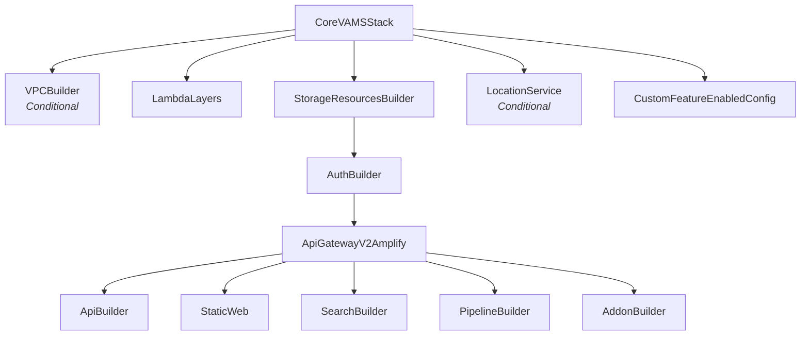

# Detailed Architecture

This page describes the key architectural flows within VAMS, including authentication, data indexing, file upload, pipeline execution, and the configuration propagation system.

## Authentication Flow

VAMS supports multiple authentication providers: Amazon Cognito (with optional SAML federation), external OAuth identity providers, and API keys. Regardless of the provider, all requests pass through the same custom Lambda authorizer.

### Authorization Tiers

The Casbin policy engine enforces two authorization tiers within every Lambda handler:

| Tier | Scope | What It Controls | Casbin Method |
|---|---|---|---|
| **Tier 1** | API Route | Can this role call this endpoint? | `enforceAPI(event)` |
| **Tier 2** | Data Entity | Can this user access this specific resource? | `enforce(event, item)` |

Both tiers must allow for the request to succeed. Tier 1 is evaluated using `api` and `web` object type constraints. Tier 2 is evaluated against entity-type constraints (`database`, `asset`, `pipeline`, `workflow`, etc.).

:::warning[Object Type Annotation]
Before calling Tier 2 enforcement, handlers must annotate the data object with its `object__type` field (e.g., `item['object__type'] = 'asset'`). Failing to set this field causes the authorization check to silently deny access.
:::

### Supported Authentication Providers

| Provider | Configuration | Use Case |
|---|---|---|
| Amazon Cognito (native) | `authProvider.useCognito.enabled = true` | Default. Managed user pool with password auth. |
| Amazon Cognito + SAML | `authProvider.useCognito.useSaml = true` | Enterprise SSO via SAML federation. |
| External OAuth IDP | `authProvider.useExternalOAuthIdp.enabled = true` | Third-party identity providers (Okta, Azure AD, etc.). |
| API Keys | Always available | Machine-to-machine authentication. Keys stored as SHA-256 hashes. |

## Data Indexing Flow

VAMS maintains search indexes in Amazon OpenSearch that mirror data from Amazon DynamoDB. The indexing pipeline uses Amazon DynamoDB Streams, Amazon SNS, and Amazon SQS to decouple producers from consumers.

:::info[Dual Index Architecture]
VAMS uses a dual-index architecture with separate **file index** and **asset index** in Amazon OpenSearch. The file index stores per-file metadata, attributes, and S3 information. The asset index stores per-asset metadata, version information, tags, and relationship flags. Both indexes use `flat_object` fields for dynamic metadata and attributes to prevent field explosion.
:::

## File Upload Flow

File uploads to VAMS use Amazon S3 presigned URLs for direct browser-to-S3 transfers. After upload, Amazon S3 event notifications trigger automatic indexing and optional workflow execution.

### Upload Process Details

1. The web application requests a presigned URL from the upload API endpoint, providing file metadata (name, size, content type).
2. The Lambda handler validates the file against blocked extension and MIME type lists, then generates an Amazon S3 presigned URL.
3. The browser uploads the file directly to Amazon S3 using the presigned URL (supporting multipart for large files).
4. Amazon S3 emits an `ObjectCreated` event to the bucket-specific Amazon SNS topic.
5. The Amazon SNS topic fans out to an Amazon SQS queue subscribed by the bucket sync Lambda.
6. The bucket sync Lambda creates or updates file records in Amazon DynamoDB and optionally queues workflow auto-execution.

## Pipeline Execution Flow

VAMS supports three pipeline execution types: **Lambda** (synchronous or asynchronous invocation), **SQS** (asynchronous message delivery), and **EventBridge** (asynchronous event delivery). All pipeline types are orchestrated through AWS Step Functions.

### Pipeline S3 Output Paths

Each pipeline step in a workflow receives designated Amazon S3 output paths from the workflow state machine:

| Path Variable | Target Bucket | Purpose |
|---|---|---|
| `outputS3AssetFilesPath` | Asset bucket | File-level outputs including `.previewFile.*` thumbnails (versioned) |
| `outputS3AssetPreviewPath` | Asset bucket | Asset-level preview images only (versioned) |
| `outputS3AssetMetadataPath` | Asset bucket | Metadata files produced by the pipeline (versioned) |
| `inputOutputS3AssetAuxiliaryFilesPath` | Auxiliary bucket | Temporary working files or non-versioned viewer data |

### Available Pipelines

| Pipeline | Compute | Description |
|---|---|---|
| 3D Basic Conversion | AWS Batch (Fargate) | Convert 3D file formats |
| CAD/Mesh Metadata Extraction | AWS Batch (Fargate) | Extract metadata from CAD and mesh files |
| Point Cloud Potree Viewer | AWS Batch (Fargate) | Generate Potree octree data for point cloud visualization |
| 3D Preview Thumbnail | AWS Batch (Fargate) | Generate GIF/JPG/PNG preview thumbnails for 3D files |
| Gaussian Splatting (Splat Toolbox) | AWS Batch (Fargate) | Generate Gaussian splat reconstructions |
| GenAI Metadata 3D Labeling | AWS Batch (Fargate) | AI-powered metadata labeling using Amazon Bedrock and Amazon Rekognition |
| Model Optimization (ModelOps) | AWS Batch (Fargate) | Optimize 3D models for web delivery |
| RapidPipeline (ECS) | AWS Batch (Fargate) | RapidPipeline integration via Amazon ECS |
| RapidPipeline (EKS) | Amazon EKS | RapidPipeline integration via Amazon EKS |
| Isaac Lab Training | AWS Batch (GPU) | NVIDIA Isaac Lab simulation training |

## Configuration Flow

VAMS uses a three-stage configuration system that flows from CDK deployment configuration through Amazon DynamoDB to the frontend at runtime.

### Configuration Resolution Order

Configuration values resolve through a four-tier fallback chain:

1. **CDK context** (`-c key=value` on command line)
2. **config.json** file (`infra/config/config.json`)
3. **Environment variables**
4. **Hardcoded defaults** (in `getConfig()`)

### Feature Flags

| Feature Flag | Description |
|---|---|
| `GOVCLOUD` | AWS GovCloud deployment mode |
| `ALLOWUNSAFEEVAL` | Allow `unsafe-eval` in Content Security Policy |
| `LOCATIONSERVICES` | Amazon Location Service enabled |
| `ALBDEPLOY` | Application Load Balancer deployment mode |
| `CLOUDFRONTDEPLOY` | Amazon CloudFront deployment mode |
| `NOOPENSEARCH` | Amazon OpenSearch disabled |
| `AUTHPROVIDER_COGNITO` | Amazon Cognito authentication provider |
| `AUTHPROVIDER_COGNITO_SAML` | Amazon Cognito with SAML federation |
| `AUTHPROVIDER_EXTERNALOAUTHIDP` | External OAuth identity provider |

## Nested Stack Dependency Chain

The following diagram shows the complete dependency ordering between VAMS nested stacks.

## Environment Variable Injection

All Lambda functions receive their configuration through environment variables injected by CDK Lambda builder functions. This ensures no resource names are hardcoded in application code.

### Common Environment Variables (All Lambdas)

| Variable | Source | Purpose |
|---|---|---|
| `AUTH_TABLE_NAME` | `authEntitiesStorageTable` | Authentication entities table |
| `CONSTRAINTS_TABLE_NAME` | `constraintsStorageTable` | Permission constraints table |
| `USER_ROLES_TABLE_NAME` | `userRolesStorageTable` | User-role mappings table |
| `ROLES_TABLE_NAME` | `rolesStorageTable` | Role definitions table |
| `COGNITO_AUTH_ENABLED` | Computed from config | Whether Amazon Cognito auth is active |
| `AUDIT_LOG_AUTHENTICATION` | CloudWatch Log Group | Authentication audit events |
| `AUDIT_LOG_AUTHORIZATION` | CloudWatch Log Group | Authorization audit events |
| `AUDIT_LOG_FILEUPLOAD` | CloudWatch Log Group | File upload audit events |
| `AUDIT_LOG_FILEDOWNLOAD` | CloudWatch Log Group | File download audit events |
| `AUDIT_LOG_FILEDOWNLOAD_STREAMED` | CloudWatch Log Group | Streamed download audit events |
| `AUDIT_LOG_AUTHOTHER` | CloudWatch Log Group | Other auth audit events |
| `AUDIT_LOG_AUTHCHANGES` | CloudWatch Log Group | Auth changes audit events |
| `AUDIT_LOG_ACTIONS` | CloudWatch Log Group | General action audit events |
| `AUDIT_LOG_ERRORS` | CloudWatch Log Group | Error audit events |

:::tip[Lambda Builder Pattern]
Every Lambda function is constructed by a builder function in `infra/lib/lambdaBuilder/`. Each builder follows a strict pattern: create function, grant Amazon DynamoDB permissions, then call four required security helpers (`kmsKeyLambdaPermissionAddToResourcePolicy`, `setupSecurityAndLoggingEnvironmentAndPermissions`, `globalLambdaEnvironmentsAndPermissions`, `suppressCdkNagErrorsByGrantReadWrite`).
:::

## Next Steps

- [AWS Resources](aws-resources.md) -- Complete inventory of all deployed AWS resources
- [Security Architecture](security.md) -- Encryption, authorization, and compliance details
- [Network Architecture](networking.md) -- VPC, endpoints, and deployment connectivity
- [Data Model](data-model.md) -- Amazon DynamoDB table schemas and Amazon OpenSearch index mappings
