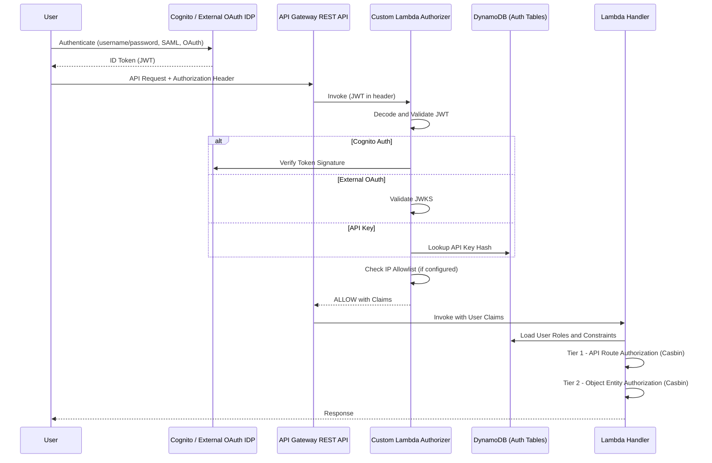
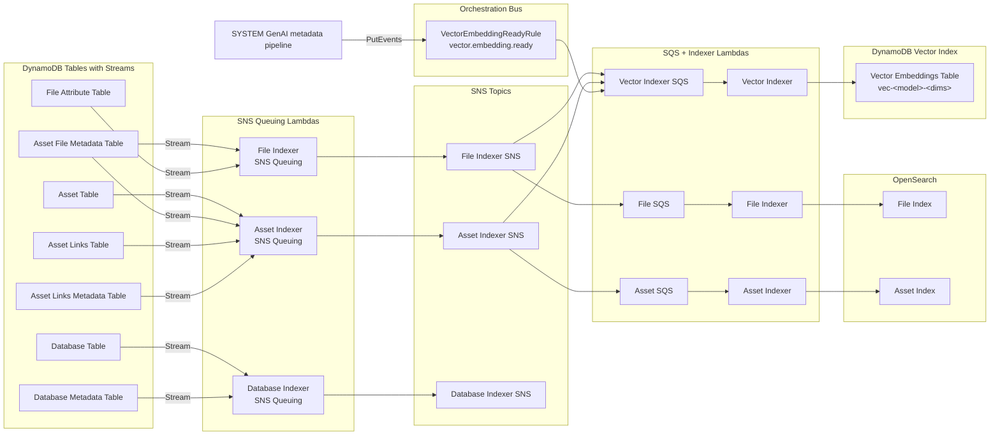
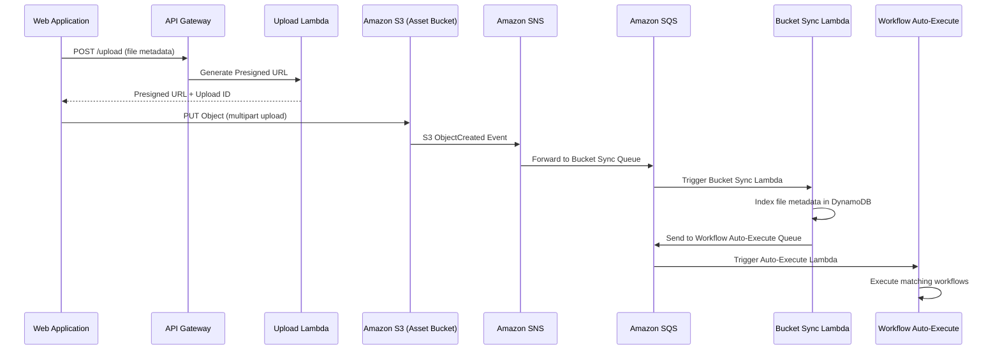
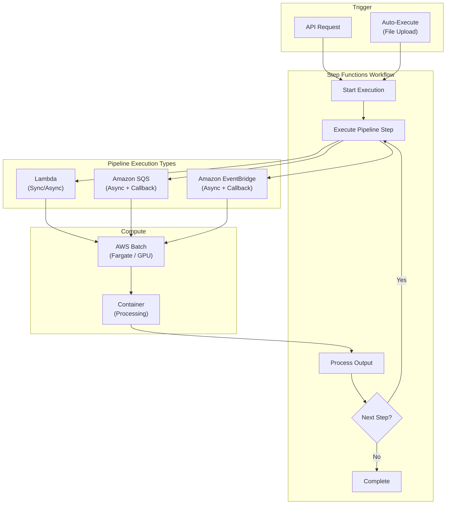
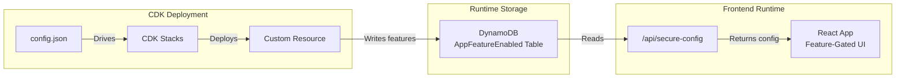
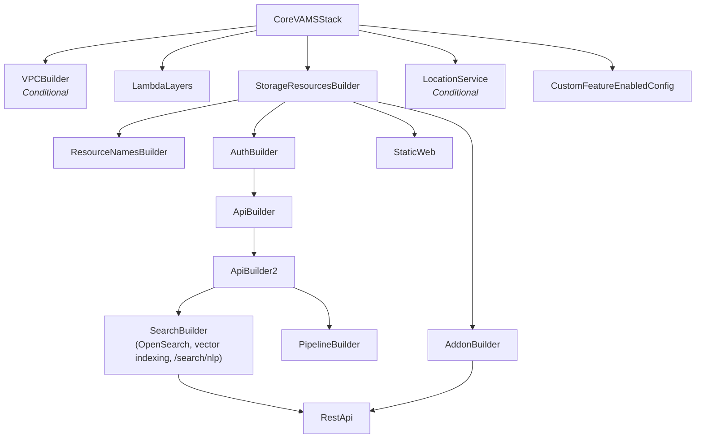

# Detailed Architecture

This page describes the key architectural flows within VAMS, including authentication, data indexing, file upload, pipeline execution, and the configuration propagation system.

## Authentication Flow

VAMS supports multiple authentication providers: Amazon Cognito (with optional SAML federation), external OAuth identity providers, and API keys. Regardless of the provider, all requests pass through the same custom Lambda authorizer.

```mermaid
sequenceDiagram
    participant User
    participant IDP as Cognito / External OAuth IDP
    participant APIGW as API Gateway REST API
    participant Authorizer as Custom Lambda Authorizer
    participant DDB as DynamoDB (Auth Tables)
    participant Handler as Lambda Handler

    User->>IDP: Authenticate (username/password, SAML, OAuth)
    IDP-->>User: ID Token (JWT)
    User->>APIGW: API Request + Authorization Header
    APIGW->>Authorizer: Invoke (JWT in header)
    Authorizer->>Authorizer: Decode and Validate JWT
    alt Cognito Auth
        Authorizer->>IDP: Verify Token Signature
    else External OAuth
        Authorizer->>Authorizer: Validate JWKS
    else API Key
        Authorizer->>DDB: Lookup API Key Hash
    end
    Authorizer->>Authorizer: Check IP Allowlist (if configured)
    Authorizer-->>APIGW: ALLOW with Claims
    APIGW->>Handler: Invoke with User Claims
    Handler->>DDB: Load User Roles and Constraints
    Handler->>Handler: Tier 1 - API Route Authorization (Casbin)
    Handler->>Handler: Tier 2 - Object Entity Authorization (Casbin)
    Handler-->>User: Response
```

### Authorization Tiers

The Casbin policy engine enforces two authorization tiers within every Lambda handler:

| Tier       | Scope       | What It Controls                             | Casbin Method          |
| ---------- | ----------- | -------------------------------------------- | ---------------------- |
| **Tier 1** | API Route   | Can this role call this endpoint?            | `enforceAPI(event)`    |
| **Tier 2** | Data Entity | Can this user access this specific resource? | `enforce(event, item)` |

Both tiers must allow for the request to succeed. Tier 1 is evaluated using `api` and `web` object type constraints. Tier 2 is evaluated against entity-type constraints (`database`, `asset`, `pipeline`, `workflow`, etc.).

:::warning[Object Type Annotation]
Before calling Tier 2 enforcement, handlers must annotate the data object with its `object__type` field (e.g., `item['object__type'] = 'asset'`). Failing to set this field causes the authorization check to silently deny access.
:::

### Supported Authentication Providers

| Provider                | Configuration                                     | Use Case                                                          |
| ----------------------- | ------------------------------------------------- | ----------------------------------------------------------------- |
| Amazon Cognito (native) | `authProvider.useCognito.enabled = true`          | Default. Managed user pool with password auth.                    |
| Amazon Cognito + SAML   | `authProvider.useCognito.useSaml = true`          | Enterprise SSO via SAML federation.                               |
| External OAuth IDP      | `authProvider.useExternalOAuthIdp.enabled = true` | Third-party identity providers (Okta, Azure AD, etc.).            |
| API Keys                | Always available                                  | Machine-to-machine authentication. Keys stored as SHA-256 hashes. |

## Data Indexing Flow

<!-- TODO(owner): diagram: dataQueues_MainFlow.png — revise the data-queue diagram in place to add the VectorEmbeddingReadyRule → Vector Indexer SQS → Vector Indexer → Vector Embeddings Table branch (both PNG copies) -->

VAMS maintains search indexes in Amazon OpenSearch that mirror data from Amazon DynamoDB, and — when vector search is enabled — a DynamoDB vector index of per-file-version embeddings. Both are fed through Amazon DynamoDB Streams, Amazon SNS, Amazon SQS, and the VAMS orchestration bus on Amazon EventBridge, which decouple producers from consumers.

```mermaid
graph LR
    subgraph DynamoDB Tables with Streams
        AT["Asset Table"]
        MT["Asset File Metadata Table"]
        FT["File Attribute Table"]
        DT["Database Table"]
        DMT["Database Metadata Table"]
        LT["Asset Links Table"]
        LMT["Asset Links Metadata Table"]
    end

    subgraph SNS Queuing Lambdas
        FQL["File Indexer<br/>SNS Queuing"]
        AQL["Asset Indexer<br/>SNS Queuing"]
        DQL["Database Indexer<br/>SNS Queuing"]
    end

    subgraph SNS Topics
        FSNS["File Indexer SNS"]
        ASNS["Asset Indexer SNS"]
        DSNS["Database Indexer SNS"]
    end

    subgraph SQS + Indexer Lambdas
        FSQS["File SQS"] --> FI["File Indexer"]
        ASQS["Asset SQS"] --> AI["Asset Indexer"]
        VSQS["Vector Indexer SQS"] --> VI["Vector Indexer"]
    end

    subgraph Orchestration Bus
        EBR["VectorEmbeddingReadyRule<br/>vector.embedding.ready"]
    end

    subgraph OpenSearch
        FIdx["File Index"]
        AIdx["Asset Index"]
    end

    subgraph DynamoDB Vector Index
        VT["Vector Embeddings Table<br/>vec-&lt;model&gt;-&lt;dims&gt;"]
    end

    MT -->|Stream| FQL
    FT -->|Stream| FQL
    FQL --> FSNS
    FSNS --> FSQS
    FSNS --> VSQS
    FI --> FIdx

    AT -->|Stream| AQL
    MT -->|Stream| AQL
    LT -->|Stream| AQL
    LMT -->|Stream| AQL
    AQL --> ASNS
    ASNS --> ASQS
    ASNS --> VSQS
    AI --> AIdx

    DT -->|Stream| DQL
    DMT -->|Stream| DQL
    DQL --> DSNS

    GP["SYSTEM GenAI metadata pipeline"] -->|PutEvents| EBR
    EBR --> VSQS
    VI --> VT
```

:::info[Dual Index Architecture]
VAMS uses a dual-index architecture with separate **file index** and **asset index** in Amazon OpenSearch. The file index stores per-file metadata, attributes, and S3 information. The asset index stores per-asset metadata, version information, tags, and relationship flags. Both indexes use `flat_object` fields for dynamic metadata and attributes to prevent field explosion.
:::

:::info[Vector Index]
When `app.vectorSearch.enabled` is `true`, the SYSTEM GenAI metadata pipeline publishes one `vector.embedding.ready` event per analyzed file version on the orchestration bus. An Amazon EventBridge rule and the file and asset indexer SNS topics all feed one vector indexer queue, and a single vector indexer Lambda function owns the vector table: it writes new items, flips `isLatest` when a new version arrives, flips `isArchived` on archive and unarchive, and deletes items on permanent delete. Search reads the table with `SearchVectors` through the `POST /search/nlp` Lambda function. See [Vector search](../concepts/vector-search.md).
:::

## File Upload Flow

File uploads to VAMS use Amazon S3 presigned URLs for direct browser-to-S3 transfers. After upload, Amazon S3 event notifications trigger automatic indexing and optional workflow execution.

```mermaid
sequenceDiagram
    participant Web as Web Application
    participant API as API Gateway
    participant Upload as Upload Lambda
    participant S3 as Amazon S3 (Asset Bucket)
    participant SNS as Amazon SNS
    participant SQS as Amazon SQS
    participant Sync as Bucket Sync Lambda
    participant WF as Workflow Auto-Execute

    Web->>API: POST /upload (file metadata)
    API->>Upload: Generate Presigned URL
    Upload-->>Web: Presigned URL + Upload ID
    Web->>S3: PUT Object (multipart upload)
    S3->>SNS: S3 ObjectCreated Event
    SNS->>SQS: Forward to Bucket Sync Queue
    SQS->>Sync: Trigger Bucket Sync Lambda
    Sync->>Sync: Index file metadata in DynamoDB
    Sync->>SQS: Send to Workflow Auto-Execute Queue
    SQS->>WF: Trigger Auto-Execute Lambda
    WF->>WF: Execute matching workflows
```

### Upload Process Details

1. The web application requests a presigned URL from the upload API endpoint, providing file metadata (name, size, content type).
2. The Lambda handler validates the file against blocked extension and MIME type lists, then generates an Amazon S3 presigned URL.
3. The browser uploads the file directly to Amazon S3 using the presigned URL (supporting multipart for large files).
4. Amazon S3 emits an `ObjectCreated` event to the bucket-specific Amazon SNS topic.
5. The Amazon SNS topic fans out to an Amazon SQS queue subscribed by the bucket sync Lambda.
6. The bucket sync Lambda creates or updates file records in Amazon DynamoDB and optionally queues workflow auto-execution.

## Pipeline Execution Flow

VAMS supports four pipeline execution types: **Lambda** (synchronous or asynchronous invocation), **SQS** (asynchronous message delivery), **EventBridge** (asynchronous event delivery), and **DeadlineCloud** (AWS Deadline Cloud job submission, commercial partition only). All pipeline types are orchestrated through AWS Step Functions.

```mermaid
graph TD
    subgraph Trigger
        API["API Request"]
        AUTO["Auto-Execute<br/>(File Upload)"]
    end

    subgraph Step Functions Workflow
        START["Start Execution"]
        EXEC["Execute Pipeline Step"]
        PROCESS["Process Output"]
        NEXT{Next Step?}
        DONE["Complete"]
    end

    subgraph Pipeline Execution Types
        LB["Lambda<br/>(Sync/Async)"]
        SQ["Amazon SQS<br/>(Async + Callback)"]
        EB["Amazon EventBridge<br/>(Async + Callback)"]
    end

    subgraph Compute
        BATCH["AWS Batch<br/>(Fargate / GPU)"]
        CONTAINER["Container<br/>(Processing)"]
    end

    API --> START
    AUTO --> START
    START --> EXEC
    EXEC --> LB
    EXEC --> SQ
    EXEC --> EB
    LB --> BATCH
    SQ --> BATCH
    EB --> BATCH
    BATCH --> CONTAINER
    CONTAINER --> PROCESS
    PROCESS --> NEXT
    NEXT -->|Yes| EXEC
    NEXT -->|No| DONE
```

### Pipeline S3 Output Paths

Each pipeline step in a workflow receives designated Amazon S3 output paths from the workflow state machine:

| Path Variable                          | Target Bucket                          | Purpose                                                                                        |
| -------------------------------------- | -------------------------------------- | ---------------------------------------------------------------------------------------------- |
| `outputS3AssetFilesPath`               | Asset bucket                           | File-level outputs including `.previewFile.*` thumbnails (versioned)                           |
| `outputS3AssetPreviewPath`             | Asset bucket                           | Asset-level preview images only (versioned)                                                    |
| `outputS3AssetMetadataPath`            | Asset bucket                           | Metadata and attribute files produced by the pipeline (versioned)                              |
| `outputS3AssetResultsPath`             | Workflow execution bucket (run prefix) | Results recorded on the execution; `execution.status.json` reports a pipeline-decided `FAILED` |
| `inputOutputS3AssetAuxiliaryFilesPath` | Auxiliary bucket                       | Temporary working files or non-versioned viewer data                                           |

### Available Pipelines

| Pipeline                                  | Compute                                                     | Description                                                                                    |
| ----------------------------------------- | ----------------------------------------------------------- | ---------------------------------------------------------------------------------------------- |
| 3D Basic Conversion                       | AWS Lambda                                                  | Convert 3D file formats                                                                        |
| SYSTEM - GenAI Metadata Generation        | AWS Lambda (container images); optional AWS Batch (Fargate) | Amazon Bedrock analysis of every viewer-supported file: attributes, GenAI metadata, embeddings |
| 3D Preview Thumbnail (SYSTEM - Preview)   | AWS Batch (Fargate)                                         | Generate GIF/JPG/PNG preview thumbnails for 3D files                                           |
| Coordinate Transform                      | AWS Batch (Fargate)                                         | Reproject point clouds between coordinate reference systems                                    |
| Point Cloud Potree Viewer                 | AWS Batch (Fargate)                                         | Generate Potree octree data for point cloud visualization                                      |
| Gaussian Splatting (Splat Toolbox)        | AWS Batch (GPU)                                             | Generate Gaussian splat reconstructions                                                        |
| NVIDIA Cosmos Predict / Reason / Transfer | AWS Batch (GPU)                                             | World-model video generation, video reasoning, and control-signal video transfer               |
| NVIDIA Cosmos 3                           | AWS Batch (GPU)                                             | Omnimodal world-model generation                                                               |
| NVIDIA Gr00t Fine-Tuning                  | AWS Batch (GPU)                                             | Fine-tune the GR00T embodied AI model                                                          |
| Isaac Lab Training                        | AWS Batch (GPU)                                             | NVIDIA Isaac Lab simulation training                                                           |
| RapidPipeline (ECS)                       | Amazon ECS (Fargate)                                        | RapidPipeline integration via Amazon ECS                                                       |
| RapidPipeline (EKS)                       | Amazon EKS                                                  | RapidPipeline integration via Amazon EKS                                                       |
| Model Optimization (ModelOps)             | Amazon ECS (Fargate)                                        | Optimize 3D models for web delivery                                                            |

## Configuration Flow

VAMS uses a three-stage configuration system that flows from CDK deployment configuration through Amazon DynamoDB to the frontend at runtime.

```mermaid
graph LR
    subgraph CDK Deployment
        CONFIG["config.json"]
        CDK["CDK Stacks"]
        CR["Custom Resource"]
    end

    subgraph Runtime Storage
        DDB["DynamoDB<br/>AppFeatureEnabled Table"]
    end

    subgraph Frontend Runtime
        SECAPI["/api/secure-config"]
        WEBAPP["React App<br/>Feature-Gated UI"]
    end

    CONFIG -->|Drives| CDK
    CDK -->|Deploys| CR
    CR -->|Writes features| DDB
    DDB -->|Reads| SECAPI
    SECAPI -->|Returns config| WEBAPP
```

### Configuration Resolution Order

Configuration values resolve through a four-tier fallback chain:

1. **CDK context** (`-c key=value` on command line)
2. **config.json** file (`infra/config/config.json`)
3. **Environment variables**
4. **Hardcoded defaults** (in `getConfig()`)

### Feature Flags

| Feature Flag                    | Description                                                                                                               |
| ------------------------------- | ------------------------------------------------------------------------------------------------------------------------- |
| `GOVCLOUD`                      | AWS GovCloud deployment mode (also set for AWS European Sovereign Cloud deployments)                                      |
| `ALLOWUNSAFEEVAL`               | Allow `unsafe-eval` in Content Security Policy                                                                            |
| `LOCATIONSERVICES`              | Amazon Location Service enabled                                                                                           |
| `ALBDEPLOY`                     | Application Load Balancer deployment mode                                                                                 |
| `CLOUDFRONTDEPLOY`              | Amazon CloudFront deployment mode                                                                                         |
| `NOOPENSEARCH`                  | Amazon OpenSearch disabled                                                                                                |
| `AUTHPROVIDER_COGNITO`          | Amazon Cognito authentication provider                                                                                    |
| `AUTHPROVIDER_COGNITO_SAML`     | Amazon Cognito with SAML federation                                                                                       |
| `AUTHPROVIDER_COGNITO_OIDC`     | Amazon Cognito with OIDC federation                                                                                       |
| `AUTHPROVIDER_EXTERNALOAUTHIDP` | External OAuth identity provider                                                                                          |
| `PHYSNA_ADDON`                  | Physna add-on frontend features enabled                                                                                   |
| `DEADLINECLOUD_PIPELINES`       | AWS Deadline Cloud pipeline execution type enabled                                                                        |
| `VECTORSEARCH`                  | Natural-language (vector) search enabled; the search page shows the natural-language toggle and `POST /search/nlp` exists |

## Nested Stack Dependency Chain

The following diagram shows the complete dependency ordering between VAMS nested stacks.

```mermaid
graph TD
    Core["CoreVAMSStack"]

    Core --> VPC["VPCBuilder<br/><i>Conditional</i>"]
    Core --> LL["LambdaLayers"]
    Core --> SRB["StorageResourcesBuilder"]

    SRB --> RNB["ResourceNamesBuilder"]
    SRB --> AB["AuthBuilder"]

    AB --> APIBuild["ApiBuilder"]
    APIBuild --> APIBuild2["ApiBuilder2"]
    APIBuild2 --> SearchB["SearchBuilder<br/>(OpenSearch, vector indexing, /search/nlp)"]
    APIBuild2 --> PB["PipelineBuilder"]
    SRB --> Addon["AddonBuilder"]
    SearchB --> RestApi["RestApi"]
    Addon --> RestApi
    SRB --> SW["StaticWeb"]

    Core --> LS["LocationService<br/><i>Conditional</i>"]
    Core --> FE["CustomFeatureEnabledConfig"]
```

## Resource Name Resolution

VAMS Lambda functions resolve AWS resource names (Amazon DynamoDB tables, Amazon S3 buckets, Amazon CloudWatch log groups) from AWS Systems Manager Parameter Store at cold start. The CDK deployment publishes one SSM String parameter per registered resource name under `/{config.name}-{baseStackName}/resourceNames/` — 68 in the shipped configuration (55 DynamoDB tables, of which 7 are deprecated tables retained for migration under `dynamoTables/legacy/`; 9 audit log groups; 2 S3 buckets; 2 Lambda function names). The set is derived from the `resourceNameRegistry`, so it grows with each registered resource. The Resource Names nested stack materializes 66 of them; the Amazon OpenSearch Service stack publishes the remaining two (`lambdaFunctions/crOsReindexer`, `lambdaFunctions/vectorReindexer`), each only when its feature is enabled, because the functions they name are created there. Non-pipeline handlers receive a single `VAMS_RESOURCE_PARAM_PREFIX` environment variable pointing to this SSM prefix, plus AWS IAM permissions for `ssm:GetParameter`, `ssm:GetParameters`, and `ssm:GetParametersByPath`.

At cold start, each handler calls `get_table_name(ResourceKeys.*)`, `get_bucket_name(ResourceKeys.*)`, or `get_log_group_name(ResourceKeys.*)` from `backend/backend/common/resourceNames.py`, which caches the parameter fetch for 60 minutes. This centralizes name management, enables environment variable overrides for testing, and reduces CDK template size by removing per-handler table/bucket/log-group environment variables (pipelines in `backendPipelines/` retain their direct environment variables).

### Resolution Order

1. **Environment variable override** — check for a legacy-style env var (e.g., `ASSET_STORAGE_TABLE_NAME`), used by tests and local utilities
2. **In-module cache** — 60-minute TTL per resource key
3. **Negative record** — a key a completed sweep did not carry is remembered as absent for a short window, so an unpublished parameter costs one sweep per window rather than one call. A later sweep that does carry the key clears the record.
4. **SSM GetParametersByPath** — one paginated call fetching all parameters under the prefix on first access

:::tip[Lambda Builder Pattern]
Every Lambda function is constructed by a builder function in `infra/lib/lambdaBuilder/`. Non-pipeline builders inject only handler-specific environment variables (e.g., `PRESIGNED_URL_TIMEOUT_SECONDS`); resource names are resolved from SSM. Each builder calls four required security helpers: `kmsKeyLambdaPermissionAddToResourcePolicy`, `setupSecurityAndLoggingEnvironmentAndPermissions`, `globalLambdaEnvironmentsAndPermissions` (injects `VAMS_RESOURCE_PARAM_PREFIX` and grants SSM read), and `suppressCdkNagErrorsByGrantReadWrite`.
:::

## Next Steps

-   [AWS Resources](aws-resources.md) -- Complete inventory of all deployed AWS resources
-   [Security Architecture](security.md) -- Encryption, authorization, and compliance details
-   [Network Architecture](networking.md) -- VPC, endpoints, and deployment connectivity
-   [Data Model](data-model.md) -- Amazon DynamoDB table schemas and Amazon OpenSearch index mappings
