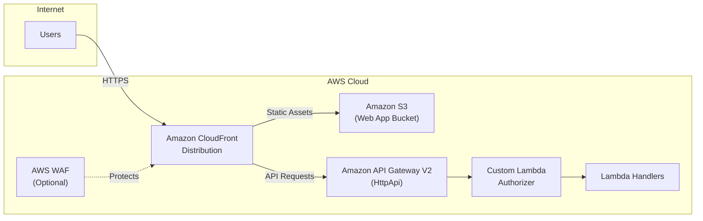
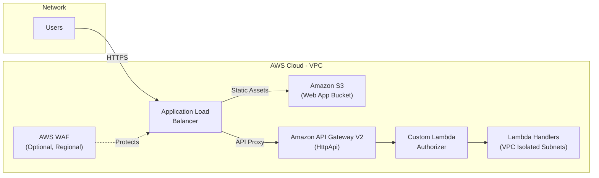
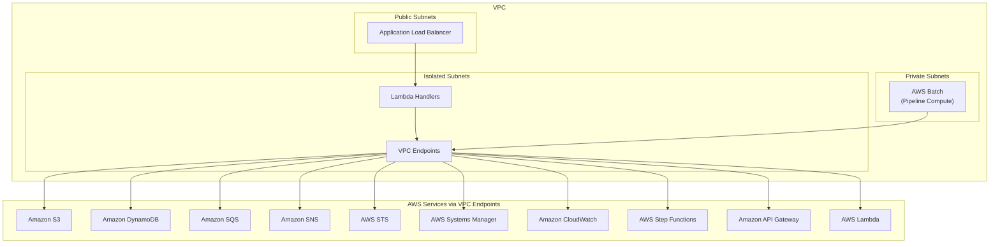

# Network Architecture

VAMS supports multiple network deployment configurations to accommodate commercial AWS, AWS GovCloud, . This page describes the network topology for each deployment mode, VPC configuration options, VPC endpoints, and subnet architecture.

## Deployment Modes

### Amazon CloudFront Deployment (Commercial AWS)

The default deployment mode uses Amazon CloudFront as the global content delivery network for both the web application and API requests.

In this mode:

-   Amazon CloudFront serves the React web application from an Amazon S3 origin bucket
-   API requests are proxied through Amazon CloudFront to Amazon API Gateway V2
-   An optional AWS WAF Web ACL (deployed in `us-east-1`) protects the distribution
-   Custom domain names are supported via `useCloudFront.customDomain` configuration with an AWS Certificate Manager certificate and optional Amazon Route 53 hosted zone

### Application Load Balancer Deployment (GovCloud / ALB Mode)

For AWS GovCloud or environments requiring an Application Load Balancer, VAMS deploys an ALB as the entry point.

In this mode:

-   An Application Load Balancer serves the web application and proxies API requests
-   The ALB requires a domain host name and an AWS Certificate Manager certificate ARN
-   The ALB can be deployed in public or private subnets (`useAlb.usePublicSubnet`)
-   An optional AWS WAF Web ACL (regional) protects the ALB
-   VPC is required (`useGlobalVpc.enabled = true`)

### VPC-Isolated Deployment (GovCloud)

For restricted environments, GovCloud deployments can use full VPC isolation with all AWS service access routed through VPC endpoints and no internet egress.

## VPC Configuration Options

VAMS supports three VPC modes:

| Mode                    | Configuration                                             | Description                                               |
| ----------------------- | --------------------------------------------------------- | --------------------------------------------------------- |
| **No VPC**              | `useGlobalVpc.enabled = false`                            | Default for commercial. Lambda functions run outside VPC. |
| **VAMS-Managed VPC**    | `useGlobalVpc.enabled = true`, no `optionalExternalVpcId` | VAMS creates a new VPC with configured CIDR range.        |
| **External VPC Import** | `useGlobalVpc.enabled = true` + `optionalExternalVpcId`   | VAMS imports an existing VPC and specified subnets.       |

### VAMS-Managed VPC Configuration

When VAMS creates its own VPC, the following subnet types are provisioned:

| Subnet Type                         | CIDR Mask            | Purpose                                       | Always Created |
| ----------------------------------- | -------------------- | --------------------------------------------- | -------------- |
| **Isolated** (`PRIVATE_ISOLATED`)   | /23 (510 usable IPs) | Lambda functions, VPC endpoints               | Yes            |
| **Private** (`PRIVATE_WITH_EGRESS`) | /26 (62 usable IPs)  | Pipeline compute (AWS Batch with NAT Gateway) | Conditional    |
| **Public**                          | /26 (62 usable IPs)  | ALB, pipeline compute requiring internet      | Conditional    |

Private and public subnets are created when any of the following are enabled:

-   ALB with public subnet (`useAlb.usePublicSubnet`)
-   RapidPipeline ECS or EKS
-   ModelOps pipeline
-   Splat Toolbox pipeline
-   Isaac Lab Training pipeline
-   NVIDIA Cosmos pipeline (Predict, Reason, or Transfer)

### Availability Zone Configuration

The number of availability zones is determined by the deployment configuration:

| Condition                                                | AZ Count |
| -------------------------------------------------------- | -------- |
| Amazon OpenSearch Service (Provisioned)                  | 3 AZs    |
| ALB enabled, or all Lambdas in VPC, or RapidPipeline EKS | 2 AZs    |
| Pipeline-only (no ALB, no all-Lambda VPC)                | 1 AZ     |

### External VPC Import

When importing an existing VPC, subnet IDs must be provided for each subnet type:

| Configuration                       | Description                         |
| ----------------------------------- | ----------------------------------- |
| `optionalExternalVpcId`             | VPC ID to import                    |
| `optionalExternalIsolatedSubnetIds` | Comma-separated isolated subnet IDs |
| `optionalExternalPrivateSubnetIds`  | Comma-separated private subnet IDs  |
| `optionalExternalPublicSubnetIds`   | Comma-separated public subnet IDs   |

:::warning[Context Loading]
When importing a VPC, you may need to run an initial `cdk synth` with `loadContextIgnoreVPCStacks = true` to populate the CDK context with VPC metadata before the full deployment.
:::

## VPC Endpoints

When `useGlobalVpc.addVpcEndpoints = true`, VAMS creates VPC endpoints to enable AWS service access from isolated subnets without internet connectivity.

### Gateway Endpoints (No Cost)

These gateway endpoints are always created when VPC endpoints are enabled:

| Endpoint        | Service                                 | Subnets  |
| --------------- | --------------------------------------- | -------- |
| Amazon S3       | `GatewayVpcEndpointAwsService.S3`       | Isolated |
| Amazon DynamoDB | `GatewayVpcEndpointAwsService.DYNAMODB` | Isolated |

### Common Interface Endpoints

These interface endpoints are always created when VPC endpoints are enabled:

| Endpoint                  | Service           | Purpose                      |
| ------------------------- | ----------------- | ---------------------------- |
| Amazon API Gateway        | `APIGATEWAY`      | API Gateway invocations      |
| AWS Systems Manager (SSM) | `SSM`             | Parameter Store access       |
| AWS Lambda                | `LAMBDA`          | Lambda-to-Lambda invocations |
| AWS STS                   | `STS`             | Credential federation        |
| Amazon CloudWatch Logs    | `CLOUDWATCH_LOGS` | Log delivery                 |
| AWS Step Functions        | `STEP_FUNCTIONS`  | Workflow execution           |
| Amazon SNS                | `SNS`             | Event notifications          |
| Amazon SQS                | `SQS`             | Queue operations             |

### Conditional Interface Endpoints

These endpoints are created based on the deployment configuration:

| Endpoint               | Condition                                 | Purpose                  |
| ---------------------- | ----------------------------------------- | ------------------------ |
| AWS KMS                | `useKmsCmkEncryption.enabled`             | KMS key operations       |
| AWS KMS (FIPS)         | `useKmsCmkEncryption.enabled` + `useFips` | FIPS-compliant KMS       |
| AWS Batch              | Any pipeline enabled                      | Pipeline job submission  |
| Amazon ECR API         | Any pipeline enabled                      | Container image registry |
| Amazon ECR Docker      | Any pipeline enabled                      | Container image pulls    |
| Amazon EFS             | NVIDIA Cosmos enabled                     | Model cache file system  |
| Amazon ECS             | Pipeline with compute needs               | Container orchestration  |
| Amazon ECS Agent       | Isaac Lab Training                        | ECS agent communication  |
| Amazon ECS Telemetry   | Isaac Lab Training                        | ECS telemetry            |
| Amazon Bedrock Runtime | GenAI Metadata + all Lambdas in VPC       | AI model invocation      |
| Amazon Rekognition     | GenAI Metadata + all Lambdas in VPC       | Image analysis           |

### Pipeline-Required Endpoints

The following endpoints are created when any of these pipelines are enabled: Point Cloud Potree Viewer, 3D Preview Thumbnail, GenAI Metadata Labeling, RapidPipeline (ECS/EKS), ModelOps, Splat Toolbox, Isaac Lab Training, or NVIDIA Cosmos (Predict, Reason, Transfer).

-   AWS Batch
-   Amazon ECR API
-   Amazon ECR Docker

:::info[ECS Endpoint Consolidation]
Only one Amazon ECS interface endpoint can exist per VPC when private DNS is enabled. VAMS consolidates ECS endpoint subnets across pipeline types, with private subnets taking priority over isolated subnets when both are needed.
:::

## Security Groups

### VPC Endpoint Security Group

A single security group is created for all VPC endpoints with the following rules:

| Direction | Protocol | Port | Source    | Purpose                   |
| --------- | -------- | ---- | --------- | ------------------------- |
| Ingress   | TCP      | 443  | VPC CIDR  | HTTPS access to endpoints |
| Ingress   | TCP      | 53   | VPC CIDR  | DNS resolution for ECR    |
| Ingress   | UDP      | 53   | VPC CIDR  | DNS resolution for ECR    |
| Egress    | All      | All  | 0.0.0.0/0 | Allow all outbound        |

### Pipeline Security Groups

Each pipeline construct creates its own security group with VPC CIDR-based ingress rules for communication between AWS Batch compute environments and VPC endpoints.

## VPC Flow Logs

When VAMS creates a managed VPC, VPC flow logs are automatically enabled:

| Setting      | Value                                          |
| ------------ | ---------------------------------------------- |
| Destination  | Amazon CloudWatch Logs                         |
| Traffic Type | ALL                                            |
| Log Group    | `/aws/vendedlogs/VAMSCloudWatchVPCLogs-{hash}` |
| Retention    | 10 years                                       |

## DNS Configuration

All interface VPC endpoints are created with `privateDnsEnabled: true`. This allows Lambda functions and containers within the VPC to use standard AWS service hostnames (e.g., `dynamodb.us-east-1.amazonaws.com`) without custom DNS configuration. The VPC endpoint private DNS automatically resolves these hostnames to the endpoint's private IP addresses.

VAMS VPCs are created with:

-   `enableDnsHostnames: true`
-   `enableDnsSupport: true`

## FIPS Endpoint Usage

When `useFips = true`, the partition-aware service helper (`service-helper.ts`) automatically resolves FIPS-compliant hostnames for all AWS service calls. This is achieved through the `SERVICE_LOOKUP` table in `const.ts`, which maps each service to its standard and FIPS hostname per partition.

For example:

| Service         | Standard Hostname                 | FIPS Hostname                          |
| --------------- | --------------------------------- | -------------------------------------- |
| Amazon S3       | `s3.{region}.amazonaws.com`       | `s3-fips.{region}.amazonaws.com`       |
| Amazon DynamoDB | `dynamodb.{region}.amazonaws.com` | `dynamodb-fips.{region}.amazonaws.com` |
| AWS STS         | `sts.{region}.amazonaws.com`      | `sts-fips.{region}.amazonaws.com`      |

:::note[GovCloud FIPS]
In AWS GovCloud, all endpoints are inherently FIPS-compliant. The API Gateway endpoint URL always uses the non-FIPS variant regardless of the `useFips` setting, as documented by AWS.
:::

## Next Steps

-   [Security Architecture](security.md) -- Encryption, authorization, and compliance
-   [AWS Resources](aws-resources.md) -- Complete resource inventory
-   [Architecture Overview](overview.md) -- High-level system design
