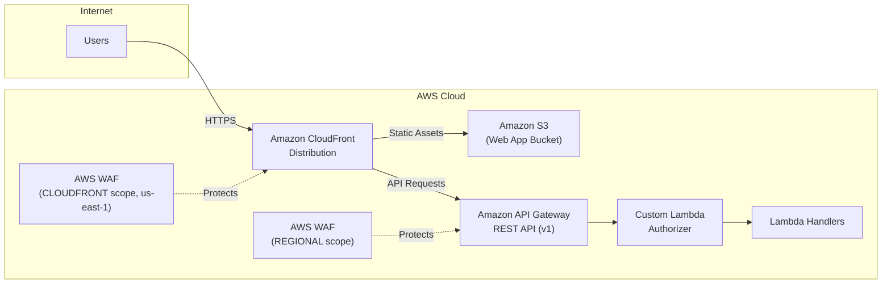
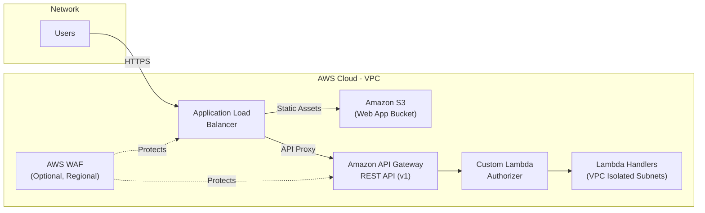
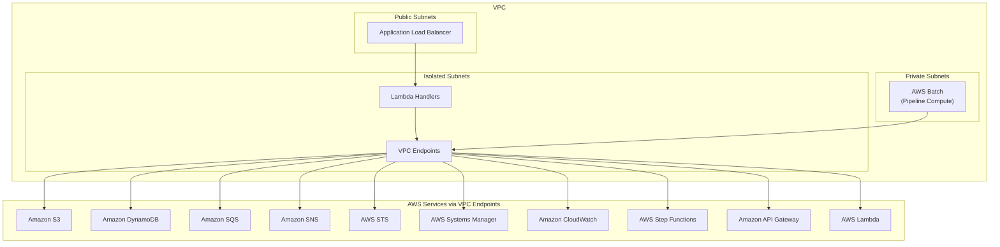

# Network Architecture

VAMS supports multiple network deployment configurations to accommodate commercial AWS, AWS GovCloud, and the AWS European Sovereign Cloud. This page describes the network topology for each deployment mode, VPC configuration options, VPC endpoints, and subnet architecture.

## Deployment Modes

### Amazon CloudFront Deployment (Commercial AWS)

The default deployment mode uses Amazon CloudFront as the global content delivery network for both the web application and API requests.

```mermaid
graph LR
    subgraph Internet
        USER["Users"]
    end

    subgraph AWS Cloud
        CF["Amazon CloudFront<br/>Distribution"]
        WAFCF["AWS WAF<br/>(CLOUDFRONT scope, us-east-1)"]
        WAFR["AWS WAF<br/>(REGIONAL scope)"]
        S3W["Amazon S3<br/>(Web App Bucket)"]
        APIGW["Amazon API Gateway<br/>REST API (v1)"]
        AUTH["Custom Lambda<br/>Authorizer"]
        HANDLERS["Lambda Handlers"]
    end

    USER -->|HTTPS| CF
    WAFCF -.->|Protects| CF
    WAFR -.->|Protects| APIGW
    CF -->|Static Assets| S3W
    CF -->|API Requests| APIGW
    APIGW --> AUTH
    AUTH --> HANDLERS
```

In this mode:

-   Amazon CloudFront serves the React web application from an Amazon S3 origin bucket
-   API requests are proxied through Amazon CloudFront to the REST API, with CloudFront's `/api/*` behavior using an originPath of `/api` (the REST API stage) to absorb the stage path
-   When AWS WAF is enabled, a `CLOUDFRONT`-scoped Web ACL (deployed in `us-east-1`) protects the distribution, and a separate regional Web ACL protects the API Gateway stage (see [WAF Protection Scope](#waf-protection-scope))
-   Custom domain names are supported via `useCloudFront.customDomain` configuration with an AWS Certificate Manager certificate and optional Amazon Route 53 hosted zone
-   The API endpoint type is configurable: `REGIONAL` (default, public; not routed through any VPC endpoint) or `PRIVATE` (VPC interface endpoint only, incompatible with CloudFront)

### Application Load Balancer Deployment (GovCloud / ALB Mode)

For AWS GovCloud or environments requiring an Application Load Balancer, VAMS deploys an ALB as the entry point.

```mermaid
graph LR
    subgraph Network
        USER["Users"]
    end

    subgraph AWS Cloud - VPC
        ALB["Application Load<br/>Balancer"]
        WAF["AWS WAF<br/>(Optional, Regional)"]
        S3W["Amazon S3<br/>(Web App Bucket)"]
        APIGW["Amazon API Gateway<br/>REST API (v1)"]
        AUTH["Custom Lambda<br/>Authorizer"]
        HANDLERS["Lambda Handlers<br/>(VPC Isolated Subnets)"]
    end

    USER -->|HTTPS| ALB
    WAF -.->|Protects| ALB
    WAF -.->|Protects| APIGW
    ALB -->|Static Assets| S3W
    ALB -->|API Proxy| APIGW
    APIGW --> AUTH
    AUTH --> HANDLERS
```

In this mode:

-   An Application Load Balancer serves the web application and proxies API requests
-   The ALB requires a domain host name and an AWS Certificate Manager certificate ARN
-   The ALB redirects `/api*` and `/secure-config*` paths by prepending `/api` (the REST API stage) to absorb the stage path
-   The ALB can be deployed in public subnets (`useAlb.usePublicSubnet = true`) or isolated subnets (`useAlb.usePublicSubnet = false`)
-   When AWS WAF is enabled, a single regional Web ACL protects both the ALB and the API Gateway stage
-   VPC is required (`useGlobalVpc.enabled = true`)
-   A dedicated Amazon S3 interface VPC endpoint forwards static web file requests from the ALB to the Amazon S3 web-app bucket (see [ALB Amazon S3 interface endpoint](#vpc-endpoints))
-   The API endpoint type is configurable: `REGIONAL` (public; not routed through any VPC endpoint) or `PRIVATE` (VPC interface endpoint only)

### VPC-Isolated Deployment (GovCloud)

For restricted environments, GovCloud and AWS European Sovereign Cloud deployments can use full VPC isolation with all AWS service access routed through VPC endpoints and no internet egress. This full-isolation topology applies when `useGlobalVpc.useForAllLambdas` is `true`, which places every VAMS Lambda function inside the VPC. The GovCloud and European Sovereign Cloud templates set `useForAllLambdas` to `false` by default — only the Lambda functions that require the VPC run inside it — and you set it to `true` when stricter network isolation is needed or the Lambda functions must reach specific VPC network components.

```mermaid
graph TD
    subgraph VPC
        subgraph Public Subnets
            ALB["Application Load Balancer"]
        end
        subgraph Isolated Subnets
            HANDLERS["Lambda Handlers"]
            VPCE["VPC Endpoints"]
        end
        subgraph Private Subnets
            BATCH["AWS Batch<br/>(Pipeline Compute)"]
        end
    end

    subgraph AWS Services via VPC Endpoints
        S3["Amazon S3"]
        DDB["Amazon DynamoDB"]
        SQS["Amazon SQS"]
        SNS["Amazon SNS"]
        STS["AWS STS"]
        SSM["AWS Systems Manager"]
        CW["Amazon CloudWatch"]
        SFN["AWS Step Functions"]
        APIGW["Amazon API Gateway"]
        LAMBDA["AWS Lambda"]
    end

    ALB --> HANDLERS
    HANDLERS --> VPCE
    VPCE --> S3
    VPCE --> DDB
    VPCE --> SQS
    VPCE --> SNS
    VPCE --> STS
    VPCE --> SSM
    VPCE --> CW
    VPCE --> SFN
    VPCE --> APIGW
    VPCE --> LAMBDA
    BATCH --> VPCE
```

## REST API Endpoint Types and Access Control

VAMS uses an Amazon API Gateway REST API with configurable endpoint types that control network access to the backend.

### Endpoint Type Configuration

| Endpoint Type | Configuration                         | Network Access                                                                                                                                                                                                         | Compatible Distributions  |
| ------------- | ------------------------------------- | ---------------------------------------------------------------------------------------------------------------------------------------------------------------------------------------------------------------------- | ------------------------- |
| `REGIONAL`    | `app.api.apiGatewayRest.endpointType` | Publicly addressable. Does not route through any VPC endpoint, even when a VPC and its endpoints are enabled.                                                                                                          | CloudFront or ALB         |
| `PRIVATE`     | `app.api.apiGatewayRest.endpointType` | Reachable only through an execute-api VPC interface endpoint. Requires `useGlobalVpc.enabled` and either `useGlobalVpc.addVpcEndpoints = true` (VAMS creates the endpoint) or `optionalExternalPrivateApigVPCEId` set. | ALB only (not CloudFront) |

:::warning[PRIVATE endpoint constraints]
A `PRIVATE` API endpoint is incompatible with Amazon CloudFront, which cannot reach a private API. When deploying with `endpointType: "PRIVATE"`, you must front it with the ALB (`useCloudFront.enabled = false`, `useAlb.enabled = true`), and that ALB must run in isolated (non-public) subnets (`useAlb.usePublicSubnet = false`) — a public-subnet ALB would expose an internet-facing path to the private API. Configuration validation enforces `useGlobalVpc.enabled = true`, the ALB requirements, and that an execute-api endpoint is available — either created by VAMS (`useGlobalVpc.addVpcEndpoints = true`) or supplied through `app.api.apiGatewayRest.optionalExternalPrivateApigVPCEId`.
:::

### Stage Path Fronting

The REST API deployment stage is named `api` (a fixed internal value, not a configuration option) and is absorbed by the web distribution fronting layer so that client requests use clean `/api/*` paths:

-   **CloudFront**: The `/api/*` behavior uses `originPath: "/api"`, mapping `https://example.com/api/version` to the stage's invoke URL at `https://{restApiId}.execute-api.{region}.amazonaws.com/api/version`.
-   **ALB**: The listener redirects `/api*` and `/secure-config*` paths by prepending `/api`, mapping `https://example.com/api/version` to the same stage invoke URL.

This keeps the browser/CLI base URL unchanged (`/api/version`). The stage name is shared with the VamsCLI endpoint constants, so it is fixed in the codebase rather than configurable.

### WAF Protection Scope

When AWS WAF is enabled (`app.useWaf = true`), VAMS always creates a **regional** Web ACL in the deployment Region and associates it with the API Gateway stage — for both `REGIONAL` and `PRIVATE` endpoint types. The API's `execute-api` endpoint stays directly reachable in every fronting configuration (CloudFront and the ALB proxy `/api/*`, but neither replaces direct API access), so protecting the API stage itself closes a path that fronting alone does not cover.

The web distribution determines whether a second Web ACL is also created:

-   **CloudFront deployment**: A `CLOUDFRONT`-scoped Web ACL (deployed in `us-east-1`) protects the distribution, **and** the regional Web ACL protects the API Gateway stage. Two Web ACLs are required because AWS WAF does not allow a CloudFront-associated Web ACL to be shared with any other resource type, and API Gateway requires a regional-scoped Web ACL in the deployment Region. This holds even when the deployment Region is `us-east-1`.
-   **ALB deployment (without CloudFront)**: A single regional Web ACL protects both the REST API stage and the ALB.
-   **No CloudFront or ALB**: The regional Web ACL protects the API Gateway stage.

Both Web ACLs (when two exist) are built from the same `config/policy/wafPolicyConfig.json` rule policy. This ensures every request is filtered by WAF at the entry point, whether it arrives through CloudFront, through the ALB, or directly against the API Gateway endpoint. Within that policy, the AWS Common Rule Set runs two rules in count (non-blocking) mode through per-rule `ruleActionOverrides` entries. `SizeRestrictions_BODY` is counted so request bodies up to the API Gateway REST maximum of 10 MB — such as multi-part upload requests — are not rejected. `SizeRestrictions_QUERYSTRING` is counted so requests carrying a long query string are not rejected either; the SuperSplat viewer passes a presigned Amazon S3 URL in a `?load=` parameter, which exceeds the rule's 2048-byte threshold. The rest of the managed rules continue to block.

## VPC Configuration Options

VAMS supports three VPC modes:

| Mode                    | Configuration                                             | Description                                               |
| ----------------------- | --------------------------------------------------------- | --------------------------------------------------------- |
| **No VPC**              | `useGlobalVpc.enabled = false`                            | Default for commercial. Lambda functions run outside VPC. |
| **VAMS-Managed VPC**    | `useGlobalVpc.enabled = true`, no `optionalExternalVpcId` | VAMS creates a new VPC with configured CIDR range.        |
| **External VPC Import** | `useGlobalVpc.enabled = true` + `optionalExternalVpcId`   | VAMS imports an existing VPC and specified subnets.       |

### VAMS-Managed VPC Configuration

When VAMS creates its own VPC, the following subnet types are provisioned:

| Subnet Type                         | CIDR Mask            | Purpose                                       | Always Created |
| ----------------------------------- | -------------------- | --------------------------------------------- | -------------- |
| **Isolated** (`PRIVATE_ISOLATED`)   | /23 (510 usable IPs) | Lambda functions, VPC endpoints               | Yes            |
| **Private** (`PRIVATE_WITH_EGRESS`) | /26 (62 usable IPs)  | Pipeline compute (AWS Batch with NAT Gateway) | Conditional    |
| **Public**                          | /26 (62 usable IPs)  | ALB, pipeline compute requiring internet      | Conditional    |

Private and public subnets are created when any of the following are enabled:

-   ALB with public subnet (`useAlb.usePublicSubnet`)
-   RapidPipeline ECS or EKS
-   ModelOps pipeline
-   Splat Toolbox pipeline
-   Isaac Lab Training pipeline
-   NVIDIA Cosmos pipeline (Predict, Reason, or Transfer)
-   NVIDIA Gr00t pipeline

### Availability Zone Configuration

VAMS provisions a fixed number of Availability Zones for every subnet type it creates. The isolated subnets are always created across this AZ count, and the conditional private and public subnets (when created) use the same count. Keeping the AZ count stable across feature toggles avoids subnet add/remove churn between deployments.

| Condition                               | AZ Count                                    |
| --------------------------------------- | ------------------------------------------- |
| Amazon OpenSearch Service (Provisioned) | `availabilityZoneCount` (2 or 3, default 2) |
| All other configurations (baseline)     | 2 AZs                                       |

When Amazon OpenSearch Service (Provisioned) is enabled, the AZ count follows `openSearch.useProvisioned.availabilityZoneCount` (`2` or `3`, default `2`), with one data node per zone. At `2` the domain runs zone-aware **without** Standby (two data nodes, single index copy). At `3` the domain runs as **Multi-AZ with Standby** (three data nodes, and the asset/file indexes are created with two replicas so each has three copies, which Standby requires). Set it to `2` for Regions or partitions that expose only two Availability Zones, such as the AWS European Sovereign Cloud Region `eusc-de-east-1`; the configuration validation rejects an `availabilityZoneCount` greater than `2` for that Region.

:::warning[Enabling Standby on an existing domain]
Multi-AZ with Standby requires every index to have copies in a multiple of three. VAMS creates the indexes with the correct replica count for the chosen Availability Zone count, but a **3-AZ Standby domain must be created fresh** — switching an existing 2-AZ (single-copy) domain to `availabilityZoneCount: 3` in place is rejected by Amazon OpenSearch Service, because the domain configuration is validated against the existing indexes before their replica count can change. To move an existing domain to 3-AZ Standby, deploy with OpenSearch disabled to remove the domain, then re-enable it with `availabilityZoneCount: 3` to create a fresh domain, and run the reindex tool to repopulate it.
:::

The number of primary shards per index is set by `openSearch.useProvisioned.numberOfShards` (default `1`). As a sizing guideline, an index expected to exceed roughly 60 GB — about 3 million asset or file records for VAMS — should use more than one shard. Like the replica count, the shard count is fixed at index creation: changing it requires re-creating the index (disable and re-enable OpenSearch, then reindex); existing indexes are not re-sharded in place.

### External VPC Import

When importing an existing VPC, subnet IDs must be provided for each subnet type:

| Configuration                       | Description                         |
| ----------------------------------- | ----------------------------------- |
| `optionalExternalVpcId`             | VPC ID to import                    |
| `optionalExternalIsolatedSubnetIds` | Comma-separated isolated subnet IDs |
| `optionalExternalPrivateSubnetIds`  | Comma-separated private subnet IDs  |
| `optionalExternalPublicSubnetIds`   | Comma-separated public subnet IDs   |

:::warning[Context Loading]
When importing a VPC, you may need to run an initial `cdk synth` with `loadContextIgnoreVPCStacks = true` to populate the CDK context with VPC metadata before the full deployment.
:::

## VPC Endpoints

When `useGlobalVpc.addVpcEndpoints = true`, VAMS creates VPC endpoints to enable AWS service access from isolated subnets without internet connectivity.

:::warning[SSM endpoint required for operator-managed endpoints]
When `useGlobalVpc.addVpcEndpoints = false` (operator-created endpoints) with `useForAllLambdas = true`, the AWS Systems Manager (SSM) interface endpoint must exist in the VPC. Every VAMS Lambda function resolves its DynamoDB table, S3 bucket, and audit log group names from SSM Parameter Store at cold start and fails to initialize without a path to SSM.
:::

### Gateway Endpoints (No Cost)

These gateway endpoints are always created when VPC endpoints are enabled:

| Endpoint        | Service                                 | Subnets  |
| --------------- | --------------------------------------- | -------- |
| Amazon S3       | `GatewayVpcEndpointAwsService.S3`       | Isolated |
| Amazon DynamoDB | `GatewayVpcEndpointAwsService.DYNAMODB` | Isolated |

### Common Interface Endpoints

These interface endpoints are always created when VPC endpoints are enabled:

| Endpoint                  | Service           | Purpose                                                                                                                                                                                        |
| ------------------------- | ----------------- | ---------------------------------------------------------------------------------------------------------------------------------------------------------------------------------------------- |
| Execute-API               | `EXECUTE_API`     | REST API invoke access for a `PRIVATE` endpoint. Created only when `endpointType="PRIVATE"` and `useGlobalVpc.addVpcEndpoints` is `true`. A `REGIONAL` endpoint is public and does not use it. |
| AWS Systems Manager (SSM) | `SSM`             | Parameter Store access. Required by every VAMS Lambda function, which resolves DynamoDB table, S3 bucket, and audit log group names from Parameter Store at cold start.                        |
| AWS Lambda                | `LAMBDA`          | Lambda-to-Lambda invocations                                                                                                                                                                   |
| AWS STS                   | `STS`             | Credential federation                                                                                                                                                                          |
| Amazon CloudWatch Logs    | `CLOUDWATCH_LOGS` | Log delivery                                                                                                                                                                                   |
| AWS Step Functions        | `STEP_FUNCTIONS`  | Workflow execution                                                                                                                                                                             |
| Amazon EventBridge        | `EVENTBRIDGE`     | Orchestration bus access (`events`). In-VPC Lambdas publish and consume events on the workflow orchestration bus — file-upload trigger dispatch and pipeline sub-process registration.         |
| Amazon SNS                | `SNS`             | Event notifications                                                                                                                                                                            |
| Amazon SQS                | `SQS`             | Queue operations                                                                                                                                                                               |

:::info[Execute-API VPC endpoint]
The execute-api interface VPC endpoint (`com.amazonaws.{region}.execute-api`) is created only for a `PRIVATE` REST API — that is, when `endpointType="PRIVATE"` and `useGlobalVpc.addVpcEndpoints` is `true`. A `PRIVATE` endpoint is reachable **only** through it (or through an operator-supplied endpoint via `optionalExternalPrivateApigVPCEId`). A `REGIONAL` endpoint is publicly addressable and does **not** route through any execute-api VPC endpoint, even when a VPC and its endpoints are enabled.
:::

### Conditional Interface Endpoints

These non-pipeline endpoints are created based on the deployment configuration:

| Endpoint                      | Condition                                                       | Purpose                                                                                                                                                                                                   |
| ----------------------------- | --------------------------------------------------------------- | --------------------------------------------------------------------------------------------------------------------------------------------------------------------------------------------------------- |
| Amazon Cognito user pools     | `authProvider.useCognito.enabled` (not GovCloud / EU Sovereign) | `cognito-idp` — browser SRP sign-in and the Lambda MFA check                                                                                                                                              |
| Amazon Cognito identity pools | `authProvider.useCognito.enabled` (not GovCloud / EU Sovereign) | `cognito-identity` — token/credential exchange                                                                                                                                                            |
| Amazon Cognito (FIPS)         | `useCognito.enabled` + `useFips` (not GovCloud / EU Sovereign)  | FIPS-compliant `cognito-idp` and `cognito-identity`                                                                                                                                                       |
| AWS KMS                       | `useKmsCmkEncryption.enabled`                                   | KMS key operations                                                                                                                                                                                        |
| AWS KMS (FIPS)                | `useKmsCmkEncryption.enabled` + `useFips`                       | FIPS-compliant KMS                                                                                                                                                                                        |
| Amazon S3 (ALB web)           | ALB mode + `useAlb.addAlbS3SpecialVpcEndpoint`                  | ALB-to-S3 static web file serving                                                                                                                                                                         |
| AWS Deadline Cloud            | `pipelines.deadlineCloudExecutionTypeEnabled`                   | `deadline.management` — the job-callback Lambda calls `deadline:GetJob`. AWS Deadline Cloud is unavailable in GovCloud / EU Sovereign, so the execution type (and this endpoint) cannot be enabled there. |

:::info[ALB Amazon S3 interface endpoint]
In Application Load Balancer deployment mode, VAMS creates a dedicated Amazon S3 **interface** VPC endpoint (separate from the S3 **gateway** endpoint above) so the ALB can forward requests for the React web application to the Amazon S3 web-app bucket. This endpoint is created by the static web construct (not the VPC builder) and differs from the common interface endpoints in several ways:

-   It is gated by `useAlb.addAlbS3SpecialVpcEndpoint` (default `true`) and is created **independently of** `useGlobalVpc.addVpcEndpoints` — it exists whenever ALB mode is used, because the ALB listener/target group depends on it. Set `addAlbS3SpecialVpcEndpoint` to `false` only when the endpoint already exists in your VPC (for example, when it must be created manually outside the stack).
-   It is created with `privateDnsEnabled: false` and placed in the ALB (web app) subnets rather than the isolated subnets.
-   Its endpoint policy restricts access to the specific web-app Amazon S3 bucket (`s3:Get*`, `s3:List*`), and a Lambda-backed custom resource registers the endpoint's network interface IPs as ALB targets.
    :::

### OpenSearch Serverless Interface Endpoint

A **private** Amazon OpenSearch Serverless collection (`openSearch.useServerless.allowPublic = false`) is reached only through a VPC endpoint into which the OpenSearch-facing Lambda functions (search and indexers) connect. The endpoint is created by the OpenSearch Serverless construct (not the VPC builder) and is placed in the isolated subnets across two Availability Zones.

The endpoint **type is determined by the collection generation**, because the two generations expose different collection endpoint hostnames:

| Generation                       | Collection hostname                           | VPC endpoint                                                                                                                                    |
| -------------------------------- | --------------------------------------------- | ----------------------------------------------------------------------------------------------------------------------------------------------- |
| Next-generation (`nextGen=true`) | `{collection-id}.aoss.{region}.on.aws`        | Standard AWS PrivateLink interface endpoint (`ec2.InterfaceVpcEndpoint`, service `com.amazonaws.{region}.aoss-data`), `privateDnsEnabled: true` |
| Classic (`nextGen=false`)        | `{collection-id}.{region}.aoss.amazonaws.com` | Amazon OpenSearch Serverless-managed endpoint (`CfnVpcEndpoint`), which provisions its own Amazon Route 53 private hosted zone                  |

VAMS creates the correct endpoint type for the configured generation. The in-VPC Lambda functions connect over private DNS on port 443 using SigV4 signing with service name `aoss`. The endpoint's id is added to the collection's network access policy (`SourceVPCEs`).

The next-generation endpoint is a standard Amazon EC2 interface endpoint, so it follows the global `useGlobalVpc.addVpcEndpoints` setting like every other interface endpoint. The classic managed endpoint is an Amazon OpenSearch Serverless resource rather than an Amazon EC2 interface endpoint, so it is **not** governed by `addVpcEndpoints` and is always created for a private classic collection.

| Generation | `addVpcEndpoints` | VAMS creates endpoint + network policy?          |
| ---------- | ----------------- | ------------------------------------------------ |
| NextGen    | `true`            | Yes                                              |
| NextGen    | `false`           | **No** — deferred to manual creation             |
| Classic    | `true` or `false` | Yes (managed endpoint, not governed by the flag) |

:::warning[Private next-gen with `addVpcEndpoints=false`]
When a private next-generation collection is deployed with `useGlobalVpc.addVpcEndpoints = false`, VAMS does **not** create the `aoss-data` interface endpoint or the collection's VPC network access policy — both must be created manually after deployment. The deployment still succeeds (the OpenSearch SSM parameters are written and index creation is skipped). For the step-by-step procedure to create the endpoint, tie it to the collection through a network access policy, deploy the deferred index schema, and populate the indexes, see [OpenSearch — deferred next-gen setup](../developer/opensearch.md#deferred-next-gen-setup-manual-vpc-endpoint).
:::

:::info[Dedicated security group]
When VAMS creates the OpenSearch Serverless VPC endpoint, it uses its own security group (separate from the common VPC endpoint security group described below), allowing inbound HTTPS (port 443) from the VPC CIDR. Each OpenSearch-facing Lambda's security group is additionally granted inbound access on the endpoint.
:::

### Pipeline Interface Endpoints

VPC-requiring pipelines (AWS Batch Fargate and GPU pipelines) create their own interface endpoints — a shared set of **AWS Batch**, **Amazon ECR API**, and **Amazon ECR Docker** whenever any AWS Batch pipeline is enabled, plus additional per-pipeline endpoints (Amazon ECS, Amazon ECS Agent, Amazon ECS Telemetry, Amazon EFS, Amazon Bedrock Runtime, Amazon Rekognition) depending on which pipelines are enabled.

The authoritative per-pipeline endpoint matrix lives with the pipeline documentation. See [Pipeline System Overview — VPC and Network Requirements](../pipelines/overview.md#vpc-and-network-requirements) for the full chart of which interface endpoints each pipeline requires.

## Security Groups

### VPC Endpoint Security Group

A single security group is created for all VPC endpoints with the following rules:

| Direction | Protocol | Port | Source    | Purpose                   |
| --------- | -------- | ---- | --------- | ------------------------- |
| Ingress   | TCP      | 443  | VPC CIDR  | HTTPS access to endpoints |
| Ingress   | TCP      | 53   | VPC CIDR  | DNS resolution for ECR    |
| Ingress   | UDP      | 53   | VPC CIDR  | DNS resolution for ECR    |
| Egress    | All      | All  | 0.0.0.0/0 | Allow all outbound        |

### Pipeline Security Groups

Each pipeline construct creates its own security group with VPC CIDR-based ingress rules for communication between AWS Batch compute environments and VPC endpoints.

## VPC Flow Logs

When VAMS creates a managed VPC, VPC flow logs are automatically enabled:

| Setting      | Value                                          |
| ------------ | ---------------------------------------------- |
| Destination  | Amazon CloudWatch Logs                         |
| Traffic Type | ALL                                            |
| Log Group    | `/aws/vendedlogs/VAMSCloudWatchVPCLogs-{hash}` |
| Retention    | 10 years                                       |

## DNS Configuration

Interface VPC endpoints are created with `privateDnsEnabled: true`. This allows Lambda functions and containers within the VPC to use standard AWS service hostnames (e.g., `dynamodb.us-east-1.amazonaws.com`) without custom DNS configuration. The VPC endpoint private DNS automatically resolves these hostnames to the endpoint's private IP addresses. The same applies to the standard OpenSearch Serverless next-generation endpoint, which resolves the `*.aoss.{region}.on.aws` collection hostnames through private DNS. The two exceptions are the ALB Amazon S3 interface endpoint (created with `privateDnsEnabled: false`) and the OpenSearch Serverless-managed Classic endpoint, which provisions its own Amazon Route 53 private hosted zone for the `*.aoss.amazonaws.com` collection hostnames rather than using the standard private-DNS toggle.

VAMS VPCs are created with:

-   `enableDnsHostnames: true`
-   `enableDnsSupport: true`

## FIPS Endpoint Usage

When `useFips = true`, the partition-aware service helper (`service-helper.ts`) automatically resolves FIPS-compliant hostnames for all AWS service calls. This is achieved through the `SERVICE_LOOKUP` table in `const.ts`, which maps each service to its standard and FIPS hostname per partition.

For example:

| Service         | Standard Hostname                 | FIPS Hostname                          |
| --------------- | --------------------------------- | -------------------------------------- |
| Amazon S3       | `s3.{region}.amazonaws.com`       | `s3-fips.{region}.amazonaws.com`       |
| Amazon DynamoDB | `dynamodb.{region}.amazonaws.com` | `dynamodb-fips.{region}.amazonaws.com` |
| AWS STS         | `sts.{region}.amazonaws.com`      | `sts-fips.{region}.amazonaws.com`      |

:::note[GovCloud FIPS]
In AWS GovCloud, all endpoints are inherently FIPS-compliant. The API Gateway endpoint URL always uses the non-FIPS variant regardless of the `useFips` setting, as documented by AWS.
:::

## Next Steps

-   [Security Architecture](security.md) -- Encryption, authorization, and compliance
-   [AWS Resources](aws-resources.md) -- Complete resource inventory
-   [Architecture Overview](overview.md) -- High-level system design
