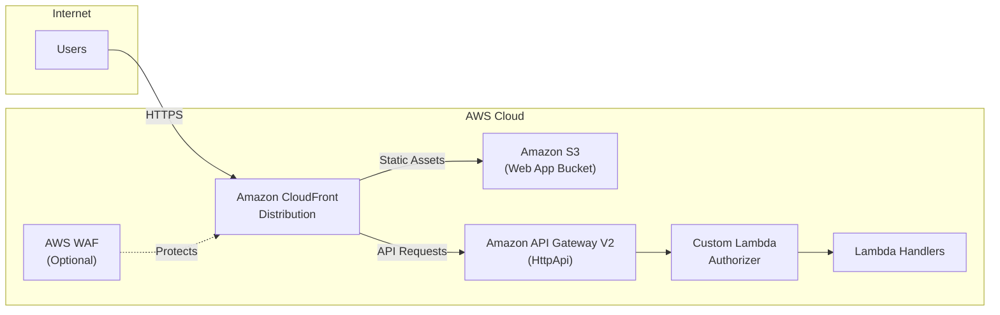
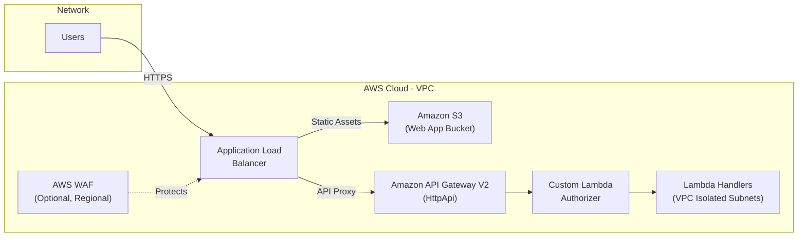
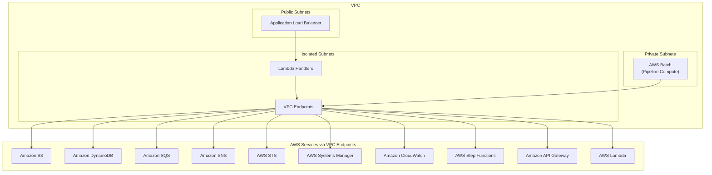

# Network Architecture

VAMS supports multiple network deployment configurations to accommodate commercial AWS, AWS GovCloud, and the AWS European Sovereign Cloud. This page describes the network topology for each deployment mode, VPC configuration options, VPC endpoints, and subnet architecture.

## Deployment Modes

### Amazon CloudFront Deployment (Commercial AWS)

The default deployment mode uses Amazon CloudFront as the global content delivery network for both the web application and API requests.

```mermaid
graph LR
    subgraph Internet
        USER["Users"]
    end

    subgraph AWS Cloud
        CF["Amazon CloudFront<br/>Distribution"]
        WAF["AWS WAF<br/>(Optional)"]
        S3W["Amazon S3<br/>(Web App Bucket)"]
        APIGW["Amazon API Gateway V2<br/>(HttpApi)"]
        AUTH["Custom Lambda<br/>Authorizer"]
        HANDLERS["Lambda Handlers"]
    end

    USER -->|HTTPS| CF
    WAF -.->|Protects| CF
    CF -->|Static Assets| S3W
    CF -->|API Requests| APIGW
    APIGW --> AUTH
    AUTH --> HANDLERS
```

In this mode:

-   Amazon CloudFront serves the React web application from an Amazon S3 origin bucket
-   API requests are proxied through Amazon CloudFront to Amazon API Gateway V2
-   An optional AWS WAF Web ACL (deployed in `us-east-1`) protects the distribution
-   Custom domain names are supported via `useCloudFront.customDomain` configuration with an AWS Certificate Manager certificate and optional Amazon Route 53 hosted zone

### Application Load Balancer Deployment (GovCloud / ALB Mode)

For AWS GovCloud or environments requiring an Application Load Balancer, VAMS deploys an ALB as the entry point.

```mermaid
graph LR
    subgraph Network
        USER["Users"]
    end

    subgraph AWS Cloud - VPC
        ALB["Application Load<br/>Balancer"]
        WAF["AWS WAF<br/>(Optional, Regional)"]
        S3W["Amazon S3<br/>(Web App Bucket)"]
        APIGW["Amazon API Gateway V2<br/>(HttpApi)"]
        AUTH["Custom Lambda<br/>Authorizer"]
        HANDLERS["Lambda Handlers<br/>(VPC Isolated Subnets)"]
    end

    USER -->|HTTPS| ALB
    WAF -.->|Protects| ALB
    ALB -->|Static Assets| S3W
    ALB -->|API Proxy| APIGW
    APIGW --> AUTH
    AUTH --> HANDLERS
```

In this mode:

-   An Application Load Balancer serves the web application and proxies API requests
-   The ALB requires a domain host name and an AWS Certificate Manager certificate ARN
-   The ALB can be deployed in public or private subnets (`useAlb.usePublicSubnet`)
-   An optional AWS WAF Web ACL (regional) protects the ALB
-   VPC is required (`useGlobalVpc.enabled = true`)
-   A dedicated Amazon S3 interface VPC endpoint forwards static web file requests from the ALB to the Amazon S3 web-app bucket (see [ALB Amazon S3 interface endpoint](#vpc-endpoints))

### VPC-Isolated Deployment (GovCloud)

For restricted environments, GovCloud and AWS European Sovereign Cloud deployments can use full VPC isolation with all AWS service access routed through VPC endpoints and no internet egress. This full-isolation topology applies when `useGlobalVpc.useForAllLambdas` is `true`, which places every VAMS Lambda function inside the VPC. The GovCloud and European Sovereign Cloud templates set `useForAllLambdas` to `false` by default — only the Lambda functions that require the VPC run inside it — and you set it to `true` when stricter network isolation is needed or the Lambda functions must reach specific VPC network components.

```mermaid
graph TD
    subgraph VPC
        subgraph Public Subnets
            ALB["Application Load Balancer"]
        end
        subgraph Isolated Subnets
            HANDLERS["Lambda Handlers"]
            VPCE["VPC Endpoints"]
        end
        subgraph Private Subnets
            BATCH["AWS Batch<br/>(Pipeline Compute)"]
        end
    end

    subgraph AWS Services via VPC Endpoints
        S3["Amazon S3"]
        DDB["Amazon DynamoDB"]
        SQS["Amazon SQS"]
        SNS["Amazon SNS"]
        STS["AWS STS"]
        SSM["AWS Systems Manager"]
        CW["Amazon CloudWatch"]
        SFN["AWS Step Functions"]
        APIGW["Amazon API Gateway"]
        LAMBDA["AWS Lambda"]
    end

    ALB --> HANDLERS
    HANDLERS --> VPCE
    VPCE --> S3
    VPCE --> DDB
    VPCE --> SQS
    VPCE --> SNS
    VPCE --> STS
    VPCE --> SSM
    VPCE --> CW
    VPCE --> SFN
    VPCE --> APIGW
    VPCE --> LAMBDA
    BATCH --> VPCE
```

## VPC Configuration Options

VAMS supports three VPC modes:

| Mode                    | Configuration                                             | Description                                               |
| ----------------------- | --------------------------------------------------------- | --------------------------------------------------------- |
| **No VPC**              | `useGlobalVpc.enabled = false`                            | Default for commercial. Lambda functions run outside VPC. |
| **VAMS-Managed VPC**    | `useGlobalVpc.enabled = true`, no `optionalExternalVpcId` | VAMS creates a new VPC with configured CIDR range.        |
| **External VPC Import** | `useGlobalVpc.enabled = true` + `optionalExternalVpcId`   | VAMS imports an existing VPC and specified subnets.       |

### VAMS-Managed VPC Configuration

When VAMS creates its own VPC, the following subnet types are provisioned:

| Subnet Type                         | CIDR Mask            | Purpose                                       | Always Created |
| ----------------------------------- | -------------------- | --------------------------------------------- | -------------- |
| **Isolated** (`PRIVATE_ISOLATED`)   | /23 (510 usable IPs) | Lambda functions, VPC endpoints               | Yes            |
| **Private** (`PRIVATE_WITH_EGRESS`) | /26 (62 usable IPs)  | Pipeline compute (AWS Batch with NAT Gateway) | Conditional    |
| **Public**                          | /26 (62 usable IPs)  | ALB, pipeline compute requiring internet      | Conditional    |

Private and public subnets are created when any of the following are enabled:

-   ALB with public subnet (`useAlb.usePublicSubnet`)
-   RapidPipeline ECS or EKS
-   ModelOps pipeline
-   Splat Toolbox pipeline
-   Isaac Lab Training pipeline
-   NVIDIA Cosmos pipeline (Predict, Reason, or Transfer)
-   NVIDIA Gr00t pipeline

### Availability Zone Configuration

VAMS provisions a fixed number of Availability Zones for every subnet type it creates. The isolated subnets are always created across this AZ count, and the conditional private and public subnets (when created) use the same count. Keeping the AZ count stable across feature toggles avoids subnet add/remove churn between deployments.

| Condition                               | AZ Count                                    |
| --------------------------------------- | ------------------------------------------- |
| Amazon OpenSearch Service (Provisioned) | `availabilityZoneCount` (2 or 3, default 2) |
| All other configurations (baseline)     | 2 AZs                                       |

When Amazon OpenSearch Service (Provisioned) is enabled, the AZ count follows `openSearch.useProvisioned.availabilityZoneCount` (`2` or `3`, default `2`), with one data node per zone. At `2` the domain runs zone-aware **without** Standby (two data nodes, single index copy). At `3` the domain runs as **Multi-AZ with Standby** (three data nodes, and the asset/file indexes are created with two replicas so each has three copies, which Standby requires). Set it to `2` for Regions or partitions that expose only two Availability Zones, such as the AWS European Sovereign Cloud Region `eusc-de-east-1`; the configuration validation rejects an `availabilityZoneCount` greater than `2` for that Region.

:::warning[Enabling Standby on an existing domain]
Multi-AZ with Standby requires every index to have copies in a multiple of three. VAMS creates the indexes with the correct replica count for the chosen Availability Zone count, but a **3-AZ Standby domain must be created fresh** — switching an existing 2-AZ (single-copy) domain to `availabilityZoneCount: 3` in place is rejected by Amazon OpenSearch Service, because the domain configuration is validated against the existing indexes before their replica count can change. To move an existing domain to 3-AZ Standby, deploy with OpenSearch disabled to remove the domain, then re-enable it with `availabilityZoneCount: 3` to create a fresh domain, and run the reindex tool to repopulate it.
:::

The number of primary shards per index is set by `openSearch.useProvisioned.numberOfShards` (default `1`). As a sizing guideline, an index expected to exceed roughly 60 GB — about 3 million asset or file records for VAMS — should use more than one shard. Like the replica count, the shard count is fixed at index creation: changing it requires re-creating the index (disable and re-enable OpenSearch, then reindex); existing indexes are not re-sharded in place.

### External VPC Import

When importing an existing VPC, subnet IDs must be provided for each subnet type:

| Configuration                       | Description                         |
| ----------------------------------- | ----------------------------------- |
| `optionalExternalVpcId`             | VPC ID to import                    |
| `optionalExternalIsolatedSubnetIds` | Comma-separated isolated subnet IDs |
| `optionalExternalPrivateSubnetIds`  | Comma-separated private subnet IDs  |
| `optionalExternalPublicSubnetIds`   | Comma-separated public subnet IDs   |

:::warning[Context Loading]
When importing a VPC, you may need to run an initial `cdk synth` with `loadContextIgnoreVPCStacks = true` to populate the CDK context with VPC metadata before the full deployment.
:::

## VPC Endpoints

When `useGlobalVpc.addVpcEndpoints = true`, VAMS creates VPC endpoints to enable AWS service access from isolated subnets without internet connectivity.

### Gateway Endpoints (No Cost)

These gateway endpoints are always created when VPC endpoints are enabled:

| Endpoint        | Service                                 | Subnets  |
| --------------- | --------------------------------------- | -------- |
| Amazon S3       | `GatewayVpcEndpointAwsService.S3`       | Isolated |
| Amazon DynamoDB | `GatewayVpcEndpointAwsService.DYNAMODB` | Isolated |

### Common Interface Endpoints

These interface endpoints are always created when VPC endpoints are enabled:

| Endpoint                  | Service           | Purpose                      |
| ------------------------- | ----------------- | ---------------------------- |
| Amazon API Gateway        | `APIGATEWAY`      | API Gateway invocations      |
| AWS Systems Manager (SSM) | `SSM`             | Parameter Store access       |
| AWS Lambda                | `LAMBDA`          | Lambda-to-Lambda invocations |
| AWS STS                   | `STS`             | Credential federation        |
| Amazon CloudWatch Logs    | `CLOUDWATCH_LOGS` | Log delivery                 |
| AWS Step Functions        | `STEP_FUNCTIONS`  | Workflow execution           |
| Amazon SNS                | `SNS`             | Event notifications          |
| Amazon SQS                | `SQS`             | Queue operations             |

### Conditional Interface Endpoints

These non-pipeline endpoints are created based on the deployment configuration:

| Endpoint            | Condition                                      | Purpose                           |
| ------------------- | ---------------------------------------------- | --------------------------------- |
| AWS KMS             | `useKmsCmkEncryption.enabled`                  | KMS key operations                |
| AWS KMS (FIPS)      | `useKmsCmkEncryption.enabled` + `useFips`      | FIPS-compliant KMS                |
| Amazon S3 (ALB web) | ALB mode + `useAlb.addAlbS3SpecialVpcEndpoint` | ALB-to-S3 static web file serving |

:::info[ALB Amazon S3 interface endpoint]
In Application Load Balancer deployment mode, VAMS creates a dedicated Amazon S3 **interface** VPC endpoint (separate from the S3 **gateway** endpoint above) so the ALB can forward requests for the React web application to the Amazon S3 web-app bucket. This endpoint is created by the static web construct (not the VPC builder) and differs from the common interface endpoints in several ways:

-   It is gated by `useAlb.addAlbS3SpecialVpcEndpoint` (default `true`) and is created **independently of** `useGlobalVpc.addVpcEndpoints` — it exists whenever ALB mode is used, because the ALB listener/target group depends on it. Set `addAlbS3SpecialVpcEndpoint` to `false` only when the endpoint already exists in your VPC (for example, when it must be created manually outside the stack).
-   It is created with `privateDnsEnabled: false` and placed in the ALB (web app) subnets rather than the isolated subnets.
-   Its endpoint policy restricts access to the specific web-app Amazon S3 bucket (`s3:Get*`, `s3:List*`), and a Lambda-backed custom resource registers the endpoint's network interface IPs as ALB targets.
    :::

### Pipeline Interface Endpoints

VPC-requiring pipelines (AWS Batch Fargate and GPU pipelines) create their own interface endpoints — a shared set of **AWS Batch**, **Amazon ECR API**, and **Amazon ECR Docker** whenever any AWS Batch pipeline is enabled, plus additional per-pipeline endpoints (Amazon ECS, Amazon ECS Agent, Amazon ECS Telemetry, Amazon EFS, Amazon Bedrock Runtime, Amazon Rekognition) depending on which pipelines are enabled.

The authoritative per-pipeline endpoint matrix lives with the pipeline documentation. See [Pipeline System Overview — VPC and Network Requirements](../pipelines/overview.md#vpc-and-network-requirements) for the full chart of which interface endpoints each pipeline requires.

## Security Groups

### VPC Endpoint Security Group

A single security group is created for all VPC endpoints with the following rules:

| Direction | Protocol | Port | Source    | Purpose                   |
| --------- | -------- | ---- | --------- | ------------------------- |
| Ingress   | TCP      | 443  | VPC CIDR  | HTTPS access to endpoints |
| Ingress   | TCP      | 53   | VPC CIDR  | DNS resolution for ECR    |
| Ingress   | UDP      | 53   | VPC CIDR  | DNS resolution for ECR    |
| Egress    | All      | All  | 0.0.0.0/0 | Allow all outbound        |

### Pipeline Security Groups

Each pipeline construct creates its own security group with VPC CIDR-based ingress rules for communication between AWS Batch compute environments and VPC endpoints.

## VPC Flow Logs

When VAMS creates a managed VPC, VPC flow logs are automatically enabled:

| Setting      | Value                                          |
| ------------ | ---------------------------------------------- |
| Destination  | Amazon CloudWatch Logs                         |
| Traffic Type | ALL                                            |
| Log Group    | `/aws/vendedlogs/VAMSCloudWatchVPCLogs-{hash}` |
| Retention    | 10 years                                       |

## DNS Configuration

All interface VPC endpoints are created with `privateDnsEnabled: true`. This allows Lambda functions and containers within the VPC to use standard AWS service hostnames (e.g., `dynamodb.us-east-1.amazonaws.com`) without custom DNS configuration. The VPC endpoint private DNS automatically resolves these hostnames to the endpoint's private IP addresses.

VAMS VPCs are created with:

-   `enableDnsHostnames: true`
-   `enableDnsSupport: true`

## FIPS Endpoint Usage

When `useFips = true`, the partition-aware service helper (`service-helper.ts`) automatically resolves FIPS-compliant hostnames for all AWS service calls. This is achieved through the `SERVICE_LOOKUP` table in `const.ts`, which maps each service to its standard and FIPS hostname per partition.

For example:

| Service         | Standard Hostname                 | FIPS Hostname                          |
| --------------- | --------------------------------- | -------------------------------------- |
| Amazon S3       | `s3.{region}.amazonaws.com`       | `s3-fips.{region}.amazonaws.com`       |
| Amazon DynamoDB | `dynamodb.{region}.amazonaws.com` | `dynamodb-fips.{region}.amazonaws.com` |
| AWS STS         | `sts.{region}.amazonaws.com`      | `sts-fips.{region}.amazonaws.com`      |

:::note[GovCloud FIPS]
In AWS GovCloud, all endpoints are inherently FIPS-compliant. The API Gateway endpoint URL always uses the non-FIPS variant regardless of the `useFips` setting, as documented by AWS.
:::

## Next Steps

-   [Security Architecture](security.md) -- Encryption, authorization, and compliance
-   [AWS Resources](aws-resources.md) -- Complete resource inventory
-   [Architecture Overview](overview.md) -- High-level system design
