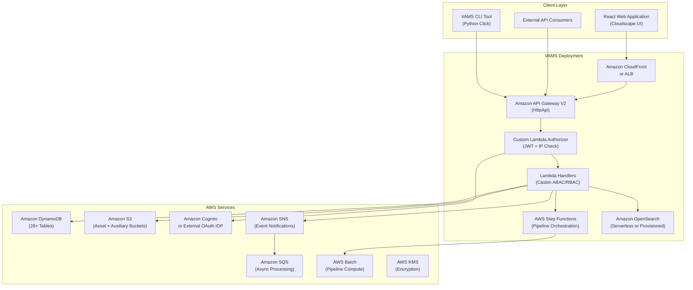
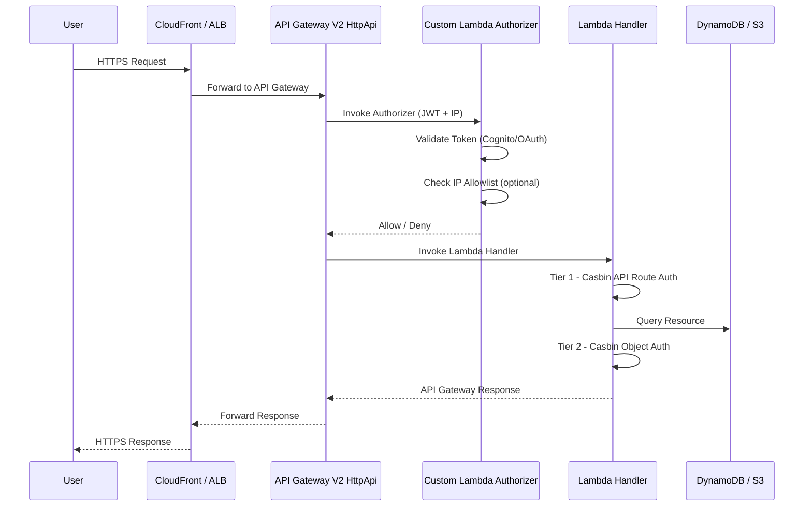
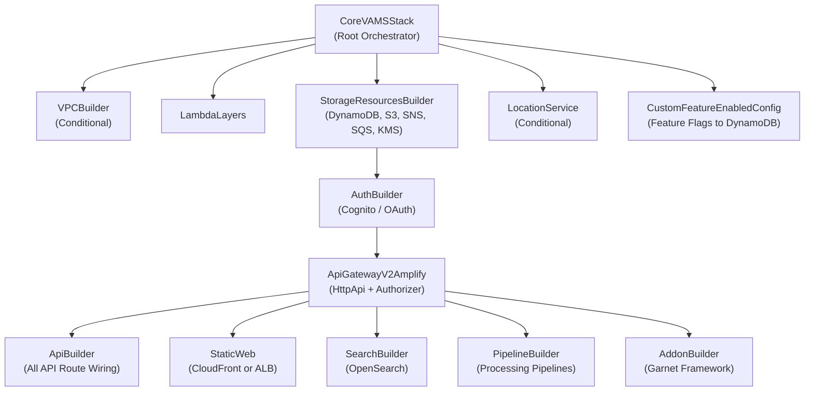

# Architecture Overview

VAMS (Visual Asset Management System) is a serverless, event-driven application built on AWS that provides comprehensive management, visualization, and processing capabilities for 3D assets, point clouds, CAD files, and other visual content. This page describes the high-level architecture, key design principles, and supported deployment modes.

## High-Level Architecture

VAMS is organized into three distinct layers that separate concerns across the client interface, application deployment, and underlying AWS services.

## Request Flow

Every authenticated request to VAMS follows a consistent path through the system, with two tiers of authorization enforced at each step.

:::info[Two-Tier Authorization]
Every request is authorized at two levels. **Tier 1** checks whether the user's role grants access to the API route itself. **Tier 2** checks whether the user has permission to access the specific data entity being requested. Both tiers must allow for the request to succeed. This defense-in-depth model is enforced by the Casbin policy engine in every Lambda handler.
:::

## Key Architectural Principles

### Serverless-First Design

All compute in VAMS runs on serverless services. AWS Lambda handles API request processing and event-driven logic. AWS Step Functions orchestrates multi-step pipeline workflows. AWS Batch with Fargate manages container-based processing tasks. This eliminates server management overhead and provides automatic scaling.

### Event-Driven Data Flow

VAMS uses event-driven patterns throughout the system. Amazon S3 event notifications trigger file indexing and workflow auto-execution. Amazon DynamoDB Streams drive search index updates through Amazon SNS and Amazon SQS queues. This decoupled architecture ensures that data changes propagate reliably without tight coupling between components.

### Defense-in-Depth Security

Security is enforced at every layer. The custom Lambda authorizer validates JWT tokens and optionally checks IP allowlists. The Casbin policy engine provides fine-grained ABAC/RBAC authorization within every handler. All data at rest is encrypted using AWS KMS or Amazon S3 managed keys. All data in transit requires TLS. For details, see the [Security Architecture](security.md) page.

### Multi-Partition Support

VAMS is designed to run on commercial AWS and AWS GovCloud partitions. A partition-aware service helper generates correct ARNs, endpoints, and service principals for any target partition. No AWS partition strings, service endpoints, or regional URLs are hardcoded anywhere in the codebase.

### Configuration-Driven Deployment

A centralized configuration system (`config.json`) controls which features, pipelines, and deployment options are enabled. Feature switches stored in Amazon DynamoDB propagate to the frontend at runtime, enabling conditional UI rendering without redeployment. See [Detailed Architecture](details.md) for the full configuration flow.

## Deployment Modes

VAMS supports two deployment modes to accommodate different compliance and network isolation requirements.

| Deployment Mode | Web Distribution | API Access | VPC | Notes |
|---|---|---|---|---|
| **Commercial AWS** | Amazon CloudFront + Amazon S3 | Amazon API Gateway V2 | Optional | Default mode. Supports optional Amazon Location Service. |
| **AWS GovCloud (US)** | Application Load Balancer + Amazon S3 | Amazon API Gateway V2 | Required | No Amazon CloudFront. FIPS endpoints. No Amazon Location Service. Supports full VPC isolation for restricted environments. |

:::note[GovCloud Requirements]
When deploying to AWS GovCloud, the VPC must be enabled, Amazon CloudFront must be disabled, and Amazon Location Service must be disabled.
:::

## Architecture Diagram

The following diagram provides a visual overview of the VAMS architecture across both commercial and GovCloud deployments.

## CDK Stack Organization

VAMS deploys as a set of nested AWS CloudFormation stacks managed by the AWS CDK. The root stack (`CoreVAMSStack`) orchestrates all nested stacks with explicit dependency ordering.

:::tip[Stack Dependencies]
All nested stacks that consume `storageResources` declare an explicit dependency on the `StorageResourcesBuilder` stack using `addDependency()`. This ensures correct deployment ordering regardless of how AWS CloudFormation resolves implicit references.
:::

## Next Steps

- [Detailed Architecture](details.md) -- Authentication flow, data indexing, pipeline execution, and configuration flow
- [AWS Resources](aws-resources.md) -- Complete inventory of deployed AWS resources
- [Security Architecture](security.md) -- Encryption, authorization, CSP, and compliance
- [Network Architecture](networking.md) -- VPC configuration, endpoints, and deployment modes
- [Data Model](data-model.md) -- DynamoDB schemas, S3 organization, and OpenSearch indexes
