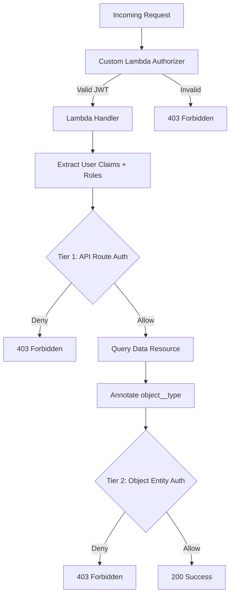

# Security Architecture


VAMS implements a defense-in-depth security architecture with multiple layers of protection for authentication, authorization, encryption, network isolation, and audit logging. This page describes each security control and how they work together.

## Shared Responsibility

VAMS operates within the AWS shared responsibility model. AWS manages the security of the underlying cloud infrastructure, while VAMS implements security controls at the application layer. Customers are responsible for configuring deployment options (encryption, VPC, IP restrictions) according to their compliance requirements.

## Authentication

VAMS supports three authentication mechanisms, all validated by a custom Lambda authorizer attached to the Amazon API Gateway V2 HttpApi.

### Amazon Cognito

The default authentication provider. VAMS deploys an Amazon Cognito User Pool with configurable password policies, an app client for the web application, and an identity pool for federated identity.

| Configuration | Description |
|---|---|
| `authProvider.useCognito.enabled` | Enable Amazon Cognito as the auth provider |
| `authProvider.useCognito.useSaml` | Enable SAML federation for enterprise SSO |
| `authProvider.useCognito.useUserPasswordAuthFlow` | Enable username/password authentication flow |

#### SAML Federation

SAML authentication enables federated access to VAMS through your organization's identity provider (such as Auth0, Active Directory, or Google Workspace). When enabled, Amazon Cognito acts as a SAML service provider.

**Configuration steps:**

1. Set `authProvider.useCognito.useSaml` to `true` in `infra/config/config.json`.
2. Edit `infra/config/saml-config.ts` with the following required fields:

| Field | Description |
|---|---|
| `name` | Identifies the SAML identity provider in the Amazon Cognito User Pool and in the web UI |
| `cognitoDomainPrefix` | DNS-compatible, globally unique string used as a subdomain of the Amazon Cognito sign-on URL (for example, `https://\{prefix\}.auth.\{region\}.amazoncognito.com/saml2/idpresponse`) |
| `metadataContent` | URL of your SAML metadata. Can also point to a local file if `metadataType` is changed to `cognito.UserPoolIdentityProviderSamlMetadataType.FILE` |
| `attributeMapping` | Maps SAML attributes back to VAMS (email, fullname) |

3. Deploy or redeploy the CDK stack with `cdk deploy --all`.

**After deployment**, provide these stack outputs to your identity provider to establish trust:

- **SAML IdP Response URL** -- the Amazon Cognito SAML endpoint
- **SP URN / Audience URI / SP entity ID** -- the service provider identifier
- **CloudFront Distribution URL** (or ALB URL) -- for the callback URL list (include both with and without a trailing slash)

:::tip[SAML Attribute Mapping]
The default attribute mapping uses standard SAML claim URIs. Review `infra/config/saml-config.ts` to customize the mapping for your identity provider's claim format.
:::

### External OAuth Identity Provider

When Amazon Cognito is not available, VAMS supports external OAuth identity providers. The custom Lambda authorizer validates JWT tokens against the configured JWKS endpoint.

| Configuration | Description |
|---|---|
| `authProvider.useExternalOAuthIdp.enabled` | Enable external OAuth IDP |
| `authProvider.useExternalOAuthIdp.idpAuthProviderUrl` | OAuth provider URL |

### API Keys

VAMS supports API key authentication for machine-to-machine access. API keys are stored as SHA-256 hashes in the `ApiKeyStorageTable`. The custom authorizer validates incoming API keys by hashing them and comparing against stored hashes.

## Custom Lambda Authorizer

VAMS uses a custom Lambda authorizer for all Amazon API Gateway endpoints, providing unified authentication across Amazon Cognito, external OAuth, and API key mechanisms.

### Authorizer Capabilities

- **Unified Authentication**: Supports Amazon Cognito, external OAuth, and API key JWT token verification in a single authorizer
- **Hybrid JWT Libraries**: Uses `joserfc` for Amazon Cognito (RFC-compliant JOSE) and `PyJWT` for external identity providers
- **IP Range Restrictions**: Optional IP-based access control with configurable IP range pairs (validated before JWT verification for performance)
- **Payload Format Version 2.0**: Simple boolean responses (`isAuthorized: true/false`)
- **Comprehensive JWT Claims Context**: All JWT claims are passed to downstream Lambda functions
- **Public Key Caching**: One-hour TTL for JWKS public keys to reduce external API calls
- **Dedicated Lambda Layer**: Isolated dependencies for security and performance

### Authorizer Configuration

The authorizer behavior is controlled through `authProvider.authorizerOptions` in the deployment configuration and the `CUSTOM_AUTHORIZER_IGNORED_PATHS` constant in `infra/config/config.ts`.

**Default API routes:**

| Setting | Value |
|---|---|
| Identity source | `$request.header.Authorization` |
| Cache TTL | 30 seconds |
| Response type | `SIMPLE` (payload format version 2.0) |

**Ignored paths** (`/api/amplify-config`, `/api/version`):

| Setting | Value |
|---|---|
| Identity source | `$context.routeKey` |
| Cache TTL | 3600 seconds (1 hour) |
| Behavior | Bypasses JWT verification, allows immediate access |

### Authorizer Lambda Layer

The authorizer uses a dedicated Lambda layer with the following dependencies:

```
joserfc==1.6.1             # RFC-compliant JOSE (JWT/JWS/JWE) for Cognito
PyJWT[crypto]==2.10.1      # External IDP JWT verification
cryptography==45.0.6       # Cryptographic primitives
requests==2.32.5           # HTTP requests for JWKS retrieval
aws-lambda-powertools==3.19.0  # Lambda Powertools for logging
```

### JWT Claims Context Integration

The authorizer passes all JWT claims to downstream Lambda functions through the Amazon API Gateway context. Backend handlers access claims using the following precedence:

```python
# Standard API Gateway authorizer format
if 'jwt' in event['requestContext']['authorizer']:
    claims = event['requestContext']['authorizer']['jwt']['claims']
# Custom Lambda authorizer format
elif 'lambda' in event['requestContext']['authorizer']:
    claims = event['requestContext']['authorizer']['lambda']
# Lambda cross-call format
elif 'lambdaCrossCall' in event:
    claims = event['lambdaCrossCall']
```

**Supported claims:**

| Source | Claims |
|---|---|
| Amazon Cognito | `sub`, `cognito:username`, `email`, `token_use`, `aud`, `iss`, `exp` |
| External OAuth IDP | `sub`, `preferred_username`, `email`, `upn`, `username` |
| VAMS custom | `vams:tokens`, `vams:roles`, `vams:externalAttributes` |

:::note[GovCloud Token Limitation]
AWS GovCloud deployments with the GovCloud configuration enabled only support v1 of the Amazon Cognito Lambda triggers. This means only Access tokens (not ID tokens) can be used for VAMS API authentication in GovCloud.
:::

### JWT Token Requirements

All VAMS API calls require a valid JWT token with the following claims structure:

```json
{
    "claims": {
        "tokens": ["<username>"],
        "roles": ["<role1>", "<role2>"],
        "externalAttributes": []
    }
}
```

The `tokens` array must include the authenticated VAMS username. The `roles` and `externalAttributes` fields are optional as they are resolved at runtime from the VAMS authorization database.

### Authorizer Customization

Organizations can customize the authorizer behavior by modifying:

1. **IP Validation Logic**: Modify `is_ip_authorized()` for custom IP validation
2. **Path Handling**: Update ignored paths in the `CUSTOM_AUTHORIZER_IGNORED_PATHS` constant in `infra/config/config.ts`
3. **JWT Verification**: Modify `verify_cognito_jwt()` (using joserfc) or `verify_external_jwt()` (using PyJWT)
4. **Claims Processing**: Extend context generation to include additional custom claims

### Implementation Files

| Component | Path |
|---|---|
| HTTP Authorizer | `backend/backend/handlers/auth/apiGatewayAuthorizerHttp.py` |
| WebSocket Authorizer | `backend/backend/handlers/auth/apiGatewayAuthorizerWebsocket.py` |
| CDK Lambda Builders | `infra/lib/lambdaBuilder/authFunctions.ts` |
| Dedicated Lambda Layer | `backend/lambdaLayers/authorizer/` |
| Configuration Constants | `infra/config/config.ts` |

## Authorization

### Two-Tier Casbin ABAC/RBAC

VAMS uses the Casbin policy engine to enforce fine-grained attribute-based access control (ABAC) combined with role-based access control (RBAC).



**Tier 1 -- API Route Authorization** controls which API endpoints a user's role can access. Policies use `api` and `web` object types to gate route-level access.

**Tier 2 -- Object Entity Authorization** controls which specific data entities a user can access. Policies use entity-type constraints (`database`, `asset`, `pipeline`, `workflow`, `tag`, `tagType`, `role`, `userRole`, `metadataSchema`, `apiKey`) with attribute-based rules.

### Constraint Fields

The following fields can be used in ABAC policy rules:

| Field | Description |
|---|---|
| `databaseId` | Database identifier |
| `assetName` | Asset name |
| `assetType` | Asset type classification |
| `tags` | Asset tags |
| `tagName` | Tag name |
| `tagTypeName` | Tag type name |
| `roleName` | Role name |
| `userId` | User identifier |
| `pipelineId` | Pipeline identifier |
| `pipelineType` | Pipeline type |
| `pipelineExecutionType` | Pipeline execution type (Lambda, SQS, EventBridge) |
| `workflowId` | Workflow identifier |
| `metadataSchemaName` | Metadata schema name |
| `metadataSchemaEntityType` | Metadata entity type |
| `object__type` | Entity type for Tier 2 enforcement |
| `route__path` | API route path for Tier 1 enforcement |

### MFA-Aware Roles

Roles can require MFA verification. When a role has `mfaRequired=True`, it is only active when the user's authentication claims include `mfaEnabled=True`. This provides an additional security layer for privileged operations.

### Policy Caching

The Casbin enforcer caches user policies with a 60-second TTL per user. This reduces Amazon DynamoDB reads while ensuring policy changes propagate within one minute.

## Encryption

### Encryption at Rest

All VAMS storage resources support encryption at rest:

| Resource | Default Encryption | KMS CMK Encryption |
|---|---|---|
| Amazon DynamoDB tables | AWS managed keys | Customer-managed KMS key |
| Amazon S3 buckets | Amazon S3 managed keys (SSE-S3) | Customer-managed KMS key (SSE-KMS) |
| Amazon SNS topics | N/A | Customer-managed KMS key |
| Amazon SQS queues | SQS managed encryption | Customer-managed KMS key |
| Amazon CloudWatch Logs | N/A | Customer-managed KMS key |
| Amazon OpenSearch | Service-managed | Customer-managed KMS key |

:::tip[Enabling KMS CMK Encryption]
Set `useKmsCmkEncryption.enabled = true` in the deployment configuration. An external key can be imported via `useKmsCmkEncryption.optionalExternalCmkArn`. If no external key is provided, VAMS creates a new AWS KMS key with automatic key rotation enabled.
:::


### KMS Key Policy

The VAMS KMS key policy grants cryptographic operations to the following service principals:

- Amazon S3
- Amazon DynamoDB
- Amazon SQS
- Amazon SNS
- Amazon ECS and Amazon ECS Tasks
- Amazon EKS
- Amazon CloudWatch Logs
- AWS Lambda
- AWS STS
- AWS CloudFormation
- Account root principal (for custom resource Lambda roles)
- Amazon CloudFront (conditional)
- Amazon OpenSearch Service / Amazon OpenSearch Serverless (conditional)

### Encryption in Transit

All data in transit is encrypted using TLS:

- **Amazon S3 bucket policies** enforce TLS by denying all `s3:*` actions when `aws:SecureTransport=false`
- **Amazon SNS topics** enforce SSL with the `enforceSSL` property
- **Amazon SQS queues** enforce SSL with the `enforceSSL` property
- **Amazon API Gateway** uses HTTPS endpoints exclusively
- **Amazon CloudFront / Application Load Balancer** terminates TLS at the edge

The following bucket policy statement is applied to every Amazon S3 bucket in VAMS:

```json
{
    "Effect": "Deny",
    "Principal": "*",
    "Action": "s3:*",
    "Resource": ["arn:{partition}:s3:::bucket-name/*", "arn:{partition}:s3:::bucket-name"],
    "Condition": {
        "Bool": { "aws:SecureTransport": "false" }
    }
}
```

## Content Security Policy (CSP)

VAMS generates a dynamic Content Security Policy for the web application based on the deployment configuration. The CSP is constructed at AWS CDK synthesis time and applied to the web distribution.

### Base CSP Directives

| Directive | Sources |
|---|---|
| `base-uri` | `'none'` |
| `default-src` | `'none'` |
| `script-src` | `'self'`, `'unsafe-hashes'`, SHA-256 hashes for inline scripts |
| `style-src` | `'self'`, `'unsafe-inline'` |
| `connect-src` | `'self'`, `blob:`, `data:`, API Gateway URL, Amazon S3 endpoint |
| `worker-src` | `'self'`, `blob:`, `data:` |
| `img-src` | `'self'`, `blob:`, `data:`, Amazon S3 endpoint |
| `media-src` | `'self'`, `blob:`, `data:`, Amazon S3 endpoint |
| `object-src` | `'none'` |
| `frame-ancestors` | `'none'` |
| `font-src` | `'self'` |
| `manifest-src` | `'self'` |

### Conditional CSP Sources

| Condition | Added Sources |
|---|---|
| Amazon Cognito enabled | Cognito IDP and Identity endpoints in `connect-src` |
| SAML enabled | Cognito auth domain in `connect-src` |
| External OAuth IDP | IDP auth provider URL in `connect-src` |
| `allowUnsafeEvalFeatures = true` | `'unsafe-eval'` in `script-src` (required for certain 3D viewer plugins) |
| Amazon Location Service enabled | Maps endpoint in `connect-src` |

### Extensible CSP

Additional CSP sources can be configured via `infra/config/csp/cspAdditionalConfig.json`. This JSON file supports adding entries to `connectSrc`, `scriptSrc`, `workerSrc`, `imgSrc`, `mediaSrc`, `fontSrc`, and `styleSrc` arrays.

## IP Range Restrictions

The custom Lambda authorizer supports optional IP-based access control. When `authProvider.authorizerOptions.allowedIpRanges` is configured with one or more CIDR ranges, the authorizer validates the source IP of each request against the allowlist before proceeding with JWT validation.

## IAM Least Privilege

Each Lambda function receives an individually scoped IAM execution role:

- **Amazon DynamoDB permissions** are granted per-table using `grantReadData()` or `grantReadWriteData()`
- **Amazon S3 permissions** are granted per-bucket using `grantRead()` or `grantReadWrite()`
- **AWS KMS permissions** are granted only when CMK encryption is enabled
- **Amazon CloudWatch Logs** permissions cover only the specific audit log groups

:::warning[No Wildcard Resource ARNs]
Lambda execution roles do not receive `Resource: "*"` for data operations. All permissions are scoped to specific table ARNs, bucket ARNs, or log group ARNs.
:::


### IAM Aspects

VAMS applies two AWS CDK aspects to all IAM roles in the stack:

| Aspect | Purpose |
|---|---|
| **IamRoleTransform** | Applies role name prefixes and permission boundaries from `cdk.json` settings |
| **LogRetentionAspect** | Forces one-year retention on all Amazon CloudWatch Log Groups |

## CDK Nag Enforcement

All VAMS stacks are checked against the AWS Solutions security rules (`AwsSolutionsChecks`) provided by the `cdk-nag` library. CDK Nag is always enabled and runs during AWS CDK synthesis.

### Suppression Requirements

Every CDK Nag suppression must include a detailed justification explaining why the suppression is acceptable in the VAMS deployment context. Unjustified suppressions are not permitted.

### Common Suppressed Rules

| Rule ID | Reason |
|---|---|
| `AwsSolutions-IAM5` | Amazon S3 `grantReadWrite` generates wildcard actions; scoped to VAMS buckets |
| `AwsSolutions-IAM4` | Managed policies (`AWSLambdaBasicExecutionRole`, `AWSLambdaVPCAccessExecutionRole`) used for Lambda |
| `AwsSolutions-L1` | Lambda runtimes are explicitly managed (Python 3.12, Node.js 20.x) |
| `AwsSolutions-COG3` | Amazon Cognito AdvancedSecurityMode not available in AWS GovCloud |
| `AwsSolutions-S1` | Access logs bucket cannot log to itself |
| `AwsSolutions-SQS3` | Dead-letter queues not used for bucket sync queues (files easily re-driven) |

## VPC Isolation

When `useGlobalVpc.enabled = true`, all Lambda functions can be deployed into VPC isolated subnets with no direct internet access. VPC endpoints provide connectivity to AWS services. See the [Network Architecture](networking.md) page for full details.

## FIPS Endpoints

When `useFips = true` (typically in AWS GovCloud), the partition-aware service helper automatically selects FIPS-compliant endpoints for all AWS service calls. The service helper supports four AWS partitions:

| Partition | Identifier |
|---|---|
| Commercial | `aws` |
| GovCloud | `aws-us-gov` |
| China | `aws-cn` |
| Isolated | `aws-iso` |

## Blocked File Types

VAMS validates all uploaded files against blocked extension and MIME type lists to prevent malicious content:

### Blocked Extensions

`.jar`, `.java`, `.com`, `.php`, `.reg`, `.pif`, `.bak`, `.dll`, `.exe`, `.nat`, `.cmd`, `.lnk`, `.docm`, `.vbs`, `.bat`

### Blocked MIME Types

`application/java-archive`, `application/x-msdownload`, `application/x-sh`, `application/javascript`, `application/x-powershell`, `application/vbscript`, and additional potentially dangerous MIME types.

## Audit Logging

VAMS maintains nine dedicated Amazon CloudWatch Log Groups for audit logging, each with 10-year retention:

| Log Group | Events |
|---|---|
| Authentication | Login attempts, token validation results |
| Authorization | Authorization decisions (allow/deny) with policy context |
| File Upload | File upload operations with user, file, and bucket details |
| File Download | File download operations |
| File Download Streamed | Streamed file download operations |
| Auth Other | Miscellaneous authentication events |
| Auth Changes | Role, constraint, and user-role modifications |
| Actions | General CRUD operations |
| Errors | Application errors and exceptions |

:::info[Silent Failure Pattern]
Audit logging uses a silent failure pattern. If writing to an audit log fails, the error is logged locally to the Lambda's standard log group, but Lambda execution continues normally. This prevents audit logging failures from disrupting application operations.
:::


## AWS CloudTrail Integration

When `addStackCloudTrailLogs = true`, VAMS deploys an AWS CloudTrail trail that logs:

- All AWS Lambda data events
- All Amazon S3 data events
- Trail data stored in the Access Logs bucket under `cloudtrail-logs/`
- Trail data also sent to Amazon CloudWatch Logs for real-time analysis

## S3 Bucket Security

All Amazon S3 buckets in VAMS are configured with:

| Setting | Value |
|---|---|
| Block Public Access | `BLOCK_ALL` |
| Object Ownership | `OBJECT_WRITER` |
| Versioning | Enabled |
| Server Access Logging | Enabled (to Access Logs bucket) |
| TLS Enforcement | Deny policy for non-secure transport |
| Lifecycle Rules | Abort incomplete multipart uploads after 7-14 days |
| Optional KMS Encryption | SSE-KMS with bucket key enabled |

### Additional Bucket Policies

Custom bucket policies can be applied to all VAMS Amazon S3 buckets via `infra/config/policy/s3AdditionalBucketPolicyConfig.json`. The policy statement's `Resource` field is automatically updated to reference the target bucket ARN.

## GovCloud Security Constraints

When deploying to AWS GovCloud with `govCloud.enabled = true`:

| Constraint | Enforcement |
|---|---|
| VPC required | `useGlobalVpc.enabled` must be `true` |
| No Amazon CloudFront | `useCloudFront.enabled` must be `false` |
| No Amazon Location Service | `useLocationService.enabled` must be `false` |
| FIPS endpoints | Automatically selected by service helper |

When `govCloud.il6Compliant = true`:

| Constraint | Enforcement |
|---|---|
| No Amazon Cognito | `useCognito.enabled` must be `false` |
| No AWS WAF | `useWaf` must be `false` |
| AWS KMS CMK required | `useKmsCmkEncryption.enabled` must be `true` |

## Security Recommendations

The following recommendations should be reviewed with your organization's security team before deploying VAMS to production:

1. **Audit frontend dependencies** — Run `npm audit` in the `web/` directory prior to deploying the frontend to ensure all packages are up to date. Run `npm audit fix` to mitigate critical vulnerabilities.
2. **Use least-privilege IAM roles** — When deploying to an AWS account, create an AWS IAM role for deployment that limits access to the least privilege necessary based on your internal security policies.
3. **Bootstrap CDK with minimal permissions** — Run AWS CDK bootstrap with the least-privileged AWS IAM role needed to deploy CDK and VAMS environment components.
4. **Review token timeouts** — Authentication access, ID, and file presigned URL token timeouts default to 1 hour per security best practices. Adjust as necessary for your organization's requirements.
5. **Configure IP restrictions** — Consider configuring IP range restrictions using `authorizerOptions.allowedIpRanges` in the [deployment configuration](../deployment/configuration-reference.md) to limit API access to known networks.
6. **Enable KMS encryption** — For production deployments, enable customer-managed KMS encryption (`useKmsCmkEncryption.enabled: true`) for all storage resources.
7. **Use CloudFront with custom TLS** — When using Amazon CloudFront, consider configuring a custom domain with your own TLS certificate rather than the default CloudFront domain.
8. **Review Content Security Policy** — The CSP is dynamically generated based on deployment configuration. Review the generated policy headers for compliance with your organization's standards.
9. **Enable audit logging review** — Regularly review audit logs in Amazon CloudWatch for suspicious activity patterns such as repeated authorization failures or unusual file download volumes.

:::warning[Shared Responsibility]
VAMS is provided under the AWS shared responsibility model. Any customization for customer use must go through a security review to confirm that modifications do not introduce new vulnerabilities. Any team implementing VAMS takes on the responsibility of ensuring their implementation has gone through a proper security review.
:::

## Next Steps

- [Network Architecture](networking.md) -- VPC endpoints, subnet configuration, and deployment connectivity
- [AWS Resources](aws-resources.md) -- Complete resource inventory
- [Architecture Overview](overview.md) -- High-level system design
