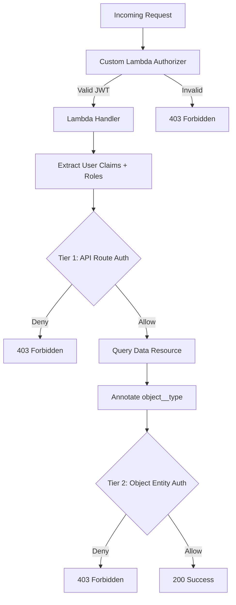

# Security Architecture


VAMS implements a defense-in-depth security architecture with multiple layers of protection for authentication, authorization, encryption, network isolation, and audit logging. This page describes each security control and how they work together.

## Shared Responsibility

VAMS operates within the AWS shared responsibility model. AWS manages the security of the underlying cloud infrastructure, while VAMS implements security controls at the application layer. Customers are responsible for configuring deployment options (encryption, VPC, IP restrictions) according to their compliance requirements.

## Authentication

VAMS supports three authentication mechanisms, all validated by a custom Lambda authorizer attached to the REST API.

### Amazon Cognito

The default authentication provider. VAMS deploys an Amazon Cognito User Pool with configurable password policies, an app client for the web application, and an identity pool for federated identity.

| Configuration                                     | Description                                  |
| ------------------------------------------------- | -------------------------------------------- |
| `authProvider.useCognito.enabled`                 | Enable Amazon Cognito as the auth provider   |
| `authProvider.useCognito.useSaml`                 | Enable SAML federation for enterprise SSO    |
| `authProvider.useCognito.useOidc`                 | Enable OIDC federation for enterprise SSO    |
| `authProvider.useCognito.useUserPasswordAuthFlow` | Enable username/password authentication flow |

#### SAML Federation

SAML authentication enables federated access to VAMS through your organization's identity provider (such as Auth0, Active Directory, or Google Workspace). When enabled, Amazon Cognito acts as a SAML service provider.

:::warning[Commercial partition only]
SAML federation uses the Amazon Cognito hosted UI, which is not available in AWS GovCloud (US) or the AWS European Sovereign Cloud. Configuration validation rejects `useSaml` in those partitions. Use the external OAuth identity provider option for federated sign-in there.
:::

**Configuration steps:**

1. Set `authProvider.useCognito.useSaml` to `true` in `infra/config/config.json`.
2. Edit `infra/config/saml-config.ts` with the following required fields:

| Field                 | Description                                                                                                                                                                          |
| --------------------- | ------------------------------------------------------------------------------------------------------------------------------------------------------------------------------------ |
| `name`                | Identifies the SAML identity provider in the Amazon Cognito User Pool and in the web UI                                                                                              |
| `cognitoDomainPrefix` | DNS-compatible, globally unique string used as a subdomain of the Amazon Cognito sign-on URL (for example, `https://{prefix}.auth.{region}.amazoncognito.com/saml2/idpresponse`) |
| `metadataContent`     | URL of your SAML metadata. Can also point to a local file if `metadataType` is changed to `cognito.UserPoolIdentityProviderSamlMetadataType.FILE`                                    |
| `attributeMapping`    | Maps SAML attributes back to VAMS (email, fullname)                                                                                                                                  |

3. Deploy or redeploy the CDK stack with `cdk deploy --all`.

#### OIDC Federation

OIDC federation enables the same federated access through an OpenID Connect provider instead of SAML. Amazon Cognito acts as the relying party, discovering the provider's endpoints from `{issuerUrl}/.well-known/openid-configuration`.

:::warning[Commercial partition only]
OIDC federation uses the Amazon Cognito hosted UI, which is not available in AWS GovCloud (US) or the AWS European Sovereign Cloud. Configuration validation rejects `useOidc` in those partitions. Use the external OAuth identity provider option for federated sign-in there.
:::

SAML and OIDC federation are mutually exclusive: configuration validation rejects a deployment that enables both. Leaving both disabled is the default and gives native Amazon Cognito sign-in.

**Configuration steps:**

1. Store the OIDC client secret in AWS Secrets Manager and note its ARN:

    ```bash
    aws secretsmanager create-secret --name vams/oidc/client-secret --secret-string "YOUR_CLIENT_SECRET" --region YOUR_REGION
    ```

2. Set `authProvider.useCognito.useOidc` to `true` in `infra/config/config.json`.
3. Edit `infra/config/oidc-config.ts` with the following required fields:

| Field                 | Description                                                                                                                                       |
| --------------------- | ------------------------------------------------------------------------------------------------------------------------------------------------- |
| `name`                | Identifies the OIDC identity provider in the Amazon Cognito User Pool and in the web application                                                   |
| `displayName`         | Label rendered on the federated login button ("Login with \{displayName\}")                                                                       |
| `cognitoDomainPrefix` | DNS-compatible, globally unique string used as a subdomain of the Amazon Cognito sign-on URL                                                       |
| `clientId`            | Client identifier issued by the identity provider for this application                                                                            |
| `clientSecretArn`     | ARN (or name) of the AWS Secrets Manager secret holding the client secret. The plaintext secret is never placed in configuration                   |
| `issuerUrl`           | HTTPS issuer base URL. Amazon Cognito discovers the authorization, token, and JWKS endpoints from it                                               |
| `scopes`              | Scopes requested at authorization time. Must include `openid`                                                                                      |
| `attributeMapping`    | Maps incoming OIDC claims to Amazon Cognito user attributes (for example, `email`)                                                                 |
| `manageDomain`        | Whether the CDK creates the hosted UI domain. Leave `true` unless the domain already exists on the user pool, which CloudFormation cannot adopt    |

    Configuration validation rejects the placeholder values the file ships with, so a deployment cannot silently register an identity provider that cannot complete a login.

4. Deploy or redeploy the CDK stack with `cdk deploy --all`.

Programmatic access for a federated user goes through a token override rather than username/password, because a federated identity has no password in the user pool. See [Setup and authentication](../cli/commands/setup-and-auth.md#auth-login).

**After deployment**, provide these stack outputs to your identity provider to establish trust:

-   **SAML IdP Response URL** -- the Amazon Cognito SAML endpoint
-   **SP URN / Audience URI / SP entity ID** -- the service provider identifier
-   **CloudFront Distribution URL** (or ALB URL) -- for the callback URL list (include both with and without a trailing slash)

:::tip[SAML Attribute Mapping]
The default attribute mapping uses standard SAML claim URIs. Review `infra/config/saml-config.ts` to customize the mapping for your identity provider's claim format.
:::

### External OAuth Identity Provider

When Amazon Cognito is not available, VAMS supports external OAuth identity providers. The custom Lambda authorizer validates JWT tokens against the configured JWKS endpoint.

| Configuration                                         | Description               |
| ----------------------------------------------------- | ------------------------- |
| `authProvider.useExternalOAuthIdp.enabled`            | Enable external OAuth IDP |
| `authProvider.useExternalOAuthIdp.idpAuthProviderUrl` | OAuth provider URL        |

### API Keys

VAMS supports API key authentication for machine-to-machine access. API keys are stored as SHA-256 hashes in the `ApiKeyStorageTable`. The custom authorizer validates incoming API keys by hashing them and comparing against stored hashes, caching each key's record per key for `API_KEY_CACHE_TTL` (15 seconds). A key that is not found is cached as a negative result for the same lifetime, so repeated requests presenting an invalid key do not re-query the table.

## Custom Lambda Authorizer

VAMS uses a custom Lambda authorizer for all Amazon API Gateway endpoints, providing unified authentication across Amazon Cognito, external OAuth, and API key mechanisms.

### Authorizer Capabilities

-   **Unified Authentication**: Supports Amazon Cognito, external OAuth, and API key JWT token verification in a single authorizer
-   **Hybrid JWT Libraries**: Uses `joserfc` for Amazon Cognito (RFC-compliant JOSE) and `PyJWT` for external identity providers
-   **IP Range Restrictions**: Optional IP-based access control with configurable IP range pairs (validated before JWT verification for performance)
-   **Payload Format Version 2.0**: Simple boolean responses (`isAuthorized: true/false`)
-   **Comprehensive JWT Claims Context**: All JWT claims are passed to downstream Lambda functions
-   **Public Key Caching**: `CACHE_TTL` (1 hour) for JWKS public keys to reduce external API calls
-   **User Role Caching**: `USER_ROLES_CACHE_TTL` (60 seconds) per user for resolved role names, or `USER_ROLES_EMPTY_CACHE_TTL` (5 seconds) when the lookup resolves to no roles
-   **Authorizer Result Caching**: applied by Amazon API Gateway on top of the caches above — `AUTH_CACHE_TTL_SECONDS` (30 seconds) keyed on the `Authorization` header for authenticated routes, `ANON_AUTH_CACHE_TTL_SECONDS` (900 seconds) keyed on the source IP for anonymous routes
-   **API Key Caching**: `API_KEY_CACHE_TTL` (15 seconds) per key, including negative results for unknown keys
-   **Dedicated Lambda Layer**: Isolated dependencies for security and performance

### Authorizer Configuration

The authorizer behavior is controlled through `authProvider.authorizerOptions` in the deployment configuration and the `CUSTOM_AUTHORIZER_IGNORED_PATHS` constant in `infra/config/config.ts`.

**Default API routes:**

| Setting         | Value                                 |
| --------------- | ------------------------------------- |
| Identity source | `$request.header.Authorization`       |
| Cache TTL       | 30 seconds                            |
| Response type   | `SIMPLE` (payload format version 2.0) |

**Ignored paths** (`/api/amplify-config`, `/api/version`):

| Setting         | Value                                              |
| --------------- | -------------------------------------------------- |
| Identity source | `$context.routeKey`                                |
| Cache TTL       | 3600 seconds (1 hour)                              |
| Behavior        | Bypasses JWT verification, allows immediate access |

### Authorizer Lambda Layer

The authorizer uses a dedicated Lambda layer with the following dependencies:

```
joserfc             # RFC-compliant JOSE (JWT/JWS/JWE) for Cognito
PyJWT[crypto]      # External IDP JWT verification
cryptography       # Cryptographic primitives
requests           # HTTP requests for JWKS retrieval
aws-lambda-powertools  # Lambda Powertools for logging
```

### JWT Claims Context Integration

The authorizer passes all JWT claims to downstream Lambda functions through the Amazon API Gateway context. Backend handlers access claims using the following precedence:

```python
# Standard API Gateway authorizer format
if 'jwt' in event['requestContext']['authorizer']:
    claims = event['requestContext']['authorizer']['jwt']['claims']
# Custom Lambda authorizer format
elif 'lambda' in event['requestContext']['authorizer']:
    claims = event['requestContext']['authorizer']['lambda']
# Lambda cross-call format
elif 'lambdaCrossCall' in event:
    claims = event['lambdaCrossCall']
```

**Supported claims:**

| Source             | Claims                                                               |
| ------------------ | -------------------------------------------------------------------- |
| Amazon Cognito     | `sub`, `cognito:username`, `email`, `token_use`, `aud`, `iss`, `exp` |
| External OAuth IDP | `sub`, `preferred_username`, `email`, `upn`, `username`              |
| VAMS custom        | `vams:tokens`, `vams:roles`, `vams:externalAttributes`               |

#### Role Resolution

The `vams:roles` context value is resolved by the custom Lambda authorizer, which reads the caller's assigned roles from the user roles table after verifying the presented credential and passes them to handler Lambda functions through the authorizer context. Resolved roles are cached per user for `USER_ROLES_CACHE_TTL` (60 seconds); an empty role list is cached as well, so a user with no roles does not re-query the table on every request, but only for the shorter `USER_ROLES_EMPTY_CACHE_TTL` (5 seconds) — the API key path denies a caller that resolves to no roles, and a full-lifetime empty entry would keep denying a machine identity for a minute after its role was granted. Resolving roles at authorization time applies to every authentication mechanism — Amazon Cognito, an external OAuth identity provider, and API keys — and means a role assignment or revocation takes effect within that cache lifetime rather than persisting for the lifetime of an issued token. Amazon API Gateway caches the authorizer result itself for `AUTH_CACHE_TTL_SECONDS` (30 seconds) on authenticated routes, a Deny included, so that is the floor on how quickly a first grant to a previously roleless identity becomes visible — roughly 30 seconds rather than 5. The Amazon Cognito pre-token-generation trigger therefore populates only `vams:tokens` and `email`, leaving `vams:roles` empty in the token itself.

Authorization decisions do not depend on this context value: `CasbinEnforcer` independently reads the caller's roles from the user roles table when it builds policy. The context value carries the resolved roles for handler-side use and records them in the audit logs.

For the full request path from the identity provider through the authorizer to both Casbin tiers, see [Authentication and Authorization Flow](../developer/security.md#authentication-and-authorization-flow) in the developer guide.

The Lambda cross-call format is used for internal Lambda-to-Lambda invocations that carry no API Gateway request context (for example, workflow execution processing and bucket-sync ingestion). The `lambdaCrossCall` object supplies a `userName` claim identifying the acting user; when no user context applies, the reserved system user ID `SYSTEM_USER` is used. Because cross-call events bypass JWT verification, access to direct Lambda invocation is controlled through AWS IAM permissions.

:::note[GovCloud Token Limitation]
AWS GovCloud deployments with the GovCloud configuration enabled only support v1 of the Amazon Cognito Lambda triggers. This means only Access tokens (not ID tokens) can be used for VAMS API authentication in GovCloud.
:::

### JWT Token Requirements

All VAMS API calls require a valid JWT token with the following claims structure:

```json
{
    "claims": {
        "tokens": ["<username>"],
        "roles": ["<role1>", "<role2>"],
        "externalAttributes": []
    }
}
```

The `tokens` array must include the authenticated VAMS username. The `roles` and `externalAttributes` fields are optional as they are resolved at runtime from the VAMS authorization database.

### Authorizer Customization

Organizations can customize the authorizer behavior by modifying:

1. **IP Validation Logic**: Modify `is_ip_authorized()` for custom IP validation
2. **Path Handling**: Update ignored paths in the `CUSTOM_AUTHORIZER_IGNORED_PATHS` constant in `infra/config/config.ts`
3. **JWT Verification**: Modify `verify_cognito_jwt()` (using joserfc) or `verify_external_jwt()` (using PyJWT)
4. **Claims Processing**: Extend context generation to include additional custom claims

### Implementation Files

| Component               | Path                                                        |
| ----------------------- | ----------------------------------------------------------- |
| REST Authorizer         | `backend/backend/handlers/auth/apiGatewayAuthorizerRest.py` |
| Shared Authorizer Core  | `backend/backend/common/auth/authorizerCore.py`             |
| CDK Lambda Builders     | `infra/lib/lambdaBuilder/authFunctions.ts`                  |
| Dedicated Lambda Layer  | `backend/lambdaLayers/authorizer/`                          |
| Configuration Constants | `infra/config/config.ts`                                    |

## Authorization

### Two-Tier Casbin ABAC/RBAC

VAMS uses the Casbin policy engine to enforce fine-grained attribute-based access control (ABAC) combined with role-based access control (RBAC).


```mermaid
flowchart TD
    REQ["Incoming Request"] --> AUTH["Custom Lambda Authorizer"]
    AUTH -->|Valid JWT| HANDLER["Lambda Handler"]
    AUTH -->|Invalid| DENY1["403 Forbidden"]

    HANDLER --> CLAIMS["Extract User Claims + Roles"]
    CLAIMS --> T1{"Tier 1: API Route Auth"}
    T1 -->|Deny| DENY2["403 Forbidden"]
    T1 -->|Allow| QUERY["Query Data Resource"]
    QUERY --> ANNOTATE["Annotate object__type"]
    ANNOTATE --> T2{"Tier 2: Object Entity Auth"}
    T2 -->|Deny| DENY3["403 Forbidden"]
    T2 -->|Allow| RESPONSE["200 Success"]
```

**Tier 1 -- API Route Authorization** controls which API endpoints a user's role can access. Policies use `api` and `web` object types to gate route-level access.

**Tier 2 -- Object Entity Authorization** controls which specific data entities a user can access. Policies use entity-type constraints (`database`, `asset`, `pipeline`, `workflow`, `tag`, `tagType`, `role`, `userRole`, `metadataSchema`, `apiKey`) with attribute-based rules.

### Constraint Fields

The following fields can be used in ABAC policy rules:

| Field                      | Description                                                                   |
| -------------------------- | ----------------------------------------------------------------------------- |
| `databaseId`               | Database identifier                                                           |
| `assetName`                | Asset name                                                                    |
| `assetType`                | Asset type classification                                                     |
| `tags`                     | Asset tags -- a **list** of values, so it takes `is_one_of` / `is_not_one_of` |
| `tagName`                  | Tag name                                                                      |
| `tagTypeName`              | Tag type name                                                                 |
| `roleName`                 | Role name                                                                     |
| `userId`                   | User identifier                                                               |
| `pipelineId`               | Pipeline identifier                                                           |
| `pipelineExecutionType`    | Pipeline execution type (`Lambda`, `SQS`, `EventBridge`, `DeadlineCloud`)     |
| `workflowId`               | Workflow identifier                                                           |
| `category`                 | Pipeline or workflow category, the grouping label assigned when it is created |
| `name`                     | Pipeline name or workflow name (the display name, not the identifier)         |
| `metadataSchemaName`       | Metadata schema name                                                          |
| `metadataSchemaEntityType` | Metadata entity type                                                          |
| `object__type`             | Entity type for Tier 2 enforcement                                            |
| `route__path`              | API route path for Tier 1 enforcement                                         |

Each object type accepts only the fields that are meaningful for it. `category` and `name` are valid on the
`pipeline` and `workflow` object types, which lets a role be scoped to a family of pipelines or workflows
without listing every identifier — for example allowing GET where `category equals conversion`, or denying
PUT where `name starts_with prod-`. The authoritative per-type field matrix is returned by
`GET /auth/constraints/permissionObjects`, which is the same mapping the backend validates a submitted
constraint against.

:::note
A pipeline's `name` and `pipelineExecutionType` are stored structurally on the pipeline record
(`pipelineName` and `executionConfig.executionType`) and are surfaced as these flat fields on the Tier 2
object before enforcement, so a constraint on either one evaluates against the real value.
:::

### MFA-Aware Roles

Roles can require MFA verification. When a role has `mfaRequired=True`, it is only active when the user's authentication claims include `mfaEnabled=True`. This provides an additional security layer for privileged operations.

The API Gateway custom authorizer performs the MFA check: after verifying the caller's JWT, it calls the customizable `customMFATokenScopeCheckOverride` hook (`customConfigCommon/customAuthClaimsCheck.py`) and passes the result to handler Lambda functions as the `vams:mfaEnabled` authorizer context value. The hook selects its behavior from the `COGNITO_AUTH_ENABLED` environment variable, which is set on the authorizer Lambda only. When it is `TRUE`, the default hook reads the user's MFA preference with the Amazon Cognito `AdminGetUser` API (cached per user per sign-in session); otherwise the hook takes a marked slot for organization-specific external OAuth IDP logic, which returns `False` until that logic is supplied. Handler Lambda functions read the resulting context value and need no identity provider access of their own. The check runs against Amazon Cognito over the public service endpoint, so it requires the authorizer to have a network path to Amazon Cognito.

The hook resolves to `false` in each of the following cases, leaving every role with `mfaRequired=True` inactive for the session:

-   **External OAuth IDP authentication.** `COGNITO_AUTH_ENABLED` is `TRUE` only when `app.authProvider.useCognito.enabled` is set, and the two authentication providers are mutually exclusive, so an `app.authProvider.useExternalOAuthIdp` deployment always takes the external branch of the hook.
-   **VAMS Lambda functions running in the VPC.** VAMS does not create Amazon Cognito VPC interface endpoints, so an authorizer running inside the VPC has no in-VPC path to Amazon Cognito. When `app.useGlobalVpc.useForAllLambdas` is enabled the Cognito MFA check is disabled (`COGNITO_AUTH_ENABLED = FALSE`) regardless of the authentication provider, so this applies to an Amazon Cognito deployment as well.
-   **API key authentication.** The authorizer builds an API key request's context from the stored key record and sets no `vams:mfaEnabled` value, which handler Lambda functions read as `false`.
-   **An MFA factor that is not registered in the user pool.** The default hook reports MFA from the MFA methods registered for the user in the Amazon Cognito user pool (`UserMFASettingList`). It does not inspect the presented token, so an `amr` or `acr` claim asserting an MFA factor — including one satisfied at a provider federated into the user pool — is not read.
-   **A hook that cannot resolve a status.** If the hook module is unavailable, raises, or has no user pool identifier to query, the authorizer records `false`.

:::warning[An inactive MFA-required role fails silently]
A role that is inactive for a session is dropped whole: its `deny` constraints go with its `allow` constraints. An `allow` in an MFA-required role therefore never grants access, and a `deny` written there to carve an exception out of a broader grant held by another role is simply absent. The role drops out while the policy is compiled, so the outcome is an ordinary 403 or an ordinary success and not an error that names the role — the one exception is the role named by `app.authProvider.authorizerOptions.defaultUserRoleName`, whose omission is logged. To use MFA-required roles on a deployment whose MFA state the default hook does not resolve, supply the verification logic in the marked external OAuth IDP section of `customConfigCommon/customAuthClaimsCheck.py`. Nothing downstream changes: the value the hook returns reaches Casbin through the authorizer context. Because identity providers differ in how they assert an MFA factor, VAMS ships no default implementation for that branch.
:::

### Policy Caching

The Casbin enforcer caches compiled user policies per user for `CASBIN_REFRESH_POLICY_SECONDS` (60 seconds). This reduces Amazon DynamoDB reads while ensuring policy changes propagate within one minute. Because a user's MFA state changes which of their roles are active, the cache is also keyed on that state and is invalidated when it changes.

### Pipeline Lambda invocation scope

Pipelines can invoke customer-registered AWS Lambda functions, so the pipeline-management Lambda holds an `iam:PassRole` grant scoped by role-name pattern rather than to a single fixed role ARN. This is intentional: it lets an operator register pipelines that run under different roles without a CDK change for each one. Two controls bound this openness — the Casbin API-tier authorization gates who may create or update a pipeline (`pipeline` object type), and `iam:PassRole` can only pass roles within the same account.

To narrow the scope in a hardened deployment, give the roles VAMS pipelines are allowed to assume a common, dedicated name prefix (for example `{config.name}-pipeline-*`) and tighten the `iam:PassRole` resource in the pipeline Lambda builder to that prefix and to the deployment account, rather than an account-wildcard name-substring pattern. Keeping a prefix pattern (rather than a single ARN) preserves the ability to register multiple pipeline roles while removing the account wildcard.

## Encryption

### Encryption at Rest

All VAMS storage resources support encryption at rest:

| Resource               | Default Encryption              | KMS CMK Encryption                 |
| ---------------------- | ------------------------------- | ---------------------------------- |
| Amazon DynamoDB tables | AWS managed keys                | Customer-managed KMS key           |
| Amazon S3 buckets      | Amazon S3 managed keys (SSE-S3) | Customer-managed KMS key (SSE-KMS) |
| Amazon SNS topics      | N/A                             | Customer-managed KMS key           |
| Amazon SQS queues      | SQS managed encryption          | Customer-managed KMS key           |
| Amazon CloudWatch Logs | N/A                             | Customer-managed KMS key           |
| Amazon OpenSearch      | Service-managed                 | Customer-managed KMS key           |
| Amazon EventBridge bus | AWS owned key                   | Customer-managed KMS key           |

:::tip[Enabling KMS CMK Encryption]
Set `useKmsCmkEncryption.enabled = true` in the deployment configuration. An external key can be imported via `useKmsCmkEncryption.optionalExternalCmkArn`. If no external key is provided, VAMS creates a new AWS KMS key with automatic key rotation enabled.
:::

:::note[EventBridge bus encryption in GovCloud / EU Sovereign Cloud]
Amazon EventBridge does not support customer managed keys on event buses in the AWS GovCloud (US) or AWS European Sovereign Cloud partitions. In those partitions, the orchestration bus uses EventBridge's default AWS owned key encryption at rest regardless of the `useKmsCmkEncryption` setting. All other storage resources continue to use the customer-managed key.
:::

### KMS Key Policy

The VAMS KMS key policy grants cryptographic operations to the following service principals:

-   Amazon S3
-   Amazon DynamoDB
-   Amazon SQS
-   Amazon SNS
-   Amazon ECS and Amazon ECS Tasks
-   Amazon EKS
-   Amazon CloudWatch Logs
-   AWS Lambda
-   AWS STS
-   AWS CloudFormation
-   Amazon EventBridge
-   Account root principal (for custom resource Lambda roles)
-   Amazon CloudFront (conditional)
-   Amazon OpenSearch Service / Amazon OpenSearch Serverless (conditional)

### Imported KMS Keys

VAMS applies this key policy to keys it creates. When an external key is supplied with `useKmsCmkEncryption.optionalExternalCmkArn`, VAMS references the key by ARN for encryption and leaves the key's policy unchanged. An imported key carries its own policy, which grants the same cryptographic operations to the service principals listed above so the encrypted VAMS resources — including the Amazon EventBridge orchestration bus and the Amazon CloudWatch log groups — can use the key.

### Third-Party Credentials Supplied in Configuration

Three third-party credentials can be supplied as configuration values: the HuggingFace access token used by the NVIDIA pipelines (`useNvidiaCosmos.huggingFaceToken`, `useNvidiaCosmos3.huggingFaceToken`, `useNvidiaGr00t.huggingFaceToken`) and the Physna OAuth2 client secret (`usePhysnaSync.clientSecret`). For each, VAMS creates an empty AWS Secrets Manager secret and populates it at deployment time through a custom resource whose Lambda carries the value in its code asset, which keeps the value out of the synthesized CloudFormation template, its resource properties, and every environment variable.

The value is still present in that Lambda's deployment package. Two consequences follow, and both are properties of passing a credential through synthesis rather than of the Secrets Manager secret:

-   **`lambda:GetFunction` is sufficient to read it.** That action is part of the AWS managed `ReadOnlyAccess` and `ViewOnlyAccess` policies, and it returns a download URL for the deployment package. A principal holding it does not need `secretsmanager:GetSecretValue` or `kms:Decrypt` on the secret.
-   **A rotated credential remains readable in the CDK assets bucket.** CDK assets are content-addressed and are not garbage collected, so changing the value in configuration uploads a new asset and leaves the previous one in `cdk-hnb659fds-assets-<account>-<region>`.

Where a credential must be reachable only through Secrets Manager, create the secret out of band and have VAMS reference it. The Physna add-on supports this with `app.addons.usePhysnaSync.credentialsSecretArn`; on that path no credential passes through synthesis and the populate custom resource is not created. The NVIDIA pipelines accept the token value only, so their credential does pass through synthesis — scope `lambda:GetFunction` and access to the CDK assets bucket accordingly, and rotate the HuggingFace token on the HuggingFace side when a principal's access is revoked.

The temporary directory that carries a credential into a code asset is removed as soon as CDK has staged it, so a build or CI host does not accumulate cleartext copies across synthesis runs.

### Encryption in Transit

All data in transit is encrypted using TLS:

-   **Amazon S3 bucket policies** enforce TLS by denying all `s3:*` actions when `aws:SecureTransport=false`
-   **Amazon SNS topics** enforce SSL with the `enforceSSL` property
-   **Amazon SQS queues** enforce SSL with the `enforceSSL` property
-   **Amazon API Gateway** uses HTTPS endpoints exclusively, with a security policy that sets the minimum TLS version
-   **Amazon CloudFront / Application Load Balancer** terminates TLS at the edge

#### REST API TLS Security Policy

A security policy is a predefined combination of minimum TLS version and cipher suites that Amazon API Gateway offers during the TLS handshake. VAMS sets one on the REST API resource itself, so it applies to the default `execute-api` endpoint the API serves from rather than only to a custom domain name.

| Deployment                                               | Security policy                          | TLS versions accepted |
| -------------------------------------------------------- | ---------------------------------------- | --------------------- |
| Commercial                                               | `SecurityPolicy_TLS13_1_2_2021_06`       | TLS 1.3, TLS 1.2      |
| GovCloud and EU Sovereign Cloud (`app.govCloud.enabled`) | Partition and Region default (unchanged) | TLS 1.3, TLS 1.2      |

In the commercial partition, a Regional REST API would otherwise default to the `TLS_1_0` policy, which accepts TLS 1.0 and TLS 1.1. VAMS raises the floor to `SecurityPolicy_TLS13_1_2_2021_06`, which accepts TLS 1.3 and TLS 1.2 and rejects TLS 1.1 and TLS 1.0. That policy stays compatible with every supported fronting mode: Amazon CloudFront negotiates at most TLS 1.2 to a custom origin, so a TLS 1.3-only policy would fail every `/api/*` origin handshake.

This policy is an enhanced policy, identified by the `SecurityPolicy_` prefix, and requires an endpoint access mode. VAMS sets `BASIC` rather than `STRICT`: the CloudFront `/api/*` origin request, the ALB redirect to `execute-api`, and direct `execute-api` access are cross-host or cross-endpoint-type by design, and `STRICT` rejects requests that do not originate from the same endpoint type with a matching SNI host.

The GovCloud mode, which AWS European Sovereign Cloud deployments also enable for their partition guardrails, leaves the security policy unset so the API keeps the default its partition and Region apply. Those partitions do not offer the `TLS_1_0` policy for Regional APIs, and APIs created there are FIPS-compliant by default, so the minimum version is already TLS 1.2 without VAMS asserting a specific policy.

Changing a security policy takes about 15 minutes to propagate. The API remains invocable while its status is `UPDATING`. To see which TLS version and cipher a client negotiated, use the `$context.tlsVersion` and `$context.cipherSuite` variables in the API access logs.

The following bucket policy statement is applied to every Amazon S3 bucket in VAMS:

```json
{
    "Effect": "Deny",
    "Principal": "*",
    "Action": "s3:*",
    "Resource": ["arn:{partition}:s3:::bucket-name/*", "arn:{partition}:s3:::bucket-name"],
    "Condition": {
        "Bool": { "aws:SecureTransport": "false" }
    }
}
```

## Content Security Policy (CSP)

VAMS generates a dynamic Content Security Policy for the web application based on the deployment configuration. The CSP is constructed at AWS CDK synthesis time and applied to the web distribution.

### Base CSP Directives

| Directive         | Sources                                                         |
| ----------------- | --------------------------------------------------------------- |
| `base-uri`        | `'none'`                                                        |
| `default-src`     | `'none'`                                                        |
| `script-src`      | `'self'`, `'unsafe-hashes'`, `'wasm-unsafe-eval'`, per-script SHA-256 hashes |
| `style-src`       | `'self'`, `'unsafe-inline'`                                     |
| `connect-src`     | `'self'`, `blob:`, `data:`, API Gateway URL, Amazon S3 endpoint |
| `worker-src`      | `'self'`, `blob:`, `data:`                                      |
| `img-src`         | `'self'`, `blob:`, `data:`, Amazon S3 endpoint                  |
| `media-src`       | `'self'`, `blob:`, `data:`, Amazon S3 endpoint                  |
| `object-src`      | `'none'`                                                        |
| `frame-src`       | `'self'`, `blob:`                                               |
| `frame-ancestors` | `'self'`                                                        |
| `font-src`        | `'self'`                                                        |
| `manifest-src`    | `'self'`                                                        |

:::note[Framing directives]
`frame-src` controls which documents VAMS may load into an `<iframe>`; `'self'` plus `blob:` covers same-origin iframe viewers (such as the SuperSplat editor served under `/viewers/supersplat/`) and Blob-URL iframes. A viewer that frames a third-party document needs that document's origin added as well, which is what the Physna Sync add-on contributes in the conditional table below. `frame-ancestors 'self'` controls who may embed VAMS pages in a frame — same-origin only, so external sites cannot frame VAMS (clickjacking protection is preserved) while VAMS-hosted iframe viewers still work. The CloudFront distribution sets a matching `X-Frame-Options: SAMEORIGIN` response header as the legacy equivalent of `frame-ancestors`.
:::

:::note[Inline scripts are allowed by hash]
`script-src` permits the inline `<script>` blocks in the web application's `index.html` by SHA-256 hash
rather than by the `'unsafe-inline'` keyword, so an inline script injected into a page is still blocked. A
hash source matches only the exact script bytes it was computed from, and the hash list is generated from
the built HTML rather than maintained by hand.

The hash list is specific to `index.html`. The policy is delivered as a response header for the whole web
distribution, so it also governs the other HTML documents served from the web bucket — including the
SuperSplat editor's own `index.html` under `/viewers/supersplat/`, whose upstream inline service-worker
registration carries no hash and therefore does not run. That block registers an offline cache for the
editor; the editor itself loads from an external script file, which `'self'` matches. A served document that
requires an inline script needs hashes computed from that document.

A Content Security Policy may allow inline script by hash **or** by `'unsafe-inline'`, never both — when a
hash source is present, browsers ignore the keyword. The two are therefore not additive, and `script-src`
carries `'unsafe-inline'` in no deployment configuration: the hashes are the mechanism, and the keyword
alongside them would be ignored. An `'unsafe-inline'` entry added to `scriptSrc` through the extensible CSP
configuration is rejected with a warning at synthesis time for the same reason.

Two other `'unsafe-*'` sources do appear in `script-src`, neither of which permits an arbitrary inline
script. `'unsafe-hashes'` is unconditional and extends hash matching to inline event handlers and
`javascript:` URLs. `'wasm-unsafe-eval'` is also unconditional — it permits WebAssembly compilation for the
WASM-based viewer plugins and is not an inline-script keyword, so it neither relies on nor competes with the
hash sources. The broader `'unsafe-eval'`, which those viewers' JavaScript loaders also require, is added
when `app.webUi.allowUnsafeEvalFeatures` is enabled.
:::

### Conditional CSP Sources

| Condition                        | Added Sources                                                            |
| -------------------------------- | ------------------------------------------------------------------------ |
| Amazon Cognito enabled           | Cognito IDP and Identity endpoints in `connect-src`                      |
| SAML enabled                     | Cognito auth domain in `connect-src`                                     |
| External OAuth IDP               | IDP auth provider URL in `connect-src`                                   |
| `allowUnsafeEvalFeatures = true` | `'unsafe-eval'` in `script-src` (required for certain 3D viewer plugins) |
| Amazon Location Service enabled  | Maps endpoint in `connect-src`                                           |
| Physna Sync add-on enabled       | Physna viewer origin in `connect-src` and `frame-src`. The add-on adds no `script-src` source, and in particular no `'unsafe-inline'` |

:::note[The Physna add-on does not relax inline-script protection]
The Physna viewer embeds Physna's hosted viewer URL directly as the `src` of an `<iframe>`, so the framed
document is cross-origin and loads under **Physna's** Content Security Policy. Its inline `<script>` blocks
are governed by that policy, not by the VAMS policy, which is why the add-on needs only the Physna origin in
`frame-src` and `connect-src`.

Relaxing `script-src` would not reach the viewer. Only a `blob:` or `srcdoc` document inherits the embedding
page's policy; a cross-origin `src` does not. Adding `'unsafe-inline'` for the add-on would therefore have no
effect inside the iframe, and none on a VAMS page either, since the hash sources make browsers ignore the
keyword. The hash-based protection is identical whether or not the add-on is enabled.
:::

### Extensible CSP

Additional CSP sources can be configured via `infra/config/csp/cspAdditionalConfig.json`. This JSON file supports adding entries to `connectSrc`, `scriptSrc`, `workerSrc`, `imgSrc`, `mediaSrc`, `fontSrc`, `styleSrc`, and `frameSrc` arrays.

Entries are screened when the file is read at synthesis time. A non-string or empty entry is skipped with a warning, as is an `'unsafe-inline'` entry in `scriptSrc` — the inline-script hashes make browsers ignore that keyword, so accepting it would lengthen the policy without permitting anything. Inline script in a served document is permitted by adding a hash computed from that document. Every other source, including a script origin and `'unsafe-eval'`, merges into its directive as written.

### Policy size on the Application Load Balancer path

The two web distributions deliver the policy by different mechanisms with different size limits, and the tighter of the two belongs to the Application Load Balancer. The ALB carries the whole policy in a single listener attribute, whose value Elastic Load Balancing limits to 1 KB; a CloudFront response-headers policy allows 1,783 bytes. The shipped policy measures 858 bytes, leaving roughly 166 bytes on the ALB path — about three further inline-script hashes, or two to three further host sources.

A policy that exceeds the limit is rejected at synthesis time with a message naming its measured size, so the constraint surfaces before deployment rather than as a load balancer error or a truncated header. Because the limit belongs to the delivery mechanism rather than to the policy, the check applies only where an ALB serves the web front. Restricted partitions use the ALB exclusively, so a deployment that adds several CSP sources should confirm the size there.

## Web Response Security Headers

Both web distributions set the same security response headers, so neither delivery path is the weaker one.

| Header                    | Value                                    | Purpose                                                                                 |
| ------------------------- | ---------------------------------------- | --------------------------------------------------------------------------------------- |
| `Content-Security-Policy` | Generated per deployment (see above)      | Restricts the origins each resource type may load from                                  |
| `Strict-Transport-Security` | `max-age=63072000; includeSubDomains`   | Requires HTTPS for two years, including subdomains                                      |
| `X-Content-Type-Options`  | `nosniff`                                | Prevents MIME-type sniffing of served objects                                           |
| `X-Frame-Options`         | `SAMEORIGIN`                             | Legacy equivalent of `frame-ancestors 'self'`; permits VAMS's own iframe viewers         |

CloudFront delivers these through a response-headers policy; the ALB delivers them as listener attributes. The ALB path additionally suppresses the load balancer's own `Server` response header, which names the infrastructure without serving the application.

Two headers are available only on the CloudFront path. `Cross-Origin-Embedder-Policy: credentialless` and `Cross-Origin-Opener-Policy: same-origin` establish cross-origin isolation, which a viewer plugin needs in order to use `SharedArrayBuffer`. An Application Load Balancer emits only its documented set of response headers and cannot add arbitrary ones, so a deployment that requires cross-origin isolation for a viewer needs the CloudFront distribution.

## IP Range Restrictions

The custom Lambda authorizer supports optional IP-based access control. When `authProvider.authorizerOptions.allowedIpRanges` is configured with one or more CIDR ranges, the authorizer validates the source IP of each request against the allowlist before proceeding with JWT validation.

## Presigned URL Network Restrictions

VAMS supports optional network restrictions on Amazon S3 presigned URL access through bucket policies. When `app.assetBuckets.presignedUrlNetworkRestrictions` is configured with `allowedIpRanges` (IPv4/IPv6 CIDR blocks) or `allowedVpceIds` (Amazon S3 interface or gateway VPC endpoint IDs), these restrictions are enforced as bucket policy deny statements on the VAMS-created asset bucket and the auxiliary bucket. The restrictions apply only to presigned (query-string authenticated) requests, leaving backend operations and presigned URL lifetimes unchanged.

-   **Allowed IP ranges** — Array of IPv4 and IPv6 CIDR blocks (for example, `["192.168.1.0/24", "2001:db8::/32"]`). Requests are evaluated against the `aws:SourceIp` condition key.
-   **Allowed VPC endpoint IDs** — Array of Amazon S3 VPC endpoint IDs (for example, `["vpce-1234abcd"]`). Accepts both interface and gateway VPC endpoint IDs. Requests are evaluated against the `aws:SourceVpce` condition key.

The two restriction types are mutually exclusive — configuration validation rejects setting both, because a request arrives either over the public path (`aws:SourceIp`) or through a VPC endpoint (`aws:SourceVpce`). Empty or omitted arrays mean no restrictions; no policy statement is emitted. The deny statement conditions include `StringEquals s3:authType=REST-QUERY-STRING` to scope it to presigned requests only, and `BoolIfExists aws:ViaAWSService=false` to exclude AWS service-to-service calls. All VAMS backend Lambda and pipeline operations use SDK header authentication and are never affected by these restrictions.

Enforcement occurs at URL use time. Restriction changes applied through a redeployment take effect immediately for all URLs, including those that were issued before the restriction change and have not yet expired.

For external (imported) asset buckets, VAMS does not apply resource policies to buckets it does not own. To restrict presigned URLs on an external bucket, the bucket owner applies an equivalent deny statement manually to the bucket policy. See [External Amazon S3 bucket setup](../deployment/external-s3-setup.md) for the complete statement and instructions.

For custom bucket policy statements beyond network restrictions, `infra/config/policy/s3AdditionalBucketPolicyConfig.json` applies an operator-defined statement to all VAMS-created buckets. See the [configuration reference](../deployment/configuration-reference.md) for details.

## AWS WAF and Rate Limiting

When `app.useWaf` is enabled, AWS WAF protects the Amazon API Gateway API and — when present — the Amazon CloudFront distribution or Application Load Balancer. The rules come from `infra/config/policy/wafPolicyConfig.json` and apply identically to the CloudFront-scoped and regional web ACLs. The shipped policy enforces the AWS Common Rule Set, Known Bad Inputs, and Amazon IP Reputation List in block mode, plus a rate-based rule.

The rate-based rule limits each client to a fixed number of requests per rolling 5-minute window. It aggregates on the address AWS WAF observes on the connection. An `X-Forwarded-For` aggregation key is not applied: the header is supplied by the caller and can be rotated to evade the limit, and AWS WAF omits a request that omits the header from the rule's evaluation altogether. Requests arriving through Amazon CloudFront, an Application Load Balancer, or a shared corporate NAT gateway or VPN egress address therefore share a counter. The limit is set well above a single active user's normal request rate — VAMS issues many requests per user action (live execution-status polling, multi-part uploads, and large-file viewer streaming) — so that legitimate use is not throttled while request floods are still stopped.

When the rate-based rule blocks a request, AWS WAF returns HTTP `429 Too Many Requests` with a small JSON body. This is the correct throttle status and is deliberately distinct from the `403 Forbidden` returned for an authorization denial, so a throttled request is never mistaken for a permission failure. The VAMS web application and the VAMS CLI both treat `429` as a transient, retryable condition — they honor the `Retry-After` header and retry with backoff rather than forcing re-authentication. Tune the limit and the response code in `wafPolicyConfig.json`; see the [configuration reference](../deployment/configuration-reference.md).

### Rule policy validation

`getConfig()` validates `wafPolicyConfig.json` at synthesis so a policy that would leave the deployment unprotected is rejected rather than deployed. Only an absent file falls back to the built-in count-only rules, and that fallback warns; a file that exists but cannot be read, or that is not valid JSON, fails the synthesis. Validation then rejects the structural mistakes AWS WAF itself rejects mid-deployment — a rule group missing `name`, `vendorName`, or `managedRuleGroupName`, a non-integer or duplicated `priority` (managed rule groups and rate-based rules share one priority space), a rate-based rule without a positive `limit`, an unrecognized `ruleActionOverrides` action, and a policy declaring no rules at all.

A policy that is structurally valid but sets `block: false` on every managed rule group produces a warning rather than an error, because counting a rule group's matches is how its false-positive rate is measured against real traffic before it is enforced.

## IAM Least Privilege

Each Lambda function receives an individually scoped IAM execution role:

-   **Amazon DynamoDB permissions** are granted per-table using `grantReadData()` or `grantReadWriteData()`
-   **Amazon S3 permissions** are granted per-bucket using `grantRead()` or `grantReadWrite()`
-   **AWS KMS permissions** are granted only when CMK encryption is enabled
-   **Amazon CloudWatch Logs** permissions cover only the specific audit log groups

:::warning[No Wildcard Resource ARNs]
Lambda execution roles do not receive `Resource: "*"` for data operations. All permissions are scoped to specific table ARNs, bucket ARNs, or log group ARNs.
:::

### Login Profile Role Synchronization

The execution role of the `authLoginProfile` Lambda function holds write access to the Amazon DynamoDB user roles table that stores role assignments, although the shipped handler writes only the user profile table. The grant is deliberate. `customAuthProfileLoginWriteOverride` in `backend/backend/customConfigCommon/customAuthLoginProfile.py` is the supported extension point for identity-provider-specific login behavior, and organizations commonly override it to synchronize a user's VAMS role assignments from an external identity provider on each sign-in. Because the permission is already in place, such an override needs no infrastructure change. See [Login profile](../developer/security.md#login-profile--customauthprofileloginwriteoverride) in the developer guide for the hook's contract.

:::warning[Role Assignment Trust Boundary]
An override that writes role assignments determines which VAMS roles a user holds, and Casbin evaluates those assignments on every subsequent request. Validate what the override writes: map only the identity provider groups the deployment recognizes onto known VAMS role names, and discard anything else, so an attribute controlled by the identity provider cannot become an unintended VAMS grant.
:::

### IAM Aspects

VAMS applies two AWS CDK aspects to all IAM roles in the stack:

| Aspect                 | Purpose                                                                       |
| ---------------------- | ----------------------------------------------------------------------------- |
| **IamRoleTransform**   | Applies role name prefixes and permission boundaries from `cdk.json` settings |
| **LogRetentionAspect** | Forces one-year retention on all Amazon CloudWatch Log Groups                 |

## CDK Nag Enforcement

All VAMS stacks are checked against the AWS Solutions security rules (`AwsSolutionsChecks`) provided by the `cdk-nag` library. CDK Nag is always enabled and runs during AWS CDK synthesis.

### Suppression Requirements

Every CDK Nag suppression must include a detailed justification explaining why the suppression is acceptable in the VAMS deployment context. Unjustified suppressions are not permitted.

### Common Suppressed Rules

| Rule ID             | Reason                                                                                              |
| ------------------- | --------------------------------------------------------------------------------------------------- |
| `AwsSolutions-IAM5` | Amazon S3 `grantReadWrite` generates wildcard actions; scoped to VAMS buckets                       |
| `AwsSolutions-IAM4` | Managed policies (`AWSLambdaBasicExecutionRole`, `AWSLambdaVPCAccessExecutionRole`) used for Lambda |
| `AwsSolutions-L1`   | Lambda runtimes are explicitly managed (Python 3.12, Node.js 22.x)                                  |
| `AwsSolutions-COG3` | Amazon Cognito AdvancedSecurityMode not available in AWS GovCloud                                   |
| `AwsSolutions-S1`   | Access logs bucket cannot log to itself                                                             |
| `AwsSolutions-SQS3` | Dead-letter queues not used for bucket sync queues (files easily re-driven)                         |

## VPC Isolation

When `useGlobalVpc.enabled = true`, all Lambda functions can be deployed into VPC isolated subnets with no direct internet access. VPC endpoints provide connectivity to AWS services. See the [Network Architecture](networking.md) page for full details.

## FIPS Endpoints

When `useFips = true` (typically in AWS GovCloud), the partition-aware service helper automatically selects FIPS-compliant endpoints for all AWS service calls. The service helper supports the `aws`, `aws-us-gov`, `aws-eusc` (AWS European Sovereign Cloud), `aws-cn`, and `aws-iso*` partitions:

| Partition                    | Identifier   | DNS suffix           |
| ---------------------------- | ------------ | -------------------- |
| Commercial                   | `aws`        | `amazonaws.com`      |
| GovCloud                     | `aws-us-gov` | `amazonaws.com`      |
| AWS European Sovereign Cloud | `aws-eusc`   | `amazonaws.eu`       |
| China                        | `aws-cn`     | `amazonaws.com.cn`   |
| Isolated                     | `aws-iso*`   | Per isolated Region  |

Each partition entry carries both a standard and a FIPS hostname, so `useFips` resolves within whichever partition the deployment targets. The shipped configuration templates set `useFips` to `true` for GovCloud and `false` for the commercial and AWS European Sovereign Cloud partitions.

## Blocked File Types

VAMS validates all uploaded files against blocked extension and MIME type lists to prevent malicious content:

### Blocked Extensions

`.jar`, `.java`, `.com`, `.php`, `.reg`, `.pif`, `.bak`, `.dll`, `.exe`, `.nat`, `.cmd`, `.lnk`, `.docm`, `.vbs`, `.bat`

### Blocked MIME Types

`application/java-archive`, `application/x-msdownload`, `application/x-sh`, `application/javascript`, `application/x-powershell`, `application/vbscript`, and additional potentially dangerous MIME types.

## Audit Logging

VAMS maintains nine dedicated Amazon CloudWatch Log Groups for audit logging, each retained for 1 year:

| Log Group              | Events                                                     |
| ---------------------- | ---------------------------------------------------------- |
| Authentication         | Login attempts, token validation results                   |
| Authorization          | Authorization decisions (allow/deny) with policy context   |
| File Upload            | File upload operations with user, file, and bucket details |
| File Download          | File download operations                                   |
| File Download Streamed | Streamed file download operations                          |
| Auth Other             | Miscellaneous authentication events                        |
| Auth Changes           | Role, constraint, and user-role modifications              |
| Actions                | General CRUD operations                                    |
| Errors                 | Application errors and exceptions                          |

:::info[Silent Failure Pattern]
Audit logging uses a silent failure pattern. If writing to an audit log fails, the error is logged locally to the Lambda's standard log group, but Lambda execution continues normally. This prevents audit logging failures from disrupting application operations.
:::

## AWS CloudTrail Integration

When `addStackCloudTrailLogs = true`, VAMS deploys an AWS CloudTrail trail that logs:

-   All AWS Lambda data events
-   All Amazon S3 data events
-   Trail data stored in the Access Logs bucket under `cloudtrail-logs/`
-   Trail data also sent to Amazon CloudWatch Logs for real-time analysis

## S3 Bucket Security

All Amazon S3 buckets in VAMS are configured with:

| Setting                 | Value                                              |
| ----------------------- | -------------------------------------------------- |
| Block Public Access     | `BLOCK_ALL`                                        |
| Object Ownership        | `OBJECT_WRITER`                                    |
| Versioning              | Enabled                                            |
| Server Access Logging   | Enabled (to Access Logs bucket)                    |
| TLS Enforcement         | Deny policy for non-secure transport               |
| Lifecycle Rules         | Abort incomplete multipart uploads after 7-14 days |
| Optional KMS Encryption | SSE-KMS with bucket key enabled                    |

### Additional Bucket Policies

Custom bucket policies can be applied to all VAMS Amazon S3 buckets via `infra/config/policy/s3AdditionalBucketPolicyConfig.json`. The policy statement's `Resource` field is automatically updated to reference the target bucket ARN.

## GovCloud Security Constraints

`govCloud.enabled = true` is the restricted-partition switch: the AWS GovCloud (US), AWS European Sovereign Cloud, and ISO partitions all set it. When it is `true`:

| Constraint                                | Enforcement                                                                            |
| ----------------------------------------- | --------------------------------------------------------------------------------------- |
| VPC required                              | `useGlobalVpc.enabled` must be `true`                                                   |
| No Amazon CloudFront                      | `useCloudFront.enabled` must be `false`                                                 |
| No Amazon Location Service                | `useLocationService.enabled` must be `false`                                            |
| No AWS Deadline Cloud                     | `pipelines.deadlineCloudExecutionTypeEnabled` must be `false`                            |
| No Amazon Cognito SAML or OIDC federation | `useCognito.useSaml` and `useCognito.useOidc` must be `false` (hosted UI unavailable)    |
| No next-generation OpenSearch Serverless  | `openSearch.useServerless.nextGen` must be `false`                                       |
| FIPS endpoints                            | Automatically selected by service helper                                                |

The AWS European Sovereign Cloud (`aws-eusc`) additionally has no Amazon OpenSearch Serverless endpoint, so `openSearch.useServerless.enabled` must be `false` there and search runs on a provisioned domain.

When `govCloud.il6Compliant = true`:

| Constraint           | Enforcement                                  |
| -------------------- | -------------------------------------------- |
| No Amazon Cognito    | `useCognito.enabled` must be `false`         |
| No AWS WAF           | `useWaf` must be `false`                     |
| AWS KMS CMK required | `useKmsCmkEncryption.enabled` must be `true` |

## Security Recommendations

The following recommendations should be reviewed with your organization's security team before deploying VAMS to production:

1. **Audit frontend dependencies** — Run `npm audit` in the `web/` directory prior to deploying the frontend to ensure all packages are up to date. Run `npm audit fix` to mitigate critical vulnerabilities.
2. **Use least-privilege IAM roles** — When deploying to an AWS account, create an AWS IAM role for deployment that limits access to the least privilege necessary based on your internal security policies.
3. **Bootstrap CDK with minimal permissions** — Run AWS CDK bootstrap with the least-privileged AWS IAM role needed to deploy CDK and VAMS environment components.
4. **Review token timeouts** — Authentication access, ID, and file presigned URL token timeouts default to 1 hour per security best practices. Adjust as necessary for your organization's requirements.
5. **Configure IP restrictions** — Consider configuring IP range restrictions using `authorizerOptions.allowedIpRanges` in the [deployment configuration](../deployment/configuration-reference.md) to limit API access to known networks.
6. **Configure presigned URL network restrictions** — For production deployments where asset access should be restricted to specific networks, configure `assetBuckets.presignedUrlNetworkRestrictions` with `allowedIpRanges` (IPv4/IPv6 CIDR blocks) or `allowedVpceIds` (Amazon S3 VPC endpoint IDs). These restrictions limit presigned URL access to the specified networks through bucket policy deny statements applied to the VAMS-created asset and auxiliary buckets.
7. **Enable KMS encryption** — For production deployments, enable customer-managed KMS encryption (`useKmsCmkEncryption.enabled: true`) for all storage resources.
8. **Use CloudFront with custom TLS** — When using Amazon CloudFront, consider configuring a custom domain with your own TLS certificate rather than the default CloudFront domain.
9. **Review Content Security Policy** — The CSP is dynamically generated based on deployment configuration. Review the generated policy headers for compliance with your organization's standards.
10. **Enable audit logging review** — Regularly review audit logs in Amazon CloudWatch for suspicious activity patterns such as repeated authorization failures or unusual file download volumes.
11. **Restrict constraint management to trusted administrators** — The constraint management routes (`/auth/constraints`, `/auth/constraints/{constraintId}`, `/auth/constraintsTemplateImport`) allow a role to define the authorization policy itself. A role with this access can grant access to any resource, comparable to holding AWS Identity and Access Management (IAM) policy-editing permissions. In the default deployment these routes are granted only to the `admin` role. Do not delegate `api` access to these routes to general or untrusted roles, and treat changes to who can manage constraints as privileged administrative changes. Auth changes are recorded in the Auth Changes audit log group for review.

:::warning[Shared Responsibility]
VAMS is provided under the AWS shared responsibility model. Any customization for customer use must go through a security review to confirm that modifications do not introduce new vulnerabilities. Any team implementing VAMS takes on the responsibility of ensuring their implementation has gone through a proper security review.
:::

## Next Steps

-   [Network Architecture](networking.md) -- VPC endpoints, subnet configuration, and deployment connectivity
-   [AWS Resources](aws-resources.md) -- Complete resource inventory
-   [Architecture Overview](overview.md) -- High-level system design
