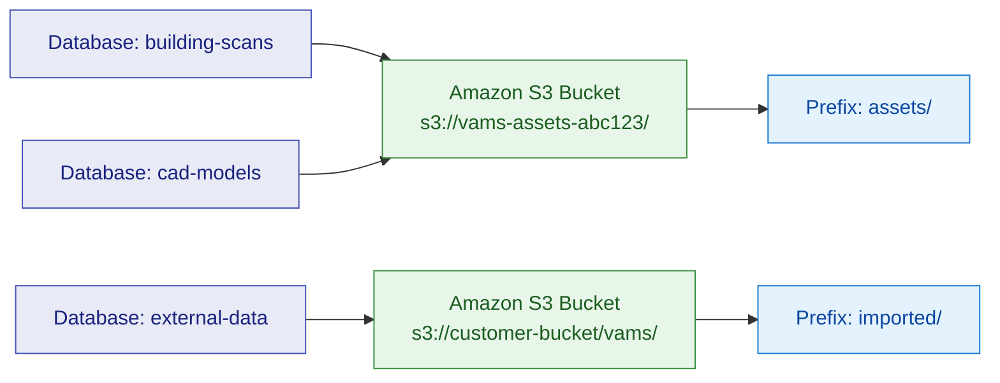

# Databases

A **database** is the top-level organizational boundary in VAMS. It groups related assets together, maps them to an Amazon S3 bucket, and establishes governance rules for metadata and file uploads. Every asset in VAMS belongs to exactly one database.

## What a database represents

A database in VAMS is not a traditional relational database. It is a logical container that:

- Associates a set of assets with a specific Amazon S3 bucket and prefix.
- Defines governance settings such as metadata schema restrictions and allowed file upload extensions.
- Provides a security boundary for permission controls -- roles can be scoped to specific databases.
- Tracks an asset count that is updated as assets are created, archived, or deleted.

:::info[Database vs. Amazon S3 bucket]
A database does not create an Amazon S3 bucket on its own. Buckets are provisioned during CDK deployment (either created automatically or configured as external buckets). When creating a database, you select an existing bucket and prefix combination from the available bucket configurations.
:::


## Creating a database

To create a database, you provide the following fields:

| Field | Required | Description |
|---|---|---|
| `databaseId` | Yes | Unique identifier. 4-63 characters, alphanumeric plus `-` and `_`. Cannot be `GLOBAL` (reserved). |
| `description` | Yes | Human-readable description. 4-256 characters. |
| `defaultBucketId` | Yes | References a pre-configured Amazon S3 bucket and prefix combination. |
| `restrictMetadataOutsideSchemas` | No | When `true`, metadata for assets and files in this database must conform to an applied metadata schema. Defaults to `false`. |
| `restrictFileUploadsToExtensions` | No | Comma-separated list of allowed file extensions (e.g., `.jpg,.png,.pdf`). Use `.all` or leave blank to allow all extensions (subject to system-wide restrictions). Defaults to empty (no restrictions). |

:::warning[Database name restrictions]
The `databaseId` cannot be changed after creation. Choose a meaningful, permanent identifier. The value `GLOBAL` is reserved for cross-database operations such as schemas and pipelines.
:::


### Example: creating a database

```json
{
    "databaseId": "building-scans-2025",
    "description": "3D scans of commercial buildings collected in 2025",
    "defaultBucketId": "a1b2c3d4-e5f6-7890-abcd-ef1234567890",
    "restrictMetadataOutsideSchemas": true,
    "restrictFileUploadsToExtensions": ".e57,.las,.laz,.ply"
}
```

## How databases map to Amazon S3 buckets

Each database is associated with a bucket and prefix combination from the Amazon S3 asset buckets table. This mapping is established at database creation time through the `defaultBucketId` field.



Key points about bucket mapping:

- **Multiple databases can share the same Amazon S3 bucket** if they use different prefixes. This is configured during CDK deployment through the `externalAssetBuckets` configuration.
- **Each database has a base assets prefix** (e.g., `assets/`) under which all asset data for that database is stored.
- **Assets are stored at** `{baseAssetsPrefix}{assetId}/` within the bucket.
- **The bucket must exist** in the Amazon S3 asset buckets configuration table before a database can reference it.

## Database-level settings

### Metadata schema restrictions

When `restrictMetadataOutsideSchemas` is set to `true`, all metadata operations for assets and files within the database are validated against applied metadata schemas. If no schema is applied to a given entity, the restriction has no effect for that entity.

This setting is useful for enforcing data quality standards across a team or project. Metadata keys and value types must match the schema definition, and no ad-hoc metadata fields are permitted.

### File upload extension restrictions

The `restrictFileUploadsToExtensions` field allows administrators to limit which file types can be uploaded through the web interface and CLI. This restriction:

- Applies to uploads via the VAMS web application and VAMS CLI.
- Does **not** apply to files placed directly into the Amazon S3 bucket.
- Uses a comma-separated format: `.jpg,.png,.pdf`.
- Supports the special value `.all` to explicitly allow all extensions.
- Operates in addition to the system-wide blocked file extensions list (e.g., `.exe`, `.dll`, `.bat` are always blocked).

:::tip[Combining restrictions]
Use extension restrictions alongside metadata schema restrictions for comprehensive data governance. For example, a point cloud database might restrict uploads to `.e57,.las,.laz,.ply` and enforce a schema requiring scan date and coordinate system metadata.
:::


## The GLOBAL database concept

VAMS reserves the keyword `GLOBAL` for cross-database operations. You cannot create a database named `GLOBAL`. The GLOBAL scope is used in contexts where an entity applies across all databases rather than being scoped to a single one:

- **Metadata schemas** can be created with a `GLOBAL` database scope, making them available for application to assets in any database.
- **Pipelines and workflows** can be associated with the `GLOBAL` database, allowing them to process assets from any database.

## Database metadata

Databases themselves can carry metadata. Database-level metadata is stored separately from asset and file metadata, and is useful for recording information about the database as a whole (e.g., project name, data source, collection date range).

## Listing and filtering databases

The list databases API supports pagination and filtering:

| Parameter | Description |
|---|---|
| `maxItems` | Maximum number of databases to return. Default: 30,000. |
| `pageSize` | Number of databases per page. Default: 3,000. |
| `startingToken` | Pagination token from a previous response. |
| `showDeleted` | When `true`, returns only archived (soft-deleted) databases. Default: `false`. |

Each database in the response includes its current `assetCount`, reflecting the number of active (non-archived) assets.

## Updating a database

After creation, the following fields can be updated:

- `description` -- Update the human-readable description.
- `defaultBucketId` -- Change the associated Amazon S3 bucket (the new bucket must exist in the configuration).
- `restrictMetadataOutsideSchemas` -- Toggle metadata schema enforcement.
- `restrictFileUploadsToExtensions` -- Update the allowed file extension list.

:::note[Changing the bucket]
Changing a database's `defaultBucketId` affects where **new** assets are stored. Existing assets remain in their original bucket location.
:::


## Database deletion

Database deletion in VAMS is a **soft delete** operation. When a database is deleted:

1. The system checks for active workflows, pipelines, and assets. If any exist, deletion is blocked.
2. The `databaseId` is modified by appending `#deleted` (e.g., `building-scans` becomes `building-scans#deleted`).
3. The original record is removed from the active database table.
4. The archived record is preserved for audit purposes.

:::warning[Prerequisites for deletion]
Before a database can be deleted, all assets within it must be removed or archived, and all associated workflows and pipelines must be deleted. The system enforces these checks automatically.
:::


## What's next

- Learn how assets are organized within databases: [Assets](assets.md)
- Understand file operations and versioning: [Files and Versions](files-and-versions.md)
- Configure metadata schemas for data governance: [Metadata and Schemas](metadata-and-schemas.md)
