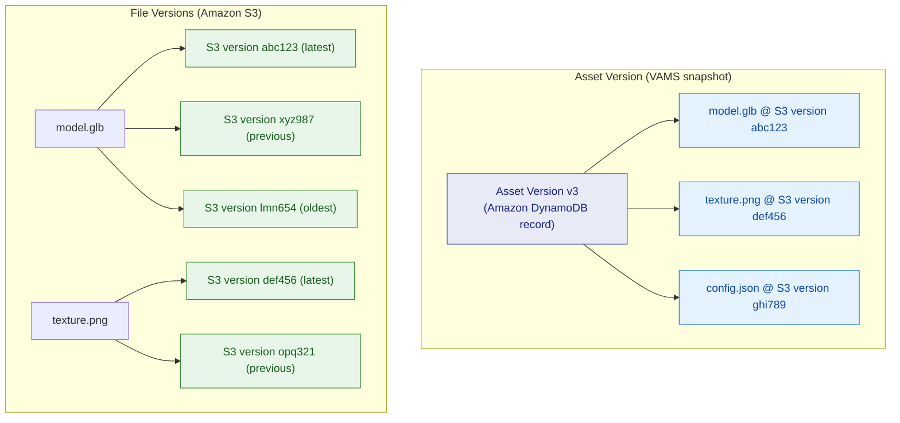

# Files and Versions

**Files** are the individual Amazon S3 objects that make up an [asset](assets.md). VAMS provides a comprehensive set of file operations including upload, download, move, copy, archive, and permanent delete. Two distinct versioning mechanisms work together: Amazon S3 object versioning for individual files, and VAMS asset versions for point-in-time snapshots of the entire asset.

## What files represent

Each file in VAMS corresponds to a single Amazon S3 object stored within an asset's prefix. Files can be organized into virtual folders using Amazon S3 key prefixes, and each file can carry its own metadata, attributes, and a primary type designation.

### File properties

| Property                    | Description                                                                        |
| --------------------------- | ---------------------------------------------------------------------------------- |
| `fileName`                  | The name of the file (last segment of the key).                                    |
| `key`                       | The full Amazon S3 object key.                                                     |
| `relativePath`              | The path relative to the asset root.                                               |
| `isFolder`                  | Whether this entry represents a virtual folder.                                    |
| `size`                      | File size in bytes.                                                                |
| `dateCreatedCurrentVersion` | Timestamp of the current Amazon S3 version.                                        |
| `versionId`                 | The Amazon S3 version ID of the current version.                                   |
| `storageClass`              | The Amazon S3 storage class (e.g., `STANDARD`).                                    |
| `isArchived`                | Whether the file is currently archived (has a delete marker).                      |
| `primaryType`               | The file's primary type designation (see [Primary file type](#primary-file-type)). |
| `previewFile`               | Path to a preview image for this specific file.                                    |

## File operations

### Upload

Files are uploaded using a multipart upload process:

1. **Initialize** -- Request upload URLs by providing the file names, sizes, and number of parts. VAMS creates multipart upload sessions in Amazon S3 and returns pre-signed URLs for each part.
2. **Upload parts** -- Upload file data directly to Amazon S3 using the pre-signed URLs.
3. **Complete** -- Notify VAMS that all parts have been uploaded. VAMS completes the multipart upload in Amazon S3.

VAMS supports uploading up to 1,000 files per request, with a maximum of 5,000 total parts across all files. Zero-byte files are supported with special handling (no multipart upload needed).

:::info[Upload types]
Two upload types are supported: `assetFile` for regular asset files, and `assetPreview` for asset-level preview images. Preview uploads accept exactly one file.
:::

### Download

File downloads are served through pre-signed Amazon S3 URLs that expire after a configurable timeout (default: 24 hours). Downloads can target:

-   A specific file by key.
-   A specific Amazon S3 version by `versionId`.
-   A file as it existed in a particular asset version by `assetVersionId` or `assetVersionIdAlias`.

:::warning[isDistributable flag]
Downloads are only available when the parent asset's `isDistributable` flag is set to `true`. See [Assets -- The isDistributable flag](assets.md#the-isdistributable-flag).
:::

### Move and rename

Moving or renaming a file creates a copy at the destination path and archives (soft-deletes) the source. Both source and destination paths are relative to the asset root.

```json
{
    "sourcePath": "/models/old-name.glb",
    "destinationPath": "/models/new-name.glb"
}
```

### Copy

Files can be copied within the same asset, to a different asset in the same database, or across databases entirely. When copying across databases, file metadata is merged into the destination.

| Parameter               | Required | Description                                                |
| ----------------------- | -------- | ---------------------------------------------------------- |
| `sourcePath`            | Yes      | Relative path of the source file within the current asset. |
| `destinationPath`       | Yes      | Relative path for the copy in the destination asset.       |
| `destinationAssetId`    | No       | Target asset ID. If omitted, copies within the same asset. |
| `destinationDatabaseId` | No       | Target database ID. If omitted, uses the same database.    |

:::tip[Cross-database copy]
When copying a file to a different database, the operation copies the Amazon S3 object from the source bucket to the destination bucket. File metadata is also copied to the destination asset's metadata tables.
:::

### Create folder

Virtual folders can be created within an asset by specifying a relative key ending with `/`. Folders are represented as zero-byte Amazon S3 objects and serve as organizational containers in the file tree.

```json
{
    "relativeKey": "textures/high-res/"
}
```

### Archive (soft delete)

Archiving a file creates an Amazon S3 delete marker on the object, which hides the file from normal listing operations without removing any version history. Archived files can be restored later.

-   Single files can be archived by path.
-   All files under a prefix can be archived at once by setting `isPrefix: true`.

### Unarchive (restore)

Unarchiving removes the Amazon S3 delete marker from a file, restoring the most recent non-deleted version to visibility. The file's complete version history remains intact.

### Permanent delete

Permanent deletion removes a file and all of its Amazon S3 versions irreversibly. This operation requires explicit confirmation via `confirmPermanentDelete: true`.

-   Single files or entire prefixes can be permanently deleted.
-   All Amazon S3 object versions are removed -- the data cannot be recovered.

### Revert file version

Reverting a file copies the content from a previous Amazon S3 version to create a new current version. This operation does not delete any existing versions -- it adds a new version with the content of the specified older version.

## Asset versions vs. file versions

VAMS has two complementary versioning systems that serve different purposes.



### File versions (Amazon S3)

File versions are managed automatically by Amazon S3 versioning on the asset bucket:

-   Every upload or modification to a file creates a new Amazon S3 version.
-   Each version has a unique `versionId` assigned by Amazon S3.
-   Previous versions are retained and accessible by version ID.
-   Archiving a file creates a delete marker (a special version) rather than removing data.
-   Permanent deletion of a specific version removes only that version from Amazon S3.

When viewing file details with `includeVersions: true`, the response lists all Amazon S3 versions including:

| Property          | Description                                       |
| ----------------- | ------------------------------------------------- |
| `versionId`       | The Amazon S3 version identifier.                 |
| `lastModified`    | When this version was created.                    |
| `size`            | Size of this version in bytes.                    |
| `isLatest`        | Whether this is the current version.              |
| `storageClass`    | Amazon S3 storage class for this version.         |
| `isArchived`      | Whether this version is a delete marker.          |
| `assetVersionIds` | Which asset versions reference this file version. |

### Asset versions (VAMS snapshots)

Asset versions are higher-level snapshots managed by VAMS in Amazon DynamoDB:

-   Each asset version records the exact Amazon S3 `versionId` of every file at the time the snapshot was created.
-   Creating an asset version does not duplicate any Amazon S3 data -- it only records references.
-   Asset versions can include versioned metadata snapshots (metadata and attribute values at the time of the snapshot).
-   Reverting to an asset version creates new Amazon S3 versions of files to restore the recorded state.

### How they work together

| Scenario                | File Version (Amazon S3)                              | Asset Version (VAMS)                           |
| ----------------------- | ----------------------------------------------------- | ---------------------------------------------- |
| Upload a new file       | New Amazon S3 version created automatically           | No asset version created automatically         |
| Modify an existing file | New Amazon S3 version created automatically           | No asset version created automatically         |
| Create asset version    | No change to Amazon S3                                | Snapshot records current Amazon S3 version IDs |
| Revert to asset version | New Amazon S3 versions created by copying old content | New asset version created as the revert target |
| Archive a file          | Delete marker created in Amazon S3                    | No change to existing asset versions           |

:::tip[When to create asset versions]
Asset versions are most useful at milestone points: after completing a round of edits, before sharing with a client, or when a processing pipeline produces final outputs. They let you return to a known-good state across all files simultaneously.
:::

## File metadata and file attributes

Files support two distinct data annotation mechanisms:

### File metadata

File metadata follows the same metadata system as asset-level metadata. Metadata values are typed (string, number, boolean, date, JSON) and can be validated against metadata schemas when the database has `restrictMetadataOutsideSchemas` enabled.

File metadata is keyed by `databaseId:assetId:filePath` and `metadataKey`, allowing each file to have its own set of metadata fields independent of other files in the same asset.

### File attributes

File attributes are a simpler key-value store where both keys and values are strings. Attributes are useful for lightweight annotations that do not require type validation or schema enforcement.

File attributes are stored in a separate Amazon DynamoDB table from metadata, keyed by the same `databaseId:assetId:filePath` composite key.

:::info[Metadata vs. attributes]
Use **metadata** when you need typed values, schema validation, or versioning with asset snapshots. Use **attributes** for simple string-only annotations that do not need schema governance.
:::

## Preview files

Individual files within an asset can have associated preview images. Preview files follow a naming convention:

```
{originalFileName}.previewFile.{extension}
```

For example, a file named `pump.e57` might have a preview at `pump.e57.previewFile.gif`. Allowed preview extensions are `.png`, `.jpg`, `.jpeg`, `.svg`, and `.gif`.

Preview files are typically generated by processing pipelines (such as the 3D thumbnail pipeline) but can also be uploaded manually. The `previewFile` property in the file listing response contains the path to the preview if one exists.

:::note[Asset previews vs. file previews]
**Asset previews** are single representative images for the entire asset, stored at the `previewLocation`. **File previews** are per-file thumbnail images stored alongside the files using the `.previewFile.{ext}` naming pattern. These are separate concepts.
:::

## Primary file type

Each file can be assigned a `primaryType` designation that indicates its role within the asset:

| Value                 | Description                                                                                     |
| --------------------- | ----------------------------------------------------------------------------------------------- |
| `primary`             | The main/primary file in the asset.                                                             |
| `lod1` through `lod5` | Level-of-detail variants, from highest (lod1) to lowest (lod5).                                 |
| `other`               | A custom type. Requires a `primaryTypeOther` string (up to 30 characters) to describe the type. |
| _(empty string)_      | Clears any previously set primary type.                                                         |

Primary type metadata is stored as Amazon S3 object metadata on the file itself, making it accessible even when reading the file directly from Amazon S3.

## Folder structure within assets

Assets support virtual folder hierarchies using Amazon S3 key prefixes. For example:

```
asset-001/
    model.glb
    textures/
        diffuse.png
        normal.png
    documentation/
        readme.txt
```

Folders can be created explicitly (as zero-byte Amazon S3 objects with a trailing `/`) or implicitly by uploading files with path separators in their relative keys.

When listing files, you can filter by prefix to view only files within a specific folder:

```
prefix=textures/
```

## File type restrictions

File upload restrictions operate at two levels:

1. **System-wide restrictions** -- Certain file extensions (`.exe`, `.dll`, `.bat`, `.jar`, `.cmd`, etc.) and MIME types are always blocked regardless of database settings.
2. **Database-level restrictions** -- When `restrictFileUploadsToExtensions` is configured on a database, only the specified extensions are permitted for uploads through the web interface and CLI.

## Cross-database file copy with metadata

When copying a file from one database to another, VAMS performs the following:

1. Copies the Amazon S3 object from the source bucket to the destination bucket.
2. Copies file metadata from the source to the destination, merging it into the destination's metadata tables.
3. The copy creates a new Amazon S3 object in the destination -- subsequent changes to the source do not affect the copy.

:::info[Metadata merging]
If the destination file already has metadata with the same keys, the copy operation updates those keys with the source values. Metadata keys that exist only in the destination are preserved.
:::

## Viewing files

VAMS includes 17 built-in viewer plugins that render files directly in the browser. When you select a file in the file manager, VAMS automatically selects the best viewer based on the file extension. Viewers cover 3D models, point clouds, Gaussian splats, USD scenes, images, video, audio, documents, and tabular data.

For the complete list of supported file viewers and extensions, see [File Viewers](viewers.md).

## What's next

-   Learn about the parent data model: [Assets](assets.md)
-   Understand metadata and schema governance: [Metadata and Schemas](metadata-and-schemas.md)
-   Explore how pipelines process files: [Pipelines and Workflows](pipelines-and-workflows.md)
-   Browse all file viewers: [File Viewers](viewers.md)
