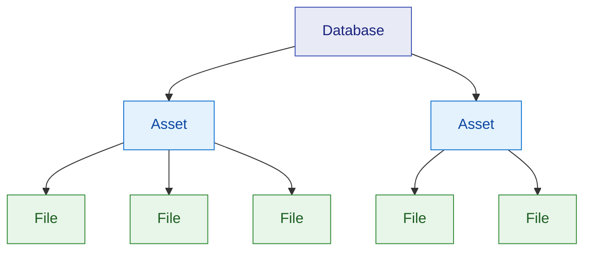

# Core Concepts Overview

VAMS organizes visual assets using a three-level hierarchy: **Databases**, **Assets**, and **Files**. This structure maps directly to AWS storage resources, providing clear organizational boundaries with fine-grained access control at every level.

This page introduces the data hierarchy, summarizes each level, and explains how supporting concepts such as metadata, versions, pipelines, and permissions fit together.

## Data hierarchy

The following diagram illustrates how VAMS structures data from the broadest organizational boundary (Database) down to individual stored objects (Files).

**Database** is the top-level organizational container. Each database maps to an Amazon S3 bucket (or a prefix within a shared bucket) and establishes governance rules such as metadata schema restrictions and allowed file types.

**Asset** is a versioned collection of files that represents a single logical entity -- a 3D scan, a CAD model, a scene, or any grouping of related visual content. Assets live inside a database and are stored under a unique prefix in the database's Amazon S3 bucket.

**File** is an individual Amazon S3 object within an asset. Files inherit the versioning capabilities of Amazon S3, and each file can carry its own metadata and attributes.

## How each level relates to the others

| Relationship              | Description                                                                                                 |
| ------------------------- | ----------------------------------------------------------------------------------------------------------- |
| Database contains Assets  | A database acts as the top-level boundary. All assets belong to exactly one database.                       |
| Asset contains Files      | An asset groups one or more files together under a common identifier and version history.                   |
| Files belong to one Asset | Each file exists within a single asset's Amazon S3 prefix. Cross-asset file references use copy operations. |

Assets can also be linked across databases using [asset relationships](assets.md#asset-relationships-and-links), which support both peer ("related") and hierarchical ("parent-child") link types.

## Mapping to AWS resources

VAMS data maps directly to underlying AWS services, giving administrators full visibility into how content is stored and managed.

| VAMS Concept   | AWS Resource                                    | Key Details                                                                                                                                    |
| -------------- | ----------------------------------------------- | ---------------------------------------------------------------------------------------------------------------------------------------------- |
| Database       | Amazon S3 bucket + Amazon DynamoDB record       | One Amazon S3 bucket per database (or a shared bucket with a unique prefix). Database metadata stored in Amazon DynamoDB.                      |
| Asset          | Amazon S3 prefix + Amazon DynamoDB record       | Assets are stored under `{baseAssetsPrefix}{assetId}/` in the database's bucket. Asset metadata and version history stored in Amazon DynamoDB. |
| File           | Amazon S3 object                                | Individual objects within the asset prefix. Amazon S3 versioning provides file-level version history.                                          |
| Metadata       | Amazon DynamoDB records                         | Stored in dedicated Amazon DynamoDB tables keyed by database, asset, and file path.                                                            |
| Asset Versions | Amazon DynamoDB records + Amazon S3 version IDs | Each asset version is a snapshot recording which Amazon S3 version ID of each file was current at the time the version was created.            |

## Operations available at each level

The following table summarizes the operations that can be performed at each level of the hierarchy.

| Operation             | Database                    | Asset                                          | File                                     |
| --------------------- | --------------------------- | ---------------------------------------------- | ---------------------------------------- |
| Create                | Yes                         | Yes                                            | Yes (upload)                             |
| Read / List           | Yes                         | Yes                                            | Yes                                      |
| Update                | Yes (description, settings) | Yes (name, description, tags, isDistributable) | Yes (metadata, attributes, primary type) |
| Archive (soft delete) | Yes                         | Yes                                            | Yes                                      |
| Unarchive (restore)   | No                          | Yes                                            | Yes                                      |
| Permanent delete      | No                          | Yes                                            | Yes                                      |
| Copy                  | No                          | No                                             | Yes (within and across databases)        |
| Move / Rename         | No                          | No                                             | Yes                                      |
| Version               | No                          | Yes (asset-level snapshots)                    | Yes (Amazon S3 object versioning)        |
| Metadata              | Yes (database metadata)     | Yes (asset metadata)                           | Yes (file metadata and file attributes)  |

## Supporting concepts

Beyond the three-level hierarchy, several cross-cutting concepts enrich the data model.

### Metadata and schemas

Metadata can be attached at the asset level, the file level, or even the database level. Metadata schemas define allowed fields and validation rules, and databases can optionally restrict metadata to only schema-defined fields. For details, see [Metadata and Schemas](metadata-and-schemas.md).

### Versions

VAMS supports two layers of versioning. **Asset versions** capture point-in-time snapshots of all files and metadata within an asset. **File versions** leverage Amazon S3 versioning to track individual object changes. For a deep dive, see [Files and Versions](files-and-versions.md).

### Pipelines and workflows

Pipelines define processing steps (3D conversion, thumbnail generation, AI labeling) that can be applied to assets. Workflows chain pipelines together and can trigger automatically on file upload. See [Pipelines and Workflows](pipelines-and-workflows.md).

### Tags

Tags are free-form labels that can be applied to assets for categorization and filtering. Tag types define controlled vocabularies for consistent tagging. See [Tags](tags.md).

### Permissions

VAMS uses a two-tier authorization model. Tier 1 controls which API routes a role can access, while Tier 2 controls which specific data entities (databases, assets, pipelines) a role can operate on. Both tiers must allow access for an operation to succeed. See [Permissions Model](permissions-model.md).

### Subscriptions

Users can subscribe to asset change notifications. When a subscribed asset is modified (new files uploaded, versions created, metadata changed), VAMS sends email notifications through Amazon Simple Notification Service (Amazon SNS). See [Subscriptions](subscriptions.md).
