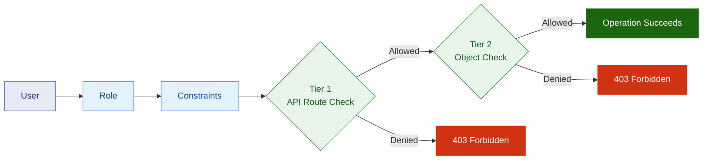

# Permissions Model

VAMS implements a defense-in-depth authorization system using a two-tier model powered by Casbin, an open-source Attribute-Based Access Control (ABAC) and Role-Based Access Control (RBAC) policy engine. Both tiers must independently allow an operation for it to succeed -- if either tier denies access, the request is rejected.

## Two-tier authorization

Every API request passes through two authorization checks before the underlying operation executes.



### Tier 1 -- API route authorization

Tier 1 determines whether the user's role is allowed to call the specific API endpoint. It checks the HTTP method (`GET`, `PUT`, `POST`, `DELETE`) against the route path. This tier uses two object types:

| Object Type | Purpose | Constraint Field |
|---|---|---|
| `api` | Controls access to backend API routes (data operations). | `route__path` |
| `web` | Controls access to frontend UI pages (navigation visibility). | `route__path` |

:::info[Web routes control visibility only]
Web route constraints control which pages appear in the navigation menu. They do not enforce data access -- a user who knows the API endpoint could still call it if the `api` constraint allows. Always pair `web` constraints with matching `api` constraints.
:::


### Tier 2 -- Object-level authorization

Tier 2 determines whether the user's role is allowed to perform the specific operation on the specific data entity. It checks the HTTP method against the entity's attributes (such as `databaseId`, `assetName`, `tags`). This tier uses the data object types listed in the [Object types and constraint fields](#object-types-and-constraint-fields) section.

## Core concepts

### Users

A user is identified by their username from the authentication provider (Amazon Cognito or an external OAuth provider). Users are authenticated before any authorization logic runs.

### Roles

A role is a named permission group. Users are assigned to roles, and roles have constraints associated with them. A user can belong to multiple roles, and a role can have multiple constraints.

| Role | Description |
|---|---|
| `admin` (default) | Full CRUD access across all object types and databases. Deployed automatically. |
| `basicReadOnly` (default) | Read-only access across all databases. Deployed automatically. |
| Custom roles | Created by administrators to implement organization-specific access patterns. |

:::note[MFA-aware roles]
Roles can be configured with `mfaRequired: true`. When MFA is required, the role's constraints are only active when the user's session includes a valid MFA claim. If MFA is not present, the role is treated as if it does not exist for that session.
:::


### Constraints

A constraint is a policy rule that defines what a role can do. Each constraint specifies:

- **Object type** -- The kind of resource the constraint applies to (for example, `asset`, `pipeline`, `database`).
- **Criteria** -- Conditions that must be met for the constraint to match (for example, `databaseId equals my-project-db`).
- **Permissions** -- The HTTP methods allowed or denied (`GET`, `PUT`, `POST`, `DELETE`).
- **Permission type** -- Whether the constraint is an `allow` or `deny` rule.

Constraints use `criteriaAnd` (all conditions must match) and `criteriaOr` (at least one condition must match) to build complex matching rules.

## Casbin policy model

VAMS stores its authorization policy in Amazon DynamoDB and uses the Casbin engine to make enforcement decisions at runtime. The policy model defines four components:

- **Request definition** -- Each authorization request contains a subject (user), an object (the resource being accessed), and an action (the HTTP method).
- **Policy definition** -- Each policy rule contains a subject pattern, an object matching rule, an action, and an effect (`allow` or `deny`).
- **Role definition** -- Users are grouped into roles using a role inheritance model.
- **Policy effect** -- The critical evaluation rule: **at least one allow must match, AND no deny can match.** This means deny rules always take precedence over allow rules, similar to AWS Identity and Access Management (IAM) policy evaluation.

The matchers component evaluates whether the requesting user belongs to the policy's role, whether the object matches the policy's rule expression, and whether the action matches.

## Object types and constraint fields

Each object type supports specific constraint fields that can be used in criteria conditions.

| Object Type | Constraint Fields | Description |
|---|---|---|
| `api` | `route__path` | Backend API route paths. |
| `web` | `route__path` | Frontend UI page routes. |
| `database` | `databaseId` | Database entity operations. |
| `asset` | `databaseId`, `assetName`, `assetType`, `tags` | Asset entity operations (includes file operations). |
| `pipeline` | `databaseId`, `pipelineId`, `pipelineType`, `pipelineExecutionType` | Pipeline management and execution. |
| `workflow` | `databaseId`, `workflowId` | Workflow management and execution. |
| `metadataSchema` | `databaseId`, `metadataSchemaName`, `metadataSchemaEntityType` | Metadata schema management. |
| `tag` | `tagName` | Tag CRUD operations. |
| `tagType` | `tagTypeName` | Tag type CRUD operations. |
| `role` | `roleName` | Role management. |
| `userRole` | `roleName`, `userId` | User-to-role assignment management. |

## Constraint criteria operators

Criteria conditions use operators to match field values. All operators use regular expression matching internally. Criteria values are auto-escaped before being passed to the Casbin policy engine.

| Operator | Behavior | Internal Regex Pattern | Example |
|---|---|---|---|
| `equals` | Exact match. | `regexMatch(^value$)` | `databaseId equals my-project-db` |
| `contains` | Value appears anywhere in the field. | `regexMatch(.*value.*)` | `tags contains locked` |
| `does_not_contain` | Value does not appear in the field. | `!regexMatch(.*value.*)` | `tags does_not_contain restricted` |
| `starts_with` | Field begins with the value. | `regexMatch(^value.*)` | `databaseId starts_with team-alpha-` |
| `ends_with` | Field ends with the value. | `regexMatch(.*value$)` | `assetName ends_with .e57` |
| `is_one_of` | Reserved for future metadata field checks. | `value in r.obj.field` | -- |
| `is_not_one_of` | Reserved for future metadata field checks. | `!(value in r.obj.field)` | -- |

:::tip[Wildcard matching]
Since operators use regex internally, you can use patterns like `.*` for broad matching. For example, `databaseId contains .*` matches any database. However, prefer specific values over wildcards to follow the principle of least privilege.
:::


## The GLOBAL keyword

Pipelines, workflows, and metadata schemas support a special `GLOBAL` keyword for their `databaseId` field. GLOBAL entities are not tied to any specific database and are available across all databases.

When granting access to GLOBAL resources, always use the `equals` operator with the value `GLOBAL`. Do not use a wildcard pattern, as this could inadvertently grant access to resources in other databases.

```json
{
    "criteriaAnd": [
        { "field": "databaseId", "operator": "equals", "value": "GLOBAL" }
    ]
}
```

For roles scoped to a specific database, you typically need two constraints per entity type (pipeline, workflow, metadataSchema) -- one for the specific database and one for `GLOBAL` -- to ensure users can access both database-specific and shared resources.

## Allow and deny effects

### Allow rules

Allow rules grant access to specific operations. At least one allow rule must match for the operation to proceed. If no allow rules match, the operation is denied by default (implicit deny).

### Deny rules

Deny rules explicitly block specific operations. A single matching deny rule overrides all allow rules for that operation. Deny rules are typically used to create exceptions within broad allow policies.

**Example: Deny modification of tagged assets**

```json
{
    "name": "deny-locked-assets",
    "objectType": "asset",
    "criteriaAnd": [
        { "field": "tags", "operator": "contains", "value": "locked" }
    ],
    "groupPermissions": [
        { "permission": "PUT", "permissionType": "deny" },
        { "permission": "POST", "permissionType": "deny" },
        { "permission": "DELETE", "permissionType": "deny" }
    ]
}
```

This constraint denies all write operations on any asset tagged with `locked`, regardless of other allow rules. Users can still view (`GET`) the asset.

## Constraint examples for common roles

The following table illustrates the constraint patterns needed for common role profiles. Each row represents a separate constraint.

### Database Admin (scoped to a specific database)

| Object Type | Permissions | Scope | Purpose |
|---|---|---|---|
| `web` | GET | Standard pages + `/assetIngestion` | UI navigation |
| `api` | GET, PUT, POST, DELETE | All non-admin API routes | API access |
| `api` | GET | `/tags`, `/tag-types` | Read-only tag access |
| `database` | GET, PUT, DELETE | `databaseId equals \{DB_ID\}` | Database management (no create) |
| `asset` | GET, PUT, POST, DELETE | `databaseId equals \{DB_ID\}` | Full asset management |
| `pipeline` | GET, PUT, POST, DELETE | `databaseId equals \{DB_ID\}` | Pipeline management |
| `pipeline` | GET, POST | `databaseId equals GLOBAL` | Execute GLOBAL pipelines |
| `workflow` | GET, PUT, POST, DELETE | `databaseId equals \{DB_ID\}` | Workflow management |
| `workflow` | GET, POST | `databaseId equals GLOBAL` | Execute GLOBAL workflows |
| `metadataSchema` | GET, PUT, POST, DELETE | `databaseId equals \{DB_ID\}` | Schema management |
| `metadataSchema` | GET | `databaseId equals GLOBAL` | View GLOBAL schemas |
| `tag` | GET | All | Read-only tag access |
| `tagType` | GET | All | Read-only tag type access |

### Database User (scoped to a specific database)

| Object Type | Permissions | Scope | Purpose |
|---|---|---|---|
| `web` | GET | Standard pages (no `/assetIngestion`) | UI navigation |
| `api` | GET | Broad read access | Read API routes |
| `api` | POST | Asset operations, workflow execution | Create and execute |
| `api` | PUT | Asset updates only | Update operations |
| `api` | DELETE | Archive paths only (`archiveAsset`, `archiveFile`) | Soft delete only |
| `database` | GET | `databaseId equals \{DB_ID\}` | View database (read-only) |
| `asset` | GET, PUT, POST, DELETE | `databaseId equals \{DB_ID\}` | Asset operations (DELETE for archive; permanent delete blocked at Tier 1) |
| `pipeline` | GET, POST | `databaseId equals \{DB_ID\}` | View and execute pipelines |
| `pipeline` | GET, POST | `databaseId equals GLOBAL` | View and execute GLOBAL pipelines |
| `workflow` | GET, POST | `databaseId equals \{DB_ID\}` | View and execute workflows |
| `workflow` | GET, POST | `databaseId equals GLOBAL` | View and execute GLOBAL workflows |
| `metadataSchema` | GET | `databaseId equals \{DB_ID\}` | View schemas |
| `metadataSchema` | GET | `databaseId equals GLOBAL` | View GLOBAL schemas |
| `tag` | GET | All | Read-only tag access |
| `tagType` | GET | All | Read-only tag type access |

:::warning[Archive versus permanent delete]
The Database User role demonstrates a key pattern: the `asset` entity constraint grants DELETE (needed for archive operations), but the `api` route constraint uses the `contains` operator to only match paths containing `archiveAsset` or `archiveFile`. This blocks permanent delete paths (`deleteAsset`, `deleteFile`) at Tier 1 while allowing soft delete at Tier 2.
:::


## Common pitfalls

:::warning[Incomplete constraint matrix]
A common mistake is creating a `database` constraint and assuming it automatically restricts all resources within that database. The `database` object type only controls the database entity itself. You must create separate constraints for `asset`, `pipeline`, `workflow`, and `metadataSchema` to restrict resources within the database. See the constraint examples above for the full matrix.
:::


**Additional pitfalls to avoid:**

- **Missing API route constraints** -- Without Tier 1 `api` constraints, the user cannot call any endpoints, even if Tier 2 data constraints exist.
- **Missing web route constraints** -- Without `web` constraints, the UI hides pages from the user (though API access still works if configured).
- **Using `criteriaAnd` for multiple databases** -- If you need access to multiple databases, use `criteriaOr` (not `criteriaAnd`). A single entity can only have one `databaseId`, so multiple `equals` conditions in `criteriaAnd` will never match simultaneously.
- **Forgetting non-mutating POST routes for read-only roles** -- Routes like `/search` and `/auth/routes` use POST but do not modify data. Read-only roles must allow POST on these specific paths for the UI to function.
- **Using wildcards for GLOBAL access** -- When granting access to GLOBAL resources, use `databaseId equals GLOBAL` (not `databaseId contains .*`). A wildcard inadvertently matches all databases.

## Permission templates

VAMS provides pre-built JSON templates for common permission profiles. Templates automate the creation of the full constraint matrix and support variable substitution for database-scoped roles.

| Template | File | Variables | Description |
|---|---|---|---|
| Database Admin | `database-admin.json` | `DATABASE_ID`, `ROLE_NAME` | Full management of a specific database (13 constraints). |
| Database User | `database-user.json` | `DATABASE_ID`, `ROLE_NAME` | Standard user access with archive-only delete (15 constraints). |
| Database Read-Only | `database-readonly.json` | `DATABASE_ID`, `ROLE_NAME` | View-only access to a specific database (10 constraints). |
| Global Read-Only | `global-readonly.json` | `ROLE_NAME` | Read-only access across all databases (10 constraints). |
| Deny Tagged Assets | `deny-tagged-assets.json` | `ROLE_NAME`, `TAG_VALUE` | Overlay: deny editing of assets with a specific tag (1 constraint). |

Templates are located in the `documentation/permissionsTemplates/` directory. You can apply them using the `POST /auth/constraintsTemplateImport` API endpoint or the CLI tool in `tools/permissionsSetup/`.

```bash
# Apply the database-admin template with variable substitution
python tools/permissionsSetup/apply_template.py \
    --template documentation/permissionsTemplates/database-admin.json \
    --role-name my-project-admin \
    --variables '{"DATABASE_ID": "my-project-db"}' --dry-run
```

:::note[Templates create constraints only]
The template import API creates constraints but does not create roles or assign users. Create the role and assign users separately using the `/roles` and `/user-roles` API endpoints.
:::


## Web route reference

The following web routes can be checked via the `web` object type with the `route__path` field. Requests for these routes are made through the `POST /auth/routes` API. These control front-end navigation visibility only and do not impact API data access.

| Route Path | Page |
|---|---|
| `*` | Default landing page (always allowed) |
| `/` | Default landing page (always allowed) |
| `/assetIngestion` | Asset ingestion |
| `/assets` | Assets listing |
| `/assets/:assetId` | Asset detail |
| `/auth/api-keys` | API key management |
| `/auth/cognitousers` | Amazon Cognito user management |
| `/auth/constraints` | Constraint management |
| `/auth/roles` | Role management |
| `/auth/subscriptions` | Subscription management |
| `/auth/tags` | Tag management |
| `/auth/userroles` | User-role assignment |
| `/databases` | Database listing |
| `/databases/:databaseId/assets` | Database assets listing |
| `/databases/:databaseId/assets/:assetId` | Asset detail (database-scoped) |
| `/databases/:databaseId/assets/:assetId/download` | Asset download |
| `/databases/:databaseId/assets/:assetId/file` | File viewer |
| `/databases/:databaseId/assets/:assetId/file/*` | File viewer (nested path) |
| `/databases/:databaseId/assets/:assetId/uploads` | Modify asset uploads |
| `/databases/:databaseId/pipelines` | Database pipelines |
| `/databases/:databaseId/workflows` | Database workflows |
| `/databases/:databaseId/workflows/:workflowId` | Workflow detail |
| `/databases/:databaseId/workflows/create` | Create workflow |
| `/metadataschema` | Metadata schema listing |
| `/metadataschema/:databaseId` | Database metadata schemas |
| `/pipelines` | Pipeline listing |
| `/pipelines/:pipelineName` | Pipeline detail |
| `/search` | Search page |
| `/search/:databaseId/assets` | Database-scoped search |
| `/upload` | Upload page |
| `/upload/:databaseId` | Database-scoped upload |
| `/workflows` | Workflow listing |
| `/workflows/create` | Create workflow |

## API route reference

The following API routes are registered in the API Gateway. Each route uses the `api` object type with the `route__path` field for Tier 1 authorization. The table also shows which data object types are checked at Tier 2 for each route.

:::note
Routes marked "No auth checks" bypass Tier 1 and Tier 2 authorization. Routes marked "API-level only" check Tier 1 but do not perform Tier 2 data entity checks.
:::

### Configuration and authentication routes

| Route | Methods | Tier 2 Object Type |
|---|---|---|
| `/api/amplify-config` | GET | No auth checks |
| `/api/version` | GET | No auth checks |
| `/secure-config` | GET | No Tier 2 checks (requires authentication header) |
| `/auth/routes` | POST | No Tier 1 checks (POST is non-mutating, retrieves allowed routes) |
| `/auth/loginProfile/\{userId\}` | GET, POST | API-level only |

### Database routes

| Route | Methods | Tier 2 Object Type | Tier 2 Fields |
|---|---|---|---|
| `/database` | GET | `database` | `databaseId` |
| `/database` | POST | `database` | `databaseId` |
| `/database/\{databaseId\}` | GET, PUT, DELETE | `database` | `databaseId` |
| `/buckets` | GET | -- | -- |
| `/database/\{databaseId\}/metadata` | GET, POST, PUT, DELETE | `database` | `databaseId` |

### Asset routes

| Route | Methods | Tier 2 Object Type | Tier 2 Fields |
|---|---|---|---|
| `/assets` | GET | `asset` | `assetId`, `assetName`, `databaseId`, `assetType`, `tags` |
| `/assets` | POST | `asset` | `assetName`, `databaseId`, `tags` |
| `/database/\{databaseId\}/assets` | GET | `asset` | `assetId`, `assetName`, `databaseId`, `assetType`, `tags` |
| `/database/\{databaseId\}/assets/\{assetId\}` | GET, PUT | `asset` | `assetId`, `assetName`, `databaseId`, `assetType`, `tags` |
| `/database/\{databaseId\}/assets/\{assetId\}/archiveAsset` | DELETE | `asset` | `assetId`, `assetName`, `databaseId`, `assetType`, `tags` |
| `/database/\{databaseId\}/assets/\{assetId\}/deleteAsset` | DELETE | `asset` | `assetId`, `assetName`, `databaseId`, `assetType`, `tags` |
| `/database/\{databaseId\}/assets/\{assetId\}/unarchiveAsset` | PUT | `asset` | `assetId`, `assetName`, `databaseId`, `assetType`, `tags` |
| `/database/\{databaseId\}/assets/\{assetId\}/metadata` | GET, POST, PUT, DELETE | `asset` | `assetId`, `assetName`, `databaseId`, `assetType`, `tags` |
| `/database/\{databaseId\}/assets/\{assetId\}/metadata/file` | GET, POST, PUT, DELETE | `asset` | `assetId`, `assetName`, `databaseId`, `assetType`, `tags` |

### Asset file routes

| Route | Methods | Tier 2 Object Type | Tier 2 Fields |
|---|---|---|---|
| `/database/\{databaseId\}/assets/\{assetId\}/listFiles` | GET | `asset` | `assetId`, `assetName`, `databaseId`, `assetType`, `tags` |
| `/database/\{databaseId\}/assets/\{assetId\}/fileInfo` | GET | `asset` | `assetId`, `assetName`, `databaseId`, `assetType`, `tags` |
| `/database/\{databaseId\}/assets/\{assetId\}/moveFile` | POST | `asset` | `assetId`, `assetName`, `databaseId`, `assetType`, `tags` |
| `/database/\{databaseId\}/assets/\{assetId\}/copyFile` | POST | `asset` | `assetId`, `assetName`, `databaseId`, `assetType`, `tags` |
| `/database/\{databaseId\}/assets/\{assetId\}/archiveFile` | DELETE | `asset` | `assetId`, `assetName`, `databaseId`, `assetType`, `tags` |
| `/database/\{databaseId\}/assets/\{assetId\}/unarchiveFile` | POST | `asset` | `assetId`, `assetName`, `databaseId`, `assetType`, `tags` |
| `/database/\{databaseId\}/assets/\{assetId\}/deleteFile` | DELETE | `asset` | `assetId`, `assetName`, `databaseId`, `assetType`, `tags` |
| `/database/\{databaseId\}/assets/\{assetId\}/deleteAssetPreview` | DELETE | `asset` | `assetId`, `assetName`, `databaseId`, `assetType`, `tags` |
| `/database/\{databaseId\}/assets/\{assetId\}/deleteAuxiliaryPreviewAssetFiles` | DELETE | `asset` | `assetId`, `assetName`, `databaseId`, `assetType`, `tags` |
| `/database/\{databaseId\}/assets/\{assetId\}/createFolder` | POST | `asset` | `assetId`, `assetName`, `databaseId`, `assetType`, `tags` |
| `/database/\{databaseId\}/assets/\{assetId\}/setPrimaryFile` | PUT | `asset` | `assetId`, `assetName`, `databaseId`, `assetType`, `tags` |
| `/database/\{databaseId\}/assets/\{assetId\}/revertFileVersion/\{versionId\}` | POST | `asset` | `assetId`, `assetName`, `databaseId`, `assetType`, `tags` |
| `/database/\{databaseId\}/assets/\{assetId\}/download/stream/\{proxy+\}` | GET, HEAD | `asset` | `assetId`, `assetName`, `databaseId`, `assetType`, `tags` |
| `/database/\{databaseId\}/assets/\{assetId\}/auxiliaryPreviewAssets/stream/\{proxy+\}` | GET, HEAD | `asset` | `assetId`, `assetName`, `databaseId`, `assetType`, `tags` |
| `/database/\{databaseId\}/assets/\{assetId\}/download` | POST | `asset` | `assetId`, `assetName`, `databaseId`, `assetType`, `tags` |
| `/database/\{databaseId\}/assets/\{assetId\}/export` | POST | `asset` | `assetId`, `assetName`, `databaseId`, `assetType`, `tags` |

### Asset version routes

| Route | Methods | Tier 2 Object Type | Tier 2 Fields |
|---|---|---|---|
| `/database/\{databaseId\}/assets/\{assetId\}/createVersion` | POST | `asset` | `assetId`, `assetName`, `databaseId`, `assetType`, `tags` |
| `/database/\{databaseId\}/assets/\{assetId\}/revertAssetVersion/\{assetVersionId\}` | POST | `asset` | `assetId`, `assetName`, `databaseId`, `assetType`, `tags` |
| `/database/\{databaseId\}/assets/\{assetId\}/getVersions` | GET | `asset` | `assetId`, `assetName`, `databaseId`, `assetType`, `tags` |
| `/database/\{databaseId\}/assets/\{assetId\}/getVersion/\{assetVersionId\}` | GET | `asset` | `assetId`, `assetName`, `databaseId`, `assetType`, `tags` |
| `/database/\{databaseId\}/assets/\{assetId\}/assetversions/\{assetVersionId\}` | PUT | `asset` | `assetId`, `assetName`, `databaseId`, `assetType`, `tags` |
| `/database/\{databaseId\}/assets/\{assetId\}/assetversions/\{assetVersionId\}/archive` | POST | `asset` | `assetId`, `assetName`, `databaseId`, `assetType`, `tags` |
| `/database/\{databaseId\}/assets/\{assetId\}/assetversions/\{assetVersionId\}/unarchive` | POST | `asset` | `assetId`, `assetName`, `databaseId`, `assetType`, `tags` |

### Upload and ingestion routes

| Route | Methods | Tier 2 Object Type | Tier 2 Fields |
|---|---|---|---|
| `/uploads` | POST | `asset` | `assetId`, `assetName`, `assetType`, `databaseId`, `tags` |
| `/uploads/\{uploadId\}/complete` | POST | `asset` | `assetId`, `assetName`, `assetType`, `databaseId`, `tags` |
| `/ingest-asset` | POST | `asset` | `assetId`, `assetName`, `databaseId` |

### Asset link routes

| Route | Methods | Tier 2 Object Type | Tier 2 Fields |
|---|---|---|---|
| `/asset-links` | POST | `asset` (both from and to assets) | `assetId`, `databaseId`, `assetName`, `assetType`, `tags` |
| `/asset-links/single/\{assetLinkId\}` | GET | `asset` (both from and to assets) | `assetId`, `databaseId`, `assetName`, `assetType`, `tags` |
| `/asset-links/\{assetLinkId\}` | PUT | `asset` (both from and to assets) | `assetId`, `databaseId`, `assetName`, `assetType`, `tags` |
| `/asset-links/\{relationId\}` | DELETE | `asset` (both from and to assets) | `assetId`, `databaseId`, `assetName`, `assetType`, `tags` |
| `/asset-links/\{assetLinkId\}/metadata` | GET, POST, PUT, DELETE | `asset` (both from and to assets) | `assetId`, `databaseId`, `assetName`, `assetType`, `tags` |
| `/database/\{databaseId\}/assets/\{assetId\}/asset-links` | GET | `asset` | `assetId`, `assetName`, `databaseId`, `assetType`, `tags` |

### Comment routes

| Route | Methods | Tier 2 Object Type | Tier 2 Fields |
|---|---|---|---|
| `/comments/assets/\{assetId\}` | GET | `asset` | `assetId`, `assetName`, `databaseId`, `assetType`, `tags` |
| `/comments/assets/\{assetId\}/assetVersionId/\{assetVersionId\}` | GET | `asset` | `assetId`, `assetName`, `databaseId`, `assetType`, `tags` |
| `/comments/assets/\{assetId\}/assetVersionId:commentId/\{assetVersionId:commentId\}` | GET, POST, PUT, DELETE | `asset` | `assetId`, `assetName`, `databaseId`, `assetType`, `tags` |

### Pipeline and workflow routes

| Route | Methods | Tier 2 Object Type | Tier 2 Fields |
|---|---|---|---|
| `/pipelines` | GET | `pipeline` | `databaseId`, `pipelineId`, `pipelineType`, `pipelineExecutionType` |
| `/pipelines` | PUT | `pipeline` | `databaseId`, `pipelineId`, `pipelineType`, `pipelineExecutionType` |
| `/database/\{databaseId\}/pipelines` | GET | `pipeline` | `databaseId`, `pipelineId`, `pipelineType`, `pipelineExecutionType` |
| `/database/\{databaseId\}/pipelines/\{pipelineId\}` | GET, DELETE | `pipeline` | `databaseId`, `pipelineId`, `pipelineType`, `pipelineExecutionType` |
| `/workflows` | GET | `workflow` | `databaseId`, `workflowId` |
| `/workflows` | PUT | `workflow` | `databaseId`, `workflowId` |
| `/database/\{databaseId\}/workflows` | GET | `workflow` | `databaseId`, `workflowId` |
| `/database/\{databaseId\}/workflows/\{workflowId\}` | GET, DELETE | `workflow` | `databaseId`, `workflowId` |
| `/database/\{databaseId\}/assets/\{assetId\}/workflows/\{workflowId\}` | POST | `asset`, `workflow`, `pipeline` | (checks all three entity types) |
| `/database/\{databaseId\}/assets/\{assetId\}/workflows/executions` | GET | `asset`, `workflow` | (checks both entity types) |
| `/database/\{databaseId\}/assets/\{assetId\}/workflows/executions/\{workflowId\}` | GET | `asset`, `workflow` | (checks both entity types) |

### Metadata schema routes

| Route | Methods | Tier 2 Object Type | Tier 2 Fields |
|---|---|---|---|
| `/metadataschema` | GET, POST, PUT | `metadataSchema` | `databaseId`, `metadataSchemaEntityType`, `metadataSchemaName` |
| `/database/\{databaseId\}/metadataSchema/\{metadataSchemaId\}` | GET, DELETE | `metadataSchema` | `databaseId`, `metadataSchemaEntityType`, `metadataSchemaName` |

### Search route

| Route | Methods | Tier 2 Object Type | Tier 2 Fields |
|---|---|---|---|
| `/search` | GET, POST | `asset` | `assetId`, `assetName`, `databaseId`, `assetType`, `tags` (both GET and POST are non-mutating) |

### Subscription routes

| Route | Methods | Tier 2 Object Type | Tier 2 Fields |
|---|---|---|---|
| `/subscriptions` | GET, PUT, POST, DELETE | `asset` | `assetId`, `assetName`, `databaseId`, `assetType`, `tags` |
| `/check-subscription` | POST | `asset` | `assetId`, `assetName`, `databaseId`, `assetType`, `tags` (non-mutating) |
| `/unsubscribe` | DELETE | `asset` | `assetId`, `assetName`, `databaseId`, `assetType`, `tags` |

### Tag and tag type routes

| Route | Methods | Tier 2 Object Type | Tier 2 Fields |
|---|---|---|---|
| `/tags` | GET, PUT, POST | `tag` | `tagName` |
| `/tags/\{tagId\}` | DELETE | `tag` | `tagName` |
| `/tag-types` | GET, PUT, POST | `tagType` | `tagTypeName` |
| `/tag-types/\{tagTypeId\}` | DELETE | `tagType` | `tagTypeName` |

### Role and user role routes

| Route | Methods | Tier 2 Object Type | Tier 2 Fields |
|---|---|---|---|
| `/roles` | GET, PUT, POST | `role` | `roleName` |
| `/roles/\{roleId\}` | DELETE | `role` | `roleName` |
| `/user-roles` | GET, PUT, POST, DELETE | `userRole` | `roleName`, `userId` |

### Auth and administration routes

| Route | Methods | Tier 2 Object Type |
|---|---|---|
| `/auth/constraints` | GET | API-level only |
| `/auth/constraints/\{constraintId\}` | GET, PUT, POST, DELETE | API-level only |
| `/auth/constraintsTemplateImport` | POST | API-level only |
| `/auth/api-keys` | GET, POST | API-level only |
| `/auth/api-keys/\{apiKeyId\}` | GET, PUT, DELETE | API-level only |
| `/user/cognito` | GET, POST | API-level only |
| `/user/cognito/\{userId\}` | PUT, DELETE | API-level only |
| `/user/cognito/\{userId\}/resetPassword` | POST | API-level only |

## Performance considerations

The Casbin enforcer uses a 60-second in-memory policy cache per user per AWS Lambda execution environment. Policy changes (new constraints, role assignments) take effect within 60 seconds as the cache refreshes. For immediate effect, the user can re-authenticate to force a new Lambda cold start.

## Related topics

- [Tags and Subscriptions](tags-and-subscriptions.md) -- tag-based access control patterns
- [Pipelines and Workflows](pipelines-and-workflows.md) -- pipeline and workflow permission scoping
- [Metadata and Schemas](metadata-and-schemas.md) -- metadata schema permission controls
