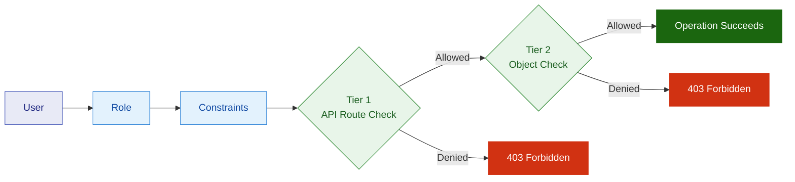

# Permissions Model

VAMS implements a defense-in-depth authorization system using a two-tier model powered by Casbin, an open-source Attribute-Based Access Control (ABAC) and Role-Based Access Control (RBAC) policy engine. Both tiers must independently allow an operation for it to succeed -- if either tier denies access, the request is rejected.

## Two-tier authorization

Every API request passes through two authorization checks before the underlying operation executes.


```mermaid
flowchart LR
    U[User] --> R[Role]
    R --> C[Constraints]
    C --> T1{Tier 1<br/>API Route Check}
    T1 -->|Allowed| T2{Tier 2<br/>Object Check}
    T1 -->|Denied| D1[403 Forbidden]
    T2 -->|Allowed| S[Operation Succeeds]
    T2 -->|Denied| D2[403 Forbidden]

    style U fill:#e8eaf6,stroke:#3f51b5,color:#1a237e
    style R fill:#e3f2fd,stroke:#1976d2,color:#0d47a1
    style C fill:#e3f2fd,stroke:#1976d2,color:#0d47a1
    style T1 fill:#e8f5e9,stroke:#388e3c,color:#1b5e20
    style T2 fill:#e8f5e9,stroke:#388e3c,color:#1b5e20
    style S fill:#1b660f,stroke:#1b660f,color:#fff
    style D1 fill:#d13212,stroke:#d13212,color:#fff
    style D2 fill:#d13212,stroke:#d13212,color:#fff
```

### Tier 1 -- API route authorization

Tier 1 determines whether the user's role is allowed to call the specific API endpoint. It checks the HTTP method (`GET`, `PUT`, `POST`, `DELETE`) against the route path. This tier uses two object types:

| Object Type | Purpose                                                       | Constraint Field |
| ----------- | ------------------------------------------------------------- | ---------------- |
| `api`       | Controls access to backend API routes (data operations).      | `route__path`    |
| `web`       | Controls access to frontend UI pages (navigation visibility). | `route__path`    |

:::info[Web routes control visibility only]
Web route constraints control which pages appear in the navigation menu. They do not enforce data access -- a user who knows the API endpoint could still call it if the `api` constraint allows. Always pair `web` constraints with matching `api` constraints.

The orchestration UI (Pipelines, Workflows, Executions pages) additionally implements **Tier-1 action graying** — actions the user is not allowed to perform (based on `GET /auth/routes/api/allowed`) are hidden or disabled. For example, the admin-only **Logs** and **Permanent Delete** actions in an execution's action menu are hidden unless the user's role allows the corresponding API routes. An execution's **Logs** tab is the exception: it remains present so the capability stays discoverable, and reports that the logs are not viewable.
:::

### Tier 2 -- Object-level authorization

Tier 2 determines whether the user's role is allowed to perform the specific operation on the specific data entity. It checks the HTTP method against the entity's attributes (such as `databaseId`, `assetName`, `tags`). This tier uses the data object types listed in the [Object types and constraint fields](#object-types-and-constraint-fields) section.

## Core concepts

### Users

A user is identified by their username from the authentication provider (Amazon Cognito or an external OAuth provider). Users are authenticated before any authorization logic runs.

VAMS also defines a built-in system user with the reserved user ID `SYSTEM_USER`. This identity represents internal system processes — such as pipeline workflow executions, bucket-sync ingestion, and authorized Lambda cross-calls — that act without an interactive user context. `SYSTEM_USER` is created at deployment and assigned to the `admin` role so that system processes pass authorization checks, and it appears as the acting user (for example, in `createdBy` and `changeUserId` fields) on records created by those processes. It is not a login account; access to the internal invocation paths that assume this identity is controlled through AWS IAM permissions on direct Lambda invocation.

Workflow triggers use this identity by design. A trigger-launched execution (for example, a `fileUpload` trigger that fires when a matching file is uploaded) runs as `SYSTEM_USER`, not as the user whose action fired the trigger. A user may be permitted to perform the triggering action — such as uploading a file — without holding permission to run the workflow, so attributing the execution to the acting user would cause the trigger to fail. Running it as `SYSTEM_USER` decouples the trigger from the acting user's permissions and ensures it functions consistently on the data regardless of who performed the triggering action. Executions started directly through the workflow execute endpoint run as the calling user.

### Roles

A role is a named permission group. Users are assigned to roles, and roles have constraints associated with them. A user can belong to multiple roles, and a role can have multiple constraints.

| Role                      | Description                                                                                                          |
| ------------------------- | -------------------------------------------------------------------------------------------------------------------- |
| `admin` (default)         | Full CRUD access across all object types and databases, including the administrative routes. Deployed automatically. |
| `basicReadOnly` (default) | Read-only access across all databases, excluding the administrative routes. Deployed automatically.                  |
| Custom roles              | Created by administrators to implement organization-specific access patterns.                                        |

Both default roles are seeded at deployment time. `admin` receives the administrator account named by
`app.adminUserId`, plus the reserved `SYSTEM_USER` identity so system processes satisfy both
authorization tiers. `basicReadOnly` grants GET on the read paths (assets, files, metadata, databases,
pipelines, workflows, executions, tags, comments, subscriptions, metadata schemas), the non-mutating
POST paths (`/auth/routes`, `/search`, `/check-subscription`), and management of the caller's own API
keys.

Two routes are administrative and belong to `admin` alone: detailed execution logs
(`GET /workflows/executions/\{executionId\}/logs`) and execution permanent delete
(`DELETE /workflows/executions/\{executionId\}/permanent`). A read-only role reaches its everyday
routes through broad prefixes such as `/workflows`, which also match those two paths, so each is
withheld by an explicit `deny` constraint on the path suffix. A `deny` overrides any matching `allow`,
which makes it the reliable way to carve an exception out of a prefix grant.

:::note[MFA-aware roles]
Roles can be configured with `mfaRequired: true`. When MFA is required, the role's constraints are only active when the user's session includes a valid MFA claim. If MFA is not present, the role is treated as if it does not exist for that session.

MFA enforcement requires the API Gateway authorizer to reach Amazon Cognito. VAMS does not create Amazon Cognito VPC interface endpoints, so an authorizer running inside the VPC has no path to Amazon Cognito. MFA-aware roles are enforced only when the authorizer runs outside the VPC; when Lambda functions run in the VPC (`useForAllLambdas`), the Cognito MFA check is disabled and `mfaRequired` has no effect. See [MFA-Aware Roles](../architecture/security.md#mfa-aware-roles) for the exact conditions.
:::

### Constraints

A constraint is a policy rule that defines what a role can do. Each constraint specifies:

-   **Object type** -- The kind of resource the constraint applies to (for example, `asset`, `pipeline`, `database`).
-   **Criteria** -- Conditions that must be met for the constraint to match (for example, `databaseId equals my-project-db`).
-   **Permissions** -- The HTTP methods allowed or denied (`GET`, `PUT`, `POST`, `DELETE`).
-   **Permission type** -- Whether the constraint is an `allow` or `deny` rule.

Constraints use `criteriaAnd` (all conditions must match) and `criteriaOr` (at least one condition must match) to build complex matching rules. When a constraint defines both, they combine within the same rule: access matches only if **all** `criteriaAnd` conditions are true **and at least one** `criteriaOr` condition is true.

:::warning[Constraint management is an administrative operation]
The ability to create, modify, or delete constraints is itself a privileged capability. Constraint management routes (`/auth/constraints`, `/auth/constraints/\{constraintId\}`, and `/auth/constraintsTemplateImport`) are gated at Tier 1 by the `api` object type and, in the default deployment, are granted only to the `admin` role.

A role that can manage constraints can grant itself or others access to any resource in VAMS — for example, by creating an `allow` constraint with a broad `databaseId contains .*` rule. This is equivalent to granting AWS Identity and Access Management (IAM) policy-editing permissions: the holder effectively controls all authorization decisions. Constraints are configuration objects and do not have their own per-object (Tier 2) restrictions.

Only grant access to the constraint management routes to fully trusted administrators. Do not delegate `api` access to `/auth/constraints` (or the constraint web route `/auth/constraints`) to roles intended for general or untrusted users. Treat any change to who can manage constraints as a privileged administrative change and review it accordingly.
:::

## Casbin policy model

VAMS stores its authorization policy in Amazon DynamoDB and uses the Casbin engine to make enforcement decisions at runtime. The policy model defines four components:

-   **Request definition** -- Each authorization request contains a subject (user), an object (the resource being accessed), and an action (the HTTP method).
-   **Policy definition** -- Each policy rule contains a subject pattern, an object matching rule, an action, and an effect (`allow` or `deny`).
-   **Role definition** -- Users are grouped into roles using a role inheritance model.
-   **Policy effect** -- The critical evaluation rule: **at least one allow must match, AND no deny can match.** This means deny rules always take precedence over allow rules, similar to AWS Identity and Access Management (IAM) policy evaluation.

The matchers component evaluates whether the requesting user belongs to the policy's role, whether the object matches the policy's rule expression, and whether the action matches.

## Object types and constraint fields

Each object type supports specific constraint fields that can be used in criteria conditions.

| Object Type      | Constraint Fields                                                       | Description                                                                      |
| ---------------- | ----------------------------------------------------------------------- | -------------------------------------------------------------------------------- |
| `api`            | `route__path`                                                           | Backend API route paths.                                                         |
| `web`            | `route__path`                                                           | Frontend UI page routes.                                                         |
| `database`       | `databaseId`                                                            | Database entity operations.                                                      |
| `asset`          | `databaseId`, `assetName`, `assetType`, `tags`                          | Asset entity operations (includes file operations).                              |
| `pipeline`       | `databaseId`, `pipelineId`, `pipelineExecutionType`, `category`, `name` | Pipeline management and execution (includes pipeline templates and tag schemas). |
| `workflow`       | `databaseId`, `workflowId`, `category`, `name`                          | Workflow management, triggers, and execution.                                    |
| `metadataSchema` | `databaseId`, `metadataSchemaName`, `metadataSchemaEntityType`          | Metadata schema management.                                                      |
| `tag`            | `tagName`                                                               | Tag CRUD operations.                                                             |
| `tagType`        | `tagTypeName`                                                           | Tag type CRUD operations.                                                        |
| `role`           | `roleName`                                                              | Role management.                                                                 |
| `userRole`       | `roleName`, `userId`                                                    | User-to-role assignment management.                                              |

This object-type and field matrix — along with the criteria operators, the permissions, and the permission types — is served by the `GET /auth/constraints/permissionObjects` API and is the authoritative source the constraint editor and CLI use. Constraints are validated against it: a criterion whose field is not valid for its object type is rejected at create/update time and ignored during authorization evaluation.

## Constraint criteria operators

Criteria conditions use operators to match field values. The pattern-matching operators compare one string using a regular expression; the membership operators test a list. Criteria values are auto-escaped before being passed to the Casbin policy engine.

| Operator           | Behavior                             | Internal Pattern                   | Example                              |
| ------------------ | ------------------------------------ | ---------------------------------- | ------------------------------------ |
| `equals`           | Exact match.                         | `regexMatch(^value\Z)`             | `databaseId equals my-project-db`    |
| `contains`         | Value appears anywhere in the field. | `regexMatch((?s:.*)value(?s:.*))`  | `assetName contains draft`           |
| `does_not_contain` | Value does not appear in the field.  | `!regexMatch((?s:.*)value(?s:.*))` | `assetName does_not_contain scratch` |
| `starts_with`      | Field begins with the value.         | `regexMatch(^value.*)`             | `databaseId starts_with team-alpha-` |
| `ends_with`        | Field ends with the value.           | `regexMatch((?s:.*)value\Z)`       | `assetName ends_with .e57`           |
| `is_one_of`        | List contains the value.             | `value in r.obj.field`             | `tags is_one_of locked`              |
| `is_not_one_of`    | List does not contain the value.     | `!(value in r.obj.field)`          | `tags is_not_one_of published`       |

:::note[Match the operator to the field]
Every field holds a single string except `tags`, which holds a list. Use the membership operators for `tags` and the pattern-matching operators for everything else — a constraint that pairs a pattern-matching operator with `tags` is rejected when it is saved.

The terminal anchor is `\Z` rather than `$`, and the generated wildcards span newlines, so a value's leading or trailing whitespace cannot satisfy a constraint written without it. The wildcards are scoped groups, which keeps a `.` inside your own value matching a single character rather than crossing lines.
:::

:::tip[Wildcard matching]
Since operators use regex internally, you can use patterns like `.*` for broad matching. For example, `databaseId contains .*` matches any database. However, prefer specific values over wildcards to follow the principle of least privilege.
:::

## The GLOBAL keyword

Pipelines, workflows, and metadata schemas support a special `GLOBAL` keyword for their `databaseId` field. GLOBAL entities are not tied to any specific database and are available across all databases.

When granting access to GLOBAL resources, always use the `equals` operator with the value `GLOBAL`. Do not use a wildcard pattern, as this could inadvertently grant access to resources in other databases.

```json
{
    "criteriaAnd": [{ "field": "databaseId", "operator": "equals", "value": "GLOBAL" }]
}
```

For roles scoped to a specific database, you typically need two constraints per entity type (pipeline, workflow, metadataSchema) -- one for the specific database and one for `GLOBAL` -- to ensure users can access both database-specific and shared resources.

## Allow and deny effects

### Allow rules

Allow rules grant access to specific operations. At least one allow rule must match for the operation to proceed. If no allow rules match, the operation is denied by default (implicit deny).

### Deny rules

Deny rules explicitly block specific operations. A single matching deny rule overrides all allow rules for that operation. Deny rules are typically used to create exceptions within broad allow policies.

**Example: Deny modification of tagged assets**

```json
{
    "name": "deny-locked-assets",
    "objectType": "asset",
    "criteriaAnd": [{ "field": "tags", "operator": "contains", "value": "locked" }],
    "groupPermissions": [
        { "permission": "PUT", "permissionType": "deny" },
        { "permission": "POST", "permissionType": "deny" },
        { "permission": "DELETE", "permissionType": "deny" }
    ]
}
```

This constraint denies all write operations on any asset tagged with `locked`, regardless of other allow rules. Users can still view (`GET`) the asset.

## Common role patterns

For detailed constraint tables, JSON examples, and design rationale for common roles (Database Admin, Database User, Database Read-Only, Global Read-Only, and Deny by Tag), see [Developer Guide: Permissions](../developer/permissions.md).

:::warning[Archive versus permanent delete]
The Database User role demonstrates a key pattern: the `asset` entity constraint grants DELETE (needed for archive operations), but the `api` route constraint uses the `contains` operator to only match paths containing `archiveAsset` or `archiveFile`. This blocks permanent delete paths (`deleteAsset`, `deleteFile`) at Tier 1 while allowing soft delete at Tier 2.
:::

## Common pitfalls

:::warning[Incomplete constraint matrix]
A common mistake is creating a `database` constraint and assuming it automatically restricts all resources within that database. The `database` object type only controls the database entity itself. You must create separate constraints for `asset`, `pipeline`, `workflow`, and `metadataSchema` to restrict resources within the database. See the [Developer Guide: Permissions](../developer/permissions.md) for complete constraint matrices.
:::

**Additional pitfalls to avoid:**

-   **Missing API route constraints** -- Without Tier 1 `api` constraints, the user cannot call any endpoints, even if Tier 2 data constraints exist.
-   **Missing web route constraints** -- Without `web` constraints, the UI hides pages from the user (though API access still works if configured).
-   **Using `criteriaAnd` for multiple databases** -- If you need access to multiple databases, use `criteriaOr` (not `criteriaAnd`). A single entity can only have one `databaseId`, so multiple `equals` conditions in `criteriaAnd` will never match simultaneously.
-   **Forgetting non-mutating POST routes for read-only roles** -- Routes like `/search` and `/auth/routes` use POST but do not modify data. Read-only roles must allow POST on these specific paths for the UI to function.
-   **Using wildcards for GLOBAL access** -- When granting access to GLOBAL resources, use `databaseId equals GLOBAL` (not `databaseId contains .*`). A wildcard inadvertently matches all databases.

## Permission templates

VAMS provides pre-built JSON templates for common permission profiles (Database Admin, Database User, Database Read-Only, Global Read-Only, and Deny Tagged Assets). Templates automate the creation of the full constraint matrix and support variable substitution for database-scoped roles.

For the complete list of templates, JSON format details, and instructions on applying templates via the CLI or API, see [Developer Guide: Permissions](../developer/permissions.md#permission-templates).

## Web route reference

The following web routes can be checked via the `web` object type with the `route__path` field. Requests for these routes are made through the `POST /auth/routes` API. These control front-end navigation visibility only and do not impact API data access.

| Route Path                                                           | Page                                  |
| -------------------------------------------------------------------- | ------------------------------------- |
| `*`                                                                  | Default landing page (always allowed) |
| `/`                                                                  | Default landing page (always allowed) |
| `/assetIngestion`                                                    | Asset ingestion                       |
| `/assets`                                                            | Assets listing                        |
| `/assets/:assetId`                                                   | Asset detail                          |
| `/auth/api-keys`                                                     | API key management                    |
| `/auth/cognitousers`                                                 | Amazon Cognito user management        |
| `/auth/constraints`                                                  | Constraint management                 |
| `/auth/roles`                                                        | Role management                       |
| `/auth/subscriptions`                                                | Subscription management               |
| `/auth/tags`                                                         | Tag management                        |
| `/auth/userroles`                                                    | User-role assignment                  |
| `/databases`                                                         | Database listing                      |
| `/databases/:databaseId/assets`                                      | Database assets listing               |
| `/databases/:databaseId/assets/:assetId`                             | Asset detail (database-scoped)        |
| `/databases/:databaseId/assets/:assetId/download`                    | Asset download                        |
| `/databases/:databaseId/assets/:assetId/file`                        | File viewer                           |
| `/databases/:databaseId/assets/:assetId/file/*`                      | File viewer (nested path)             |
| `/databases/:databaseId/assets/:assetId/uploads`                     | Modify asset uploads                  |
| `/databases/:databaseId/pipelines`                                   | Database pipelines                    |
| `/databases/:databaseId/pipelines/:pipelineId`                       | Pipeline detail                       |
| `/databases/:databaseId/pipelines/:pipelineId/templates`             | Pipeline templates listing            |
| `/databases/:databaseId/pipelines/:pipelineId/templates/:templateId` | Template detail                       |
| `/databases/:databaseId/pipelines/:pipelineId/templates/create`      | Create pipeline template              |
| `/databases/:databaseId/pipelines/create`                            | Create pipeline                       |
| `/databases/:databaseId/workflows`                                   | Database workflows                    |
| `/databases/:databaseId/workflows/:workflowId`                       | Workflow detail                       |
| `/databases/:databaseId/workflows/:workflowId/triggers`              | Workflow triggers                     |
| `/databases/:databaseId/workflows/create`                            | Create workflow                       |
| `/executions`                                                        | Executions listing                    |
| `/executions/:executionId`                                           | Execution detail                      |
| `/metadataschema`                                                    | Metadata schema listing               |
| `/metadataschema/:databaseId`                                        | Database metadata schemas             |
| `/pipelines`                                                         | Pipeline listing                      |
| `/search`                                                            | Search page                           |
| `/search/:databaseId/assets`                                         | Database-scoped search                |
| `/upload`                                                            | Upload page                           |
| `/upload/:databaseId`                                                | Database-scoped upload                |
| `/workflows`                                                         | Workflow listing                      |
| `/workflows/create`                                                  | Create workflow                       |

## API route reference

The following API routes are registered in the API Gateway. Each route uses the `api` object type with the `route__path` field for Tier 1 authorization. The table also shows which data object types are checked at Tier 2 for each route.

:::note
Routes marked "No auth checks" bypass Tier 1 and Tier 2 authorization. Routes marked "API-level only" check Tier 1 but do not perform Tier 2 data entity checks.
:::

### Configuration and authentication routes

| Route                           | Methods   | Tier 2 Object Type                                                |
| ------------------------------- | --------- | ----------------------------------------------------------------- |
| `/api/amplify-config`           | GET       | No auth checks                                                    |
| `/api/version`                  | GET       | No auth checks                                                    |
| `/secure-config`                | GET       | No Tier 2 checks (requires authentication header)                 |
| `/auth/routes`                  | POST      | No Tier 1 checks (POST is non-mutating, retrieves allowed routes) |
| `/auth/routes/api`              | GET       | API-level only                                                    |
| `/auth/routes/api/allowed`      | GET       | API-level only                                                    |
| `/auth/loginProfile/\{userId\}` | GET, POST | API-level only                                                    |

### Database routes

| Route                               | Methods                | Tier 2 Object Type | Tier 2 Fields |
| ----------------------------------- | ---------------------- | ------------------ | ------------- |
| `/database`                         | GET                    | `database`         | `databaseId`  |
| `/database`                         | POST                   | `database`         | `databaseId`  |
| `/database/\{databaseId\}`          | GET, PUT, DELETE       | `database`         | `databaseId`  |
| `/buckets`                          | GET                    | --                 | --            |
| `/database/\{databaseId\}/metadata` | GET, POST, PUT, DELETE | `database`         | `databaseId`  |

### Asset routes

| Route                                                        | Methods                | Tier 2 Object Type | Tier 2 Fields                                             |
| ------------------------------------------------------------ | ---------------------- | ------------------ | --------------------------------------------------------- |
| `/assets`                                                    | GET                    | `asset`            | `assetId`, `assetName`, `databaseId`, `assetType`, `tags` |
| `/assets`                                                    | POST                   | `asset`            | `assetName`, `databaseId`, `tags`                         |
| `/database/\{databaseId\}/assets`                            | GET                    | `asset`            | `assetId`, `assetName`, `databaseId`, `assetType`, `tags` |
| `/database/\{databaseId\}/assets/\{assetId\}`                | GET, PUT               | `asset`            | `assetId`, `assetName`, `databaseId`, `assetType`, `tags` |
| `/database/\{databaseId\}/assets/\{assetId\}/archiveAsset`   | DELETE                 | `asset`            | `assetId`, `assetName`, `databaseId`, `assetType`, `tags` |
| `/database/\{databaseId\}/assets/\{assetId\}/deleteAsset`    | DELETE                 | `asset`            | `assetId`, `assetName`, `databaseId`, `assetType`, `tags` |
| `/database/\{databaseId\}/assets/\{assetId\}/unarchiveAsset` | PUT                    | `asset`            | `assetId`, `assetName`, `databaseId`, `assetType`, `tags` |
| `/database/\{databaseId\}/assets/\{assetId\}/metadata`       | GET, POST, PUT, DELETE | `asset`            | `assetId`, `assetName`, `databaseId`, `assetType`, `tags` |
| `/database/\{databaseId\}/assets/\{assetId\}/metadata/file`  | GET, POST, PUT, DELETE | `asset`            | `assetId`, `assetName`, `databaseId`, `assetType`, `tags` |
| `/database/\{databaseId\}/assets/\{assetId\}/assetHistory`   | GET                    | `asset`            | `assetId`, `assetName`, `databaseId`, `assetType`, `tags` |

### Asset file routes

| Route                                                                                  | Methods   | Tier 2 Object Type | Tier 2 Fields                                             |
| -------------------------------------------------------------------------------------- | --------- | ------------------ | --------------------------------------------------------- |
| `/database/\{databaseId\}/assets/\{assetId\}/listFiles`                                | GET       | `asset`            | `assetId`, `assetName`, `databaseId`, `assetType`, `tags` |
| `/database/\{databaseId\}/assets/\{assetId\}/fileInfo`                                 | GET       | `asset`            | `assetId`, `assetName`, `databaseId`, `assetType`, `tags` |
| `/database/\{databaseId\}/assets/\{assetId\}/moveFile`                                 | POST      | `asset`            | `assetId`, `assetName`, `databaseId`, `assetType`, `tags` |
| `/database/\{databaseId\}/assets/\{assetId\}/copyFile`                                 | POST      | `asset`            | `assetId`, `assetName`, `databaseId`, `assetType`, `tags` |
| `/database/\{databaseId\}/assets/\{assetId\}/archiveFile`                              | DELETE    | `asset`            | `assetId`, `assetName`, `databaseId`, `assetType`, `tags` |
| `/database/\{databaseId\}/assets/\{assetId\}/unarchiveFile`                            | POST      | `asset`            | `assetId`, `assetName`, `databaseId`, `assetType`, `tags` |
| `/database/\{databaseId\}/assets/\{assetId\}/deleteFile`                               | DELETE    | `asset`            | `assetId`, `assetName`, `databaseId`, `assetType`, `tags` |
| `/database/\{databaseId\}/assets/\{assetId\}/deleteAssetPreview`                       | DELETE    | `asset`            | `assetId`, `assetName`, `databaseId`, `assetType`, `tags` |
| `/database/\{databaseId\}/assets/\{assetId\}/deleteAuxiliaryPreviewAssetFiles`         | DELETE    | `asset`            | `assetId`, `assetName`, `databaseId`, `assetType`, `tags` |
| `/database/\{databaseId\}/assets/\{assetId\}/createFolder`                             | POST      | `asset`            | `assetId`, `assetName`, `databaseId`, `assetType`, `tags` |
| `/database/\{databaseId\}/assets/\{assetId\}/setPrimaryFile`                           | PUT       | `asset`            | `assetId`, `assetName`, `databaseId`, `assetType`, `tags` |
| `/database/\{databaseId\}/assets/\{assetId\}/revertFileVersion/\{versionId\}`          | POST      | `asset`            | `assetId`, `assetName`, `databaseId`, `assetType`, `tags` |
| `/database/\{databaseId\}/assets/\{assetId\}/download/stream/\{proxy+\}`               | GET, HEAD | `asset`            | `assetId`, `assetName`, `databaseId`, `assetType`, `tags` |
| `/database/\{databaseId\}/assets/\{assetId\}/auxiliaryPreviewAssets/stream/\{proxy+\}` | GET, HEAD | `asset`            | `assetId`, `assetName`, `databaseId`, `assetType`, `tags` |
| `/database/\{databaseId\}/assets/\{assetId\}/download`                                 | POST      | `asset`            | `assetId`, `assetName`, `databaseId`, `assetType`, `tags` |
| `/database/\{databaseId\}/assets/\{assetId\}/export`                                   | POST      | `asset`            | `assetId`, `assetName`, `databaseId`, `assetType`, `tags` |

### Asset version routes

| Route                                                                                    | Methods | Tier 2 Object Type | Tier 2 Fields                                             |
| ---------------------------------------------------------------------------------------- | ------- | ------------------ | --------------------------------------------------------- |
| `/database/\{databaseId\}/assets/\{assetId\}/createVersion`                              | POST    | `asset`            | `assetId`, `assetName`, `databaseId`, `assetType`, `tags` |
| `/database/\{databaseId\}/assets/\{assetId\}/revertAssetVersion/\{assetVersionId\}`      | POST    | `asset`            | `assetId`, `assetName`, `databaseId`, `assetType`, `tags` |
| `/database/\{databaseId\}/assets/\{assetId\}/getVersions`                                | GET     | `asset`            | `assetId`, `assetName`, `databaseId`, `assetType`, `tags` |
| `/database/\{databaseId\}/assets/\{assetId\}/getVersion/\{assetVersionId\}`              | GET     | `asset`            | `assetId`, `assetName`, `databaseId`, `assetType`, `tags` |
| `/database/\{databaseId\}/assets/\{assetId\}/assetversions/\{assetVersionId\}`           | PUT     | `asset`            | `assetId`, `assetName`, `databaseId`, `assetType`, `tags` |
| `/database/\{databaseId\}/assets/\{assetId\}/assetversions/\{assetVersionId\}/archive`   | POST    | `asset`            | `assetId`, `assetName`, `databaseId`, `assetType`, `tags` |
| `/database/\{databaseId\}/assets/\{assetId\}/assetversions/\{assetVersionId\}/unarchive` | POST    | `asset`            | `assetId`, `assetName`, `databaseId`, `assetType`, `tags` |

### Upload and ingestion routes

| Route                            | Methods | Tier 2 Object Type | Tier 2 Fields                                             |
| -------------------------------- | ------- | ------------------ | --------------------------------------------------------- |
| `/uploads`                       | POST    | `asset`            | `assetId`, `assetName`, `assetType`, `databaseId`, `tags` |
| `/uploads/\{uploadId\}/complete` | POST    | `asset`            | `assetId`, `assetName`, `assetType`, `databaseId`, `tags` |
| `/ingest-asset`                  | POST    | `asset`            | `assetId`, `assetName`, `databaseId`                      |

### Asset link routes

| Route                                                     | Methods                | Tier 2 Object Type                | Tier 2 Fields                                             |
| --------------------------------------------------------- | ---------------------- | --------------------------------- | --------------------------------------------------------- |
| `/asset-links`                                            | POST                   | `asset` (both from and to assets) | `assetId`, `databaseId`, `assetName`, `assetType`, `tags` |
| `/asset-links/single/\{assetLinkId\}`                     | GET                    | `asset` (both from and to assets) | `assetId`, `databaseId`, `assetName`, `assetType`, `tags` |
| `/asset-links/\{assetLinkId\}`                            | PUT                    | `asset` (both from and to assets) | `assetId`, `databaseId`, `assetName`, `assetType`, `tags` |
| `/asset-links/\{assetLinkId\}`                            | DELETE                 | `asset` (both from and to assets) | `assetId`, `databaseId`, `assetName`, `assetType`, `tags` |
| `/asset-links/\{assetLinkId\}/metadata`                   | GET, POST, PUT, DELETE | `asset` (both from and to assets) | `assetId`, `databaseId`, `assetName`, `assetType`, `tags` |
| `/database/\{databaseId\}/assets/\{assetId\}/asset-links` | GET                    | `asset`                           | `assetId`, `assetName`, `databaseId`, `assetType`, `tags` |

### Comment routes

| Route                                                                                | Methods                | Tier 2 Object Type | Tier 2 Fields                                             |
| ------------------------------------------------------------------------------------ | ---------------------- | ------------------ | --------------------------------------------------------- |
| `/comments/assets/\{assetId\}`                                                       | GET                    | `asset`            | `assetId`, `assetName`, `databaseId`, `assetType`, `tags` |
| `/comments/assets/\{assetId\}/assetVersionId/\{assetVersionId\}`                     | GET                    | `asset`            | `assetId`, `assetName`, `databaseId`, `assetType`, `tags` |
| `/comments/assets/\{assetId\}/assetVersionId:commentId/\{assetVersionId:commentId\}` | GET, POST, PUT, DELETE | `asset`            | `assetId`, `assetName`, `databaseId`, `assetType`, `tags` |

### Pipeline and workflow routes

| Route                                                                                                                 | Methods                | Tier 2 Object Type              | Tier 2 Fields                                                                                                                                                                                                                                                                                 |
| --------------------------------------------------------------------------------------------------------------------- | ---------------------- | ------------------------------- | --------------------------------------------------------------------------------------------------------------------------------------------------------------------------------------------------------------------------------------------------------------------------------------------- |
| `/pipelines`                                                                                                          | GET                    | `pipeline`                      | `databaseId`, `pipelineId`, `pipelineExecutionType`, `category`, `name`                                                                                                                                                                                                                       |
| `/database/\{databaseId\}/pipelines`                                                                                  | GET, POST              | `pipeline`                      | `databaseId`, `pipelineId`, `pipelineExecutionType`, `category`, `name`                                                                                                                                                                                                                       |
| `/database/\{databaseId\}/pipelines/\{pipelineId\}`                                                                   | GET, PUT, DELETE       | `pipeline`                      | `databaseId`, `pipelineId`, `pipelineExecutionType`, `category`, `name`                                                                                                                                                                                                                       |
| `/database/\{databaseId\}/pipelines/\{pipelineId\}/templates` and `.../templates/\{templateId\}` (incl. `/tagSchema`) | GET, POST, PUT, DELETE | `pipeline`                      | Enforced against the **owning pipeline** (templates + tag schemas have no separate object type).                                                                                                                                                                                              |
| `/workflows`                                                                                                          | GET                    | `workflow`                      | `databaseId`, `workflowId`, `category`, `name`                                                                                                                                                                                                                                                |
| `/database/\{databaseId\}/workflows`                                                                                  | GET, POST              | `workflow`                      | `databaseId`, `workflowId`, `category`, `name`                                                                                                                                                                                                                                                |
| `/database/\{databaseId\}/workflows/\{workflowId\}`                                                                   | GET, PUT, DELETE       | `workflow`                      | `databaseId`, `workflowId`, `category`, `name`                                                                                                                                                                                                                                                |
| `/database/\{databaseId\}/workflows/\{workflowId\}/triggers` and `.../triggers/\{triggerType\}`                       | GET, PUT, DELETE       | `workflow`                      | Enforced against the **owning workflow**.                                                                                                                                                                                                                                                     |
| `/workflows/\{workflowDatabaseId\}/\{workflowId\}/execute`                                                            | POST                   | `workflow`, `pipeline`, `asset` | Workflow GET + each referenced pipeline GET + each input asset GET + the output asset POST.                                                                                                                                                                                                   |
| `/workflows/executions`                                                                                               | GET                    | `workflow`, `asset`, `database` | Global list; each execution is visible only when the caller can GET its workflow and **every** asset it read (or its output asset, for a run with no inputs). A permanently deleted asset defers to GET on the database it lived in; an archived asset is still authorized on its own record. |
| `/database/\{databaseId\}/assets/\{assetId\}/workflows/executions` and `.../executions/\{workflowId\}`                | GET                    | `workflow`, `asset`             | The asset's own execution history (the asset detail page's Executions tab), optionally narrowed to one workflow. Same per-execution visibility rule as the global list, and it includes runs where the asset is the OUTPUT target.                                                            |
| `/workflows/executions/\{executionId\}/details`                                                                       | GET                    | `workflow`, `asset`             | Same per-execution visibility check as the global list.                                                                                                                                                                                                                                       |
| `/workflows/executions/\{executionId\}/details/metadata`                                                              | GET                    | `workflow`, `asset`             | One page of one metadata collection of the detail view. Same per-execution visibility check as `.../details`, so a caller who can open the detail view can page its metadata. Grant it wherever `.../details` is granted — a prefix grant on `/workflows` already covers both.                |
| `/workflows/executions/\{executionId\}/logs`                                                                          | GET                    | `workflow`, `asset`             | Detailed execution logs — scope to administrative / operator roles.                                                                                                                                                                                                                           |
| `/workflows/executions/\{executionId\}`                                                                               | DELETE                 | `workflow`, `asset`             | Abort. Optional `?groupId=` aborts every active execution in the group.                                                                                                                                                                                                                       |
| `/workflows/executions/\{executionId\}/rerun`                                                                         | POST                   | `workflow`, `asset`             | Re-run (re-launches with the caller's own permissions).                                                                                                                                                                                                                                       |
| `/workflows/executions/\{executionId\}/permanent`                                                                     | DELETE                 | `workflow`, `asset`             | Permanent delete of the execution's DynamoDB records — **admin-only**; blocked while in progress.                                                                                                                                                                                             |

:::warning[Scope detailed logs and permanent delete to administrators]
The execution **logs** route (`/workflows/executions/\{executionId\}/logs`) exposes full CloudWatch execution logs, and the **permanent delete** route (`/workflows/executions/\{executionId\}/permanent`) removes execution records irreversibly. Grant these two routes only to administrative or operator roles. The shipped non-admin templates authorize the everyday execution routes (execute, list, details, paged detail metadata, abort, re-run) but withhold `.../logs` and `.../permanent`; only the Database Admin template grants them.
:::

:::note[Grant the paged detail-metadata route wherever details is granted]
`GET /workflows/executions/\{executionId\}/details/metadata` is its own Tier‑1 route, and it reads the same collections `.../details` returns. A role that can open an execution's detail view but is not authorized on the paged route sees a metadata section flagged as partial with no way to read the rest, so the two routes belong together in a grant.

A prefix grant such as `starts_with /workflows` covers both, which is how the shipped templates authorize them. An allow list that enumerates execution paths individually needs the metadata path added alongside `.../details`, and a `deny` written as a path suffix stays precise enough not to catch it — the administrative denies match `/logs` and `/permanent`.
:::

:::info[Executing is authorized by the route, not by a workflow POST]
Permission to run a workflow comes from Tier 1 on the execute route (`POST /workflows/\{workflowDatabaseId\}/\{workflowId\}/execute`). Tier 2 then confirms the caller can **read** what the run touches: `GET` on the workflow, `GET` on each referenced pipeline, and `GET` on each input asset. The output asset is the one object the run writes, so it is authorized with `POST`.

On a `pipeline` or `workflow` object, `POST` means **create** and `PUT` means **modify** — neither is required to execute. A role therefore runs workflows with read-only object access, and granting `POST` on a workflow grants the ability to create workflows. The other execution routes (list, details, abort, re-run) follow the same shape: the Tier‑1 route grants the operation, and Tier‑2 `GET` on the workflow and its assets scopes which executions are reachable.
:::

### Metadata schema routes

| Route                                                          | Methods        | Tier 2 Object Type | Tier 2 Fields                                                  |
| -------------------------------------------------------------- | -------------- | ------------------ | -------------------------------------------------------------- |
| `/metadataschema`                                              | GET, POST, PUT | `metadataSchema`   | `databaseId`, `metadataSchemaEntityType`, `metadataSchemaName` |
| `/database/\{databaseId\}/metadataSchema/\{metadataSchemaId\}` | GET, DELETE    | `metadataSchema`   | `databaseId`, `metadataSchemaEntityType`, `metadataSchemaName` |

### Search route

| Route            | Methods   | Tier 2 Object Type | Tier 2 Fields                                                                                  |
| ---------------- | --------- | ------------------ | ---------------------------------------------------------------------------------------------- |
| `/search`        | GET, POST | `asset`            | `assetId`, `assetName`, `databaseId`, `assetType`, `tags` (both GET and POST are non-mutating) |
| `/search/simple` | POST      | `asset`            | `assetId`, `assetName`, `databaseId`, `assetType`, `tags` (POST is non-mutating)               |

### Subscription routes

| Route                 | Methods                | Tier 2 Object Type | Tier 2 Fields                                                            |
| --------------------- | ---------------------- | ------------------ | ------------------------------------------------------------------------ |
| `/subscriptions`      | GET, PUT, POST, DELETE | `asset`            | `assetId`, `assetName`, `databaseId`, `assetType`, `tags`                |
| `/check-subscription` | POST                   | `asset`            | `assetId`, `assetName`, `databaseId`, `assetType`, `tags` (non-mutating) |
| `/unsubscribe`        | DELETE                 | `asset`            | `assetId`, `assetName`, `databaseId`, `assetType`, `tags`                |

### Tag and tag type routes

| Route                      | Methods        | Tier 2 Object Type | Tier 2 Fields |
| -------------------------- | -------------- | ------------------ | ------------- |
| `/tags`                    | GET, PUT, POST | `tag`              | `tagName`     |
| `/tags/\{tagId\}`          | DELETE         | `tag`              | `tagName`     |
| `/tag-types`               | GET, PUT, POST | `tagType`          | `tagTypeName` |
| `/tag-types/\{tagTypeId\}` | DELETE         | `tagType`          | `tagTypeName` |

### Role and user role routes

| Route               | Methods                | Tier 2 Object Type | Tier 2 Fields        |
| ------------------- | ---------------------- | ------------------ | -------------------- |
| `/roles`            | GET, PUT, POST         | `role`             | `roleName`           |
| `/roles/\{roleId\}` | DELETE                 | `role`             | `roleName`           |
| `/user-roles`       | GET, PUT, POST, DELETE | `userRole`         | `roleName`, `userId` |

### Auth and administration routes

| Route                                    | Methods                | Tier 2 Object Type |
| ---------------------------------------- | ---------------------- | ------------------ |
| `/auth/constraints`                      | GET                    | API-level only     |
| `/auth/constraints/\{constraintId\}`     | GET, PUT, POST, DELETE | API-level only     |
| `/auth/constraints/permissionObjects`    | GET                    | API-level only     |
| `/auth/constraintsTemplateImport`        | POST                   | API-level only     |
| `/auth/api-keys`                         | GET, POST              | API-level only     |
| `/auth/api-keys/\{apiKeyId\}`            | GET, PUT, DELETE       | API-level only     |
| `/auth/user/api-keys`                    | GET, POST              | API-level only     |
| `/auth/user/api-keys/\{apiKeyId\}`       | GET, PUT, DELETE       | API-level only     |
| `/user/cognito`                          | GET, POST              | API-level only     |
| `/user/cognito/\{userId\}`               | PUT, DELETE            | API-level only     |
| `/user/cognito/\{userId\}/resetPassword` | POST                   | API-level only     |

### Add-on routes

| Route                  | Methods | Tier 2 Object Type | Tier 2 Fields                                             |
| ---------------------- | ------- | ------------------ | --------------------------------------------------------- |
| `/addon/physna/viewer` | GET     | `asset`            | `assetId`, `assetName`, `databaseId`, `assetType`, `tags` |

## Performance considerations

The Casbin enforcer uses a 60-second in-memory policy cache per user per AWS Lambda execution environment. Policy changes (new constraints, role assignments) take effect within 60 seconds as the cache refreshes. For immediate effect, the user can re-authenticate to force a new Lambda cold start.

## Related topics

-   [User Guide: Permissions](../user-guide/permissions.md) -- Web UI instructions for managing roles, constraints, and user assignments
-   [Developer Guide: Permissions](../developer/permissions.md) -- Permission patterns, JSON constraint examples, and template details
