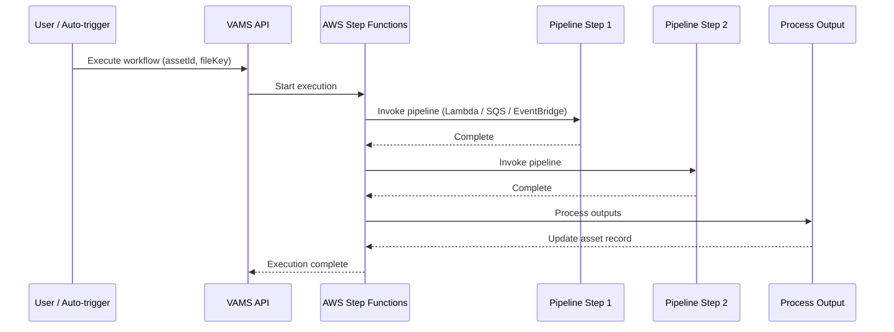

# Pipelines and Workflows


Pipelines and workflows are the processing engine of VAMS. A **pipeline** defines a single processing step -- such as converting a 3D model, generating a thumbnail, or running an AI labeling job -- while a **workflow** chains one or more pipelines into an ordered execution sequence powered by AWS Step Functions.

Together, they enable automated, repeatable processing of visual assets at scale, with support for both synchronous and asynchronous execution patterns.

## Pipelines

A pipeline represents a configurable processing step that operates on asset files. Each pipeline is backed by one of three AWS compute services, giving administrators flexibility to match the execution model to the workload.

### Pipeline fields

Every pipeline is defined by the following fields.

| Field | Type | Description |
|---|---|---|
| `pipelineId` | String (4-64 chars) | Unique identifier for the pipeline. Must match `[-_a-zA-Z0-9]`. |
| `databaseId` | String | The database this pipeline belongs to, or `GLOBAL` for cross-database pipelines. |
| `pipelineType` | `standardFile` or `previewFile` | Whether the pipeline produces standard output files or preview thumbnails. |
| `pipelineExecutionType` | `Lambda`, `SQS`, or `EventBridge` | The AWS service used to invoke the pipeline. |
| `description` | String (4-256 chars) | Human-readable description of the pipeline. |
| `assetType` | String | The input file extension this pipeline accepts (for example, `.e57`, `.las`). |
| `outputType` | String | The output file extension this pipeline produces. |
| `inputParameters` | JSON string (optional) | Default parameters passed to the pipeline at execution time. |
| `waitForCallback` | `Enabled` or `Disabled` | Whether the workflow pauses and waits for the pipeline to call back with a task token. |
| `enabled` | Boolean | Whether the pipeline is available for use in workflows. |

### Pipeline execution types

VAMS supports three execution types, each suited to different processing patterns.

| Execution Type | Invocation | Callback Support | Best For |
|---|---|---|---|
| **Lambda** | Synchronous or asynchronous AWS Lambda invocation | Optional (via `waitForCallback`) | Short-duration processing (up to 15 minutes), built-in VAMS pipelines |
| **SQS** | Asynchronous message to an Amazon SQS queue | Yes (via task tokens) | Long-running jobs dispatched to external consumers, decoupled architectures |
| **EventBridge** | Asynchronous event to an Amazon EventBridge bus | Yes (via task tokens) | Event-driven integrations, fan-out to multiple consumers |

:::info[Callback pattern]
When `waitForCallback` is set to `Enabled`, the workflow sends a task token along with the pipeline payload. The pipeline must call `SendTaskSuccess` or `SendTaskFailure` on the AWS Step Functions API when processing completes. This allows pipelines to run for hours or days without timing out the workflow. You can configure `taskTimeout` (maximum 604,800 seconds / 7 days) and `taskHeartbeatTimeout` to control how long the workflow waits.
:::


### GLOBAL pipelines versus database-specific pipelines

Pipelines can be scoped to a specific database or declared as `GLOBAL`.

- **Database-specific pipelines** have their `databaseId` set to a specific database identifier. They appear only when working within that database.
- **GLOBAL pipelines** have their `databaseId` set to the literal string `GLOBAL`. They are available across all databases and are typically used for shared processing capabilities such as format conversion or thumbnail generation.

:::tip[Built-in pipelines]
VAMS includes several built-in pipelines that are auto-registered as `GLOBAL` during deployment. These include 3D model conversion, point cloud processing, Gaussian splatting, GenAI metadata labeling, and 3D preview thumbnail generation. Built-in pipelines are configured through the CDK deployment configuration. For details, see the [Pipelines](../pipelines/overview.md) section.
:::


### Pipeline permissions

Pipeline access is controlled through the VAMS [permissions model](permissions-model.md). The `pipeline` object type supports constraint fields including `databaseId`, `pipelineId`, `pipelineType`, and `pipelineExecutionType`. Administrators can grant users permission to view and execute pipelines without granting them permission to create or delete pipelines.

## Workflows

A workflow defines an ordered sequence of pipeline steps. When executed, VAMS creates an AWS Step Functions state machine that runs each pipeline in order, passing the output of one step as the input to the next.

### Workflow fields

| Field | Type | Description |
|---|---|---|
| `workflowId` | String (4-64 chars) | Unique identifier for the workflow. |
| `databaseId` | String | The database this workflow belongs to, or `GLOBAL`. |
| `description` | String (4-256 chars) | Human-readable description of the workflow. |
| `specifiedPipelines` | Object | An ordered list of pipeline functions that define the processing sequence. |
| `autoTriggerOnFileExtensionsUpload` | String (optional) | Comma-separated file extensions (for example, `jpg,png,pdf`) or `all` to trigger the workflow automatically when matching files are uploaded. |
| `workflow_arn` | String (read-only) | The Amazon Resource Name (ARN) of the generated AWS Step Functions state machine. |

### Workflow creation

To create a workflow, you specify a `workflowId`, `databaseId`, `description`, and a list of pipeline steps in `specifiedPipelines`. Each pipeline step references an existing pipeline and includes the pipeline's execution configuration.

```json
{
    "workflowId": "convert-and-preview",
    "databaseId": "my-project-db",
    "description": "Convert 3D models and generate preview thumbnails",
    "specifiedPipelines": {
        "functions": [
            {
                "name": "3d-model-conversion",
                "databaseId": "GLOBAL",
                "pipelineType": "standardFile",
                "pipelineExecutionType": "Lambda",
                "outputType": ".glb",
                "waitForCallback": "Disabled"
            },
            {
                "name": "3d-preview-thumbnail",
                "databaseId": "GLOBAL",
                "pipelineType": "previewFile",
                "pipelineExecutionType": "Lambda",
                "outputType": ".gif",
                "waitForCallback": "Disabled"
            }
        ]
    }
}
```

:::note[At least one pipeline required]
Every workflow must include at least one pipeline function in `specifiedPipelines`. The pipelines execute in the order they are listed.
:::


### Workflow execution

Workflows are executed against a specific asset and file. The execution process is:

1. A user (or auto-trigger) initiates the workflow with an `assetId` and `fileKey`.
2. VAMS starts the corresponding AWS Step Functions state machine.
3. Each pipeline step runs in sequence, receiving the asset context and the output paths from the workflow.
4. A process-output step at the end collects pipeline outputs and updates the asset record.



### Auto-trigger on file upload

Workflows can be configured to execute automatically when files with specific extensions are uploaded to an asset. Set the `autoTriggerOnFileExtensionsUpload` field to a comma-separated list of extensions (for example, `e57,las,laz`) or to `all` to match any file type.

When an asset file upload completes, VAMS checks all workflows associated with the asset's database and any `GLOBAL` workflows. If a workflow's auto-trigger extensions match the uploaded file, the workflow is automatically executed.

:::warning[Extension format]
Extensions can be specified with or without a leading dot (for example, `jpg` or `.jpg`). The system normalizes them during validation. Only alphanumeric characters, hyphens, and underscores are allowed in extension names.
:::


### Workflow execution tracking

Each workflow execution is tracked in Amazon DynamoDB with the following information:

| Field | Description |
|---|---|
| `executionId` | Unique identifier for this execution run. |
| `workflowId` | The workflow that was executed. |
| `databaseId` | The database containing the asset. |
| `assetId` | The asset that was processed. |
| `fileKey` | The specific file that triggered or was targeted by the execution. |
| `executionStatus` | Current status (`RUNNING`, `SUCCEEDED`, `FAILED`, `TIMED_OUT`). |
| `startDate` | When the execution started. |
| `stopDate` | When the execution completed (if finished). |

Users can view execution history through the VAMS web interface or the API, subject to the permissions model. Execution listing is filtered by both workflow and asset permissions.

### GLOBAL workflows

Like pipelines, workflows can be scoped to a database or declared as `GLOBAL`. GLOBAL workflows are available for execution against assets in any database and are typically used for common processing sequences that apply across the entire organization.

## Pipeline output paths

When a workflow executes, it generates several Amazon S3 output paths that are passed to each pipeline step. Pipelines must use the correct path for each output type.

| Path | Bucket | Purpose |
|---|---|---|
| `outputS3AssetFilesPath` | Asset bucket | File-level outputs: new files, file previews (`.previewFile.*`) |
| `outputS3AssetPreviewPath` | Asset bucket | Asset-level preview images that represent the asset as a whole |
| `outputS3AssetMetadataPath` | Asset bucket | Metadata files produced by the pipeline |
| `inputOutputS3AssetAuxiliaryFilesPath` | Auxiliary bucket | Temporary working files or special non-versioned viewer data |

:::tip[Choosing the right output path]
Most pipelines that produce file-level outputs (including thumbnails) should write to `outputS3AssetFilesPath`. Use `outputS3AssetPreviewPath` only for asset-level previews. Use the auxiliary path only for temporary files or special non-versioned data such as Potree octree files.
:::


## Related topics

- [Permissions Model](permissions-model.md) -- controlling who can view, execute, and manage pipelines and workflows
- [Files and Versions](files-and-versions.md) -- how pipeline outputs interact with asset versioning
- [Metadata and Schemas](metadata-and-schemas.md) -- how pipeline-generated metadata is stored
