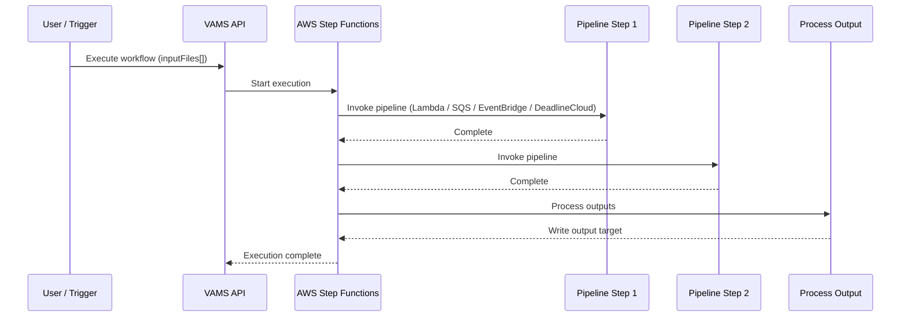

# Pipelines and Workflows


Pipelines, workflows, and executions are the processing engine of VAMS. A **pipeline** defines a single processing step -- such as converting a 3D model, generating a thumbnail, or running an AI labeling job. A **workflow** chains one or more pipelines into an ordered sequence powered by AWS Step Functions. An **execution** is a single run of a workflow over a selected set of input files.

Together, they enable automated, repeatable processing of visual assets at scale, with support for both synchronous and asynchronous execution patterns.

## Pipelines

A pipeline represents a configurable processing step. Each pipeline binds to an AWS compute resource through its `executionConfig`, describes how it consumes input through its `systemConfig`, and can carry reusable configuration templates. Pipelines are scoped to a database (or `GLOBAL`).

For the full pipeline, template, and tag-schema API, see the [Pipelines API](../api/pipelines.md) reference.

### Pipeline execution types

VAMS supports four execution types, each suited to a different processing pattern.

| Execution Type    | Invocation                                        | Callback Support                 | Best For                                                                    |
| ----------------- | ------------------------------------------------- | -------------------------------- | --------------------------------------------------------------------------- |
| **Lambda**        | Synchronous or asynchronous AWS Lambda invocation | Optional (via `waitForCallback`) | Short-duration processing, built-in VAMS pipelines                          |
| **SQS**           | Asynchronous message to an Amazon SQS queue       | Optional (via task tokens)       | Long-running jobs dispatched to external consumers, decoupled architectures |
| **EventBridge**   | Asynchronous event to an Amazon EventBridge bus   | Optional (via task tokens)       | Event-driven integrations, fan-out to multiple consumers                    |
| **DeadlineCloud** | Asynchronous submission to AWS Deadline Cloud     | Mandatory (task token callback)  | Render-farm-style batch processing                                          |

The `executionConfig` object selects the binding. Its `executionType` field is one of `Lambda`, `SQS`, `EventBridge`, or `DeadlineCloud`, and the matching nested block (`lambda`, `sqs`, `eventBridge`, or `deadlineCloud`) supplies the target resource -- for example a Lambda function name or ARN, an Amazon SQS queue URL, or an Amazon EventBridge bus ARN with its source and detail-type.

:::info[Callback pattern]
When `waitForCallback` is `Enabled`, AWS Step Functions sends a task token along with the pipeline payload and pauses until the pipeline calls `SendTaskSuccess` or `SendTaskFailure`. This lets a pipeline run for hours or days without timing out the workflow. `taskTimeout` (maximum 604,800 seconds, one week) and `taskHeartbeatTimeout` control how long the workflow waits. The **DeadlineCloud** type is asynchronous only, so its callback is mandatory and `waitForCallback` is always `Enabled`.
:::

### System configuration

A pipeline's `systemConfig` governs how the pipeline consumes input and whether it uses templates.

| Field                         | Description                                                                                                                |
| ----------------------------- | -------------------------------------------------------------------------------------------------------------------------- |
| `inputFileArity`              | Number of input files the pipeline consumes: `none` (no input file), `one` (exactly one), or `multi` (one or more).        |
| `assetScope`                  | Booleans `crossAssetAllowed`, `singleAssetOnly`, `wholeAssetAllowed`, and `folderAllowed` controlling accepted selections. |
| `metadataInputs`              | Booleans `assetMetadata`, `fileMetadata`, and `fileAttributes` — which metadata is gathered and passed to the pipeline.    |
| `inputFileFilters`            | `allow` and `exclude` lists matching by extension, exact path, file name, or wildcard (`*.previewFile.*`).                 |
| `requireTemplate`             | When `true`, every execution of this pipeline must select one of its configuration templates.                              |
| `allowCustomTemplateOverride` | When `true`, an execution may supply its own raw configuration body in place of a saved template.                          |

### Templates and tag schemas

A pipeline can carry one or more **templates** -- reusable configuration bodies (JSON, YAML, OpenJD, XML, or raw text) that supply the parameters an execution passes to the pipeline. A template body may contain `{{tagName}}` placeholders that are resolved from tag values at execution time.

Each template can define a **tag schema** describing the typed tags (`string`, `integer`, `number`, `boolean`, `string-list`, or `enum`) that fill those placeholders, including labels, defaults, and whether each is required. A pipeline may designate one template as its **default** (`isDefault`); the default is pre-selected on the execute form and is used automatically when a pipeline that requires a template is run without one specified.

A template may also carry `overrides` that replace parts of the pipeline's `systemConfig` (`inputFileArity`, `assetScope`, `metadataInputs`, and `inputFileFilters`) for executions that choose that template.

### GLOBAL pipelines versus database-specific pipelines

Pipelines can be scoped to a specific database or declared as `GLOBAL`.

-   **Database-specific pipelines** set `databaseId` to a specific database identifier and appear only when working within that database.
-   **GLOBAL pipelines** set `databaseId` to the literal string `GLOBAL`. They are available across all databases and are typically used for shared processing capabilities such as format conversion or thumbnail generation.

:::tip[Built-in pipelines]
VAMS includes several built-in pipelines that are auto-registered as `GLOBAL` during deployment. These include 3D model conversion, point cloud processing, Gaussian splatting, GenAI metadata labeling, and 3D preview thumbnail generation. Built-in pipelines are configured through the CDK deployment configuration. For details, see the [Pipelines](../pipelines/overview.md) section.
:::

### Pipeline permissions

Pipeline access is controlled through the VAMS [permissions model](permissions-model.md). The `pipeline` object type supports constraint fields including `databaseId`, `pipelineId`, `pipelineType`, and `pipelineExecutionType`. Administrators can grant users permission to view and execute pipelines without granting them permission to create or delete pipelines.

## Workflows

A workflow defines an ordered sequence of pipeline steps. When created, VAMS generates an AWS Step Functions state machine that runs each pipeline in order. A workflow is scoped to a database (or `GLOBAL`) and references pipelines by identity.

For the full workflow, trigger, and execution API, see the [Workflows API](../api/workflows.md) reference.

### Specified pipelines

`specifiedPipelines` is an ordered, non-empty array of pipeline references. Each entry names one pipeline:

| Field                | Description                                                                      |
| -------------------- | -------------------------------------------------------------------------------- |
| `pipelineId`         | Identifier of the referenced pipeline.                                           |
| `pipelineDatabaseId` | Database that owns the referenced pipeline. Defaults to the workflow's database. |
| `jobName`            | Label for this pipeline step within the workflow.                                |

A `GLOBAL` workflow may reference only `GLOBAL` pipelines; a database workflow may reference `GLOBAL` pipelines or pipelines from its own database. The pipelines execute in the order they are listed.

### System configuration

A workflow's `systemConfig` governs how the workflow consumes input, which asset selections it accepts, how concurrent runs are limited, and where output is written.

| Field                    | Description                                                                                                       |
| ------------------------ | ----------------------------------------------------------------------------------------------------------------- |
| `inputFileArity`         | Number of input files the workflow consumes: `none`, `one`, or `multi`.                                           |
| `assetScope`             | Booleans `crossAssetAllowed`, `singleAssetOnly`, `wholeAssetAllowed`, and `folderAllowed` controlling selections. |
| `metadataInputs`         | Booleans `assetMetadata`, `fileMetadata`, and `fileAttributes` — which metadata is passed to the pipelines.       |
| `inputFileFilters`       | `allow` and `exclude` lists matching by extension, exact path, file name, or wildcard.                            |
| `concurrencyRestriction` | How concurrent executions are limited: `none`, `perAsset`, or `perInputFile`.                                     |
| `outputTarget`           | Where the workflow writes its output: `locationType` (`asset` or `none`) and `allowOverride`.                     |

The `outputTarget.locationType` is `asset` to write output files and metadata to a VAMS asset, or `none` for a results-only workflow that records only results text and logs and writes no asset output. A results-only workflow may still take input files -- for example, reading files to emit a metadata report. When `locationType` is `asset`, `allowOverride` gates whether an execution may redirect output to a chosen asset.

### Triggers

Triggers auto-launch a workflow in response to an event. A `fileUpload` trigger runs the workflow when files matching its `inputFileFilters` are uploaded. Filters match by extension (`*.e57`), exact path, file name, or wildcard. A trigger's `defaultTemplateIds` map supplies the template each included pipeline uses when the trigger launches the workflow, keyed by the composite `<pipelineDatabaseId>:<pipelineId>`.

:::note[Filter format]
Input-file filters accept extension patterns such as `*.jpg` (or the `.jpg` shorthand), exact paths, file names, and wildcards. Matching is case-insensitive. A non-empty `allow` list restricts eligibility to matching files; `exclude` removes matches and takes precedence.
:::

A trigger-launched execution runs as the reserved system identity, not as the user whose action fired the trigger. This is intentional: a user may be permitted to upload a file without being permitted to run the workflow, yet the trigger must still process that upload reliably. Running the execution as the system identity decouples the trigger from the acting user's permissions so it functions consistently regardless of who performed the triggering action. Executions launched directly through the execute endpoint run as the calling user; trigger-launched executions are attributed to the system identity in their execution record and provenance.

### GLOBAL workflows

Like pipelines, workflows can be scoped to a database or declared as `GLOBAL`. GLOBAL workflows are available for execution using assets in any database and are typically used for common processing sequences that apply across the entire organization.

## Executions

An execution is a single run of a workflow. The execute request is **asset-less and multi-file**: input files are supplied in the request body and may span more than one asset, subject to the workflow's configuration.

```
POST /workflows/{workflowDatabaseId}/{workflowId}/execute
```

The request carries an `inputFiles` array, where each entry has a `databaseId`, `assetId`, and `relativeFileKey` (asset-relative, beginning with `/`; `/` selects the whole asset and `/folder/` a folder). When the workflow's `outputTarget` allows override, the request may set `outputAssetId` and `outputDatabaseId` to redirect the output. Per-pipeline parameters (`templateId`, template tag values, or a custom template override) are supplied in `pipelineExecutionParameters`, keyed by pipeline.

### Execution flow

1. A user (or a trigger) submits input files to the workflow's execute endpoint.
2. VAMS authorizes the workflow, every referenced pipeline, and each input and output asset; resolves per-pipeline templates and validates their tags; then cross-validates input-file arity, asset scope, and file filters.
3. VAMS starts the workflow's AWS Step Functions state machine.
4. Each pipeline step runs in sequence, receiving the input files, gathered metadata, and its rendered configuration.
5. An end-state step collects pipeline outputs and, for an asset output target, writes them back to the output asset.


```mermaid
sequenceDiagram
    participant U as User / Trigger
    participant API as VAMS API
    participant SFN as AWS Step Functions
    participant P1 as Pipeline Step 1
    participant P2 as Pipeline Step 2
    participant PO as Process Output

    U->>API: Execute workflow (inputFiles[])
    API->>SFN: Start execution
    SFN->>P1: Invoke pipeline (Lambda / SQS / EventBridge / DeadlineCloud)
    P1-->>SFN: Complete
    SFN->>P2: Invoke pipeline
    P2-->>SFN: Complete
    SFN->>PO: Process outputs
    PO-->>SFN: Write output target
    SFN-->>API: Execution complete
```

### Execution tracking

Each execution is identified by a workflow execution id and tracked in Amazon DynamoDB, independent of any single asset (an execution may span input files across multiple assets). The main execution record holds the workflow identity, status (`NEW`, `RUNNING`, `SUCCEEDED`, `FAILED`, `TIMED_OUT`, `ABORTED`), start and stop dates, trigger type, and the initiating user. Related records capture the input files (with the exact S3 version read), the gathered metadata, per-pipeline configuration snapshots, and the produced outputs.

An output index keyed by `databaseId:assetId` records which execution wrote to each output asset, so a caller with access to an output asset can see the runs that produced it. Execution listings are permission-filtered: an execution is visible when the caller can view its workflow and any of its input assets or its output asset.

:::note[Traceability and logs]
The execution details endpoint returns full input/output traceability -- the underlying pipelines with their rendered configuration, the input files and metadata, the output target, and a listing of all output files, metadata, and results. The logs endpoint returns the stored execution log, falling back to a live Amazon CloudWatch Logs search, and can be narrowed to a single pipeline execution.

Log data is redacted before it is stored or returned: credential-bearing values -- authorization headers, bearer tokens, AWS access-key IDs, JSON web tokens, and labelled secret fields such as `SecretAccessKey` and `SessionToken` -- are replaced with `<redacted>` so they are never surfaced to a caller viewing execution or pipeline logs.
:::

## Pipeline outputs

During an execution, each pipeline writes to a set of Amazon S3 output locations that VAMS provisions and passes to the step. Outputs are categorized so the end-state step can route them correctly:

| Category     | Purpose                                                                         |
| ------------ | ------------------------------------------------------------------------------- |
| **Files**    | File-level outputs: new asset files and file previews (`.previewFile.*`).       |
| **Previews** | Asset-level preview images that represent the asset as a whole.                 |
| **Metadata** | Metadata files produced by the pipeline.                                        |
| **Results**  | Structured result files recorded against the execution (for results-only runs). |

A separate auxiliary location holds temporary working files and special non-versioned viewer data (such as Potree octree files). For output-path conventions and the `assetId` threading pattern that pipeline authors follow, see the pipeline development guide.

## Related topics

-   [Pipelines API](../api/pipelines.md) -- creating pipelines, templates, and tag schemas
-   [Workflows API](../api/workflows.md) -- creating workflows, triggers, and running executions
-   [Permissions Model](permissions-model.md) -- controlling who can view, execute, and manage pipelines and workflows
-   [Files and Versions](files-and-versions.md) -- how pipeline outputs interact with asset versioning
-   [Metadata and Schemas](metadata-and-schemas.md) -- how pipeline-generated metadata is stored
