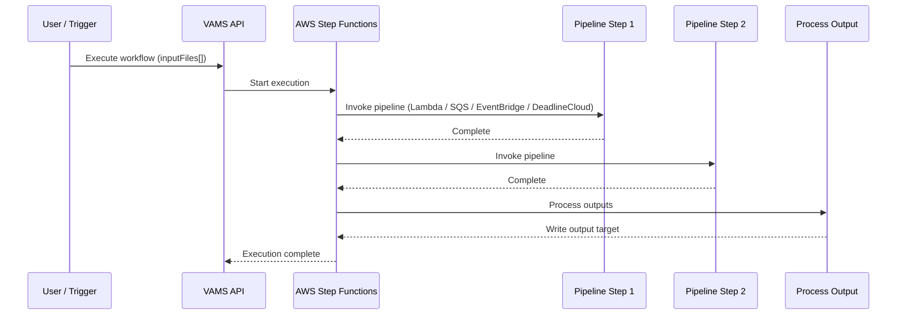

# Pipelines and Workflows


Pipelines, workflows, and executions are the processing engine of VAMS. A **pipeline** defines a single processing step -- such as converting a 3D model, generating a thumbnail, or running an AI labeling job. A **workflow** chains one or more pipelines into an ordered sequence powered by AWS Step Functions. An **execution** is a single run of a workflow over a selected set of input files.

Together, they enable automated, repeatable processing of visual assets at scale, with support for both synchronous and asynchronous execution patterns.

## Pipelines

A pipeline represents a configurable processing step. Each pipeline binds to an AWS compute resource through its `executionConfig`, describes how it consumes input through its `systemConfig`, and can carry reusable configuration templates. Pipelines are scoped to a database (or `GLOBAL`).

A `pipelineId` is unique across every database, including `GLOBAL` -- creating a pipeline with an id that another database already uses is rejected. Workflow ids follow the same rule. Ids identify a pipeline or workflow on their own in execution records, per-pipeline execution parameters, and external references, so an id is never reused in a second database. Omit the id (or send `null`) to have VAMS generate one.

For the full pipeline, template, and tag-schema API, see the [Pipelines API](../api/pipelines.md) reference.

### Pipeline execution types

VAMS supports four execution types, each suited to a different processing pattern.

| Execution Type    | Invocation                                        | Callback Support                 | Best For                                                                    |
| ----------------- | ------------------------------------------------- | -------------------------------- | --------------------------------------------------------------------------- |
| **Lambda**        | Synchronous or asynchronous AWS Lambda invocation | Optional (via `waitForCallback`) | Short-duration processing, built-in VAMS pipelines                          |
| **SQS**           | Asynchronous message to an Amazon SQS queue       | Optional (via task tokens)       | Long-running jobs dispatched to external consumers, decoupled architectures |
| **EventBridge**   | Asynchronous event to an Amazon EventBridge bus   | Optional (via task tokens)       | Event-driven integrations, fan-out to multiple consumers                    |
| **DeadlineCloud** | Asynchronous submission to AWS Deadline Cloud     | Mandatory (task token callback)  | Render-farm-style batch processing                                          |

The `executionConfig` object selects the binding. Its `executionType` field is one of `Lambda`, `SQS`, `EventBridge`, or `DeadlineCloud`, and the matching nested block (`lambda`, `sqs`, `eventBridge`, or `deadlineCloud`) supplies the target resource -- for example a Lambda function name or ARN, an Amazon SQS queue URL, or an Amazon EventBridge bus ARN with its source and detail-type.

`DeadlineCloud` is selectable only when the deployment enables `app.pipelines.deadlineCloudExecutionTypeEnabled` (default `false`); pipeline create and update reject the type with `400` otherwise. It is unavailable in the GovCloud and EU Sovereign partitions. See the [configuration reference](../deployment/configuration-reference.md).

:::info[Callback pattern]
When `waitForCallback` is `Enabled`, AWS Step Functions sends a task token along with the pipeline payload and pauses until the pipeline calls `SendTaskSuccess` or `SendTaskFailure`. This lets a pipeline run for hours or days without timing out the workflow. `taskTimeout` (maximum 604,800 seconds, one week) and `taskHeartbeatTimeout` control how long the workflow waits. The **DeadlineCloud** type is asynchronous only, so its callback is mandatory and `waitForCallback` is always `Enabled`.
:::

### System configuration

A pipeline's `systemConfig` governs how the pipeline consumes input and whether it uses templates.

| Field                         | Description                                                                                                                                                                                |
| ----------------------------- | ------------------------------------------------------------------------------------------------------------------------------------------------------------------------------------------ |
| `inputFileArity`              | Number of input files the pipeline consumes: `none` (no input file), `one` (exactly one), or `multi` (one or more).                                                                        |
| `assetScope`                  | Booleans `crossAssetAllowed`, `singleAssetOnly`, `wholeAssetAllowed`, and `folderAllowed` controlling accepted selections. The shorthand `wholeAsset` is accepted for `wholeAssetAllowed`. |
| `metadataInputs`              | Booleans `assetMetadata`, `fileMetadata`, `fileAttributes`, and `databaseMetadata` — which metadata is gathered and passed to the pipeline. See [Metadata inputs](#metadata-inputs).       |
| `inputFileFilters`            | `allow` and `exclude` lists matching by extension, exact path, file name, or wildcard (`*.previewFile.*`). See [Input-file filters](#input-file-filters).                                  |
| `requireTemplate`             | When `true`, every execution of this pipeline must select one of its configuration templates.                                                                                              |
| `allowCustomTemplateOverride` | When `true`, an execution may supply its own raw configuration body in place of a saved template.                                                                                          |

### Templates and tag schemas

A pipeline can carry one or more **templates** -- reusable configuration bodies (JSON, YAML, OpenJD, XML, or raw text) that supply the parameters an execution passes to the pipeline. A template body may contain `\{\{tagName\}\}` placeholders. These are either the template's own schema tags (filled in at execution time) or **system tags** that the engine resolves automatically per pipeline task — execution and pipeline-task identity, timestamps, the input files, the output and auxiliary locations, the resolved metadata, and the Deadline Cloud farm values. See [System template tags](../api/pipelines.md#system-template-tags) for the full catalog. A system tag name is reserved: a template's own tag key may not reuse one, nor begin with the reserved `metadata_` prefix, and such a key is rejected when the tag schema is saved.

Each template can define a **tag schema** describing the typed tags (`string`, `integer`, `number`, `boolean`, `string-list`, or `enum`) that fill those placeholders, including labels, defaults, and whether each is required. In a `json` config body the declared type also fixes where the placeholder sits: a tag that renders a JSON number, boolean, or array is the whole value and takes no quotes (`"steps": \{\{STEPS\}\}`), while a `string` or `enum` tag goes inside the string it fills (`"prompt": "\{\{PROMPT\}\}"`). The body is checked against its own tag schema when it is saved, so a placeholder in the wrong position is reported then rather than delivering the wrong type to the pipeline at run time. A pipeline may designate one template as its **default** (`isDefault`); the default is pre-selected on the execute form and is used automatically when a pipeline that requires a template is run without one specified.

A template may also carry `overrides` that replace parts of the pipeline's `systemConfig` (`inputFileArity`, `assetScope`, `metadataInputs`, and `inputFileFilters`) for executions that choose that template.

### GLOBAL pipelines versus database-specific pipelines

Pipelines can be scoped to a specific database or declared as `GLOBAL`.

-   **Database-specific pipelines** set `databaseId` to a specific database identifier and appear only when working within that database.
-   **GLOBAL pipelines** set `databaseId` to the literal string `GLOBAL`. They are available across all databases and are typically used for shared processing capabilities such as format conversion or thumbnail generation.

:::tip[Built-in pipelines]
VAMS includes several built-in pipelines that are auto-registered as `GLOBAL` during deployment. These include 3D model conversion, point cloud processing, Gaussian splatting, GenAI metadata labeling, and 3D preview thumbnail generation. Built-in pipelines are configured through the CDK deployment configuration. For details, see the [Pipelines](../pipelines/overview.md) section.
:::

### Pipeline permissions

Pipeline access is controlled through the VAMS [permissions model](permissions-model.md). The `pipeline` object type supports constraint fields including `databaseId`, `pipelineId`, `category`, and `pipelineExecutionType`. Administrators can grant users permission to view and execute pipelines without granting them permission to create or delete pipelines.

## Workflows

A workflow defines an ordered sequence of pipeline steps. When created, VAMS generates an AWS Step Functions state machine that runs each pipeline in order. A workflow is scoped to a database (or `GLOBAL`) and references pipelines by identity.

For the full workflow, trigger, and execution API, see the [Workflows API](../api/workflows.md) reference.

### Specified pipelines

`specifiedPipelines` is an ordered, non-empty array of pipeline references. Each entry names one pipeline:

| Field                | Description                                                                                             |
| -------------------- | ------------------------------------------------------------------------------------------------------- |
| `pipelineId`         | Identifier of the referenced pipeline.                                                                  |
| `pipelineDatabaseId` | Database that owns the referenced pipeline. Defaults to the workflow's database.                        |
| `jobName`            | Label for this pipeline step within the workflow. Optional.                                             |
| `defaultTemplateId`  | Template this step resolves against when the execute request supplies no `templateId` for it. Optional. |

A `GLOBAL` workflow may reference only `GLOBAL` pipelines; a database workflow may reference `GLOBAL` pipelines or pipelines from its own database. The pipelines execute in the order they are listed.

:::warning[List each pipeline at most once per workflow]
A workflow cannot use the same pipeline for two of its steps. Everything resolved per step — the execution parameters, the template configuration, and the filtered input files — is keyed by `pipelineDatabaseId:pipelineId`, so a second reference to the same pipeline overwrites the first step's resolved configuration. Both steps then run with the same settings, and nothing reports a problem.

When one model or container needs to run twice in a workflow with different settings — train and then evaluate, say — define **two pipelines** that share a container image, and list one of each. That also gives each step its own default template and its own output folder.
:::

#### Job names

A step's `jobName` labels the step within the workflow. It does two things: it names the step in the workflow's state machine, and — for the workflow's **first** step — it names the folder that holds the whole execution's output.

An execution writes to one shared set of output prefixes, derived from the first step:

```
pipelines/{firstStepName}/{generatedJobName}/output/{executionId}/files/
```

`firstStepName` is the first step's `jobName`, or its `pipelineId` when the `jobName` is empty. `generatedJobName` is that same name with a short generated prefix, assigned when the workflow's state machine is built. Every step of the run writes beneath these prefixes; the steps do not each get a folder of their own.

The value is 3–63 characters of letters, numbers, hyphens, and underscores, and each step in a workflow is expected to carry its own: a job name repeated across two steps names both of them identically in the state machine and in the run's logs, leaving no way to tell the two apart. The web workflow editor refuses a repeat, comparing case-insensitively.

It is a fixed label rather than a template: `{{tag}}` placeholders are **not** substituted in a `jobName` and are rejected on save, because the name is written into the state machine once when the workflow is deployed, not per execution.

##### When to set a job name

Leaving `jobName` blank is the normal choice — the pipeline id already labels the step. Setting one is worth it when that id does not describe the step's role clearly enough:

-   **The first step's role is narrower than its pipeline's name suggests.** A general-purpose conversion pipeline used here specifically to produce a web preview gives the execution a folder named after the pipeline; naming the step `convert-for-web` records what the run was for.
-   **The first step's pipeline id is opaque.** A generated or abbreviated id (for example `pl-7f3a91`) produces an output folder nobody can interpret later.
-   **The step is one of several in a busy workflow** and the state machine is easier to follow with each step named for what it does.

:::warning[Separate a run's output with the output path prefix, not the job name]
Only the first step's name reaches the output path, and the generated portion of the folder name is reassigned whenever the workflow's pipeline list changes — so an S3 prefix built from a job name is neither per-step nor stable across edits. To give runs their own predictable folders, set the workflow's `defaultOutputFileBaseExecutionPathExtension` (or an execution's own output path prefix), which resolve `{{tag}}` placeholders at launch: `/\{\{executionId\}\}/` gives every run its own folder, `/\{\{jobStartDate\}\}/` a folder per day.
:::

:::note[`jobName` the field versus `\{\{jobName\}\}` the tag]
These are related but not interchangeable. The `jobName` **field** above is a fixed label you set on a pipeline reference and accepts no tags. The `\{\{jobName\}\}` **tag** is a system tag available in output path prefixes and template bodies, where it resolves to the generated job name of the step it renders for. Writing `\{\{jobName\}\}` into the `jobName` field is rejected.
:::

### System configuration

A workflow's `systemConfig` governs how the workflow consumes input, which asset selections it accepts, how concurrent runs are limited, and where output is written.

| Field                                         | Description                                                                                                                                                                                                                                             |
| --------------------------------------------- | ------------------------------------------------------------------------------------------------------------------------------------------------------------------------------------------------------------------------------------------------------- |
| `inputFileArity`                              | Number of input files the workflow consumes: `none`, `one`, or `multi`. Authored, not derived — set it to the MAXIMUM any pipeline/template combination in the workflow can require, since a template may raise a pipeline's own arity at execute time. |
| `assetScope`                                  | Booleans `crossAssetAllowed`, `singleAssetOnly`, `wholeAssetAllowed`, and `folderAllowed` controlling selections.                                                                                                                                       |
| `metadataInputs`                              | Booleans `assetMetadata`, `fileMetadata`, `fileAttributes`, and `databaseMetadata` — which metadata is passed to the pipelines. See [Metadata inputs](#metadata-inputs).                                                                                |
| `inputFileFilters`                            | `allow` and `exclude` lists matching by extension, exact path, file name, or wildcard. An omitted or `*` allow list defers to the pipelines; see [Input-file filters](#input-file-filters).                                                             |
| `concurrencyRestriction`                      | How concurrent executions are limited: `none`, `perAsset`, or `perInputFile`.                                                                                                                                                                           |
| `outputTarget`                                | Where the workflow writes its output: `locationType` (`asset` or `none`) and `allowOverride`.                                                                                                                                                           |
| `allowWorkflowTriggerChaining`                | Whether another workflow's output may fire this workflow's triggers. Self-output never re-triggers, whatever this is set to. Defaults to `false`.                                                                                                       |
| `defaultOutputFileBaseExecutionPathExtension` | Output path prefix used when an execution names none, stored unresolved so `\{\{tag\}\}` placeholders resolve per run (e.g. `/\{\{executionId\}\}/`). Empty means outputs land at the asset root.                                                       |

The `outputTarget.locationType` is `asset` to write output files and metadata to a VAMS asset, or `none` for a results-only workflow that records only results text and logs and writes no asset output. A results-only workflow may still take input files -- for example, reading files to emit a metadata report. When `locationType` is `asset`, `allowOverride` gates whether an execution may redirect output to a chosen asset.

### Triggers

Triggers auto-launch a workflow in response to an event. A `fileUpload` trigger runs the workflow when files matching its `inputFileFilters` are uploaded. Filters match by extension (`*.e57`), exact path, file name, or wildcard. A trigger's `defaultTemplateIds` map supplies the template each included pipeline uses when the trigger launches the workflow, keyed by the composite `<pipelineDatabaseId>:<pipelineId>`.

A workflow may carry several triggers of one type, each with its own filters and default templates, and an upload launches the workflow once per matching trigger — so one workflow can process different uploads with different templates. Each trigger is addressed by its key: the bare type for a workflow's first trigger of that type, or `<type>#<triggerId>` for an additional one. A workflow that restricts concurrency per asset supports only one trigger of a type, and two triggers of one type may not name the same default templates.

:::note[Filter format]
Input-file filters accept extension patterns such as `*.jpg` (or the `.jpg` shorthand), exact paths, file names, and wildcards. Matching is case-insensitive. A non-empty `allow` list restricts eligibility to matching files; `exclude` removes matches and takes precedence. The same rules described in [Input-file filters](#input-file-filters) apply to a trigger's filters.
:::

A trigger-launched execution runs as the reserved system identity, not as the user whose action fired the trigger. This is intentional: a user may be permitted to upload a file without being permitted to run the workflow, yet the trigger must still process that upload reliably. Running the execution as the system identity decouples the trigger from the acting user's permissions so it functions consistently regardless of who performed the triggering action. Executions launched directly through the execute endpoint run as the calling user; trigger-launched executions are attributed to the system identity in their execution record and provenance.

### Input-file filters

An `inputFileFilters` block has two lists, and each is optional:

| List      | Meaning                                                                                           |
| --------- | ------------------------------------------------------------------------------------------------- |
| `allow`   | The file types eligible to be processed. **Omitted, empty, or `*` means every file is eligible.** |
| `exclude` | Files removed from that set. **Omitted or empty means nothing is excluded.**                      |

`exclude` is applied after `allow`, so an exclusion always wins over an inclusion.

Because an absent `allow` list means "everything", a filter is a way to _narrow_ eligibility, never to grant it. A pipeline that declares no filters accepts any file its container can read.

:::warning[`exclude` may not match everything]
A match-everything pattern (`*`, `**`, `*.*`, `/*`, `/**`) in an `exclude` list is rejected when the pipeline, template, workflow, or trigger is saved. Since `exclude` is applied last, such a pattern would remove every file and leave the pipeline or workflow permanently unable to run. To exclude nothing, leave the list empty or omit it. The same patterns are valid in an `allow` list, where they simply mean "allow everything".
:::

#### The resolution chain

Filters are declared at up to three levels, and a file must satisfy all of them to reach a pipeline:

```
workflow.systemConfig.inputFileFilters       the outer boundary for the whole execution
  └── pipeline.systemConfig.inputFileFilters what that step accepts
        └── template.overrides.inputFileFilters  replaces the pipeline's, when the step uses a template
```

Resolution reads down the chain, and an open list at one level defers to the next:

-   When the workflow's `allow` list names specific types, that list is the boundary for the execution. No pipeline can widen it — a file the workflow excludes never reaches any step.
-   When the workflow's `allow` list is open, eligibility comes from the pipelines instead. A file is eligible when **any** step in the workflow accepts it, so a workflow combining a mesh pipeline and a point-cloud pipeline accepts both kinds of file.
-   A chosen template's `overrides.inputFileFilters` replaces its pipeline's list entirely for that execution, which is how one pipeline supports several modes with different inputs.
-   `exclude` lists accumulate: an exclusion at any level removes the file.

Validation applies this order at execution time. The selected files are first narrowed by the workflow's filters, and each pipeline is then checked against **that** narrowed set. If any pipeline is left without the input it requires, the whole execution is rejected rather than launching a step that cannot run.

#### Seeing what a workflow accepts

Because the chain spans several records, a workflow response reports the restriction it effectively imposes in `aggregateWorkflowPipelineInputFileFilters` — the workflow's own `allow` list when it names specific types, otherwise the combined lists of its pipelines.

:::note[The aggregate excludes template overrides]
`aggregateWorkflowPipelineInputFileFilters` carries `includesTemplateOverrides: false`. A template is chosen per execution, so its overrides cannot be known in advance and are not folded in. Treat the aggregate as a guide when browsing workflows, and resolve the full chain — including the chosen template — when validating a specific set of files. The web interface does this, which is why the file types it shows can narrow once a template is selected.
:::

### GLOBAL workflows

Like pipelines, workflows can be scoped to a database or declared as `GLOBAL`. GLOBAL workflows are available for execution using assets in any database and are typically used for common processing sequences that apply across the entire organization.

## Executions

An execution is a single run of a workflow. The execute request is **asset-less and multi-file**: input files are supplied in the request body and may span more than one asset, subject to the workflow's configuration.

```
POST /workflows/{workflowDatabaseId}/{workflowId}/execute
```

The request carries an `inputFiles` array, where each entry has a `databaseId`, `assetId`, and `relativeFileKey` (asset-relative, beginning with `/`; `/` selects the whole asset and `/folder/` a folder). When the workflow's `outputTarget` allows override, the request may set `outputAssetId` and `outputDatabaseId` to redirect the output. Per-pipeline parameters (`templateId`, template tag values, or a custom template override) are supplied in `pipelineExecutionParameters`, keyed by pipeline.

`metadataSourceDatabaseId` and `metadataSourceAssets` name entities whose stored metadata the run reads. They are not input files: they carry no file key, are exempt from the arity and filter checks, and do not resolve an output target. Both are optional at every arity, and they are how an `inputFileArity: none` workflow — one whose pipelines generate rather than transform — is still given asset and database metadata to work from. `metadataSourceDatabaseId` names one concrete database (`GLOBAL` is rejected); `metadataSourceAssets` is a list of `{databaseId, assetId}` bounded by the workflow's asset span.

### Metadata inputs

Alongside its input files, an execution gathers the stored metadata its pipelines declared through `metadataInputs` and writes it into a metadata file each pipeline step reads. Four kinds of metadata are gathered independently: each involved asset's own metadata (`assetMetadata`), each input file's metadata (`fileMetadata`) and attributes (`fileAttributes`), and each involved database's own metadata (`databaseMetadata`). The workflow's booleans are the outer gate and each pipeline's own decide what that step receives, so a type reaches a pipeline only when both have it on.

Which entities a run gathers from follows from its selection: every asset an input file belongs to, every asset the request named purely as a metadata source, and every distinct database of those assets. A run with no input files has nothing to derive from, so it gathers the assets and the single database the request named as sources.

A named source database the caller cannot read fails the launch, since the caller asked for metadata they may not have. A database merely _derived_ from an input or source asset is skipped instead, because an asset `GET` does not imply a database `GET` — the run then captures no metadata for it, and the launch reports that in its warnings.

Database metadata is read-only. It is supplied to a pipeline as input, and a pipeline never writes metadata back to a database — metadata write-back targets assets and files.

Naming metadata sources is optional at every arity, and nothing makes it mandatory. A pipeline that needs particular metadata to run checks for it itself and fails its own step when it is absent, rather than the execution being rejected for omitting a source.

The metadata gathered for one entity is bounded independently of every other, so a run over many entities leaves each entity its own budget: at most 1,000 metadata entries and 300 KB for each database, each asset, each file's metadata, and each file's attributes. A run over three databases holding five assets and ten files therefore gathers up to 1,000 entries for each of the three databases, each of the five assets, and each of the ten files. An execution never truncates silently — a bounded entity is named in the warnings the execute response returns. An execution reads at most 1,000 input files and 1,000 metadata-source assets. For the full field reference, see [Metadata inputs](../api/workflows.md#metadata-inputs) in the Workflows API.

### Execution flow

1. A user (or a trigger) submits input files to the workflow's execute endpoint.
2. VAMS authorizes the workflow, every referenced pipeline, each input and output asset, and every asset and database the run gathers metadata from; resolves per-pipeline templates and validates their tags; then cross-validates input-file arity, asset scope, and file filters.
3. VAMS starts the workflow's AWS Step Functions state machine.
4. Each pipeline step runs in sequence, receiving the input files, gathered metadata, and its rendered configuration.
5. An end-state step collects pipeline outputs and, for an asset output target, writes them back to the output asset.


```mermaid
sequenceDiagram
    participant U as User / Trigger
    participant API as VAMS API
    participant SFN as AWS Step Functions
    participant P1 as Pipeline Step 1
    participant P2 as Pipeline Step 2
    participant PO as Process Output

    U->>API: Execute workflow (inputFiles[])
    API->>SFN: Start execution
    SFN->>P1: Invoke pipeline (Lambda / SQS / EventBridge / DeadlineCloud)
    P1-->>SFN: Complete
    SFN->>P2: Invoke pipeline
    P2-->>SFN: Complete
    SFN->>PO: Process outputs
    PO-->>SFN: Write output target
    SFN-->>API: Execution complete
```

### Execution tracking

Each execution is identified by a workflow execution id and tracked in Amazon DynamoDB, independent of any single asset (an execution may span input files across multiple assets). The main execution record holds the workflow identity, status (`NEW`, `RUNNING`, `SUCCEEDED`, `FAILED`, `TIMED_OUT`, `ABORTED`), start and stop dates, trigger type, and the initiating user. Related records capture the input files (with the exact S3 version read), the gathered metadata, per-pipeline configuration snapshots, and the produced outputs.

An output index keyed by `databaseId:assetId` records which execution wrote to each output asset, so a caller with access to an output asset can see the runs that produced it. Execution listings are permission-filtered: an execution is visible when the caller can view its workflow and every asset the run read — each input file's asset plus each asset named as a metadata source. Every asset is required rather than any one of them because the listing and the details both return the metadata of all of them. A run with no inputs of either kind is associated only with the asset it wrote to, which carries the check in their place; a results-only run has neither, leaving the workflow as its whole gate. An asset that has been permanently deleted is authorized on the database it lived in, so deleting an asset leaves the history of the runs against it reachable by whoever can read that database rather than by nobody. Archiving an asset is not a deletion: its record is retained, so it stays authorized on its own attributes.

:::note[Traceability and logs]
The execution details endpoint returns full input/output traceability -- the underlying pipelines with their rendered configuration, the input files and metadata, the output target, and a listing of all output files, metadata, and results. The logs endpoint returns the stored execution log, falling back to a live Amazon CloudWatch Logs search, and can be narrowed to a single pipeline execution.

Log data is redacted before it is stored or returned: credential-bearing values -- authorization headers, bearer tokens, AWS access-key IDs, JSON web tokens, and labelled secret fields such as `SecretAccessKey` and `SessionToken` -- are replaced with `<redacted>` so they are never surfaced to a caller viewing execution or pipeline logs.
:::

## Pipeline outputs

During an execution, each pipeline writes to a set of Amazon S3 output locations that VAMS provisions and passes to the step. Outputs are categorized so the end-state step can route them correctly:

| Category     | Purpose                                                                                                                                             |
| ------------ | --------------------------------------------------------------------------------------------------------------------------------------------------- |
| **Files**    | File-level outputs: new asset files and file previews (`.previewFile.*`).                                                                           |
| **Previews** | Asset-level preview images that represent the asset as a whole.                                                                                     |
| **Metadata** | Metadata files produced by the pipeline.                                                                                                            |
| **Results**  | Structured result files recorded against the execution. Collected for every run, whatever the output target — not only for a results-only workflow. |

A separate auxiliary location holds temporary working files and special non-versioned viewer data (such as Potree octree files). For output-path conventions and the `assetId` threading pattern that pipeline authors follow, see [Amazon S3 output path conventions](../pipelines/custom-pipelines.md#amazon-s3-output-path-conventions) and [Threading assetId through the pipeline](../pipelines/custom-pipelines.md#threading-assetid-through-the-pipeline).

:::note[What an execution's output listing covers]
An execution records the files, metadata, and results it wrote to its output **asset**, each with the
version it produced. Anything a pipeline writes to the **auxiliary** location is not recorded and does
not appear in the execution's outputs — including special preview-file locations. Those are working and
viewer-support files rather than tracked asset outputs, so they exist in the auxiliary bucket without a
corresponding output record.
:::

## Related topics

-   [Pipelines API](../api/pipelines.md) -- creating pipelines, templates, and tag schemas
-   [Workflows API](../api/workflows.md) -- creating workflows, triggers, and running executions
-   [Permissions Model](permissions-model.md) -- controlling who can view, execute, and manage pipelines and workflows
-   [Files and Versions](files-and-versions.md) -- how pipeline outputs interact with asset versioning
-   [Metadata and Schemas](metadata-and-schemas.md) -- how pipeline-generated metadata is stored
