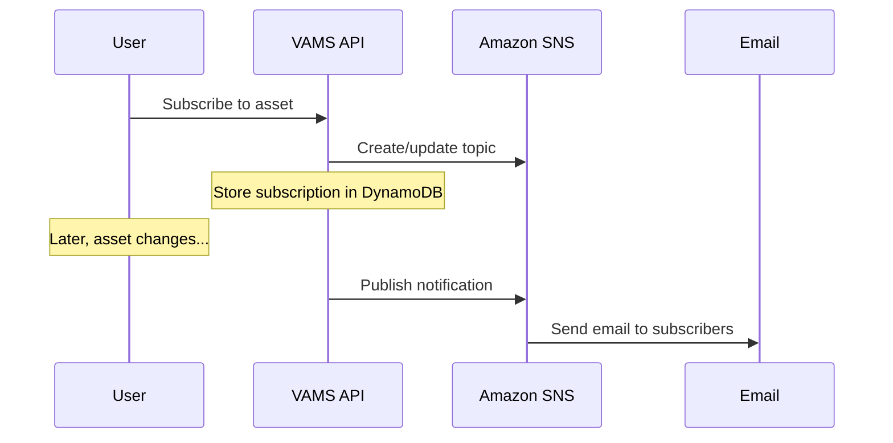

# Subscriptions

Subscriptions provide email notifications when asset versions change. Users can subscribe to specific assets and receive alerts when new files are uploaded, versions are created, or other significant changes occur.

## Subscription model

Each subscription record tracks a specific event on a specific entity, along with the list of email addresses that should be notified.

| Field         | Description                                                      |
| ------------- | ---------------------------------------------------------------- |
| `eventName`   | The event to monitor. Currently supports `Asset Version Change`. |
| `entityName`  | The type of entity being monitored. Currently supports `Asset`.  |
| `entityId`    | The unique identifier of the asset being monitored.              |
| `subscribers` | An array of email addresses that receive notifications.          |

## How subscriptions work

1. **Subscribe** -- A user calls the subscriptions API with an asset identifier and a list of email addresses. VAMS creates an Amazon Simple Notification Service (Amazon SNS) topic for the asset (if one does not already exist) and stores the subscription record in Amazon DynamoDB.

2. **Trigger** -- When the monitored event occurs (for example, a new asset version is created or files are modified), VAMS publishes a notification to the asset's Amazon SNS topic.

3. **Notify** -- Amazon SNS delivers email notifications to all subscribed addresses.

## Managing subscriptions

| Operation           | API Endpoint               | Description                                                         |
| ------------------- | -------------------------- | ------------------------------------------------------------------- |
| List subscriptions  | `GET /subscriptions`       | List all subscriptions the current user has access to view.         |
| Create subscription | `POST /subscriptions`      | Subscribe one or more email addresses to an asset event.            |
| Update subscription | `PUT /subscriptions`       | Modify the subscriber list for an existing subscription.            |
| Check subscription  | `POST /check-subscription` | Check whether a subscription exists for a specific asset and event. |
| Unsubscribe         | `DELETE /unsubscribe`      | Remove a subscription.                                              |

## Subscription permissions

Subscription access is governed by the `asset` object type in the permissions model. To manage subscriptions for an asset, a user must have the appropriate permissions on the asset itself (including `databaseId`, `assetName`, `assetType`, and `tags` constraint fields). This ensures that users cannot subscribe to assets they are not authorized to view.

## Related topics

-   [Assets](assets.md) -- the entities that subscriptions monitor
-   [Permissions Model](permissions-model.md) -- access control for subscription management
-   [Subscriptions User Guide](../user-guide/subscriptions.md) -- step-by-step subscription management instructions
