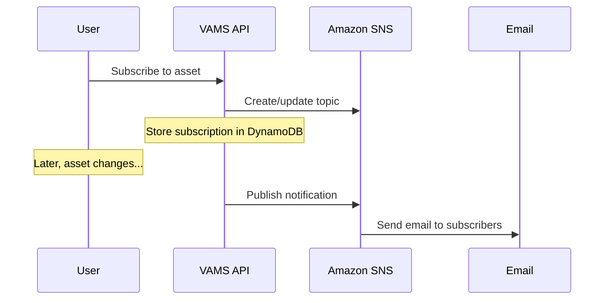

# Subscriptions

Subscriptions provide email notifications when asset versions change. You can subscribe to specific assets and receive alerts when new files are uploaded, versions are created, or other significant changes occur.

## Subscription model

A subscription is made of three parts: the **event** to watch for, the **entity** to watch, and the **subscribers** to notify. The event is an asset version change, and the entity is a single asset, so one subscription monitors one asset for changes to its content.

Subscribers are named by user ID. VAMS resolves each subscriber's email address from their user profile when it sends a notification, so a subscriber needs an email address on their profile to receive one.

For the field-level reference, see the [Subscriptions API](../api/subscriptions.md#create-a-subscription).

## How subscriptions work

```mermaid
sequenceDiagram
    participant U as User
    participant API as VAMS API
    participant SNS as Amazon SNS
    participant E as Email

    U->>API: Subscribe to asset
    API->>SNS: Create/update topic
    Note over API: Store subscription in DynamoDB

    Note over U: Later, asset changes...
    API->>SNS: Publish notification
    SNS->>E: Send email to subscribers
```

1. **Subscribe** -- You choose an asset and supply the email addresses to notify. VAMS creates an Amazon Simple Notification Service (Amazon SNS) topic for the asset (if one does not already exist) and stores the subscription record.

2. **Trigger** -- When the monitored event occurs (for example, a new asset version is created or files are modified), VAMS publishes a notification to the asset's Amazon SNS topic.

3. **Notify** -- Amazon SNS delivers email notifications to all subscribed addresses.

## Managing subscriptions

You can create a subscription, review the subscriptions you have access to, change the email addresses on an existing subscription, check whether an asset is already monitored, and unsubscribe. Each of these is available from the web interface -- see the [Subscriptions User Guide](../user-guide/subscriptions.md) for the procedures.

The same operations are available programmatically for automation and custom integrations. See the [Subscriptions API](../api/subscriptions.md) reference.

## Subscription permissions

Subscription access is governed by the `asset` object type in the permissions model. To manage subscriptions for an asset, a user must have the appropriate permissions on the asset itself (including `databaseId`, `assetName`, `assetType`, and `tags` constraint fields). This ensures that users cannot subscribe to assets they are not authorized to view.

## Related topics

-   [Assets](assets.md) -- the entities that subscriptions monitor
-   [Permissions Model](permissions-model.md) -- access control for subscription management
-   [Subscriptions User Guide](../user-guide/subscriptions.md) -- step-by-step subscription management instructions
