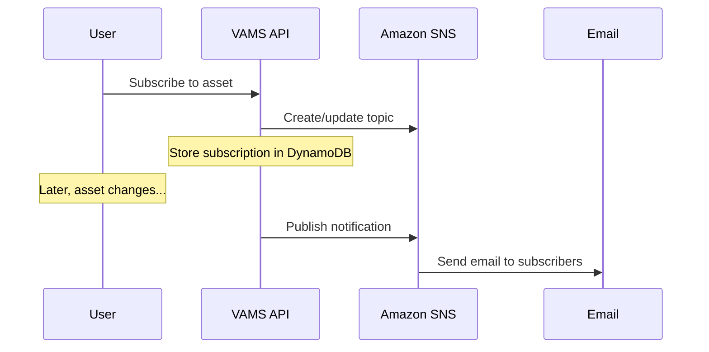

# Tags and Subscriptions

Tags provide a flexible classification system for organizing and filtering assets, while subscriptions deliver email notifications when assets change. Together, they help teams stay organized and informed as visual assets evolve.

## Tags

Tags are labels that can be applied to assets for categorization, filtering, and access control. The VAMS tagging system consists of two components: **tag types** and **tags**.

### Tag types

A tag type defines a named category that groups related tags together. Tag types provide organizational structure and can enforce tagging requirements on assets.

| Field         | Description                                                                              |
| ------------- | ---------------------------------------------------------------------------------------- |
| `tagTypeName` | Unique name for the tag type (for example, `Project Phase`, `Classification`, `Region`). |
| `required`    | When set to `true`, every asset must have at least one tag from this tag type.           |

:::tip[Required tag types]
Marking a tag type as required is useful for enforcing organizational standards. For example, a `Classification` tag type marked as required ensures that every asset is classified before it can be considered complete.
:::

### Tags

A tag is an individual label associated with a tag type. Tags are assigned to assets and appear as filterable attributes in search and listing views.

| Field         | Description                                                                      |
| ------------- | -------------------------------------------------------------------------------- |
| `tagName`     | The display name of the tag (for example, `Design`, `Construction`, `As-Built`). |
| `tagTypeName` | The tag type this tag belongs to.                                                |

### How tags are assigned

Tags are assigned to assets at creation time or through subsequent updates. An asset can have multiple tags from different tag types. Tags are stored as a string array on the asset record and are indexed in Amazon OpenSearch Service for search.

```json
{
    "assetName": "Building-A-Scan",
    "databaseId": "construction-db",
    "tags": ["Design", "Phase-1", "Exterior"]
}
```

### Tag-based filtering

Tags are indexed in Amazon OpenSearch Service alongside other asset metadata. Users can filter assets by tag values in the search interface, enabling quick discovery of assets that share common characteristics.

### Tags and permissions

Tags are a constraint field in the VAMS [permissions model](permissions-model.md). Administrators can create permission rules that reference tags to control access at a granular level.

**Tag-based access control examples:**

-   Grant read-only access to assets tagged with `published`.
-   Deny modification of assets tagged with `locked` or `approved`.
-   Restrict a team to only assets tagged with their project name.

The `tags` field is evaluated using string matching operators (`contains`, `does_not_contain`, `equals`). For example, a deny constraint with `tags contains "locked"` prevents modification of any asset whose tag list includes the value `locked`.

:::warning[Tags are shared across databases]
Tags and tag types are global resources -- they are not scoped to individual databases. When configuring permissions for database-scoped roles, it is recommended to grant read-only access to tags and tag types to prevent users from modifying shared resources. See the [Permissions Model](permissions-model.md) for recommended constraint patterns.
:::

### Tag and tag type permissions

Access to tags and tag types is controlled through dedicated object types in the permissions model.

| Object Type | Constraint Field | Description                                                            |
| ----------- | ---------------- | ---------------------------------------------------------------------- |
| `tag`       | `tagName`        | Controls who can create, read, update, and delete individual tags.     |
| `tagType`   | `tagTypeName`    | Controls who can create, read, update, and delete tag type categories. |

## Subscriptions

Subscriptions provide email notifications when asset versions change. Users can subscribe to specific assets and receive alerts when new files are uploaded, versions are created, or other significant changes occur.

### Subscription model

Each subscription record tracks a specific event on a specific entity, along with the list of email addresses that should be notified.

| Field         | Description                                                      |
| ------------- | ---------------------------------------------------------------- |
| `eventName`   | The event to monitor. Currently supports `Asset Version Change`. |
| `entityName`  | The type of entity being monitored. Currently supports `Asset`.  |
| `entityId`    | The unique identifier of the asset being monitored.              |
| `subscribers` | An array of email addresses that receive notifications.          |

### How subscriptions work



1. **Subscribe** -- A user calls the subscriptions API with an asset identifier and a list of email addresses. VAMS creates an Amazon Simple Notification Service (Amazon SNS) topic for the asset (if one does not already exist) and stores the subscription record in Amazon DynamoDB.

2. **Trigger** -- When the monitored event occurs (for example, a new asset version is created or files are modified), VAMS publishes a notification to the asset's Amazon SNS topic.

3. **Notify** -- Amazon SNS delivers email notifications to all subscribed addresses.

### Managing subscriptions

| Operation           | API Endpoint               | Description                                                         |
| ------------------- | -------------------------- | ------------------------------------------------------------------- |
| List subscriptions  | `GET /subscriptions`       | List all subscriptions the current user has access to view.         |
| Create subscription | `POST /subscriptions`      | Subscribe one or more email addresses to an asset event.            |
| Update subscription | `PUT /subscriptions`       | Modify the subscriber list for an existing subscription.            |
| Check subscription  | `POST /check-subscription` | Check whether a subscription exists for a specific asset and event. |
| Unsubscribe         | `DELETE /unsubscribe`      | Remove a subscription.                                              |

### Subscription permissions

Subscription access is governed by the `asset` object type in the permissions model. To manage subscriptions for an asset, a user must have the appropriate permissions on the asset itself (including `databaseId`, `assetName`, `assetType`, and `tags` constraint fields). This ensures that users cannot subscribe to assets they are not authorized to view.

## Related topics

-   [Assets](assets.md) -- the entities that tags and subscriptions are attached to
-   [Permissions Model](permissions-model.md) -- tag-based access control and deny overlay patterns
-   [Metadata and Schemas](metadata-and-schemas.md) -- metadata as a complementary classification mechanism
