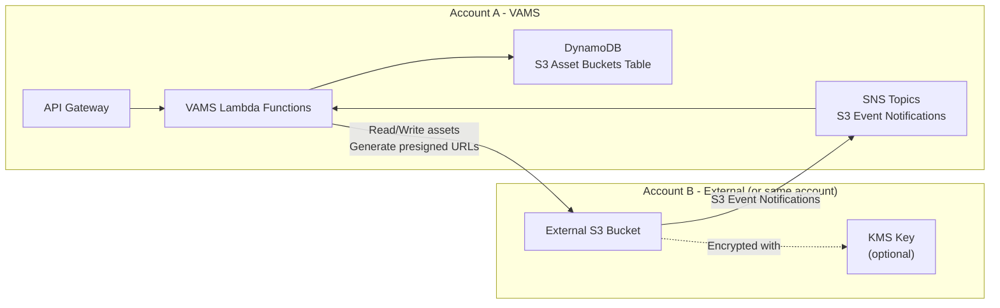

# External Amazon S3 bucket setup

VAMS supports connecting to existing Amazon Simple Storage Service (Amazon S3) buckets for asset storage. This enables you to use pre-existing data lakes, shared buckets, or buckets in separate AWS accounts without migrating data into VAMS-managed buckets.

## When to use external S3 buckets

Consider using external S3 buckets in the following scenarios:

-   **Existing data** -- You have assets already organized in S3 buckets and want to register them in VAMS without copying data.
-   **Shared buckets** -- Multiple applications or teams share the same S3 bucket and you need VAMS to access a specific prefix.
-   **Cross-account access** -- Assets reside in a different AWS account and must remain there for organizational or billing reasons.
-   **Compliance requirements** -- Data residency or governance policies require assets to stay in specific buckets or accounts.

## Architecture overview

The following diagram illustrates how VAMS interacts with external S3 buckets.



**Account A** is the AWS account where VAMS is deployed. **Account B** is the AWS account containing the external S3 bucket. Account A and Account B can be the same account.

## Configuration

External buckets are defined in the VAMS CDK configuration file at `infra/config/config.json` under the `app.assetBuckets.externalAssetBuckets` array.

### Bucket entry format

Each entry in the `externalAssetBuckets` array requires three fields:

| Field                   | Type   | Description                                                                                         |
| ----------------------- | ------ | --------------------------------------------------------------------------------------------------- |
| `bucketArn`             | String | The full Amazon Resource Name (ARN) of the external S3 bucket.                                      |
| `baseAssetsPrefix`      | String | The S3 key prefix under which VAMS manages assets. Must end with `/` or be `/` for the bucket root. |
| `defaultSyncDatabaseId` | String | The VAMS database ID that assets discovered in this bucket are assigned to.                         |

### Example configuration

```json
{
    "app": {
        "assetBuckets": {
            "createNewBucket": true,
            "defaultNewBucketSyncDatabaseId": "default-database",
            "externalAssetBuckets": [
                {
                    "bucketArn": "arn:aws:s3:::my-external-assets",
                    "baseAssetsPrefix": "vams-assets/",
                    "defaultSyncDatabaseId": "external-db-001"
                },
                {
                    "bucketArn": "arn:aws-us-gov:s3:::govcloud-assets",
                    "baseAssetsPrefix": "/",
                    "defaultSyncDatabaseId": "govcloud-db-001"
                }
            ]
        }
    }
}
```

:::note[Partition-aware ARNs]
Use the correct ARN partition for your environment. Commercial AWS uses `arn:aws:s3:::`, AWS GovCloud (US) uses `arn:aws-us-gov:s3:::`.
:::

:::warning[Prefix requirements]
The `baseAssetsPrefix` must end with a forward slash (`/`) unless it is set to `/` for the bucket root. The CDK deployment validates this requirement and fails with an error if violated.
:::

## Step-by-step setup

Follow these steps to connect an external S3 bucket to VAMS. Complete Steps 1-4 **before** deploying the VAMS CDK stack.

### Step 1: Configure the S3 bucket policy

Add a bucket policy to the external S3 bucket that grants the VAMS account access. This policy must be applied before the CDK deployment because VAMS attempts to configure event notifications and resource policies during deployment.

```json
{
    "Version": "2012-10-17",
    "Statement": [
        {
            "Sid": "AllowVAMSAccess",
            "Effect": "Allow",
            "Principal": {
                "AWS": "arn:aws:iam::<VAMS_ACCOUNT_ID>:root"
            },
            "Action": "s3:*",
            "Resource": ["arn:aws:s3:::<BUCKET_NAME>", "arn:aws:s3:::<BUCKET_NAME>/*"]
        }
    ]
}
```

Replace the following placeholder values:

-   `<VAMS_ACCOUNT_ID>` -- The 12-digit AWS account ID where VAMS is deployed.
-   `<BUCKET_NAME>` -- The name of the external S3 bucket.

:::tip[Restrict access to VAMS roles only]
For tighter security, add a condition block that limits access to IAM roles created by VAMS. Replace `<APP_NAME>` with the `name` value from your `config.json` (default: `vams`).

```json
"Condition": {
    "ArnEquals": {
        "aws:PrincipalArn": [
            "arn:aws:iam::<VAMS_ACCOUNT_ID>:role/<APP_NAME>*",
            "arn:aws:sts::<VAMS_ACCOUNT_ID>:assumed-role/<APP_NAME>*"
        ]
    }
}
```

:::

### Step 2: Configure CORS

Apply a Cross-Origin Resource Sharing (CORS) configuration to the external bucket. This is required for browser-based operations including presigned URL uploads and downloads.

```json
[
    {
        "AllowedHeaders": ["*"],
        "AllowedMethods": ["GET", "PUT", "POST", "HEAD", "OPTIONS"],
        "AllowedOrigins": ["https://your-vams-domain.example.com"],
        "ExposeHeaders": ["ETag", "x-amz-server-side-encryption", "x-amz-request-id", "x-amz-id-2"],
        "MaxAgeSeconds": 3600
    }
]
```

Apply the CORS configuration using the AWS Command Line Interface (AWS CLI):

```bash
aws s3api put-bucket-cors \
    --bucket <BUCKET_NAME> \
    --cors-configuration file://cors-config.json
```

:::warning[Production origins]
Replace `https://your-vams-domain.example.com` with your actual VAMS Amazon CloudFront distribution domain or Application Load Balancer (ALB) domain. Avoid using `*` in production environments.
:::

### Step 3: Configure KMS key policy (conditional)

If the external bucket uses an AWS Key Management Service (AWS KMS) customer managed key (CMK) for encryption, the KMS key policy must grant VAMS permissions to decrypt and generate data keys.

```json
{
    "Sid": "AllowVAMSKMSAccess",
    "Effect": "Allow",
    "Principal": {
        "AWS": "arn:aws:iam::<VAMS_ACCOUNT_ID>:root"
    },
    "Action": ["kms:Decrypt", "kms:GenerateDataKey", "kms:DescribeKey"],
    "Resource": "*"
}
```

Add this statement to the KMS key policy in the account that owns the key. This step is not required if the bucket uses Amazon S3 managed keys (SSE-S3).

### Step 4: Configure cross-account IAM (conditional)

For cross-account setups where the external bucket resides in a different AWS account, additional IAM configuration is required.

#### In Account B (bucket account)

Create an IAM role with a trust relationship that allows Account A to assume it:

```json
{
    "Version": "2012-10-17",
    "Statement": [
        {
            "Effect": "Allow",
            "Principal": {
                "AWS": "arn:aws:iam::<VAMS_ACCOUNT_ID>:root"
            },
            "Action": "sts:AssumeRole"
        }
    ]
}
```

Attach a policy to the role granting S3 access:

```json
{
    "Version": "2012-10-17",
    "Statement": [
        {
            "Effect": "Allow",
            "Action": ["s3:*"],
            "Resource": ["arn:aws:s3:::<BUCKET_NAME>", "arn:aws:s3:::<BUCKET_NAME>/*"]
        },
        {
            "Effect": "Allow",
            "Action": ["kms:Decrypt", "kms:GenerateDataKey"],
            "Resource": "*",
            "Condition": {
                "StringEquals": {
                    "kms:ViaService": "s3.<REGION>.amazonaws.com"
                }
            }
        }
    ]
}
```

#### In Account A (VAMS account)

Ensure the IAM identity used to deploy VAMS has permission to access the external bucket:

```json
{
    "Version": "2012-10-17",
    "Statement": [
        {
            "Effect": "Allow",
            "Action": ["s3:*"],
            "Resource": ["arn:aws:s3:::<BUCKET_NAME>", "arn:aws:s3:::<BUCKET_NAME>/*"]
        }
    ]
}
```

### Step 5: Update VAMS configuration and deploy

1. Edit `infra/config/config.json` and add your external bucket entries to the `externalAssetBuckets` array as shown in the [example configuration](#example-configuration).

2. Deploy the VAMS stack:

    ```bash
    cd infra
    npx cdk deploy --all --require-approval never --profile <YOUR_AWS_PROFILE>
    ```

:::info[What happens during deployment]
The CDK deployment performs the following actions for external buckets:

-   Imports the bucket reference using the provided ARN.
-   Applies TLS enforcement policies to the bucket.
-   Creates Amazon Simple Notification Service (Amazon SNS) topics for S3 event notifications on the bucket.
-   Populates the S3 Asset Buckets DynamoDB table with bucket metadata.
-   Configures Lambda functions with permissions to access the bucket.
    :::

## What deployment configures automatically

During CDK deployment, VAMS performs the following actions for each external bucket entry:

-   **Bucket import** -- Imports the Amazon S3 bucket reference using the provided ARN.
-   **TLS enforcement** -- Applies a bucket policy statement that denies all `s3:*` actions when `aws:SecureTransport=false`.
-   **Additional bucket policies** -- Applies any custom policy statements from `infra/config/policy/s3AdditionalBucketPolicyConfig.json`.
-   **Event notifications** -- Creates Amazon SNS topics for Amazon S3 event notifications on the bucket to enable automatic file synchronization.
-   **DynamoDB registration** -- Populates the S3 Asset Buckets Amazon DynamoDB table with bucket metadata (ARN, prefix, sync database ID).
-   **Lambda permissions** -- Configures Lambda function IAM roles with permissions to read from and write to the external bucket.

:::note
Assets store which bucket and prefix they are assigned to upon creation. Changes made directly to Amazon S3 buckets (outside of VAMS) are synchronized back to Amazon DynamoDB tables and Amazon OpenSearch indexes through the event notification pipeline.
:::

## Verification

After deployment, use the following checklist to verify the external bucket integration end to end.

### Cross-account access checklist

1. **Check the S3 Asset Buckets table.** Confirm the external bucket appears in the Amazon DynamoDB S3 Asset Buckets table:

    ```bash
    aws dynamodb scan \
        --table-name <VAMS_STACK_NAME>-S3AssetBucketsStorageTable-<ID> \
        --query "Items[?contains(bucketName.S, '<BUCKET_NAME>')]"
    ```

2. **Test direct Amazon S3 operations.** Verify that VAMS Lambda functions can list, read, and write objects in the external bucket by creating an asset via the VAMS API and confirming the file is stored under the configured prefix.

3. **Test presigned URL generation.** Upload a test file through the VAMS web interface or API and confirm the presigned URL is generated for the external bucket. Download the file using the generated URL and verify the content is correct.

4. **Test Amazon S3 event notifications.** Upload a file directly to the external bucket under the configured prefix (bypassing VAMS) and verify it appears in VAMS after the Amazon S3 event notification triggers the sync Lambda function.

5. **Test multipart upload operations.** Upload a file larger than 5 MB through the VAMS web interface to verify multipart upload operations work correctly with the external bucket.

6. **Verify Amazon SNS topic configuration.** Confirm that Amazon S3 event notifications on the external bucket are publishing to the correct VAMS Amazon SNS topic by checking the bucket notification configuration in the AWS Management Console.

## Troubleshooting

| Issue                                                            | Possible cause                               | Resolution                                                                                                                   |
| ---------------------------------------------------------------- | -------------------------------------------- | ---------------------------------------------------------------------------------------------------------------------------- |
| CDK deployment fails with `Access Denied`                        | Bucket policy not applied before deployment. | Apply the bucket policy from [Step 1](#step-1-configure-the-s3-bucket-policy) and redeploy.                                  |
| CDK deployment fails with `baseAssetsPrefix must end in a slash` | The prefix value does not end with `/`.      | Update the prefix in `config.json` to end with `/`.                                                                          |
| Presigned URLs return CORS errors                                | CORS configuration missing or incorrect.     | Verify the CORS policy from [Step 2](#step-2-configure-cors) is applied and `AllowedOrigins` matches your VAMS domain.       |
| Files uploaded to bucket do not appear in VAMS                   | SNS event notifications not configured.      | Check that S3 event notifications are publishing to the VAMS SNS topic. Review AWS CloudTrail logs for access denied errors. |
| `KMS.AccessDeniedException` in Lambda logs                       | KMS key policy does not grant VAMS access.   | Add the KMS key policy statement from [Step 3](#step-3-configure-kms-key-policy-conditional).                                |

## Related resources

-   [Plan your deployment](plan-your-deployment.md)
-   [Deploy the solution](deploy-the-solution.md)
-   [Configuration reference](configuration-reference.md)
