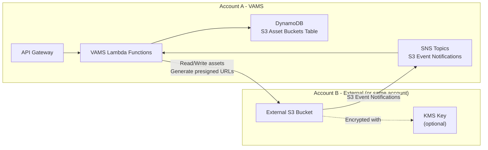
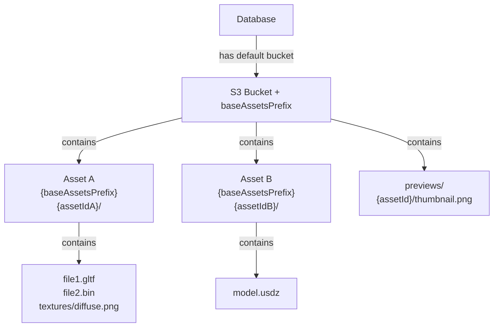
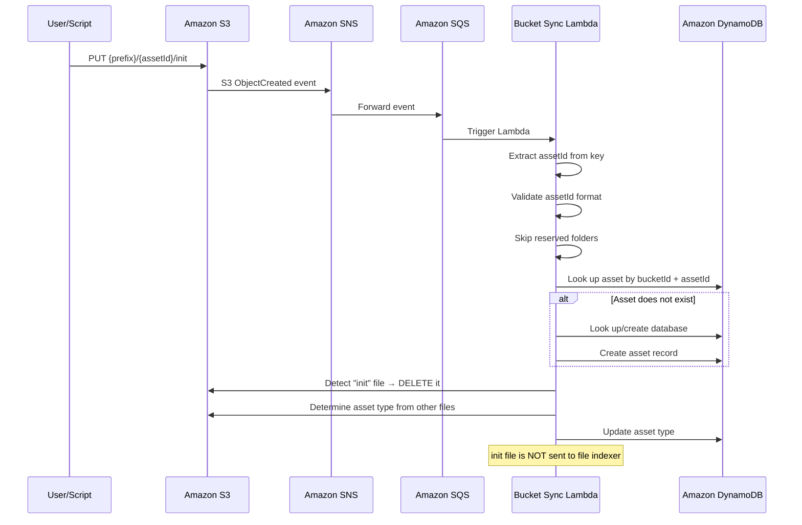

# External Amazon S3 bucket setup

VAMS supports connecting to existing Amazon Simple Storage Service (Amazon S3) buckets for asset storage. This enables you to use pre-existing data lakes, shared buckets, or buckets in separate AWS accounts without migrating data into VAMS-managed buckets.

## When to use external S3 buckets

Consider using external S3 buckets in the following scenarios:

-   **Existing data** -- You have assets already organized in S3 buckets and want to register them in VAMS without copying data.
-   **Shared buckets** -- Multiple applications or teams share the same S3 bucket and you need VAMS to access a specific prefix.
-   **Cross-account access** -- Assets reside in a different AWS account and must remain there for organizational or billing reasons.
-   **Compliance requirements** -- Data residency or governance policies require assets to stay in specific buckets or accounts.

## Architecture overview

The following diagram illustrates how VAMS interacts with external S3 buckets.



**Account A** is the AWS account where VAMS is deployed. **Account B** is the AWS account containing the external S3 bucket. Account A and Account B can be the same account.

## Configuration

External buckets are defined in the VAMS CDK configuration file at `infra/config/config.json` under the `app.assetBuckets.externalAssetBuckets` array.

### Bucket entry format

Each entry in the `externalAssetBuckets` array requires three fields:

| Field                   | Type   | Description                                                                                         |
| ----------------------- | ------ | --------------------------------------------------------------------------------------------------- |
| `bucketArn`             | String | The full Amazon Resource Name (ARN) of the external S3 bucket.                                      |
| `baseAssetsPrefix`      | String | The S3 key prefix under which VAMS manages assets. Must end with `/` or be `/` for the bucket root. |
| `defaultSyncDatabaseId` | String | The VAMS database ID that assets discovered in this bucket are assigned to.                         |

### Example configuration

```json
{
    "app": {
        "assetBuckets": {
            "createNewBucket": true,
            "defaultNewBucketSyncDatabaseId": "default-database",
            "externalAssetBuckets": [
                {
                    "bucketArn": "arn:aws:s3:::my-external-assets",
                    "baseAssetsPrefix": "vams-assets/",
                    "defaultSyncDatabaseId": "external-db-001"
                },
                {
                    "bucketArn": "arn:aws-us-gov:s3:::govcloud-assets",
                    "baseAssetsPrefix": "/",
                    "defaultSyncDatabaseId": "govcloud-db-001"
                }
            ]
        }
    }
}
```

:::note[Partition-aware ARNs]
Use the correct ARN partition for your environment. Commercial AWS uses `arn:aws:s3:::`, AWS GovCloud (US) uses `arn:aws-us-gov:s3:::`.
:::

:::warning[Prefix requirements]
The `baseAssetsPrefix` must end with a forward slash (`/`) unless it is set to `/` for the bucket root. The CDK deployment validates this requirement and fails with an error if violated.
:::

## Step-by-step setup

Follow these steps to connect an external S3 bucket to VAMS. Complete Steps 1-4 **before** deploying the VAMS CDK stack.

### Step 1: Configure the S3 bucket policy

Add a bucket policy to the external S3 bucket that grants the VAMS account access. This policy must be applied before the CDK deployment because VAMS attempts to configure event notifications and resource policies during deployment.

```json
{
    "Version": "2012-10-17",
    "Statement": [
        {
            "Sid": "AllowVAMSAccess",
            "Effect": "Allow",
            "Principal": {
                "AWS": "arn:aws:iam::<VAMS_ACCOUNT_ID>:root"
            },
            "Action": "s3:*",
            "Resource": ["arn:aws:s3:::<BUCKET_NAME>", "arn:aws:s3:::<BUCKET_NAME>/*"]
        }
    ]
}
```

Replace the following placeholder values:

-   `<VAMS_ACCOUNT_ID>` -- The 12-digit AWS account ID where VAMS is deployed.
-   `<BUCKET_NAME>` -- The name of the external S3 bucket.

:::tip[Restrict access to VAMS roles only]
For tighter security, add a condition block that limits access to IAM roles created by VAMS. Replace `<APP_NAME>` with the `name` value from your `config.json` (default: `vams`).

```json
"Condition": {
    "ArnEquals": {
        "aws:PrincipalArn": [
            "arn:aws:iam::<VAMS_ACCOUNT_ID>:role/<APP_NAME>*",
            "arn:aws:sts::<VAMS_ACCOUNT_ID>:assumed-role/<APP_NAME>*"
        ]
    }
}
```

:::

### Step 2: Configure CORS

Apply a Cross-Origin Resource Sharing (CORS) configuration to the external bucket. This is required for browser-based operations including presigned URL uploads and downloads.

```json
[
    {
        "AllowedHeaders": ["*"],
        "AllowedMethods": ["GET", "PUT", "POST", "HEAD", "OPTIONS"],
        "AllowedOrigins": ["https://your-vams-domain.example.com"],
        "ExposeHeaders": ["ETag", "x-amz-server-side-encryption", "x-amz-request-id", "x-amz-id-2"],
        "MaxAgeSeconds": 3600
    }
]
```

Apply the CORS configuration using the AWS Command Line Interface (AWS CLI):

```bash
aws s3api put-bucket-cors \
    --bucket <BUCKET_NAME> \
    --cors-configuration file://cors-config.json
```

:::warning[Production origins]
Replace `https://your-vams-domain.example.com` with your actual VAMS Amazon CloudFront distribution domain or Application Load Balancer (ALB) domain. Avoid using `*` in production environments.
:::

### Step 3: Configure KMS key policy (conditional)

If the external bucket uses an AWS Key Management Service (AWS KMS) customer managed key (CMK) for encryption, the KMS key policy must grant VAMS permissions to decrypt and generate data keys.

```json
{
    "Sid": "AllowVAMSKMSAccess",
    "Effect": "Allow",
    "Principal": {
        "AWS": "arn:aws:iam::<VAMS_ACCOUNT_ID>:root"
    },
    "Action": ["kms:Decrypt", "kms:GenerateDataKey", "kms:DescribeKey"],
    "Resource": "*"
}
```

Add this statement to the KMS key policy in the account that owns the key. This step is not required if the bucket uses Amazon S3 managed keys (SSE-S3).

### Step 4: Configure cross-account IAM (conditional)

For cross-account setups where the external bucket resides in a different AWS account, additional IAM configuration is required.

#### In Account B (bucket account)

Create an IAM role with a trust relationship that allows Account A to assume it:

```json
{
    "Version": "2012-10-17",
    "Statement": [
        {
            "Effect": "Allow",
            "Principal": {
                "AWS": "arn:aws:iam::<VAMS_ACCOUNT_ID>:root"
            },
            "Action": "sts:AssumeRole"
        }
    ]
}
```

Attach a policy to the role granting S3 access:

```json
{
    "Version": "2012-10-17",
    "Statement": [
        {
            "Effect": "Allow",
            "Action": ["s3:*"],
            "Resource": ["arn:aws:s3:::<BUCKET_NAME>", "arn:aws:s3:::<BUCKET_NAME>/*"]
        },
        {
            "Effect": "Allow",
            "Action": ["kms:Decrypt", "kms:GenerateDataKey"],
            "Resource": "*",
            "Condition": {
                "StringEquals": {
                    "kms:ViaService": "s3.<REGION>.amazonaws.com"
                }
            }
        }
    ]
}
```

#### In Account A (VAMS account)

Ensure the IAM identity used to deploy VAMS has permission to access the external bucket:

```json
{
    "Version": "2012-10-17",
    "Statement": [
        {
            "Effect": "Allow",
            "Action": ["s3:*"],
            "Resource": ["arn:aws:s3:::<BUCKET_NAME>", "arn:aws:s3:::<BUCKET_NAME>/*"]
        }
    ]
}
```

### Step 5: Update VAMS configuration and deploy

1. Edit `infra/config/config.json` and add your external bucket entries to the `externalAssetBuckets` array as shown in the [example configuration](#example-configuration).

2. Deploy the VAMS stack:

    ```bash
    cd infra
    npx cdk deploy --all --require-approval never --profile <YOUR_AWS_PROFILE>
    ```

:::info[What happens during deployment]
The CDK deployment performs the following actions for external buckets:

-   Imports the bucket reference using the provided ARN.
-   Applies TLS enforcement policies to the bucket.
-   Creates Amazon Simple Notification Service (Amazon SNS) topics for S3 event notifications on the bucket.
-   Populates the S3 Asset Buckets DynamoDB table with bucket metadata.
-   Configures Lambda functions with permissions to access the bucket.
    :::

## What deployment configures automatically

During CDK deployment, VAMS performs the following actions for each external bucket entry:

-   **Bucket import** -- Imports the Amazon S3 bucket reference using the provided ARN.
-   **TLS enforcement** -- Applies a bucket policy statement that denies all `s3:*` actions when `aws:SecureTransport=false`.
-   **Additional bucket policies** -- Applies any custom policy statements from `infra/config/policy/s3AdditionalBucketPolicyConfig.json`.
-   **Event notifications** -- Creates Amazon SNS topics for Amazon S3 event notifications on the bucket to enable automatic file synchronization.
-   **DynamoDB registration** -- Populates the S3 Asset Buckets Amazon DynamoDB table with bucket metadata (ARN, prefix, sync database ID).
-   **Lambda permissions** -- Configures Lambda function IAM roles with permissions to read from and write to the external bucket.

:::note
Assets store which bucket and prefix they are assigned to upon creation. Changes made directly to Amazon S3 buckets (outside of VAMS) are synchronized back to Amazon DynamoDB tables and Amazon OpenSearch indexes through the event notification pipeline.
:::

## Verification

After deployment, use the following checklist to verify the external bucket integration end to end.

### Cross-account access checklist

1. **Check the S3 Asset Buckets table.** Confirm the external bucket appears in the Amazon DynamoDB S3 Asset Buckets table:

    ```bash
    aws dynamodb scan \
        --table-name <VAMS_STACK_NAME>-S3AssetBucketsStorageTable-<ID> \
        --query "Items[?contains(bucketName.S, '<BUCKET_NAME>')]"
    ```

2. **Test direct Amazon S3 operations.** Verify that VAMS Lambda functions can list, read, and write objects in the external bucket by creating an asset via the VAMS API and confirming the file is stored under the configured prefix.

3. **Test presigned URL generation.** Upload a test file through the VAMS web interface or API and confirm the presigned URL is generated for the external bucket. Download the file using the generated URL and verify the content is correct.

4. **Test Amazon S3 event notifications.** Upload a file directly to the external bucket under the configured prefix (bypassing VAMS) and verify it appears in VAMS after the Amazon S3 event notification triggers the sync Lambda function.

5. **Test multipart upload operations.** Upload a file larger than 5 MB through the VAMS web interface to verify multipart upload operations work correctly with the external bucket.

6. **Verify Amazon SNS topic configuration.** Confirm that Amazon S3 event notifications on the external bucket are publishing to the correct VAMS Amazon SNS topic by checking the bucket notification configuration in the AWS Management Console.

## Troubleshooting

| Issue                                                            | Possible cause                               | Resolution                                                                                                                   |
| ---------------------------------------------------------------- | -------------------------------------------- | ---------------------------------------------------------------------------------------------------------------------------- |
| CDK deployment fails with `Access Denied`                        | Bucket policy not applied before deployment. | Apply the bucket policy from [Step 1](#step-1-configure-the-s3-bucket-policy) and redeploy.                                  |
| CDK deployment fails with `baseAssetsPrefix must end in a slash` | The prefix value does not end with `/`.      | Update the prefix in `config.json` to end with `/`.                                                                          |
| Presigned URLs return CORS errors                                | CORS configuration missing or incorrect.     | Verify the CORS policy from [Step 2](#step-2-configure-cors) is applied and `AllowedOrigins` matches your VAMS domain.       |
| Files uploaded to bucket do not appear in VAMS                   | SNS event notifications not configured.      | Check that S3 event notifications are publishing to the VAMS SNS topic. Review AWS CloudTrail logs for access denied errors. |
| `KMS.AccessDeniedException` in Lambda logs                       | KMS key policy does not grant VAMS access.   | Add the KMS key policy statement from [Step 3](#step-3-configure-kms-key-policy-conditional).                                |

## S3 bucket structure and key conventions

Understanding how VAMS organizes data in Amazon S3 is essential for working with external buckets or importing existing data. This section describes the key prefixes, directory hierarchy, and naming conventions that VAMS uses.

### Base prefix

Every Amazon S3 bucket registered in VAMS has a `baseAssetsPrefix` value. This prefix is the root under which all VAMS-managed content is stored. For the default VAMS-created bucket, the prefix is typically `/` (the bucket root). For external buckets, you configure the prefix in `config.json`.

### Asset folder structure

When VAMS creates a new asset, it creates a folder at `\{baseAssetsPrefix\}\{assetId\}/` within the bucket. All files belonging to that asset are stored under this folder, preserving any relative directory structure from the upload.

```
s3://bucket-name/
  {baseAssetsPrefix}
    {assetId}/                          # Asset root folder
      model.gltf                        # Asset files
      model.bin
      textures/                         # Subdirectories are preserved
        diffuse.png
        normal.png
```

The `assetId` is a unique identifier generated by VAMS (or specified by the user at creation time). Each asset records its full S3 location in the `assetLocation.Key` field in Amazon DynamoDB.

### Special prefixes

VAMS reserves several prefixes within the `baseAssetsPrefix` for internal use:

| Prefix                                         | Purpose          | Description                                                              |
| ---------------------------------------------- | ---------------- | ------------------------------------------------------------------------ |
| `\{baseAssetsPrefix\}\{assetId\}/`             | Asset files      | All files belonging to an asset, including subdirectories                |
| `\{baseAssetsPrefix\}previews/\{assetId\}/`    | File previews    | Thumbnail and preview images generated by pipelines or uploaded manually |
| `\{baseAssetsPrefix\}temp-uploads/`            | Upload staging   | Temporary storage for multipart uploads; cleaned up after completion     |
| `pipelines/\{pipelineType\}/\{jobId\}/output/` | Pipeline outputs | Processing pipeline results (written by Step Functions workflows)        |

The auxiliary bucket (a separate bucket managed by VAMS) stores:

| Prefix                                 | Purpose        | Description                                                                |
| -------------------------------------- | -------------- | -------------------------------------------------------------------------- |
| `metadata/\{databaseId\}/\{assetId\}/` | Metadata files | Metadata files produced by pipelines (JSON, XMP)                           |
| `\{assetId\}/`                         | Viewer data    | Non-versioned data for specific viewers (for example, Potree octree files) |

### How databases, buckets, and assets relate

The relationship between VAMS concepts and Amazon S3 storage is:



-   A **database** is mapped to a default S3 bucket (and prefix) via the S3 Asset Buckets Amazon DynamoDB table.
-   Multiple databases can share the same bucket by using different `baseAssetsPrefix` values.
-   Each **asset** lives under `\{baseAssetsPrefix\}\{assetId\}/` in its database's bucket.
-   **Files** within an asset preserve their relative directory structure from upload.

### Example: full S3 key layout

For a VAMS deployment with `baseAssetsPrefix: "vams-data/"` and two assets:

```
s3://my-asset-bucket/
  vams-data/
    x8a3f2b1e-building/                 # Asset 1 folder
      architecture/floor-plan.ifc
      architecture/render.png
    y9c4d3e2f-vehicle/                  # Asset 2 folder
      vehicle.glb
      vehicle.bin
    previews/
      x8a3f2b1e-building/
        floor-plan.ifc.previewFile.png  # File preview for floor-plan.ifc
      y9c4d3e2f-vehicle/
        vehicle.glb.previewFile.gif     # File preview for vehicle.glb
    temp-uploads/                       # Temporary (cleaned up automatically)
      ...
```

## Ingesting existing 3D models from an existing S3 bucket

This section explains how to register existing 3D models stored in an Amazon S3 bucket with VAMS, without duplicating data.

### Overview

VAMS includes a built-in bucket sync mechanism that automatically creates database and asset records when it detects new files in a registered Amazon S3 bucket. The sync is driven by Amazon S3 event notifications, which the CDK deployment configures automatically for each registered bucket.

The recommended approach for bulk-importing existing assets is to use **init files**. By placing a small marker file named `init` inside each asset folder, you trigger the sync Lambda function to create the corresponding asset record in VAMS. The `init` file is automatically deleted after processing.

:::info[No data duplication required]
You do not need to copy or move your 3D models into a separate VAMS bucket. By configuring your existing bucket as an external bucket, VAMS reads files directly from their original location. No data duplication occurs.
:::

### Prerequisites

-   Your existing S3 bucket must be configured as an external bucket in VAMS (see [Step-by-step setup](#step-by-step-setup) above) and the CDK stack must be deployed so that Amazon S3 event notifications are active.
-   The `baseAssetsPrefix` in the external bucket configuration must be set to the common prefix under which your 3D models reside (or `/` for the bucket root).
-   A VAMS database must exist that maps to this external bucket (the `defaultSyncDatabaseId` value in config).

### Step 1: Organize your data to match VAMS conventions

Each 3D model (and its supporting files) must reside in its own folder directly under the `baseAssetsPrefix`. The folder name becomes the `assetId` in VAMS.

:::warning[Asset ID requirements]
The folder name used as the asset ID must match VAMS validation rules: alphanumeric characters, hyphens, underscores, and periods only, with a maximum length of 256 characters. Folders with names containing spaces or special characters are skipped by the sync process.
:::

:::warning[Reserved folder names]
VAMS reserves the following top-level folder names under the `baseAssetsPrefix` for internal use. Do **not** use these as asset folder names: `temp-upload`, `temp-uploads`, `preview`, `previews`, `pipeline`, `pipelines`, `workspace`, `workspaces`. Assets in folders with these names are silently skipped during sync.
:::

**Required structure:**

```
s3://my-3d-models/
  {baseAssetsPrefix}
    {assetId-1}/                        # Each folder = one asset
      model.ifc
      model.png
    {assetId-2}/
      car.glb
      car.bin
      textures/
        diffuse.png
```

For example, with `baseAssetsPrefix: "projects/"`:

```
s3://my-3d-models/
  projects/
    building-a/                         # Asset ID: "building-a"
      model.ifc
      model.png
    vehicle-b/                          # Asset ID: "vehicle-b"
      car.glb
      car.bin
```

### Step 2: Deploy VAMS with external bucket configuration

Add your bucket to `infra/config/config.json`:

```json
{
    "app": {
        "assetBuckets": {
            "externalAssetBuckets": [
                {
                    "bucketArn": "arn:aws:s3:::my-3d-models",
                    "baseAssetsPrefix": "projects/",
                    "defaultSyncDatabaseId": "my-3d-database"
                }
            ]
        }
    }
}
```

Deploy the CDK stack. This configures Amazon S3 event notifications on your bucket so that any object creation or deletion event triggers the VAMS bucket sync Lambda function.

### Step 3: Trigger asset creation with init files (recommended)

After deployment, place a file named `init` inside each asset folder. This triggers the bucket sync Lambda to:

1. Detect the new file event for `\{baseAssetsPrefix\}\{assetId\}/init`.
2. Extract the `assetId` from the S3 key (the first path segment after the `baseAssetsPrefix`).
3. Look up or auto-create the VAMS database for this bucket and prefix.
4. Create a new asset record in Amazon DynamoDB with `assetLocation.Key` pointing to `\{baseAssetsPrefix\}\{assetId\}/`.
5. Determine the asset type from the other files in the folder (file extension for single files, `folder` for multiple files).
6. **Delete the `init` file** from Amazon S3 automatically.
7. Skip sending the `init` file to the file indexer (it is not a real asset file).

The `init` file can be empty (zero bytes). Its only purpose is to trigger the S3 event notification.

**Bulk-create init files using the AWS CLI:**

```bash
#!/bin/bash
# Bulk import existing 3D models into VAMS using init files

BUCKET="my-3d-models"
PREFIX="projects/"

# List all top-level folders under the prefix
aws s3 ls "s3://${BUCKET}/${PREFIX}" | grep PRE | awk '{print $2}' | while read folder; do
    asset_id="${folder%/}"  # Remove trailing slash

    echo "Creating init file for asset: ${asset_id}"
    # Create an empty init file in each asset folder
    echo -n "" | aws s3 cp - "s3://${BUCKET}/${PREFIX}${asset_id}/init"

    # Optional: add a small delay to avoid throttling the sync Lambda
    sleep 0.5
done

echo "Done. VAMS will process each init file and create asset records automatically."
echo "The init files are deleted by VAMS after processing."
```

:::tip[PowerShell alternative]
On Windows, use the following PowerShell script:

```powershell
$BUCKET = "my-3d-models"
$PREFIX = "projects/"

# List folders and create init files
$folders = aws s3 ls "s3://$BUCKET/$PREFIX" | Select-String "PRE" | ForEach-Object {
    ($_ -split '\s+')[-1].TrimEnd('/')
}

foreach ($assetId in $folders) {
    Write-Host "Creating init file for asset: $assetId"
    $emptyFile = [System.IO.Path]::GetTempFileName()
    Set-Content -Path $emptyFile -Value "" -NoNewline
    aws s3 cp $emptyFile "s3://$BUCKET/$PREFIX$assetId/init"
    Remove-Item $emptyFile
    Start-Sleep -Milliseconds 500
}

Write-Host "Done. VAMS will process each init file and create asset records automatically."
```

:::

### How the bucket sync process works

The following diagram illustrates the complete sync flow:



For non-init files (regular asset files already present or uploaded later), the sync Lambda also:

-   Updates Amazon S3 object metadata with `databaseid` and `assetid` tags.
-   Publishes the event to the file indexer Amazon SNS topic for Amazon OpenSearch indexing.
-   Publishes the event to the workflow auto-execute Amazon SQS queue for automatic pipeline triggering.

### Alternative: Use the API with bucketExistingKey

For individual assets or when you need more control over asset metadata (name, description, tags), you can create assets directly via the VAMS API using the `bucketExistingKey` field:

```bash
curl -X POST "https://{VAMS_API}/database/my-3d-database/assets" \
  -H "Authorization: Bearer {TOKEN}" \
  -H "Content-Type: application/json" \
  -d '{
    "assetName": "Building A",
    "description": "Architectural model of Building A",
    "isDistributable": true,
    "tags": ["architecture", "imported"],
    "bucketExistingKey": "projects/building-a/"
  }'
```

VAMS validates that the specified key exists in the bucket, then creates an asset record pointing to that S3 location without copying data. This approach gives you control over `assetName`, `description`, and `tags`, whereas the init-file approach auto-generates these fields from the folder name.

:::warning[Key format requirements]
The `bucketExistingKey` value must point to an existing S3 key (file or prefix) in the bucket. VAMS resolves the full path by combining the `baseAssetsPrefix` with the `bucketExistingKey`, intelligently avoiding duplication if the key already includes the prefix. The key should end with `/` if it represents a folder containing multiple files.
:::

### What happens after import

After assets are created (via init files or API):

1. **Viewing in VAMS**: The assets appear in the VAMS web interface under the specified database. You can browse files, view metadata, and use any compatible viewer plugin.
2. **File listing**: VAMS lists files by querying Amazon S3 with the asset's `assetLocation.Key` prefix. All files under that prefix appear in the file manager.
3. **Asset type detection**: The sync Lambda automatically determines the asset type based on the files present (file extension for single-file assets, `folder` for multi-file assets).
4. **Presigned URLs**: Downloads and viewer access use presigned URLs generated against the original bucket location.
5. **Pipelines**: You can run processing pipelines (for example, 3D preview generation) on imported assets. Pipeline outputs are written to the appropriate output paths within the same bucket.
6. **Ongoing sync**: Any files added to or deleted from an asset folder in Amazon S3 are automatically detected by the sync Lambda and reflected in VAMS (file indexing, asset type updates, metadata cleanup).
7. **No data movement**: Files remain at their original S3 location. VAMS does not copy, move, or reorganize the files.

### Common questions

**Do I need a separate VAMS asset bucket if I use an external bucket?**

No. If you set `createNewBucket: false` in your configuration and only use external buckets, VAMS does not create its own asset bucket. However, you still need the auxiliary bucket that VAMS creates for temporary files and metadata.

**Can I use the `assetBucketName` config field to point to my existing bucket?**

The `assetBucketName` field in `config.json` tells VAMS to use an existing bucket as the _default_ VAMS asset bucket. This works if you want VAMS to manage the bucket directly (including creating folders for new assets). For existing data that you want to import without modification, the `externalAssetBuckets` approach is recommended.

**What if my files are not organized in per-model folders?**

If your 3D models are individual files (not in folders), you need to reorganize them into one folder per model before importing. The folder name becomes the asset ID. Alternatively, use the API with `bucketExistingKey` to point to individual file keys.

**Can I add files to an imported asset after creation?**

Yes. After creating an asset, you can upload additional files to the asset through the VAMS web interface or API. New files are placed under the same S3 prefix as the original files. You can also add files directly to the asset folder in Amazon S3 and the sync Lambda will detect them automatically.

**What if I have thousands of assets to import?**

The init-file approach scales well. Add a short delay (0.5-1 second) between creating init files to avoid overwhelming the sync Lambda. The Lambda processes events asynchronously via the Amazon SQS queue, so a burst of events will be processed over time rather than all at once.

**Will the init files remain in my bucket?**

No. The sync Lambda automatically deletes the `init` file from Amazon S3 after processing. If bucket versioning is enabled, all versions of the `init` file (including delete markers) are also removed.

## Related resources

-   [Plan your deployment](plan-your-deployment.md)
-   [Deploy the solution](deploy-the-solution.md)
-   [Configuration reference](configuration-reference.md)
