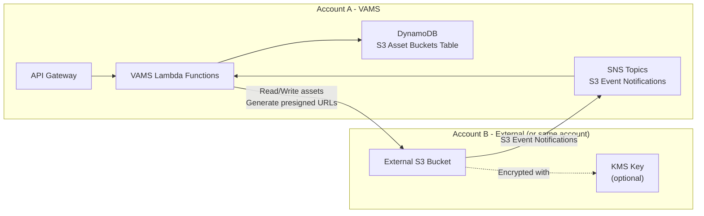
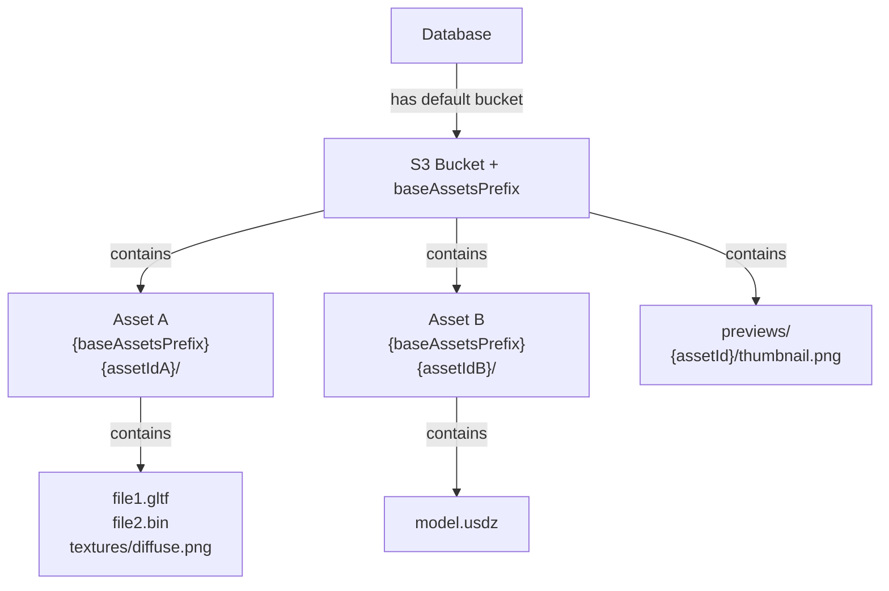
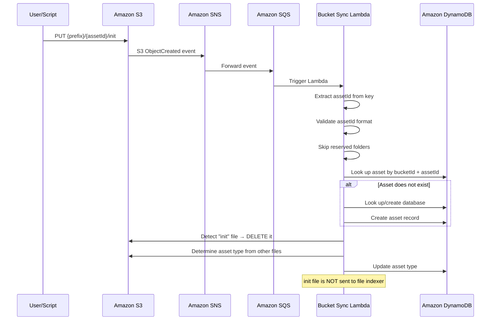

# External Amazon S3 bucket setup

VAMS supports connecting to existing Amazon Simple Storage Service (Amazon S3) buckets for asset storage. This enables you to use pre-existing data lakes, shared buckets, or buckets in separate AWS accounts without migrating data into VAMS-managed buckets.

## When to use external S3 buckets

Consider using external S3 buckets in the following scenarios:

-   **Existing data** -- You have assets already organized in S3 buckets and want to register them in VAMS without copying data.
-   **Shared buckets** -- Multiple applications or teams share the same S3 bucket and you need VAMS to access a specific prefix.
-   **Cross-account access** -- Assets reside in a different AWS account and must remain there for organizational or billing reasons.
-   **Compliance requirements** -- Data residency or governance policies require assets to stay in specific buckets or accounts.

## Architecture overview

The following diagram illustrates how VAMS interacts with external S3 buckets.


```mermaid
graph LR
    subgraph "Account A - VAMS"
        VAMS_Lambdas["VAMS Lambda Functions"]
        API["API Gateway"]
        DDB["DynamoDB<br/>S3 Asset Buckets Table"]
        SNS["SNS Topics<br/>S3 Event Notifications"]
    end

    subgraph "Account B - External (or same account)"
        ExtBucket["External S3 Bucket"]
        KMS_B["KMS Key<br/>(optional)"]
    end

    API --> VAMS_Lambdas
    VAMS_Lambdas -->|"Read/Write assets<br/>Generate presigned URLs"| ExtBucket
    ExtBucket -->|"S3 Event Notifications"| SNS
    SNS --> VAMS_Lambdas
    VAMS_Lambdas --> DDB
    ExtBucket -.->|"Encrypted with"| KMS_B
```

**Account A** is the AWS account where VAMS is deployed. **Account B** is the AWS account containing the external S3 bucket. Account A and Account B can be the same account.

:::warning[Cross-account responsibilities differ from same-account]
When the external bucket lives in a **different** AWS account, VAMS cannot configure the bucket on your behalf the way it does for buckets it owns. Because VAMS imports the bucket by Amazon Resource Name (ARN) only, several policies that VAMS applies automatically to its own buckets must instead be applied **by the bucket owner in Account B before deployment**:

-   **TLS enforcement** -- VAMS does **not** add the `aws:SecureTransport=false` deny statement to an external bucket. You must add it to the bucket policy yourself ([Step 1](#step-1-configure-the-s3-bucket-policy)).
-   **Additional bucket policy statements** -- Custom statements from `infra/config/policy/s3AdditionalBucketPolicyConfig.json` are **not** applied to external buckets. Replicate them in the bucket policy in Account B if required.
-   **Event notifications** -- VAMS configures Amazon S3 event notifications on the bucket during deployment. This requires the VAMS deployment to have bucket-owner permissions on the external bucket and **overwrites the bucket's existing notification configuration** (see [Step 1](#step-1-configure-the-s3-bucket-policy) and the [limitations](#known-limitations-for-cross-account-buckets) below).
-   **Encryption key access** -- Both the VAMS-owned AWS KMS key (used by the notification topics) and the external bucket's KMS key (if any) require cross-account key policy grants ([Step 3](#step-3-configure-kms-key-policy-conditional)).

Review [Known limitations for cross-account buckets](#known-limitations-for-cross-account-buckets) before deploying.
:::

## Configuration

External buckets are defined in the VAMS CDK configuration file at `infra/config/config.json` under the `app.assetBuckets.externalAssetBuckets` array.

### Bucket entry format

Each entry in the `externalAssetBuckets` array supports the following fields:

| Field                   | Type   | Required                            | Description                                                                                                                                           |
| ----------------------- | ------ | ----------------------------------- | ----------------------------------------------------------------------------------------------------------------------------------------------------- |
| `bucketArn`             | String | Yes                                 | The full Amazon Resource Name (ARN) of the external S3 bucket.                                                                                        |
| `baseAssetsPrefix`      | String | Yes                                 | The S3 key prefix under which VAMS manages assets. Must end with `/` or be `/` for the bucket root.                                                   |
| `defaultSyncDatabaseId` | String | Yes                                 | The VAMS database ID that assets discovered in this bucket are assigned to.                                                                           |
| `bucketAccountId`       | String | Recommended for cross-account       | The 12-digit AWS account ID that owns the bucket. Enables VAMS to import the bucket as cross-account and to scope event-notification source policies. |
| `bucketRegion`          | String | Recommended for cross-account       | The AWS Region of the bucket. Defaults to the VAMS deployment Region when omitted.                                                                    |
| `bucketKmsKeyArn`       | String | Required if the bucket uses SSE-KMS | The ARN of the AWS KMS key the bucket is encrypted with. VAMS grants this key to its Lambda and pipeline roles so they can read and write objects.    |

:::note[Registering a bucket under multiple prefixes]
The same `bucketArn` may appear more than once in the `externalAssetBuckets` array — for example to map two databases to two different prefixes within one bucket — **provided the prefixes do not overlap**. Two prefixes overlap when one is a path-prefix of the other (for example, `data/` and `data/sub/`), and the bucket root (`/`) overlaps every other prefix. Overlapping prefixes are rejected because Amazon S3 permits only one notification configuration per bucket and cannot route an object event to an ambiguous prefix.

When a bucket ARN is repeated, its `bucketAccountId`, `bucketRegion`, and `bucketKmsKeyArn` values must be identical across every entry (they describe one physical bucket). The CDK deployment fails validation if it detects overlapping prefixes or inconsistent per-bucket attributes.
:::

### Example configuration

```json
{
    "app": {
        "assetBuckets": {
            "createNewBucket": true,
            "defaultNewBucketSyncDatabaseId": "default-database",
            "externalAssetBuckets": [
                {
                    "bucketArn": "arn:aws:s3:::my-external-assets",
                    "baseAssetsPrefix": "vams-assets/",
                    "defaultSyncDatabaseId": "external-db-001",
                    "bucketAccountId": "222222222222",
                    "bucketRegion": "us-east-1",
                    "bucketKmsKeyArn": "arn:aws:kms:us-east-1:222222222222:key/abcd1234-..."
                },
                {
                    "bucketArn": "arn:aws-us-gov:s3:::govcloud-assets",
                    "baseAssetsPrefix": "/",
                    "defaultSyncDatabaseId": "govcloud-db-001"
                }
            ]
        }
    }
}
```

:::note[Partition-aware ARNs]
Use the correct ARN partition for your environment. Commercial AWS uses `arn:aws:s3:::`, AWS GovCloud (US) uses `arn:aws-us-gov:s3:::`, and the AWS European Sovereign Cloud uses `arn:aws-eusc:s3:::`. The external bucket ARN must use the same partition as the VAMS deployment.
:::

:::warning[Prefix requirements]
The `baseAssetsPrefix` must end with a forward slash (`/`) unless it is set to `/` for the bucket root. The CDK deployment validates this requirement and fails with an error if violated.
:::

### Example: one bucket shared by two databases

To map two databases to two non-overlapping prefixes within the same bucket, repeat the `bucketArn` with different `baseAssetsPrefix` and `defaultSyncDatabaseId` values. Any cross-account or KMS attributes must match across the entries.

```json
{
    "app": {
        "assetBuckets": {
            "externalAssetBuckets": [
                {
                    "bucketArn": "arn:aws:s3:::shared-assets",
                    "baseAssetsPrefix": "teamA/",
                    "defaultSyncDatabaseId": "team-a-db",
                    "bucketAccountId": "222222222222"
                },
                {
                    "bucketArn": "arn:aws:s3:::shared-assets",
                    "baseAssetsPrefix": "teamB/",
                    "defaultSyncDatabaseId": "team-b-db",
                    "bucketAccountId": "222222222222"
                }
            ]
        }
    }
}
```

## Step-by-step setup

Follow these steps to connect an external S3 bucket to VAMS. Complete Steps 1-4 **before** deploying the VAMS CDK stack.

### Step 1: Configure the S3 bucket policy

Add a bucket policy to the external S3 bucket that grants the VAMS account access. This policy must be applied before the CDK deployment because VAMS attempts to configure event notifications during deployment, and because VAMS does not apply the TLS or additional bucket policies to buckets it does not own.

The policy below grants data access, the bucket-owner permissions required to configure event notifications, and enforces TLS (replicating the protection VAMS applies automatically to its own buckets).

```json
{
    "Version": "2012-10-17",
    "Statement": [
        {
            "Sid": "AllowVAMSAccess",
            "Effect": "Allow",
            "Principal": {
                "AWS": "arn:aws:iam::<VAMS_ACCOUNT_ID>:root"
            },
            "Action": "s3:*",
            "Resource": ["arn:aws:s3:::<BUCKET_NAME>", "arn:aws:s3:::<BUCKET_NAME>/*"]
        },
        {
            "Sid": "DenyNonTLS",
            "Effect": "Deny",
            "Principal": "*",
            "Action": "s3:*",
            "Resource": ["arn:aws:s3:::<BUCKET_NAME>", "arn:aws:s3:::<BUCKET_NAME>/*"],
            "Condition": {
                "Bool": { "aws:SecureTransport": "false" }
            }
        }
    ]
}
```

Replace the following placeholder values:

-   `<VAMS_ACCOUNT_ID>` -- The 12-digit AWS account ID where VAMS is deployed.
-   `<BUCKET_NAME>` -- The name of the external S3 bucket.

The `s3:*` grant intentionally includes `s3:GetBucketNotification`, `s3:PutBucketNotification`, and `s3:GetBucketVersioning`. VAMS calls these during deployment from AWS CloudFormation custom resource Lambda functions in Account A to wire event notifications and detect versioning. If you scope the grant down from `s3:*`, you must include these actions explicitly or deployment will fail.

:::danger[Do not restrict the bucket policy to an application-prefixed principal]
Avoid narrowing this grant with an `aws:PrincipalArn` condition that matches only `role/<APP_NAME>*`. The IAM roles that configure event notifications and check versioning are **CDK-generated custom resource roles** (for example `BucketNotificationsHandler...` and the S3 asset buckets table populator provider role). These roles are **not** named with your application prefix, so such a condition denies them and deployment fails with `AccessDenied`.

If you require principal scoping, grant the VAMS account root (as shown above) and rely on Account A's IAM policies to constrain which roles use the access, or enumerate the specific CDK-generated role ARNs after a first deployment and add them explicitly.
:::

### Step 2: Configure CORS

Apply a Cross-Origin Resource Sharing (CORS) configuration to the external bucket. This is required for browser-based operations including presigned URL uploads and downloads.

```json
[
    {
        "AllowedHeaders": ["*"],
        "AllowedMethods": ["GET", "PUT", "POST", "HEAD", "OPTIONS"],
        "AllowedOrigins": ["https://your-vams-domain.example.com"],
        "ExposeHeaders": ["ETag", "x-amz-server-side-encryption", "x-amz-request-id", "x-amz-id-2"],
        "MaxAgeSeconds": 3600
    }
]
```

Apply the CORS configuration using the AWS Command Line Interface (AWS CLI):

```bash
aws s3api put-bucket-cors \
    --bucket <BUCKET_NAME> \
    --cors-configuration file://cors-config.json
```

:::warning[Production origins]
Replace `https://your-vams-domain.example.com` with your actual VAMS Amazon CloudFront distribution domain or Application Load Balancer (ALB) domain. Avoid using `*` in production environments.
:::

### Step 3: Configure KMS key policy (conditional)

Cross-account encryption involves **two** AWS Key Management Service (AWS KMS) keys, each requiring its own configuration. Skip the parts that do not apply to your setup.

#### 3a. External bucket CMK in Account B (if the bucket uses SSE-KMS)

If the external bucket uses a customer managed key (CMK) for encryption, the key policy in **Account B** must grant the VAMS account permission to decrypt and generate data keys. Granting the account root is the simplest option; the VAMS Lambda and pipeline roles in Account A then receive matching grants automatically (see [Step 4](#step-4-configure-cross-account-iam-conditional)).

```json
{
    "Sid": "AllowVAMSKMSAccess",
    "Effect": "Allow",
    "Principal": {
        "AWS": "arn:aws:iam::<VAMS_ACCOUNT_ID>:root"
    },
    "Action": ["kms:Decrypt", "kms:GenerateDataKey", "kms:DescribeKey"],
    "Resource": "*"
}
```

This step is not required if the bucket uses Amazon S3 managed keys (SSE-S3).

:::warning[VAMS Lambda and pipeline roles need the external key, not only the deploy identity]
Granting the external CMK to the VAMS account root is necessary but not sufficient on its own. Every VAMS Lambda execution role and every pipeline container/task role that reads or writes the external bucket must also carry `kms:Decrypt` and `kms:GenerateDataKey` on the **external** key.

Set the `bucketKmsKeyArn` field on the bucket entry in `config.json`. When this field is present, VAMS grants the external key to its Lambda and pipeline roles automatically during deployment. The key policy in Account B must still admit the VAMS account (the statement above). If you omit `bucketKmsKeyArn`, you must attach a matching IAM policy to the VAMS roles yourself ([Step 4](#step-4-configure-cross-account-iam-conditional)); otherwise download and pipeline operations on KMS-encrypted external objects fail with `KMS.AccessDeniedException`.
:::

#### 3b. VAMS-owned CMK in Account A (if `useKmsCmkEncryption` is enabled)

When VAMS is deployed with `app.useKmsCmkEncryption.enabled = true`, the per-bucket Amazon Simple Notification Service (Amazon SNS) topics that receive S3 event notifications are encrypted with the VAMS-owned CMK. For Amazon S3 in **Account B** to publish event notifications to those topics, the Amazon S3 service principal acting on behalf of the external bucket must be able to generate data keys with the VAMS key.

The VAMS KMS key policy grants the `s3.amazonaws.com` service principal, but does not, by default, scope a cross-account source for an external bucket. If notifications from the external bucket do not arrive and you use a VAMS CMK, this key policy is the first place to check. Add a condition that admits the external bucket's account as the source:

```json
{
    "Sid": "AllowExternalBucketS3Notifications",
    "Effect": "Allow",
    "Principal": { "Service": "s3.amazonaws.com" },
    "Action": ["kms:GenerateDataKey", "kms:Decrypt"],
    "Resource": "*",
    "Condition": {
        "StringEquals": { "aws:SourceAccount": "<BUCKET_ACCOUNT_ID>" }
    }
}
```

This is not required if VAMS is deployed without a CMK (SSE-managed SNS encryption), or if the external bucket is in the same account as VAMS.

#### 3c. Restricting presigned URLs by network (optional)

VAMS does not apply resource policies to externally imported buckets, so network restrictions on presigned URLs for an external bucket are configured by the bucket owner directly in the bucket policy. The following deny statement restricts presigned (query-string authenticated) requests to a set of allowed IP CIDR ranges and/or Amazon S3 VPC endpoint IDs. It is the same statement VAMS applies to its created asset and auxiliary buckets when `app.assetBuckets.presignedUrlNetworkRestrictions` is configured.

```json
{
    "Sid": "DenyPresignedUrlOutsideAllowedNetworks",
    "Effect": "Deny",
    "Principal": "*",
    "Action": "s3:*",
    "Resource": "arn:aws:s3:::<EXTERNAL_BUCKET_NAME>/*",
    "Condition": {
        "StringEquals": { "s3:authType": "REST-QUERY-STRING" },
        "BoolIfExists": { "aws:ViaAWSService": "false" },
        "NotIpAddressIfExists": { "aws:SourceIp": ["<ALLOWED_CIDR_1>", "<ALLOWED_CIDR_2>"] },
        "StringNotEqualsIfExists": { "aws:SourceVpce": ["<ALLOWED_VPCE_ID>"] }
    }
}
```

The `s3:authType` condition limits the statement to presigned requests only — SDK calls use header authentication, so VAMS backend Lambda functions, pipeline containers, and the bucket owner's own tooling are unaffected. `aws:SourceIp` accepts IPv4 and IPv6 CIDR blocks; `aws:SourceVpce` accepts both interface and gateway Amazon S3 VPC endpoint IDs. Restrict on one network dimension: include the `NotIpAddressIfExists` condition when restricting by IP range, or the `StringNotEqualsIfExists` condition when restricting by VPC endpoint, and omit the other. This matches the behavior VAMS enforces for its created buckets.

:::warning[Test before relying on the restriction]
A misconfigured CIDR list can block all presigned URL access to the bucket, including your own. After applying the statement, verify that a presigned URL generated by VAMS works from an allowed network and is denied from a disallowed one before treating the restriction as active.
:::

### Step 4: Configure cross-account IAM (conditional)

VAMS accesses external buckets using the **execution-role credentials of its own Lambda functions and pipeline tasks directly against the bucket** — it does **not** assume a role in Account B. Cross-account access therefore depends on the resource policies in Account B (the bucket policy from [Step 1](#step-1-configure-the-s3-bucket-policy) and the KMS key policy from [Step 3](#step-3-configure-kms-key-policy-conditional)) granting access to the VAMS account, combined with IAM policies in Account A on the VAMS roles.

:::note[No `sts:AssumeRole` role is required]
Do not create an assumable IAM role in Account B for this integration — VAMS does not assume a cross-account role. The integration works through cross-account resource policies plus the VAMS execution-role IAM policies described below.
:::

#### In Account B (bucket account)

No IAM role is required. Ensure the **bucket policy** ([Step 1](#step-1-configure-the-s3-bucket-policy)) and, if applicable, the **KMS key policy** ([Step 3a](#3a-external-bucket-cmk-in-account-b-if-the-bucket-uses-sse-kms)) grant the VAMS account access.

#### In Account A (VAMS account)

VAMS grants its Lambda and pipeline roles S3 access to every registered bucket ARN automatically during deployment, so S3 data access works once Account B's bucket policy allows the VAMS account.

If the external bucket uses an Account B CMK, set the `bucketKmsKeyArn` field on the bucket entry in `config.json` ([Bucket entry format](#bucket-entry-format)). VAMS then grants `kms:Decrypt` and `kms:GenerateDataKey` on that key to its Lambda and pipeline roles automatically during deployment.

If you prefer not to set `bucketKmsKeyArn`, attach the following policy to the VAMS Lambda and pipeline roles manually instead:

```json
{
    "Version": "2012-10-17",
    "Statement": [
        {
            "Effect": "Allow",
            "Action": ["kms:Decrypt", "kms:GenerateDataKey"],
            "Resource": ["arn:aws:kms:<REGION>:<BUCKET_ACCOUNT_ID>:key/<EXTERNAL_KEY_ID>"]
        }
    ]
}
```

Also ensure the IAM identity used to deploy VAMS can access the external bucket so the deployment-time custom resources succeed:

```json
{
    "Version": "2012-10-17",
    "Statement": [
        {
            "Effect": "Allow",
            "Action": ["s3:*"],
            "Resource": ["arn:aws:s3:::<BUCKET_NAME>", "arn:aws:s3:::<BUCKET_NAME>/*"]
        }
    ]
}
```

### Step 5: Update VAMS configuration and deploy

1. Edit `infra/config/config.json` and add your external bucket entries to the `externalAssetBuckets` array as shown in the [example configuration](#example-configuration).

2. Deploy the VAMS stack:

    ```bash
    cd infra
    npx cdk deploy --all --require-approval never --profile <YOUR_AWS_PROFILE>
    ```

:::info[What happens during deployment]
For external buckets, the CDK deployment imports the bucket by ARN, creates Amazon Simple Notification Service (Amazon SNS) topics and configures S3 event notifications on the bucket, populates the S3 Asset Buckets DynamoDB table with bucket metadata, and grants the VAMS Lambda and pipeline IAM roles permission to access the bucket. It does **not** apply bucket-level policies (TLS enforcement, additional policies) or external KMS grants — those are the bucket owner's responsibility in Account B (Steps 1–4).
:::

## What deployment configures automatically

For a bucket VAMS owns, the deployment applies the full set of bucket policies and encryption settings directly. For an **external** bucket — which VAMS imports by ARN and does not own — the responsibilities split between what VAMS configures from Account A and what the bucket owner must configure in Account B.

VAMS configures automatically (from Account A) for each external bucket entry:

-   **Bucket import** -- Imports the Amazon S3 bucket reference using the provided ARN.
-   **Event notifications** -- Creates Amazon SNS topics and configures Amazon S3 event notifications on the bucket to enable automatic file synchronization. This requires bucket-owner permissions in Account B and overwrites the bucket's existing notification configuration (see [Known limitations](#known-limitations-for-cross-account-buckets)).
-   **DynamoDB registration** -- Populates the S3 Asset Buckets Amazon DynamoDB table with bucket metadata (bucket name, prefix, sync database ID, versioning status).
-   **Lambda and pipeline permissions** -- Grants the VAMS Lambda and pipeline IAM roles permission to read from and write to the external bucket ARN.

The bucket owner must configure manually (in Account B), because VAMS cannot apply these to a bucket it does not own:

-   **TLS enforcement** -- The `aws:SecureTransport=false` deny statement on the bucket policy ([Step 1](#step-1-configure-the-s3-bucket-policy)).
-   **Additional bucket policies** -- Any statements equivalent to `infra/config/policy/s3AdditionalBucketPolicyConfig.json` that your organization requires.
-   **Bucket access grant** -- The bucket policy granting the VAMS account access ([Step 1](#step-1-configure-the-s3-bucket-policy)).
-   **KMS key access** -- The external bucket CMK key policy ([Step 3a](#3a-external-bucket-cmk-in-account-b-if-the-bucket-uses-sse-kms)), and matching IAM grants on the VAMS roles for the external key ([Step 4](#step-4-configure-cross-account-iam-conditional)).

:::note
Assets store which bucket and prefix they are assigned to upon creation. Changes made directly to Amazon S3 buckets (outside of VAMS) are synchronized back to Amazon DynamoDB tables and Amazon OpenSearch indexes through the event notification pipeline.
:::

## Verification

After deployment, use the following checklist to verify the external bucket integration end to end.

### Cross-account access checklist

1. **Check the S3 Asset Buckets table.** Confirm the external bucket appears in the Amazon DynamoDB S3 Asset Buckets table:

    ```bash
    aws dynamodb scan \
        --table-name <VAMS_STACK_NAME>-S3AssetBucketsStorageTable-<ID> \
        --query "Items[?contains(bucketName.S, '<BUCKET_NAME>')]"
    ```

2. **Test direct Amazon S3 operations.** Verify that VAMS Lambda functions can list, read, and write objects in the external bucket by creating an asset via the VAMS API and confirming the file is stored under the configured prefix.

3. **Test presigned URL generation.** Upload a test file through the VAMS web interface or API and confirm the presigned URL is generated for the external bucket. Download the file using the generated URL and verify the content is correct.

4. **Test Amazon S3 event notifications.** Upload a file directly to the external bucket under the configured prefix (bypassing VAMS) and verify it appears in VAMS after the Amazon S3 event notification triggers the sync Lambda function.

5. **Test multipart upload operations.** Upload a file larger than 5 MB through the VAMS web interface to verify multipart upload operations work correctly with the external bucket.

6. **Verify Amazon SNS topic configuration.** Confirm that Amazon S3 event notifications on the external bucket are publishing to the correct VAMS Amazon SNS topic by checking the bucket notification configuration in the AWS Management Console.

## Known limitations for cross-account buckets

Because VAMS imports external buckets by ARN — which carries no account identifier — some behaviors that work transparently for same-account buckets require extra attention or have constraints when the bucket lives in another account:

-   **Event notification configuration is overwritten, not merged.** When VAMS configures S3 event notifications on the external bucket, it replaces the bucket's existing notification configuration. If the bucket already publishes events to other consumers (for example, an existing data lake ingestion pipeline), those configurations are removed. Re-add them alongside the VAMS notifications after deployment, or use a dedicated bucket or prefix for VAMS.
-   **Bucket-level policies are not applied by VAMS.** TLS enforcement and any additional bucket policy statements must be applied by the bucket owner in Account B ([Step 1](#step-1-configure-the-s3-bucket-policy)). VAMS applies these only to buckets it owns.
-   **External KMS access is not granted to VAMS roles automatically.** If the external bucket uses an Account B CMK, you must grant that key to the VAMS Lambda and pipeline roles manually ([Step 4](#step-4-configure-cross-account-iam-conditional)). VAMS grants only its own KMS key to those roles.
-   **SNS source-account scoping.** Event notifications from a cross-account bucket publish to VAMS-owned SNS topics. If VAMS uses a CMK, the VAMS key policy must admit the external bucket's account as an S3 notification source ([Step 3b](#3b-vams-owned-cmk-in-account-a-if-usekmscmkencryption-is-enabled)). Delivery failures here are silent — notifications simply do not arrive.
-   **Partition and region must match the deployment.** The external bucket ARN must use the same AWS partition as the VAMS deployment (for example, both `arn:aws` or both `arn:aws-us-gov`), and the bucket should be in the same Region as the VAMS deployment for event notifications and `kms:ViaService` conditions to resolve correctly.
-   **Prefixes on a shared bucket must not overlap.** A bucket ARN may be registered under multiple prefixes, but Amazon S3 permits only one notification configuration per bucket, so the prefixes must be mutually non-overlapping (no prefix may be a path-prefix of another, and the bucket root cannot be combined with any other prefix). VAMS merges the registrations into a single notification configuration with one prefix-filtered entry per prefix. The CDK deployment fails validation if it detects overlapping prefixes or inconsistent per-bucket attributes (account, region, KMS key) across entries for the same ARN.

## Troubleshooting

| Issue                                                            | Possible cause                                                                                            | Resolution                                                                                                                                                                                                                                  |
| ---------------------------------------------------------------- | --------------------------------------------------------------------------------------------------------- | ------------------------------------------------------------------------------------------------------------------------------------------------------------------------------------------------------------------------------------------- |
| CDK deployment fails with `Access Denied`                        | Bucket policy not applied before deployment, or scoped too narrowly to exclude CDK custom resource roles. | Apply the bucket policy from [Step 1](#step-1-configure-the-s3-bucket-policy), grant the VAMS account root, and remove any `aws:PrincipalArn` role-prefix condition, then redeploy.                                                         |
| CDK deployment fails configuring bucket notifications            | The notification handler role lacks `s3:PutBucketNotification`/`s3:GetBucketNotification` in Account B.   | Ensure the [Step 1](#step-1-configure-the-s3-bucket-policy) grant covers these actions (included in `s3:*`) and is not restricted by a principal condition.                                                                                 |
| CDK deployment fails with `baseAssetsPrefix must end in a slash` | The prefix value does not end with `/`.                                                                   | Update the prefix in `config.json` to end with `/`.                                                                                                                                                                                         |
| CDK deployment fails with `overlapping baseAssetsPrefix`         | The same bucket is registered with prefixes where one contains the other (or the root with any prefix).   | Choose non-overlapping prefixes for each registration of the bucket, or register the bucket once at the root.                                                                                                                               |
| CDK deployment fails with `inconsistent bucket...` attributes    | The same bucket ARN is registered with differing `bucketAccountId` / `bucketRegion` / `bucketKmsKeyArn`.  | Make the cross-account and KMS attributes identical across every entry for that bucket ARN.                                                                                                                                                 |
| Presigned URLs return CORS errors                                | CORS configuration missing or incorrect.                                                                  | Verify the CORS policy from [Step 2](#step-2-configure-cors) is applied and `AllowedOrigins` matches your VAMS domain.                                                                                                                      |
| Files uploaded to bucket do not appear in VAMS                   | SNS event notifications not configured, source-account mismatch, or topic KMS access denied.              | Confirm notifications are configured on the bucket and the VAMS CMK admits the external bucket account ([Step 3b](#3b-vams-owned-cmk-in-account-a-if-usekmscmkencryption-is-enabled)). Review AWS CloudTrail logs for access-denied errors. |
| `KMS.AccessDeniedException` in Lambda logs                       | The external bucket CMK is not granted to the VAMS roles, or the key policy does not grant VAMS access.   | Add the external key grant to the VAMS roles ([Step 4](#step-4-configure-cross-account-iam-conditional)) and the key policy statement from [Step 3a](#3a-external-bucket-cmk-in-account-b-if-the-bucket-uses-sse-kms).                      |

## S3 bucket structure and key conventions

Understanding how VAMS organizes data in Amazon S3 is essential for working with external buckets or importing existing data. This section describes the key prefixes, directory hierarchy, and naming conventions that VAMS uses.

### Base prefix

Every Amazon S3 bucket registered in VAMS has a `baseAssetsPrefix` value. This prefix is the root under which all VAMS-managed content is stored. For the default VAMS-created bucket, the prefix is typically `/` (the bucket root). For external buckets, you configure the prefix in `config.json`.

### Asset folder structure

When VAMS creates a new asset, it creates a folder at `\{baseAssetsPrefix\}\{assetId\}/` within the bucket. All files belonging to that asset are stored under this folder, preserving any relative directory structure from the upload.

```
s3://bucket-name/
  {baseAssetsPrefix}
    {assetId}/                          # Asset root folder
      model.gltf                        # Asset files
      model.bin
      textures/                         # Subdirectories are preserved
        diffuse.png
        normal.png
```

The `assetId` is a unique identifier generated by VAMS (or specified by the user at creation time). Each asset records its full S3 location in the `assetLocation.Key` field in Amazon DynamoDB.

### Special prefixes

VAMS reserves several prefixes within the `baseAssetsPrefix` for internal use:

| Prefix                                         | Purpose          | Description                                                              |
| ---------------------------------------------- | ---------------- | ------------------------------------------------------------------------ |
| `\{baseAssetsPrefix\}\{assetId\}/`             | Asset files      | All files belonging to an asset, including subdirectories                |
| `\{baseAssetsPrefix\}previews/\{assetId\}/`    | File previews    | Thumbnail and preview images generated by pipelines or uploaded manually |
| `\{baseAssetsPrefix\}temp-uploads/`            | Upload staging   | Temporary storage for multipart uploads; cleaned up after completion     |
| `pipelines/\{pipelineType\}/\{jobId\}/output/` | Pipeline outputs | Processing pipeline results (written by Step Functions workflows)        |

The auxiliary bucket (a separate bucket managed by VAMS) stores:

| Prefix                                 | Purpose        | Description                                                                |
| -------------------------------------- | -------------- | -------------------------------------------------------------------------- |
| `metadata/\{databaseId\}/\{assetId\}/` | Metadata files | Metadata files produced by pipelines (JSON, XMP)                           |
| `\{assetId\}/`                         | Viewer data    | Non-versioned data for specific viewers (for example, Potree octree files) |

### How databases, buckets, and assets relate

The relationship between VAMS concepts and Amazon S3 storage is:


```mermaid
graph TD
    DB["Database"] -->|"has default bucket"| Bucket["S3 Bucket + baseAssetsPrefix"]
    Bucket -->|"contains"| Asset1["Asset A<br/>{baseAssetsPrefix}{assetIdA}/"]
    Bucket -->|"contains"| Asset2["Asset B<br/>{baseAssetsPrefix}{assetIdB}/"]
    Asset1 -->|"contains"| Files1["file1.gltf<br/>file2.bin<br/>textures/diffuse.png"]
    Asset2 -->|"contains"| Files2["model.usdz"]
    Bucket -->|"contains"| Previews["previews/<br/>{assetId}/thumbnail.png"]
```

-   A **database** is mapped to a default S3 bucket (and prefix) via the S3 Asset Buckets Amazon DynamoDB table.
-   A bucket can back multiple databases by registering its ARN once per database with a different, non-overlapping `baseAssetsPrefix` for each.
-   Each **asset** lives under `\{baseAssetsPrefix\}\{assetId\}/` in its database's bucket.
-   **Files** within an asset preserve their relative directory structure from upload.

### Example: full S3 key layout

For a VAMS deployment with `baseAssetsPrefix: "vams-data/"` and two assets:

```
s3://my-asset-bucket/
  vams-data/
    x8a3f2b1e-building/                 # Asset 1 folder
      architecture/floor-plan.ifc
      architecture/render.png
    y9c4d3e2f-vehicle/                  # Asset 2 folder
      vehicle.glb
      vehicle.bin
    previews/
      x8a3f2b1e-building/
        floor-plan.ifc.previewFile.png  # File preview for floor-plan.ifc
      y9c4d3e2f-vehicle/
        vehicle.glb.previewFile.gif     # File preview for vehicle.glb
    temp-uploads/                       # Temporary (cleaned up automatically)
      ...
```

## Ingesting existing 3D models from an existing S3 bucket

This section explains how to register existing 3D models stored in an Amazon S3 bucket with VAMS, without duplicating data.

### Overview

VAMS includes a built-in bucket sync mechanism that automatically creates database and asset records when it detects new files in a registered Amazon S3 bucket. The sync is driven by Amazon S3 event notifications, which the CDK deployment configures automatically for each registered bucket.

The recommended approach for bulk-importing existing assets is to use **init files**. By placing a small marker file named `init` inside each asset folder, you trigger the sync Lambda function to create the corresponding asset record in VAMS. The `init` file is automatically deleted after processing.

:::info[No data duplication required]
You do not need to copy or move your 3D models into a separate VAMS bucket. By configuring your existing bucket as an external bucket, VAMS reads files directly from their original location. No data duplication occurs.
:::

:::note[Archived assets]
When a new file is placed directly in S3 under an archived asset's prefix, the bucket sync restores the asset record to active state (a record-only unarchive attributed to `SYSTEM_USER`). The asset's previously archived files keep their S3 delete markers — the files present under the prefix define the asset's contents, and older archived files can be restored individually through the file unarchive API.
:::

### Prerequisites

-   Your existing S3 bucket must be configured as an external bucket in VAMS (see [Step-by-step setup](#step-by-step-setup) above) and the CDK stack must be deployed so that Amazon S3 event notifications are active.
-   The `baseAssetsPrefix` in the external bucket configuration must be set to the common prefix under which your 3D models reside (or `/` for the bucket root).
-   A VAMS database must exist that maps to this external bucket (the `defaultSyncDatabaseId` value in config).

### Step 1: Organize your data to match VAMS conventions

Each 3D model (and its supporting files) must reside in its own folder directly under the `baseAssetsPrefix`. The folder name becomes the `assetId` in VAMS.

:::warning[Asset ID requirements]
The folder name used as the asset ID must match VAMS validation rules: alphanumeric characters, hyphens, underscores, and periods only, with a maximum length of 256 characters. Folders with names containing spaces or special characters are skipped by the sync process.
:::

:::warning[Reserved folder names]
VAMS reserves the following top-level folder names under the `baseAssetsPrefix` for internal use. Do **not** use these as asset folder names: `temp-upload`, `temp-uploads`, `preview`, `previews`, `pipeline`, `pipelines`, `workspace`, `workspaces`. Assets in folders with these names are silently skipped during sync.
:::

**Required structure:**

```
s3://my-3d-models/
  {baseAssetsPrefix}
    {assetId-1}/                        # Each folder = one asset
      model.ifc
      model.png
    {assetId-2}/
      car.glb
      car.bin
      textures/
        diffuse.png
```

For example, with `baseAssetsPrefix: "projects/"`:

```
s3://my-3d-models/
  projects/
    building-a/                         # Asset ID: "building-a"
      model.ifc
      model.png
    vehicle-b/                          # Asset ID: "vehicle-b"
      car.glb
      car.bin
```

### Step 2: Deploy VAMS with external bucket configuration

Add your bucket to `infra/config/config.json`:

```json
{
    "app": {
        "assetBuckets": {
            "externalAssetBuckets": [
                {
                    "bucketArn": "arn:aws:s3:::my-3d-models",
                    "baseAssetsPrefix": "projects/",
                    "defaultSyncDatabaseId": "my-3d-database"
                }
            ]
        }
    }
}
```

Deploy the CDK stack. This configures Amazon S3 event notifications on your bucket so that any object creation or deletion event triggers the VAMS bucket sync Lambda function.

### Step 3: Trigger asset creation with init files (recommended)

After deployment, place a file named `init` inside each asset folder. This triggers the bucket sync Lambda to:

1. Detect the new file event for `\{baseAssetsPrefix\}\{assetId\}/init`.
2. Extract the `assetId` from the S3 key (the first path segment after the `baseAssetsPrefix`).
3. Look up or auto-create the VAMS database for this bucket and prefix.
4. Create a new asset record in Amazon DynamoDB with `assetLocation.Key` pointing to `\{baseAssetsPrefix\}\{assetId\}/`.
5. Determine the asset type from the other files in the folder (file extension for single files, `folder` for multiple files).
6. **Delete the `init` file** from Amazon S3 automatically.
7. Skip sending the `init` file to the file indexer (it is not a real asset file).

The `init` file can be empty (zero bytes). Its only purpose is to trigger the S3 event notification.

**Bulk-create init files using the AWS CLI:**

```bash
#!/bin/bash
# Bulk import existing 3D models into VAMS using init files

BUCKET="my-3d-models"
PREFIX="projects/"

# List all top-level folders under the prefix
aws s3 ls "s3://${BUCKET}/${PREFIX}" | grep PRE | awk '{print $2}' | while read folder; do
    asset_id="${folder%/}"  # Remove trailing slash

    echo "Creating init file for asset: ${asset_id}"
    # Create an empty init file in each asset folder
    echo -n "" | aws s3 cp - "s3://${BUCKET}/${PREFIX}${asset_id}/init"

    # Optional: add a small delay to avoid throttling the sync Lambda
    sleep 0.5
done

echo "Done. VAMS will process each init file and create asset records automatically."
echo "The init files are deleted by VAMS after processing."
```

:::tip[PowerShell alternative]
On Windows, use the following PowerShell script:

```powershell
$BUCKET = "my-3d-models"
$PREFIX = "projects/"

# List folders and create init files
$folders = aws s3 ls "s3://$BUCKET/$PREFIX" | Select-String "PRE" | ForEach-Object {
    ($_ -split '\s+')[-1].TrimEnd('/')
}

foreach ($assetId in $folders) {
    Write-Host "Creating init file for asset: $assetId"
    $emptyFile = [System.IO.Path]::GetTempFileName()
    Set-Content -Path $emptyFile -Value "" -NoNewline
    aws s3 cp $emptyFile "s3://$BUCKET/$PREFIX$assetId/init"
    Remove-Item $emptyFile
    Start-Sleep -Milliseconds 500
}

Write-Host "Done. VAMS will process each init file and create asset records automatically."
```

:::

### How the bucket sync process works

The following diagram illustrates the complete sync flow:


```mermaid
sequenceDiagram
    participant User as User/Script
    participant S3 as Amazon S3
    participant SNS as Amazon SNS
    participant SQS as Amazon SQS
    participant Sync as Bucket Sync Lambda
    participant DDB as Amazon DynamoDB

    User->>S3: PUT {prefix}/{assetId}/init
    S3->>SNS: S3 ObjectCreated event
    SNS->>SQS: Forward event
    SQS->>Sync: Trigger Lambda
    Sync->>Sync: Extract assetId from key
    Sync->>Sync: Validate assetId format
    Sync->>Sync: Skip reserved folders
    Sync->>DDB: Look up asset by bucketId + assetId
    alt Asset does not exist
        Sync->>DDB: Look up/create database
        Sync->>DDB: Create asset record
    end
    Sync->>S3: Detect "init" file → DELETE it
    Sync->>S3: Determine asset type from other files
    Sync->>DDB: Update asset type
    Note over Sync: init file is NOT sent to file indexer
```

For non-init files (regular asset files already present or uploaded later), the sync Lambda also:

-   Updates Amazon S3 object metadata with `databaseid` and `assetid` tags.
-   Publishes the event to the file indexer Amazon SNS topic for Amazon OpenSearch indexing.
-   Publishes the event to the workflow auto-execute Amazon SQS queue for automatic pipeline triggering.

### Alternative: Use the API with bucketExistingKey

For individual assets or when you need more control over asset metadata (name, description, tags), you can create assets directly via the VAMS API using the `bucketExistingKey` field:

```bash
curl -X POST "https://{VAMS_API}/database/my-3d-database/assets" \
  -H "Authorization: Bearer {TOKEN}" \
  -H "Content-Type: application/json" \
  -d '{
    "assetName": "Building A",
    "description": "Architectural model of Building A",
    "isDistributable": true,
    "tags": ["architecture", "imported"],
    "bucketExistingKey": "projects/building-a/"
  }'
```

VAMS validates that the specified key exists in the bucket, then creates an asset record pointing to that S3 location without copying data. This approach gives you control over `assetName`, `description`, and `tags`, whereas the init-file approach auto-generates these fields from the folder name.

:::warning[Key format requirements]
The `bucketExistingKey` value must point to an existing S3 key (file or prefix) in the bucket. VAMS resolves the full path by combining the `baseAssetsPrefix` with the `bucketExistingKey`, intelligently avoiding duplication if the key already includes the prefix. The key should end with `/` if it represents a folder containing multiple files.
:::

### What happens after import

After assets are created (via init files or API):

1. **Viewing in VAMS**: The assets appear in the VAMS web interface under the specified database. You can browse files, view metadata, and use any compatible viewer plugin.
2. **File listing**: VAMS lists files by querying Amazon S3 with the asset's `assetLocation.Key` prefix. All files under that prefix appear in the file manager.
3. **Asset type detection**: The sync Lambda automatically determines the asset type based on the files present (file extension for single-file assets, `folder` for multi-file assets).
4. **Presigned URLs**: Downloads and viewer access use presigned URLs generated against the original bucket location.
5. **Pipelines**: You can run processing pipelines (for example, 3D preview generation) on imported assets. Pipeline outputs are written to the appropriate output paths within the same bucket.
6. **Ongoing sync**: Any files added to or deleted from an asset folder in Amazon S3 are automatically detected by the sync Lambda and reflected in VAMS (file indexing, asset type updates, metadata cleanup).
7. **No data movement**: Files remain at their original S3 location. VAMS does not copy, move, or reorganize the files.

### Common questions

**Do I need a separate VAMS asset bucket if I use an external bucket?**

No. If you set `createNewBucket: false` in your configuration and only use external buckets, VAMS does not create its own asset bucket. However, you still need the auxiliary bucket that VAMS creates for temporary files and metadata.

**Can I use the `assetBucketName` config field to point to my existing bucket?**

The `assetBucketName` field in `config.json` tells VAMS to use an existing bucket as the _default_ VAMS asset bucket. This works if you want VAMS to manage the bucket directly (including creating folders for new assets). For existing data that you want to import without modification, the `externalAssetBuckets` approach is recommended.

**What if my files are not organized in per-model folders?**

If your 3D models are individual files (not in folders), you need to reorganize them into one folder per model before importing. The folder name becomes the asset ID. Alternatively, use the API with `bucketExistingKey` to point to individual file keys.

**Can I add files to an imported asset after creation?**

Yes. After creating an asset, you can upload additional files to the asset through the VAMS web interface or API. New files are placed under the same S3 prefix as the original files. You can also add files directly to the asset folder in Amazon S3 and the sync Lambda will detect them automatically.

**What if I have thousands of assets to import?**

The init-file approach scales well. Add a short delay (0.5-1 second) between creating init files to avoid overwhelming the sync Lambda. The Lambda processes events asynchronously via the Amazon SQS queue, so a burst of events will be processed over time rather than all at once.

**Will the init files remain in my bucket?**

No. The sync Lambda automatically deletes the `init` file from Amazon S3 after processing. If bucket versioning is enabled, all versions of the `init` file (including delete markers) are also removed.

## Related resources

-   [Plan your deployment](plan-your-deployment.md)
-   [Deploy the solution](deploy-the-solution.md)
-   [Configuration reference](configuration-reference.md)
