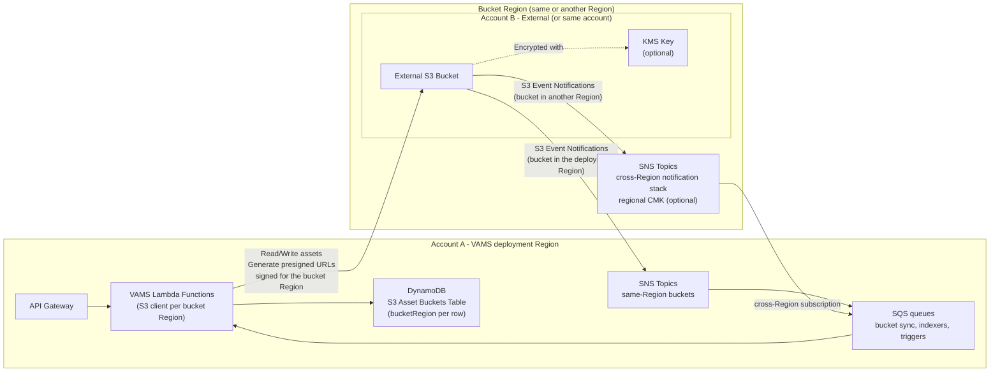
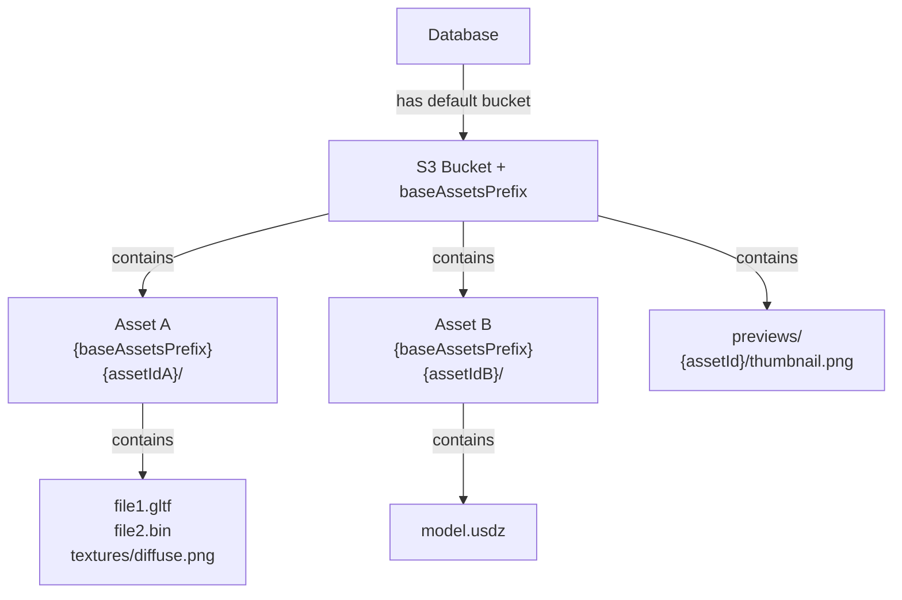
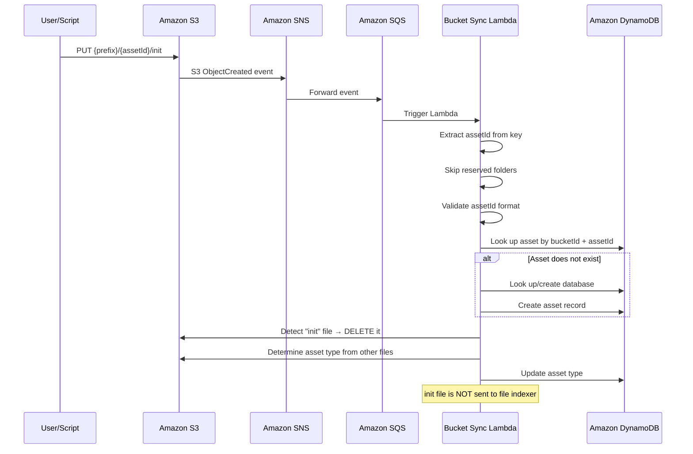

# External Amazon S3 bucket setup

VAMS supports connecting to existing Amazon Simple Storage Service (Amazon S3) buckets for asset storage. This enables you to use pre-existing data lakes, shared buckets, or buckets in separate AWS accounts without migrating data into VAMS-managed buckets.

## When to use external S3 buckets

Consider using external S3 buckets in the following scenarios:

-   **Existing data** -- You have assets already organized in S3 buckets and want to register them in VAMS without copying data.
-   **Shared buckets** -- Multiple applications or teams share the same S3 bucket and you need VAMS to access a specific prefix.
-   **Cross-account access** -- Assets reside in a different AWS account and must remain there for organizational or billing reasons.
-   **Compliance requirements** -- Data residency or governance policies require assets to stay in specific buckets or accounts.
-   **Cross-Region data** -- Assets reside in a bucket in another AWS Region of the same partition and are managed from one VAMS deployment.

## Architecture overview

The following diagram illustrates how VAMS interacts with external S3 buckets.


```mermaid
graph LR
    subgraph "Account A - VAMS deployment Region"
        VAMS_Lambdas["VAMS Lambda Functions<br/>(S3 client per bucket Region)"]
        API["API Gateway"]
        DDB["DynamoDB<br/>S3 Asset Buckets Table<br/>(bucketRegion per row)"]
        SQS["SQS queues<br/>bucket sync, indexers, triggers"]
        SNS_A["SNS Topics<br/>same-Region buckets"]
    end

    subgraph "Bucket Region (same or another Region)"
        subgraph "Account B - External (or same account)"
            ExtBucket["External S3 Bucket"]
            KMS_B["KMS Key<br/>(optional)"]
        end
        SNS_B["SNS Topics<br/>cross-Region notification stack<br/>regional CMK (optional)"]
    end

    API --> VAMS_Lambdas
    VAMS_Lambdas -->|"Read/Write assets<br/>Generate presigned URLs<br/>signed for the bucket Region"| ExtBucket
    ExtBucket -->|"S3 Event Notifications<br/>(bucket in the deployment Region)"| SNS_A
    ExtBucket -->|"S3 Event Notifications<br/>(bucket in another Region)"| SNS_B
    SNS_A --> SQS
    SNS_B -->|"cross-Region subscription"| SQS
    SQS --> VAMS_Lambdas
    VAMS_Lambdas --> DDB
    ExtBucket -.->|"Encrypted with"| KMS_B
```

**Account A** is the AWS account where VAMS is deployed. **Account B** is the AWS account containing the external S3 bucket. Account A and Account B can be the same account, and the bucket can be in the deployment Region or in another Region of the same partition. Amazon S3 delivers a bucket's event notifications only to a destination in the bucket's own Region, so the notification topics for a bucket in another Region live in a separate CloudFormation stack deployed into that Region, and the deployment-Region queues subscribe to them across Regions (see [Cross-Region buckets](#cross-region-buckets)).

:::warning[Cross-account responsibilities differ from same-account]
When the external bucket lives in a **different** AWS account, VAMS cannot configure the bucket on your behalf the way it does for buckets it owns. Because VAMS imports the bucket by Amazon Resource Name (ARN) only, several policies that VAMS applies automatically to its own buckets must instead be applied **by the bucket owner in Account B before deployment**:

-   **TLS enforcement** -- VAMS does **not** add the `aws:SecureTransport=false` deny statement to an external bucket. You must add it to the bucket policy yourself ([Step 1](#step-1-configure-the-s3-bucket-policy)).
-   **Additional bucket policy statements** -- Custom statements from `infra/config/policy/s3AdditionalBucketPolicyConfig.json` are **not** applied to external buckets. Replicate them in the bucket policy in Account B if required.
-   **Event notifications** -- VAMS configures Amazon S3 event notifications on the bucket during deployment. This requires the VAMS deployment to have bucket-owner permissions on the external bucket, including `s3:GetBucketNotification` so that existing notification entries can be read and preserved (see [Step 1](#step-1-configure-the-s3-bucket-policy) and the [limitations](#known-limitations-for-cross-account-buckets) below).
-   **Encryption key access** -- Both the VAMS-owned AWS KMS key (used by the notification topics) and the external bucket's KMS key (if any) require cross-account key policy grants ([Step 3](#step-3-configure-kms-key-policy-conditional)).

Review [Known limitations for cross-account buckets](#known-limitations-for-cross-account-buckets) before deploying.
:::

## Configuration

External buckets are defined in the VAMS CDK configuration file at `infra/config/config.json` under the `app.assetBuckets.externalAssetBuckets` array.

### Bucket entry format

Each entry in the `externalAssetBuckets` array supports the following fields:

| Field                   | Type    | Required                            | Description                                                                                                                                                                                                                                                                                                                                                                                                                                                                   |
| ----------------------- | ------- | ----------------------------------- | ----------------------------------------------------------------------------------------------------------------------------------------------------------------------------------------------------------------------------------------------------------------------------------------------------------------------------------------------------------------------------------------------------------------------------------------------------------------------------- |
| `bucketArn`             | String  | Yes                                 | The full Amazon Resource Name (ARN) of the external S3 bucket.                                                                                                                                                                                                                                                                                                                                                                                                                |
| `baseAssetsPrefix`      | String  | Yes                                 | The S3 key prefix under which VAMS manages assets. Must end with `/` or be `/` for the bucket root.                                                                                                                                                                                                                                                                                                                                                                           |
| `defaultSyncDatabaseId` | String  | Yes                                 | The VAMS database ID that assets discovered in this bucket are assigned to.                                                                                                                                                                                                                                                                                                                                                                                                   |
| `bucketAccountId`       | String  | Recommended for cross-account       | The 12-digit AWS account ID that owns the bucket. Enables VAMS to import the bucket as cross-account and to scope event-notification source policies.                                                                                                                                                                                                                                                                                                                         |
| `bucketRegion`          | String  | Required for a cross-Region bucket  | The AWS Region the bucket is in; defaults to the deployment Region when omitted. A bucket in another Region of the deployment's partition is supported: its notification topics are created in that Region by a per-Region stack, and VAMS signs every request for that Region ([Cross-Region buckets](#cross-region-buckets)). The default asset bucket (`isDefault`) must be in the deployment Region; a malformed Region or one in another partition is rejected at synth. |
| `bucketKmsKeyArn`       | String  | Required for a customer managed key | The key ARN (not an alias ARN) of the customer managed AWS KMS key the bucket is encrypted with. VAMS grants this key to its Lambda and pipeline roles so they can read and write objects. Not needed for SSE-S3 or for the AWS managed key `aws/s3`, which works only when the bucket is in the VAMS account.                                                                                                                                                                |
| `isDefault`             | Boolean | Required if no bucket is created    | Marks this bucket as the VAMS default asset bucket, which holds every pipeline template body and all workflow run I/O. At most one entry may set it to `true`. When `app.assetBuckets.createNewBucket` is `false`, exactly one entry must set it; when a bucket is created, an entry that sets it overrides the created bucket.                                                                                                                                               |

:::note[Registering a bucket under multiple prefixes]
The same `bucketArn` may appear more than once in the `externalAssetBuckets` array — for example to map two databases to two different prefixes within one bucket — **provided the prefixes do not overlap**. Two prefixes overlap when one is a path-prefix of the other (for example, `data/` and `data/sub/`), and the bucket root (`/`) overlaps every other prefix. Overlapping prefixes are rejected because Amazon S3 permits only one notification configuration per bucket and cannot route an object event to an ambiguous prefix.

When a bucket ARN is repeated, its `bucketAccountId`, `bucketRegion`, and `bucketKmsKeyArn` values must be identical across every entry (they describe one physical bucket). The CDK deployment fails validation if it detects overlapping prefixes or inconsistent per-bucket attributes.
:::

### Example configuration

```json
{
    "app": {
        "assetBuckets": {
            "createNewBucket": true,
            "defaultNewBucketSyncDatabaseId": "default-database",
            "externalAssetBuckets": [
                {
                    "bucketArn": "arn:aws:s3:::my-external-assets",
                    "baseAssetsPrefix": "vams-assets/",
                    "defaultSyncDatabaseId": "external-db-001",
                    "bucketAccountId": "222222222222",
                    "bucketRegion": "us-east-1",
                    "bucketKmsKeyArn": "arn:aws:kms:us-east-1:222222222222:key/abcd1234-..."
                },
                {
                    "bucketArn": "arn:aws-us-gov:s3:::govcloud-assets",
                    "baseAssetsPrefix": "/",
                    "defaultSyncDatabaseId": "govcloud-db-001"
                }
            ]
        }
    }
}
```

:::note[Partition-aware ARNs]
Use the correct ARN partition for your environment. Commercial AWS uses `arn:aws:s3:::`, AWS GovCloud (US) uses `arn:aws-us-gov:s3:::`, and the AWS European Sovereign Cloud uses `arn:aws-eusc:s3:::`. The external bucket ARN must use the same partition as the VAMS deployment.
:::

:::warning[Prefix requirements]
The `baseAssetsPrefix` must end with a forward slash (`/`) unless it is set to `/` for the bucket root. The CDK deployment validates this requirement and fails with an error if violated.
:::

### Example: one bucket shared by two databases

To map two databases to two non-overlapping prefixes within the same bucket, repeat the `bucketArn` with different `baseAssetsPrefix` and `defaultSyncDatabaseId` values. Any cross-account or KMS attributes must match across the entries.

```json
{
    "app": {
        "assetBuckets": {
            "externalAssetBuckets": [
                {
                    "bucketArn": "arn:aws:s3:::shared-assets",
                    "baseAssetsPrefix": "teamA/",
                    "defaultSyncDatabaseId": "team-a-db",
                    "bucketAccountId": "222222222222"
                },
                {
                    "bucketArn": "arn:aws:s3:::shared-assets",
                    "baseAssetsPrefix": "teamB/",
                    "defaultSyncDatabaseId": "team-b-db",
                    "bucketAccountId": "222222222222"
                }
            ]
        }
    }
}
```

### Example: a bucket in another Region

A bucket in another Region of the same partition is registered the same way, with `bucketRegion` naming its Region. VAMS creates that bucket's notification topics in `us-east-1` and the deployment-Region queues subscribe to them.

```json
{
    "app": {
        "assetBuckets": {
            "createNewBucket": true,
            "defaultNewBucketSyncDatabaseId": "default-database",
            "externalAssetBuckets": [
                {
                    "bucketArn": "arn:aws:s3:::east-coast-scans",
                    "baseAssetsPrefix": "/",
                    "defaultSyncDatabaseId": "east-coast-db",
                    "bucketRegion": "us-east-1"
                }
            ]
        },
        "useGlobalVpc": {
            "enabled": true,
            "useForAllLambdas": true,
            "addVpcEndpoints": true,
            "addCrossRegionS3Endpoints": true
        }
    }
}
```

## Cross-Region buckets

An external bucket may be in a Region other than the one VAMS is deployed in, as long as both are in the same AWS partition. Registering it needs nothing beyond `bucketRegion`; the sections below describe what VAMS deploys for such a bucket, what the bucket owner still grants, and which network path the deployment's Lambda functions and pipelines take to reach it.

### The per-Region notification stack

Amazon S3 delivers a bucket's event notifications only to a destination in the bucket's Region. For every Region that holds at least one external asset bucket outside the deployment Region, VAMS therefore deploys an additional CloudFormation stack into that Region, named `<name>-xregion-<baseStackName>-<bucketRegion>`. `<baseStackName>` is the configured `app.baseStackName` with the deployment Region already appended, the same value the core stack name carries: a deployment with `name: vams`, `app.baseStackName: prod`, `region: us-west-2` and a bucket in `us-east-1` has the core stack `vams-core-prod-us-west-2` and the per-Region stack `vams-xregion-prod-us-west-2-us-east-1` (deployment Region first, bucket Region last). The stack owns, for each registered bucket entry in that Region:

-   the object-created and object-removed Amazon SNS topics, with TLS enforced;
-   the bucket's event notification configuration, merged with any entries another consumer owns exactly as for a same-Region bucket ([Event notifications on a shared bucket](#event-notifications-on-a-shared-bucket));
-   for a cross-account bucket, the topic policy statement that lets the Amazon S3 service publish on behalf of that bucket and account.

The core stack in the deployment Region receives the topic ARNs through CloudFormation cross-Region references and subscribes its existing Amazon SQS queues — bucket sync, the file and asset indexers, the add-on indexers and the workflow trigger queues — to those topics with an `AWS::SNS::Subscription` whose `Region` is the bucket Region. The notification envelope the queues receive is the same as for a same-Region bucket, so every consumer downstream is unchanged. The core stack depends on the per-Region stacks, so `cdk deploy --all` creates them first and deletes them last.

The S3 Asset Buckets table row for every bucket carries `bucketRegion` and, for a cross-account bucket, `bucketAccountId`; `GET /buckets`, the web create-database bucket picker, `vamscli database list-buckets` and the MCP `list_buckets` tool show both.

### The regional encryption key

With `app.useKmsCmkEncryption.enabled`, the topics in a bucket Region are encrypted with a key **in that Region**, because an AWS KMS key is regional and the deployment Region's key cannot encrypt them. Which key depends on how the deployment's CMK is configured:

| `useKmsCmkEncryption` configuration                                               | Key used for the topics in the bucket Region                                                                                                                                                                                                                |
| --------------------------------------------------------------------------------- | ----------------------------------------------------------------------------------------------------------------------------------------------------------------------------------------------------------------------------------------------------------- |
| `enabled: true`, no `optionalExternalCmkArn` (VAMS generates its key)             | VAMS generates one key per bucket Region in the per-Region stack, with the same key policy as the deployment-Region key, annual rotation and `RemovalPolicy.RETAIN`. It carries no alias, so a retained key never collides with the one a redeploy creates. |
| `optionalExternalCmkArn` names a **multi-Region** key (key id begins with `mrk-`) | The replica of that key in the bucket Region (same key id, Region swapped). Replicate the key into every bucket Region before deploying; a missing replica fails the per-Region stack's deployment.                                                         |
| `optionalExternalCmkArn` names a **single-Region** key                            | A single-Region key cannot encrypt topics in another Region, so VAMS generates a key in the bucket Region for the topics only and prints a synth warning. The topic payload is the Amazon S3 event envelope (bucket, key, size, ETag), not object content.  |
| `enabled: false`                                                                  | The topics have no server-side encryption, as in the deployment Region.                                                                                                                                                                                     |

`bucketKmsKeyArn` is never used for the topics: it is the bucket owner's object key, usually in another account.

The deployment-Region queues keep their own CMK; a cross-Region topic delivers into a CMK-encrypted queue through the key policy's `sns.amazonaws.com` grant, which needs no `kms:ViaService` condition.

A generated regional key is retained when the stack is deleted ([Uninstall](./uninstall.md)) and is listed under the cross-Region stack in the [AWS resources](../architecture/aws-resources.md) reference.

### What the bucket owner grants

The cross-account steps in this guide apply unchanged to a cross-Region bucket: the bucket policy ([Step 1](#step-1-configure-the-s3-bucket-policy)), CORS ([Step 2](#step-2-configure-cors)), the bucket key policy ([Step 3a](#3a-external-bucket-cmk-in-account-b-if-the-bucket-uses-sse-kms)) and the IAM policy ([Step 4](#step-4-configure-cross-account-iam-conditional)). Two details differ:

-   The notification handler that writes the bucket's notification configuration runs in the **per-Region stack**, so the `s3:GetBucketNotification` and `s3:PutBucketNotification` grant in the bucket policy must admit the VAMS account for that stack's role as well — the account-root grant in Step 1 already does.
-   With a VAMS-generated CMK, the key the Amazon S3 service needs for a cross-account bucket's notifications is the **regional** key in the per-Region stack, and VAMS adds the `aws:SourceAccount` statement for the bucket's account to that key. [Step 3b](#3b-vams-owned-cmk-in-account-a-if-usekmscmkencryption-is-enabled) applies to an imported key: replicate your multi-Region key into the bucket Region and add the statement to it there.

### The default asset bucket stays in the deployment Region

The default asset bucket (`isDefault`, or the bucket VAMS creates) holds every pipeline template body and all workflow run I/O, which the workflow Lambda functions and the pipeline compute read and write from the deployment Region. An entry that sets `isDefault: true` with a `bucketRegion` other than the deployment Region is rejected at synth with a message naming both Regions. A cross-Region bucket is registered as a non-default bucket whose databases hold assets; workflow runs on those assets read their inputs from the bucket Region and write their run I/O to the default bucket.

### How the deployment reaches the bucket Region

Every VAMS Lambda function and pipeline signs its Amazon S3 requests for the bucket's Region (the row's `bucketRegion`), builds no fixed endpoint hostname, and uses the regional endpoint for `us-east-1` rather than the global one. Where those requests travel depends on the deployment's network placement. Three variations cover it:

#### Variation A: every bucket in the deployment Region

The configuration most deployments run. With `app.useGlobalVpc.enabled`, the VPC's Amazon S3 **gateway** endpoint serves every bucket, because a gateway endpoint reaches Amazon S3 in its own Region only. Nothing else in this section applies.

#### Variation B: a cross-Region bucket with `addCrossRegionS3Endpoints` on (default, commercial partition)

With `app.useGlobalVpc.enabled`, `app.useGlobalVpc.addCrossRegionS3Endpoints: true` and at least one bucket in another Region, the VPC builder adds one Amazon S3 **interface** endpoint per distinct bucket Region in the isolated subnets — a cross-Region AWS PrivateLink endpoint whose service is `com.amazonaws.<bucketRegion>.s3` with `ServiceRegion` set to the bucket Region, private DNS on, one network interface per Availability Zone (two or more), and the shared VPC endpoint security group (HTTPS from the VPC CIDR). Private DNS resolves `s3.<bucketRegion>.amazonaws.com` and `*.s3.<bucketRegion>.amazonaws.com` to the endpoint from inside the VPC, so Lambda functions in the VPC (`useForAllLambdas`) and pipeline compute in the isolated or private subnets reach the bucket without internet egress. The flag is `true` in every shipped template and is inert until a cross-Region bucket is configured.

Three operating points to plan for:

-   **Permissions and Regions.** Creating a cross-Region endpoint requires the permission-only action `vpce:AllowMultiRegion` on the deploying principal and no service control policy that denies it; an opt-in Region must be opted in. The deployment fails at the VPC nested stack otherwise ([Prerequisites](./prerequisites.md)).
-   **Provisioning time and cost.** A cross-Region interface endpoint takes considerably longer to become available than a same-Region one (on the order of 10–15 minutes), which lengthens the first deployment. It is billed per endpoint hour per Availability Zone plus per gigabyte processed; data transfer between Regions is billed separately ([Networking](../architecture/networking.md)).
-   **Copies between Regions.** An Amazon S3 interface endpoint does not serve `CopyObject` or `UploadPartCopy` between buckets in different Regions. When the Lambda functions run in the VPC, a copy from the default bucket into a cross-Region asset bucket (for example a workflow writing its outputs back onto an asset, or a file copied between databases in different Regions) is streamed instead — read from the source Region, multipart upload to the destination Region, same metadata, content headers and ACL. The data crosses the Lambda function, so such copies take roughly twice the transfer time of a same-Region copy.

Cross-Region AWS PrivateLink to AWS services is offered in the **commercial partition only**. In AWS GovCloud (US), the AWS European Sovereign Cloud and the ISO partitions, a cross-Region bucket with the flag `true` is rejected at synth with a message naming the flag and both Regions; set the flag to `false` and provide the network path yourself (Variation C).

#### Variation C: a cross-Region bucket with the flag off, or a restricted partition

VAMS creates no endpoint for the bucket Region and the operator provides the path from the VPC to Amazon S3 in that Region: an interface endpoint created outside VAMS, a NAT gateway, or a proxy. Without one, every upload, download and index operation on that bucket fails from inside the VPC, and `getConfig()` prints a warning naming the bucket Regions when `useForAllLambdas` is on with the flag off. A deployment whose Lambda functions run **outside** the VPC (`useForAllLambdas: false`) reaches the bucket Region over the public Amazon S3 endpoints and needs nothing further for the API path; only the in-VPC consumers below are affected.

### Pipelines and cross-Region inputs

Which pipelines can process an asset in a cross-Region bucket depends on where their compute runs:

| Compute placement                                                                                                                                         | Cross-Region input                                                                                                                                                                                                                                                                                                                                                   |
| --------------------------------------------------------------------------------------------------------------------------------------------------------- | -------------------------------------------------------------------------------------------------------------------------------------------------------------------------------------------------------------------------------------------------------------------------------------------------------------------------------------------------------------------- |
| Lambda-container pipelines (3D Basic Conversion, CAD/Mesh Metadata Extraction)                                                                            | Supported. The function reads the input with a client for the Region the manifest names and writes outputs to the default bucket in the deployment Region. In the VPC it uses the cross-Region endpoint (Variation B) or the operator's path (Variation C).                                                                                                          |
| AWS Batch, Amazon ECS and Amazon EKS pipelines in **private** subnets (Splat Toolbox, ModelOps, RapidPipeline, NVIDIA Cosmos, Cosmos 3, GR00T, Isaac Lab) | Supported. The pipeline passes each asset bucket's Region from the manifest into the job definition (`bucketRegions`), and the container signs its requests for that bucket with a client for that Region; it reaches Amazon S3 there through the subnets' egress (NAT gateway) or the cross-Region endpoint.                                                        |
| AWS Batch pipelines in **isolated** subnets (Potree viewer, 3D thumbnail, GenAI metadata labeling, coordinate transform)                                  | **Not supported.** Isolated subnets reach Amazon S3 through the deployment Region's gateway endpoint only. The pipeline's `vamsExecute` function rejects a cross-Region input before submitting the job and reports the cause through `SendTaskFailure`, so the execution fails fast with a message naming both Regions instead of after its compute is provisioned. |

The workflow manifest names the Region of every input file (`inputFiles[].bucketRegion`) and of the output bucket (`outputs.bucketRegion`), and the vendored `manifestHelper` exposes them to a pipeline (`inputBucketRegion`, `outputBucketRegion`, `s3_client_for_region`). A Batch pipeline's `vamsExecute` function passes both Regions to `openPipeline` and on to `constructPipeline`, which writes the job definition's `bucketRegions` map (bucket name to Region, deployment-Region buckets left out); the container registers that map before its first Amazon S3 call and signs each registered bucket's requests with a client for its Region, the auxiliary bucket's with its default client. The Splat Toolbox container applies the same map to the upstream `main.py`'s own S3 client. A job definition from an older function carries no map, and the container then signs every request for the deployment Region.

#### Moving an isolated-subnet pipeline to private subnets

A pipeline administrator who needs one of the isolated-subnet pipelines to process cross-Region inputs moves its compute to the private subnets, which have egress to the bucket Region. The change is in the CDK code and is deployed like any other:

1. In `infra/lib/nestedStacks/vpc/vpcBuilder-nestedStack.ts`, add the pipeline's `app.pipelines.*.enabled` flag to the **subnet-creation condition** (the `if` block that pushes `subnetPublicConfig` and `subnetPrivateConfig`) and to the **`needsEcsPrivate`** condition. The first adds public subnets and one NAT gateway per Availability Zone when the pipeline is enabled; the second adds the Amazon ECS control-plane endpoint the private-subnet compute uses. The pipeline-only endpoint block already lists it.
2. In `infra/lib/nestedStacks/pipelines/pipelineBuilder-nestedStack.ts`, pass `pipelineNetwork.privateSubnets.pipeline` instead of `pipelineNetwork.isolatedSubnets.pipeline` as that pipeline's subnets.
3. In the pipeline's `vamsExecute` function, remove the `manifestHelper.enforce_inputs_in_region(resolved)` call that rejects cross-Region inputs.
4. Confirm the egress to Amazon S3 in the bucket Region: the cross-Region interface endpoint (Variation B) serves the private subnets' route to that Region's S3 hostnames as well; otherwise the NAT gateway created in step 1 carries the traffic over the public endpoints.
5. Run the infra tests (`cd infra && npm test`), which include the VPC placement assertions for each pipeline, then `npx cdk deploy`.

The container itself needs no change: its job definition already carries the asset buckets' Regions (`bucketRegions`) and it signs each bucket's requests with a client for that bucket's Region. Expect NAT gateway hourly and data-processing charges for the pipeline's traffic ([Networking](../architecture/networking.md)).

### Latency and data transfer

Every read and write of an asset in a cross-Region bucket crosses a Region boundary, which adds latency and inter-Region data transfer cost to operations that routinely move multi-gigabyte 3D assets; a workflow's outputs are written to the default bucket in the deployment Region and then copied onto the asset in its own Region. Where a bucket's Region was chosen for data-residency reasons, note that pipeline compute processes its data in the deployment Region. For a workload that is mostly in one Region, deploy VAMS into that Region.

### Verifying a cross-Region bucket

After the deployment completes:

1. Confirm the per-Region stack exists in the bucket Region (`aws cloudformation describe-stacks --region <bucketRegion> --stack-name <name>-xregion-<baseStackName>-<bucketRegion>`) and that the bucket's notification configuration names its topics (`aws s3api get-bucket-notification-configuration --bucket <bucket>`).
2. Upload a file directly to the bucket under the registered prefix and confirm the asset appears in VAMS: the cross-Region subscription delivered the event into the deployment-Region queue.
3. Request a download or upload URL for a file in that bucket through the web interface, the API or `vamscli`; the URL's host is `s3.<bucketRegion>.amazonaws.com` (or the bucket's virtual-hosted name in that Region) and its `X-Amz-Credential` scope names the bucket Region.
4. With `useKmsCmkEncryption.enabled`, confirm the regional key in the per-Region stack's outputs and that the deployment-Region queue received the message (a topic whose deliveries are refused shows them in its `NumberOfNotificationsFailed` metric in the bucket Region).
5. In a VPC deployment with `addCrossRegionS3Endpoints`, confirm the endpoint is `available` (`aws ec2 describe-vpc-endpoints --filters Name=service-name,Values=com.amazonaws.<bucketRegion>.s3`) before testing uploads from in-VPC Lambda functions.

## Step-by-step setup

Follow these steps to connect an external S3 bucket to VAMS. Complete Steps 1-4 **before** deploying the VAMS CDK stack.

### Step 1: Configure the S3 bucket policy

Add a bucket policy to the external S3 bucket that grants the VAMS account access. This policy must be applied before the CDK deployment because VAMS attempts to configure event notifications during deployment, and because VAMS does not apply the TLS or additional bucket policies to buckets it does not own.

The policy below grants data access, the bucket-owner permissions required to configure event notifications, and enforces TLS (replicating the protection VAMS applies automatically to its own buckets).

```json
{
    "Version": "2012-10-17",
    "Statement": [
        {
            "Sid": "AllowVAMSAccess",
            "Effect": "Allow",
            "Principal": {
                "AWS": "arn:aws:iam::<VAMS_ACCOUNT_ID>:root"
            },
            "Action": "s3:*",
            "Resource": ["arn:aws:s3:::<BUCKET_NAME>", "arn:aws:s3:::<BUCKET_NAME>/*"]
        },
        {
            "Sid": "DenyNonTLS",
            "Effect": "Deny",
            "Principal": "*",
            "Action": "s3:*",
            "Resource": ["arn:aws:s3:::<BUCKET_NAME>", "arn:aws:s3:::<BUCKET_NAME>/*"],
            "Condition": {
                "Bool": { "aws:SecureTransport": "false" }
            }
        }
    ]
}
```

Replace the following placeholder values:

-   `<VAMS_ACCOUNT_ID>` -- The 12-digit AWS account ID where VAMS is deployed.
-   `<BUCKET_NAME>` -- The name of the external S3 bucket.

The `s3:*` grant intentionally includes `s3:GetBucketNotification`, `s3:PutBucketNotification`, and `s3:GetBucketVersioning`. VAMS calls these during deployment from AWS CloudFormation custom resource Lambda functions in Account A to wire event notifications and detect versioning. If you scope the grant down from `s3:*`, you must include these actions explicitly or deployment will fail.

The grant also covers `s3:PutObject` and `s3:PutObjectAcl`. Every VAMS write into the bucket — uploads, folder markers, and the in-place object copies that back file move, rename, revert, unarchive, set-primary-type, and pipeline-output ingestion — sets the `bucket-owner-full-control` canned ACL so the object is owned by Account B rather than by the writing Account A role. `s3:PutObjectAcl` authorizes that canned ACL. If you scope the grant down from `s3:*` and the bucket has ACLs enabled (see [object ownership](#object-ownership-cross-account-writes) below), include both `s3:PutObject` and `s3:PutObjectAcl` or writes fail with `AccessDenied`.

:::danger[Do not restrict the bucket policy to an application-prefixed principal]
Avoid narrowing this grant with an `aws:PrincipalArn` condition that matches only `role/<APP_NAME>*`. The IAM roles that configure event notifications and check versioning are **CDK-generated custom resource roles** (for example `BucketNotificationsHandler...` and the S3 asset buckets table populator provider role). These roles are **not** named with your application prefix, so such a condition denies them and deployment fails with `AccessDenied`.

If you require principal scoping, grant the VAMS account root (as shown above) and rely on Account A's IAM policies to constrain which roles use the access, or enumerate the specific CDK-generated role ARNs after a first deployment and add them explicitly.
:::

#### Object ownership (cross-account writes)

When VAMS runs in Account A and writes objects into a bucket owned by Account B, the object's owner depends on the bucket's **Object Ownership** setting. VAMS sets the `bucket-owner-full-control` canned ACL on every object it writes so that Account B retains control regardless of which setting the bucket uses, but the recommended configuration removes the ambiguity entirely:

-   **Bucket owner enforced (recommended)** — ACLs are disabled and every object is automatically owned by the bucket owner (Account B). The canned ACL VAMS sends is accepted as a no-op, and `s3:PutObjectAcl` is not required. This is the default for buckets created after April 2023 and is the preferred setting for a VAMS external bucket.
-   **Bucket owner preferred / Object writer** — ACLs are enabled. Without the canned ACL, an object written by Account A is owned by Account A, and Account B (including its own VAMS instance, indexers, and presigned-URL access) may be unable to read or manage it. VAMS sends `bucket-owner-full-control` to grant the bucket owner control, which requires the `s3:PutObjectAcl` action in the bucket policy ([Step 1](#step-1-configure-the-s3-bucket-policy) `s3:*` grant covers it).

This applies to same-account buckets as well when the bucket is owned by a different account than the one VAMS runs in. For a bucket VAMS and its assets share within one account, object ownership is never in question.

### Step 2: Configure CORS

Apply a Cross-Origin Resource Sharing (CORS) configuration to the external bucket. This is required for browser-based operations including presigned URL uploads and downloads, and for viewers that read a file in byte ranges. The rule below allows every method and exposes every response header that VAMS configures on the asset bucket it creates. Save the following as `cors-config.json`:

```json
{
    "CORSRules": [
        {
            "AllowedHeaders": ["*"],
            "AllowedMethods": ["GET", "PUT", "POST", "HEAD"],
            "AllowedOrigins": ["https://your-vams-domain.example.com"],
            "ExposeHeaders": [
                "ETag",
                "Accept-Ranges",
                "Content-Range",
                "Content-Length",
                "Content-Encoding",
                "x-amz-server-side-encryption",
                "x-amz-request-id",
                "x-amz-id-2"
            ],
            "MaxAgeSeconds": 3600
        }
    ]
}
```

`AllowedMethods` accepts only `GET`, `PUT`, `POST`, `DELETE`, and `HEAD`. Amazon S3 answers the browser's `OPTIONS` preflight request from these rules, so `OPTIONS` is not listed. `ExposeHeaders` makes response headers readable by the VAMS web application: `ETag` for multipart uploads, which read each part's ETag from the upload response, and `Accept-Ranges`, `Content-Range`, `Content-Length`, and `Content-Encoding`, the range and streaming headers the VAMS-created asset bucket exposes, so a ranged read returns the same readable headers from either bucket.

Apply the CORS configuration using the AWS Command Line Interface (AWS CLI):

```bash
aws s3api put-bucket-cors \
    --bucket <BUCKET_NAME> \
    --cors-configuration file://cors-config.json
```

To configure CORS in the Amazon S3 console instead, paste only the array inside `CORSRules` into the bucket's CORS editor.

:::warning[Production origins]
Replace `https://your-vams-domain.example.com` with your actual VAMS Amazon CloudFront distribution domain or Application Load Balancer (ALB) domain. Avoid using `*` in production environments.
:::

### Step 3: Configure KMS key policy (conditional)

Cross-account encryption involves **two** AWS Key Management Service (AWS KMS) keys, each requiring its own configuration. Skip the parts that do not apply to your setup.

#### 3a. External bucket CMK in Account B (if the bucket uses SSE-KMS)

If the external bucket uses a customer managed key (CMK) for encryption, the key policy in **Account B** must grant the VAMS account permission to decrypt and generate data keys. Granting the account root is the simplest option; when the bucket entry sets `bucketKmsKeyArn`, the VAMS Lambda and pipeline roles in Account A then receive matching grants automatically (see [Step 4](#step-4-configure-cross-account-iam-conditional)).

```json
{
    "Sid": "AllowVAMSKMSAccess",
    "Effect": "Allow",
    "Principal": {
        "AWS": "arn:aws:iam::<VAMS_ACCOUNT_ID>:root"
    },
    "Action": ["kms:Decrypt", "kms:GenerateDataKey", "kms:DescribeKey"],
    "Resource": "*"
}
```

This step is not required if the bucket uses Amazon S3 managed keys (SSE-S3).

:::warning[VAMS Lambda and pipeline roles need the external key, not only the deploy identity]
Granting the external CMK to the VAMS account root is necessary but not sufficient on its own. Every VAMS Lambda execution role and every pipeline container/task role that reads or writes the external bucket must also carry `kms:Decrypt` and `kms:GenerateDataKey` on the **external** key.

Set the `bucketKmsKeyArn` field on the bucket entry in `config.json`. When this field is present, VAMS grants the external key to its Lambda and pipeline roles automatically during deployment. The key policy in Account B must still admit the VAMS account (the statement above). If you omit `bucketKmsKeyArn`, no grant is generated and download and pipeline operations on KMS-encrypted external objects fail with `KMS.AccessDeniedException`.
:::

#### 3b. VAMS-owned CMK in Account A (if `useKmsCmkEncryption` is enabled)

When VAMS is deployed with `app.useKmsCmkEncryption.enabled = true`, the per-bucket Amazon Simple Notification Service (Amazon SNS) topics that receive S3 event notifications are encrypted with the VAMS-owned CMK. For Amazon S3 in **Account B** to publish event notifications to those topics, the Amazon S3 service principal acting on behalf of the external bucket must be able to generate data keys with the VAMS key.

What the VAMS key policy needs depends on how VAMS obtained the key:

-   **Key generated by VAMS**: no action. The generated key policy already lets the `s3.amazonaws.com` service principal use the key, and when a bucket entry sets `bucketAccountId`, VAMS also adds the statement below, scoped to those accounts.
-   **Key imported with `app.useKmsCmkEncryption.optionalExternalCmkArn`**: VAMS cannot change the policy of a key it imports, so the key policy must let the `s3.amazonaws.com` service principal use the key. Either apply the grant that the **External CMK key policy** box in [KMS encryption](configuration-reference.md#kms-encryption-appusekmscmkencryption) lists, or, to scope Amazon S3 by source account, add the statement below with one `aws:SourceAccount` value for each account whose buckets publish to VAMS: each external bucket account and, when VAMS creates an asset bucket, the VAMS account.

If notifications from the external bucket do not arrive and you use a VAMS CMK, this key policy is the first place to check. The statement below admits the Amazon S3 service principal for requests from the listed bucket accounts:

```json
{
    "Sid": "AllowExternalBucketS3Notifications",
    "Effect": "Allow",
    "Principal": { "Service": "s3.amazonaws.com" },
    "Action": ["kms:GenerateDataKey*", "kms:Decrypt"],
    "Resource": "*",
    "Condition": {
        "StringEquals": { "aws:SourceAccount": "<BUCKET_ACCOUNT_ID>" }
    }
}
```

This is not required if VAMS is deployed without a CMK (SSE-managed SNS encryption), or if the external bucket is in the same account as VAMS.

#### 3c. Restricting presigned URLs by network (optional)

VAMS does not apply resource policies to externally imported buckets, so network restrictions on presigned URLs for an external bucket are configured by the bucket owner directly in the bucket policy. The following deny statement restricts presigned (query-string authenticated) requests to a set of allowed IP CIDR ranges and/or Amazon S3 VPC endpoint IDs. It is the same statement VAMS applies to its created asset and auxiliary buckets when `app.assetBuckets.presignedUrlNetworkRestrictions` is configured.

```json
{
    "Sid": "DenyPresignedUrlOutsideAllowedNetworks",
    "Effect": "Deny",
    "Principal": "*",
    "Action": "s3:*",
    "Resource": "arn:aws:s3:::<EXTERNAL_BUCKET_NAME>/*",
    "Condition": {
        "StringEquals": { "s3:authType": "REST-QUERY-STRING" },
        "BoolIfExists": { "aws:ViaAWSService": "false" },
        "NotIpAddressIfExists": { "aws:SourceIp": ["<ALLOWED_CIDR_1>", "<ALLOWED_CIDR_2>"] },
        "StringNotEqualsIfExists": { "aws:SourceVpce": ["<ALLOWED_VPCE_ID>"] }
    }
}
```

The `s3:authType` condition limits the statement to presigned requests only — SDK calls use header authentication, so VAMS backend Lambda functions, pipeline containers, and the bucket owner's own tooling are unaffected. `aws:SourceIp` accepts IPv4 and IPv6 CIDR blocks; `aws:SourceVpce` accepts both interface and gateway Amazon S3 VPC endpoint IDs. Restrict on one network dimension: include the `NotIpAddressIfExists` condition when restricting by IP range, or the `StringNotEqualsIfExists` condition when restricting by VPC endpoint, and omit the other. This matches the behavior VAMS enforces for its created buckets.

:::warning[Test before relying on the restriction]
A misconfigured CIDR list can block all presigned URL access to the bucket, including your own. After applying the statement, verify that a presigned URL generated by VAMS works from an allowed network and is denied from a disallowed one before treating the restriction as active.
:::

### Step 4: Configure cross-account IAM (conditional)

VAMS accesses external buckets using the **execution-role credentials of its own Lambda functions and pipeline tasks directly against the bucket** — it does **not** assume a role in Account B. Cross-account access therefore depends on the resource policies in Account B (the bucket policy from [Step 1](#step-1-configure-the-s3-bucket-policy) and the KMS key policy from [Step 3](#step-3-configure-kms-key-policy-conditional)) granting access to the VAMS account, combined with IAM policies in Account A on the VAMS roles.

:::note[No `sts:AssumeRole` role is required]
Do not create an assumable IAM role in Account B for this integration — VAMS does not assume a cross-account role. The integration works through cross-account resource policies plus the VAMS execution-role IAM policies described below.
:::

#### In Account B (bucket account)

No IAM role is required. Ensure the **bucket policy** ([Step 1](#step-1-configure-the-s3-bucket-policy)) and, if applicable, the **KMS key policy** ([Step 3a](#3a-external-bucket-cmk-in-account-b-if-the-bucket-uses-sse-kms)) grant the VAMS account access.

#### In Account A (VAMS account)

VAMS grants its Lambda and pipeline roles S3 access to every registered bucket ARN automatically during deployment, so S3 data access works once Account B's bucket policy allows the VAMS account.

If the external bucket uses an Account B CMK, set the `bucketKmsKeyArn` field on the bucket entry in `config.json` ([Bucket entry format](#bucket-entry-format)). VAMS then grants `kms:Decrypt`, `kms:GenerateDataKey*`, and `kms:DescribeKey` on that key to its Lambda and pipeline roles automatically during deployment.

The field takes one key, so if objects under the prefix are also encrypted with another customer managed key, attach the following policy for that key to the VAMS Lambda and pipeline roles. It grants the same actions that VAMS grants when the field is set, but VAMS does not maintain it, so a role that a later deployment adds does not receive it:

```json
{
    "Version": "2012-10-17",
    "Statement": [
        {
            "Effect": "Allow",
            "Action": ["kms:Decrypt", "kms:GenerateDataKey*", "kms:DescribeKey"],
            "Resource": ["arn:aws:kms:<REGION>:<BUCKET_ACCOUNT_ID>:key/<EXTERNAL_KEY_ID>"]
        }
    ]
}
```

Also ensure the IAM identity used to deploy VAMS can access the external bucket so the deployment-time custom resources succeed:

```json
{
    "Version": "2012-10-17",
    "Statement": [
        {
            "Effect": "Allow",
            "Action": ["s3:*"],
            "Resource": ["arn:aws:s3:::<BUCKET_NAME>", "arn:aws:s3:::<BUCKET_NAME>/*"]
        }
    ]
}
```

### Step 5: Update VAMS configuration and deploy

1. Edit `infra/config/config.json` and add your external bucket entries to the `externalAssetBuckets` array as shown in the [example configuration](#example-configuration).

2. Deploy the VAMS stack:

    ```bash
    cd infra
    npx cdk deploy --all --require-approval never --profile <YOUR_AWS_PROFILE>
    ```

:::info[What happens during deployment]
For external buckets, the CDK deployment imports the bucket by ARN, creates Amazon Simple Notification Service (Amazon SNS) topics and configures S3 event notifications on the bucket, populates the S3 Asset Buckets DynamoDB table with bucket metadata, and grants the VAMS Lambda and pipeline IAM roles permission to access the bucket. When the bucket entry sets `bucketKmsKeyArn`, it also grants those roles `kms:Decrypt`, `kms:GenerateDataKey*`, and `kms:DescribeKey` on that key; without the field, no key grant is generated. It does **not** apply bucket-level policies (TLS enforcement, additional policies), the CORS configuration, or the external key's key policy — those are the bucket owner's responsibility in Account B (Steps 1, 2, and 3a).
:::

## What deployment configures automatically

For a bucket VAMS owns, the deployment applies the full set of bucket policies and encryption settings directly. For an **external** bucket — which VAMS imports by ARN and does not own — the responsibilities split between what VAMS configures from Account A and what the bucket owner must configure in Account B.

VAMS configures automatically (from Account A) for each external bucket entry:

-   **Bucket import** -- Imports the Amazon S3 bucket reference using the provided ARN.
-   **Event notifications** -- Creates Amazon SNS topics and configures Amazon S3 event notifications on the bucket to enable automatic file synchronization. For a bucket in another Region the topics and the notification configuration live in the per-Region stack deployed into that Region ([Cross-Region buckets](#cross-region-buckets)). This requires bucket-owner permissions in Account B. Notification entries that VAMS does not own are preserved (see [Event notifications on a shared bucket](#event-notifications-on-a-shared-bucket)).
-   **DynamoDB registration** -- Populates the S3 Asset Buckets Amazon DynamoDB table with bucket metadata (bucket name, prefix, sync database ID, versioning status, Region and owning account).
-   **Cross-Region network path** -- With `app.useGlobalVpc.enabled` and `addCrossRegionS3Endpoints`, creates one Amazon S3 interface endpoint per bucket Region outside the deployment Region ([Variation B](#variation-b-a-cross-region-bucket-with-addcrossregions3endpoints-on-default-commercial-partition)).
-   **Lambda and pipeline permissions** -- Grants the VAMS Lambda and pipeline IAM roles permission to read from and write to the external bucket ARN.
-   **External KMS key grant** -- When the bucket entry sets `bucketKmsKeyArn`, grants the VAMS Lambda and pipeline IAM roles `kms:Decrypt`, `kms:GenerateDataKey*`, and `kms:DescribeKey` on that key. Without the field, no grant is generated.

The bucket owner must configure manually (in Account B), because VAMS cannot apply these to a bucket it does not own:

-   **TLS enforcement** -- The `aws:SecureTransport=false` deny statement on the bucket policy ([Step 1](#step-1-configure-the-s3-bucket-policy)).
-   **Additional bucket policies** -- Any statements equivalent to `infra/config/policy/s3AdditionalBucketPolicyConfig.json` that your organization requires.
-   **Bucket access grant** -- The bucket policy granting the VAMS account access ([Step 1](#step-1-configure-the-s3-bucket-policy)).
-   **KMS key access** -- The external bucket CMK key policy statement that admits the VAMS account ([Step 3a](#3a-external-bucket-cmk-in-account-b-if-the-bucket-uses-sse-kms)). The IAM grant made in Account A does not cross the account boundary without it.

:::note
Assets store which bucket and prefix they are assigned to upon creation. Changes made directly to Amazon S3 buckets (outside of VAMS) are synchronized back to Amazon DynamoDB tables and Amazon OpenSearch indexes through the event notification pipeline.
:::

## Event notifications on a shared bucket

Amazon S3 allows a single notification configuration per bucket, so a bucket that VAMS shares with another
consumer needs its entries combined rather than replaced. VAMS imports an external bucket by ARN, which
makes the notification configuration **unmanaged** — the deployment reads the bucket's current
configuration, keeps every entry it does not own, appends its own entries, and writes the combined result
back.

Three rules govern which entries survive:

-   **Entries VAMS does not own are preserved.** Ownership is determined by an identifier that the
    deployment stamps on the entries it creates. Topic, queue, and Lambda entries created by anything else —
    another application, a data lake ingestion pipeline, a manually configured notification — are carried
    through unchanged.
-   **On the first deployment against a bucket, every existing entry is treated as external** and is
    therefore preserved.
-   **An existing Amazon EventBridge configuration is always preserved**, because there is no identifier
    that distinguishes an EventBridge configuration created by VAMS from one created by another consumer.

Two consequences follow for the bucket policy and for planning:

-   The bucket policy must grant `s3:GetBucketNotification` in addition to `s3:PutBucketNotification`
    ([Step 1](#step-1-configure-the-s3-bucket-policy)). The read is what makes preservation possible; if it
    is denied, the deployment fails rather than writing a configuration that drops the other consumer's
    entries.
-   Removing VAMS from a bucket removes only the VAMS entries. The other consumer's notifications remain in
    place after the VAMS stack is deleted.

:::note[Prefix filters and overlapping registrations]
Each registered `baseAssetsPrefix` becomes its own prefix-filtered entry within the single notification
configuration. This is why the same bucket ARN may be registered under multiple prefixes but the prefixes
must not overlap — Amazon S3 cannot route an object event to an ambiguous prefix filter. The CDK deployment
rejects overlapping prefixes during configuration validation, before any notification is written.
:::

## Verification

After deployment, use the following checklist to verify the external bucket integration end to end.

### Cross-account access checklist

1. **Check the S3 Asset Buckets table.** Confirm the external bucket appears in the Amazon DynamoDB S3 Asset Buckets table:

    ```bash
    aws dynamodb scan \
        --table-name <VAMS_STACK_NAME>-S3AssetBucketsStorageTable-<ID> \
        --query "Items[?contains(bucketName.S, '<BUCKET_NAME>')]"
    ```

2. **Test direct Amazon S3 operations.** Verify that VAMS Lambda functions can list, read, and write objects in the external bucket by creating an asset via the VAMS API and confirming the file is stored under the configured prefix.

3. **Test presigned URL generation.** Upload a test file through the VAMS web interface or API and confirm the presigned URL is generated for the external bucket, with the bucket's Region in its host and credential scope. Download the file using the generated URL and verify the content is correct.

4. **Test Amazon S3 event notifications.** Upload a file directly to the external bucket under the configured prefix (bypassing VAMS) and verify it appears in VAMS after the Amazon S3 event notification triggers the sync Lambda function.

5. **Test multipart upload operations.** Upload a file larger than 5 MB through the VAMS web interface to verify multipart upload operations work correctly with the external bucket.

6. **Verify Amazon SNS topic configuration.** Confirm that Amazon S3 event notifications on the external bucket are publishing to the correct VAMS Amazon SNS topic by checking the bucket notification configuration in the AWS Management Console.

## Known limitations for cross-account buckets

Because VAMS imports external buckets by ARN — which carries no account identifier — some behaviors that work transparently for same-account buckets require extra attention or have constraints when the bucket lives in another account:

-   **Event notification entries are merged, and the merge depends on a bucket-owner read permission.** VAMS registers its notification entries alongside any that already exist on the bucket rather than replacing the configuration, so a bucket that already publishes events to another consumer — for example an existing data lake ingestion pipeline — keeps those entries. The merge is performed by reading the current configuration and writing it back with the VAMS entries added, which is why the bucket policy must grant `s3:GetBucketNotification` as well as `s3:PutBucketNotification` ([Step 1](#step-1-configure-the-s3-bucket-policy)). If only `s3:PutBucketNotification` is granted, the deployment fails rather than silently discarding the existing entries. See [Event notifications on a shared bucket](#event-notifications-on-a-shared-bucket) for the identity rules that govern which entries VAMS considers its own.
-   **Bucket-level policies are not applied by VAMS.** TLS enforcement and any additional bucket policy statements must be applied by the bucket owner in Account B ([Step 1](#step-1-configure-the-s3-bucket-policy)). VAMS applies these only to buckets it owns.
-   **External KMS access depends on the `bucketKmsKeyArn` field.** When the bucket entry sets `bucketKmsKeyArn`, VAMS grants `kms:Decrypt`, `kms:GenerateDataKey*`, and `kms:DescribeKey` on that key to its Lambda execution roles and pipeline task roles during deployment. The key policy in Account B must still admit the VAMS account ([Step 3a](#3a-external-bucket-cmk-in-account-b-if-the-bucket-uses-sse-kms)) — an IAM grant alone does not cross the account boundary. If you omit `bucketKmsKeyArn`, no grant is generated and KMS-encrypted objects fail with `KMS.AccessDeniedException`; the IAM policy in [Step 4](#step-4-configure-cross-account-iam-conditional) is only for an additional key that the field cannot name.
-   **SNS source-account scoping.** Event notifications from a cross-account bucket publish to VAMS-owned SNS topics. If VAMS uses a CMK, the VAMS key policy must admit the external bucket's account as an S3 notification source ([Step 3b](#3b-vams-owned-cmk-in-account-a-if-usekmscmkencryption-is-enabled)). Delivery failures here are silent — notifications simply do not arrive.
-   **Object ownership on writes.** VAMS writes objects using its Account A execution-role credentials and sets the `bucket-owner-full-control` canned ACL so the bucket owner (Account B) retains control. On a bucket with ACLs enabled, the bucket policy must allow `s3:PutObjectAcl` for this to succeed; on a bucket with Object Ownership set to _Bucket owner enforced_, ownership is automatic and the ACL is a no-op ([object ownership](#object-ownership-cross-account-writes)).
-   **A cross-Region bucket cannot be the default asset bucket, and the isolated-subnet pipelines cannot read it.** Both constraints, the per-Region notification stack, the regional key and the network variations are described in [Cross-Region buckets](#cross-region-buckets). Cross-Region AWS PrivateLink is available in the commercial partition only, so a restricted-partition deployment sets `app.useGlobalVpc.addCrossRegionS3Endpoints` to `false` and supplies its own path to Amazon S3 in the bucket Region.
-   **Partition must match the deployment.** The external bucket ARN must use the same AWS partition as the VAMS deployment — for example both `arn:aws`, or both `arn:aws-us-gov`. This also keeps `kms:ViaService` conditions resolvable.
-   **Prefixes on a shared bucket must not overlap.** A bucket ARN may be registered under multiple prefixes, but Amazon S3 permits only one notification configuration per bucket, so the prefixes must be mutually non-overlapping (no prefix may be a path-prefix of another, and the bucket root cannot be combined with any other prefix). VAMS merges the registrations into a single notification configuration with one prefix-filtered entry per prefix. The CDK deployment fails validation if it detects overlapping prefixes or inconsistent per-bucket attributes (account, region, KMS key) across entries for the same ARN.

## Troubleshooting

| Issue                                                                                                                                                       | Possible cause                                                                                                                                                                                         | Resolution                                                                                                                                                                                                                                                 |
| ----------------------------------------------------------------------------------------------------------------------------------------------------------- | ------------------------------------------------------------------------------------------------------------------------------------------------------------------------------------------------------ | ---------------------------------------------------------------------------------------------------------------------------------------------------------------------------------------------------------------------------------------------------------- |
| CDK deployment fails with `Access Denied`                                                                                                                   | Bucket policy not applied before deployment, or scoped too narrowly to exclude CDK custom resource roles.                                                                                              | Apply the bucket policy from [Step 1](#step-1-configure-the-s3-bucket-policy), grant the VAMS account root, and remove any `aws:PrincipalArn` role-prefix condition, then redeploy.                                                                        |
| CDK deployment fails configuring bucket notifications                                                                                                       | The notification handler role lacks `s3:PutBucketNotification`/`s3:GetBucketNotification` in Account B.                                                                                                | Ensure the [Step 1](#step-1-configure-the-s3-bucket-policy) grant covers these actions (included in `s3:*`) and is not restricted by a principal condition.                                                                                                |
| CDK deployment fails with `baseAssetsPrefix must end in a slash`                                                                                            | The prefix value does not end with `/`.                                                                                                                                                                | Update the prefix in `config.json` to end with `/`.                                                                                                                                                                                                        |
| CDK deployment fails with `overlapping baseAssetsPrefix`                                                                                                    | The same bucket is registered with prefixes where one contains the other (or the root with any prefix).                                                                                                | Choose non-overlapping prefixes for each registration of the bucket, or register the bucket once at the root.                                                                                                                                              |
| CDK deployment fails with `inconsistent bucket...` attributes                                                                                               | The same bucket ARN is registered with differing `bucketAccountId` / `bucketRegion` / `bucketKmsKeyArn`.                                                                                               | Make the cross-account and KMS attributes identical across every entry for that bucket ARN.                                                                                                                                                                |
| Presigned URLs return CORS errors                                                                                                                           | CORS configuration missing or incorrect.                                                                                                                                                               | Verify the CORS policy from [Step 2](#step-2-configure-cors) is applied and `AllowedOrigins` matches your VAMS domain.                                                                                                                                     |
| Files uploaded to bucket do not appear in VAMS                                                                                                              | SNS event notifications not configured, source-account mismatch, or topic KMS access denied.                                                                                                           | Confirm notifications are configured on the bucket and the VAMS CMK admits the external bucket account ([Step 3b](#3b-vams-owned-cmk-in-account-a-if-usekmscmkencryption-is-enabled)). Review AWS CloudTrail logs for access-denied errors.                |
| `KMS.AccessDeniedException` in Lambda logs                                                                                                                  | `bucketKmsKeyArn` is not set, the object uses a key other than the one it names, or the key policy does not grant VAMS access.                                                                         | Set `bucketKmsKeyArn` and redeploy (for an additional key, attach the [Step 4](#step-4-configure-cross-account-iam-conditional) policy), and add the key policy statement from [Step 3a](#3a-external-bucket-cmk-in-account-b-if-the-bucket-uses-sse-kms). |
| Uploads or file operations fail with `AccessDenied` on write                                                                                                | The bucket has ACLs enabled but the bucket policy does not allow `s3:PutObjectAcl`, so the `bucket-owner-full-control` ACL VAMS sets is rejected.                                                      | Include `s3:PutObjectAcl` in the [Step 1](#step-1-configure-the-s3-bucket-policy) grant (covered by `s3:*`), or set the bucket's Object Ownership to _Bucket owner enforced_ to disable ACLs ([object ownership](#object-ownership-cross-account-writes)). |
| Bucket owner cannot read objects VAMS wrote                                                                                                                 | The bucket has ACLs enabled (Object writer / Bucket owner preferred) and objects were written before the canned ACL was applied.                                                                       | Ensure the bucket policy allows `s3:PutObjectAcl`; for objects already written, the bucket owner can reset ownership, or set Object Ownership to _Bucket owner enforced_ ([object ownership](#object-ownership-cross-account-writes)).                     |
| CDK deployment fails with `is marked isDefault but is in '<Region>'`                                                                                        | The entry marked `isDefault: true` carries a `bucketRegion` other than the deployment Region.                                                                                                          | Keep the default asset bucket in the deployment Region; register the cross-Region bucket as a non-default bucket ([default bucket rule](#the-default-asset-bucket-stays-in-the-deployment-region)).                                                        |
| CDK deployment fails with `addCrossRegionS3Endpoints is true, but cross-Region AWS PrivateLink ... commercial partition only`                               | A cross-Region bucket is configured in AWS GovCloud (US), the AWS European Sovereign Cloud or an ISO partition with the endpoint flag on.                                                              | Set `app.useGlobalVpc.addCrossRegionS3Endpoints` to `false` and provide your own path from the VPC to Amazon S3 in the bucket Region ([Variation C](#variation-c-a-cross-region-bucket-with-the-flag-off-or-a-restricted-partition)).                      |
| VPC nested stack fails creating `S3CrossRegionEndpoint-<Region>` with `UnauthorizedOperation` or `InvalidParameter`                                         | The deploying principal lacks `vpce:AllowMultiRegion`, a service control policy denies it, or the bucket Region is an opt-in Region that is not opted in.                                              | Grant `vpce:AllowMultiRegion` to the deployment role and check the SCPs; opt in to the Region ([Prerequisites](./prerequisites.md)). Alternatively set the flag to `false` and supply the path yourself.                                                   |
| Per-Region stack fails with `NotFoundException` on the KMS key                                                                                              | `optionalExternalCmkArn` names a multi-Region key (`mrk-`) with no replica in the bucket Region.                                                                                                       | Replicate the key into the bucket Region (`aws kms replicate-key --replica-region <bucketRegion>`) and redeploy ([regional key](#the-regional-encryption-key)).                                                                                            |
| Files uploaded to a cross-Region bucket do not appear in VAMS                                                                                               | The cross-Region subscription did not deliver: the queue policy or the queue's CMK key policy does not admit `sns.amazonaws.com`, or the subscription is `PendingConfirmation`.                        | Check the topic's `NumberOfNotificationsFailed` metric in the bucket Region and the subscription's status; confirm the queue's key policy grants `sns.amazonaws.com` (the VAMS-generated key does) ([regional key](#the-regional-encryption-key)).         |
| `AuthorizationHeaderMalformed` ... `the region 'X' is wrong; expecting 'Y'` in Lambda logs or on a presigned URL                                            | A request for a bucket in another Region was signed for the deployment Region: the bucket's row in the S3 Asset Buckets table carries no `bucketRegion`, or a custom integration built its own client. | Redeploy so the populate custom resource rewrites every row with its Region; build any custom client for the Region `GET /buckets` reports for the bucket.                                                                                                 |
| `PutBucketNotificationConfiguration` fails with `InvalidArgument: ... topic ... region`                                                                     | The bucket's `bucketRegion` in `config.json` does not match the Region the bucket is actually in, so its topics were created in the wrong Region.                                                      | Set `bucketRegion` to the bucket's real Region (`aws s3api get-bucket-location --bucket <bucket>`) and redeploy, so the topics are created there.                                                                                                          |
| A workflow output copy or file copy fails with a cross-Region `CopyObject` error from an in-VPC Lambda function                                             | The copy went through an Amazon S3 interface endpoint, which does not serve it between Regions; the Lambda function did not receive `VAMS_LAMBDAS_IN_VPC`.                                             | Redeploy so every handler Lambda carries `VAMS_LAMBDAS_IN_VPC`; the handlers then stream such copies ([Variation B](#variation-b-a-cross-region-bucket-with-addcrossregions3endpoints-on-default-commercial-partition)).                                   |
| Potree, 3D thumbnail, GenAI labeling or coordinate transform execution fails with `runs in the VPC's isolated subnets and reads Amazon S3 in <Region> only` | The pipeline's compute cannot reach the input's Region.                                                                                                                                                | Run the pipeline on an asset in a deployment-Region bucket, or move the pipeline to private subnets ([procedure](#moving-an-isolated-subnet-pipeline-to-private-subnets)).                                                                                 |

## S3 bucket structure and key conventions

Understanding how VAMS organizes data in Amazon S3 is essential for working with external buckets or importing existing data. This section describes the key prefixes, directory hierarchy, and naming conventions that VAMS uses.

### Base prefix

Every Amazon S3 bucket registered in VAMS has a `baseAssetsPrefix` value. This prefix is the root under which all VAMS-managed content is stored. For the default VAMS-created bucket, the prefix is typically `/` (the bucket root). For external buckets, you configure the prefix in `config.json`.

### Asset folder structure

When VAMS creates a new asset, it creates a folder at `{baseAssetsPrefix}{assetId}/` within the bucket. All files belonging to that asset are stored under this folder, preserving any relative directory structure from the upload.

```
s3://bucket-name/
  {baseAssetsPrefix}
    {assetId}/                          # Asset root folder
      model.gltf                        # Asset files
      model.bin
      textures/                         # Subdirectories are preserved
        diffuse.png
        normal.png
```

The `assetId` is a unique identifier generated by VAMS (or specified by the user at creation time). Each asset records its full S3 location in the `assetLocation.Key` field in Amazon DynamoDB.

### Special prefixes

VAMS reserves several prefixes within the `baseAssetsPrefix` for internal use:

| Prefix                                                                          | Purpose                  | Description                                                                                                                                                                                                          |
| ------------------------------------------------------------------------------- | ------------------------ | -------------------------------------------------------------------------------------------------------------------------------------------------------------------------------------------------------------------- |
| `{baseAssetsPrefix}{assetId}/`                                                  | Asset files              | All files belonging to an asset, including subdirectories                                                                                                                                                            |
| `{baseAssetsPrefix}previews/{assetId}/`                                         | File previews            | Thumbnail and preview images generated by pipelines or uploaded manually                                                                                                                                             |
| `{baseAssetsPrefix}temp-uploads/`                                               | Upload staging           | Temporary storage for multipart uploads; cleaned up after completion                                                                                                                                                 |
| `{baseAssetsPrefix}pipelines/{pipelineName}/{jobName}/output/{executionId}/`    | Pipeline outputs         | Files, previews, metadata, and results a pipeline produced, in a per-execution folder holding `files/`, `previews/`, `metadata/`, and `results/`. Written only in the bucket registered as the default (`isDefault`) |
| `{baseAssetsPrefix}pipelines/workflowExecutionInputs/{executionId}/`            | Execution inputs         | Resolved manifest, per-step configuration body, and metadata envelope for one workflow execution. Written only in the bucket registered as the default (`isDefault`)                                                 |
| `{baseAssetsPrefix}pipelines/templates/{databaseId}/{pipelineId}/{templateId}/` | Pipeline template bodies | Configuration body, web form, and tag schema of a pipeline template too large to store inline. Written only in the bucket registered as the default (`isDefault`)                                                    |

Workflow run I/O — the execution input definitions and every pipeline output — is written inside the default bucket's `baseAssetsPrefix`, alongside asset files and template bodies. A bucket policy scoped to `{baseAssetsPrefix}*` therefore covers every object VAMS writes, including workflow executions; no additional statement for `pipelines/*` at the bucket root is needed. When the default bucket is registered with an empty prefix or `/`, the run area sits at the bucket root and `pipelines/*` is that same area.

The run area is shared across the deployment: one execution resolves a single default bucket for its run I/O no matter which buckets and prefixes its input assets came from. Where the same bucket is registered under several prefixes, the run area belongs to whichever of those registrations VAMS resolves as the default — the bucket-root registration when one exists, otherwise the first prefix in lexical order. That is the same registration the pipeline template bodies use, so both always share one prefix.

The auxiliary bucket (a separate bucket managed by VAMS) stores:

| Prefix                                    | Purpose                | Description                                                                                                                                                                     |
| ----------------------------------------- | ---------------------- | ------------------------------------------------------------------------------------------------------------------------------------------------------------------------------- |
| `{databaseId}/{assetFileKey}/preview/`    | Viewer data            | Previews and viewer data derived from one asset file, where `assetFileKey` is the file's full asset-bucket key (for example, Potree octree files under `preview/PotreeViewer/`) |
| `pipelines/{pipelineName}/{executionId}/` | Pipeline working files | Temporary working files for one workflow execution                                                                                                                              |
| `assetExports/{databaseId}/{assetId}/`    | Export staging         | Staged asset export payloads, delivered through a presigned URL                                                                                                                 |

### How databases, buckets, and assets relate

The relationship between VAMS concepts and Amazon S3 storage is:


```mermaid
graph TD
    DB["Database"] -->|"has default bucket"| Bucket["S3 Bucket + baseAssetsPrefix"]
    Bucket -->|"contains"| Asset1["Asset A<br/>{baseAssetsPrefix}{assetIdA}/"]
    Bucket -->|"contains"| Asset2["Asset B<br/>{baseAssetsPrefix}{assetIdB}/"]
    Asset1 -->|"contains"| Files1["file1.gltf<br/>file2.bin<br/>textures/diffuse.png"]
    Asset2 -->|"contains"| Files2["model.usdz"]
    Bucket -->|"contains"| Previews["previews/<br/>{assetId}/thumbnail.png"]
```

-   A **database** is mapped to a default S3 bucket (and prefix) via the S3 Asset Buckets Amazon DynamoDB table.
-   A bucket can back multiple databases by registering its ARN once per database with a different, non-overlapping `baseAssetsPrefix` for each.
-   Each **asset** lives under `{baseAssetsPrefix}{assetId}/` in its database's bucket.
-   **Files** within an asset preserve their relative directory structure from upload.

### Example: full S3 key layout

For a VAMS deployment with `baseAssetsPrefix: "vams-data/"` and two assets:

```
s3://my-asset-bucket/
  vams-data/
    x8a3f2b1e-building/                 # Asset 1 folder
      architecture/floor-plan.ifc
      architecture/render.png
    y9c4d3e2f-vehicle/                  # Asset 2 folder
      vehicle.glb
      vehicle.bin
    previews/
      x8a3f2b1e-building/
        floor-plan.ifc.previewFile.png  # File preview for floor-plan.ifc
      y9c4d3e2f-vehicle/
        vehicle.glb.previewFile.gif     # File preview for vehicle.glb
    temp-uploads/                       # Temporary (cleaned up automatically)
      ...
```

## Ingesting existing 3D models from an existing S3 bucket

This section explains how to register existing 3D models stored in an Amazon S3 bucket with VAMS, without duplicating data.

### Overview

VAMS includes a built-in bucket sync mechanism that automatically creates database and asset records when it detects new files in a registered Amazon S3 bucket. The sync is driven by Amazon S3 event notifications, which the CDK deployment configures automatically for each registered bucket.

The recommended approach for bulk-importing existing assets is to use **init files**. By placing a small marker file named `init` inside each asset folder, you trigger the sync Lambda function to create the corresponding asset record in VAMS. The `init` file is automatically deleted after processing.

:::info[No data duplication required]
You do not need to copy or move your 3D models into a separate VAMS bucket. By configuring your existing bucket as an external bucket, VAMS reads files directly from their original location. No data duplication occurs.
:::

:::note[Archived assets]
When a new file is placed directly in S3 under an archived asset's prefix, the bucket sync restores the asset record to active state (a record-only unarchive attributed to `SYSTEM_USER`). The asset's previously archived files keep their S3 delete markers — the files present under the prefix define the asset's contents, and older archived files can be restored individually through the file unarchive API. When the asset's database has been deleted, the bucket sync does not restore the asset: it stays archived, and the new file stays in S3. Once a database with the same ID is created again, unarchive the asset, or place another file under its prefix. The file that arrived while the database was deleted does not receive the `databaseid` and `assetid` object metadata, so it is not search-indexed; to have it processed, upload it again to the same key after the database is re-created (the upload also restores the asset if it is still archived).
:::

### Prerequisites

-   Your existing S3 bucket must be configured as an external bucket in VAMS (see [Step-by-step setup](#step-by-step-setup) above) and the CDK stack must be deployed so that Amazon S3 event notifications are active.
-   The `baseAssetsPrefix` in the external bucket configuration must be set to the common prefix under which your 3D models reside (or `/` for the bucket root).
-   A VAMS database must exist that maps to this external bucket (the `defaultSyncDatabaseId` value in config).

### Step 1: Organize your data to match VAMS conventions

Each 3D model (and its supporting files) must reside in its own folder directly under the `baseAssetsPrefix`. The folder name becomes the `assetId` in VAMS.

:::warning[Asset ID requirements]
The folder name used as the asset ID must match VAMS validation rules: alphanumeric characters, hyphens, underscores, and periods only, with a maximum length of 256 characters. Folders with names containing spaces or special characters are skipped by the sync process.
:::

:::warning[Reserved folder names]
VAMS reserves the following folder names for internal use: `temp-upload`, `temp-uploads`, `preview`, `previews`, `pipeline`, `pipelines`, `workspace`, `workspaces`. An object is treated as VAMS system data when any folder in its key has one of these names — the asset folder directly under the `baseAssetsPrefix`, a subfolder inside an asset folder, or a folder in the `baseAssetsPrefix` itself. A file whose whole name is one of these names, with no extension, is treated the same way. Such objects are silently skipped by bucket sync, search indexing, workflow auto-triggers, and add-on syncs. Do **not** use these names for any folder in the path to an asset file. Matching is exact and case-sensitive, so a folder named `Preview` or `previews-2024`, or a file named `preview.jpg`, is not reserved.
:::

**Required structure:**

```
s3://my-3d-models/
  {baseAssetsPrefix}
    {assetId-1}/                        # Each folder = one asset
      model.ifc
      model.png
    {assetId-2}/
      car.glb
      car.bin
      textures/
        diffuse.png
```

For example, with `baseAssetsPrefix: "projects/"`:

```
s3://my-3d-models/
  projects/
    building-a/                         # Asset ID: "building-a"
      model.ifc
      model.png
    vehicle-b/                          # Asset ID: "vehicle-b"
      car.glb
      car.bin
```

### Step 2: Deploy VAMS with external bucket configuration

Add your bucket to `infra/config/config.json`:

```json
{
    "app": {
        "assetBuckets": {
            "externalAssetBuckets": [
                {
                    "bucketArn": "arn:aws:s3:::my-3d-models",
                    "baseAssetsPrefix": "projects/",
                    "defaultSyncDatabaseId": "my-3d-database"
                }
            ]
        }
    }
}
```

Deploy the CDK stack. This configures Amazon S3 event notifications on your bucket so that any object creation or deletion event triggers the VAMS bucket sync Lambda function.

### Step 3: Trigger asset creation with init files (recommended)

After deployment, place a file named `init` inside each asset folder. This triggers the bucket sync Lambda to:

1. Detect the new file event for `{baseAssetsPrefix}{assetId}/init`.
2. Extract the `assetId` from the S3 key (the first path segment after the `baseAssetsPrefix`).
3. Look up or auto-create the VAMS database for this bucket and prefix.
4. Create a new asset record in Amazon DynamoDB with `assetLocation.Key` pointing to `{baseAssetsPrefix}{assetId}/`.
5. Determine the asset type from the other files in the folder (file extension for single files, `folder` for multiple files).
6. **Delete the `init` file** from Amazon S3 automatically.
7. Skip sending the `init` file to the file indexer (it is not a real asset file).

The `init` file can be empty (zero bytes). Its only purpose is to trigger the S3 event notification.

**Bulk-create init files using the AWS CLI:**

```bash
#!/bin/bash
# Bulk import existing 3D models into VAMS using init files

BUCKET="my-3d-models"
PREFIX="projects/"

# List all top-level folders under the prefix
aws s3 ls "s3://${BUCKET}/${PREFIX}" | grep PRE | awk '{print $2}' | while read folder; do
    asset_id="${folder%/}"  # Remove trailing slash

    # Skip folder names VAMS reserves for system data (matched case-sensitively)
    case "${asset_id}" in
        pipeline|pipelines|preview|previews|temp-upload|temp-uploads|workspace|workspaces)
            echo "Skipping reserved folder: ${asset_id}"
            continue
            ;;
    esac

    echo "Creating init file for asset: ${asset_id}"
    # Create an empty init file in each asset folder
    echo -n "" | aws s3 cp - "s3://${BUCKET}/${PREFIX}${asset_id}/init"

    # Optional: add a small delay to avoid throttling the sync Lambda
    sleep 0.5
done

echo "Done. VAMS creates an asset record for each folder it imports and deletes that folder's init file."
echo "A folder whose name is not a valid asset ID is not imported, and its init file remains in the bucket."
```

:::tip[PowerShell alternative]
On Windows, use the following PowerShell script:

```powershell
$BUCKET = "my-3d-models"
$PREFIX = "projects/"

# Folder names VAMS reserves for system data (matched case-sensitively)
$RESERVED = @("pipeline", "pipelines", "preview", "previews", "temp-upload", "temp-uploads", "workspace", "workspaces")

# List folders and create init files
$folders = aws s3 ls "s3://$BUCKET/$PREFIX" | Select-String "PRE" | ForEach-Object {
    ($_ -split '\s+')[-1].TrimEnd('/')
}

foreach ($assetId in $folders) {
    if ($RESERVED -ccontains $assetId) {
        Write-Host "Skipping reserved folder: $assetId"
        continue
    }

    Write-Host "Creating init file for asset: $assetId"
    $emptyFile = [System.IO.Path]::GetTempFileName()
    Set-Content -Path $emptyFile -Value "" -NoNewline
    aws s3 cp $emptyFile "s3://$BUCKET/$PREFIX$assetId/init"
    Remove-Item $emptyFile
    Start-Sleep -Milliseconds 500
}

Write-Host "Done. VAMS creates an asset record for each folder it imports and deletes that folder's init file."
Write-Host "A folder whose name is not a valid asset ID is not imported, and its init file remains in the bucket."
```

:::

### How the bucket sync process works

The following diagram illustrates the complete sync flow:


```mermaid
sequenceDiagram
    participant User as User/Script
    participant S3 as Amazon S3
    participant SNS as Amazon SNS
    participant SQS as Amazon SQS
    participant Sync as Bucket Sync Lambda
    participant DDB as Amazon DynamoDB

    User->>S3: PUT {prefix}/{assetId}/init
    S3->>SNS: S3 ObjectCreated event
    SNS->>SQS: Forward event
    SQS->>Sync: Trigger Lambda
    Sync->>Sync: Extract assetId from key
    Sync->>Sync: Skip reserved folders
    Sync->>Sync: Validate assetId format
    Sync->>DDB: Look up asset by bucketId + assetId
    alt Asset does not exist
        Sync->>DDB: Look up/create database
        Sync->>DDB: Create asset record
    end
    Sync->>S3: Detect "init" file → DELETE it
    Sync->>S3: Determine asset type from other files
    Sync->>DDB: Update asset type
    Note over Sync: init file is NOT sent to file indexer
```

For non-init files (regular asset files already present or uploaded later), the sync Lambda also:

-   Updates Amazon S3 object metadata with `databaseid` and `assetid` tags.
-   Publishes the event to the file indexer Amazon SNS topic for Amazon OpenSearch indexing.
-   Publishes an `asset.file.uploaded` event to the VAMS orchestration Amazon EventBridge event bus, which routes it through an Amazon SQS queue to the dispatcher that starts matching `fileUpload` workflow triggers.

### Alternative: Use the API with bucketExistingKey

For individual assets or when you need more control over asset metadata (name, description, tags), you can create assets directly via the VAMS API using the `bucketExistingKey` field:

```bash
curl -X POST "https://{VAMS_API}/database/my-3d-database/assets" \
  -H "Authorization: Bearer {TOKEN}" \
  -H "Content-Type: application/json" \
  -d '{
    "assetName": "Building A",
    "description": "Architectural model of Building A",
    "isDistributable": true,
    "tags": ["architecture", "imported"],
    "bucketExistingKey": "projects/building-a/"
  }'
```

VAMS validates that the specified key exists in the bucket, then creates an asset record pointing to that S3 location without copying data. This approach gives you control over `assetName`, `description`, and `tags`, whereas the init-file approach auto-generates these fields from the folder name.

:::warning[Key format requirements]
The `bucketExistingKey` value must point to an existing S3 key (file or prefix) in the bucket. VAMS resolves the full path by combining the `baseAssetsPrefix` with the `bucketExistingKey`, intelligently avoiding duplication if the key already includes the prefix. The key should end with `/` if it represents a folder containing multiple files.
:::

### What happens after import

After assets are created (via init files or API):

1. **Viewing in VAMS**: The assets appear in the VAMS web interface under the specified database. You can browse files, view metadata, and use any compatible viewer plugin.
2. **File listing**: VAMS lists files by querying Amazon S3 with the asset's `assetLocation.Key` prefix. All files under that prefix appear in the file manager.
3. **Asset type detection**: The sync Lambda automatically determines the asset type based on the files present (file extension for single-file assets, `folder` for multi-file assets). It does not do so for an asset created with `bucketExistingKey` whose folder is not a top-level folder named after its asset ID; see **Ongoing sync** below.
4. **Presigned URLs**: Downloads and viewer access use presigned URLs generated against the original bucket location.
5. **Pipelines**: You can run processing pipelines (for example, 3D preview generation) on imported assets. Pipeline outputs are written to the appropriate output paths within the same bucket.
6. **Ongoing sync**: For an asset whose folder is a top-level folder named after its asset ID, which includes every asset created from an `init` file or without `bucketExistingKey`, files added to or deleted from the folder in Amazon S3 are automatically detected by the sync Lambda and reflected in VAMS (file indexing, asset type updates, metadata cleanup). Bucket sync identifies an asset from the first folder below `baseAssetsPrefix`. For an asset created with `bucketExistingKey` whose folder is not a top-level folder named after its asset ID (such as `projects/building-a/`), files added to or deleted from the folder directly in Amazon S3 are not attributed to the asset. They are not indexed for search, do not update the asset type, and do not start `fileUpload` workflow triggers. The same applies to files that were already in the folder when the asset was created. Files uploaded through VAMS (web interface, CLI, or API) are recorded against the asset and indexed, but when one of them is permanently deleted its search entry is not removed. Reindexing with index clearing removes those entries and restores the files uploaded through VAMS.
7. **No data movement**: Files remain at their original S3 location. VAMS does not copy, move, or reorganize the files.

### Common questions

**Do I need a separate VAMS asset bucket if I use an external bucket?**

No. If you set `createNewBucket: false` in your configuration and only use external buckets, VAMS does not create its own asset bucket. However, you still need the auxiliary bucket that VAMS creates for viewer data, pipeline working files, and staged export payloads.

**Can I use the `assetBucketName` config field to point to my existing bucket?**

The `assetBucketName` field in `config.json` tells VAMS to use an existing bucket as the _default_ VAMS asset bucket. This works if you want VAMS to manage the bucket directly (including creating folders for new assets). For existing data that you want to import without modification, the `externalAssetBuckets` approach is recommended.

**What if my files are not organized in per-model folders?**

If your 3D models are individual files (not in folders), you need to reorganize them into one folder per model before importing. The folder name becomes the asset ID. Alternatively, use the API with `bucketExistingKey` to point to individual file keys.

**Can I add files to an imported asset after creation?**

Yes. After creating an asset, you can upload additional files to the asset through the VAMS web interface or API. New files are placed under the same S3 prefix as the original files. You can also add files directly to the asset folder in Amazon S3 and the sync Lambda will detect them automatically, except for an asset created with `bucketExistingKey` whose folder is not a top-level folder named after its asset ID. Add files to such an asset through VAMS; see **Ongoing sync** under [What happens after import](#what-happens-after-import).

**What if I have thousands of assets to import?**

The init-file approach scales well. Add a short delay (0.5-1 second) between creating init files to avoid overwhelming the sync Lambda. The Lambda processes events asynchronously via the Amazon SQS queue, so a burst of events will be processed over time rather than all at once.

**Will the init files remain in my bucket?**

Not in the folders VAMS imports. The sync Lambda deletes the `init` file of each folder it imports from Amazon S3 after processing. If bucket versioning is enabled, all versions of the `init` file (including delete markers) are also removed. A folder whose name is reserved or is not a valid asset ID (see [Step 1](#step-1-organize-your-data-to-match-vams-conventions)) is not imported, so an `init` file written to it remains in the bucket until you delete it. The sample scripts above skip reserved folder names.

## Related resources

-   [Plan your deployment](plan-your-deployment.md)
-   [Deploy the solution](deploy-the-solution.md)
-   [Configuration reference](configuration-reference.md)
