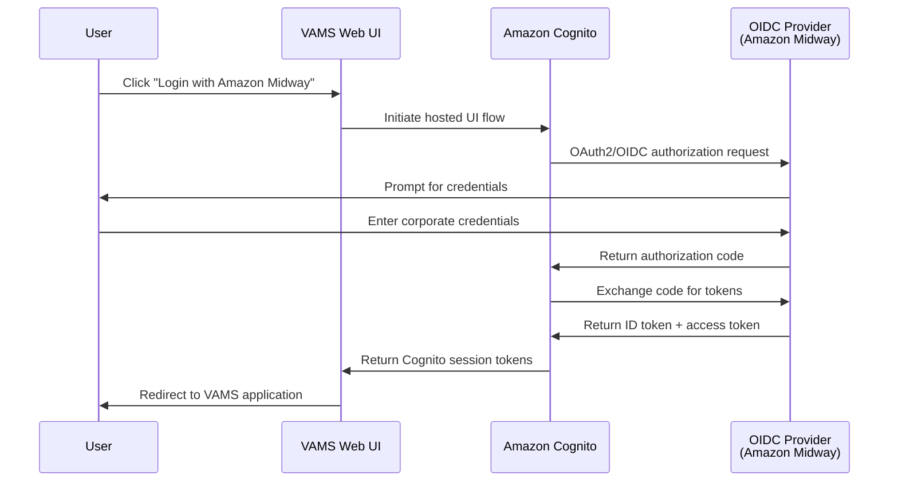

# OIDC federation (Amazon Midway)

This guide describes how to configure VAMS to support federated authentication via an external OpenID Connect (OIDC) identity provider. The reference implementation uses Amazon Midway (via Amazon Federate) to allow Amazon employees to log in with their corporate credentials, but the pattern applies to any OIDC-compliant provider.

When OIDC federation is enabled, users see two authentication options on the login screen: native Cognito username/password authentication and a federated SSO button (for example, "Login with Amazon Midway"). Both authentication methods are available simultaneously, allowing a mix of internal and external users.

---

## Prerequisites

Before configuring OIDC federation, ensure you have:

1. **An OIDC identity provider registration** with your provider (for example, Amazon Federate, Okta, Auth0, Azure AD)
2. **Client credentials** (client ID and client secret) issued by the provider for your application
3. **Provider metadata** including:
   - Issuer URL
   - Authorization endpoint
   - Token endpoint
   - JWKS (JSON Web Key Set) endpoint
4. **AWS Secrets Manager** access to store the client secret
5. **An existing VAMS deployment** with Cognito authentication enabled

:::info[Amazon Federate registration]
For Amazon internal deployments, register your application at [Amazon Federate](https://federate.amazon.com/). Use the INTEG environment for testing (`https://idp-integ.federate.amazon.com`) and PROD for production deployments.
:::

---

## Architecture overview

When OIDC federation is enabled, the authentication flow becomes:



The OIDC provider authenticates the user and returns claims (email, name, groups) to Amazon Cognito. Cognito creates or updates a federated user identity and issues standard Cognito JWT tokens that the VAMS backend validates.

---

## Step 1: Store the client secret in AWS Secrets Manager

The OIDC client secret must be stored in AWS Secrets Manager. Never hardcode secrets in configuration files or source code.

```bash
# Replace the placeholder values with your actual credentials
aws secretsmanager create-secret \
  --name vams/oidc/client-secret \
  --secret-string "YOUR_CLIENT_SECRET_HERE" \
  --region YOUR_DEPLOYMENT_REGION \
  --description "OIDC client secret for VAMS federated authentication"
```

Note the secret ARN returned by this command. You will reference it in the next step.

To retrieve the secret ARN later:

```bash
aws secretsmanager describe-secret \
  --secret-id vams/oidc/client-secret \
  --region YOUR_DEPLOYMENT_REGION \
  --query ARN \
  --output text
```

:::warning[Secret permissions]
The AWS IAM role used by AWS CDK during deployment must have `secretsmanager:GetSecretValue` permission on this secret. CDK retrieves the secret value at deploy time (not runtime) to configure the Amazon Cognito user pool identity provider.
:::

---

## Step 2: Configure OIDC settings

Edit the file `infra/config/oidc-config.ts` to specify your OIDC provider settings:

```typescript
export const useOidcFederation = true;

export const oidcSettings: OidcSettings = {
    // Provider name displayed in the Cognito hosted UI and web login button
    name: "AmazonMidway",
    
    // Cognito hosted UI domain prefix. The full domain becomes:
    // https://<cognitoDomainPrefix>.auth.<region>.amazoncognito.com
    cognitoDomainPrefix: "vams",
    
    // OIDC client ID from your provider registration
    clientId: "your-oidc-client-id",
    
    // ARN of the AWS Secrets Manager secret containing the client secret
    clientSecretArn: "arn:aws:secretsmanager:us-east-1:123456789012:secret:vams/oidc/client-secret-AbCdEf",
    
    // OIDC issuer base URL. Cognito auto-discovers endpoints from
    // <issuerUrl>/.well-known/openid-configuration
    issuerUrl: "https://idp-integ.federate.amazon.com",
    
    // OIDC scopes to request during authentication
    scopes: ["openid", "email", "profile"],
    
    // Map incoming OIDC claims to Cognito user attributes
    attributeMapping: {
        email: cognito.ProviderAttribute.other("email"),
        // Add additional mappings as needed:
        // givenName: cognito.ProviderAttribute.other("given_name"),
        // familyName: cognito.ProviderAttribute.other("family_name"),
    },
    
    // Whether CDK should create the Cognito hosted domain. Set to false if
    // the domain was created manually (avoids "domain already exists" errors)
    manageDomain: false,
};
```

### Configuration fields

| Field                  | Type                          | Description                                                                                                 |
| ---------------------- | ----------------------------- | ----------------------------------------------------------------------------------------------------------- |
| `name`                 | string                        | Provider name registered in the Amazon Cognito user pool. This name appears in the web UI login button.     |
| `cognitoDomainPrefix`  | string                        | Domain prefix for the Cognito hosted UI. Must be globally unique across all Amazon Cognito user pools.      |
| `clientId`             | string                        | Client ID issued by the OIDC provider.                                                                      |
| `clientSecretArn`      | string                        | ARN of the AWS Secrets Manager secret containing the client secret.                                         |
| `issuerUrl`            | string                        | OIDC issuer base URL. Must have a `.well-known/openid-configuration` discovery endpoint.                    |
| `scopes`               | string[]                      | OIDC scopes to request. Typically includes `openid`, `email`, and `profile`.                                |
| `attributeMapping`     | cognito.AttributeMapping      | Maps OIDC claims to Amazon Cognito user attributes. At minimum, map `email` for user identification.        |
| `manageDomain`         | boolean                       | Whether CDK creates the Cognito hosted domain. Set to `false` if the domain was created out-of-band.        |

:::tip[Hosted domain conflicts]
If you receive a "domain already exists" error during deployment, set `manageDomain: false` in the configuration. This indicates the domain was created manually and CDK should not attempt to recreate it.
:::

---

## Step 3: Update redirect URLs with your OIDC provider

Configure your OIDC provider (for example, Amazon Federate) to allow redirects back to your VAMS application:

1. **Sign-in redirect URLs**: Add the following URLs to your provider's allowed redirect list:
   - Development: `http://localhost:3001`
   - Production: `https://your-vams-domain.com`
   - Cognito hosted UI: `https://<cognitoDomainPrefix>.auth.<region>.amazoncognito.com/oauth2/idpresponse`

2. **Sign-out redirect URLs**: Add the same base URLs (without `/oauth2/idpresponse`)

For Amazon Federate:
- Navigate to your registered application
- Add redirect URIs under "OAuth Configuration"
- Save the configuration

---

## Step 4: Configure default user roles (optional)

When users authenticate via an external identity provider, they may not exist in the VAMS user roles table. To provide baseline access for federated users, configure a default role:

Edit `infra/config/config.json`:

```json
{
  "app": {
    "authProvider": {
      "authorizerOptions": {
        "allowedIpRanges": [],
        "defaultUserRoleName": "basicReadOnly"
      }
    }
  }
}
```

The `defaultUserRoleName` field specifies a role that is automatically assigned to authenticated users who have no explicit role assignments. This role must exist in the VAMS roles table and have appropriate constraints defined.

:::info[Default role behavior]
The default role is only applied when:
- The user has no explicitly assigned roles in the UserRoles table
- The user successfully authenticates (passes Tier 1 authorization)
- For non-MFA sessions, the default role itself does not require MFA

Users with explicit role assignments bypass the default role entirely. The default role provides baseline access for external identity provider logins without requiring manual per-user provisioning.
:::

To create a basic read-only role, use the VAMS CLI or web UI:

```bash
# Create a read-only role
vamscli role create \
  --role-name basicReadOnly \
  --description "Default role for federated users" \
  --mfa-not-required
```

Then assign appropriate constraints to the role (for example, read-only access to specific databases).

---

## Step 5: Deploy the updated stack

After configuring OIDC settings and updating the configuration, deploy the stack:

```bash
cd infra
npx cdk deploy --all --require-approval never
```

The deployment performs the following:

1. Retrieves the client secret from AWS Secrets Manager
2. Creates or updates the Amazon Cognito user pool identity provider
3. Updates the Amazon Cognito hosted UI configuration
4. Configures the web client to support the federated provider

:::note[First-time federation setup]
If this is the first time enabling federation on an existing user pool, the deployment may take 5-10 minutes as Amazon Cognito provisions the hosted UI infrastructure.
:::

---

## Step 6: Verify the configuration

After deployment completes:

1. **Navigate to the VAMS web UI** (CloudFront or ALB URL)
2. **Observe the login screen**:
   - Native Cognito username/password fields should appear
   - A "Login with Amazon Midway" button should appear below the password field
3. **Click the federated login button**:
   - You should be redirected to the OIDC provider's login page
   - After successful authentication, you should be redirected back to VAMS
   - The VAMS web UI should load with your federated user session

If the button does not appear, check the browser console for errors and verify the configuration was deployed correctly.

---

## Troubleshooting

### Login button does not appear

**Symptoms**: The VAMS login page shows only username/password fields, no federated login button.

**Causes**:
- The `useOidcFederation` flag is set to `false` in `oidc-config.ts`
- The `cognitoFederatedConfig` was not populated in the `/api/amplify-config` response
- The frontend failed to parse the configuration

**Resolution**:
1. Verify `useOidcFederation = true` in `infra/config/oidc-config.ts`
2. Redeploy the stack
3. Clear browser cache and reload
4. Check browser console for JavaScript errors
5. Verify the `/api/amplify-config` endpoint returns `cognitoFederatedConfig`

---

### Redirect URI mismatch error

**Symptoms**: After clicking the federated login button, the OIDC provider shows "Redirect URI mismatch" or "Invalid redirect URI".

**Causes**:
- The redirect URI was not added to the OIDC provider's allowed list
- The redirect URI format does not match exactly (trailing slashes, protocol mismatches)

**Resolution**:
1. Verify the exact redirect URI in the browser address bar when the error occurs
2. Add that exact URI to the provider's configuration
3. For Amazon Federate, ensure the Cognito callback URL includes `/oauth2/idpresponse`

---

### User has no role after login

**Symptoms**: Federated user successfully authenticates but receives "403 Forbidden" errors on all API calls.

**Causes**:
- The user has no assigned role in the UserRoles table
- The `defaultUserRoleName` is not configured or references a non-existent role
- The default role has insufficient permissions

**Resolution**:
1. Configure `defaultUserRoleName` in `config.json` (see Step 4)
2. Verify the role exists: `vamscli role list`
3. Verify the role has appropriate constraints: `vamscli role-constraint list --role-name <role>`
4. Redeploy to apply the configuration change
5. Alternatively, manually assign a role to the user: `vamscli user-role create --user-id <email> --role-name <role>`

---

### Client secret retrieval error during deployment

**Symptoms**: CDK deployment fails with "Secret not found" or "Access denied" when retrieving the client secret.

**Causes**:
- The secret does not exist in AWS Secrets Manager
- The secret ARN in `oidc-config.ts` is incorrect
- The CDK deployment role lacks `secretsmanager:GetSecretValue` permission

**Resolution**:
1. Verify the secret exists:
   ```bash
   aws secretsmanager describe-secret --secret-id vams/oidc/client-secret
   ```
2. Verify the ARN matches the value in `oidc-config.ts`
3. Grant the CDK role permission to read the secret:
   ```json
   {
     "Effect": "Allow",
     "Action": "secretsmanager:GetSecretValue",
     "Resource": "arn:aws:secretsmanager:REGION:ACCOUNT:secret:vams/oidc/*"
   }
   ```

---

### Hosted domain already exists error

**Symptoms**: CDK deployment fails with "Domain already exists" or "A domain with that name already exists".

**Causes**:
- The Cognito hosted domain was created manually or in a previous deployment
- CDK is attempting to recreate the domain

**Resolution**:
Set `manageDomain: false` in `infra/config/oidc-config.ts` and redeploy.

---

## Disabling OIDC federation

To disable OIDC federation and revert to Cognito-only authentication:

1. Edit `infra/config/oidc-config.ts`:
   ```typescript
   export const useOidcFederation = false;
   ```

2. Redeploy the stack:
   ```bash
   cd infra
   npx cdk deploy --all
   ```

3. The federated identity provider remains registered in Amazon Cognito but is no longer referenced by the web client. Users will only see the native username/password login form.

To completely remove the identity provider:

```bash
aws cognito-idp delete-identity-provider \
  --user-pool-id <user-pool-id> \
  --provider-name AmazonMidway
```

:::warning[Existing federated users]
Disabling federation does not delete federated user accounts. Users who previously logged in via the OIDC provider will still exist in the Amazon Cognito user pool but will be unable to authenticate. Consider migrating these users to native Cognito accounts or leaving federation enabled.
:::

---

## Security considerations

### Secret rotation

Rotate the OIDC client secret periodically:

1. Generate a new client secret with your OIDC provider
2. Update the secret in AWS Secrets Manager:
   ```bash
   aws secretsmanager update-secret \
     --secret-id vams/oidc/client-secret \
     --secret-string "NEW_CLIENT_SECRET"
   ```
3. Redeploy the VAMS stack to apply the new secret

:::tip[Zero-downtime rotation]
Amazon Cognito caches the client secret for a short period. To avoid authentication failures during rotation, configure your OIDC provider to accept both the old and new secrets temporarily, then remove the old secret after the deployment completes.
:::

### Attribute mapping

Only map OIDC claims that are verified by the identity provider. Unverified claims can be spoofed by malicious actors. For Amazon Midway, `email` is a verified claim and safe to map.

Avoid mapping claims to privileged attributes (for example, roles, groups) without additional backend validation.

### Token expiration

OIDC tokens issued by Amazon Cognito follow the token validity settings in `config.json`:

```json
{
  "app": {
    "authProvider": {
      "useCognito": {
        "credTokenTimeoutSeconds": 3600
      }
    }
  }
}
```

After the token expires, the frontend automatically refreshes the session using the refresh token.

---

## Additional resources

- [Amazon Cognito federated identities](https://docs.aws.amazon.com/cognito/latest/developerguide/cognito-user-pools-identity-federation.html)
- [Amazon Cognito OIDC identity providers](https://docs.aws.amazon.com/cognito/latest/developerguide/cognito-user-pools-oidc-idp.html)
- [OpenID Connect specification](https://openid.net/specs/openid-connect-core-1_0.html)
- [VAMS permission model](../concepts/permissions-model.md)
