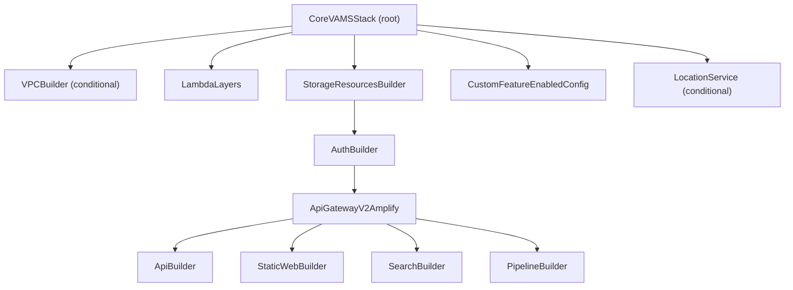

# CDK Infrastructure Development

This guide covers development patterns for the VAMS AWS CDK infrastructure, including nested stack architecture, Lambda builder conventions, API route wiring, configuration management, and security patterns.

## Technology Stack

| Component | Details |
|-----------|---------|
| Framework | AWS CDK v2 (TypeScript), `aws-cdk-lib` |
| VAMS Version | Defined in `config.ts` (`VAMS_VERSION`) |
| Node Lambda Runtime | NODEJS_20_X |
| Python Lambda Runtime | PYTHON_3_12 |
| Lambda Memory | 5308 MB (all functions) |
| Lambda Timeout | 15 minutes (all functions) |

## Nested Stack Architecture

VAMS deploys as a root stack (`CoreVAMSStack`) with 10+ nested stacks. Understanding the dependency chain is essential for adding new resources.

### Dependency Chain



### Key Nested Stacks

| Stack | File | Purpose |
|-------|------|---------|
| VPCBuilder | `nestedStacks/vpc/vpcBuilder-nestedStack.ts` | VPC, subnets, VPC endpoints |
| StorageResourcesBuilder | `nestedStacks/storage/storageBuilder-nestedStack.ts` | Amazon DynamoDB tables, Amazon S3, Amazon SNS, Amazon SQS, AWS KMS |
| AuthBuilder | `nestedStacks/auth/authBuilder-nestedStack.ts` | Amazon Cognito, SAML, external OAuth |
| ApiGatewayV2Amplify | `nestedStacks/apiLambda/apigatewayv2-amplify-nestedStack.ts` | Amazon API Gateway V2, Lambda authorizer |
| ApiBuilder | `nestedStacks/apiLambda/apiBuilder-nestedStack.ts` | All API routes and Lambda wiring |
| StaticWebBuilder | `nestedStacks/staticWebApp/staticWebBuilder-nestedStack.ts` | Amazon S3 + Amazon CloudFront or ALB hosting |
| PipelineBuilder | `nestedStacks/pipelines/pipelineBuilder-nestedStack.ts` | Processing pipeline orchestrator |

### Cross-Stack Shared Interfaces

The `storageResources` interface (defined in `storageBuilder-nestedStack.ts`) is the primary shared interface. It exposes 20+ Amazon DynamoDB tables, Amazon S3 buckets, Amazon SNS topics, Amazon SQS queues, AWS KMS keys, and Amazon CloudWatch audit log groups to all downstream stacks.

## Lambda Builder Pattern

All Lambda builder files in `lib/lambdaBuilder/` follow a strict, consistent pattern. There are approximately 17 builder files containing 40+ function builders.

### Standard Function Signature

```typescript
export function buildSomeFunction(
    scope: Construct,
    lambdaCommonBaseLayer: LayerVersion,
    storageResources: storageResources,
    config: Config.Config,
    vpc: ec2.IVpc,
    subnets: ec2.ISubnet[]
): lambda.Function {
```

### Standard Lambda Configuration

```typescript
const name = "functionName";
const fun = new lambda.Function(scope, name, {
    code: lambda.Code.fromAsset(
        path.join(__dirname, "../../../backend/backend")
    ),
    handler: `handlers.{category}.${name}.lambda_handler`,
    runtime: LAMBDA_PYTHON_RUNTIME,
    layers: [lambdaCommonBaseLayer],
    timeout: Duration.minutes(15),
    memorySize: Config.LAMBDA_MEMORY_SIZE,
    vpc: config.app.useGlobalVpc.enabled &&
         config.app.useGlobalVpc.useForAllLambdas
        ? vpc : undefined,
    vpcSubnets: config.app.useGlobalVpc.enabled &&
                config.app.useGlobalVpc.useForAllLambdas
        ? { subnets: subnets } : undefined,
    environment: {
        MY_TABLE_NAME: storageResources.dynamo.myTable.tableName,
    },
});
```

### Four Required Security Calls

Every Lambda builder function must include all four security calls after creating the function:

```typescript
// 1. KMS permissions (if encryption enabled)
kmsKeyLambdaPermissionAddToResourcePolicy(
    fun, storageResources.encryption.kmsKey
);

// 2. Auth table access + audit log setup
setupSecurityAndLoggingEnvironmentAndPermissions(fun, storageResources);

// 3. Global environment variables (Cognito auth flag)
globalLambdaEnvironmentsAndPermissions(fun, config);

// 4. CDK Nag suppression for S3 grant patterns
suppressCdkNagErrorsByGrantReadWrite(scope);
```

:::warning[All Four Calls Required]
Missing `setupSecurityAndLoggingEnvironmentAndPermissions` breaks authorization checking in Lambda handlers. Missing `kmsKeyLambdaPermissionAddToResourcePolicy` causes access denied errors when AWS KMS encryption is enabled. Always include all four calls.
:::


### What the Security Helpers Do

| Helper | Actions |
|--------|---------|
| `kmsKeyLambdaPermissionAddToResourcePolicy` | Grants AWS KMS Decrypt, Encrypt, GenerateDataKey, ReEncrypt, ListKeys, CreateGrant, ListAliases |
| `setupSecurityAndLoggingEnvironmentAndPermissions` | Adds env vars for auth tables and 9 audit log groups. Grants DynamoDB read on auth, constraints, userRoles, roles tables. Grants Amazon CloudWatch PutLogEvents on audit log groups. |
| `globalLambdaEnvironmentsAndPermissions` | Sets `COGNITO_AUTH_ENABLED` based on Amazon Cognito and VPC configuration |
| `suppressCdkNagErrorsByGrantReadWrite` | Suppresses AwsSolutions-IAM5 for Amazon S3 and resource wildcards |

## API Route Wiring

Routes are wired in `apiBuilder-nestedStack.ts` using the `attachFunctionToApi` helper.

### Attaching a Function to Amazon API Gateway

```typescript
// Build the function
const myFunction = buildMyNewFunction(
    this, lambdaCommonBaseLayer, storageResources,
    config, vpc, subnets
);

// Wire to API Gateway -- one call per route
attachFunctionToApi(this, myFunction, {
    routePath: "/my-resource/{resourceId}",
    method: apigateway.HttpMethod.GET,
    api: api,
});
attachFunctionToApi(this, myFunction, {
    routePath: "/my-resource",
    method: apigateway.HttpMethod.POST,
    api: api,
});
```

The `attachFunctionToApi` helper creates an `ApiGatewayV2LambdaConstruct` which:

1. Grants invoke permission to the Amazon API Gateway service principal
2. Creates an `HttpLambdaIntegration`
3. Adds the route to the API

### Route Conventions

Routes use RESTful conventions with path parameters:

```
GET    /database/{databaseId}/assets              # List assets
GET    /database/{databaseId}/assets/{assetId}     # Get single asset
POST   /database/{databaseId}/assets               # Create asset
PUT    /database/{databaseId}/assets/{assetId}      # Update asset
DELETE /database/{databaseId}/assets/{assetId}      # Delete asset
```

Unauthenticated paths (no authorizer): `/api/amplify-config`, `/api/version`.

## Configuration System

### Three-Tier Fallback Chain

Configuration values resolve in this order:

1. CDK context (`-c key=value`)
2. `config/config.json` file
3. Environment variables
4. Hardcoded defaults

The entry point `bin/infra.ts` calls `Config.getConfig(app)` then `Service.SetConfig(config)`.

### Key Constants

| Constant | Value |
|----------|-------|
| `VAMS_VERSION` | Current release version (see `config.ts`) |
| `LAMBDA_PYTHON_RUNTIME` | `Runtime.PYTHON_3_12` |
| `LAMBDA_NODE_RUNTIME` | `Runtime.NODEJS_20_X` |
| `LAMBDA_MEMORY_SIZE` | `5308` |

### Adding a New Configuration Property

Adding a new config property requires three steps:

```typescript
// 1. Add to ConfigPublic interface in config/config.ts
app: {
    myNewFeature: {
        enabled: boolean;
        someOption: string;
    }
}

// 2. Add backward-compatibility check in getConfig()
if (config.app.myNewFeature == undefined) {
    config.app.myNewFeature = {
        enabled: false,
        someOption: "",
    };
}

// 3. Add validation if constraints exist
if (config.app.myNewFeature.enabled && !config.app.myNewFeature.someOption) {
    throw new Error(
        "Configuration Error: myNewFeature requires someOption when enabled"
    );
}
```

Also update both template files: `config.template.commercial.json` and `config.template.govcloud.json`.

## Service Helper

The service helper provides partition-aware ARN and endpoint generation. It supports four AWS partitions: `aws` (commercial), `aws-us-gov` (GovCloud), `aws-cn` (China), and `aws-iso` (isolated).

### Initialization

```typescript
// In bin/infra.ts -- MUST be called before any Service() usage
const config = Config.getConfig(app);
Service.SetConfig(config);
```

### Usage

```typescript
import { Service, Partition } from "../helper/service-helper";

// Partition-aware endpoint
Service("S3").Endpoint;

// Partition-aware ARN
Service("DYNAMODB").ARN("table/myTable");

// IAM principal
Service("LAMBDA").Principal;

// Current partition string
Partition(); // "aws", "aws-us-gov", etc.
```

:::warning[Never Hardcode Partitions]
Never use `arn:aws:` in resource ARNs. This breaks deployments in AWS GovCloud (`arn:aws-us-gov`) and other partitions. Always use the `Service()` helper or `Partition()` for partition-aware values.
:::


## AWS GovCloud Considerations

When `config.app.govCloud.enabled` is `true`, several constraints apply.

### Required Configuration

| Setting | Required Value | Reason |
|---------|---------------|--------|
| `useGlobalVpc.enabled` | `true` | VPC required for GovCloud |
| `useCloudFront.enabled` | `false` | Amazon CloudFront not available |
| `useLocationService.enabled` | `false` | Amazon Location Service not available |

### GovCloud-Specific Behavior

- FIPS endpoints used via `config.app.useFips`
- `AwsSolutions-COG3` CDK Nag rule suppressed (AdvancedSecurityMode not available)
- ALB deployment replaces Amazon CloudFront for static web hosting
- VPC endpoints are conditional on feature flags

## CDK Nag Compliance

CDK Nag is always enabled with AWS Solutions checks. Every new resource must pass these checks or have justified suppressions.

### Adding Suppressions

Every CDK Nag suppression requires a detailed justification:

```typescript
import { NagSuppressions } from "cdk-nag";

NagSuppressions.addResourceSuppressions(
    resource,
    [
        {
            id: "AwsSolutions-IAM5",
            reason: "Wildcard permissions required for dynamic S3 object "
                  + "access within VAMS asset buckets. Scope is limited "
                  + "to deployment-specific buckets.",
        },
    ],
    true
);
```

:::warning[Suppressions Require Justification]
Never add a suppression with a generic reason like "Suppressed" or "Not applicable". Explain why the suppression is acceptable in the VAMS security context.
:::


### Common Suppressions

| Rule | Typical Reason |
|------|---------------|
| `AwsSolutions-IAM5` | Amazon S3 `grantRead`/`grantReadWrite` generates IAM wildcard actions |
| `AwsSolutions-IAM4` | AWS managed policies used for Lambda execution roles |
| `AwsSolutions-COG3` | Cognito AdvancedSecurityMode not available in GovCloud |

## Feature Flags

Feature flags are defined in `common/vamsAppFeatures.ts`:

```typescript
enum VAMS_APP_FEATURES {
    GOVCLOUD,
    ALLOWUNSAFEEVAL,
    LOCATIONSERVICES,
    ALBDEPLOY,
    CLOUDFRONTDEPLOY,
    NOOPENSEARCH,
    AUTHPROVIDER_COGNITO,
    AUTHPROVIDER_COGNITO_SAML,
    AUTHPROVIDER_EXTERNALOAUTHIDP,
}
```

Features are tracked in the `enabledFeatures` array on `CoreVAMSStack` and persisted to Amazon DynamoDB by `CustomFeatureEnabledConfigNestedStack`. The frontend reads these from `/api/secure-config` at runtime.

### Adding a New Feature Flag

1. Add the constant to `VAMS_APP_FEATURES` enum in `common/vamsAppFeatures.ts`
2. Add the config option in `ConfigPublic` interface in `config/config.ts`
3. Push to `enabledFeatures` array in `core-stack.ts` when the feature is enabled
4. Gate frontend UI with feature check on `config.featuresEnabled`

## Adding New Resources

### Adding a New Lambda Function

1. Create the builder function in `lib/lambdaBuilder/{domain}Functions.ts`
2. Follow the standard pattern with all four security calls
3. Grant Amazon DynamoDB table permissions (`grantReadData` or `grantReadWriteData`)
4. Wire to Amazon API Gateway in `apiBuilder-nestedStack.ts` using `attachFunctionToApi()`

### Adding a New Amazon DynamoDB Table

1. Add the table to `storageResources` interface in `storageBuilder-nestedStack.ts`
2. Create the table in `storageResourcesBuilder()` with AWS KMS encryption if enabled
3. Apply `RemovalPolicy.DESTROY`
4. Update Lambda builders to pass the table name as an environment variable
5. Grant appropriate permissions in Lambda builders

### Adding a New Nested Stack

1. Create `lib/nestedStacks/{name}/{name}Builder-nestedStack.ts` extending `NestedStack`
2. Accept `config`, `storageResources`, and other shared resources as constructor parameters
3. Instantiate in `core-stack.ts` with `addDependency(storageResourcesNestedStack)`
4. Export resources needed by other stacks via public properties

:::info[Explicit Dependencies]
Always use `nestedStack.addDependency(otherStack)` when one nested stack depends on another. Implicit ordering through resource references alone is not sufficient.
:::


## Anti-Patterns

| Anti-Pattern | Correct Approach |
|-------------|-----------------|
| Hardcode `arn:aws:` in ARNs | Use `Service()` or `Partition()` |
| Skip any of the 4 security calls | Include all four in every Lambda builder |
| Forget VPC conditional on Lambda | Always check `useGlobalVpc.enabled && useForAllLambdas` |
| Hardcode Lambda runtime or memory | Use `LAMBDA_PYTHON_RUNTIME` and `Config.LAMBDA_MEMORY_SIZE` |
| Add config without backward compat | Add `undefined` check in `getConfig()` |
| Forget to call `Service.SetConfig()` | Must be called in `bin/infra.ts` before any `Service()` usage |
| Create resources without CDK Nag review | Add justified suppressions as needed |
| Ignore GovCloud constraints | Check feature flags before using CloudFront, Location Service |
| Use `grantReadWrite` without Nag suppression | Always pair with `suppressCdkNagErrorsByGrantReadWrite(scope)` |

## Key Files Reference

| Purpose | File |
|---------|------|
| CDK entry point | `bin/infra.ts` |
| Config and constants | `config/config.ts` |
| Root stack | `lib/core-stack.ts` |
| Storage resources | `lib/nestedStacks/storage/storageBuilder-nestedStack.ts` |
| API routes | `lib/nestedStacks/apiLambda/apiBuilder-nestedStack.ts` |
| Security helpers | `lib/helper/security.ts` |
| Service helper | `lib/helper/service-helper.ts` |
| Feature flags | `common/vamsAppFeatures.ts` |

## Next Steps

- [Backend Development](backend.md) -- Lambda handler patterns that consume CDK-provisioned resources
- [Frontend Development](frontend.md) -- How the frontend reads configuration and feature flags
- [Local Development Setup](setup.md) -- CDK synthesis and deployment commands
