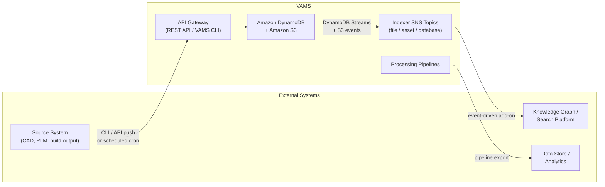

# Data Syncing Overview

VAMS is rarely the only system that touches your visual asset data. Engineering
tools, geometric search platforms, digital-twin knowledge graphs, analytics
warehouses, and product lifecycle systems all have a stake in the same assets,
files, and metadata. This guide describes the supported ways to keep those systems
and VAMS in step — moving data **out of** VAMS as it changes, and pushing data
**into** VAMS from external sources.

Syncing in VAMS falls into two directions, each with more than one implementation
approach. This page frames the directions and helps you choose; the
[Syncing Data Out](sync-out.md) and [Syncing Data In](sync-in.md) pages cover each
approach in detail.

---

## Two Directions

-   **Sync-out (VAMS → external).** VAMS is the source of truth, and an external
    system needs a continuously updated copy of your databases, assets, files, and
    metadata. The Garnet Framework and Physna add-ons are both sync-out integrations.
-   **Sync-in (external → VAMS).** An external system owns some data — CAD files on a
    network share, records in a PLM system, output from a build pipeline — and VAMS
    needs to reflect it. You look up the target asset, compare, and push changes with
    the upload and metadata APIs.

Both directions are **one-way** flows. VAMS does not currently offer a built-in
bidirectional reconciliation engine; a two-way sync is built as an independent
sync-out flow and sync-in flow that agree on a shared identity convention (for
example, a consistent asset-naming scheme or a metadata key that stores the external
record ID).

---

## Approaches at a Glance

| Approach                          | Direction | Trigger                                    | Change detection                          | Latency        | Effort                 | Use when                                                                       |
| --------------------------------- | --------- | ------------------------------------------ | ----------------------------------------- | -------------- | ---------------------- | ------------------------------------------------------------------------------ |
| **Event-driven add-on**           | Out       | Amazon DynamoDB Streams + Amazon S3 events | Every data change (most reliable)         | Near real-time | Higher (backend + CDK) | You need every database, asset, file, or metadata change reflected externally. |
| **Pipeline export**               | Out       | File upload event, or manual / on-demand   | File-upload events, or none (manual runs) | Per run        | Medium (pipeline)      | Export is tied to processing, or only needs to run on upload or on request.    |
| **CLI / API push**                | In        | Your external system or script             | Your logic (size/timestamp, version, IDs) | On demand      | Low (scripting)        | An external system owns the data and pushes updates into VAMS.                 |
| **Scheduled cron pull-then-push** | In        | Cron / scheduler                           | Your logic, compared each run             | Per schedule   | Low–medium (scripting) | The source system has no outbound webhook and must be polled on a schedule.    |

:::tip[Choosing a change-detection strategy]
For sync-out, the shared indexer change feed — the same Amazon SNS topics that drive
VAMS search indexing — is the most reliable way to detect changes, because **every**
create, update, and delete flows through it. For sync-in, the entry point is always
the upload and metadata API endpoints; your integration decides how to detect what
changed on the source side before pushing.
:::

---

## Sync-Out in Brief

Sync-out integrations subscribe to VAMS change events rather than polling. VAMS
Amazon DynamoDB tables emit streams and Amazon S3 buckets emit event notifications;
a forwarder consolidates these onto three shared Amazon SNS "indexer" topics
(file, asset, database). Any number of consumers can subscribe — VAMS search
indexing is one, and an external-sync add-on is another. This is the mechanism
behind the [Garnet Framework](../garnet-framework.md) and
[Physna](../physna-integration.md) add-ons.

A [pipeline](../../pipelines/custom-pipelines.md) is an alternative sync-out trigger
when export should happen as part of processing or only on file upload. See
[Syncing Data Out](sync-out.md).

---

## Sync-In in Brief

Sync-in uses the same public surface as any VAMS client: the [VAMS CLI](../../cli/getting-started.md)
or the [REST API](../../api/overview.md). The pattern is to authenticate with a VAMS
API key, resolve the target database, look up the target asset with search, create it if
it does not exist, upload files through the presigned multipart flow, remove files deleted
at the source, apply metadata, set relationships between assets, and optionally snapshot a
new asset version. An externalized sync mapping records which VAMS database each source
collection lands in — the sync-in analog to how the Physna add-on externalizes its target
`tenantId`. A cron job wraps the same steps to poll an external source on a schedule. See
[Syncing Data In](sync-in.md).

---

## Related Pages

-   [Syncing Data Out](sync-out.md) — event-driven add-ons and pipeline export
-   [Syncing Data In](sync-in.md) — CLI / API push and scheduled cron sync
-   [Garnet Framework Integration](../garnet-framework.md) — sync-out reference implementation
-   [Physna Integration](../physna-integration.md) — sync-out reference implementation
-   [CLI Automation and Scripting](../../cli/automation.md) — JSON output, pagination, CI/CD auth
-   [Reindex Utility](../utilities/reindex.md) — back-fill downstream indexers for existing data
