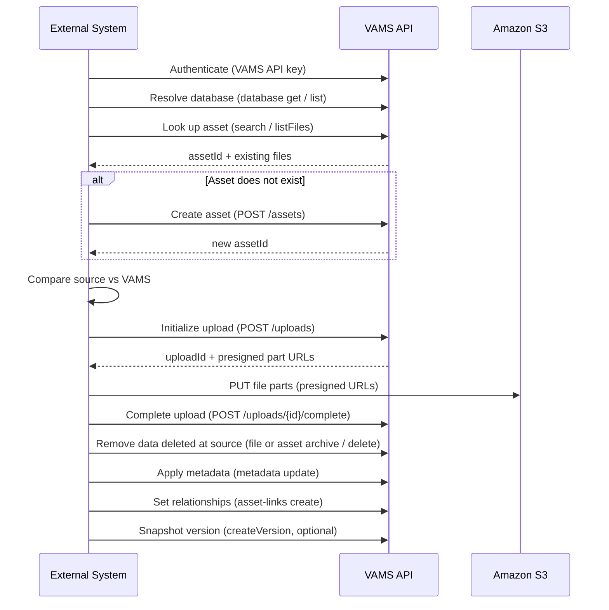

# Syncing Data In

Sync-in pushes data from an external system into VAMS. Unlike sync-out, it does not
require any backend or infrastructure changes — it uses the same public surface as any
VAMS client: the [VAMS CLI](../../cli/getting-started.md) or the
[REST API](../../api/overview.md). An external system, a build pipeline, or a scheduled
job authenticates, resolves the target database, looks up the target asset, compares it
against the source, and pushes changes with the upload, metadata, and asset-link APIs —
including removing files that no longer exist at the source.

This page walks through the sync-in loop: API-key authentication, externalizing a sync
mapping, resolving databases, looking up and creating assets, the turnkey `sync file push`
command, the raw upload contract for custom logic, removing files and whole assets,
setting relationships between assets, and how to run the whole thing on a schedule.

---

## The Sync-In Loop

Every sync-in integration follows the same steps. The turnkey path uses the VAMS CLI;
the custom path drives the REST API directly.



---

## Sync Mapping Configuration

A sync integration should never hardcode where data goes. Just as the
[Physna add-on](../physna-integration.md) externalizes its target `tenantId` (and the
[Garnet add-on](../garnet-framework.md) its ingestion queue URL) as configuration rather
than embedding it in code, a sync-in integration keeps a small **mapping configuration**
that translates source-system identifiers into VAMS destinations. Externalizing these
values lets the same script run against staging and production, or route different source
collections to different databases, without code changes.

Typical mapping values a sync-in integration holds:

| Mapping variable       | Purpose                                                                                     | Example                                 |
| ---------------------- | ------------------------------------------------------------------------------------------- | --------------------------------------- |
| VAMS API URL           | The target VAMS deployment (bind to a CLI profile)                                          | `https://vams.example.com`              |
| VAMS profile / API key | Credentials for the target environment                                                      | profile `prod`, key from a secret store |
| Source → database map  | Which VAMS `databaseId` each source collection lands in                                     | `plm-plant-A → factory-a`               |
| Asset identity key     | How a source record maps to a VAMS asset (name convention or an `external_id` metadata key) | `external_id` metadata key              |
| Default bucket ID      | Asset storage bucket to use when the integration creates databases                          | `bucket-uuid`                           |

A small JSON or environment-variable configuration is usually enough. For example:

```json
{
    "vamsUrl": "https://vams.example.com",
    "vamsProfile": "prod",
    "databaseMap": {
        "plm-plant-A": "factory-a",
        "plm-plant-B": "factory-b"
    },
    "assetIdentityMetadataKey": "external_id",
    "defaultBucketId": "bucket-uuid"
}
```

The sync script reads this configuration to decide, for each source record, which
`--profile`, `-d <databaseId>`, and asset lookup to use. Storing the external record's ID
in a VAMS metadata key (`external_id` above) gives a stable, queryable back-reference so
repeat runs find the same asset — the sync-in analog to how the Physna add-on stamps
`__VAMS__FileVersion` on the remote side to recognize what it already synced.

:::tip[Round-tripping identifiers]
When you build both a sync-out and a sync-in flow against the same external system, have
them agree on the mapping: sync-out writes the external record ID into VAMS metadata (or a
tag), and sync-in reads it back to locate the asset. A shared, externalized mapping keeps
the two directions consistent and avoids duplicate assets.
:::

---

## 1. Authenticate

For headless and scheduled use, authenticate with a **VAMS API key**. An API key is a
long-lived token, prefixed `vams_`, that impersonates a VAMS user and inherits that user's
roles. Because the key carries the impersonated user's permissions across both
authorization tiers, create a **dedicated, least-privilege user** for the integration
(with only the database and asset access the sync needs) and issue the key for that user.
The impersonated user must already have at least one role. See
[API Keys](../../user-guide/api-keys.md) for how to create and scope one.

### API keys with the VAMS CLI

The VAMS CLI does not have a separate "API key" login mode — an API key is supplied as a
**token override**, the same mechanism used for any externally minted token. Configure the
profile once, then log in with the key:

```bash
vamscli setup https://your-vams-api-url --skip-version-check
vamscli auth login --user-id sync-bot@example.com --token-override "$VAMS_API_KEY"
```

`--user-id` is the VAMS user the key was issued for. Unlike a Cognito password login, an
API-key (token-override) session is not auto-refreshed — the key itself is the credential,
so a scheduled job simply logs in again on each run. For long-running scripts, set the key
on the current session without a full login using `vamscli auth set-override --token
"$VAMS_API_KEY"`. Use a distinct `--profile` per environment (for example
`--profile prod`) so a single host can sync to more than one VAMS deployment. Every command
accepts `--json-output` for machine parsing.

### API keys with the REST API

For direct REST calls, send the key in the `Authorization` header using the `Bearer`
scheme:

```bash
curl -H "Authorization: Bearer $VAMS_API_KEY" \
    "https://your-vams-api-url/database/my-db/assets/my-asset"
```

:::warning[Store keys as secrets]
Never commit an API key or place it in a script under version control. Inject it from
your scheduler's or CI/CD platform's secret store as an environment variable, as shown
above. Rotate the key periodically and revoke it immediately if the integration host is
decommissioned. See [CLI Automation — Authentication in CI/CD](../../cli/automation.md#authentication-in-cicd)
and [API Authentication](../../api/authentication.md).
:::

---

## 2. Resolve the Target Database

Assets live inside a database, so a sync-in integration first needs a valid database ID.
Confirm the target database exists before pushing, and — for integrations that own their
databases — create it when it does not:

```bash
# Check whether the target database exists
if ! vamscli database get -d "$DATABASE_ID" --json-output >/dev/null 2>&1; then
    # Create it (a default bucket is selected automatically when --default-bucket-id is omitted;
    # supply one explicitly for non-interactive runs)
    vamscli database create -d "$DATABASE_ID" \
        --description "Imported from source system" \
        --default-bucket-id "$BUCKET_ID" \
        --json-output
fi
```

To discover available databases and asset storage buckets, use `vamscli database list`
and `vamscli database list-buckets` (both support `--auto-paginate` and `--json-output`).

:::note[Create databases deliberately]
A database is a top-level container with its own Amazon S3 asset bucket and permission
scope. Most sync-in integrations target a database that an administrator has already
provisioned and simply resolve its ID. Create databases from a sync job only when the
integration is the system of record for them. See [Database Commands](../../cli/commands/database.md).
:::

---

## 3. Look Up the Target Asset

Before pushing, find the asset the source data maps to. The most flexible lookup is
search, which matches on name, type, tags, metadata, and more:

```bash
# Find an asset by name and capture its assetId
ASSET_ID=$(vamscli search simple --asset-name "Turbine Housing" \
    --entity-types asset --json-output | jq -r '.hits.hits[0]._source.str_assetid // empty')
```

When Amazon OpenSearch is disabled (the `NOOPENSEARCH` feature), search is unavailable —
fall back to a deterministic listing:

```bash
# Deterministic lookup without search
vamscli file list -d my-db -a my-asset --basic --auto-paginate --json-output
```

Use `vamscli file info --include-versions` to retrieve a file's per-version size and
timestamp when you need to compare against VAMS revision history before deciding to push.

---

## 4. Create the Asset If It Does Not Exist

If the lookup finds no matching asset, create one. VAMS generates the `assetId`
automatically — you cannot supply it — so capture the returned value:

```bash
if [ -z "$ASSET_ID" ]; then
    ASSET_ID=$(vamscli assets create -d my-db \
        --name "Turbine Housing" \
        --description "Imported from PLM" \
        --distributable \
        --json-output | jq -r '.assetId')
fi
```

:::tip[Mapping external identity to VAMS]
Because VAMS assigns the `assetId`, a sync-in integration needs its own way to recognize
"the same" asset across runs. Two common conventions: use a stable, unique asset **name**
per source record, or store the external record's ID in a **metadata key** and search on
it (`--metadata-key external_id --metadata-value ...`). Pick one and apply it consistently
on both the lookup and the push.
:::

---

## 5. Push Files

### Turnkey: `sync file push`

The `vamscli sync file push` command implements the compare-and-upload step for a whole
local directory against one asset. It compares each file's size and modified timestamp
(like `aws s3 sync`), uploads only the differences, and optionally archives files removed
at the source:

```bash
# Preview first
vamscli sync file push ./staged -d my-db -a "$ASSET_ID" --dryrun

# Upload new and changed files
vamscli sync file push ./staged -d my-db -a "$ASSET_ID" --allow-modify

# Full mirror: upload new + changed, archive files removed at the source,
# and snapshot a version on success
vamscli sync file push ./staged -d my-db -a "$ASSET_ID" \
    --allow-modify --allow-delete --version-comment "PLM sync $(date -u +%Y-%m-%d)"
```

Use `--conflict-check` to compare each changed file against the asset's revision history
and skip pushes that would revert newer VAMS work, and a `.vamsignore` file to exclude
paths from the comparison. See [Sync Commands](../../cli/commands/sync.md) for the full
option list, change-detection rules, and the sync-plan categories.

### Custom: the presigned upload contract

When you need logic `sync file push` does not cover — pushing individual files from
memory, custom change detection, or driving the API from a language without the CLI —
use the three-step presigned multipart upload directly. The file bytes go straight to
Amazon S3 through presigned URLs, not through API Gateway:

1. **Initialize** — `POST /uploads` with the database, asset, `uploadType`
   (`assetFile` or `assetPreview`), and a `files` array of
   `{ relativeKey, file_size, num_parts }`. The response returns an `uploadId` and, per
   file, an `uploadIdS3` and a list of presigned `partUploadUrls`.
2. **Upload parts** — `HTTP PUT` each part's bytes to its presigned `UploadUrl` and
   capture the returned `ETag`. Send at most 200 parts per request; a zero-byte file has
   no parts.
3. **Complete** — `POST /uploads/{uploadId}/complete` with a `files` array of
   `{ relativeKey, uploadIdS3, parts: [{ PartNumber, ETag }] }`.

See the [Files API reference](../../api/files.md) for the full request and response
schemas.

---

## 6. Remove Data Deleted at the Source

When something no longer exists at the source, remove it from VAMS so the two stay in
step. VAMS removes at two granularities — individual **files** and whole **assets** — and
each supports a recoverable archive (soft delete) or an irrecoverable permanent delete.

### Removing files

Remove a file when it is gone from the source but its asset remains:

-   **Archive (soft delete)** — hides the file but keeps it recoverable with
    `vamscli file unarchive`. This is the safe default and matches what `sync file push
--allow-delete` does.
-   **Permanent delete** — removes the file irrecoverably. It requires an explicit
    `--confirm` flag.

```bash
# Archive a single file (recoverable)
vamscli file archive -d my-db -a "$ASSET_ID" -p "/old/part.CATPart" --json-output

# Archive everything under a prefix
vamscli file archive -d my-db -a "$ASSET_ID" -p "/superseded/" --prefix --json-output

# Permanently delete a file (irrecoverable; --confirm required)
vamscli file delete -d my-db -a "$ASSET_ID" -p "/old/part.CATPart" --confirm --json-output
```

The turnkey `sync file push --allow-delete` archives source-removed files for you, and
`--permanent-delete --confirm` permanently deletes them instead. Reach for the explicit
`file archive` / `file delete` commands when your integration computes removals itself
rather than mirroring a local directory. See [File Commands](../../cli/commands/files.md).

### Removing whole assets

When a source record is deleted entirely — not just some of its files — remove the whole
asset rather than emptying it file by file. Asset removal has its own API endpoints,
separate from the file-level ones, and the same archive-versus-permanent choice:

```bash
# Archive an asset (soft delete; recoverable with unarchive)
vamscli assets archive "$ASSET_ID" -d my-db --json-output

# Permanently delete an asset and all its files and versions (--confirm required)
vamscli assets delete "$ASSET_ID" -d my-db --confirm --json-output
```

These map to `DELETE .../assets/{assetId}/archiveAsset` and
`DELETE .../assets/{assetId}/deleteAsset` (an archived asset is restored with
`PUT .../assets/{assetId}/unarchiveAsset`). Permanently deleting an asset removes all of
its files, versions, and history — prefer archiving in a sync job. See
[Asset Commands](../../cli/commands/assets.md).

:::warning[Prefer archive for sync-driven removals]
A sync job acts without a human in the loop, so a bug in the source-side comparison could
remove files or assets that should have been kept. Archive rather than permanently delete
unless the source is authoritative and recovery is genuinely unnecessary — archived files
and assets can be restored with `vamscli file unarchive` / `vamscli assets unarchive`,
permanently deleted ones cannot.
:::

---

## 7. Apply Metadata

Push metadata after the files exist. Metadata updates are bulk and support two modes via
`--update-type`: `update` upserts the listed keys and leaves others intact, while
`replace_all` replaces the asset's entire metadata set.

```bash
# metadata.json: {"metadata":[{"metadataKey":"source","metadataValue":"PLM","metadataValueType":"string"}]}
vamscli metadata asset update -d my-db -a "$ASSET_ID" \
    --json-input @metadata.json --update-type update
```

File-level metadata and attributes use `vamscli metadata file update --file-path <path>
--type metadata|attribute` (attributes are string-only). See
[Metadata Commands](../../cli/commands/metadata.md) and the
[Metadata API reference](../../api/metadata.md).

---

## 8. Set Relationships Between Assets

When the source system expresses relationships between records — a bill of materials, a
parent assembly and its components, or a set of related parts — mirror them in VAMS with
**asset links**. Asset links connect two assets and come in two relationship types:

-   `parentChild` — a hierarchical link (an assembly and its components). An optional
    `--alias-id` distinguishes multiple parent-child links to the same asset.
-   `related` — a non-hierarchical association between two assets.

Links are directional, and both endpoints can live in different databases:

```bash
# Link a child component to its parent assembly
vamscli asset-links create \
    --from-database-id my-db --from-asset-id "$PARENT_ASSET_ID" \
    --to-database-id my-db --to-asset-id "$CHILD_ASSET_ID" \
    --relationship-type parentChild \
    --json-output

# Associate two related parts
vamscli asset-links create \
    --from-database-id my-db --from-asset-id "$ASSET_A" \
    --to-database-id my-db --to-asset-id "$ASSET_B" \
    --relationship-type related \
    --json-output
```

Reconcile relationships the same way you reconcile files: list the current links, add the
ones the source now has, and remove the ones it dropped.

```bash
# List an asset's current links (add --tree-view for a hierarchy view)
vamscli asset-links list -d my-db --asset-id "$ASSET_ID" --json-output

# Remove a link the source no longer has
vamscli asset-links delete --asset-link-id "$ASSET_LINK_ID" --json-output
```

:::note[Both assets must already exist]
An asset link references two assets by ID, so create (or resolve) both endpoints before
linking them. In a sync job that imports an assembly, push all component assets first,
then create the `parentChild` links in a second pass once every `assetId` is known.
:::

See [Asset Link Commands](../../cli/commands/assets.md) and the
[Asset Links API reference](../../api/asset-links.md).

---

## 9. Snapshot a Version (Optional)

To capture the pushed state as a recoverable asset version, either pass
`--version-comment` to `sync file push` (which snapshots on success) or call the version
API directly:

```bash
vamscli asset-version create -d my-db -a "$ASSET_ID" \
    --comment "External sync snapshot"
```

See the [Asset Versions API reference](../../api/asset-versions.md).

---

## Scheduled Cron Pull-Then-Push

When the source system has no outbound webhook, poll it on a schedule and push what
changed. The script below stages files from an external source, then runs the full
sync-in loop. Schedule it with `cron`, a systemd timer, an Amazon EventBridge Scheduler
target, or any CI/CD scheduled job.

```bash
#!/bin/bash
set -euo pipefail

# --- Sync mapping configuration (externalized, not hardcoded) ---
VAMS_PROFILE="prod"                 # CLI profile bound to the target deployment
SOURCE_COLLECTION="plm-plant-A"     # identifier from the source system
DATABASE_ID="factory-a"            # VAMS database this collection maps to
ASSET_NAME="Turbine Housing"
STAGING_DIR="./staged"

vamscli() { command vamscli --profile "$VAMS_PROFILE" "$@"; }

# Authenticate with the integration's API key (injected as a secret)
vamscli setup "$VAMS_URL" --skip-version-check
vamscli auth login --user-id sync-bot@example.com --token-override "$VAMS_API_KEY"

# 1. Pull the latest from the external source into the staging directory
#    (implement fetch_from_source for your system: rsync, S3 copy, API download, ...)
fetch_from_source "$SOURCE_COLLECTION" "$STAGING_DIR"

# 2. Confirm the target database exists
vamscli database get -d "$DATABASE_ID" --json-output >/dev/null

# 3. Look up the asset, creating it if it does not exist yet
ASSET_ID=$(vamscli search simple --asset-name "$ASSET_NAME" \
    --entity-types asset --json-output | jq -r '.hits.hits[0]._source.str_assetid // empty')

if [ -z "$ASSET_ID" ]; then
    ASSET_ID=$(vamscli assets create -d "$DATABASE_ID" \
        --name "$ASSET_NAME" --description "Imported from source" \
        --distributable --json-output | jq -r '.assetId')
fi

# 4. Push only the differences (archiving files removed at the source) and
#    snapshot a version on success
vamscli sync file push "$STAGING_DIR" -d "$DATABASE_ID" -a "$ASSET_ID" \
    --allow-modify --allow-delete \
    --version-comment "Scheduled sync $(date -u +%Y-%m-%dT%H:%M:%SZ)"
```

The same loop from Python, wrapping the CLI as a subprocess:

```python
import json
import subprocess


def run(args):
    """Run a VamsCLI command with --json-output and return parsed JSON."""
    result = subprocess.run(
        ["vamscli", *args, "--json-output"],
        capture_output=True, text=True,
    )
    if result.returncode != 0:
        raise RuntimeError(json.loads(result.stdout or result.stderr).get("message", result.stderr))
    return json.loads(result.stdout)


database_id = "my-db"
asset_name = "Turbine Housing"

hits = run(["search", "simple", "--asset-name", asset_name, "--entity-types", "asset"])
sources = hits.get("hits", {}).get("hits", [])
asset_id = sources[0]["_source"]["str_assetid"] if sources else None

if not asset_id:
    created = run(["assets", "create", "-d", database_id,
                   "--name", asset_name, "--description", "Imported from source",
                   "--distributable"])
    asset_id = created["assetId"]

run(["sync", "file", "push", "./staged", "-d", database_id, "-a", asset_id,
     "--allow-modify", "--allow-delete"])
```

:::note[Searchability after a bulk import]
Pushed data becomes searchable once it is indexed. In normal operation indexing happens
automatically as files and metadata change. If Amazon OpenSearch was enabled after data
already existed, or a large import needs to be reflected in search immediately, run the
[reindex utility](../utilities/reindex.md) to synchronize the search index.
:::

:::tip[Throttling and retries]
For large or frequent syncs, tune the VAMS CLI retry behavior with
`VAMS_CLI_MAX_RETRY_ATTEMPTS` and related environment variables, and use `--auto-paginate`
when listing. See [CLI Automation — Retry Configuration](../../cli/automation.md#retry-configuration).
:::

---

## Related Pages

-   [Data Syncing Overview](overview.md) — directions and approach selection
-   [CLI Automation and Scripting](../../cli/automation.md) — JSON output, pagination, CI/CD auth
-   [Sync Commands](../../cli/commands/sync.md) — `sync file push` / `pull` reference
-   [Database Commands](../../cli/commands/database.md) — resolve, list, and create databases
-   [Asset Commands](../../cli/commands/assets.md) — asset create/archive/delete and asset links
-   [API Keys](../../user-guide/api-keys.md) — creating keys for non-interactive use
-   [API Authentication](../../api/authentication.md) — auth methods and the two-tier model
-   [Files API](../../api/files.md) — the presigned upload contract
-   [Metadata API](../../api/metadata.md) — asset and file metadata endpoints
-   [Asset Links API](../../api/asset-links.md) — relationships between assets
-   [Reindex Utility](../utilities/reindex.md) — synchronize search after a bulk import
