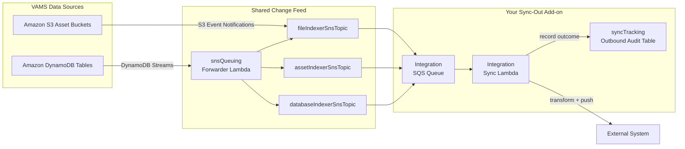
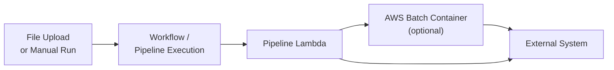

# Syncing Data Out

Sync-out moves data from VAMS to an external system as it changes in VAMS. There are
two supported approaches:

-   **Event-driven integration** — a backend add-on that subscribes to the VAMS change
    feed and pushes every relevant change to an external system in near real-time. This
    is the most reliable approach because every create, update, and delete flows through
    the same event backbone. The [Garnet Framework](../garnet-framework.md) and
    [Physna](../physna-integration.md) add-ons are built this way.
-   **Pipeline-based export** — a [processing pipeline](../../pipelines/custom-pipelines.md)
    that reads asset files and pushes them outward, triggered on file upload or run
    manually/on demand.

Choose event-driven when you need to capture every change reliably. Choose a pipeline
when export is naturally part of processing, or only needs to run on upload or on
request. The [comparison table](#choosing-between-the-two-approaches) at the end
summarizes the trade-offs.

---

## Approach A: Event-Driven Integration

### The shared change feed

VAMS already emits a change event for every mutation to a database, asset, asset link,
file, or metadata record. Amazon DynamoDB tables have streams enabled, and Amazon S3
asset buckets emit object event notifications. A forwarder AWS Lambda consolidates
these onto three shared Amazon SNS "indexer" topics, exposed on the CDK
`storageResources.sns` object:

| Amazon SNS topic          | Carries changes for                                                       |
| ------------------------- | ------------------------------------------------------------------------- |
| `fileIndexerSnsTopic`     | File metadata, file attributes, and Amazon S3 object create/remove events |
| `assetIndexerSnsTopic`    | Asset records, asset links, and asset-link metadata                       |
| `databaseIndexerSnsTopic` | Database records and database metadata                                    |

VAMS search indexing subscribes to these same topics. An external-sync add-on becomes
an additional, independent subscriber — it does not interfere with search indexing or
any other consumer. This is the intended extension point for sync-out.

### Building an event-driven sync-out add-on

The Garnet Framework and Physna add-ons follow the same reusable pattern. Use them as
worked references — Garnet under
`backend/backend/handlers/addon/garnetFramework/` and Physna under
`backend/backend/handlers/addon/physna/`. The steps below describe the pattern.

#### 1. Add a configuration flag

Add your add-on under `app.addons` in the `ConfigPublic` interface in
`infra/config/config.ts`, with defaults in `getConfig()`, validation for the required
fields when `enabled` is `true`, matching entries in the
`config.template.commercial.json` and `config.template.govcloud.json` presets, and the
ConfigBuilder mirror (`documentation/docusaurus-site/src/components/ConfigBuilder/`).
Gate the entire integration on this flag so it deploys nothing when disabled.

#### 2. Add a nested stack

Create a nested stack under `infra/lib/nestedStacks/addon/<yours>/` and a matching
lambda builder under `infra/lib/lambdaBuilder/`. Instantiate it conditionally from
`infra/lib/nestedStacks/addon/addonBuilder-nestedStack.ts`, gated on your config flag,
the same way Garnet and Physna are.

#### 3. Subscribe an Amazon SQS queue to a shared topic

Create an Amazon SQS queue and subscribe it to whichever of the three
`storageResources.sns.*IndexerSnsTopic` topics carry the changes you care about, then
wire it to your AWS Lambda with an `SqsEventSource`. You receive change events without
creating any new streams. Follow the conventions the existing add-ons use:

-   Visibility timeout roughly the Lambda timeout plus 60 seconds.
-   KMS encryption from the shared key and `enforceSSL`.
-   `grantSendMessages` to the Amazon SNS principal.
-   A GovCloud branch that uses an explicit `EventSourceMapping` with a `Tags` property
    deletion override (Amazon SQS event-source tags are unsupported on GovCloud).

:::note[No dead-letter queue by design]
The Garnet and Physna queues do not use dead-letter queues, because every message is
regenerable from authoritative VAMS state — a failed change can be replayed with the
[reindex utility](../utilities/reindex.md). They rely on the Amazon SQS visibility
timeout and Lambda retry instead, and add an `AwsSolutions-SQS3` CDK Nag suppression
with that justification. Follow the same approach unless your target system cannot
tolerate replayed events.
:::

#### 4. Handle the event envelope

Each Amazon SQS message wraps an Amazon SNS notification, which in turn wraps either a
DynamoDB stream record or an Amazon S3 event notification. In your handler, unwrap the
Amazon SQS → Amazon SNS → (stream record | S3 event) envelope, then:

-   Route by the stream `eventName` (`INSERT`, `MODIFY`, `REMOVE`) and by which table or
    bucket the source ARN matches.
-   Re-read the full, authoritative entity from Amazon DynamoDB or Amazon S3 rather than
    trusting the event payload — this keeps the pushed copy consistent even if events
    arrive out of order or are retried.
-   Transform the entity into your target system's format and push it.
-   Isolate failures per record so one bad record never aborts the whole Amazon SQS batch.

#### 5. Detect what is already up to date

To avoid redundant pushes, use one of the two models the reference add-ons use:

-   **Version marker (Physna model).** Stamp the synced copy with the source Amazon S3
    `VersionId` (Physna stores it as a reserved `__VAMS__FileVersion` metadata key). On
    the next event, compare the current Amazon S3 `VersionId` to the stored marker and
    skip the upload when they match, refreshing only metadata. A missing marker is
    treated as stale.
-   **Idempotent re-push (Garnet model).** Re-send the entity on every relevant event and
    let the target system's upsert semantics absorb duplicates. Simpler, at the cost of
    more outbound traffic.

A third option is to track sync state in the VAMS sync-tracking table rather than on the
remote copy — see [step 6](#6-record-and-check-sync-state-in-the-sync-tracking-table).

#### 6. Record and check sync state in the sync-tracking table

VAMS provides a shared outbound **sync-tracking table**,
`syncTrackingOutboundStorageTable`, that both records what an integration pushed and lets
it check what it has already synced. Records are written through
`write_outbound_sync_record` in `backend/backend/common/syncTracking.py`. After each push,
record the outcome with your own `systemType` constant (for example, `"physna"` or
`"garnetFramework"`) and a `systemUniqueId` that identifies the target environment.

Each record captures:

| Field                                                               | Purpose                                                                                  |
| ------------------------------------------------------------------- | ---------------------------------------------------------------------------------------- |
| `objectId`                                                          | The synced entity: `databaseId`, `databaseId:assetId`, or `databaseId:assetId:/filePath` |
| `syncRecordId`                                                      | Sort key — an ISO timestamp plus a short random suffix, so history accrues               |
| `objectType`                                                        | `database` / `asset` / `assetFile`                                                       |
| `action`                                                            | `create` / `modify` / `delete`                                                           |
| `syncStatus`                                                        | `success` / `failed` / `skipped` / `pending`                                             |
| `s3VersionId`                                                       | The Amazon S3 `VersionId` that was synced (the sync-state marker)                        |
| `syncSystemEntityId`                                                | The ID the target system assigned (for example, a Physna asset UUID)                     |
| `systemType:systemUniqueId`, `databaseId:systemType:systemUniqueId` | Precomputed composites for querying "everything synced to system X"                      |
| `errorMessage`                                                      | Truncated failure detail when `syncStatus` is `failed`                                   |

Because it stores the last-synced `s3VersionId` and `syncStatus` per object and target,
the table doubles as a **sync-state store**: before pushing a file, an integration can
look up its most recent record for that `objectId` and `systemType:systemUniqueId` and
skip the push when the recorded `s3VersionId` already matches the current one, or retry
when the last `syncStatus` was `failed`. This is a table-side alternative to the
remote-side version marker in step 5 — useful when the target system cannot store a
`__VAMS__FileVersion`-style marker of its own.

:::note[Best-effort writes — do not rely on it as the only source of truth]
`write_outbound_sync_record` never raises into the calling handler — every failure is
logged and swallowed, so a problem writing a record cannot break the sync itself. Because
a write can be skipped, treat the table as an optimization for detecting already-synced
objects, not as an authoritative change feed. The reliable change trigger is always the
event feed; reconcile against authoritative VAMS state (Amazon DynamoDB / Amazon S3) when
correctness matters.
:::

#### 7. Grant permissions

Grant the Lambda read/write on `syncTrackingOutboundStorageTable`, read on the source
Amazon DynamoDB tables and asset buckets it reconciles against, and the standard
security helpers (KMS key usage, Lambda environment, VPC configuration) that every VAMS
Lambda builder applies.

### Back-filling existing data

Subscribing to the change feed only captures changes that occur **after** the add-on is
deployed. To push data that already existed beforehand, run the
[reindex utility](../utilities/reindex.md), which republishes all asset and file records
through the same Amazon SNS topics. Because every downstream subscriber receives those
republished events, a single reindex back-fills your new integration alongside search
indexing.

---

## Approach B: Pipeline-Based Export

A [processing pipeline](../../pipelines/custom-pipelines.md) can also push data out of
VAMS. A pipeline runs a Lambda and, optionally, an AWS Batch container that receives
an asset's files as input; that code can transform the files and send them to an
external system.

A pipeline is a good fit for sync-out when:

-   The export is a natural side effect of processing (for example, converting a file and
    also publishing the converted output externally).
-   Export only needs to happen when a file is uploaded, or only when a user or schedule
    explicitly runs it — not on every metadata change.

Its trade-off against the event-driven approach is coverage: a pipeline triggered on
upload sees file-upload events but not standalone metadata or asset changes, and a
manually run pipeline captures only what exists at run time. When you need every change
reflected, prefer the event-driven approach.

See [Custom Pipelines](../../pipelines/custom-pipelines.md) for how to build and register
a pipeline, thread the `assetId` through, and follow the Amazon S3 output-path
conventions.

---

## Choosing Between the Two Approaches

| Consideration   | Event-driven add-on                            | Pipeline export                                    |
| --------------- | ---------------------------------------------- | -------------------------------------------------- |
| Trigger         | Every data change (streams + Amazon S3 events) | File upload event, or manual / on-demand run       |
| Change coverage | Databases, assets, files, links, and metadata  | Files present at run time (plus upload events)     |
| Latency         | Near real-time                                 | Per run                                            |
| Reliability     | Highest — nothing bypasses the change feed     | Bounded by the trigger                             |
| Where it runs   | Backend add-on + CDK nested stack              | Pipeline Lambda / container                        |
| Effort          | Higher                                         | Medium                                             |
| Best for        | Continuous, complete external mirrors          | Export coupled to processing, or occasional export |

---

## Related Pages

-   [Data Syncing Overview](overview.md) — directions and approach selection
-   [Garnet Framework Integration](../garnet-framework.md) — idempotent re-push reference
-   [Physna Integration](../physna-integration.md) — version-marker change-detection reference
-   [Custom Pipelines](../../pipelines/custom-pipelines.md) — building a pipeline for export
-   [Reindex Utility](../utilities/reindex.md) — back-fill downstream indexers for existing data
-   [Configuration Reference](../../deployment/configuration-reference.md) — `app.addons` options
