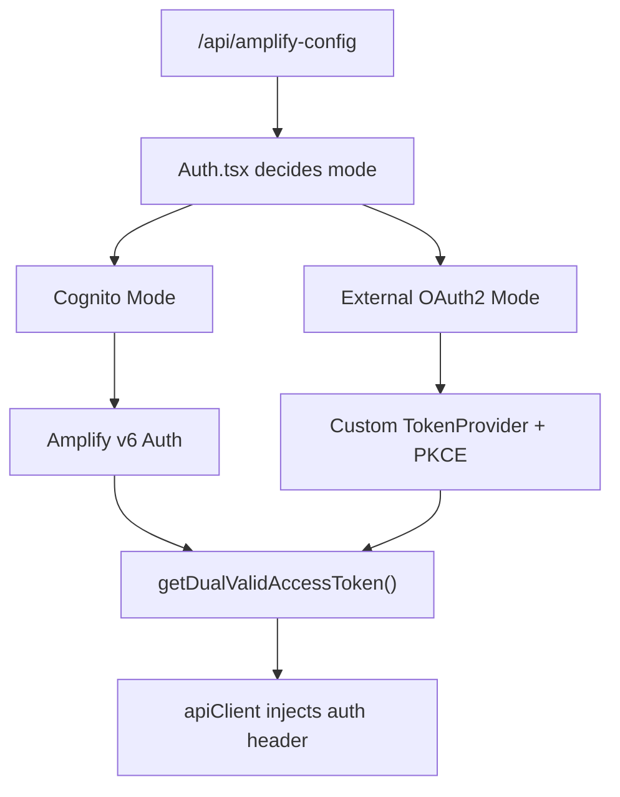

# Frontend Development

This guide covers development patterns for the VAMS React frontend, including project structure, API integration, authentication, theming, and component conventions.

## Technology Stack

| Technology                  | Version | Purpose                          |
| --------------------------- | ------- | -------------------------------- |
| React                       | 17.0.2  | UI framework (not React 18)      |
| TypeScript                  | 4.4.4   | Type system                      |
| Vite                        | 6.x     | Build tooling                    |
| Cloudscape Design System    | 3.x     | AWS UI component library         |
| AWS Amplify                 | v6      | Authentication integration       |
| React Router                | v6      | Client-side routing (HashRouter) |
| `@badgateway/oauth2-client` | 2.4.2   | External OAuth2 PKCE flow        |

:::info[React 17]
This project uses React 17, not React 18. Do not use React 18 APIs such as `createRoot`, `useId`, `useSyncExternalStore`, `useTransition`, or `useDeferredValue`. The app uses `ReactDOM.render`.
:::

## Project Structure

```
web/src/
  App.tsx                 # Root shell, HashRouter, TopNavigation
  routes.tsx              # Centralized route table with React.lazy
  config.ts               # Static config (APP_TITLE, DEV_API_ENDPOINT)
  synonyms.tsx            # Customizable display names (Asset, Database, Comment)
  index.tsx               # Entry point (ReactDOM.render)

  FedAuth/Auth.tsx        # Dual-mode authentication orchestrator

  services/               # API and data services (ONLY place to import apiClient)
    APIService.ts         # Main API service (~40+ exports)
    apiClient.ts          # Custom fetch wrapper (internal only)
    appCache.ts           # localStorage cache (replaces Amplify Cache)
    AssetUploadService.ts
    AssetVersionService.ts
    FileOperationsService.ts
    MetadataService.ts
    MetadataSchemaService.ts

  context/                # React Context providers
    AssetContext.ts        # Asset list state
    AssetDetailContext.ts  # Single asset detail with useReducer
    WorkflowContext.ts     # Workflow state

  pages/                  # Thin page wrappers (lazy-loaded)
  components/             # Domain/feature components
  visualizerPlugin/       # 3D/media viewer plugin system (17 viewers)
  layout/Navigation.tsx   # Left sidebar navigation
  styles/theme.css        # CSS custom properties for dark/light theme
  utils/authTokenUtils.ts # Dual-mode token utilities
```

## Critical Rules

### Rule 1: All API Calls Through Service Layer

All API calls must go through service-layer files in `src/services/`. Components and pages must never import `apiClient` directly.

```typescript
// CORRECT -- import from a service file
import { fetchAssets, deleteAsset } from "../../services/APIService";
const result = await fetchAssets({ databaseId });

// WRONG -- never import apiClient in components or pages
import { apiClient } from "../../services/apiClient";

// WRONG -- never use fetch or axios directly
const response = await fetch("/api/databases");
```

The following service files are the only files that may import `apiClient`:

| Service File               | Responsibility                                  |
| -------------------------- | ----------------------------------------------- |
| `APIService.ts`            | General CRUD, auth, search, subscriptions, tags |
| `AssetUploadService.ts`    | Amazon S3 multipart upload operations           |
| `AssetVersionService.ts`   | Version management                              |
| `FileOperationsService.ts` | File operations                                 |
| `MetadataService.ts`       | Metadata CRUD                                   |
| `MetadataSchemaService.ts` | Schema management                               |

### Rule 2: Cloudscape Individual Imports

Always import Cloudscape components from their individual subpaths. Barrel imports cause the entire library to be bundled.

```typescript
// CORRECT -- tree-shakeable individual imports
import Button from "@cloudscape-design/components/button";
import Table from "@cloudscape-design/components/table";
import Header from "@cloudscape-design/components/header";

// WRONG -- imports entire library
import { Button, Table, Header } from "@cloudscape-design/components";
```

### Rule 3: HashRouter for Routing

VAMS uses `HashRouter`, meaning all URLs use the `/#/path` format. This is required for Amazon CloudFront and Application Load Balancer compatibility where all paths serve the same `index.html`.

```typescript
// CORRECT -- use React Router navigation
import { useNavigate } from "react-router-dom";
navigate("/databases/mydb/assets");

// WRONG -- do not use BrowserRouter
import { BrowserRouter } from "react-router-dom";
```

### Rule 4: Lazy Load All Pages

Every page component in `routes.tsx` must be lazy-loaded for route-level code splitting.

```typescript
// CORRECT
const MyPage = React.lazy(() => import("./pages/MyPage"));

// WRONG -- defeats code splitting
import MyPage from "./pages/MyPage";
```

### Rule 5: No Global State Library

VAMS uses React Context API with `useReducer` for shared state. Do not introduce Redux, Zustand, MobX, or any other global state library.

```typescript
// CORRECT
const MyContext = createContext<MyContextType | undefined>(undefined);

// WRONG
import { createStore } from "redux";
import create from "zustand";
```

## API Integration Pattern

### The Return Tuple Pattern

Most `APIService.ts` functions return `[boolean, data/errorMessage]` tuples:

```typescript
export const fetchSomething = async ({ databaseId }: { databaseId: string }) => {
    try {
        const response = await apiClient.get(`database/${databaseId}/something`);
        if (response.message) {
            if (
                response.message.indexOf("error") !== -1 ||
                response.message.indexOf("Error") !== -1
            ) {
                console.log(response.message);
                return [false, response.message];
            } else {
                return [true, response.message];
            }
        } else {
            return response;
        }
    } catch (error: any) {
        console.log(error);
        return [false, error?.message];
    }
};
```

### Consuming API Results

Always check the boolean flag before using the data:

```typescript
const result = await fetchAssets({ databaseId });
if (result === false || result[0] === false) {
    setError(result ? result[1] : "Unknown error");
    return;
}
const data = result[1];
```

:::warning[Never Assume Success]
The API service functions can return `false`, `[false, errorMessage]`, or `[true, data]`. Always check the result before processing.
:::

### Pagination

The backend uses `NextToken`-based pagination:

```typescript
let allItems: any[] = [];
let nextToken: string | null = null;
do {
    const response = await apiClient.get(endpoint, {
        queryStringParameters: {
            ...(nextToken && { startingToken: nextToken }),
        },
    });
    allItems = [...allItems, ...(response.items || [])];
    nextToken = response.nextToken;
} while (nextToken);
```

## Authentication System

VAMS supports two authentication modes, determined at runtime from the `/api/amplify-config` endpoint.

### Dual Auth Architecture



The auth orchestrator in `src/FedAuth/Auth.tsx` selects the mode based on runtime configuration:

-   `window.DISABLE_COGNITO === true` -- External OAuth2 mode
-   `window.COGNITO_FEDERATED === true` -- Federated Cognito mode
-   Otherwise -- Standard Amazon Cognito mode

### Token Utilities

Always use the dual-mode token utilities for authentication. Never access Amplify Auth directly.

```typescript
import { getDualValidAccessToken, getDualAuthorizationHeader } from "../utils/authTokenUtils";

// Gets valid access token from whichever auth mode is active
const token = await getDualValidAccessToken();

// Gets authorization header for manual requests
const header = await getDualAuthorizationHeader();
```

## State Management

### Context Pattern

Follow the existing `AssetDetailContext.ts` pattern for new contexts:

```typescript
import { createContext, useReducer } from "react";

export interface MyAction {
    type: string;
    payload: any;
}

export const myReducer = (state: MyState, action: MyAction): MyState => {
    switch (action.type) {
        case "SET_DATA":
            return action.payload;
        default:
            return state;
    }
};

export type MyContextType = {
    state: MyState;
    dispatch: any;
};

export const MyContext = createContext<MyContextType | undefined>(undefined);
```

### Existing Contexts

| Context              | File                            | Purpose             |
| -------------------- | ------------------------------- | ------------------- |
| `AssetContext`       | `context/AssetContext.ts`       | Asset list state    |
| `AssetDetailContext` | `context/AssetDetailContext.ts` | Single asset detail |
| `WorkflowContext`    | `context/WorkflowContext.ts`    | Workflow state      |

:::note[Intentional Typos]
The filenames `AssetContex.ts` and `WorkflowContex.ts` are intentional legacy names. Never rename them.
:::

## Theme System

VAMS supports dark and light themes. The default theme is dark mode.

### How Theming Works

-   **`src/styles/theme.css`** defines CSS custom properties with dark/light variants
-   The `.awsui-dark-mode` class on `<body>` activates dark mode values
-   Cloudscape's `applyMode()` toggles the Cloudscape component dark mode
-   Users switch themes via the Settings dropdown in the top navigation
-   Theme preference is persisted to `localStorage`

### Using Theme-Aware Styles

When adding new styles, use CSS custom properties from `theme.css` or Cloudscape design tokens:

```scss
@use "@cloudscape-design/design-tokens" as awsui;

.my-container {
    padding: awsui.$space-l;
    color: awsui.$color-text-body-default;
}
```

:::tip[Dark Mode Compatibility]
Never hardcode colors or spacing that Cloudscape provides as design tokens. Use CSS custom properties from `theme.css` or Cloudscape tokens to ensure dark mode compatibility.
:::

## Configuration System

### Static Configuration

`src/config.ts` defines build-time settings through the `VAMSConfig` interface. Organizations should modify this file to match their branding and environment.

```typescript
interface VAMSConfig {
    APP_TITLE: string; // Browser tab title
    APP_NAME: string; // Short name in footer and UI references
    FOOTER_COPYRIGHT: string; // Footer copyright text (empty string hides footer)
    CUSTOMER_LOGO?: string; // Optional custom logo URL for sidebar navigation
    DEV_API_ENDPOINT: string; // API endpoint for local development
}
```

| Field              | Default                                   | Description                                                                                                                                                    |
| ------------------ | ----------------------------------------- | -------------------------------------------------------------------------------------------------------------------------------------------------------------- |
| `APP_TITLE`        | `"VAMS - Visual Asset Management System"` | Displayed in the browser tab and login pages                                                                                                                   |
| `APP_NAME`         | `"Visual Asset Management System"`        | Short name used in the footer and logo alt text                                                                                                                |
| `FOOTER_COPYRIGHT` | `"(c) 2026, Amazon Web Services..."`      | Copyright text in the page footer. Set to empty string to hide the footer entirely.                                                                            |
| `CUSTOMER_LOGO`    | `undefined`                               | URL to a custom logo for the sidebar navigation header. Supports relative paths or absolute URLs. Leave undefined for the default VAMS logo.                   |
| `DEV_API_ENDPOINT` | `""`                                      | API endpoint for local development. Empty string uses same origin (production default). Set to an API Gateway URL or `http://localhost:8002/` for development. |

**Example customization:**

```typescript
const config: VAMSConfig = {
    APP_TITLE: "My Company - Asset Manager",
    APP_NAME: "My Company Asset Manager",
    FOOTER_COPYRIGHT: "(c) 2026, My Company. All rights reserved.",
    CUSTOMER_LOGO: "/my-company-logo.png",
    DEV_API_ENDPOINT: "",
};
```

### Runtime Configuration

Configuration is loaded at startup in two stages:

1. `GET /api/amplify-config` -- Cached in `appCache`, configures Amplify v6
2. `GET /api/secure-config` -- Additional config requiring authentication

Access runtime config through `appCache`:

```typescript
import { appCache } from "../services/appCache";

const config = appCache.getItem("config");
```

### Feature Flags

Feature flags are stored in `config.featuresEnabled` as an array of strings:

```typescript
const config = appCache.getItem("config");
if (config?.featuresEnabled?.includes("LOCATIONSERVICES")) {
    // Enable map features
}
```

Known feature flags:

| Flag               | Purpose                                      |
| ------------------ | -------------------------------------------- |
| `LOCATIONSERVICES` | Map and geospatial features                  |
| `NOOPENSEARCH`     | Disable OpenSearch-dependent features        |
| `ALLOWUNSAFEEVAL`  | Required for CesiumJS and Needle USD viewers |

### Display Name Customization

Use `Synonyms` instead of hardcoded entity names:

```typescript
import Synonyms from "../../synonyms";

<Header>{Synonyms.Assets}</Header>
<p>Select a {Synonyms.Database}</p>
```

## Adding New Pages and Components

### Adding a New Page

1. Create the page component in `src/pages/`:

    ```tsx
    import React from "react";
    import MyComponent from "../components/myfeature/MyComponent";

    const MyPage: React.FC = () => <MyComponent />;
    export default MyPage;
    ```

2. Add the lazy import and route in `src/routes.tsx`:

    ```typescript
    const MyPage = React.lazy(() => import("./pages/MyPage"));

    // In routeTable array:
    {
        path: "/myfeature",
        Page: MyPage,
        active: "#/myfeature/",
    },
    ```

3. Add a navigation item in `src/layout/Navigation.tsx` if needed.

The route is automatically permission-filtered via the `webRoutes()` API call. The backend must also allow the route in the Casbin policy.

### Component Template

```tsx
import React, { useState, useEffect, useCallback } from "react";
import { useParams } from "react-router-dom";
import Box from "@cloudscape-design/components/box";
import Header from "@cloudscape-design/components/header";
import SpaceBetween from "@cloudscape-design/components/space-between";
import Table from "@cloudscape-design/components/table";
import Synonyms from "../../synonyms";
import { fetchSomething } from "../../services/APIService";

const MyComponent: React.FC = () => {
    const { databaseId } = useParams();
    const [loading, setLoading] = useState(true);
    const [items, setItems] = useState<any[]>([]);

    const fetchData = useCallback(async () => {
        setLoading(true);
        try {
            const result = await fetchSomething({ databaseId });
            if (result === false || result[0] === false) {
                return;
            }
            setItems(result[1] || result);
        } finally {
            setLoading(false);
        }
    }, [databaseId]);

    useEffect(() => {
        fetchData();
    }, [fetchData]);

    return (
        <SpaceBetween size="l">
            <Header variant="h1">{Synonyms.Assets}</Header>
            <Table loading={loading} items={items} columnDefinitions={[]} />
        </SpaceBetween>
    );
};

export default MyComponent;
```

## Anti-Patterns

| Anti-Pattern                                       | Correct Approach                                         |
| -------------------------------------------------- | -------------------------------------------------------- |
| Import `apiClient` in components                   | Import from `APIService.ts` or other service files       |
| Barrel import from `@cloudscape-design/components` | Use individual subpath imports                           |
| Use `BrowserRouter`                                | Use `HashRouter`                                         |
| Eagerly import page components                     | Use `React.lazy()` in `routes.tsx`                       |
| Add Redux, Zustand, or MobX                        | Use React Context + `useReducer`                         |
| Use `Amplify Cache`                                | Use `appCache` from `src/services/appCache.ts`           |
| Access Amplify Auth directly                       | Use `getDualValidAccessToken()` from `authTokenUtils.ts` |
| Hardcode "Asset" or "Database" strings             | Use `Synonyms` from `src/synonyms.tsx`                   |
| Use `console.error` for logging                    | Use `console.log` (match existing convention)            |

## Next Steps

-   [Viewer Plugin Development](viewer-plugins.md) -- Building custom file viewers
-   [Backend Development](backend.md) -- API handler patterns
-   [CDK Infrastructure](cdk.md) -- Frontend deployment configuration
