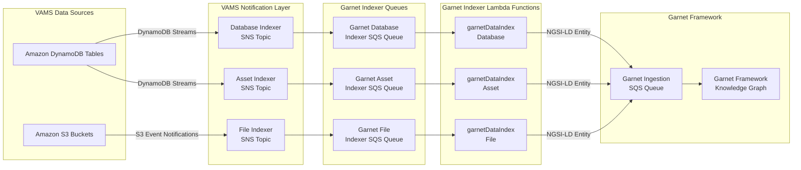

# Garnet Framework Integration

The [Garnet Framework](https://garnet-framework.dev/) is an open-source solution for building digital twin and knowledge graph applications on AWS using the NGSI-LD standard. VAMS integrates with Garnet Framework to automatically synchronize all data changes into an external NGSI-LD knowledge graph, enabling advanced data federation, querying, and analytics capabilities across your visual asset data.

---

## How VAMS Integrates with Garnet

VAMS provides a **one-way data synchronization** from VAMS to the Garnet Framework. When enabled, every change to a database, asset, asset link, or file in VAMS is automatically converted to an NGSI-LD entity and sent to the Garnet Framework ingestion queue.

The integration uses an event-driven architecture that mirrors the existing Amazon OpenSearch indexing pattern. VAMS DynamoDB Streams and Amazon S3 event notifications feed into Amazon SNS topics, which fan out to dedicated Amazon SQS queues for the Garnet indexer Lambda functions. Each indexer Lambda converts the change event into an NGSI-LD entity and sends it to the external Garnet Framework ingestion Amazon SQS queue.

:::info
Garnet Framework integration is entirely optional. Enabling it does not affect the core VAMS functionality or any other indexing systems such as Amazon OpenSearch. The Garnet indexers operate as additional consumers of the same Amazon SNS notification topics.
:::

---

## Configuration

To enable Garnet Framework integration, set `app.addons.useGarnetFramework.enabled` to `true` in `infra/config/config.json` and provide the required connection details for your Garnet Framework deployment.

```json
{
    "app": {
        "addons": {
            "useGarnetFramework": {
                "enabled": true,
                "garnetApiEndpoint": "https://XXX.execute-api.us-east-1.amazonaws.com",
                "garnetApiToken": "your-garnet-api-token",
                "garnetIngestionQueueSqsUrl": "https://sqs.us-east-1.amazonaws.com/123456789012/garnet-ingestion-queue"
            }
        }
    }
}
```

| Field                        | Required | Description                                                                                                                   |
| ---------------------------- | -------- | ----------------------------------------------------------------------------------------------------------------------------- |
| `enabled`                    | Yes      | Set to `true` to deploy the Garnet Framework indexer Lambda functions and Amazon SQS queues.                                  |
| `garnetApiEndpoint`          | Yes      | The Garnet Framework API endpoint URL. Must be a valid URL.                                                                   |
| `garnetApiToken`             | Yes      | API authentication token for the Garnet Framework.                                                                            |
| `garnetIngestionQueueSqsUrl` | Yes      | Amazon SQS queue URL for the Garnet Framework ingestion queue. Format: `https://sqs.REGION.amazonaws.com/ACCOUNT/QUEUE_NAME`. |

:::warning
When Garnet Framework is enabled, all three fields (`garnetApiEndpoint`, `garnetApiToken`, `garnetIngestionQueueSqsUrl`) are required. Deployment will fail with a configuration validation error if any field is missing or empty.
:::

For the complete configuration reference, see the [Configuration Reference](../deployment/configuration-reference.md#garnet-framework-appaddonsusegarnetframework).

---

## Architecture

The following diagram illustrates the data flow from VAMS to the Garnet Framework.



Each indexer Lambda function:

1. Receives an Amazon SQS message containing an Amazon SNS notification wrapping a DynamoDB stream record (or Amazon S3 event notification).
2. Reads the full entity data from the relevant DynamoDB tables.
3. Converts the VAMS entity to an NGSI-LD formatted entity.
4. Sends the NGSI-LD entity to the external Garnet Framework ingestion Amazon SQS queue.

---

## Data Mapping

VAMS creates four NGSI-LD entity types in the Garnet Framework knowledge graph. Each VAMS entity is converted to an NGSI-LD entity with properties, relationships, and geo-properties based on the VAMS metadata value types.

### Entity Types and URN Patterns

| NGSI-LD Entity Type | URN Pattern                                              | VAMS Source        |
| ------------------- | -------------------------------------------------------- | ------------------ |
| `VAMSDatabase`      | `urn:vams:database:{databaseId}`                         | Database records   |
| `VAMSAsset`         | `urn:vams:asset:{databaseId}:{assetId}`                  | Asset records      |
| `VAMSAssetLink`     | `urn:vams:assetlink:{assetLinkId}`                       | Asset link records |
| `VAMSFile`          | `urn:vams:file:{databaseId}:{assetId}:{encodedFilePath}` | File records       |

### VAMSDatabase Entity

The database indexer converts VAMS database records to `VAMSDatabase` NGSI-LD entities.

**Mapped properties:**

| NGSI-LD Property                  | Type        | VAMS Source                                |
| --------------------------------- | ----------- | ------------------------------------------ |
| `databaseId`                      | Property    | Database ID                                |
| `description`                     | Property    | Database description                       |
| `defaultBucketId`                 | Property    | Default Amazon S3 bucket ID                |
| `bucketName`                      | Property    | Amazon S3 bucket name (from bucket lookup) |
| `baseAssetsPrefix`                | Property    | Amazon S3 base prefix for assets           |
| `restrictMetadataOutsideSchemas`  | Property    | Schema restriction flag                    |
| `restrictFileUploadsToExtensions` | Property    | File extension restriction list            |
| `assetCount`                      | Property    | Number of assets in the database           |
| `createdBy`                       | Property    | Creator user ID                            |
| `dateCreated`                     | Property    | Creation timestamp (DateTime)              |
| `dateModified`                    | Property    | Last modification timestamp (DateTime)     |
| `isArchived`                      | Property    | Whether the database is archived           |
| `location`                        | GeoProperty | Geographic location (if set)               |
| `metadata_*`                      | Varies      | Custom metadata (see metadata mapping)     |

**Relationships:**

| NGSI-LD Relationship | Target Entity URN            |
| -------------------- | ---------------------------- |
| `usesBucket`         | `urn:vams:bucket:{bucketId}` |

**Example NGSI-LD entity:**

```json
{
    "id": "urn:vams:database:my-database",
    "type": "VAMSDatabase",
    "scope": ["/Database/my-database"],
    "databaseId": {
        "type": "Property",
        "value": "my-database"
    },
    "description": {
        "type": "Property",
        "value": "Production asset database"
    },
    "assetCount": {
        "type": "Property",
        "value": 42
    },
    "dateCreated": {
        "type": "Property",
        "value": {
            "@type": "DateTime",
            "@value": "2024-01-15T10:30:00Z"
        }
    },
    "isArchived": {
        "type": "Property",
        "value": false
    },
    "usesBucket": {
        "type": "Relationship",
        "object": "urn:vams:bucket:bucket-abc123"
    }
}
```

### VAMSAsset Entity

The asset indexer converts VAMS asset records to `VAMSAsset` NGSI-LD entities. When an asset changes, the indexer also re-indexes all associated asset links to keep relationship data consistent.

**Mapped properties:**

| NGSI-LD Property   | Type     | VAMS Source                                |
| ------------------ | -------- | ------------------------------------------ |
| `assetName`        | Property | Asset display name                         |
| `assetType`        | Property | Asset type classification                  |
| `description`      | Property | Asset description                          |
| `databaseId`       | Property | Parent database ID                         |
| `bucketId`         | Property | Amazon S3 bucket ID                        |
| `bucketName`       | Property | Amazon S3 bucket name (from bucket lookup) |
| `baseAssetsPrefix` | Property | Amazon S3 base prefix for the bucket       |
| `isDistributable`  | Property | Distribution flag                          |
| `tags`             | Property | Tag list                                   |
| `createdBy`        | Property | Creator user ID                            |
| `dateCreated`      | Property | Creation timestamp (DateTime)              |
| `dateModified`     | Property | Last modification timestamp (DateTime)     |
| `isArchived`       | Property | Whether the asset is archived              |
| `hasChildren`      | Property | Has child assets (parentChild links)       |
| `hasParents`       | Property | Has parent assets (parentChild links)      |
| `hasRelated`       | Property | Has related assets (related links)         |
| `currentVersionId` | Property | Current version ID                         |
| `versionCreatedAt` | Property | Current version creation date (DateTime)   |
| `versionComment`   | Property | Current version comment                    |
| `metadata_*`       | Varies   | Custom metadata (see metadata mapping)     |

**Relationships:**

| NGSI-LD Relationship | Target Entity URN                |
| -------------------- | -------------------------------- |
| `belongsToDatabase`  | `urn:vams:database:{databaseId}` |
| `usesBucket`         | `urn:vams:bucket:{bucketId}`     |

### VAMSAssetLink Entity

The asset indexer also handles asset link records, converting them to `VAMSAssetLink` NGSI-LD entities that represent relationships between assets.

**Mapped properties:**

| NGSI-LD Property   | Type     | VAMS Source                            |
| ------------------ | -------- | -------------------------------------- |
| `assetLinkId`      | Property | Asset link identifier                  |
| `relationshipType` | Property | Link type (`parentChild` or `related`) |
| `assetLinkAliasId` | Property | Optional alias for the link            |
| `tags`             | Property | Tag list                               |
| `fromDatabaseId`   | Property | Source asset database ID               |
| `fromAssetId`      | Property | Source asset ID                        |
| `toDatabaseId`     | Property | Target asset database ID               |
| `toAssetId`        | Property | Target asset ID                        |
| `dateCreated`      | Property | Creation timestamp (DateTime)          |
| `metadata_*`       | Varies   | Custom metadata (see metadata mapping) |

**Relationships:**

| NGSI-LD Relationship | Target Entity URN                               |
| -------------------- | ----------------------------------------------- |
| `fromAsset`          | `urn:vams:asset:{fromDatabaseId}:{fromAssetId}` |
| `toAsset`            | `urn:vams:asset:{toDatabaseId}:{toAssetId}`     |

### VAMSFile Entity

The file indexer converts VAMS file records to `VAMSFile` NGSI-LD entities, enriched with Amazon S3 object information.

**Mapped properties:**

| NGSI-LD Property | Type     | VAMS Source                            |
| ---------------- | -------- | -------------------------------------- |
| `filePath`       | Property | Relative file path within the asset    |
| `fileExtension`  | Property | File extension (lowercase)             |
| `fileSize`       | Property | File size in bytes (from Amazon S3)    |
| `lastModified`   | Property | Last modified timestamp (DateTime)     |
| `contentType`    | Property | MIME content type (from Amazon S3)     |
| `etag`           | Property | Amazon S3 ETag                         |
| `s3VersionId`    | Property | Amazon S3 version ID                   |
| `s3Key`          | Property | Full Amazon S3 object key              |
| `bucketName`     | Property | Amazon S3 bucket name                  |
| `assetName`      | Property | Parent asset name (for context)        |
| `isArchived`     | Property | Whether the file is archived           |
| `metadata_*`     | Varies   | Custom metadata (see metadata mapping) |
| `attribute_*`    | Property | File attributes (always string type)   |

**Relationships:**

| NGSI-LD Relationship | Target Entity URN                       |
| -------------------- | --------------------------------------- |
| `belongsToAsset`     | `urn:vams:asset:{databaseId}:{assetId}` |

:::note
The file indexer automatically skips folder markers, preview files (`.previewFile.*`), and files in excluded directories such as `pipeline/`, `preview/`, `temp-upload/`, and `workspace/`.
:::

### Custom Metadata Mapping

All four entity types support custom metadata. VAMS metadata fields are mapped to NGSI-LD properties with a `metadata_` prefix to avoid naming conflicts with core properties. The NGSI-LD property type is determined by the VAMS `metadataValueType`:

| VAMS `metadataValueType`                        | NGSI-LD Property Type | Notes                                 |
| ----------------------------------------------- | --------------------- | ------------------------------------- |
| `geopoint`, `geojson`                           | `GeoProperty`         | Value is parsed as GeoJSON            |
| `json`                                          | `JsonProperty`        | Value is parsed as JSON object        |
| `xyz`, `wxyz`, `matrix4x4`, `lla`               | `JsonProperty`        | Spatial transform data stored as JSON |
| All other types (string, number, boolean, date) | `Property`            | Standard NGSI-LD property             |

For example, a VAMS metadata field named `location` with type `geopoint` becomes:

```json
{
    "metadata_location": {
        "type": "GeoProperty",
        "value": {
            "type": "Point",
            "coordinates": [-73.935242, 40.73061]
        }
    }
}
```

---

## Reindexing Existing Data

When you enable Garnet Framework integration on an existing VAMS deployment, only new and updated data is automatically synchronized. Existing data that was created before Garnet was enabled is not retroactively indexed.

To index all existing data, use the reindex utility in the deployment migration scripts to trigger a full data reindex through the global notification queues. This process sends change notifications for all existing records through the same Amazon SNS topics that feed the Garnet indexers, causing a complete synchronization without clearing any existing indexes.

:::tip
The reindex process shares the same notification infrastructure used by Amazon OpenSearch indexing. Running a reindex will update both OpenSearch and Garnet indexes simultaneously. You do not need to clear OpenSearch indexes to trigger the reindex.
:::

---

## DynamoDB Stream Sources

Each Garnet indexer Lambda function processes events from specific DynamoDB tables. The indexer identifies the source table by matching the table name against the `eventSourceARN` in the stream record.

| Indexer Lambda            | DynamoDB Tables Monitored                                                                                                |
| ------------------------- | ------------------------------------------------------------------------------------------------------------------------ |
| `garnetDataIndexDatabase` | Database storage table, database metadata storage table                                                                  |
| `garnetDataIndexAsset`    | Asset storage table, asset file metadata storage table (asset-level only), asset links table, asset links metadata table |
| `garnetDataIndexFile`     | Asset file metadata storage table (file-level only), file attribute storage table; also Amazon S3 event notifications    |

---

## Limitations

-   **One-way synchronization only.** Data flows from VAMS to the Garnet Framework. Changes made directly in the Garnet Framework knowledge graph are not reflected back into VAMS.
-   **External Garnet deployment required.** VAMS does not deploy the Garnet Framework itself. You must have an existing Garnet Framework deployment and provide the API endpoint, API token, and ingestion queue URL.
-   **No dead-letter queue.** The Garnet indexer Amazon SQS queues do not use dead-letter queues. Failed messages are retried based on the queue visibility timeout (960 seconds). If persistent failures occur, messages expire based on the default Amazon SQS retention period.
-   **Metadata key prefixing.** Custom metadata fields are prefixed with `metadata_` in the NGSI-LD entities. Custom file attributes are prefixed with `attribute_`. This prevents conflicts with core NGSI-LD properties but means queries in Garnet must use the prefixed names.

---

## Related Resources

-   [Garnet Framework documentation](https://garnet-framework.dev/)
-   [NGSI-LD specification](https://www.etsi.org/deliver/etsi_gs/CIM/001_099/009/01.06.01_60/gs_CIM009v010601p.pdf)
-   [Configuration Reference -- Garnet Framework](../deployment/configuration-reference.md#garnet-framework-appaddonsusegarnetframework)
-   [Partner Integrations](../additional/partner-integrations.md)
