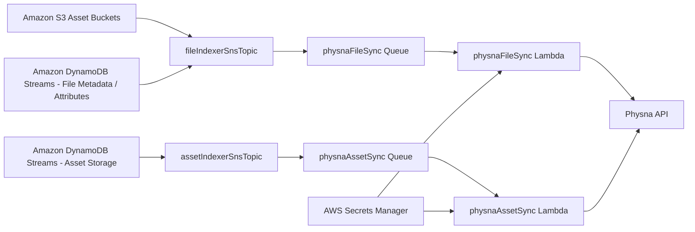

# Physna Integration

[Physna](https://physna.com/) is a partner ISV that provides a geometric and semantic search platform for 3D and CAD assets. VAMS integrates with Physna through an optional add-on that performs **one-way synchronization** of supported VAMS files, file metadata, file attributes, and asset metadata into a customer's Physna tenant.

:::info
Phase 1 of the Physna integration is VAMS-to-Physna only. Future phases will add two-way synchronization and in-app UI surfaces. The integration does not affect any other VAMS functionality when disabled.
:::

---

## How VAMS integrates with Physna

When the add-on is enabled, VAMS emits events through its existing notification fanout (Amazon SNS topics populated by Amazon DynamoDB Streams and Amazon S3 event notifications). Two new Amazon SQS queues — one subscribed to the file indexer topic and one to the asset indexer topic — feed two new Lambda consumers. Each Lambda authenticates against the Physna API using OAuth2 client credentials, with tokens cached in Lambda memory and refreshed on expiry or on `401` responses.

### Physna data model translation

Physna treats all content as a path-based tree of folders and assets within a tenant, where only files (called "assets" in Physna) can carry metadata. VAMS maps its concepts into that tree as follows:

| VAMS concept         | Physna concept | Path representation                     |
| -------------------- | -------------- | --------------------------------------- |
| Database (`dbId`)    | Folder         | `\{dbId\}/`                             |
| Asset (`assetId`)    | Folder         | `\{dbId\}/\{assetId\}/`                 |
| File (relative path) | Asset (file)   | `\{dbId\}/\{assetId\}/\{relativePath\}` |

Folders are created implicitly when VAMS uploads the first file into each path via the `createMissingFolders=true` parameter on the Physna asset upload endpoint.

---

## Configuration

To enable the Physna Sync add-on, set `app.addons.usePhysnaSync.enabled` to `true` in `infra/config/config.json` and provide tenant and authentication details.

```json
{
    "app": {
        "addons": {
            "usePhysnaSync": {
                "enabled": true,
                "tenantId": "00000000-0000-0000-0000-000000000000",
                "apiBaseEndpoint": "https://app-api.physna.com/v3/",
                "authTokenEndpoint": "https://physna-app.auth.us-east-2.amazoncognito.com/oauth2/token",
                "authType": "cognito",
                "clientId": "your-physna-client-id",
                "clientSecret": "your-physna-client-secret"
            }
        }
    }
}
```

| Field               | Required | Description                                                                                          |
| ------------------- | -------- | ---------------------------------------------------------------------------------------------------- |
| `enabled`           | Yes      | Set to `true` to deploy the Physna Sync infrastructure and Lambda consumers.                         |
| `tenantId`          | Yes      | Physna tenant UUID. All synchronized content is written under this tenant.                           |
| `apiBaseEndpoint`   | Yes      | Physna REST API base URL. Must end with `/`. Default: `https://app-api.physna.com/v3/`.              |
| `authTokenEndpoint` | Yes      | OAuth2 token endpoint for Physna's Cognito user pool.                                                |
| `authType`          | Yes      | Authentication mode. Phase 1 accepts only `cognito`. Future phases will add external IdP support.    |
| `clientId`          | Yes      | Cognito client ID provisioned for your Physna tenant. Written to AWS Secrets Manager at deploy time. |
| `clientSecret`      | Yes      | Cognito client secret. Written to AWS Secrets Manager at deploy time.                                |

:::warning
When the add-on is enabled, validation in `infra/config/config.ts` enforces that every field is present and well-formed. Deployment will fail with a configuration error if any required field is empty or malformed.
:::

---

## Credentials storage

At deploy time, the CDK stack creates a single AWS Secrets Manager secret containing the `clientId` and `clientSecret` values from the configuration. Both Lambda functions read this secret (scoped to the specific secret ARN, not `*`) on cold start and cache the parsed credentials in memory.

:::warning[Rotate after deployment]
Because the secret is created from plaintext values in the configuration file, the first deployment writes the plaintext into the CloudFormation template during synthesis. **Rotate the Physna client secret in Secrets Manager after your first successful deployment** and remove the plaintext from `config.json`. A future phase will support referencing an existing Secrets Manager ARN directly.
:::

---

## Supported file types

The add-on gates uploads by file extension and silently skips any file whose extension Physna does not accept. There are **two distinct extension sets**, because the formats VAMS uploads to Physna are broader than the formats the embedded Physna Viewer can render:

### Uploaded (synced) to Physna

VAMS uploads the following formats to Physna so they are indexed and searchable in the customer's tenant:

| Category | Extensions                                                                                                             |
| -------- | ---------------------------------------------------------------------------------------------------------------------- |
| 3D/CAD   | `3ds, asm, catpart, catproduct, glb, iam, iges, igs, ipt, jt, obj, par, prt, sldasm, sldprt, stl, step, stp, x_b, x_t` |
| Document | `txt, pdf`                                                                                                             |
| Image    | `gif, jpeg, jpg, png`                                                                                                  |

Files whose extension is not in this set are rejected by Physna with an HTTP 400 `Invalid path extension` response, so VAMS does not attempt to sync them. Note that Physna does **not** accept `ifc`, `ply`, `sat`, `3mf`, `fbx`, `dae`, `dwg`, `dxf`, or `gltf` (only the binary `glb` form).

This set is defined by the constant `SYNC_SUPPORTED_EXTENSIONS` in `backend/backend/handlers/addon/physna/physnaCommon.py`.

### Rendered by the Physna Viewer

Only 3D/CAD geometry formats can be rendered by the embedded Physna Viewer:

`3ds, asm, catpart, catproduct, glb, iam, iges, igs, ipt, jt, obj, par, prt, sldasm, sldprt, stl, step, stp, x_b, x_t`

Documents and images are synced to Physna for search and indexing but are **not** shown through the Physna Viewer — VAMS displays those through its own PDF, image, and text viewers. This set is defined by the constant `VIEWER_SUPPORTED_EXTENSIONS` in the same module, and is mirrored in the frontend at `web/src/visualizerPlugin/config/viewerConfig.json` (the `physna-viewer` entry's `supportedExtensions`).

Extending either list requires a code change. When changing the viewer set, update **both** the backend `VIEWER_SUPPORTED_EXTENSIONS` constant and the frontend `viewerConfig.json` entry so they stay in sync.

---

## Architecture



### Event flow

1. **File upload:** S3 `ObjectCreated` event → `fileIndexerSnsTopic` → file sync Lambda → downloads to `/tmp` → `POST /tenants/\{tenant\}/assets` with merged metadata → cleans up `/tmp`.
2. **File deletion:** S3 `ObjectRemoved` event → file sync Lambda → `DELETE /tenants/\{tenant\}/assets` → cleans up empty parent folder.
3. **File metadata or attribute change:** DynamoDB stream → file sync Lambda → attempts `PATCH` on Physna asset metadata; if the asset does not exist yet, falls back to the upload flow.
4. **Asset metadata change:** DynamoDB stream on `assetStorageTable` → asset sync Lambda → lists all Physna assets under `\{dbId\}/\{assetId\}/` and rebuilds their metadata; removes Physna assets that no longer have a matching VAMS file.
5. **Asset permanent deletion or archive:** asset sync Lambda deletes every Physna asset under the VAMS asset folder and removes empty folders.

### Metadata precedence

When building metadata for a Physna asset, VAMS merges three sources with the following precedence (highest wins on key conflict):

1. File metadata (highest)
2. File attributes
3. Asset-level metadata (lowest)

VAMS metadata types that Physna does not natively support (such as `geopoint`, `xyz`, `matrix4x4`, `json`) fall back to the Physna `string` type with a JSON-serialized value.

---

## Physna Viewer

In addition to Phase 1 sync, VAMS includes an in-app **Physna Viewer** plugin that renders the Physna-hosted 3D viewer directly inside VAMS for files that have been synced. The viewer plugin is enabled automatically whenever the Physna Sync add-on is deployed — the backend sets the `PHYSNA_ADDON` feature flag in `/api/secure-config` when `app.addons.usePhysnaSync.enabled` is true, and the frontend only surfaces Physna add-on features (currently the viewer; more planned) when that flag is present.

### How the viewer works

The VAMS API exposes a metadata endpoint, `GET /addon/physna/viewer`, implemented by the `physnaViewer` AWS Lambda function inside the Physna nested stack. The endpoint does not proxy any viewer content — it performs authorization and state checks and, for assets that are ready, returns a small JSON envelope telling the frontend exactly what it needs to embed Physna's hosted viewer directly in an `<iframe>`.

```
Frontend viewer plugin ── GET /addon/physna/viewer?databaseId=...&assetId=...
                                                    &relativePath=...
  ├─ VAMS Casbin API-tier authorization (route access)
  ├─ VAMS Casbin object-tier authorization (specific asset access)
  ├─ Physna asset lookup (text-search, returns indexing assets too)
  ├─ Physna state check (finished / indexing / failed / ...)
  └─ Physna /viewer/token mint (only when state == finished)
     → JSON: \{ status, physnaAssetId, tenantId, viewerToken, physnaApiBase \}
```

When `status == "ready"`, the frontend uses the returned fields to construct the Physna viewer URL:

```
${physnaApiBase}/tenants/${tenantId}/viewer/asset
  ?assetId=${physnaAssetId}
  &token=${viewerToken}
  &theme=${light|dark}
  &parentOrigin=${window.location.origin}
```

and sets that URL as the `src` of a plain `<iframe>`. The iframe loads directly from Physna — VAMS does not proxy the viewer HTML, the hoops/model-viewer JavaScript bundles, or the viewer's internal data fetches.

:::note Security trade-off
Because the `viewerToken` is returned to the browser, a user could in principle use it to issue direct requests against Physna for the short window until it expires. The first-touch VAMS authorization on the metadata endpoint still gates every page render, and the token is scoped and short-lived by Physna. This is a deliberate simplification: proxying the viewer's HTML and deep JavaScript dependencies through Lambda exceeded the API Gateway response size limit on large assets and broke parts of Physna's script dependency graph when URLs were rewritten. Operators who need stricter isolation should disable the Physna add-on.
:::

### State handling

The JSON response body always has at least `status` (machine-readable) and `message` (human-readable fallback). The frontend switches on `status`:

| `status`               | HTTP  | Meaning                                                                                                                                                           |
| ---------------------- | ----- | ----------------------------------------------------------------------------------------------------------------------------------------------------------------- |
| `ready`                | `200` | Render the iframe using `physnaAssetId`, `tenantId`, `viewerToken`, `physnaApiBase`.                                                                              |
| `indexing`             | `200` | Show a "still indexing" status and poll again shortly. Includes `physnaState`.                                                                                    |
| `not_synced`           | `200` | Asset is not yet visible in Physna. Poll again shortly — sync may still be in flight.                                                                             |
| `failed`               | `200` | Physna reported a permanent failure state (`failed`, `unsupported`, `no-3d-data`, `missing-dependencies`). Shown as a persistent warning. Includes `physnaState`. |
| `unsupported`          | `400` | File type is not in the Physna-supported extension list.                                                                                                          |
| `not_found`            | `404` | Asset does not exist in VAMS.                                                                                                                                     |
| `forbidden`            | `403` | API-level or object-level VAMS authorization denied.                                                                                                              |
| `invalid_request`      | `400` | Query parameters failed validation.                                                                                                                               |
| `upstream_unavailable` | `502` | Physna API could not be reached or a viewer token could not be minted. Retryable.                                                                                 |

### Theme

Theme is handled entirely on the frontend. The viewer plugin detects VAMS's current theme (`body.awsui-dark-mode` class) and includes it as the `theme` query parameter when constructing the Physna viewer URL. A `MutationObserver` updates the iframe `src` when the theme changes — no backend round-trip is needed.

### Supported file types

The Physna Viewer renders **only the 3D/CAD geometry formats**, which is a narrower set than what VAMS uploads to Physna. Documents (`txt`, `pdf`) and images (`gif`, `jpeg`, `jpg`, `png`) are synced to Physna for indexing but are not rendered by the embedded viewer — VAMS displays them through its own PDF, image, and text viewers. See [Rendered by the Physna Viewer](#rendered-by-the-physna-viewer) above for the exact list. A file whose extension is outside the viewer set is rejected with an "Unsupported file type" message before any Physna calls are made.

### API reference

The `GET /addon/physna/viewer` endpoint is documented alongside every other VAMS add-on API surface in the [Add-on API reference](../api/addon.md).

### Viewer plugin listing

The Physna Viewer plugin is listed in the master viewer table in [File Viewers](../concepts/viewers.md) under the add-on viewers section. Its `featuresEnabledRestriction` value is `PHYSNA_ADDON`, which is also the feature flag that will gate any future Physna add-on frontend features.

---

## Current limitations

The following behaviors are **not yet implemented** in the Physna sync. They are safe to ship without — the integration works end to end — but they are planned gaps worth knowing about when reading logs or the Physna tenant.

### Folder descriptions are not populated from VAMS asset names

Physna folders (the `\{dbId\}/\{assetId\}/` level in the path tree) currently have no description attached. When a file is uploaded or an asset's details change in VAMS, the sync does not push the VAMS asset name onto the corresponding Physna folder as a description. Operators browsing a Physna tenant see only the raw `assetId` UUID on each folder, which is not human-friendly.

Planned behavior once implemented: on every file upload and every asset-metadata change, set the asset folder's description to the current VAMS `assetName`. This requires verifying the Physna folder-metadata endpoint and threading the asset name through the same payload construction the file upload already uses.

### Empty folders are not cleaned up after file deletes

When a file delete in VAMS removes the last file inside an asset folder (or the last asset inside a database folder) on the Physna side, the now-empty folder is left in place. The emptiness check is wired into `_delete_physna_asset` via `delete_folder_if_empty`, but the Physna folder-delete HTTP call itself is stubbed behind a mock callback because the public API docs did not unambiguously identify the delete endpoint at implementation time. Search `physnaCommon.py` for `TODO: verify with Physna` to find the stub.

Planned behavior once implemented: after a file delete succeeds, if the asset folder has no remaining assets, `DELETE` it in Physna. Walk one level up and repeat for the database folder. Until then, expect orphan empty folders to accumulate under high-delete-volume tenants; they are harmless but untidy.

---

## Troubleshooting

**Sync Lambda is not syncing anything:** Confirm `enabled` is `true`, redeploy, and check CloudWatch Logs for the `physnaFileSync` and `physnaAssetSync` Lambda functions. Authentication errors will be logged as `Token endpoint returned status ...`.

**Physna returns 401 repeatedly:** The Lambda refreshes the token once and retries. If a second 401 follows, rotate the client secret in Secrets Manager and confirm the Cognito client is still valid in Physna.

**Unsupported files are not showing up in Physna:** Expected — only file extensions in the supported set are uploaded. Check the Lambda's INFO-level logs for `Skipping unsupported file extension`.

**The viewer shows "This file has not been synced to Physna yet":** Confirm the file uploaded successfully and that its extension is in the supported list. Check the CloudWatch Logs for the `physnaFileSync` Lambda to confirm the sync path completed.

**The viewer shows "Physna is still indexing this file":** The upload reached Physna but Physna is still processing it. The page auto-refreshes periodically — larger files may take a minute or two.

**The viewer shows a permanent failure state (`failed`, `unsupported`, `no-3d-data`, `missing-dependencies`):** The file was received by Physna but cannot be rendered. Inspect the file in the Physna tenant for details — these failures are surfaced by Physna, not by VAMS.

**Folders are not being cleaned up after deletes, or asset folders show only a UUID:** These are known gaps rather than bugs — see [Current limitations](#current-limitations) above.
