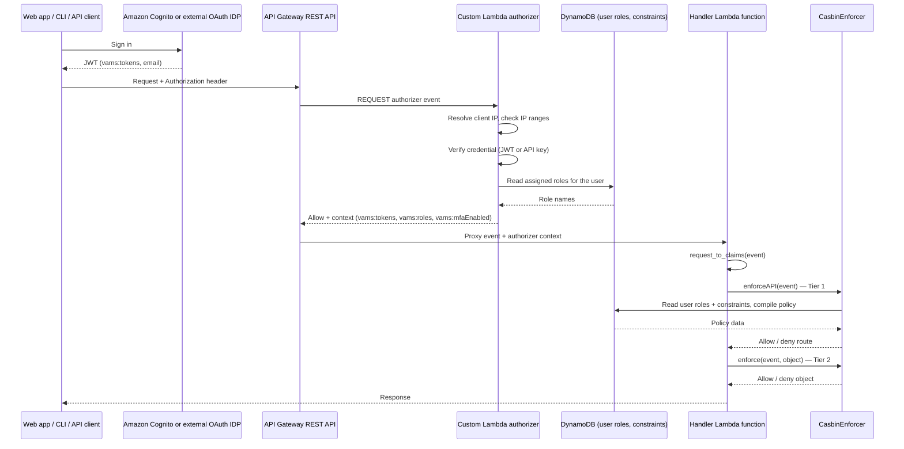

# Security: Developer Reference

This page traces a single VAMS API request from the identity provider through to a data access decision, and describes exactly where claims and roles are produced and consumed at each hop. It is the developer-level companion to the [Security Architecture](../architecture/security.md) page, which describes each security control individually.

## Authentication and Authorization Flow

Every authenticated VAMS API call passes through four stages. The identity provider issues a credential, the API Gateway custom Lambda authorizer verifies it and builds an authorizer context, the handler Lambda function converts that context into a claims structure, and Casbin evaluates two independent authorization tiers.



### Stage 1: Identity provider issues a credential

VAMS accepts three credential types, and the flow differs only in how the credential is verified.

| Credential                | Issued by                                      | Verified with                                                         |
| ------------------------- | ---------------------------------------------- | --------------------------------------------------------------------- |
| Amazon Cognito JWT        | Amazon Cognito user pool                       | `joserfc`, against the user pool JWKS, algorithm pinned to RS256      |
| External OAuth IDP JWT    | The configured external identity provider      | `PyJWT`, against the issuer's JWKS (OpenID Connect discovery, cached) |
| VAMS API key (`vams_...`) | VAMS (`/auth/api-keys`, `/auth/user/api-keys`) | SHA-256 hash compared against the API key table `apiKeyHashIndex` GSI |

For Amazon Cognito, a pre-token-generation Lambda trigger (`pretokengenv1.py` for the GovCloud mode, `pretokengenv2.py` otherwise) adds VAMS claims to the issued token. It populates `vams:tokens` (the user identifier VAMS authorizes against) and `email`, and leaves `vams:roles` and `vams:externalAttributes` empty. Roles are deliberately **not** resolved here — see [Where roles come from](#where-roles-come-from).

External OAuth IDP deployments have no equivalent trigger. VAMS derives the user identifier from the first available standard claim, in this order: `vams:tokens`, `cognito:username`, `username`, `sub`, `upn`, `email`.

### Stage 2: The custom Lambda authorizer builds the context

All API Gateway routes use a single custom REQUEST-type Lambda authorizer (`handlers/auth/apiGatewayAuthorizerRest.py`, with the shared logic in `common/auth/authorizerCore.py`). It runs these steps in order, and returns a deny as soon as one fails:

1. **Resolve the true client IP and check IP ranges.** The IP is resolved in a fronting-aware way (`common/auth/clientIp.py`) and checked against `authProvider.authorizerOptions.allowedIpRanges`. This runs before credential verification so a disallowed IP costs no JWT work.
2. **Bypass authentication for ignored paths.** Paths in `CUSTOM_AUTHORIZER_IGNORED_PATHS` (`/api/amplify-config`, `/api/version`) return an allow with no context. The IP check above still applies.
3. **Verify the credential.** An `Authorization` value beginning with `vams_` (with or without a `Bearer` prefix) takes the API key path; anything else is treated as a JWT and verified according to the configured auth mode.
4. **Resolve the caller's roles** from the user roles table.
5. **Resolve MFA sign-in status** through the customizable `customMFATokenScopeCheckOverride` hook.

The authorizer returns an IAM policy plus a flat string map of context values. The VAMS-specific entries are:

| Context value             | Meaning                                                           |
| ------------------------- | ----------------------------------------------------------------- |
| `vams:tokens`             | JSON array of user identifiers VAMS authorizes against            |
| `vams:roles`              | JSON array of the caller's role names — informational (see below) |
| `vams:externalAttributes` | JSON array reserved for external system attributes                |
| `vams:mfaEnabled`         | `"true"` / `"false"` — whether the caller signed in with MFA      |
| `vams:apiKeyId`           | Present only on the API key path                                  |
| `vams:authMethod`         | `"apiKey"` on the API key path                                    |

:::note[Caching in the authorizer]
The authorizer caches three separate things, each with its own lifetime, so that a per-request authorization does not re-read DynamoDB or refetch signing keys:

| Cached data       | Constant               | Value      | Scope    | Notes                                                                                        |
| ----------------- | ---------------------- | ---------- | -------- | -------------------------------------------------------------------------------------------- |
| User roles        | `USER_ROLES_CACHE_TTL` | 60 seconds | Per user | An empty role list is cached too, so a user with no roles does not re-query on every request |
| API key records   | `API_KEY_CACHE_TTL`    | 15 seconds | Per key  | A not-found key is cached as `None`, preventing repeated lookups from invalid keys           |
| JWKS signing keys | `CACHE_TTL`            | 1 hour     | Per pool | Applies to Amazon Cognito keys, external IDP keys, and resolved OpenID Connect JWKS URIs     |

API Gateway caches the authorizer result itself on top of these, set through `authorizerResultTtlInSeconds` on each security scheme in `buildOpenApiSpec.ts`:

| Security scheme           | Identity source (cache key)           | Constant                      | Value       |
| ------------------------- | ------------------------------------- | ----------------------------- | ----------- |
| `VamsAuthorizer`          | `method.request.header.Authorization` | `AUTH_CACHE_TTL_SECONDS`      | 30 seconds  |
| `VamsAnonymousAuthorizer` | `context.identity.sourceIp`           | `ANON_AUTH_CACHE_TTL_SECONDS` | 900 seconds |

For a REQUEST authorizer the identity sources form the cache key, so authenticated results are cached per token and anonymous results per source IP. The cached entry holds the returned IAM policy **and** the context values, so `vams:roles`, `vams:tokens`, and `vams:mfaEnabled` are cached with the decision. Redeploying the API discards cached policy documents.

Because the two layers compose, the worst-case staleness for a role change on an authenticated route is `USER_ROLES_CACHE_TTL` plus the authorizer result TTL (60 + 30 seconds) for the **logged** role names. The authorization decision is not affected by either cache — Casbin re-reads roles when it compiles policy, bounded by `CASBIN_REFRESH_POLICY_SECONDS`.
:::

:::warning[Identity sources must always be present when caching is on]
With authorization caching enabled, API Gateway returns `401 Unauthorized` **without invoking the authorizer Lambda function** if a declared identity source is missing, null, or empty. This is why the anonymous scheme keys on `context.identity.sourceIp` (always present) rather than the `Authorization` header: an anonymous request to `/api/version` carries no `Authorization` header, and keying on it would produce a hard 401 before the authorizer could run the IP check and allow the ignored path.
:::

### Stage 3: The handler converts context into claims

Every handler calls `request_to_claims(event)` (`handlers/auth/__init__.py`) as its first event access. It normalizes the REST event shape, reads the authorizer context, and returns:

```python
{
    "tokens": ["userId", ...],       # from vams:tokens, or a fallback identity claim
    "roles": ["admin", ...],         # from vams:roles — informational only
    "externalAttributes": [...],     # from vams:externalAttributes
    "mfaEnabled": True,              # from vams:mfaEnabled
}
```

It then calls the customizable `customAuthClaimsCheckOverride` hook. If that hook raises, VAMS fails closed by dropping `roles` rather than passing unfiltered claims through.

Internal Lambda-to-Lambda invocations carry no authorizer context. These pass `{'lambdaCrossCall': {'userName': ...}}` and short-circuit to a claims structure with the supplied user (defaulting to the reserved `SYSTEM_USER`), empty roles, and `mfaEnabled` defaulting to `True`. Because cross-call events bypass JWT verification, IAM permissions on direct Lambda invocation are the security boundary for who can construct one.

### Stage 4: Casbin evaluates two tiers

Both tiers must allow for a request to succeed. `CasbinEnforcer` is constructed from the claims structure but uses only `tokens[0]` as the user identity and `mfaEnabled` as the MFA state.

**Tier 1 — API route authorization** runs once in `lambda_handler`, gating whether this caller may call this route and method at all:

```python
claims_and_roles = request_to_claims(event)

method_allowed_on_api = False
if len(claims_and_roles["tokens"]) > 0:
    if CasbinEnforcer(claims_and_roles).enforceAPI(event):
        method_allowed_on_api = True
if not method_allowed_on_api:
    return authorization_error()
```

The pre-set `False` is load-bearing: an empty token list means no authenticated identity, so authorization cannot be evaluated and the request must deny.

**Tier 2 — data entity authorization** runs per resource, after the object is loaded and annotated with its type:

```python
item['object__type'] = 'asset'
if len(claims_and_roles["tokens"]) == 0:
    return authorization_error()
if not CasbinEnforcer(claims_and_roles).enforce(event, item):
    return authorization_error()
```

List endpoints that append an item only when `enforce()` passes are fail-closed by construction — empty tokens produce an empty result.

### Where roles come from

Roles are resolved in exactly one place at request time — the authorizer — and are consumed in two very different ways. Keeping this distinction clear matters when changing anything in this path.

**The authorizer's `vams:roles` value is informational.** It flows into `claims_and_roles["roles"]` and is used for audit log records (every VAMS audit event records the acting user's roles) and for any handler-side logic that wants the caller's role names. Nothing in the authorization decision reads it.

**Casbin performs all of its own lookups.** When `CasbinEnforcer` builds a user's policy it reads the user roles table and the constraints table directly, generates Casbin `g, user::..., 'role::...'` grouping lines and object rules from that data, and caches the compiled policy per user for `CASBIN_REFRESH_POLICY_SECONDS` (60 seconds). It never consults the claim. This is why a missing or stale `vams:roles` value cannot grant or deny access.

Resolving roles in the authorizer rather than at token issuance has two consequences worth knowing:

-   **Every authentication mechanism gets roles.** A Cognito pre-token-generation trigger only runs for Amazon Cognito, so an external OAuth IDP deployment would otherwise carry no roles at all and its audit records would show an empty role list for every event.
-   **Role changes take effect quickly.** A role assignment or revocation is picked up within `USER_ROLES_CACHE_TTL` (60 seconds) for the authorizer context and within `CASBIN_REFRESH_POLICY_SECONDS` (60 seconds) for the authorization decision, instead of persisting for the lifetime of an already-issued token.

The authorizer assigns `vams:roles` unconditionally, overwriting any `vams:roles` claim carried inside a presented token, so a token minted before a role change cannot reintroduce the old value. If the user roles table is unreachable, the lookup logs the failure and yields an empty list rather than denying the request — consistent with roles not being load-bearing for access, and matching how the MFA hook degrades to `false`.

### MFA-aware roles

A role may set `mfaRequired`. When the caller's `mfaEnabled` is `false`, `CasbinEnforcer` compiles policy from only those of the user's roles that do not require MFA, so MFA-gated permissions are inactive for a non-MFA session. Because MFA state changes the compiled policy, the enforcer cache is keyed on it and is invalidated when it changes.

For Amazon Cognito, the default hook resolves MFA by calling `AdminGetUser` and caches the result per user per sign-in session (keyed on the token's `auth_time`). This requires the authorizer to have a network path to Amazon Cognito — see the MFA warning in [Security Architecture](../architecture/security.md#mfa-aware-roles).

## Authentication Override Hooks

Three customer-customizable hook functions live under `backend/backend/customConfigCommon/`. They exist so an organization can adapt VAMS to its own identity provider — resolving MFA state, filtering claims, or enriching a user profile — without modifying VAMS handler code. Each ships with a working default and a clearly marked block for custom logic, and each is called from a different point in the request lifecycle.

Because these files are edited in place, they are the intended extension point for identity-provider-specific behavior; treat them as configuration you own rather than as VAMS source to be re-synced on upgrade.

:::warning[Read claims through `request_to_claims`, not the raw authorizer context]
The REST API (v1) REQUEST authorizer delivers claims as a **flat map of string values** directly under `requestContext.authorizer`, alongside a `principalId` key. Custom logic that indexes the nested `requestContext.authorizer.jwt.claims` or `requestContext.authorizer.lambda` locations finds neither and, if it falls through to an empty dict, silently reads no claims rather than raising — a quiet behavior change instead of an error.

Two consequences when writing hook logic:

-   Prefer `request_to_claims(event)` where it suffices — it handles every event shape (nested JWT authorizer, nested Lambda authorizer, flat REST map, and internal cross-call) and normalizes the event as a side effect. It returns only the resolved identity, roles, external attributes, and MFA state, so a hook that needs another claim (for example `email`) must read the authorizer context itself.
-   When reading the context directly, handle all four shapes and remember every value is a **string**. JSON-valued claims such as `vams:tokens` and `vams:roles` need `json.loads`, and `vams:mfaEnabled` is the string `"true"` or `"false"`, not a boolean. Guard the lookup (`event.get("requestContext", {}) or {}`) rather than indexing, so a cross-call event or an absent authorizer context does not raise.

The shipped `customAuthProfileLoginWriteOverride` default reads all four shapes and strips the `principalId` key, so its email-from-claims override applies under the REST API. `customAuthLoginProfile.py` is the reference to copy when writing claims extraction into a hook of your own.
:::

| Hook                                  | File                        | Called from                                             | Purpose                                                            |
| ------------------------------------- | --------------------------- | ------------------------------------------------------- | ------------------------------------------------------------------ |
| `customMFATokenScopeCheckOverride`    | `customAuthClaimsCheck.py`  | Custom Lambda authorizer, after credential verification | Decide whether the caller signed in with MFA                       |
| `customAuthClaimsCheckOverride`       | `customAuthClaimsCheck.py`  | Every handler, inside `request_to_claims`               | Inspect or filter the resolved claims structure                    |
| `customAuthProfileLoginWriteOverride` | `customAuthLoginProfile.py` | The `authLoginProfile` handler, at login                | Populate the stored user profile (for example, email) from the IDP |

### MFA check — `customMFATokenScopeCheckOverride`

Called by the authorizer as `customMFATokenScopeCheckOverride(user, authorizerJwtClaims, lambdaRequest)` — the resolved username, the verified JWT claims, and the raw authorizer event (whose headers still carry the presented bearer token, which is what makes an outbound userinfo call possible). It returns a boolean that becomes the `vams:mfaEnabled` authorizer context value. The claims are passed in directly, so the hook does not extract them from the event itself.

The default implementation covers Amazon Cognito: it calls `AdminGetUser` and treats a non-empty `UserMFASettingList` as an MFA sign-in, caching the result per user per sign-in session keyed on the token's `auth_time`. The `else` branch is the slot for external OAuth IDP logic and currently returns `False` — an external IDP deployment that uses `mfaRequired` on any role **must** implement this branch, otherwise MFA-gated roles never activate. The hook is wrapped so that an exception logs and defaults to `False` rather than failing the request.

Resolving MFA here rather than in each handler is what keeps identity-provider access out of the handler Lambda functions entirely.

### Claims check — `customAuthClaimsCheckOverride`

Called by `request_to_claims` after the claims structure is assembled from the authorizer context, receiving that structure and the request event, and returning the structure to use. Use it for handler-time claims restrictions — for example, dropping roles when a claim indicates a restricted session, or mapping an external attribute into `externalAttributes`.

MFA state is already resolved before this hook runs, so read `claims_and_roles["mfaEnabled"]` rather than re-deriving it. VAMS fails closed around this hook: if it raises, `roles` is emptied rather than passing the unfiltered structure through, so a broken hook cannot grant more access than intended.

### Login profile — `customAuthProfileLoginWriteOverride`

Called by the `authLoginProfile` handler when a user's profile is written at login, receiving the profile being stored (`userId`, `email`) and the request event, and returning the profile to persist. `userId` is fixed and must not be changed — it is the lookup key. The handler re-stamps `userId` after the hook returns and falls back to the unmodified profile if the hook returns anything other than a dictionary, so a faulty override cannot corrupt the stored identity.

The default implementation resolves the caller's claims across all four event shapes and overrides the incoming email with the `email` claim when one is present and non-empty. Because this hook needs a claim that `request_to_claims` does not surface, it reads the authorizer context directly — the flat REST map with `principalId` stripped, plus the nested and cross-call forms — which makes it the reference implementation for claims extraction inside a hook.

The file also carries a commented-out example that calls an external IDP's `/idp/userinfo.openid` endpoint with the caller's access token to fetch fields such as email and name, using the `EXTERNAL_OATH_IDP_URL` environment variable — the intended pattern when an external IDP does not put the needed attributes in the token itself.

### Implementation files

| Concern                                            | File                                                                 |
| -------------------------------------------------- | -------------------------------------------------------------------- |
| Shared authorizer logic (verification, roles, MFA) | `backend/backend/common/auth/authorizerCore.py`                      |
| REST authorizer entry point                        | `backend/backend/handlers/auth/apiGatewayAuthorizerRest.py`          |
| Client IP resolution                               | `backend/backend/common/auth/clientIp.py`                            |
| REST/HTTP event normalization                      | `backend/backend/common/auth/apiEvent.py`                            |
| Context → claims conversion                        | `backend/backend/handlers/auth/__init__.py`                          |
| Casbin two-tier enforcement                        | `backend/backend/handlers/authz/__init__.py`                         |
| Cognito pre-token-generation triggers              | `backend/backend/handlers/auth/pretokengenv1.py`, `pretokengenv2.py` |
| Customizable claims and MFA hooks                  | `backend/backend/customConfigCommon/customAuthClaimsCheck.py`        |
| Customizable login profile hook                    | `backend/backend/customConfigCommon/customAuthLoginProfile.py`       |
| Login profile handler                              | `backend/backend/handlers/auth/authLoginProfile.py`                  |
| Casbin policy model and constraint fields          | `backend/backend/common/constants.py`                                |

## Related topics

-   [Security Architecture](../architecture/security.md) — individual security controls, encryption, CSP, WAF, audit logging
-   [Permissions: Developer Reference](./permissions.md) — authoring constraint JSON for common access patterns
-   [Permissions model](../concepts/permissions-model.md) — conceptual overview of roles, constraints, and object types
-   [Audit logging](./audit-logging.md) — the nine audit log groups and the events written to each
