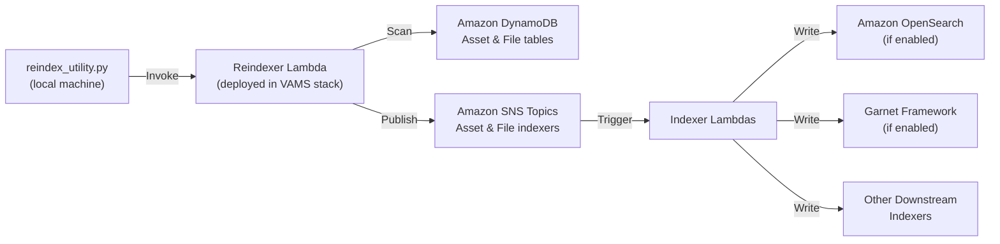

# Reindex Utility

The reindex utility re-indexes Amazon OpenSearch and any attached downstream indexers (such as the Garnet Framework addon) for assets and files. It works by invoking a deployed AWS Lambda function that reads all asset and file records from Amazon DynamoDB and re-publishes them to the configured indexing pipeline.

**Script location:** `infra/deploymentDataMigration/tools/reindex_utility.py`

## How It Works



1. The utility script invokes the deployed reindexer Lambda function via the AWS SDK
2. The Lambda function scans all asset and/or file records from Amazon DynamoDB
3. For each record, it publishes an indexing event to the appropriate Amazon SNS topic
4. The SNS topics trigger the indexer Lambda functions, which write the records to Amazon OpenSearch (and any other configured downstream indexers such as the Garnet Framework addon)

All processing runs in the cloud via the deployed Lambda function. The local script is a thin invocation wrapper — no direct access to Amazon DynamoDB or Amazon OpenSearch is required from the local machine.

## When to Use

-   **After a data migration or version upgrade** -- Migration scripts update Amazon DynamoDB records but do not automatically re-index. Run the reindex utility as a post-migration step to synchronize search indexes.
-   **After enabling Amazon OpenSearch** -- If OpenSearch was disabled during initial deployment and later enabled, existing records need to be indexed.
-   **After enabling the Garnet Framework addon** -- Existing asset and file records need to be published to the new downstream indexer.
-   **After index corruption or deletion** -- If Amazon OpenSearch indexes are accidentally deleted or become corrupted, the reindex utility rebuilds them from the authoritative Amazon DynamoDB source data.
-   **After schema changes** -- If the OpenSearch index mapping is updated (e.g., new fields added), a reindex ensures all existing records include the new fields.

## Prerequisites

-   Python 3.6+
-   `boto3` (`pip install boto3`)
-   AWS credentials with `lambda:InvokeFunction` permission for the reindexer Lambda function
-   The VAMS CDK stack deployed with the reindexer Lambda function

### Finding the Lambda Function Name

The reindexer Lambda function name is available in the CDK stack outputs:

```bash
# Via AWS CLI
aws cloudformation describe-stacks \
    --stack-name <your-vams-stack-name> \
    --query "Stacks[0].Outputs[?OutputKey=='ReindexerFunctionNameOutput'].OutputValue" \
    --output text
```

You can also find the function name in the AWS Lambda console by searching for "reindex" within functions prefixed with your VAMS stack name.

## Usage

### Basic Commands

```bash
# Navigate to the tools directory
cd infra/deploymentDataMigration/tools/

# Reindex both assets and files (synchronous — waits for completion)
python reindex_utility.py --function-name <lambda-function-name> --operation both

# Reindex assets only
python reindex_utility.py --function-name <lambda-function-name> --operation assets

# Reindex files only
python reindex_utility.py --function-name <lambda-function-name> --operation files
```

### Options

| Option            | Description                                                    | Default         |
| :---------------- | :------------------------------------------------------------- | :-------------- |
| `--function-name` | Name of the deployed reindexer Lambda function (required)      | --              |
| `--operation`     | What to reindex: `assets`, `files`, or `both`                  | `both`          |
| `--dry-run`       | Preview what would be reindexed without making changes         | `false`         |
| `--limit`         | Maximum number of items to process (useful for testing)        | No limit        |
| `--clear-indexes` | Delete all documents from OpenSearch indexes before reindexing | `false`         |
| `--async`         | Use asynchronous Lambda invocation (returns immediately)       | `false`         |
| `--profile`       | AWS CLI profile name                                           | Default profile |
| `--region`        | AWS region                                                     | Default region  |
| `--log-level`     | Logging verbosity: `DEBUG`, `INFO`, `WARNING`, `ERROR`         | `INFO`          |

### Examples

**Dry run to preview without making changes:**

```bash
python reindex_utility.py \
    --function-name vams-prod-reindexer \
    --operation both \
    --dry-run
```

**Reindex with a limit for testing:**

```bash
python reindex_utility.py \
    --function-name vams-prod-reindexer \
    --operation assets \
    --limit 100
```

**Clear indexes before reindexing (full rebuild):**

```bash
python reindex_utility.py \
    --function-name vams-prod-reindexer \
    --operation both \
    --clear-indexes
```

:::warning[Clear Indexes]
The `--clear-indexes` flag deletes all documents from the Amazon OpenSearch asset and file indexes before reindexing. During the reindexing process, search results in the VAMS web interface will be incomplete. Only use this flag when you need a clean rebuild.
:::

**Asynchronous invocation for large datasets:**

```bash
python reindex_utility.py \
    --function-name vams-prod-reindexer \
    --operation both \
    --async
```

Asynchronous invocation submits the job and returns immediately. Monitor progress in Amazon CloudWatch Logs for the reindexer Lambda function.

**Use a specific AWS profile and region:**

```bash
python reindex_utility.py \
    --function-name vams-prod-reindexer \
    --operation both \
    --profile my-aws-profile \
    --region us-west-2
```

## Invocation Modes

### Synchronous (Default)

The default mode invokes the Lambda function synchronously and waits for the result. The script displays a summary of the reindexing operation including counts of items processed, succeeded, and failed.

:::note
For large datasets (tens of thousands of records), synchronous invocation may time out on the client side. If this happens, the Lambda function continues processing in the background. The script will display a timeout warning with instructions for monitoring via Amazon CloudWatch Logs.
:::

### Asynchronous

Use the `--async` flag for large datasets. The Lambda function processes in the background and the script returns immediately after confirming submission. Check Amazon CloudWatch Logs for the reindexer Lambda function to monitor progress and verify completion.

## Output

On successful synchronous completion, the utility displays:

```
LAMBDA INVOCATION SUCCESSFUL
Execution Time: 45.23 seconds

Asset Reindexing Results:
  Total: 1500
  Success: 1500
  Failed: 0

File Reindexing Results:
  Buckets Processed: 3
  Objects Scanned: 8500
  Total: 8500
  Success: 8500
  Failed: 0
```

## Post-Migration Usage

After running a VAMS version upgrade migration script (e.g., `v2.4_to_v2.5_migration.py`), run the reindex utility to ensure search indexes reflect the migrated data:

```bash
# 1. Run the migration script first
cd infra/deploymentDataMigration/v2.4_to_v2.5/upgrade/
python v2.4_to_v2.5_migration.py --config v2.4_to_v2.5_migration_config.json

# 2. Then reindex to synchronize OpenSearch
cd ../../tools/
python reindex_utility.py \
    --function-name <lambda-function-name> \
    --operation both
```

## Troubleshooting

| Issue                       | Cause                                       | Resolution                                                                                                                                                                    |
| :-------------------------- | :------------------------------------------ | :---------------------------------------------------------------------------------------------------------------------------------------------------------------------------- |
| `ResourceNotFoundException` | Lambda function not found                   | Verify the function name matches the CDK stack output. Check that the VAMS stack is deployed in the target region.                                                            |
| `AccessDeniedException`     | Insufficient IAM permissions                | Ensure your AWS credentials have `lambda:InvokeFunction` permission for the reindexer function.                                                                               |
| Client-side timeout         | Large dataset exceeds synchronous wait time | Use `--async` flag and monitor Amazon CloudWatch Logs. The Lambda function continues processing after the client disconnects.                                                 |
| Failed items in results     | Individual record indexing errors           | Check Amazon CloudWatch Logs for the reindexer Lambda function for detailed error messages per record. Common causes include malformed records or OpenSearch capacity limits. |

## Related Resources

-   [Utilities Overview](overview.md)
-   [Architecture -- Search and Indexing](../../architecture/details.md)
-   [Deployment -- Update the Solution](../../deployment/update-the-solution.md)
