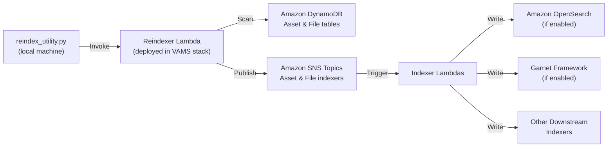

# Reindex Utility

The reindex utility re-indexes Amazon OpenSearch and any attached downstream indexers (such as the Garnet Framework addon) for assets and files. It reads all asset and file records from Amazon DynamoDB and re-publishes them to the configured indexing pipeline.

**Script location:** `infra/deploymentDataMigration/tools/reindex_utility.py`

The utility offers two run modes, selected with `--mode`:

-   **`lambda` (default)** — Invokes the deployed reindexer AWS Lambda function. All reindexing runs in the cloud and no direct AWS resource access is required locally. Recommended for typical datasets. Bound by the **15-minute Lambda maximum execution time**.
-   **`direct`** — Runs the backend reindexer handler locally in the Python process, with **no execution-time limit**. Use for very large asset repositories where the Lambda would exceed 15 minutes and leave records unindexed.

## How It Works


```mermaid
flowchart LR
    Script["reindex_utility.py<br/>(local machine)"] -->|Invoke| Lambda["Reindexer Lambda<br/>(deployed in VAMS stack)"]
    Lambda -->|Scan| DDB["Amazon DynamoDB<br/>Asset & File tables"]
    Lambda -->|Publish| SNS["Amazon SNS Topics<br/>Asset & File indexers"]
    SNS -->|Trigger| Indexer["Indexer Lambdas"]
    Indexer -->|Write| OS["Amazon OpenSearch<br/>(if enabled)"]
    Indexer -->|Write| Garnet["Garnet Framework<br/>(if enabled)"]
    Indexer -->|Write| Other["Other Downstream<br/>Indexers"]
```

1. The utility script invokes the deployed reindexer Lambda function via the AWS SDK
2. The Lambda function scans all asset and/or file records from Amazon DynamoDB
3. For each record, it publishes an indexing event to the appropriate Amazon SNS topic
4. The SNS topics trigger the indexer Lambda functions, which write the records to Amazon OpenSearch (and any other configured downstream indexers such as the Garnet Framework addon)

In `lambda` mode (default), all processing runs in the cloud via the deployed Lambda function and the local script is a thin invocation wrapper — no direct access to Amazon DynamoDB or Amazon OpenSearch is required from the local machine. In `direct` mode, the same handler code runs locally in the script's Python process (still calling AWS with your local credentials) so it is not subject to the Lambda execution-time limit. See [Run Modes](#run-modes).

## When to Use

Run a reindex in these scenarios:

-   **After a data migration or version upgrade** -- Migration scripts update Amazon DynamoDB records but do not automatically re-index. Run the reindex utility as a post-migration step to synchronize search indexes.
-   **After enabling Amazon OpenSearch** -- If OpenSearch was disabled during initial deployment and later enabled, existing records need to be indexed.
-   **After enabling the Garnet Framework addon** -- Existing asset and file records need to be published to the new downstream indexer.
-   **After index corruption or deletion** -- If Amazon OpenSearch indexes are accidentally deleted or become corrupted, the reindex utility rebuilds them from the authoritative Amazon DynamoDB source data.
-   **After schema changes** -- If the OpenSearch index mapping is updated (e.g., new fields added), a reindex ensures all existing records include the new fields.

### Choosing a run mode by dataset size

-   For most deployments, use **`lambda` mode** (the default).
-   For deployments with **more than roughly 100,000 asset or file records**, monitor the reindexer Lambda's Amazon CloudWatch Logs during the run and watch for a timeout — a Lambda-mode reindex can approach or exceed the 15-minute Lambda limit and stop before completing.
-   For **very large repositories** (millions of records), or whenever a Lambda-mode run times out before finishing, use **`direct` mode**, which has no execution-time limit.

## Prerequisites

-   Python 3.6+
-   `boto3` (`pip install boto3`)
-   AWS credentials with `lambda:InvokeFunction` permission for the reindexer Lambda function
-   The VAMS CDK stack deployed with the reindexer Lambda function

### Finding the Lambda Function Name

The reindexer Lambda function name is available in the CDK stack outputs:

```bash
# Via AWS CLI
aws cloudformation describe-stacks \
    --stack-name <your-vams-stack-name> \
    --query "Stacks[0].Outputs[?OutputKey=='ReindexerFunctionNameOutput'].OutputValue" \
    --output text
```

You can also find the function name in the AWS Lambda console by searching for "reindex" within functions prefixed with your VAMS stack name.

## Run Modes

### Lambda mode (default)

Invokes the deployed reindexer Lambda. This is the recommended mode and requires only `boto3` and `lambda:InvokeFunction` permission. It is bound by the **15-minute Lambda maximum execution time**.

### Direct mode

Direct mode (`--mode direct`) imports the backend reindexer handler and runs it locally with **no execution-time limit**, which is intended for very large repositories where the Lambda would otherwise time out. The handler still calls AWS (Amazon DynamoDB, AWS Systems Manager, and Amazon OpenSearch) using your local AWS credentials, so direct mode needs the backend source, the handler's configuration inputs, and the handler's Python libraries.

**Additional prerequisites for direct mode:**

-   The VAMS backend source available locally — the `backend/backend` directory containing the `handlers` and `common` packages. The script defaults `--backend-path` to this directory resolved relative to the script, so it is only needed to override a non-standard checkout layout.
-   The backend reindexer handler's Python libraries installed locally: `boto3`, `botocore`, `urllib3`, `aws-lambda-powertools`, and `opensearch-py` (the last only when using `--clear-indexes`):

    ```bash
    pip install boto3 botocore urllib3 aws-lambda-powertools opensearch-py
    ```

    These libraries are only needed for direct mode. The script imports the backend handler lazily — only when `--mode direct` runs — and `opensearch-py` only when `--clear-indexes` is also used. A lambda-mode run loads none of them and requires only `boto3`.

-   AWS credentials with the same permissions the reindexer Lambda role has: read on the asset, S3-asset-bucket, and asset-file-metadata Amazon DynamoDB tables; write on the asset-file-metadata table; `ssm:GetParameter` on the index-name and endpoint parameters; and Amazon OpenSearch access (only for `--clear-indexes`).

**Direct-mode inputs** (the utility injects the table-name values as environment variables before importing the handler; the backend's resource-name resolver honors these environment-variable overrides ahead of its AWS Systems Manager Parameter Store lookup, so direct mode works without the deployment's resource-name parameters). Find the table-name values under the deployment's `/<name>-<baseStackName>/resourceNames/dynamoTables/` SSM parameters or in the Amazon DynamoDB console. All are required **except** `--backend-path`, `--opensearch-type`, and `--region`, which default as noted:

| Argument                                   | Lambda environment variable              | Description                                                                                                     |
| :----------------------------------------- | :--------------------------------------- | :-------------------------------------------------------------------------------------------------------------- |
| `--backend-path`                           | (added to `sys.path`)                    | Path to the `backend/backend` source directory. Defaults to the backend source resolved relative to the script. |
| `--asset-storage-table-name`               | `ASSET_STORAGE_TABLE_NAME`               | DynamoDB asset storage table                                                                                    |
| `--s3-asset-buckets-storage-table-name`    | `S3_ASSET_BUCKETS_STORAGE_TABLE_NAME`    | DynamoDB S3 asset buckets storage table                                                                         |
| `--asset-file-metadata-storage-table-name` | `ASSET_FILE_METADATA_STORAGE_TABLE_NAME` | DynamoDB asset/file metadata table (touch/delete target)                                                        |
| `--opensearch-asset-index-ssm-param`       | `OPENSEARCH_ASSET_INDEX_SSM_PARAM`       | SSM parameter holding the asset index name                                                                      |
| `--opensearch-file-index-ssm-param`        | `OPENSEARCH_FILE_INDEX_SSM_PARAM`        | SSM parameter holding the file index name                                                                       |
| `--opensearch-endpoint-ssm-param`          | `OPENSEARCH_ENDPOINT_SSM_PARAM`          | SSM parameter holding the OpenSearch endpoint                                                                   |
| `--opensearch-type`                        | `OPENSEARCH_TYPE`                        | `serverless` or `provisioned` (default `provisioned`)                                                           |
| `--region`                                 | `AWS_REGION`                             | AWS region for the local AWS SDK calls                                                                          |

**Example** (run from `infra/deploymentDataMigration/tools/`; `--backend-path` omitted to use the default location):

```bash
python reindex_utility.py --mode direct --operation both \
    --asset-storage-table-name vams-prod-assetStorage \
    --s3-asset-buckets-storage-table-name vams-prod-s3AssetBuckets \
    --asset-file-metadata-storage-table-name vams-prod-assetFileMetadata \
    --opensearch-asset-index-ssm-param /vams-prod/aos/assetIndexName \
    --opensearch-file-index-ssm-param /vams-prod/aos/fileIndexName \
    --opensearch-endpoint-ssm-param /vams-prod/aos/endPoint \
    --opensearch-type provisioned \
    --region us-east-1
```

:::warning[Clearing indexes in direct mode]
The bulk reindex (touch-and-delete) only uses Amazon DynamoDB and AWS Systems Manager and works from a local machine outside the VPC. `--clear-indexes` is different — it connects to the OpenSearch endpoint directly:

-   **Provisioned** domains are always inside the VPC, so their endpoint is not reachable from a local machine. Direct mode **rejects** `--clear-indexes` when `--opensearch-type` is `provisioned`.
-   **Serverless** collections are VPC-restricted when the collection is private (`openSearch.useServerless.allowPublic = false`), which routes access through a VPC endpoint. Direct mode allows `--clear-indexes` for serverless but warns, because it will fail against a VPC-restricted (private) collection.

To clear and rebuild a provisioned (or VPC-restricted serverless) domain, clear the indexes in **lambda mode** (which runs inside the VPC) with a small `--limit` so it does only the clear, then run the bulk reindex in **direct mode** without `--clear-indexes`:

```bash
# 1. Clear via the deployed Lambda (in the VPC), doing minimal reindex work
python reindex_utility.py --function-name <reindexer-fn> --operation both --clear-indexes --limit 1

# 2. Bulk reindex locally with no time limit (no --clear-indexes)
python reindex_utility.py --mode direct --operation both \
    --asset-storage-table-name ... --opensearch-type provisioned ...
```

:::

## Usage

### Basic Commands

```bash
# Navigate to the tools directory
cd infra/deploymentDataMigration/tools/

# Reindex both assets and files (synchronous — waits for completion)
python reindex_utility.py --function-name <lambda-function-name> --operation both

# Reindex assets only
python reindex_utility.py --function-name <lambda-function-name> --operation assets

# Reindex files only
python reindex_utility.py --function-name <lambda-function-name> --operation files
```

### Options

| Option            | Description                                                                                                                                                                                                                        | Default         |
| :---------------- | :--------------------------------------------------------------------------------------------------------------------------------------------------------------------------------------------------------------------------------- | :-------------- |
| `--mode`          | Run mode: `lambda` (invoke the deployed Lambda) or `direct` (run locally, no limit)                                                                                                                                                | `lambda`        |
| `--function-name` | Name of the deployed reindexer Lambda function (required for `--mode lambda`)                                                                                                                                                      | --              |
| `--operation`     | What to reindex: `assets`, `files`, or `both`                                                                                                                                                                                      | `both`          |
| `--dry-run`       | Preview what would be reindexed without making changes                                                                                                                                                                             | `false`         |
| `--limit`         | Maximum number of items to process (useful for testing)                                                                                                                                                                            | No limit        |
| `--clear-indexes` | Delete all documents from OpenSearch indexes before reindexing. Rejected in `direct` mode for `--opensearch-type provisioned` (endpoint is in the VPC); warns for serverless. See [Clearing indexes in direct mode](#direct-mode). | `false`         |
| `--async`         | Use asynchronous Lambda invocation (returns immediately); `lambda` mode only                                                                                                                                                       | `false`         |
| `--profile`       | AWS CLI profile name                                                                                                                                                                                                               | Default profile |
| `--region`        | AWS region (in `direct` mode also used as the handler `AWS_REGION`)                                                                                                                                                                | Default region  |
| `--log-level`     | Logging verbosity: `DEBUG`, `INFO`, `WARNING`, `ERROR`                                                                                                                                                                             | `INFO`          |

Direct mode adds `--backend-path` and the table-name / SSM-parameter / `--opensearch-type` inputs described under [Run Modes](#direct-mode).

### Examples

**Dry run to preview without making changes:**

```bash
python reindex_utility.py \
    --function-name vams-prod-reindexer \
    --operation both \
    --dry-run
```

**Reindex with a limit for testing:**

```bash
python reindex_utility.py \
    --function-name vams-prod-reindexer \
    --operation assets \
    --limit 100
```

**Clear indexes before reindexing (full rebuild):**

```bash
python reindex_utility.py \
    --function-name vams-prod-reindexer \
    --operation both \
    --clear-indexes
```

:::warning[Clear Indexes]
The `--clear-indexes` flag deletes all documents from the Amazon OpenSearch asset and file indexes before reindexing. During the reindexing process, search results in the VAMS web interface will be incomplete. Only use this flag when you need a clean rebuild.
:::

**Asynchronous invocation for large datasets:**

```bash
python reindex_utility.py \
    --function-name vams-prod-reindexer \
    --operation both \
    --async
```

Asynchronous invocation submits the job and returns immediately. Monitor progress in Amazon CloudWatch Logs for the reindexer Lambda function.

**Use a specific AWS profile and region:**

```bash
python reindex_utility.py \
    --function-name vams-prod-reindexer \
    --operation both \
    --profile my-aws-profile \
    --region us-west-2
```

## Lambda Invocation Types

These apply to `lambda` mode. (In `direct` mode the handler runs locally to completion with no Lambda invocation and no execution-time limit — see [Run Modes](#direct-mode).)

### Synchronous (Default)

The default lambda mode invokes the Lambda function synchronously and waits for the result. The script displays a summary of the reindexing operation including counts of items processed, succeeded, and failed.

:::warning[Monitor large reindex jobs for Lambda timeouts]
The reindexer Lambda is bound by the 15-minute Lambda maximum execution time. For deployments with **more than roughly 100,000 asset or file records**, monitor the reindexer Lambda's Amazon CloudWatch Logs during the run and watch for a timeout — a large reindex can approach or exceed the limit and stop before every record is reindexed. A client-side synchronous timeout returns control to the script while the Lambda keeps running in the background, but the Lambda itself will still be terminated at 15 minutes. If the dataset is large enough that the Lambda cannot finish within 15 minutes, use [direct mode](#direct-mode), which has no execution-time limit.
:::

### Asynchronous

Use the `--async` flag for large datasets. The Lambda function processes in the background and the script returns immediately after confirming submission. Check Amazon CloudWatch Logs for the reindexer Lambda function to monitor progress and verify completion. The 15-minute Lambda limit still applies to asynchronous runs; use [direct mode](#direct-mode) when a single run needs longer.

## Output

On successful synchronous completion, the utility displays:

```
LAMBDA INVOCATION SUCCESSFUL
Execution Time: 45.23 seconds

Asset Reindexing Results:
  Total: 1500
  Success: 1500
  Failed: 0

File Reindexing Results:
  Buckets Processed: 3
  Objects Scanned: 8500
  Total: 8500
  Success: 8500
  Failed: 0
```

## Post-Migration Usage

After running a VAMS version upgrade migration script (e.g., `v2.4_to_v2.5_migration.py`), run the reindex utility to ensure search indexes reflect the migrated data:

```bash
# 1. Run the migration script first
cd infra/deploymentDataMigration/v2.4_to_v2.5/upgrade/
python v2.4_to_v2.5_migration.py --config v2.4_to_v2.5_migration_config.json

# 2. Then reindex to synchronize OpenSearch
cd ../../tools/
python reindex_utility.py \
    --function-name <lambda-function-name> \
    --operation both
```

## Troubleshooting

| Issue                                              | Cause                                                                                        | Resolution                                                                                                                                                                                                                            |
| :------------------------------------------------- | :------------------------------------------------------------------------------------------- | :------------------------------------------------------------------------------------------------------------------------------------------------------------------------------------------------------------------------------------ |
| `ResourceNotFoundException`                        | Lambda function not found                                                                    | Verify the function name matches the CDK stack output. Check that the VAMS stack is deployed in the target region.                                                                                                                    |
| `AccessDeniedException`                            | Insufficient IAM permissions                                                                 | Ensure your AWS credentials have `lambda:InvokeFunction` permission for the reindexer function.                                                                                                                                       |
| Client-side timeout                                | Large dataset exceeds synchronous wait time                                                  | Use `--async` flag and monitor Amazon CloudWatch Logs. The Lambda function continues processing after the client disconnects.                                                                                                         |
| Lambda 15-minute timeout                           | Dataset too large to reindex within the Lambda limit (watch for this above ~100,000 records) | Monitor the reindexer Lambda's CloudWatch Logs for a timeout. If the run cannot finish within 15 minutes, re-run with `--mode direct`, which runs locally with no execution-time limit.                                               |
| `ModuleNotFoundError` / import error (direct mode) | Backend source not found or direct-mode libraries missing                                    | Verify `--backend-path` points at the `backend/backend` directory and install the direct-mode libraries (`pip install boto3 botocore urllib3 opensearch-py`).                                                                         |
| Failed items in results                            | Individual record indexing errors                                                            | Check Amazon CloudWatch Logs for the reindexer Lambda function (lambda mode) or the local console output (direct mode) for detailed error messages per record. Common causes include malformed records or OpenSearch capacity limits. |

## Related Resources

-   [Utilities Overview](overview.md)
-   [Architecture -- Search and Indexing](../../architecture/details.md)
-   [Deployment -- Update the Solution](../../deployment/update-the-solution.md)
