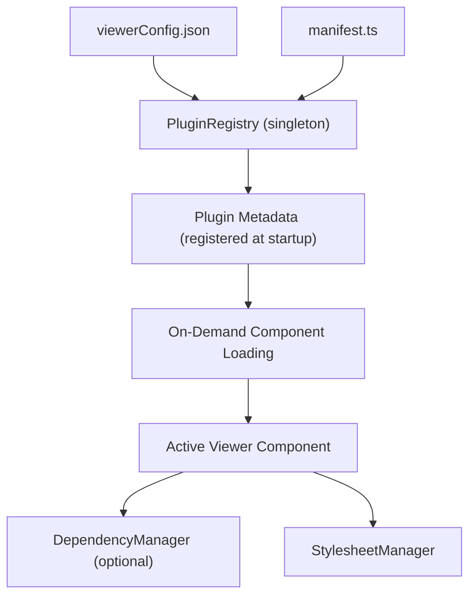

# Viewer Plugin Development

This guide covers the VAMS Visualizer Plugin System, a modular architecture for file viewers that supports 17 viewer plugins for 3D models, point clouds, media, documents, and data formats.

## Architecture Overview

The plugin system uses a configuration-driven approach with lazy loading. No core code changes are needed to add new viewers.



### Core Components

| Component | File | Purpose |
|-----------|------|---------|
| PluginRegistry | `core/PluginRegistry.ts` | Singleton that manages all viewer plugins |
| viewerConfig.json | `config/viewerConfig.json` | JSON configuration for all plugins |
| manifest.ts | `viewers/manifest.ts` | Vite static analysis paths for dynamic imports |
| StylesheetManager | `core/StylesheetManager.ts` | Per-plugin CSS lifecycle management |
| DynamicViewer | `components/DynamicViewer.tsx` | Main viewer component for rendering |
| ViewerSelector | `components/ViewerSelector.tsx` | UI for choosing between compatible viewers |

### How It Works

1. **Initialization** -- `PluginRegistry.initialize()` reads `viewerConfig.json` and registers metadata for all enabled plugins. No components are loaded at this stage.
2. **Extension Matching** -- `getCompatibleViewers(extensions, isMultiFile)` returns metadata for all plugins that support the given file extensions.
3. **On-Demand Loading** -- `loadPlugin(pluginId)` dynamically imports the React component and optional dependency manager when a viewer is selected.
4. **Cleanup** -- `unloadPlugin(pluginId)` removes the component, cleans up dependencies, and removes plugin stylesheets.

## Current Viewers

VAMS ships with 17 viewer plugins across five categories.

| ID | Name | Category | Extensions | Status |
|----|------|----------|------------|--------|
| `online3d-viewer` | Online 3D Viewer | 3d | .3dm, .amf, .bim, .off, .wrl | Enabled |
| `potree-viewer` | Potree Viewer | 3d | .e57, .las, .laz, .ply | Enabled |
| `threejs-viewer` | Three.js Viewer | 3d | .gltf, .glb, .obj, .fbx, .stl, .ply, .dae, .3ds, .3mf, .stp, .step, .iges, .brep | Enabled |
| `gaussian-splat-viewer-babylonjs` | BabylonJS Gaussian Splat | 3d | .ply, .spz | Enabled |
| `gaussian-splat-viewer-playcanvas` | PlayCanvas Gaussian Splat | 3d | .ply, .sog | Enabled |
| `needletools-usd-viewer` | Needle USD Viewer | 3d | .usd, .usda, .usdc, .usdz | Enabled |
| `cesium-viewer` | Cesium 3D Tileset | 3d | .json | Enabled (requires ALLOWUNSAFEEVAL) |
| `vntana-viewer` | VNTANA 3D Viewer | 3d | .glb | Disabled (licensed) |
| `veerum-viewer` | VEERUM 3D Viewer | 3d | .e57, .las, .laz, .ply, .json | Disabled (licensed) |
| `image-viewer` | Image Viewer | media | .png, .jpg, .jpeg, .svg, .gif | Enabled |
| `video-viewer` | Video Player | media | .mp4, .webm, .mov, .avi, .mkv, .flv, .wmv, .m4v | Enabled |
| `audio-viewer` | Audio Player | media | .mp3, .wav, .ogg, .aac, .flac, .m4a | Enabled |
| `pdf-viewer` | PDF Viewer | document | .pdf | Enabled |
| `html-viewer` | HTML Viewer | document | .html | Enabled |
| `text-viewer` | Text Viewer | document | .txt, .json, .xml, .yaml, .md, .py, .js, .ts, .sql, and more | Enabled |
| `columnar-viewer` | Columnar Data Viewer | data | .rds, .fcs, .csv | Enabled |
| `preview-viewer` | Preview Viewer | preview | * (wildcard) | Enabled |

:::info[Priority System]
When multiple viewers support the same file extension, the viewer with the lowest `priority` number is preferred. For example, `.ply` files match both BabylonJS Gaussian Splat (priority 1) and PlayCanvas Gaussian Splat (priority 2).
:::


## Creating a New Viewer Plugin

Adding a new viewer requires three to five steps, with no changes to core system code.

### Step 1: Create the Viewer Component

Create a directory and component file under `src/visualizerPlugin/viewers/`:

```
viewers/MyViewerPlugin/
  MyViewerComponent.tsx     # React component (required)
  dependencies.ts           # Dependency loader (optional)
  MyViewer.module.css       # Scoped styles (optional)
```

Implement the `ViewerPluginProps` interface:

```tsx
import React, { useEffect, useRef, useState } from "react";
import { ViewerPluginProps } from "../../core/types";
import { downloadAsset } from "../../../services/APIService";

const MyViewerComponent: React.FC<ViewerPluginProps> = ({
    assetId,
    databaseId,
    assetKey,
    multiFileKeys,
    versionId,
    viewerMode,
    onViewerModeChange,
    onDeletePreview,
    isPreviewFile,
    viewerConfig,
}) => {
    const containerRef = useRef<HTMLDivElement>(null);
    const [loading, setLoading] = useState(true);
    const [error, setError] = useState<string | null>(null);

    useEffect(() => {
        const loadFile = async () => {
            if (!assetKey) return;
            try {
                setLoading(true);
                const response = await downloadAsset({
                    assetId, databaseId,
                    key: assetKey,
                    versionId: versionId || "",
                    downloadType: "assetFile",
                });
                if (response !== false && Array.isArray(response) && response[0] !== false) {
                    // Use response[1] as the presigned URL
                    initializeViewer(containerRef.current, response[1]);
                }
            } catch (err: any) {
                setError(err?.message || "Failed to load file");
            } finally {
                setLoading(false);
            }
        };
        loadFile();

        return () => {
            // Cleanup viewer resources on unmount
        };
    }, [assetId, assetKey, databaseId, versionId]);

    if (loading) return <div>Loading...</div>;
    if (error) return <div>Error: {error}</div>;

    return <div ref={containerRef} style={{ width: "100%", height: "100%" }} />;
};

export default MyViewerComponent;
```

### Step 2: Add to the Manifest

Update `src/visualizerPlugin/viewers/manifest.ts` with the component path:

```typescript
export const VIEWER_COMPONENTS = {
    // ... existing entries
    "./viewers/MyViewerPlugin/MyViewerComponent":
        "MyViewerPlugin/MyViewerComponent",
} as const;
```

If your viewer has a dependency manager, also add it:

```typescript
export const DEPENDENCY_MANAGERS = {
    // ... existing entries
    "./viewers/MyViewerPlugin/dependencies":
        "MyViewerPlugin/dependencies",
} as const;
```

### Step 3: Add Configuration

Add an entry to `src/visualizerPlugin/config/viewerConfig.json`:

```json
{
    "id": "my-viewer",
    "name": "My Custom Viewer",
    "description": "Description of what this viewer does",
    "componentPath": "./viewers/MyViewerPlugin/MyViewerComponent",
    "supportedExtensions": [".xyz", ".custom"],
    "supportsMultiFile": false,
    "canFullscreen": true,
    "priority": 1,
    "dependencies": [],
    "loadStrategy": "lazy",
    "category": "3d",
    "enabled": true
}
```

### Step 4 (Optional): Create a Dependency Manager

If your viewer requires external libraries, create a dependency manager:

```typescript
// viewers/MyViewerPlugin/dependencies.ts
import { StylesheetManager } from "../../core/StylesheetManager";

export class MyDependencyManager {
    private static loaded = false;
    private static readonly PLUGIN_ID = "my-viewer";

    static async loadDependencies(): Promise<void> {
        if (this.loaded) return;

        // Load stylesheets
        await StylesheetManager.loadStylesheet(
            this.PLUGIN_ID, "/path/to/styles.css"
        );

        // Load external libraries
        const MyLib = await import("my-library");
        (window as any).MyLib = MyLib;

        this.loaded = true;
    }

    static cleanup(): void {
        StylesheetManager.removePluginStylesheets(this.PLUGIN_ID);
        this.loaded = false;
    }
}
```

When using a dependency manager, add the configuration fields to `viewerConfig.json`:

```json
{
    "dependencyManager": "./viewers/MyViewerPlugin/dependencies",
    "dependencyManagerClass": "MyDependencyManager",
    "dependencyManagerMethod": "loadDependencies",
    "dependencyCleanupMethod": "cleanup"
}
```

### Step 5 (Optional): Custom Install Script

If your viewer requires build-time dependency installation beyond standard npm packages, create a custom install script:

1. Create a directory: `web/customInstalls/myviewer/`
2. Add an install script (typically `install.js` or `install.sh`)
3. Add the script to the `postinstall` chain in `web/package.json`

:::tip[Existing Install Scripts]
Review existing custom install scripts in `web/customInstalls/` for patterns. Viewers like Three.js, CesiumJS, and Potree all have custom install directories.
:::


## Plugin Configuration Fields

| Field | Type | Required | Description |
|-------|------|----------|-------------|
| `id` | string | Yes | Unique plugin identifier |
| `name` | string | Yes | Display name in the viewer selector UI |
| `description` | string | Yes | Description shown to users |
| `componentPath` | string | Yes | Path for manifest lookup (must match manifest.ts key) |
| `supportedExtensions` | string[] | Yes | File extensions this viewer handles (e.g., `[".obj", ".fbx"]`) |
| `supportsMultiFile` | boolean | Yes | Whether the viewer can handle multiple files simultaneously |
| `canFullscreen` | boolean | Yes | Whether the viewer supports fullscreen mode |
| `priority` | number | Yes | Selection priority (lower = preferred when multiple viewers match) |
| `dependencies` | string[] | Yes | Required library names (informational) |
| `loadStrategy` | string | Yes | `"lazy"` (load on demand) or `"eager"` (load at startup) |
| `category` | string | Yes | Viewer category: `3d`, `media`, `document`, `data`, or `preview` |
| `enabled` | boolean | Yes | Whether the plugin is active |
| `dependencyManager` | string | No | Path to the dependency manager module |
| `dependencyManagerClass` | string | No | Class name exported by the dependency module |
| `dependencyManagerMethod` | string | No | Static method to call for loading dependencies |
| `dependencyCleanupMethod` | string | No | Static method to call for cleanup |
| `featuresEnabledRestriction` | string[] | No | Required feature flags (all must be enabled) |
| `isPreviewViewer` | boolean | No | `true` for the preview-only fallback viewer |
| `requiresPreprocessing` | boolean | No | `true` if the viewer needs a preprocessing pipeline |
| `customParameters` | object | No | Viewer-specific configuration passed to the component |

## Dependency Chain Loading

The PluginRegistry loads dependencies using configuration-driven method calls:

```typescript
// 1. Registry reads config
const { dependencyManagerClass, dependencyManagerMethod } = plugin.config;

// 2. Imports the dependency module dynamically
const depModule = await import("../viewers/MyViewerPlugin/dependencies");

// 3. Calls the specified class method
const depClass = depModule[dependencyManagerClass];
await depClass[dependencyManagerMethod]();

// 4. On cleanup, calls the cleanup method
await depClass[dependencyCleanupMethod]();
```

This pattern means the PluginRegistry contains zero plugin-specific code. All behavior is driven by `viewerConfig.json`.

## StylesheetManager

The `StylesheetManager` manages CSS lifecycle for viewer plugins, preventing style conflicts and memory leaks.

```typescript
import { StylesheetManager } from "../../core/StylesheetManager";

// Load a stylesheet for a plugin
await StylesheetManager.loadStylesheet(pluginId, href);

// Load multiple stylesheets
await StylesheetManager.loadStylesheets(pluginId, [href1, href2]);

// Remove all stylesheets for a plugin
StylesheetManager.removePluginStylesheets(pluginId);

// Get statistics about loaded stylesheets
const stats = StylesheetManager.getStats();

// Complete cleanup of all managed stylesheets
StylesheetManager.cleanup();
```

Stylesheets are automatically removed when `unloadPlugin()` is called, preventing CSS accumulation over time.

## Feature Flag Restrictions

Viewer plugins can be restricted based on deployment feature flags using the `featuresEnabledRestriction` configuration field.

### How It Works

During plugin registration, the PluginRegistry checks each plugin's `featuresEnabledRestriction` against the application's enabled features (loaded from `/api/secure-config`). Plugins with unmet feature requirements are silently excluded.

### Example: CesiumJS Viewer

The CesiumJS viewer requires the `ALLOWUNSAFEEVAL` feature flag because CesiumJS uses dynamic code execution for WebGL shader compilation:

```json
{
    "id": "cesium-viewer",
    "featuresEnabledRestriction": ["ALLOWUNSAFEEVAL"],
    "customParameters": {
        "cesiumIonToken": ""
    }
}
```

To enable this viewer, set `app.webUi.allowUnsafeEvalFeatures` to `true` in the CDK `config.json`.

### Available Feature Flags

| Flag | Effect on Viewers |
|------|------------------|
| `ALLOWUNSAFEEVAL` | Enables CesiumJS and Needle USD viewers (require `unsafe-eval` CSP directive) |
| `LOCATIONSERVICES` | Can be used to gate geospatial viewers |

### Multiple Requirements

When multiple features are specified, all must be enabled:

```json
{
    "featuresEnabledRestriction": ["ALLOWUNSAFEEVAL", "LOCATIONSERVICES"]
}
```

## ViewerPluginProps Interface

All viewer components receive these props:

```typescript
interface ViewerPluginProps {
    assetId: string;              // Asset identifier
    databaseId: string;           // Database identifier
    assetKey?: string;            // Single file S3 key
    multiFileKeys?: string[];     // Multiple file S3 keys
    versionId?: string;           // File version
    viewerMode: string;           // Display mode ("wide", "fullscreen")
    onViewerModeChange: (mode: string) => void;
    onDeletePreview?: () => void; // Callback to delete preview
    isPreviewFile?: boolean;      // Whether this is a preview file
    viewerConfig?: any;           // Plugin-specific customParameters
}
```

### Custom Parameters

Viewers can access custom parameters from their configuration:

```typescript
const MyViewer: React.FC<ViewerPluginProps> = ({ viewerConfig }) => {
    const apiKey = viewerConfig?.cesiumIonToken;
    const enableXR = viewerConfig?.enableXR ?? true;
    // Use parameters to configure the viewer
};
```

## DynamicViewer and ViewerErrorBoundary

The `DynamicViewer` component handles the full lifecycle of displaying a viewer:

```typescript
import { DynamicViewer } from "./visualizerPlugin";

<DynamicViewer
    files={files}
    assetId="asset-123"
    databaseId="db-456"
    viewerMode="wide"
    onViewerModeChange={setViewerMode}
/>
```

`DynamicViewer` automatically:

- Determines compatible viewers based on file extensions
- Shows a `ViewerSelector` if multiple viewers are available
- Loads the selected viewer's component on demand
- Wraps the viewer in a `ViewerErrorBoundary` for graceful error handling
- Cleans up resources when switching viewers or unmounting

## Troubleshooting

### Plugin Not Appearing

1. Check that `enabled` is `true` in `viewerConfig.json`
2. Verify the component path exists in `manifest.ts`
3. Check the browser console for feature restriction messages
4. Confirm required feature flags are enabled in the deployment configuration

### Component Not Found Error

1. Ensure the `componentPath` in `viewerConfig.json` matches a key in `manifest.ts`
2. Verify the component file has a `export default` statement
3. Check for typos in the manifest constants

### Dependency Loading Issues

1. Verify the dependency manager path exists in `DEPENDENCY_MANAGERS` in `manifest.ts`
2. Confirm `dependencyManagerClass` and `dependencyManagerMethod` in the config match the actual export names
3. Check the browser console for import errors

## Next Steps

- [Frontend Development](frontend.md) -- React component patterns used by viewer plugins
- [CDK Infrastructure](cdk.md) -- Feature flag configuration for viewer restrictions
- [Local Development Setup](setup.md) -- Running the dev server with viewer plugins
