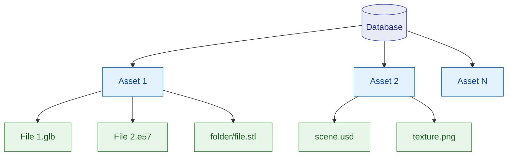

import useBaseUrl from '@docusaurus/useBaseUrl';

# Visual Asset Management System (VAMS)

:::warning[Near-production notice]
VAMS is provided as a near-production-grade solution at its default configuration. Consult with your organizational security team prior to production use. See [Security](architecture/security.md) for details.
:::

**Visual Asset Management System (VAMS)** is a purpose-built, AWS-native, open-source solution for managing, visualizing, and processing specialized visual assets used in Physical AI and Spatial Computing. VAMS provides a **single pane of glass** for an organization's spatial data source of truth — enabling any authorized user to store, search, visualize, transform, and distribute 3D models, point clouds, CAD files, and other spatial data through a web interface, CLI, or REST API.

<video controls width="100%" style={{aspectRatio: '16/9'}} src={useBaseUrl('/mp4/vams-20260420-demoReel-short.mp4')}></video>

---

## What is VAMS?

VAMS empowers users with a web browser, command-line interface, or direct API access to manage visual assets at scale. The solution leverages Amazon Simple Storage Service (Amazon S3) for high-availability, low-cost storage and provides a purpose-built API layer for digital asset management that enables custom integrations with the full breadth of the AWS ecosystem.

_VAMS deploys as a serverless architecture on AWS, supporting both commercial and GovCloud regions._

---

## Key capabilities

| Capability                      | Description                                                                                                               |
| ------------------------------- | ------------------------------------------------------------------------------------------------------------------------- |
| **Centralized asset storage**   | Store and organize 3D models, point clouds, CAD files, and media in Amazon S3 with versioning and access control          |
| **Interactive visualization**   | View assets directly in the browser with 17 built-in viewer plugins for 3D, point cloud, CAD, media, and document formats |
| **Automated processing**        | Transform assets using configurable pipelines backed by AWS Lambda, Amazon SQS, or Amazon EventBridge                     |
| **Metadata management**         | Attach, search, and validate metadata with schema enforcement across databases, assets, and files                         |
| **Fine-grained access control** | Control access with attribute-based and role-based access control (ABAC/RBAC) at both API and data entity levels          |
| **Search and discovery**        | Full-text and metadata search powered by Amazon OpenSearch with map-based geographic views                                |
| **Multi-region deployment**     | Deploy to AWS commercial regions or AWS GovCloud (US)                                                                     |

---

## Access methods

VAMS provides three primary methods for interacting with your visual assets:

-   **Web Interface** — Browser-based interface for visual asset browsing, interactive 3D viewing, drag-and-drop uploads, and workflow management.
-   **Command Line Interface** — Python CLI tool (`vamscli`) for scripted operations, CI/CD integration, bulk management, and headless environments.
-   **REST API** — Direct API access for custom application development, third-party integrations, and advanced workflow automation.

---

## Get started

|     | Guide                                                           | Description                                                            |
| --- | --------------------------------------------------------------- | ---------------------------------------------------------------------- |
| 📖  | [**Core Concepts**](concepts/overview.md)                       | Understand how VAMS organizes data using Databases, Assets, and Files  |
| 🚀  | [**Deploy VAMS**](deployment/prerequisites.md)                  | Prerequisites, configuration, and step-by-step deployment instructions |
| 📤  | [**Upload Your First Asset**](user-guide/upload-first-asset.md) | Walk through creating a database, uploading files, and viewing assets  |
| 🔌  | [**API Reference**](api/overview.md)                            | Complete REST API documentation with request and response examples     |

---

## Data organization

VAMS uses a three-level hierarchy to organize visual assets:

-   **Databases** are the top-level organizational boundary. Each database maps to an Amazon S3 bucket and defines access control, metadata schemas, and file upload restrictions.
-   **Assets** are versioned collections of files representing a logical unit of spatial data (such as a 3D scan, a building model, or a simulation environment).
-   **Files** are individual data items within an asset, stored with full version history and optional metadata and attributes.

Learn more in [Core Concepts](concepts/overview.md).
