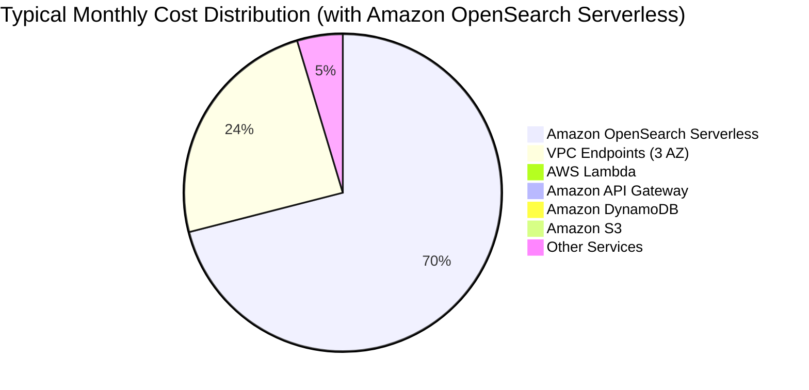

# Cost

This page provides cost guidance for deploying and operating Visual Asset Management System (VAMS) on AWS. Costs vary based on the deployment configuration, the volume of assets managed, and the processing pipelines enabled.

:::warning[Cost Responsibility]
You are responsible for the cost of the AWS services used while running VAMS. We strongly recommend setting up [billing alarms](https://docs.aws.amazon.com/AmazonCloudWatch/latest/monitoring/monitor_estimated_charges_with_cloudwatch.html) to monitor spending within the constraints of your budget.
:::

---

## Cost Model

VAMS costs are composed of two primary categories:

1. **Fixed infrastructure costs** -- Base costs for always-on services such as Amazon DynamoDB tables, Amazon API Gateway, AWS Lambda, and optionally Amazon OpenSearch Service, Amazon VPC endpoints, and web distribution (Amazon CloudFront or Application Load Balancer)
2. **Variable usage costs** -- Costs that scale with the volume of assets stored in Amazon S3, the number of API requests, and the processing pipelines executed

The most significant cost driver for most deployments is Amazon OpenSearch Service, which is optional but required for full-text search capabilities. VPC endpoints, when enabled, also contribute a meaningful fixed monthly cost.

---

## Configuration Options

VAMS cost varies based on the deployment features you enable. The following configuration options affect your monthly costs:

| Configuration                    | Description                                                                                                                       | Cost Impact                                                                                         |
| -------------------------------- | --------------------------------------------------------------------------------------------------------------------------------- | --------------------------------------------------------------------------------------------------- |
| **C-0: VPC**                     | Deploy VPC with variable endpoints based on pipeline and service needs. Option to import existing VPC and subnets with endpoints. | $0 -- $311 per month depending on endpoint count and number of Availability Zones                   |
| **C-1: Web Distribution**        | Amazon CloudFront (default) or Application Load Balancer                                                                          | Amazon CloudFront: $0 (free tier for first 1 TB). Application Load Balancer: ~$25 -- $53 per month. |
| **C-2: Amazon OpenSearch**       | Serverless (default), Provisioned, or disabled                                                                                    | Serverless: ~$703 per month. Provisioned: ~$744 -- $916 per month. Disabled: $0.                    |
| **C-3: AWS Lambda in VPC**       | Deploy all AWS Lambda functions inside VPC (optional)                                                                             | Included in VPC endpoint costs                                                                      |
| **C-4: Amazon Location Service** | Map tile retrieval for database location views (default in commercial)                                                            | ~$40 per month for 1,000 tile retrievals                                                            |
| **C-5: Processing Pipelines**    | Use-case specific pipelines (optional). Requires VPC.                                                                             | Variable based on pipeline usage (see pipeline costs below)                                         |

---

## Service-by-Service Cost Estimates

The following tables provide approximate monthly cost estimates based on three deployment sizes. All estimates exclude AWS Free Tier credits and are based on US East (N. Virginia) pricing unless otherwise noted.

### Core Infrastructure Services

| AWS Service            | Small | Medium | Large  | Notes                                                                                |
| ---------------------- | ----- | ------ | ------ | ------------------------------------------------------------------------------------ |
| **Amazon S3**          | $0.26 | $2.50  | $25.00 | 10 GB / 100 GB / 1 TB storage with proportional PUT/GET requests                     |
| **Amazon DynamoDB**    | $1.18 | $5.00  | $15.00 | On-demand pricing. Scales with number of assets, versions, and metadata records.     |
| **AWS Lambda**         | $6.00 | $15.00 | $40.00 | 5,308 MB memory, 15-minute timeout. Scales with API request volume.                  |
| **Amazon API Gateway** | $0.16 | $1.50  | $5.00  | HTTP API pricing at $1.00 per million requests                                       |
| **AWS Step Functions** | $2.21 | $10.00 | $30.00 | Scales with workflow execution frequency                                             |
| **AWS KMS**            | $1.00 | $1.00  | $3.00  | $1 per month per CMK + $0.03 per 10,000 API calls                                    |
| **Amazon Cognito**     | $0.00 | $0.00  | $27.50 | Free for first 50,000 MAU. $0.0055 per MAU beyond.                                   |
| **Amazon CloudWatch**  | $3.28 | $8.00  | $20.00 | Log ingestion and storage for audit logs, VPC flow logs, and Amazon API Gateway logs |
| **AWS CloudTrail**     | $0.00 | $2.00  | $5.00  | First trail free. Additional data events charged per 100,000 events.                 |

### Search Services (Choose One or None)

| AWS Service                       | Monthly Cost (Commercial) | Monthly Cost (GovCloud) | Notes                                                                           |
| --------------------------------- | ------------------------- | ----------------------- | ------------------------------------------------------------------------------- |
| **Amazon OpenSearch Serverless**  | ~$703.20                  | N/A                     | 2 index OCUs + 2 search OCUs minimum. 100 GB data included.                     |
| **Amazon OpenSearch Provisioned** | ~$743.66                  | ~$915.52                | 3 data nodes (r6g.large.search) + 3 master nodes (r6g.large.search), 240 GB EBS |
| **No Amazon OpenSearch**          | $0.00                     | $0.00                   | Search features disabled. Asset browsing and management remain functional.      |

:::info[Amazon OpenSearch Serverless Minimum]
Amazon OpenSearch Serverless has a minimum charge of 2 index OCUs and 2 search OCUs, which runs continuously. This is the largest fixed cost in most VAMS deployments. Consider disabling Amazon OpenSearch if full-text search is not required for your use case.
:::

### Web Distribution (Choose One)

| AWS Service                   | Monthly Cost (Commercial) | Monthly Cost (GovCloud) | Notes                                                                          |
| ----------------------------- | ------------------------- | ----------------------- | ------------------------------------------------------------------------------ |
| **Amazon CloudFront**         | $0.00                     | N/A                     | First 1 TB data transfer included in free tier. Not available in AWS GovCloud. |
| **Application Load Balancer** | ~$24.43                   | ~$52.56                 | 1 ALB with 1 TB processed. Required for AWS GovCloud deployments.              |

### Networking (Conditional)

| AWS Service                 | Monthly Cost (Commercial) | Monthly Cost (GovCloud) | Notes                                                                                                               |
| --------------------------- | ------------------------- | ----------------------- | ------------------------------------------------------------------------------------------------------------------- |
| **VPC Endpoints**           | $0 -- $240.91             | $0 -- $311.13           | 1--11 endpoints per Availability Zone (up to 3 AZ). Required when VPC is enabled. Cost depends on enabled features. |
| **Amazon Location Service** | ~$40.00                   | N/A                     | 1,000 map tile retrievals. Commercial regions only.                                                                 |
| **AWS WAF**                 | ~$5.00                    | ~$5.00                  | Base cost for web ACL. Additional rules and request volume add cost.                                                |

---

## Pipeline Costs

Processing pipeline costs are variable and depend on the number of assets processed, file sizes, and processing duration. The following estimates are based on moderate usage patterns.

| Pipeline Service                      | Quantity                           | Cost (Commercial) | Cost (GovCloud) |
| ------------------------------------- | ---------------------------------- | ----------------- | --------------- |
| **AWS Batch (Fargate)**               | 10 hours of processing             | $3.56             | $4.88           |
| **Amazon S3 (Pipeline Output)**       | 300 GB storage, 30 GB transfer out | $9.60             | $16.34          |
| **Amazon CloudWatch (Pipeline Logs)** | 1 GB logs                          | $3.28             | $4.12           |
| **Amazon Bedrock (GenAI Labeling)**   | 1M tokens (Claude Sonnet)          | $18.00            | N/A             |
| **Amazon ECR**                        | 40 GB container images (in-region) | $4.00             | $4.00           |

:::tip[Pipeline Cost Optimization]
Pipelines are only deployed when their configuration flag is enabled. Disable unused pipelines to avoid container image storage costs and unnecessary VPC endpoint charges. Use `autoRegisterAutoTriggerOnFileUpload` selectively to prevent unintended pipeline executions on every upload.
:::

---

## Cost Variation Factors

The following factors significantly influence your monthly VAMS costs:

### Storage Volume

Amazon S3 costs are directly proportional to the total volume of assets stored, including original uploads, pipeline-generated outputs, and preview thumbnails. Point cloud processing through the Potree pipeline generates octree representations that can be 1--2x the size of the original data.

### API Request Volume

AWS Lambda and Amazon API Gateway costs scale with the number of API requests. High-frequency programmatic access through the CLI or API, particularly for search and listing operations, increases compute costs.

### Pipeline Execution Frequency

Each pipeline execution incurs AWS Batch Fargate compute costs, Amazon S3 data transfer costs, and Amazon CloudWatch logging costs. Enabling auto-trigger on file upload for multiple pipelines multiplies processing costs per asset.

### Amazon OpenSearch Configuration

The choice between Amazon OpenSearch Serverless and Provisioned significantly affects costs. Serverless charges by OCU-hour with a minimum of 4 OCUs. Provisioned charges by instance type and Amazon EBS volume. Both options represent the largest fixed cost component for most deployments.

### VPC Endpoint Count

Each VPC interface endpoint costs approximately $7.30 per month per Availability Zone. Enabling more pipelines and services increases the number of required VPC endpoints. A deployment with all features enabled across 3 Availability Zones can require up to 11 endpoints.

---

## Deployment Size Estimates

The following estimates represent approximate total monthly costs for three deployment profiles.

| Deployment Profile | Configuration                                                                                               | Estimated Monthly Cost |
| ------------------ | ----------------------------------------------------------------------------------------------------------- | ---------------------- |
| **Minimal**        | Amazon CloudFront, no Amazon OpenSearch, no VPC, no pipelines                                               | $10 -- $15             |
| **Standard**       | Amazon CloudFront, Amazon OpenSearch Serverless, VPC (1 AZ), basic pipelines                                | $800 -- $1,000         |
| **Full-Featured**  | Amazon CloudFront or ALB, Amazon OpenSearch Provisioned, VPC (3 AZ), all pipelines, Amazon Location Service | $1,200 -- $1,800+      |
| **GovCloud Full**  | ALB, Amazon OpenSearch Provisioned, VPC (3 AZ), AWS KMS CMK, FIPS, pipelines                                | $1,500 -- $2,200+      |

:::note[Estimates Only]
These cost estimates are approximations based on typical usage patterns. Actual costs vary based on your specific usage, data volumes, API request rates, and AWS pricing changes. Use the [AWS Pricing Calculator](https://calculator.aws/) for detailed estimates tailored to your deployment.
:::

---

## Cost Optimization Recommendations

1. **Disable Amazon OpenSearch if not needed** -- This removes the largest fixed cost ($700+ per month). Basic asset browsing and management work without search.
2. **Use Amazon OpenSearch Serverless over Provisioned** -- Serverless provides zero operational overhead with comparable cost for typical VAMS workloads.
3. **Minimize VPC endpoints** -- Only enable VPC when required by pipelines or AWS GovCloud. Import an existing VPC with endpoints to avoid duplicate costs.
4. **Enable pipelines selectively** -- Each pipeline adds container image storage and VPC endpoint costs. Enable only the pipelines you actively use.
5. **Monitor auto-trigger pipelines** -- Auto-triggered pipelines execute on every file upload. Ensure this behavior is intended to avoid unexpected processing costs.
6. **Set billing alarms** -- Configure Amazon CloudWatch billing alarms at 50%, 75%, and 100% of your budget threshold.
7. **Review Amazon S3 storage classes** -- For infrequently accessed assets, consider configuring Amazon S3 lifecycle policies on asset buckets.
8. **Use Amazon CloudFront** -- When deploying in commercial regions, Amazon CloudFront provides free tier data transfer and caching that reduces origin request costs.
