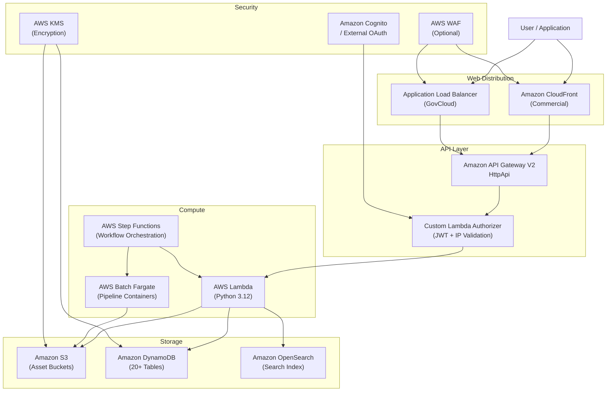

# Solution Overview

Visual Asset Management System (VAMS) is a purpose-built, AWS-native solution for managing, visualizing, and processing specialized visual assets — including 3D models, point clouds, CAD files, geospatial data, and simulation environments — used in Physical AI and Spatial Computing.

Organizations working with 3D data face a common set of challenges: spatial assets are large and diverse in format, siloed across local systems and specialized tools, difficult to version or track lineage, and inaccessible to non-engineering teams that need them. VAMS solves the challenge of **spatial data sovereignty and access democratization** by providing a single pane of glass for an organization's spatial data source of truth.

Through a web interface, command-line tool, and REST API, VAMS enables any authorized user — not just engineers — to store, search, visualize, transform, and distribute visual assets without requiring specialized desktop software, restrictive licenses, or direct access to storage systems. The solution deploys entirely within your AWS account, ensuring full data sovereignty and control while supporting both commercial AWS and AWS GovCloud regions.

### Data types

VAMS can store, manage, and version **any file type** — it is not limited to a fixed set of formats. However, the following data types have built-in viewer and pipeline support out of the box. Because VAMS is extensible through custom viewer plugins and processing pipelines, this list represents the current set of native integrations, not a limitation of the platform.

| Category                        | Formats with Built-in Viewer/Pipeline Support                         |
| ------------------------------- | --------------------------------------------------------------------- |
| **3D Meshes**                   | glTF, GLB, OBJ, STL, FBX, PLY, DAE, 3DS, 3MF                          |
| **CAD Models**                  | STEP, STP, IGES, BREP                                                 |
| **Point Clouds**                | E57, LAS, LAZ                                                         |
| **Universal Scene Description** | USD, USDA, USDC, USDZ                                                 |
| **Gaussian Splats**             | PLY (splat), SPZ, SOG                                                 |
| **Documents and Media**         | PDF, images, video, audio, CSV, HTML, text                            |
| **Any other file type**         | Stored and versioned in Amazon S3; viewable via custom viewer plugins |

For the complete viewer-to-extension mapping, see [File Viewers](../concepts/viewers.md).

Associated data such as textures, materials, bills of materials, quality analysis data, temporal (4D) change data, and AI training labels can be managed as asset files or captured through the metadata and attribute system.

### Open-source extensibility

As an **open-source project** (Apache 2.0), VAMS is designed for extensibility. Organizations can integrate new viewer plugins, upstream data sources, downstream consumers, and custom workflow pipelines — adapting the platform to their specific requirements without vendor lock-in. Several ISVs have built commercial products on top of VAMS, and enterprise customers across defense, energy, manufacturing, and construction have adopted and contributed to the solution.

:::info[Current Version]
VAMS supports Python 3.12 Lambda runtime, Node.js 20.x, React 17 with Vite build tooling, and AWS CDK v2 infrastructure. See `infra/config/config.ts` for the current version.
:::

---

## Key Capabilities

VAMS delivers the following core capabilities:

-   **Asset Management** -- Organize visual assets across databases with metadata, tagging, versioning, and relationship linking
-   **Interactive Visualization** -- View 3D models, point clouds, CAD files, Gaussian splats, USD scenes, and media files directly in the browser through 17 built-in viewer plugins
-   **Automated Processing** -- Execute pipelines for 3D conversion, metadata extraction, point cloud processing, preview thumbnail generation, and AI-powered labeling
-   **Intelligent Search** -- Full-text and attribute-based search powered by Amazon OpenSearch Service across assets and files
-   **Fine-Grained Access Control** -- Two-tier Attribute-Based and Role-Based Access Control (ABAC/RBAC) using Casbin policy enforcement
-   **Multi-Region Deployment** -- Deploy to AWS commercial regions or AWS GovCloud (US) with full partition awareness

---

## Access Methods

VAMS provides three primary methods for interacting with your visual asset management system. Each method is designed for different use cases and user profiles.

| Feature               | Web Interface                        | Command Line Interface (CLI)                 | Direct API Access                  |
| --------------------- | ------------------------------------ | -------------------------------------------- | ---------------------------------- |
| **Best for**          | Interactive use, visualization       | Automation, scripting, bulk operations       | Custom integrations, applications  |
| **Asset Management**  | Visual interface with drag-and-drop  | Programmatic control with 18+ command groups | Full programmatic control via REST |
| **File Upload**       | Drag-and-drop with progress tracking | Advanced chunking and retry logic            | Custom upload with presigned URLs  |
| **3D Viewing**        | 17 interactive viewer plugins        | Not applicable                               | Not applicable                     |
| **Automation**        | Manual operations                    | Full automation with profile support         | Complete automation control        |
| **Bulk Operations**   | Limited                              | Optimized for bulk tasks                     | Custom bulk implementations        |
| **CI/CD Integration** | Not suitable                         | Designed for pipeline integration            | Full integration flexibility       |
| **Output Modes**      | Visual dashboard                     | JSON output mode (`--json-output`)           | Native JSON responses              |
| **Learning Curve**    | Minimal                              | Moderate                                     | Requires API knowledge             |

### Web Interface

The web-based interface provides an intuitive, browser-based experience for visual asset browsing, interactive 3D model viewing, drag-and-drop file uploads, workflow and pipeline management, and asset organization. The interface supports both dark and light themes, with dark mode as the default.

### Command Line Interface (VamsCLI)

The VamsCLI offers powerful automation capabilities through 18+ command groups covering assets, databases, files, metadata, pipelines, workflows, search, permissions, user management, and API key management. It supports multi-environment profile management and machine-readable JSON output for scripting.

### Direct API Access

The REST API provides full programmatic access for custom application development, third-party system integrations, microservice architectures, and advanced workflow automation. All API endpoints are secured through a custom AWS Lambda authorizer with JWT validation and optional IP range restrictions.

---

## Supported Deployment Modes

VAMS supports two primary deployment modes to meet different organizational and regulatory requirements.

| Deployment Mode       | Web Distribution                      | Search                                      | Key Characteristics                                                                                                                                       |
| --------------------- | ------------------------------------- | ------------------------------------------- | --------------------------------------------------------------------------------------------------------------------------------------------------------- |
| **Commercial AWS**    | Amazon CloudFront + Amazon S3         | Amazon OpenSearch Serverless or Provisioned | Default mode. Full feature set including Amazon Location Service, AWS WAF, and all viewer plugins.                                                        |
| **AWS GovCloud (US)** | Application Load Balancer + Amazon S3 | Amazon OpenSearch Provisioned               | No Amazon CloudFront. FIPS endpoint support. VPC required. Supports full VPC isolation with VPC endpoints for restricted environments with VPC isolation. |

:::warning[GovCloud Constraints]
AWS GovCloud deployments require `useGlobalVpc.enabled` set to `true`, `useCloudFront.enabled` set to `false`, and `useLocationService.enabled` set to `false`.
:::

---

## Architecture Overview

VAMS deploys as an AWS CloudFormation stack managed by AWS CDK, consisting of 10 nested stacks that provide modular resource organization.

The request flow follows this path: users authenticate through Amazon Cognito or an external OAuth provider, then access the application through Amazon CloudFront (commercial) or an Application Load Balancer (GovCloud). All API requests pass through Amazon API Gateway V2, which invokes a custom Lambda authorizer for JWT validation and IP-based access control before routing to the appropriate Lambda handler.

For a detailed architecture diagram, see the [Architecture Components](../architecture/overview.md) section of the Developer Guide.

---

## Partner and Integration Ecosystem

VAMS integrates with a range of AWS partner solutions and open-source projects for extended visualization and processing capabilities.

### Open-Source Integrations

| Integration                                                                                                                                                 | Category          | Description                                                                  |
| ----------------------------------------------------------------------------------------------------------------------------------------------------------- | ----------------- | ---------------------------------------------------------------------------- |
| [Online 3D Viewer](https://3dviewer.net/)                                                                                                                   | Viewer            | Generalized 3D model viewing for Rhinoceros, AMF, BIM, OFF, and VRML formats |
| [Potree](https://potree.github.io/)                                                                                                                         | Viewer + Pipeline | Point cloud viewing and processing for E57, LAS, and LAZ files               |
| [BabylonJS](https://www.babylonjs.com/)                                                                                                                     | Viewer            | Gaussian splat visualization with WebXR support                              |
| [PlayCanvas](https://playcanvas.com/)                                                                                                                       | Viewer            | Gaussian splat visualization with orbit camera and sorting                   |
| [CesiumJS](https://cesium.com/platform/cesiumjs/)                                                                                                           | Viewer            | 3D Tileset viewing with geospatial capabilities                              |
| [Needle Engine](https://needle.tools/)                                                                                                                      | Viewer            | USD (Universal Scene Description) viewing with WebAssembly support           |
| [Three.js](https://threejs.org/)                                                                                                                            | Viewer            | Primary viewer for GLTF, GLB, OBJ, FBX, STL, STEP, IGES, and more            |
| [Trimesh](https://trimesh.org/)                                                                                                                             | Pipeline          | 3D mesh conversion and metadata extraction                                   |
| [CADQuery](https://github.com/CadQuery/cadquery)                                                                                                            | Pipeline          | Open-standard CAD conversion and metadata extraction                         |
| [Blender](https://www.blender.org/)                                                                                                                         | Pipeline          | Preview file generation and metadata extraction                              |
| [3D Reconstruction Toolkit](https://github.com/aws-solutions-library-samples/guidance-for-open-source-3d-reconstruction-toolbox-for-gaussian-splats-on-aws) | Pipeline          | Gaussian splat generation from media files                                   |
| [Garnet Framework](https://garnet-framework.dev/)                                                                                                           | Addon             | Data synchronization to external NGSI-LD knowledge graphs                    |
| [NVIDIA Isaac Lab](https://github.com/isaac-sim/IsaacSim)                                                                                                   | Pipeline          | Reinforcement learning training and evaluation                               |

### Licensed Integrations

| Integration                                 | Category          | Description                                                           |
| ------------------------------------------- | ----------------- | --------------------------------------------------------------------- |
| [RapidPipeline](https://rapidpipeline.com/) | Pipeline          | Spatial data conversions and optimizations                            |
| [VNTANA](https://www.vntana.com/)           | Viewer + Pipeline | ModelOps for spatial data conversions, optimizations, and web viewing |
| [Veerum](https://veerum.com/)               | Viewer            | Advanced point cloud and 3D Tileset viewing                           |

:::tip[Extensibility]
VAMS is designed for extensibility. You can add custom viewer plugins, processing pipelines, and third-party integrations to tailor the system for your specific requirements. See the [Developer Guide](../developer/setup.md) for instructions on writing custom pipelines and viewer plugins.
:::

---

## Resources

| Resource                   | Link                                                                                                                      |
| -------------------------- | ------------------------------------------------------------------------------------------------------------------------- |
| **GitHub Repository**      | [github.com/awslabs/visual-asset-management-system](https://github.com/awslabs/visual-asset-management-system)            |
| **AWS Solutions Guidance** | [Visual Asset Management System on AWS](https://aws.amazon.com/solutions/guidance/visual-asset-management-system-on-aws/) |

---

## Additional links

### AWS Blog posts

-   [GPU-Accelerated Robotic Simulation Training with NVIDIA Isaac Lab in VAMS](https://aws.amazon.com/blogs/spatial/gpu-accelerated-robotic-simulation-training-with-nvidia-isaac-lab-in-vams/) — Learn how VAMS integrates with NVIDIA Isaac Lab for reinforcement learning training and evaluation on AWS GPU instances.
-   [Building Production-Ready 3D Pipelines with AWS VAMS and 4D Pipeline](https://aws.amazon.com/blogs/spatial/building-production-ready-3d-pipelines-with-aws-visual-asset-management-system-vams-and-4d-pipeline/) — Explore how to build scalable 3D processing pipelines using VAMS with partner integrations.
