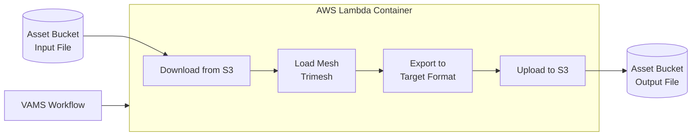

# 3D Basic Conversion Pipeline

The 3D Basic Conversion pipeline converts 3D mesh files between common interchange formats using the Trimesh library. It runs as a containerized AWS Lambda function, making it a lightweight and fast option for format conversion without requiring a VPC or AWS Batch infrastructure. This pipeline is enabled by default in new VAMS deployments.

## Supported Formats

The pipeline supports conversion between any of the following formats:

| Format | Extension | Description |
|:---|:---|:---|
| STL | `.stl` | Stereolithography -- widely used in 3D printing and CAD |
| OBJ | `.obj` | Wavefront OBJ -- common mesh interchange format |
| PLY | `.ply` | Polygon File Format -- supports vertex colors and normals |
| GLTF | `.gltf` | GL Transmission Format -- open standard for 3D scenes |
| GLB | `.glb` | Binary GLTF -- single-file variant of GLTF |
| 3MF | `.3mf` | 3D Manufacturing Format -- 3D printing standard |
| XAML | `.xaml` | XAML 3D -- Microsoft 3D format |
| 3DXML | `.3dxml` | Dassault Systemes 3D XML format |
| DAE | `.dae` | COLLADA -- collaborative design activity format |
| XYZ | `.xyz` | Point cloud text format -- simple ASCII coordinate data |

:::note[Bidirectional Conversion]
Any supported format can be converted to any other supported format. For example, you can convert STL to GLB, OBJ to PLY, or DAE to GLTF. The pipeline uses Trimesh's import/export capabilities to handle the translation.
:::


## Architecture



### Execution Type

This pipeline uses the **Lambda** execution type with synchronous invocation. It does not require an AWS Step Functions task token callback because the Lambda function returns results directly. The pipeline is registered in VAMS as a synchronous pipeline.

:::warning[No Task Token]
This pipeline must be registered as NOT needing a task token callback. If a workflow passes a `TaskToken` to this pipeline, it will reject the request with an error.
:::


### Processing Flow

1. The Lambda function receives the request body containing the input Amazon S3 URI, output Amazon S3 URI, and target output format.
2. The input file is downloaded from the asset bucket to the Lambda container's `/tmp` directory.
3. Trimesh loads the mesh file, performing automatic format detection based on the file extension.
4. The mesh is exported to the specified target format using Trimesh's export capabilities.
5. The converted file is uploaded to the output path in the asset bucket using multipart upload for large files.

## Configuration

Enable this pipeline in `infra/config/config.json`:

```json
{
    "app": {
        "pipelines": {
            "useConversion3dBasic": {
                "enabled": true,
                "autoRegisterWithVAMS": true
            }
        }
    }
}
```

### Configuration Options

| Option | Default | Description |
|:---|:---|:---|
| `enabled` | `true` | Deploy the 3D basic conversion pipeline. This is the only built-in pipeline enabled by default. |
| `autoRegisterWithVAMS` | `true` | Automatically register the pipeline and workflow during CDK deployment. |

:::tip[Enabled by Default]
Unlike other built-in pipelines, the 3D Basic Conversion pipeline is enabled by default (`enabled: true`) because it is a lightweight Lambda-based pipeline that does not require a VPC or additional compute infrastructure.
:::


## Input Parameters

When executing the pipeline through a workflow, the following parameters are provided:

| Parameter | Required | Description |
|:---|:---|:---|
| `inputS3AssetFilePath` | Yes | Amazon S3 URI of the input file (e.g., `s3://bucket/key/model.stl`) |
| `outputS3AssetFilesPath` | Yes | Amazon S3 URI of the output directory (e.g., `s3://bucket/key/`) |
| `outputType` | Yes | Target file extension including the dot (e.g., `.glb`, `.obj`, `.ply`) |

### Output Naming

The output file retains the original filename but with the new extension. For example, converting `pump.stl` to GLB produces `pump.glb` in the output directory.

## Prerequisites

### No VPC Required

This pipeline runs as a containerized Lambda function and does not require a VPC. It operates independently of the global VPC setting, although it will be placed in the VPC if `app.useGlobalVpc.useForAllLambdas` is set to `true`.

### Container Image

The Lambda container image is built during CDK deployment from `backendPipelines/conversion/3dBasic/lambdaContainer/Dockerfile`. It includes:

- **Python 3.12** -- Lambda runtime
- **Trimesh** -- 3D mesh loading and export library
- **boto3** -- AWS SDK for Amazon S3 operations

## Infrastructure Components

| Resource | Service | Purpose |
|:---|:---|:---|
| Container Lambda Function | AWS Lambda | Mesh conversion execution |
| Container Image | Amazon ECR | Trimesh container image |
| Step Functions State Machine | AWS Step Functions | Workflow orchestration |
| Lambda Function (vamsExecute) | AWS Lambda | Pipeline coordination |

## Limitations

| Constraint | Details |
|:---|:---|
| Maximum file size | Limited by Lambda container `/tmp` storage (10 GB) |
| Execution timeout | 15 minutes (Lambda maximum) |
| Geometry only | Converts mesh geometry; complex materials, animations, or scene hierarchies may not transfer between all formats |
| No texture baking | Texture references are preserved where both input and output formats support them, but textures are not embedded or converted |

## Related Resources

- [Pipeline System Overview](overview.md)
- [CAD/Mesh Metadata Extraction Pipeline](cad-mesh-extraction.md) -- extracts metadata from similar file formats
- [3D Preview Thumbnail Pipeline](3d-thumbnail.md) -- generates visual previews from converted files
