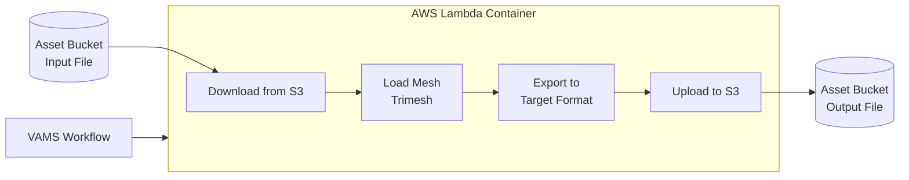

# 3D Basic Conversion Pipeline

The 3D Basic Conversion pipeline converts 3D mesh files between common interchange formats using the Trimesh library. It runs as a containerized AWS Lambda function, making it a lightweight and fast option for format conversion without requiring a VPC or AWS Batch infrastructure. This pipeline is enabled by default in new VAMS deployments.

## Supported Formats

The pipeline reads the following formats. Six of them are also available as a conversion target; XYZ is read only.

| Format | Extension | Direction        | Description                                               |
| ------ | --------- | ---------------- | --------------------------------------------------------- |
| STL    | `.stl`    | Input and output | Stereolithography -- widely used in 3D printing and CAD   |
| OBJ    | `.obj`    | Input and output | Wavefront OBJ -- common mesh interchange format           |
| PLY    | `.ply`    | Input and output | Polygon File Format -- supports vertex colors and normals |
| GLTF   | `.gltf`   | Input and output | GL Transmission Format -- open standard for 3D scenes     |
| GLB    | `.glb`    | Input and output | Binary GLTF -- single-file variant of GLTF                |
| XYZ    | `.xyz`    | Input only       | Point cloud text format -- simple ASCII coordinate data   |

:::note[Conversion Directions]
Any format marked **Input and output** can be converted to any other format marked **Input and output**. For example, you can convert STL to GLB, OBJ to PLY, or PLY to GLTF. The pipeline uses Trimesh's import/export capabilities to handle the translation.

XYZ is an input-only format. Trimesh reads an XYZ file as a point cloud, and its XYZ exporter cannot write one back, so a run that names `.xyz` as its target is rejected before the input file is downloaded. Convert an XYZ point cloud to one of the five output formats instead.
:::

## Architecture


```mermaid
flowchart LR
    subgraph Lambda["AWS Lambda Container"]
        DL[Download from S3]
        Load[Load Mesh<br/>Trimesh]
        Export[Export to<br/>Target Format]
        UL[Upload to S3]
    end

    S3In[(Asset Bucket<br/>Input File)]
    S3Out[(Asset Bucket<br/>Output File)]
    API[VAMS Workflow]

    API --> Lambda
    S3In --> DL
    DL --> Load
    Load --> Export
    Export --> UL
    UL --> S3Out
```

### Execution Type

This pipeline uses the **Lambda** execution type with synchronous invocation. It does not require an AWS Step Functions task token callback because the Lambda function returns results directly. The pipeline is registered in VAMS as a synchronous pipeline.

:::warning[No Task Token]
This pipeline must be registered as NOT needing a task token callback. If a workflow passes a `TaskToken` to this pipeline, it will reject the request with an error.
:::

### Processing Flow

1. The Lambda function receives the request body containing the input Amazon S3 URI, output Amazon S3 URI, and target output format.
2. The input file is downloaded from the asset bucket to the Lambda container's `/tmp` directory.
3. Trimesh loads the mesh file, performing automatic format detection based on the file extension.
4. The mesh is exported to the specified target format using Trimesh's export capabilities.
5. The converted file is uploaded to the output path in the asset bucket using multipart upload for large files.

## Configuration

Enable this pipeline in `infra/config/config.json`:

```json
{
    "app": {
        "pipelines": {
            "useConversion3dBasic": {
                "enabled": true,
                "autoRegisterWithVAMS": true
            }
        }
    }
}
```

### Configuration Options

| Option                 | Default | Description                                                                                     |
| ---------------------- | ------- | ----------------------------------------------------------------------------------------------- |
| `enabled`              | `true`  | Deploy the 3D basic conversion pipeline. This is the only built-in pipeline enabled by default. |
| `autoRegisterWithVAMS` | `true`  | Automatically register the pipeline and workflow during CDK deployment.                         |

:::tip[Enabled by Default]
Unlike other built-in pipelines, the 3D Basic Conversion pipeline is enabled by default (`enabled: true`) because it is a lightweight Lambda-based pipeline that does not require a VPC or additional compute infrastructure.
:::

## Input Parameters

When executing the pipeline through a workflow, the following parameters are provided:

| Parameter                | Required | Description                                                            |
| ------------------------ | -------- | ---------------------------------------------------------------------- |
| `inputS3AssetFilePath`   | Yes      | Amazon S3 URI of the input file (e.g., `s3://bucket/key/model.stl`)    |
| `outputS3AssetFilesPath` | Yes      | Amazon S3 URI of the output directory (e.g., `s3://bucket/key/`)       |
| `outputType`             | Yes      | Target file extension including the dot (e.g., `.glb`, `.obj`, `.ply`) |

The Amazon S3 paths come from the workflow. `outputType` comes from the configuration body of the pipeline template the run uses. Selecting a template is mandatory for this pipeline (`systemConfig.requireTemplate` is `true`); deployment registers one template per target format -- `convert-to-glb`, `convert-to-gltf`, `convert-to-obj`, and `convert-to-stl`. To convert to another output format, either register a pipeline template whose configuration body sets that `outputType`, or override the selected template's body for a single run -- the pipeline permits a per-run override (`systemConfig.allowCustomTemplateOverride` is `true`). An `outputType` the pipeline cannot write fails the execution with `Output format <extension> not supported by Trimesh pipeline`.

### Output Naming

The output file retains the original filename but with the new extension. For example, converting `pump.stl` to GLB produces `pump.glb` in the output directory.

## Prerequisites

### No VPC Required

This pipeline runs as a containerized Lambda function and does not require a VPC. It operates independently of the global VPC setting, although it will be placed in the VPC if `app.useGlobalVpc.useForAllLambdas` is set to `true`.

### Container Image

The Lambda container image is built during CDK deployment from `backendPipelines/conversion/3dBasic/lambdaContainer/Dockerfile`. It includes:

-   **Python 3.12** -- Lambda runtime
-   **Trimesh** -- 3D mesh loading and export library
-   **boto3** -- AWS SDK for Amazon S3 operations

## Infrastructure Components

| Resource                      | Service            | Purpose                   |
| ----------------------------- | ------------------ | ------------------------- |
| Container Lambda Function     | AWS Lambda         | Mesh conversion execution |
| Container Image               | Amazon ECR         | Trimesh container image   |
| Step Functions State Machine  | AWS Step Functions | Workflow orchestration    |
| Lambda Function (vamsExecute) | AWS Lambda         | Pipeline coordination     |

## Limitations

| Constraint        | Details                                                                                                                       |
| ----------------- | ----------------------------------------------------------------------------------------------------------------------------- |
| Maximum file size | Bounded by function memory, not by disk -- see the note below                                                                 |
| Execution timeout | 15 minutes (Lambda maximum)                                                                                                   |
| Geometry only     | Converts mesh geometry; complex materials, animations, or scene hierarchies may not transfer between all formats              |
| No texture baking | Texture references are preserved where both input and output formats support them, but textures are not embedded or converted |

Two AWS Lambda quotas bound the largest model the pipeline can convert:

| Bound             | Value                                                            | What it holds                                                                                          |
| ----------------- | ---------------------------------------------------------------- | ------------------------------------------------------------------------------------------------------ |
| Function memory   | `LAMBDA_MEMORY_SIZE` (`infra/config/config.ts`)                  | The whole mesh, loaded by trimesh before it is exported                                                |
| Ephemeral storage | `CONVERSION_EPHEMERAL_STORAGE` (`conversion3dBasicFunctions.ts`) | The downloaded input, the export, and any companion files a `.gltf` export writes -- all in one `/tmp` |

:::note[Memory is the binding constraint, not disk]
trimesh loads the whole mesh into memory to export it, so the practical ceiling comes from the configured function memory. The ephemeral storage budget only has to be large enough that disk is not the limit reached first -- raising it past the memory bound moves where the failure happens rather than raising the supported file size. An uncompressed export (STL from GLB, for example) is larger than the input it came from, so both copies count against the same budget.
:::

## Related Resources

-   [Pipeline System Overview](overview.md)
-   [CAD/Mesh Metadata Extraction Pipeline](cad-mesh-extraction.md) -- extracts metadata from similar file formats
-   [3D Preview Thumbnail Pipeline](3d-thumbnail.md) -- generates visual previews from converted files
