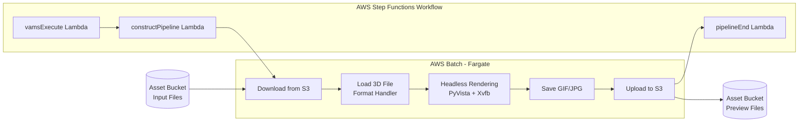

# 3D Preview Thumbnail Pipeline

The 3D Preview Thumbnail pipeline generates animated GIF or static image previews from 3D files, providing visual thumbnails for assets in the VAMS web interface. It supports a wide range of mesh, point cloud, CAD, and USD file formats. The pipeline uses CPU-based headless rendering with PyVista, VTK, and Xvfb inside an AWS Batch Fargate container.

## Supported Formats

### Mesh Formats

| Format      | Extension | Library                                     |
| :---------- | :-------- | :------------------------------------------ |
| PLY         | `.ply`    | Trimesh                                     |
| STL         | `.stl`    | Trimesh                                     |
| OBJ         | `.obj`    | Trimesh                                     |
| GLB         | `.glb`    | Trimesh                                     |
| GLTF        | `.gltf`   | Trimesh (with external dependency download) |
| FBX         | `.fbx`    | Trimesh                                     |
| DRC (Draco) | `.drc`    | Trimesh                                     |

### Point Cloud Formats

| Format | Extension | Library        |
| :----- | :-------- | :------------- |
| LAS    | `.las`    | laspy          |
| LAZ    | `.laz`    | laspy + laszip |
| E57    | `.e57`    | pye57          |
| PTX    | `.ptx`    | Open3D         |
| PCD    | `.pcd`    | Open3D         |
| FLS    | `.fls`    | Open3D         |
| FWS    | `.fws`    | Open3D         |

### CAD Formats

| Format | Extension       | Library                 |
| :----- | :-------------- | :---------------------- |
| STEP   | `.stp`, `.step` | CadQuery / Open CASCADE |

### USD Formats

| Format | Extension | Library       |
| :----- | :-------- | :------------ |
| USD    | `.usd`    | OpenUSD (pxr) |
| USDA   | `.usda`   | OpenUSD (pxr) |
| USDC   | `.usdc`   | OpenUSD (pxr) |
| USDZ   | `.usdz`   | OpenUSD (pxr) |

## Architecture



### Processing Steps

1. **Download** -- The container downloads the input file from the asset Amazon S3 bucket. For GLTF files, external dependencies (buffers, textures) are also downloaded.
2. **Load** -- A format-specific handler loads the file into a PyVista PolyData object. The handler is selected based on file extension: mesh, point cloud, CAD, or USD.
3. **Normalize** -- The pipeline detects and normalizes the coordinate up-axis to Y-up for consistent rendering. Z-up formats (LAS, LAZ, E57, STL, etc.) are rotated automatically. Variable formats use a bounding-box heuristic.
4. **Render** -- PyVista generates rotating preview frames using headless off-screen rendering via Xvfb. If animated rendering fails, the pipeline falls back to a single static frame.
5. **Save** -- Multiple frames are assembled into an animated GIF with automatic size optimization. A single frame is saved as a JPEG. The pipeline ensures the output stays under a size limit for efficient web display.
6. **Upload** -- The preview file is uploaded to the asset bucket alongside the source file, preserving the relative directory structure.

### Output Files

The pipeline generates preview files with the following naming convention:

```
<original_filename>.previewFile.gif    (animated, multi-frame)
<original_filename>.previewFile.jpg    (static, single-frame fallback)
```

These files are written to `outputS3AssetFilesPath`, which maps to the asset bucket. The relative subdirectory from the input path is preserved so the VAMS process-output step can locate and register the previews correctly.

:::note[Relative Path Preservation]
If the input file is at `<assetId>/subfolder/model.glb`, the preview is written to `<assetId>/subfolder/model.glb.previewFile.gif`. The `assetId` is threaded through the pipeline from the workflow state to ensure correct path computation.
:::

## Configuration

Enable this pipeline in `infra/config/config.json`:

```json
{
    "app": {
        "pipelines": {
            "usePreview3dThumbnail": {
                "enabled": true,
                "autoRegisterWithVAMS": true,
                "autoRegisterAutoTriggerOnFileUpload": true
            }
        }
    }
}
```

### Configuration Options

| Option                                | Default | Description                                                              |
| :------------------------------------ | :------ | :----------------------------------------------------------------------- |
| `enabled`                             | `false` | Deploy the 3D thumbnail pipeline infrastructure. Enables the global VPC. |
| `autoRegisterWithVAMS`                | `false` | Automatically register the pipeline and workflow during CDK deployment.  |
| `autoRegisterAutoTriggerOnFileUpload` | `false` | Automatically trigger the pipeline when supported 3D files are uploaded. |

:::warning[License Notice]
This pipeline is disabled by default because it depends on libraries with LGPL licenses (CadQuery/Open CASCADE for STEP file support). Review the `requirements.txt` file in the container directory and consult your legal team before enabling this pipeline. Other format handlers use MIT-licensed or Apache-licensed libraries.
:::

## Input Parameters

When executing the pipeline manually or via API, you can pass the following input parameters:

| Parameter                       | Type    | Default | Description                                                                                                                                               |
| :------------------------------ | :------ | :------ | :-------------------------------------------------------------------------------------------------------------------------------------------------------- |
| `overwriteExistingPreviewFiles` | boolean | `true`  | When `true`, regenerates preview files even if they already exist for the input file. When `false`, the pipeline skips files that already have a preview. |

### Example Input Parameters

```json
{
    "inputParameters": "{\"overwriteExistingPreviewFiles\": true}"
}
```

## Limits and Constraints

| Constraint                         | Value                       |
| :--------------------------------- | :-------------------------- |
| Maximum input file size            | 100 GB                      |
| Container ephemeral storage        | 200 GiB                     |
| Point cloud downsampling threshold | 20 million points           |
| Rendering method                   | CPU-based (no GPU required) |

:::tip[Large Point Clouds]
Point clouds exceeding 20 million points are automatically downsampled for rendering performance. The original file is not modified; only the rendering input is reduced.
:::

## Prerequisites

### VPC

This pipeline runs on AWS Batch with AWS Fargate. Enabling it automatically enables the global VPC and creates the necessary VPC endpoints for AWS Batch, Amazon ECR, and Amazon ECR Docker.

### Container Image

The container image is built during CDK deployment from `backendPipelines/preview/3dThumbnail/container/Dockerfile`. It is based on Python 3.12 slim and includes:

-   **PyVista / VTK** -- 3D rendering engine (MIT license)
-   **Trimesh** -- Mesh loading for PLY, STL, OBJ, GLB, GLTF, FBX, DRC (MIT license)
-   **laspy** -- LAS/LAZ point cloud reading (BSD license)
-   **pye57** -- E57 point cloud reading (MIT license)
-   **Open3D** -- Additional point cloud formats: PTX, PCD, FLS, FWS (MIT license)
-   **CadQuery** -- STEP/STP CAD file support (LGPL license)
-   **OpenUSD (pxr)** -- USD format support (Modified Apache 2.0 license)
-   **Xvfb** -- Virtual framebuffer for headless rendering

## How It Works

1. The workflow triggers the `vamsExecute` Lambda function with the input file path, all S3 output paths, and the `assetId`.
2. The `constructPipeline` Lambda function builds a `PREVIEW_3D_THUMBNAIL` stage definition, directing output to `outputS3AssetFilesPath` (the asset bucket).
3. AWS Batch submits an AWS Fargate job. The container starts Xvfb for headless rendering, then runs the preview pipeline.
4. The container downloads the input file, loads it with the appropriate format handler, normalizes the up-axis, renders rotating frames, saves the output as GIF or JPEG, and uploads it to Amazon S3.
5. AWS Step Functions receives the task token callback, and the process-output step registers the preview file in VAMS.

## Related Resources

-   [Pipeline System Overview](overview.md)
-   [Potree Point Cloud Viewer Pipeline](potree-viewer.md) -- interactive point cloud visualization (complementary to thumbnail previews)
-   [CAD/Mesh Metadata Extraction Pipeline](cad-mesh-extraction.md) -- extracts metadata from similar file formats
